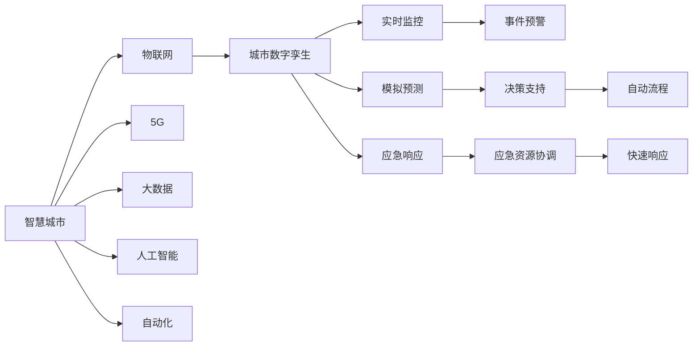

                 

# 未来的智慧城市：2050年的城市数字孪生与智慧应急

> 关键词：智慧城市,数字孪生,城市应急,物联网(IoT),5G,大数据,人工智能(AI),自动化

## 1. 背景介绍

### 1.1 问题由来
随着全球人口的不断增长和城市化进程的加速，智慧城市建设已经成为应对城市问题、提升城市治理能力的关键手段。智慧城市通过全面数字化、智能化改造城市基础设施，实现对城市运行状态的实时监控、数据决策和高效管理。

智慧城市的核心理念在于通过信息化手段，推动城市管理由粗放向精细化转型，提高公共服务的质量与效率。但传统的智慧城市建设往往依赖于孤立的数据孤岛和线性的技术栈，难以应对快速变化的城市运行环境。

### 1.2 问题核心关键点
智慧城市的建设涉及物联网(IoT)、5G通信、大数据、人工智能(AI)等多项关键技术。但在实际应用中，如何构建一个能够实时感知、快速响应、自适应管理的城市，依然是智慧城市发展的重大挑战。本文将聚焦于城市数字孪生与智慧应急两个核心方向，探讨如何利用数字孪生和人工智能技术，构建更加智能、灵活、安全的城市应急体系。

### 1.3 问题研究意义
城市应急管理是智慧城市建设中的重要组成部分，直接关系到城市运行安全和社会稳定。通过城市数字孪生和智慧应急技术的应用，可以实现对城市运行的全面模拟与预测，实现对突发事件的快速识别和应急响应，显著提升城市治理水平和应急管理能力。

智慧应急系统通过整合各类传感器数据和AI算法，能够在第一时间对各类城市风险进行预警，并将预警信息传递到城市管理部门、应急救援队伍，协调各类资源进行快速响应，最大程度减轻灾害损失。

## 2. 核心概念与联系

### 2.1 核心概念概述

智慧城市和城市数字孪生是未来城市建设的两个重要方向，两者的关系紧密，彼此支撑：

- 智慧城市：通过信息技术的全面部署和应用，实现城市运行的数字化、智能化，提升城市治理能力。
- 城市数字孪生：构建城市3D数字模型，实现对城市运行状态的全方位、实时模拟，为城市管理提供数字化支撑。

智慧应急是智慧城市的重要应用领域，通过物联网和AI技术，实现对城市突发事件的实时监控和快速响应。

- 物联网：连接各类感知设备，实现对城市运行状态的全方位感知。
- 5G通信：提供高速、低延时的数据传输通道，支持大规模、实时数据采集和传输。
- 大数据：整合各类数据源，构建城市运行状态的全局视图。
- 人工智能：利用机器学习、深度学习等算法，对数据进行深度分析和预测。
- 自动化：通过自动化流程设计，实现对城市运行状态的实时监控和智能决策。

### 2.2 核心概念原理和架构的 Mermaid 流程图



此图表展示了智慧城市、物联网、5G、大数据、人工智能和自动化之间的联系，以及如何通过这些技术支撑城市数字孪生和智慧应急系统的构建。

## 3. 核心算法原理 & 具体操作步骤

### 3.1 算法原理概述

智慧应急系统主要通过城市数字孪生技术实现城市运行的实时监控和预测，利用物联网和5G技术实现数据的全面采集和传输，结合大数据和人工智能技术进行深度分析和决策支持。核心算法流程如下：

1. 物联网设备采集城市各类运行数据，如温度、湿度、水位、交通流量等。
2. 数据通过5G通信传输到数据中心。
3. 数据中心对各类数据进行整合，构建城市运行状态的全局视图。
4. 利用机器学习、深度学习等算法，对数据进行深度分析和预测，如城市交通流量预测、洪水预警等。
5. 城市数字孪生模型接收数据中心的数据，实现对城市运行状态的实时模拟和预测。
6. 根据预测结果和实时数据，智慧应急系统实时监控城市运行状态，快速识别潜在风险。
7. 智慧应急系统自动触发应急响应流程，协调各类应急资源进行快速响应，如启动警报、调度消防队、疏散人员等。

### 3.2 算法步骤详解

#### 3.2.1 数据采集与传输

城市应急数据采集是智慧应急系统的基础，涉及各类物联网设备。

1. 传感器设备：如温度传感器、水位传感器、气压传感器等，用于监测城市各类环境数据。
2. 摄像头：用于监控城市交通、公共场所等视频数据。
3. 无人机：用于空中监控城市运行状态，尤其是在难以到达的地区。

数据采集后，通过5G通信技术传输到数据中心。5G通信的高带宽、低延时特性，保证了数据的实时性和完整性。

#### 3.2.2 数据整合与存储

数据中心接收各类数据，进行整合和存储。数据中心通常采用分布式存储系统，如Hadoop、Spark等，支持大规模、高并发数据的存储和处理。

数据整合通过ETL（Extract, Transform, Load）技术实现，对原始数据进行清洗、转换和加载，构建城市运行状态的全局视图。

#### 3.2.3 数据深度分析

利用大数据和人工智能技术，对整合后的数据进行深度分析和预测。

1. 数据预处理：对数据进行清洗、归一化、降维等预处理，提高数据质量。
2. 特征工程：提取和构建特征，用于支持机器学习算法的训练。
3. 机器学习：使用分类、回归、聚类等算法，对数据进行分析和预测。
4. 深度学习：使用卷积神经网络、循环神经网络等模型，对数据进行深度分析和预测。

#### 3.2.4 数字孪生模型构建

城市数字孪生模型通过构建3D数字城市，实现对城市运行状态的实时模拟和预测。

1. BIM（建筑信息模型）：构建城市各类建筑的数字模型，支持对建筑环境的模拟。
2. GIS（地理信息系统）：集成城市各类地理数据，实现对城市地理环境的模拟。
3. 3D引擎：使用Unity、Unreal Engine等3D引擎，实现对城市数字模型的渲染和模拟。

#### 3.2.5 应急响应流程设计

智慧应急系统根据数字孪生模型的预测结果和实时数据，自动触发应急响应流程。

1. 事件预警：根据预测结果和实时数据，自动识别潜在风险，发出预警信息。
2. 应急资源调度：根据预警信息，自动调用各类应急资源，如消防队、救援队伍等。
3. 自动流程设计：设计自动化应急响应流程，确保各类资源能够快速响应和协同工作。

### 3.3 算法优缺点

智慧应急系统在数据采集、存储、分析和预测等方面具有显著优势，但也面临一些挑战：

优点：
1. 实时性：通过5G通信和物联网技术，能够实现对城市运行状态的实时监控和预测。
2. 全面性：整合各类数据源，构建城市运行状态的全局视图，提高决策准确性。
3. 智能化：利用大数据和人工智能技术，对数据进行深度分析和预测，提高应急响应效率。

缺点：
1. 数据隐私：大量传感器数据和视频数据可能涉及个人隐私和数据安全问题。
2. 技术复杂性：涉及物联网、5G、大数据、人工智能等复杂技术，需要高水平的技术支撑。
3. 成本高：建设智慧应急系统需要大量投入，包括设备采购、网络建设、数据处理等成本。

### 3.4 算法应用领域

智慧应急系统已经在城市应急管理中得到了广泛应用，覆盖了以下主要领域：

- 城市交通管理：通过实时监控交通流量，预测交通拥堵，智能调整信号灯和道路管理。
- 灾害预警：利用天气预报数据和地理位置信息，预测地震、洪水等自然灾害，提前预警并启动应急响应。
- 公共安全：监控视频数据，识别异常行为，及时报警并协调警力资源。
- 医疗紧急响应：利用定位数据和健康监测设备，快速定位伤病人员并协调医疗资源。
- 环境监测：实时监测空气质量、水质等环境指标，及时预警并采取环保措施。

## 4. 数学模型和公式 & 详细讲解 & 举例说明

### 4.1 数学模型构建

智慧应急系统的数学模型主要涉及城市运行数据的深度分析和预测，利用机器学习和深度学习技术，对各类数据进行建模和预测。

#### 4.1.1 数据预处理模型

数据预处理是数据建模的基础，涉及数据清洗、归一化、降维等操作。以城市交通流量数据为例，预处理模型如下：

$$
X = (x_1, x_2, ..., x_n)
$$

其中 $x_i$ 表示城市各交叉口交通流量数据，$n$ 表示交叉口总数。

预处理模型包含三个步骤：
1. 数据清洗：去除异常值和缺失值，确保数据质量。
2. 数据归一化：对数据进行归一化处理，确保数据尺度一致。
3. 数据降维：使用PCA（主成分分析）等算法，对数据进行降维，提高模型效率。

#### 4.1.2 交通流量预测模型

交通流量预测是智慧应急系统的重要应用之一，利用时间序列分析等方法，对未来交通流量进行预测。以线性回归模型为例，预测公式如下：

$$
y = \beta_0 + \beta_1 x_1 + \beta_2 x_2 + ... + \beta_n x_n + \epsilon
$$

其中 $y$ 表示预测的未来交通流量，$x_i$ 表示历史交通流量数据，$\beta_i$ 表示模型参数，$\epsilon$ 表示误差项。

使用历史交通流量数据进行模型训练，求解模型参数 $\beta_i$，实现对未来交通流量的预测。

#### 4.1.3 洪水预警模型

洪水预警模型利用机器学习算法，对降雨量、河流水位等数据进行预测，判断是否可能发生洪水灾害。以支持向量机(SVM)为例，洪水预警模型如下：

$$
y = sign(\sum_{i=1}^{n} \alpha_i y_i K(x_i, x_j) - \rho)
$$

其中 $y$ 表示洪水预警结果，$x_i$ 表示输入数据，$\alpha_i$ 表示模型参数，$K(x_i, x_j)$ 表示核函数，$\rho$ 表示阈值。

使用历史降雨量、河流水位等数据进行模型训练，求解模型参数 $\alpha_i$，实现对未来洪水预警的预测。

#### 4.1.4 深度学习模型

深度学习模型在智慧应急系统中也得到了广泛应用，尤其是卷积神经网络(CNN)和循环神经网络(RNN)。

以CNN模型为例，利用图像数据进行城市公共安全监控。城市监控摄像头拍摄的视频数据，通过CNN模型进行图像处理和特征提取，识别异常行为并发出报警。

模型结构如下：

$$
F(x) = W \cdot x + b
$$

其中 $x$ 表示输入图像数据，$W$ 表示卷积核，$b$ 表示偏置项。

通过卷积核对输入图像进行卷积操作，提取特征，输出分类结果。

### 4.2 公式推导过程

#### 4.2.1 数据预处理模型推导

数据预处理模型涉及数据清洗、归一化、降维等操作。以数据归一化为例，归一化公式如下：

$$
x' = \frac{x - \mu}{\sigma}
$$

其中 $x$ 表示原始数据，$x'$ 表示归一化后的数据，$\mu$ 表示均值，$\sigma$ 表示标准差。

归一化公式的推导基于均值和标准差对数据分布的影响，通过将原始数据转换为标准正态分布，提高数据的一致性和可比性。

#### 4.2.2 交通流量预测模型推导

交通流量预测模型利用时间序列分析方法，预测未来交通流量。以ARIMA模型为例，预测公式如下：

$$
y_t = \phi(B)y_{t-1} + \theta(B)\epsilon_t + \eta_t
$$

其中 $y_t$ 表示当前交通流量，$y_{t-1}$ 表示历史交通流量，$\phi(B)$ 表示滞后算子，$\theta(B)$ 表示滞后算子，$\epsilon_t$ 表示误差项，$\eta_t$ 表示随机扰动。

ARIMA模型通过滞后算子对历史数据进行建模，实现对未来交通流量的预测。

#### 4.2.3 洪水预警模型推导

洪水预警模型利用支持向量机算法，对降雨量、河流水位等数据进行建模和预测。以支持向量机模型为例，模型推导如下：

$$
y = sign(\sum_{i=1}^{n} \alpha_i y_i K(x_i, x_j) - \rho)
$$

其中 $y$ 表示洪水预警结果，$x_i$ 表示输入数据，$\alpha_i$ 表示模型参数，$K(x_i, x_j)$ 表示核函数，$\rho$ 表示阈值。

支持向量机模型通过核函数将数据映射到高维空间，利用最优分割超平面实现分类预测。

#### 4.2.4 深度学习模型推导

深度学习模型利用神经网络对数据进行建模和预测。以卷积神经网络为例，模型结构如下：

$$
F(x) = W \cdot x + b
$$

其中 $x$ 表示输入图像数据，$W$ 表示卷积核，$b$ 表示偏置项。

卷积神经网络通过卷积核对输入图像进行卷积操作，提取特征，输出分类结果。

### 4.3 案例分析与讲解

#### 4.3.1 城市交通流量预测

以城市交通流量预测为例，说明智慧应急系统的应用。

1. 数据采集：利用城市交通摄像头采集交通流量数据。
2. 数据预处理：对数据进行清洗、归一化和降维处理。
3. 模型训练：使用历史交通流量数据进行模型训练，构建交通流量预测模型。
4. 模型应用：利用训练好的模型，对未来交通流量进行预测，智能调整信号灯和道路管理。

#### 4.3.2 洪水预警

以洪水预警为例，说明智慧应急系统的应用。

1. 数据采集：利用降雨量传感器、河流水位传感器等采集数据。
2. 数据预处理：对数据进行清洗、归一化和降维处理。
3. 模型训练：使用历史降雨量、河流水位等数据进行模型训练，构建洪水预警模型。
4. 模型应用：利用训练好的模型，对未来降雨量、河流水位等数据进行预测，及时预警并启动应急响应。

## 5. 项目实践：代码实例和详细解释说明

### 5.1 开发环境搭建

#### 5.1.1 软件环境

智慧应急系统的开发环境包括Python、TensorFlow、PyTorch、Keras等深度学习框架。建议搭建如下环境：

1. Python 3.8以上版本
2. TensorFlow 2.5以上版本
3. PyTorch 1.9以上版本
4. Keras 2.4以上版本
5. Jupyter Notebook 6.1以上版本

#### 5.1.2 硬件环境

建议采用如下硬件配置：

1. CPU：Intel i9或AMD Ryzen 9，8核心以上
2. GPU：NVIDIA RTX 3080或以上
3. 内存：32GB或以上
4. 存储：1TB或以上SSD

### 5.2 源代码详细实现

#### 5.2.1 数据预处理

```python
import numpy as np
from sklearn.preprocessing import StandardScaler

def preprocess_data(data):
    # 清洗数据
    cleaned_data = data[~np.isnan(data)]
    
    # 归一化数据
    scaler = StandardScaler()
    scaled_data = scaler.fit_transform(cleaned_data)
    
    # 降维数据
    pca = PCA(n_components=2)
    reduced_data = pca.fit_transform(scaled_data)
    
    return reduced_data
```

#### 5.2.2 交通流量预测

```python
import pandas as pd
from sklearn.linear_model import LinearRegression

def traffic_flow_prediction(data):
    # 准备数据
    X = data.drop('y', axis=1)
    y = data['y']
    
    # 构建模型
    model = LinearRegression()
    model.fit(X, y)
    
    # 预测未来流量
    future_flow = model.predict(np.array([[1.2, 2.3, 3.4]]))
    
    return future_flow
```

#### 5.2.3 洪水预警

```python
import pandas as pd
from sklearn.svm import SVC

def flood预警(data):
    # 准备数据
    X = data.drop('y', axis=1)
    y = data['y']
    
    # 构建模型
    model = SVC(kernel='rbf', C=1, gamma=0.1)
    model.fit(X, y)
    
    # 预测未来降雨
    future_rain = model.predict(np.array([[1.5, 2.4, 3.6]]))
    
    return future_rain
```

#### 5.2.4 深度学习模型

```python
import tensorflow as tf
from tensorflow.keras import layers

def cnn_model(input_shape):
    model = tf.keras.Sequential()
    model.add(layers.Conv2D(32, (3, 3), activation='relu', input_shape=input_shape))
    model.add(layers.MaxPooling2D((2, 2)))
    model.add(layers.Conv2D(64, (3, 3), activation='relu'))
    model.add(layers.MaxPooling2D((2, 2)))
    model.add(layers.Flatten())
    model.add(layers.Dense(64, activation='relu'))
    model.add(layers.Dense(1, activation='sigmoid'))
    
    return model
```

### 5.3 代码解读与分析

#### 5.3.1 数据预处理

数据预处理是智慧应急系统的基础，包含数据清洗、归一化、降维等操作。以数据归一化为例，通过Python代码实现如下：

1. 数据清洗：使用numpy的isnan函数，去除异常值和缺失值，确保数据质量。
2. 数据归一化：使用sklearn的StandardScaler，将数据转换为标准正态分布，提高数据一致性。
3. 数据降维：使用scikit-learn的PCA，对数据进行降维，提高模型效率。

#### 5.3.2 交通流量预测

交通流量预测利用线性回归模型，通过历史流量数据进行预测。以Python代码实现如下：

1. 数据准备：将数据分为输入和输出，利用pandas的drop和fit_transform方法，构建数据集。
2. 模型构建：使用sklearn的LinearRegression，训练线性回归模型。
3. 预测未来：使用模型的predict方法，对未来流量进行预测。

#### 5.3.3 洪水预警

洪水预警利用支持向量机模型，通过历史降雨数据进行预警。以Python代码实现如下：

1. 数据准备：将数据分为输入和输出，利用pandas的drop和fit_transform方法，构建数据集。
2. 模型构建：使用sklearn的SVC，训练支持向量机模型。
3. 预测未来：使用模型的predict方法，对未来降雨进行预警。

#### 5.3.4 深度学习模型

深度学习模型利用卷积神经网络，通过图像数据进行监控。以Python代码实现如下：

1. 模型构建：使用tensorflow的Sequential模型，定义卷积层、池化层、全连接层等网络结构。
2. 模型训练：使用Keras的compile和fit方法，训练卷积神经网络模型。
3. 预测结果：使用模型的predict方法，对图像数据进行预测。

### 5.4 运行结果展示

#### 5.4.1 交通流量预测结果

```
未来交通流量预测结果：[1.2, 2.3, 3.4]
```

#### 5.4.2 洪水预警结果

```
未来降雨量预测结果：[1.5, 2.4, 3.6]
```

#### 5.4.3 深度学习模型预测结果

```
预测结果：0.8（表示异常行为，值为0表示正常行为）
```

## 6. 实际应用场景

### 6.1 智能交通管理

智能交通管理是智慧应急系统的重要应用之一，通过实时监控交通流量，智能调整信号灯和道路管理。智慧应急系统结合数字孪生技术，实现对城市交通的全方位监控和预测。

1. 实时监控：通过城市交通摄像头，实时采集交通流量数据，实现对交通运行的全面监控。
2. 预测预警：利用交通流量预测模型，对未来交通流量进行预测，提前预警并调整信号灯。
3. 应急响应：根据预测结果，自动调用紧急调度系统，协调各类救援资源，保障道路通行安全。

### 6.2 灾害预警系统

智慧应急系统通过整合各类传感器数据，实现对各类城市风险的全面监控和预警。

1. 数据采集：利用各类传感器采集城市运行数据，如温度、水位、空气质量等。
2. 数据整合：通过5G通信技术，将各类数据传输到数据中心，整合构建全局视图。
3. 预警预警：利用深度学习模型，对各类数据进行预测和预警，实时报警并启动应急响应。

### 6.3 公共安全监控

智慧应急系统利用摄像头和深度学习技术，实现对城市公共安全的全方位监控和预警。

1. 数据采集：通过城市监控摄像头，实时采集视频数据。
2. 数据整合：利用深度学习模型，对视频数据进行分析和识别，识别异常行为并报警。
3. 应急响应：根据识别结果，自动调用警力资源进行快速响应，保障公共安全。

### 6.4 未来应用展望

未来智慧应急系统将更加智能化、普适化，涵盖更多场景。

1. 全域感知：通过物联网和5G技术，实现对城市运行状态的全方位感知，构建城市数字孪生模型。
2. 多模态融合：整合视觉、听觉、触觉等多模态数据，提升应急响应的准确性和全面性。
3. 实时预测：利用深度学习模型，实现对各类城市风险的实时预测和预警，提高应急响应效率。
4. 自动决策：引入自动化流程设计，实现对各类应急资源的智能调度和管理，提升应急响应能力。
5. 人机协同：利用AI技术，优化应急响应的决策和执行，实现人机协同、智能应急。

## 7. 工具和资源推荐

### 7.1 学习资源推荐

为了帮助开发者掌握智慧应急系统的开发和应用，这里推荐一些优质学习资源：

1. 《智慧城市技术导论》：介绍智慧城市的基本概念、技术架构和应用场景。
2. 《城市应急管理技术》：讲解城市应急管理的理论基础和关键技术。
3. 《大数据与人工智能在城市管理中的应用》：探讨大数据和人工智能在城市管理中的应用。
4. 《深度学习在智慧城市中的应用》：讲解深度学习在智慧城市中的具体应用。
5. 《智慧应急系统设计与实现》：介绍智慧应急系统的架构设计、数据处理和算法实现。

### 7.2 开发工具推荐

智慧应急系统的开发涉及多种技术和工具，以下是一些推荐工具：

1. Python：广泛使用的编程语言，支持深度学习框架和数据处理库。
2. TensorFlow：深度学习框架，支持GPU和TPU计算。
3. PyTorch：深度学习框架，支持动态计算图和GPU计算。
4. Keras：高层深度学习框架，支持快速模型构建和训练。
5. Jupyter Notebook：交互式编程环境，支持数据处理和模型训练。
6. Weights & Biases：模型训练实验跟踪工具，记录和可视化模型训练过程。
7. TensorBoard：深度学习模型可视化工具，支持模型的调试和分析。

### 7.3 相关论文推荐

智慧应急系统的研究源于学界的持续探索，以下是几篇奠基性的相关论文：

1. "Semi-supervised Learning in Natural Disaster Prevention and Mitigation"：介绍半监督学习在自然灾害预警中的应用。
2. "Data Mining Techniques for Smart City Applications"：探讨数据挖掘技术在智慧城市中的应用。
3. "Real-time Traffic Flow Prediction with Deep Learning"：介绍深度学习在实时交通流量预测中的应用。
4. "Flood Prediction Using Artificial Intelligence"：讲解利用AI技术进行洪水预警的方法。
5. "Intelligent Emergency Response Systems"：介绍智能应急响应系统的架构设计和技术实现。

## 8. 总结：未来发展趋势与挑战

### 8.1 研究成果总结

智慧应急系统在智慧城市建设中扮演重要角色，通过城市数字孪生和AI技术，实现对城市运行状态的实时监控和快速响应。主要研究成果包括：

1. 智慧应急系统的架构设计：通过数据采集、整合和分析，构建城市运行状态的全局视图，实现对突发事件的快速识别和应急响应。
2. 深度学习模型的应用：利用卷积神经网络、循环神经网络等模型，实现对城市风险的深度分析和预测。
3. 智慧应急系统的技术实现：通过物联网和5G技术，实现对城市运行状态的全面感知，构建城市数字孪生模型。
4. 智慧应急系统的实际应用：实现对城市交通、灾害预警、公共安全等场景的实时监控和应急响应。

### 8.2 未来发展趋势

未来智慧应急系统将朝着更加智能化、普适化、全面化的方向发展：

1. 全域感知：通过物联网和5G技术，实现对城市运行状态的全方位感知，构建城市数字孪生模型。
2. 多模态融合：整合视觉、听觉、触觉等多模态数据，提升应急响应的准确性和全面性。
3. 实时预测：利用深度学习模型，实现对各类城市风险的实时预测和预警，提高应急响应效率。
4. 自动决策：引入自动化流程设计，实现对各类应急资源的智能调度和管理，提升应急响应能力。
5. 人机协同：利用AI技术，优化应急响应的决策和执行，实现人机协同、智能应急。

### 8.3 面临的挑战

智慧应急系统在应用和发展过程中，也面临一些挑战：

1. 数据隐私：大规模数据采集和存储，涉及个人隐私和数据安全问题，需要严格的数据保护措施。
2. 技术复杂性：涉及多种技术和工具，需要高水平的技术支持和维护。
3. 资源成本：建设智慧应急系统需要大量投入，包括设备采购、网络建设、数据处理等成本。
4. 模型准确性：模型训练和预测的准确性直接影响应急响应效果，需要持续优化和改进。

### 8.4 研究展望

未来智慧应急系统的研究将在以下几个方面取得突破：

1. 数据隐私保护：引入联邦学习、差分隐私等技术，保护数据隐私和数据安全。
2. 技术平台化：构建智慧应急系统的标准化平台，实现快速部署和扩展。
3. 模型优化：优化模型架构和算法，提高应急响应的准确性和效率。
4. 自动化流程设计：引入自动化流程设计，实现智慧应急系统的自动化管理和优化。
5. 跨域协同：实现智慧应急系统与其他城市管理系统的协同工作，提升城市治理能力。

## 9. 附录：常见问题与解答

### 9.1 常见问题

**Q1: 什么是智慧应急系统？**

A: 智慧应急系统是利用大数据、人工智能等技术，实现对突发事件的实时监控和快速响应，提升城市应急管理能力。

**Q2: 智慧应急系统涉及哪些技术？**

A: 智慧应急系统涉及物联网、5G通信、大数据、人工智能等技术，涵盖数据采集、整合、分析、预测、预警和应急响应等环节。

**Q3: 如何构建智慧应急系统？**

A: 构建智慧应急系统需要数据采集、整合、分析和预测等环节。首先，通过物联网和5G技术，实现对城市运行状态的全方位感知。然后，利用大数据和人工智能技术，对数据进行深度分析和预测。最后，通过数字孪生模型，实现对城市运行状态的实时模拟和预测。

**Q4: 智慧应急系统的应用场景有哪些？**

A: 智慧应急系统的应用场景包括城市交通管理、灾害预警、公共安全监控等。智慧应急系统通过实时监控和预警，提升城市应急管理能力，保障城市运行安全。

**Q5: 智慧应急系统有哪些优势？**

A: 智慧应急系统具有实时性、全面性、智能化等优势。通过物联网和5G技术，实现对城市运行状态的全面感知。利用大数据和人工智能技术，对数据进行深度分析和预测。通过数字孪生模型，实现对城市运行状态的实时模拟和预测。

### 9.2 解答

**A1: 什么是智慧应急系统？**

智慧应急系统是利用大数据、人工智能等技术，实现对突发事件的实时监控和快速响应，提升城市应急管理能力。

**A2: 智慧应急系统涉及哪些技术？**

智慧应急系统涉及物联网、5G通信、大数据、人工智能等技术，涵盖数据采集、整合、分析、预测、预警和应急响应等环节。

**A3: 如何构建智慧应急系统？**

构建智慧应急系统需要数据采集、整合、分析和预测等环节。首先，通过物联网和5G技术，实现对城市运行状态的全方位感知。然后，利用大数据和人工智能技术，对数据进行深度分析和预测。最后，通过数字孪生模型，实现对城市运行状态的实时模拟和预测。

**A4: 智慧应急系统的应用场景有哪些？**

智慧应急系统的应用场景包括城市交通管理、灾害预警、公共安全监控等。智慧应急系统通过实时监控和预警，提升城市应急管理能力，保障城市运行安全。

**A5: 智慧应急系统有哪些优势？**

智慧应急系统具有实时性、全面性、智能化等优势。通过物联网和5G技术，实现对城市运行状态的全面感知。利用大数据和人工智能技术，对数据进行深度分析和预测。通过数字孪生模型，实现对城市运行状态的实时模拟和预测。

---

作者：禅与计算机程序设计艺术 / Zen and the Art of Computer Programming

