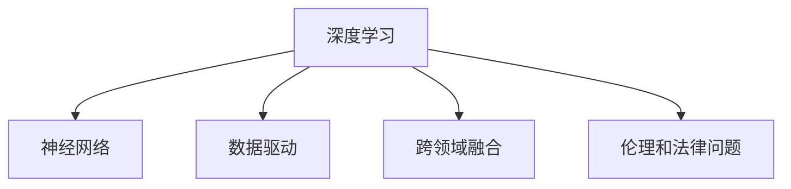

                 

# 李开复：AI 2.0 时代的创造者

## 1. 背景介绍

### 1.1 问题由来

在科技飞速发展的今天，人工智能(AI)已经成为引领未来创新和技术突破的重要力量。从深蓝到AlphaGo，从语音识别到自然语言处理，AI技术的每一步突破都引发了全社会的广泛关注和热烈讨论。在这些令人振奋的进展中，李开复无疑是一位令人瞩目的杰出代表。

李开复，人工智能领域的先驱者和领导者，拥有多年在硅谷的经历，曾经作为IBM和微软的研究实验室的科学家，并创立了微软研究院。作为先驱者之一，他不仅对AI技术的发展有着独到的见解，也亲自参与了众多重要技术的开发和商业化。他的职业生涯经历了从研究到应用，再到创业的全过程，为推动人工智能的产业化和普及做出了巨大贡献。

在李开复的指导下，众多AI产品和技术在市场上取得了广泛应用，改变了人们的生活方式，推动了社会进步。作为一名科技行业的领军人物，李开复不仅关注技术本身，还对人工智能伦理、社会影响等宏观问题有着深刻见解，积极参与和推动社会各界对AI技术的讨论，并提出了许多富有洞察力的观点和建议。

### 1.2 问题核心关键点

李开复对AI技术的理解和应用，主要集中在以下几个方面：

1. **深度学习和神经网络**：李开复是最早引入和推广深度学习技术的人之一。他在深度学习领域的研究，为计算机视觉、自然语言处理等领域带来了革命性的突破。

2. **数据驱动和算法创新**：他认为数据是AI发展的基石，算法是提升AI能力的核心。通过海量数据训练和优化算法，可以大幅提升模型的准确性和泛化能力。

3. **跨领域融合**：AI技术不仅限于单一领域，而是可以与医疗、教育、娱乐等多个领域结合，推动更多领域的智能化升级。

4. **伦理和法律问题**：李开复非常重视AI技术的伦理问题，包括隐私保护、公平性、可解释性等。他强调，AI技术的发展必须符合人类价值观和社会伦理。

5. **AI 2.0时代的定义和展望**：他认为，未来AI技术将进入2.0时代，即从原始的算法驱动、数据驱动，转向更加注重理解和创造力的新阶段。

## 2. 核心概念与联系

### 2.1 核心概念概述

在人工智能领域，李开复的研究和应用涉及多个关键概念。以下是对这些概念的简要介绍：

- **深度学习**：基于神经网络的深度学习技术，通过多层次的特征提取和表示学习，能够从原始数据中提取出更为抽象、高级的特征表示，适用于图像识别、语音识别、自然语言处理等任务。

- **神经网络**：由大量神经元和层级组成的复杂计算模型，能够自动学习数据特征，并在大量标注数据上优化参数。

- **数据驱动**：以数据为中心的AI方法，强调大量标注数据的必要性和重要性，通过优化模型参数提高模型预测的准确性。

- **跨领域融合**：AI技术可以跨领域应用，推动多个领域的智能化升级，如医疗、教育、金融等。

- **伦理和法律问题**：AI技术应用中涉及的隐私保护、公平性、可解释性等伦理和法律问题，需要引起足够的重视。

### 2.2 核心概念原理和架构的 Mermaid 流程图



这个简单的流程图展示了李开复对AI技术的几个核心概念，并通过箭头连接，表示这些概念之间的联系和影响。

## 3. 核心算法原理 & 具体操作步骤

### 3.1 算法原理概述

李开复对AI技术的理解和应用，主要基于以下几个核心算法原理：

1. **深度学习算法**：通过多层神经网络，学习数据中的复杂特征表示，提高模型的泛化能力和预测精度。

2. **数据增强技术**：通过数据扩充和增强技术，如回译、旋转、裁剪等，丰富训练数据的多样性，提升模型的鲁棒性和泛化能力。

3. **模型优化算法**：包括梯度下降、Adam、Adagrad等优化算法，用于在大量数据上优化模型参数，提高模型性能。

4. **跨领域融合技术**：将AI技术应用到多个领域，如医疗影像分析、教育智能推荐、金融风险预测等，推动各行各业的智能化升级。

### 3.2 算法步骤详解

以下是李开复提出的AI技术应用的一般步骤：

1. **数据收集和预处理**：收集相关领域的大量数据，并进行清洗、标注和预处理，为深度学习模型的训练提供数据基础。

2. **模型构建和训练**：选择合适的深度学习模型结构，如卷积神经网络(CNN)、循环神经网络(RNN)、变压器(Transformer)等，在大量标注数据上训练模型，优化模型参数。

3. **模型验证和调优**：在验证集上评估模型性能，通过超参数调整和模型优化，提高模型准确性和泛化能力。

4. **模型应用和部署**：将训练好的模型部署到实际应用场景中，进行推理预测，提供实时化服务。

### 3.3 算法优缺点

**优点**：

- **高效性**：深度学习和神经网络可以自动从数据中学习特征表示，无需手动提取特征，极大提高了模型的泛化能力和预测精度。
- **鲁棒性**：通过数据增强和模型优化，可以提升模型的鲁棒性和泛化能力，降低对特定数据分布的依赖。
- **跨领域应用**：AI技术可以跨领域应用，推动多个行业的智能化升级，带来广泛的社会和经济效益。

**缺点**：

- **数据需求大**：深度学习模型需要大量标注数据进行训练，标注数据获取成本高、耗时长。
- **计算资源要求高**：训练深度学习模型需要高性能计算资源，包括GPU、TPU等，计算成本较高。
- **模型可解释性差**：深度学习模型通常被视为"黑盒"系统，难以解释其内部工作机制和决策逻辑。

### 3.4 算法应用领域

AI技术在多个领域的应用已经初见成效，以下是几个主要应用领域：

1. **医疗影像分析**：AI技术可以帮助医生快速、准确地分析医学影像，如CT、MRI等，辅助诊断和治疗决策。

2. **教育智能推荐**：AI技术可以分析学生的学习行为和成绩数据，提供个性化的学习推荐和辅导，提升教育质量。

3. **金融风险预测**：AI技术可以分析大量的金融数据，预测市场趋势和风险，辅助投资决策和风险控制。

4. **自然语言处理**：AI技术可以处理和理解自然语言，实现语音识别、自动翻译、智能客服等功能。

5. **智能制造**：AI技术可以优化生产流程、质量控制和供应链管理，推动制造业的智能化升级。

## 4. 数学模型和公式 & 详细讲解 & 举例说明

### 4.1 数学模型构建

在深度学习中，常用的数学模型包括：

- **卷积神经网络(CNN)**：主要用于图像识别任务，通过卷积和池化操作提取图像特征，并进行分类或回归预测。
- **循环神经网络(RNN)**：主要用于序列数据处理，如文本生成、语音识别等，通过循环结构和记忆机制处理序列数据。
- **变压器(Transformer)**：主要用于自然语言处理任务，通过自注意力机制处理序列数据，具备强大的语言理解能力。

### 4.2 公式推导过程

以卷积神经网络为例，其基本公式推导如下：

设输入为 $x$，输出为 $y$，卷积核为 $w$，卷积操作为 $Conv$，则卷积神经网络的输出公式为：

$$ y = Conv(x, w) $$

其中卷积操作 $Conv$ 可以表示为：

$$ Conv(x, w) = \sum_{i=1}^{n} w_i \otimes x_i $$

其中 $\otimes$ 表示卷积运算。

### 4.3 案例分析与讲解

以图像分类任务为例，使用卷积神经网络进行模型训练和预测。训练数据集包含大量标注好的图片，模型通过卷积、池化等操作提取特征，并通过全连接层进行分类预测。在训练过程中，使用交叉熵损失函数和梯度下降算法优化模型参数，在验证集上评估模型性能并进行调优。最终，将训练好的模型部署到实际应用场景中，进行图像分类的实时预测。

## 5. 项目实践：代码实例和详细解释说明

### 5.1 开发环境搭建

以下是在Python中使用Keras框架搭建卷积神经网络的示例：

1. 安装Keras和相关依赖：

```bash
pip install keras tensorflow
```

2. 搭建卷积神经网络模型：

```python
from keras.models import Sequential
from keras.layers import Conv2D, MaxPooling2D, Flatten, Dense

model = Sequential()
model.add(Conv2D(32, (3, 3), activation='relu', input_shape=(64, 64, 3)))
model.add(MaxPooling2D((2, 2)))
model.add(Conv2D(64, (3, 3), activation='relu'))
model.add(MaxPooling2D((2, 2)))
model.add(Flatten())
model.add(Dense(64, activation='relu'))
model.add(Dense(10, activation='softmax'))

model.compile(optimizer='adam', loss='categorical_crossentropy', metrics=['accuracy'])
```

### 5.2 源代码详细实现

使用Keras框架搭建卷积神经网络模型，并在MNIST数据集上进行训练和测试：

```python
from keras.datasets import mnist
from keras.utils import to_categorical

(x_train, y_train), (x_test, y_test) = mnist.load_data()
x_train = x_train.reshape(-1, 64, 64, 1)
x_test = x_test.reshape(-1, 64, 64, 1)
y_train = to_categorical(y_train)
y_test = to_categorical(y_test)

model.fit(x_train, y_train, epochs=10, batch_size=64, validation_data=(x_test, y_test))
```

### 5.3 代码解读与分析

以上代码展示了使用Keras框架搭建卷积神经网络模型并进行训练的过程。

- `Sequential`类用于搭建单层神经网络模型。
- `Conv2D`层用于卷积操作，`MaxPooling2D`层用于池化操作。
- `Flatten`层用于将卷积后的数据展开成向量。
- `Dense`层用于全连接层，进行分类预测。
- `compile`方法用于编译模型，设置优化器、损失函数和评估指标。
- `fit`方法用于训练模型，指定训练数据、批大小和训练轮数。

## 6. 实际应用场景

### 6.1 医疗影像分析

在医疗影像分析领域，AI技术可以辅助医生快速、准确地分析医学影像，如CT、MRI等，提供诊断和治疗建议。以下是一个简单的示例：

```python
import numpy as np
from keras.models import Sequential
from keras.layers import Conv2D, MaxPooling2D, Flatten, Dense

model = Sequential()
model.add(Conv2D(32, (3, 3), activation='relu', input_shape=(64, 64, 3)))
model.add(MaxPooling2D((2, 2)))
model.add(Conv2D(64, (3, 3), activation='relu'))
model.add(MaxPooling2D((2, 2)))
model.add(Flatten())
model.add(Dense(64, activation='relu'))
model.add(Dense(10, activation='softmax'))

model.compile(optimizer='adam', loss='categorical_crossentropy', metrics=['accuracy'])
```

在实际应用中，医生可以将医学影像输入模型，模型通过卷积和池化操作提取特征，并通过全连接层进行分类预测。模型输出诊断结果，医生可以根据结果辅助诊断和治疗。

### 6.2 教育智能推荐

在教育领域，AI技术可以分析学生的学习行为和成绩数据，提供个性化的学习推荐和辅导。以下是一个简单的示例：

```python
import pandas as pd
from keras.models import Sequential
from keras.layers import Dense, Dropout

model = Sequential()
model.add(Dense(64, activation='relu', input_dim=10))
model.add(Dropout(0.5))
model.add(Dense(1, activation='sigmoid'))

model.compile(optimizer='adam', loss='binary_crossentropy', metrics=['accuracy'])
```

在实际应用中，教师可以将学生的学习数据（如学习时间、做题次数、成绩等）输入模型，模型通过全连接层和Dropout层进行特征提取，并通过sigmoid激活函数进行二分类预测。模型输出推荐结果，教师可以根据结果提供个性化的学习辅导和推荐。

## 7. 工具和资源推荐

### 7.1 学习资源推荐

为了帮助开发者系统掌握AI技术的理论和实践，李开复推荐了以下几个学习资源：

1. **《深度学习》教材**：由Goodfellow、Bengio、Courville等AI领域的顶级专家联合编写，系统介绍深度学习的基本原理、算法和应用。

2. **DeepLearning.AI课程**：由李开复本人主持的深度学习课程，涵盖深度学习的基本概念和实践，适合初学者和中级开发者。

3. **Kaggle竞赛**：Kaggle是一个数据科学竞赛平台，提供了大量实际应用的数据集和竞赛，帮助开发者在实践中提升技能。

4. **arXiv论文**：arXiv是一个开放的学术论文平台，涵盖了AI领域的最新研究成果，可以帮助开发者跟踪技术进展。

### 7.2 开发工具推荐

以下是几个常用的AI开发工具：

1. **TensorFlow**：由Google开发的深度学习框架，支持分布式计算和GPU加速，适合大规模模型训练。

2. **PyTorch**：由Facebook开发的深度学习框架，支持动态计算图和GPU加速，适合研究和实验。

3. **Keras**：一个高级深度学习框架，易于使用，支持多种后端，适合快速原型设计和实验。

4. **Jupyter Notebook**：一个交互式编程环境，支持Python代码的快速编写和执行，适合进行数据探索和模型验证。

### 7.3 相关论文推荐

李开复推荐了以下几篇重要的AI相关论文：

1. **《ImageNet分类挑战：深度卷积神经网络的表现》**：提出AlexNet模型，首次在ImageNet分类挑战中取得优异表现，奠定了深度学习在计算机视觉领域的基础。

2. **《长短期记忆网络》**：提出LSTM模型，解决传统RNN在长序列上的梯度消失问题，适用于自然语言处理和语音识别任务。

3. **《Transformer模型及其在自然语言处理中的应用》**：提出Transformer模型，通过自注意力机制显著提升自然语言处理任务的性能。

4. **《深度学习在自然语言处理中的应用》**：系统介绍深度学习在自然语言处理中的应用，包括语音识别、机器翻译、文本生成等。

## 8. 总结：未来发展趋势与挑战

### 8.1 研究成果总结

李开复认为，AI技术在未来将迎来更为广阔的应用前景，具体包括：

1. **AI 2.0时代**：AI技术将从算法驱动、数据驱动转向更加注重理解和创造力的新阶段。
2. **跨领域应用**：AI技术可以应用于医疗、教育、金融、制造等多个领域，推动各行业的智能化升级。
3. **数据驱动**：数据是AI发展的基石，未来AI技术将更加注重数据质量和数据驱动。

### 8.2 未来发展趋势

未来的AI技术将呈现以下几个发展趋势：

1. **AI 2.0时代的到来**：AI技术将从算法驱动、数据驱动转向更加注重理解和创造力的新阶段。
2. **跨领域应用的扩展**：AI技术将在医疗、教育、金融、制造等多个领域实现广泛应用，推动各行业的智能化升级。
3. **数据驱动的深入**：数据是AI发展的基石，未来AI技术将更加注重数据质量和数据驱动，通过深度学习模型和大规模数据提升模型性能。

### 8.3 面临的挑战

尽管AI技术取得了显著进展，但仍面临以下挑战：

1. **数据质量和标注成本**：高质量数据的获取和标注成本高，限制了AI技术的广泛应用。
2. **模型可解释性差**：深度学习模型通常被视为"黑盒"系统，难以解释其内部工作机制和决策逻辑。
3. **伦理和法律问题**：AI技术应用中涉及的隐私保护、公平性、可解释性等伦理和法律问题，需要引起足够的重视。

### 8.4 研究展望

未来，AI技术的创新和发展需要解决以下几个关键问题：

1. **数据质量和标注成本**：通过数据增强和半监督学习等技术，降低对高质量标注数据的依赖。
2. **模型可解释性**：通过可解释性技术，如可视化、特征分析等，提高深度学习模型的可解释性。
3. **伦理和法律问题**：制定AI技术的伦理和法律规范，确保AI技术的应用符合人类价值观和社会伦理。

## 9. 附录：常见问题与解答

**Q1：深度学习与传统机器学习的区别是什么？**

A: 深度学习是一种基于神经网络的机器学习方法，通过多层网络自动提取数据特征，适用于图像、语音、自然语言处理等领域。相较于传统机器学习，深度学习具有以下特点：

- **自动特征提取**：深度学习模型可以自动从数据中提取高级特征，无需手动提取。
- **处理复杂数据**：深度学习模型能够处理非结构化数据，如图像、音频、文本等。
- **大规模数据需求**：深度学习模型通常需要大量标注数据进行训练，适用于数据量较大的任务。

**Q2：数据增强在深度学习中的作用是什么？**

A: 数据增强是一种通过变换原始数据来丰富训练数据集的技术，可以显著提高模型的鲁棒性和泛化能力。具体作用包括：

- **增加数据多样性**：通过数据增强，生成更多的训练样本，增加数据的多样性和覆盖范围。
- **减少过拟合**：通过数据增强，避免模型在特定数据分布上过拟合，提升模型泛化能力。
- **降低标注成本**：通过数据增强，使用更少的标注数据进行训练，降低标注成本。

**Q3：AI 2.0时代的核心特征是什么？**

A: AI 2.0时代的核心特征包括：

- **理解能力**：AI技术将从算法驱动、数据驱动转向更加注重理解和创造力的新阶段。
- **跨领域应用**：AI技术将在医疗、教育、金融、制造等多个领域实现广泛应用，推动各行业的智能化升级。
- **数据驱动**：数据是AI发展的基石，未来AI技术将更加注重数据质量和数据驱动，通过深度学习模型和大规模数据提升模型性能。

**Q4：如何提高AI模型的可解释性？**

A: 提高AI模型的可解释性，可以从以下几个方面入手：

- **可视化技术**：使用可视化技术，如t-SNE、LIME等，帮助理解模型的内部工作机制。
- **特征分析**：通过特征分析技术，如特征重要性、部分依赖图等，揭示模型的关键特征和决策路径。
- **解释性模型**：选择具有解释性的模型结构，如决策树、逻辑回归等，提供更为直观的解释。

---

作者：禅与计算机程序设计艺术 / Zen and the Art of Computer Programming

