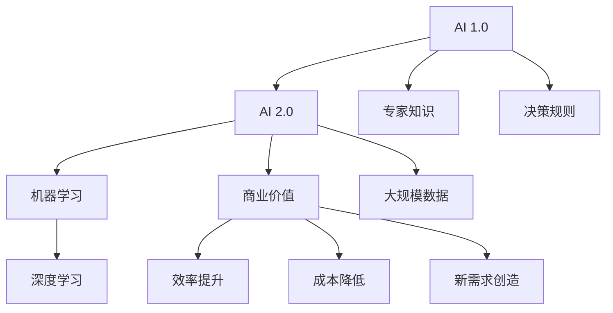

                 

# 李开复：AI 2.0 时代的商业价值

> 关键词：AI 2.0, 商业价值, 人工智能, 机器学习, 深度学习, 未来商业, 创新, 数据驱动

## 1. 背景介绍

### 1.1 问题由来

进入21世纪，人工智能（AI）已经成为推动全球科技和经济变革的重要力量。过去几年，AI领域取得了巨大的进展，尤其是在机器学习、深度学习等关键技术方面。随着AI技术的深入应用，它不仅改变了传统的产业结构，也为商业模式的创新提供了新的机遇和挑战。

当前，AI正处于2.0时代，这个时代的AI不再局限于科研实验室，而是正在走向更广泛的应用场景，如智能制造、自动驾驶、医疗健康、金融科技等。AI 2.0时代的到来，不仅使得AI技术本身更加成熟，也促使商业应用更加深入和普及。AI 2.0时代的商业价值如何？本文将深入探讨。

## 2. 核心概念与联系

### 2.1 核心概念概述

为了更好地理解AI 2.0时代的商业价值，我们首先需要了解几个关键概念：

- **AI 1.0**：主要指早期基于规则的专家系统，如Eliza，这一时期的AI主要以专家知识为基础，缺乏自我学习能力。

- **AI 2.0**：指以深度学习为核心的新一代AI技术，能够从大规模数据中学习并自我优化，具有更强的泛化能力和适应性。

- **机器学习**：通过算法让计算机自动分析数据、学习规律并做出决策的技术。

- **深度学习**：机器学习的一个分支，利用神经网络模拟人脑处理信息的方式，通过多层次的非线性变换进行复杂的数据建模。

- **商业价值**：指AI技术在商业应用中创造的经济和社会效益，包括提升效率、降低成本、创造新需求等。

### 2.2 核心概念原理和架构的 Mermaid 流程图



这个流程图展示了AI技术从1.0到2.0的演变，以及AI 2.0如何通过机器学习和深度学习技术，从大规模数据中提取价值，进而创造商业价值。

## 3. 核心算法原理 & 具体操作步骤

### 3.1 算法原理概述

AI 2.0时代的商业价值主要体现在以下几个方面：

1. **效率提升**：通过自动化和智能化的技术手段，AI可以大幅提升生产效率和服务效率，降低人力成本和时间成本。
2. **成本降低**：AI能够优化资源配置，减少浪费，降低运营成本。
3. **新需求创造**：AI通过数据分析和智能推荐，挖掘潜在的市场需求，创造新的商业模式和产品。

### 3.2 算法步骤详解

AI 2.0时代的商业价值实现主要包括以下几个步骤：

1. **数据收集与预处理**：
   - 收集相关的数据，如销售数据、用户行为数据、市场调研数据等。
   - 对数据进行清洗和预处理，确保数据的质量和一致性。

2. **模型训练与优化**：
   - 选择合适的模型架构，如神经网络、深度学习模型等。
   - 利用大规模数据进行训练，优化模型参数，提高模型性能。

3. **模型应用与验证**：
   - 将训练好的模型应用到实际业务场景中，进行实时预测和决策。
   - 通过A/B测试等方法验证模型的效果，不断迭代优化。

### 3.3 算法优缺点

AI 2.0时代的商业价值实现具有以下优点：

1. **高效性**：AI能够处理大规模数据，快速进行分析和预测，提高决策效率。
2. **准确性**：通过深度学习和优化算法，AI模型能够提供高精度的预测和决策支持。
3. **可扩展性**：AI技术可以轻松扩展到不同的业务场景和应用领域。

同时，AI 2.0时代也存在一些缺点：

1. **数据依赖性强**：AI的性能很大程度上依赖于数据的质量和量级。
2. **模型复杂度**：深度学习模型参数多、结构复杂，可能导致计算资源消耗大。
3. **解释性不足**：部分AI模型的决策过程缺乏可解释性，难以理解其内部机制。

### 3.4 算法应用领域

AI 2.0时代的商业价值在多个领域都有广泛应用，如：

1. **智能制造**：通过AI技术优化生产流程，提高生产效率和产品质量。
2. **自动驾驶**：利用AI技术实现车辆自主导航和避障，提升交通安全性和效率。
3. **医疗健康**：通过AI进行疾病诊断、治疗方案优化、药物研发等，提升医疗服务质量。
4. **金融科技**：利用AI进行风险评估、信用评分、智能投顾等，降低金融风险，提高服务质量。
5. **零售电商**：通过AI进行个性化推荐、库存管理、需求预测等，提升用户体验和运营效率。

## 4. 数学模型和公式 & 详细讲解 & 举例说明

### 4.1 数学模型构建

AI 2.0时代的商业价值实现，通常依赖于以下数学模型：

1. **线性回归模型**：用于预测连续型数据，如销售预测、用户行为预测等。
2. **逻辑回归模型**：用于分类任务，如信用评分、疾病诊断等。
3. **卷积神经网络（CNN）**：用于图像处理和识别任务，如图像分类、物体检测等。
4. **循环神经网络（RNN）**：用于处理序列数据，如自然语言处理中的文本生成、语音识别等。

### 4.2 公式推导过程

以线性回归模型为例，其基本形式为：

$$
y = w_0 + w_1 x_1 + w_2 x_2 + \cdots + w_n x_n
$$

其中，$y$为预测结果，$x_1, x_2, \cdots, x_n$为输入特征，$w_0, w_1, w_2, \cdots, w_n$为模型参数。线性回归模型的目标是最小化预测值与真实值之间的误差，常用均方误差（MSE）作为损失函数：

$$
\text{MSE} = \frac{1}{N} \sum_{i=1}^N (y_i - \hat{y}_i)^2
$$

通过梯度下降等优化算法，求解上述损失函数的最小值，即可得到模型参数$w_0, w_1, w_2, \cdots, w_n$。

### 4.3 案例分析与讲解

以零售电商中的用户行为预测为例，假设我们收集了用户的浏览、购买、评价等数据，希望预测用户未来的购买意向。我们可以构建一个基于线性回归的预测模型，选择相关的特征（如用户年龄、浏览时间、评价评分等）进行训练。通过模型训练，可以得到不同特征对预测结果的影响权重，从而实现用户行为预测。

## 5. 项目实践：代码实例和详细解释说明

### 5.1 开发环境搭建

为了进行AI 2.0时代的商业价值实践，我们需要安装一些主要的开发工具和库，如：

1. Python：作为主要编程语言，用于数据分析、模型训练和应用开发。
2. PyTorch：深度学习框架，用于构建和训练AI模型。
3. TensorFlow：另一种流行的深度学习框架，支持分布式计算和模型部署。
4. Scikit-learn：机器学习库，提供了多种常见的机器学习算法和工具。
5. Pandas：数据处理库，用于数据清洗、预处理和分析。

### 5.2 源代码详细实现

以下是一个简单的Python代码示例，展示了如何使用Scikit-learn库进行线性回归模型的训练和预测：

```python
from sklearn.linear_model import LinearRegression
from sklearn.datasets import load_boston
from sklearn.model_selection import train_test_split
import numpy as np

# 加载波士顿房价数据集
boston = load_boston()

# 将数据集分为训练集和测试集
X_train, X_test, y_train, y_test = train_test_split(boston.data, boston.target, test_size=0.2, random_state=42)

# 构建线性回归模型
model = LinearRegression()

# 训练模型
model.fit(X_train, y_train)

# 预测测试集结果
y_pred = model.predict(X_test)

# 输出模型性能评估
print("R^2:", model.score(X_test, y_test))
```

### 5.3 代码解读与分析

这段代码展示了线性回归模型的基本流程：

1. 加载波士顿房价数据集，分为训练集和测试集。
2. 构建线性回归模型，并进行训练。
3. 使用训练好的模型对测试集进行预测。
4. 输出模型性能评估，R^2（决定系数）表示模型的拟合程度。

## 6. 实际应用场景

### 6.1 智能制造

在智能制造领域，AI 2.0技术可以用于生产线优化、质量检测、设备维护等。例如，通过机器视觉技术，AI可以检测生产线上产品的缺陷，提高产品质量。通过数据分析，AI还可以优化生产流程，减少资源浪费，提高生产效率。

### 6.2 自动驾驶

自动驾驶技术是AI 2.0的重要应用领域之一。通过深度学习和计算机视觉技术，AI可以实现车辆的自主导航和避障，提升交通安全性和效率。例如，特斯拉的Autopilot系统就是基于AI 2.0技术开发的自动驾驶系统。

### 6.3 医疗健康

在医疗健康领域，AI 2.0技术可以用于疾病诊断、治疗方案优化、药物研发等。例如，AI可以通过分析患者的影像数据，辅助医生进行疾病诊断。通过分析电子病历和基因数据，AI还可以推荐个性化的治疗方案。

### 6.4 金融科技

金融科技是AI 2.0技术的另一个重要应用领域。AI可以通过风险评估、信用评分、智能投顾等技术，降低金融风险，提高服务质量。例如，AI可以通过分析用户的历史交易数据和行为数据，预测用户信用风险，优化贷款审批流程。

### 6.5 零售电商

在零售电商领域，AI 2.0技术可以用于个性化推荐、库存管理、需求预测等。例如，AI可以通过分析用户的浏览和购买数据，推荐相关产品，提高用户满意度。通过分析销售数据，AI还可以优化库存管理，减少库存积压，降低运营成本。

## 7. 工具和资源推荐

### 7.1 学习资源推荐

为了帮助开发者系统掌握AI 2.0技术，以下是一些优质的学习资源：

1. 《Deep Learning》：Ian Goodfellow等人著作，深度学习领域的经典教材，详细介绍了深度学习的理论基础和实践应用。
2. Coursera AI课程：由斯坦福大学等机构提供的AI在线课程，涵盖机器学习、深度学习、自然语言处理等多个主题。
3. PyTorch官方文档：PyTorch框架的官方文档，提供了详细的API文档和示例代码，方便开发者快速上手。
4. TensorFlow官方文档：TensorFlow框架的官方文档，提供了丰富的教程和实战案例，适合深度学习开发。
5. Kaggle竞赛：Kaggle是数据科学和机器学习领域的知名平台，提供大量的数据集和竞赛项目，适合实践学习和算法优化。

### 7.2 开发工具推荐

以下是几款用于AI 2.0技术开发的常用工具：

1. PyTorch：基于Python的开源深度学习框架，灵活性高，适合快速迭代研究。
2. TensorFlow：由Google主导开发的开源深度学习框架，支持分布式计算和模型部署。
3. Jupyter Notebook：交互式的Python开发环境，方便代码调试和数据分析。
4. Visual Studio Code：轻量级的代码编辑器，支持Python、TensorFlow、PyTorch等环境，功能强大。
5. Google Colab：Google提供的在线Jupyter Notebook环境，免费提供GPU算力，方便实验和分享学习笔记。

### 7.3 相关论文推荐

AI 2.0技术的发展源于学界的持续研究。以下是几篇奠基性的相关论文，推荐阅读：

1. "Deep Learning" by Ian Goodfellow, Yoshua Bengio, and Aaron Courville：深度学习的经典教材，介绍了深度学习的理论和实践。
2. "ImageNet Classification with Deep Convolutional Neural Networks" by Alex Krizhevsky, Ilya Sutskever, and Geoffrey Hinton：介绍卷积神经网络在图像识别任务中的应用。
3. "Attention is All You Need" by Ashish Vaswani et al.：提出Transformer模型，标志着自注意力机制在深度学习中的成功应用。
4. "Natural Language Processing with Transformers" by Jacqueline Zheng：介绍Transformer模型在自然语言处理中的应用。
5. "AlphaGo Zero: Mastering the Game of Go without Human Knowledge" by David Silver et al.：介绍深度强化学习在棋类游戏中的应用，展示了AI技术的潜力。

## 8. 总结：未来发展趋势与挑战

### 8.1 研究成果总结

AI 2.0技术在商业价值方面已经取得了显著的成果，广泛应用于智能制造、自动驾驶、医疗健康、金融科技、零售电商等多个领域。通过AI 2.0技术，企业能够提升效率、降低成本、创造新需求，取得了显著的经济和社会效益。

### 8.2 未来发展趋势

展望未来，AI 2.0技术将继续发展，带来以下几个趋势：

1. **更加智能化**：AI技术将更加智能，具备更强的自主学习和自我优化能力。
2. **更加普及化**：AI技术将更加普及，广泛应用于更多的行业和领域。
3. **更加集成化**：AI技术将与其他技术更加紧密集成，如云计算、物联网等，形成更加强大的应用生态。
4. **更加安全可靠**：AI技术将更加注重安全和可靠性，减少安全隐患和误导性输出。
5. **更加人性化**：AI技术将更加关注用户体验，提供更加自然、流畅的交互方式。

### 8.3 面临的挑战

尽管AI 2.0技术已经取得了一定的进展，但仍然面临一些挑战：

1. **数据获取困难**：获取高质量、大规模的数据是AI 2.0技术的瓶颈之一。
2. **模型复杂度高**：AI模型的复杂度不断增加，导致计算资源消耗大，部署成本高。
3. **可解释性不足**：部分AI模型的决策过程缺乏可解释性，难以理解其内部机制。
4. **伦理道德问题**：AI技术的应用可能带来伦理道德问题，如隐私保护、数据滥用等。
5. **法规监管**：AI技术的发展需要符合相关法律法规，如数据保护、隐私保护等。

### 8.4 研究展望

为了应对上述挑战，未来AI 2.0技术需要在以下几个方面进行研究：

1. **数据获取与预处理**：研究高效的数据获取和预处理方法，确保数据质量。
2. **模型简化**：研究模型简化方法，减少计算资源消耗，提高模型效率。
3. **可解释性增强**：研究可解释性增强技术，提高模型的透明性和可理解性。
4. **伦理道德研究**：研究AI技术的伦理道德问题，制定相关法律法规。
5. **技术集成**：研究AI技术与其他技术的集成方法，形成更加强大的应用生态。

## 9. 附录：常见问题与解答

### Q1: AI 2.0技术需要哪些基础条件？

A: AI 2.0技术需要以下基础条件：
1. 高性能计算资源：如GPU、TPU等，用于大规模模型训练和推理。
2. 高质量数据集：用于训练和验证AI模型。
3. 高水平人才：具备机器学习、深度学习等技术背景的专业人才。
4. 先进算法和技术：如卷积神经网络、循环神经网络、自注意力机制等。

### Q2: AI 2.0技术在商业应用中需要注意哪些问题？

A: AI 2.0技术在商业应用中需要注意以下问题：
1. 数据隐私保护：确保用户数据隐私，遵守相关法律法规。
2. 模型透明性和可解释性：提高AI模型的透明性和可解释性，增强用户信任。
3. 伦理道德问题：研究AI技术的伦理道德问题，制定相关法律法规。
4. 安全性和可靠性：确保AI系统的安全性和可靠性，减少安全隐患和误导性输出。
5. 用户体验：注重用户体验，提供自然、流畅的交互方式。

### Q3: AI 2.0技术在实际应用中如何优化性能？

A: AI 2.0技术在实际应用中可以通过以下方法优化性能：
1. 数据增强：通过数据增强技术，扩充训练集，提高模型泛化能力。
2. 模型简化：通过模型简化技术，减少计算资源消耗，提高模型效率。
3. 超参数优化：通过超参数优化技术，找到最佳的模型参数，提高模型性能。
4. 集成学习：通过集成学习技术，结合多个模型，提高预测准确性和鲁棒性。

### Q4: AI 2.0技术在落地应用中需要注意哪些细节？

A: AI 2.0技术在落地应用中需要注意以下细节：
1. 模型部署：将训练好的模型部署到生产环境中，确保其稳定性和可靠性。
2. 数据存储和处理：合理设计数据存储和处理方案，保障数据安全和高效访问。
3. 系统集成：将AI模型与其他系统集成，确保其无缝协作。
4. 性能监控：实时监控AI系统性能，及时发现和解决问题。
5. 用户反馈：收集用户反馈，不断优化AI系统性能。

---

作者：禅与计算机程序设计艺术 / Zen and the Art of Computer Programming

