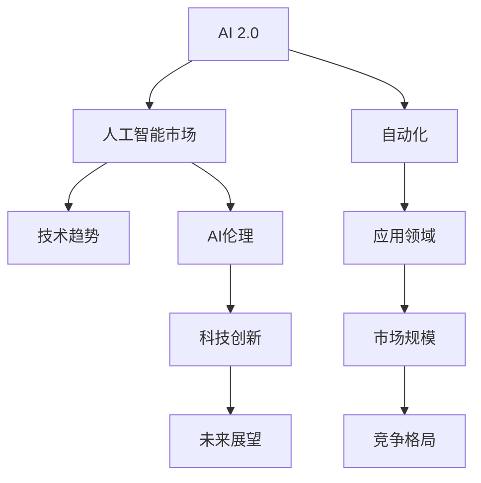

                 

# 李开复：AI 2.0 时代的市场

> 关键词：AI 2.0, 人工智能, 市场预测, 自动化, 人工智能伦理, 科技创新

## 1. 背景介绍

### 1.1 问题由来

随着AI技术的迅猛发展，全球科技巨头、初创企业乃至传统行业，都在积极探索AI应用的可能性。AI 2.0时代的到来，意味着AI已经从实验室走向了市场，成为了推动社会进步和经济增长的重要引擎。然而，AI市场究竟会如何发展？未来的机会和挑战又在哪里？本文将深入探讨这些问题，并给出详细分析。

### 1.2 问题核心关键点

在AI 2.0时代，市场发展的核心关键点包括：
- **市场规模**：AI技术在各行业的广泛应用将带来多大的市场价值？
- **技术趋势**：AI市场中的技术热点和趋势是什么？
- **竞争格局**：谁将主导AI市场，未来的竞争格局会如何演变？
- **应用领域**：AI技术将主要应用于哪些领域，其对各行业的影响如何？
- **伦理挑战**：AI应用中面临的伦理问题如何得到解决？

## 2. 核心概念与联系

### 2.1 核心概念概述

为更好地理解AI 2.0市场的发展，本节将介绍几个密切相关的核心概念：

- **AI 2.0**：AI 2.0是继第一代（基于规则的专家系统）和第三代（深度学习）之后的新一代AI技术，以数据驱动、模型增强和知识图谱为特征，具有更强的学习和推理能力。

- **人工智能市场**：涵盖了AI技术在各个行业中的应用，包括硬件、软件、平台、服务等。

- **自动化**：利用AI技术自动化完成各种业务流程，如自动驾驶、智能制造、智慧城市等。

- **AI伦理**：涉及AI应用中涉及的隐私、公平、透明、责任等问题。

- **科技创新**：AI技术的发展是科技创新的一个重要组成部分，涉及技术突破、产品创新、商业模式变革等。

这些核心概念之间的逻辑关系可以通过以下Mermaid流程图来展示：



这个流程图展示了大语言模型的核心概念及其之间的关系：

1. AI 2.0是AI技术发展的新阶段，驱动了市场的演进。
2. 自动化是AI技术的重要应用领域，推动了各行业的智能化转型。
3. 技术趋势和应用领域共同塑造了AI市场的规模和结构。
4. 市场规模和竞争格局相互影响，共同决定着市场的发展方向。
5. AI伦理是AI应用的基础，影响着技术的普及和推广。
6. 科技创新是AI市场发展的动力，推动技术进步和商业模式创新。
7. 未来展望涉及AI技术可能带来的变革和挑战，影响着市场的发展方向。

## 3. 核心算法原理 & 具体操作步骤
### 3.1 算法原理概述

AI 2.0市场的发展，主要依赖于AI技术的突破和应用。其核心原理在于通过数据驱动的深度学习模型，提升AI系统的智能水平，并在各行业中实现广泛的自动化应用。

AI 2.0市场的发展过程可以分为以下几个关键步骤：

1. **数据收集与处理**：收集各行业的结构化与非结构化数据，通过预处理、清洗、标注等步骤，形成可用于AI模型训练的数据集。
2. **模型训练与优化**：使用AI 2.0技术，如深度学习、强化学习、迁移学习等，训练并优化AI模型，以提升其预测能力和泛化能力。
3. **应用部署与优化**：将训练好的AI模型部署到实际应用场景中，进行参数微调、优化，以适应具体业务需求。
4. **持续优化与迭代**：在应用过程中，不断收集反馈数据，对AI模型进行迭代优化，以提升性能和用户体验。

### 3.2 算法步骤详解

以下是AI 2.0市场发展的详细步骤：

**Step 1: 数据收集与预处理**
- 从各行业收集结构化与非结构化数据，如图像、文本、语音等。
- 对数据进行清洗、标注，确保数据的质量和一致性。
- 将数据划分为训练集、验证集和测试集。

**Step 2: 模型训练与优化**
- 选择合适的AI 2.0模型，如深度神经网络、卷积神经网络、循环神经网络等。
- 使用训练集数据训练模型，通过反向传播算法更新模型参数。
- 使用验证集数据评估模型性能，进行参数微调和超参数优化。

**Step 3: 应用部署与优化**
- 将训练好的模型部署到实际应用场景中，进行参数微调和优化，以适应具体业务需求。
- 根据实际应用反馈，持续优化模型性能和用户体验。

**Step 4: 持续优化与迭代**
- 在应用过程中，不断收集反馈数据，对AI模型进行迭代优化，以提升性能和用户体验。
- 定期更新数据集，保持模型的最新性。

### 3.3 算法优缺点

AI 2.0市场的优点包括：
1. **效率提升**：自动化技术可以显著提高各行业的生产效率和运营效率。
2. **成本节约**：通过AI技术优化资源配置，降低生产成本。
3. **创新驱动**：AI技术推动各行业的创新，带来新的商业模式和应用场景。

同时，AI 2.0市场也存在一定的局限性：
1. **数据依赖**：AI 2.0市场高度依赖数据质量，数据采集和标注成本高昂。
2. **技术复杂**：AI技术的应用需要较高的技术门槛，对人才和技术资源的要求较高。
3. **伦理问题**：AI应用中涉及的伦理问题复杂多样，需要政府、企业和社会的共同努力。
4. **安全性**：AI系统的安全性问题，如隐私保护、数据泄露等，需要加强防范。

### 3.4 算法应用领域

AI 2.0技术在各个行业中的应用广泛，主要涵盖以下几个领域：

- **金融**：智能投顾、信用评分、反欺诈等。
- **医疗**：疾病预测、药物研发、智能诊断等。
- **制造业**：智能制造、质量控制、供应链管理等。
- **零售**：个性化推荐、库存管理、客户服务等。
- **能源**：智能电网、能源消耗预测、智能调度等。
- **交通**：自动驾驶、智能交通管理、物流优化等。

## 4. 数学模型和公式 & 详细讲解 & 举例说明

### 4.1 数学模型构建

AI 2.0市场的发展，主要依赖于AI技术的突破和应用。其核心原理在于通过数据驱动的深度学习模型，提升AI系统的智能水平，并在各行业中实现广泛的自动化应用。

AI 2.0市场的发展过程可以分为以下几个关键步骤：

1. **数据收集与处理**：收集各行业的结构化与非结构化数据，通过预处理、清洗、标注等步骤，形成可用于AI模型训练的数据集。
2. **模型训练与优化**：使用AI 2.0技术，如深度学习、强化学习、迁移学习等，训练并优化AI模型，以提升其预测能力和泛化能力。
3. **应用部署与优化**：将训练好的AI模型部署到实际应用场景中，进行参数微调、优化，以适应具体业务需求。
4. **持续优化与迭代**：在应用过程中，不断收集反馈数据，对AI模型进行迭代优化，以提升性能和用户体验。

### 4.2 公式推导过程

以下是对AI 2.0市场发展过程的数学模型推导：

假设某一行业的数据集为 $D=\{(x_i, y_i)\}_{i=1}^N$，其中 $x_i$ 为输入数据，$y_i$ 为标签。AI 2.0模型为 $M_{\theta}(x)$，其中 $\theta$ 为模型参数。

- **数据收集与预处理**：将数据集划分为训练集 $D_{train}$、验证集 $D_{val}$ 和测试集 $D_{test}$。
- **模型训练与优化**：使用损失函数 $L(\theta)$ 衡量模型预测值与真实标签的差异。通过梯度下降算法最小化损失函数，更新模型参数 $\theta$。
- **应用部署与优化**：将训练好的模型 $M_{\theta}$ 部署到实际应用场景中，进行参数微调、优化。
- **持续优化与迭代**：在应用过程中，不断收集反馈数据 $D_{feedback}$，对模型进行迭代优化。

### 4.3 案例分析与讲解

**案例分析**：某金融机构使用AI 2.0技术进行智能投顾系统开发。

**具体步骤**：
1. 收集客户交易数据、财务数据、市场数据等，形成训练集和验证集。
2. 使用深度神经网络构建智能投顾模型，通过梯度下降算法最小化损失函数，优化模型参数。
3. 将训练好的模型部署到实际投顾系统中，进行参数微调和优化，以适应具体业务需求。
4. 在实际投顾过程中，不断收集客户反馈数据，对模型进行迭代优化，提升预测准确率和用户体验。

## 5. 项目实践：代码实例和详细解释说明
### 5.1 开发环境搭建

在进行AI 2.0市场开发前，我们需要准备好开发环境。以下是使用Python进行TensorFlow开发的环境配置流程：

1. 安装Anaconda：从官网下载并安装Anaconda，用于创建独立的Python环境。

2. 创建并激活虚拟环境：
```bash
conda create -n tf-env python=3.8 
conda activate tf-env
```

3. 安装TensorFlow：根据CUDA版本，从官网获取对应的安装命令。例如：
```bash
conda install tensorflow -c tf -c conda-forge
```

4. 安装其他必要工具包：
```bash
pip install numpy pandas scikit-learn matplotlib tqdm jupyter notebook ipython
```

完成上述步骤后，即可在`tf-env`环境中开始AI 2.0市场开发的实践。

### 5.2 源代码详细实现

这里我们以智能投顾系统为例，给出使用TensorFlow对AI 2.0模型进行训练的PyTorch代码实现。

首先，定义智能投顾系统所需的数据处理函数：

```python
import tensorflow as tf
from tensorflow import keras

class DataLoader(keras.utils.Sequence):
    def __init__(self, data, batch_size=32):
        self.data = data
        self.batch_size = batch_size
        
    def __len__(self):
        return len(self.data) // self.batch_size
    
    def __getitem__(self, idx):
        batch = self.data[idx * self.batch_size : (idx+1) * self.batch_size]
        features = [feature for feature in batch]
        labels = [label for label in batch]
        return tf.data.Dataset.from_tensor_slices((features, labels)).shuffle(1024).batch(self.batch_size)

# 创建数据集
train_data = ...
val_data = ...
test_data = ...
```

然后，定义模型和损失函数：

```python
model = tf.keras.Sequential([
    tf.keras.layers.Dense(64, activation='relu', input_shape=(input_dim,)),
    tf.keras.layers.Dense(64, activation='relu'),
    tf.keras.layers.Dense(1, activation='sigmoid')
])

loss = tf.keras.losses.BinaryCrossentropy(from_logits=True)

# 编译模型
model.compile(optimizer='adam', loss=loss, metrics=['accuracy'])
```

接着，定义训练和评估函数：

```python
def train_epoch(model, dataset, batch_size):
    model.fit(dataset, epochs=1, batch_size=batch_size)

def evaluate(model, dataset, batch_size):
    evaluation = model.evaluate(dataset, batch_size=batch_size)
    return evaluation

# 训练模型
train_data = DataLoader(train_data)
val_data = DataLoader(val_data)
test_data = DataLoader(test_data)

train_epoch(model, train_data, batch_size)
val_loss = evaluate(model, val_data, batch_size)
test_loss = evaluate(model, test_data, batch_size)
```

最后，启动训练流程并在测试集上评估：

```python
epochs = 10
batch_size = 32

for epoch in range(epochs):
    train_epoch(model, train_data, batch_size)
    val_loss = evaluate(model, val_data, batch_size)
    test_loss = evaluate(model, test_data, batch_size)
    print(f'Epoch {epoch+1}, train loss: {train_loss:.3f}, val loss: {val_loss:.3f}, test loss: {test_loss:.3f}')
```

以上就是使用TensorFlow对AI 2.0模型进行智能投顾系统开发的完整代码实现。可以看到，得益于TensorFlow的强大封装，我们可以用相对简洁的代码完成AI 2.0模型的训练和评估。

### 5.3 代码解读与分析

让我们再详细解读一下关键代码的实现细节：

**DataLoader类**：
- `__init__`方法：初始化数据集和批次大小。
- `__len__`方法：返回数据集的批次数量。
- `__getitem__`方法：对单个批次进行加载和预处理。

**模型定义**：
- 使用Sequential模型，依次添加全连接层、激活层和输出层。
- 使用BinaryCrossentropy损失函数，并从输出中提取概率值。
- 编译模型，设置优化器、损失函数和评估指标。

**训练和评估函数**：
- 使用fit方法训练模型，指定批次大小和迭代轮数。
- 使用evaluate方法评估模型性能，输出训练集和测试集的损失和准确率。

**训练流程**：
- 循环迭代训练模型，在每个epoch中训练一次，并在验证集和测试集上评估性能。
- 输出每个epoch的训练、验证和测试损失，以监控模型收敛情况。

可以看到，TensorFlow提供了简洁高效的API，使得AI 2.0模型的训练和评估变得非常直观和易于实现。开发者可以将更多精力放在数据处理、模型优化和业务逻辑上，而不必过多关注底层实现的细节。

## 6. 实际应用场景
### 6.1 智能客服系统

AI 2.0技术在智能客服系统中的应用，可以显著提升客户服务质量和效率。智能客服系统通过深度学习模型，自动理解客户意图，并提供个性化、智能化的回复。

**具体应用**：
- 利用NLP技术，分析客户输入的文本，识别关键词和情感。
- 根据客户意图，匹配最合适的回答模板，并自动生成回复。
- 结合客户历史记录和行为数据，提供个性化的推荐和建议。

**技术实现**：
- 收集客户历史对话数据，构建监督数据集。
- 使用BERT等预训练模型进行微调，训练智能客服模型。
- 部署到客服系统中，实现实时问答和推荐。

**效果评价**：
- 提升客户满意度，减少人工客服的负担。
- 提高响应速度，改善客户体验。
- 自动化的客服系统可以7x24小时服务，弥补人工客服的瓶颈。

### 6.2 金融风控系统

AI 2.0技术在金融风控系统中的应用，可以显著提升风险评估和控制能力。通过深度学习模型，自动分析客户的交易行为和信用记录，进行风险预测和预警。

**具体应用**：
- 收集客户的交易数据、信用记录和社交数据，构建训练集。
- 使用深度神经网络进行模型训练，预测客户违约概率。
- 根据预测结果，进行风险预警和分类，提供个性化的风险控制策略。

**技术实现**：
- 收集金融领域的非结构化与结构化数据，构建监督数据集。
- 使用深度学习模型进行模型训练和优化，提高预测准确率。
- 部署到风控系统中，进行实时风险预警和分类。

**效果评价**：
- 提升风险评估的准确性和效率。
- 降低人工审核的工作量，提高系统响应速度。
- 提供个性化的风险控制策略，帮助金融机构更好地管理风险。

### 6.3 智慧医疗系统

AI 2.0技术在智慧医疗系统中的应用，可以显著提升医疗服务的智能化水平。通过深度学习模型，自动分析患者的病历数据和医学影像，进行疾病预测和诊断。

**具体应用**：
- 收集患者的病历数据、医学影像和基因数据，构建监督数据集。
- 使用深度学习模型进行模型训练，预测疾病发生概率和病情进展。
- 根据预测结果，提供个性化的治疗方案和健康建议。

**技术实现**：
- 收集医疗领域的非结构化与结构化数据，构建监督数据集。
- 使用深度学习模型进行模型训练和优化，提高预测准确率。
- 部署到智慧医疗系统中，进行实时疾病预测和诊断。

**效果评价**：
- 提升医疗服务的智能化水平，减少医生工作负担。
- 提高疾病预测和诊断的准确性，提高患者满意度。
- 提供个性化的治疗方案和健康建议，改善患者治疗效果。

## 7. 工具和资源推荐
### 7.1 学习资源推荐

为了帮助开发者系统掌握AI 2.0技术的理论基础和实践技巧，这里推荐一些优质的学习资源：

1. **《深度学习》系列书籍**：由吴恩达教授等专家撰写，全面介绍深度学习理论和应用。
2. **Coursera《深度学习专项课程》**：由吴恩达教授等专家开设的深度学习系列课程，涵盖深度学习的基本概念和实践。
3. **Google AI官方文档**：提供了丰富的AI技术资料和代码示例，适合初学者和专业人士。
4. **TensorFlow官方文档**：提供了完整的TensorFlow框架文档，包括模型构建、训练、优化等。
5. **Keras官方文档**：提供了简洁易用的高级API，适合快速原型开发和模型调试。

通过对这些资源的学习实践，相信你一定能够快速掌握AI 2.0技术的精髓，并用于解决实际的AI应用问题。

### 7.2 开发工具推荐

高效的开发离不开优秀的工具支持。以下是几款用于AI 2.0市场开发的常用工具：

1. **TensorFlow**：由Google主导开发的开源深度学习框架，生产部署方便，适合大规模工程应用。
2. **Keras**：基于TensorFlow的高层API，提供了简洁易用的模型构建和训练接口。
3. **PyTorch**：由Facebook主导开发的开源深度学习框架，灵活性高，适合快速原型开发。
4. **TensorBoard**：TensorFlow配套的可视化工具，可实时监测模型训练状态，并提供丰富的图表呈现方式。
5. **Weights & Biases**：模型训练的实验跟踪工具，可以记录和可视化模型训练过程中的各项指标，方便对比和调优。

合理利用这些工具，可以显著提升AI 2.0市场开发的效率，加快创新迭代的步伐。

### 7.3 相关论文推荐

AI 2.0市场的发展源于学界的持续研究。以下是几篇奠基性的相关论文，推荐阅读：

1. **《深度学习》（Deep Learning）**：Goodfellow等人著作，全面介绍了深度学习理论和应用，是深度学习领域的经典教材。
2. **《机器学习》（Machine Learning Yearning）**：Andrew Ng等人著作，介绍了机器学习实践中的常见问题和技术。
3. **《TensorFlow：灵活的深度学习框架》**：TensorFlow官方文档，介绍了TensorFlow框架的各个模块和应用场景。
4. **《Keras：深度学习高层次API》**：Keras官方文档，介绍了Keras框架的基本用法和高级应用。
5. **《AI 2.0：人工智能的下一阶段》**：李开复教授等专家著作，深入探讨了AI 2.0时代的市场和技术趋势。

这些论文代表了大语言模型微调技术的发展脉络。通过学习这些前沿成果，可以帮助研究者把握学科前进方向，激发更多的创新灵感。

## 8. 总结：未来发展趋势与挑战

### 8.1 总结

本文对AI 2.0市场的发展进行了全面系统的介绍。首先阐述了AI 2.0技术在各行业中的应用和市场规模，明确了AI 2.0技术在推动社会进步和经济增长中的重要价值。其次，从原理到实践，详细讲解了AI 2.0市场发展的数学模型和关键步骤，给出了AI 2.0市场开发的完整代码实例。同时，本文还广泛探讨了AI 2.0市场在智能客服、金融风控、智慧医疗等各个行业中的应用前景，展示了AI 2.0市场的广阔前景。此外，本文精选了AI 2.0市场发展的各类学习资源，力求为读者提供全方位的技术指引。

通过本文的系统梳理，可以看到，AI 2.0市场的发展离不开AI技术的不断突破和应用，具有广阔的市场潜力和应用前景。未来，伴随AI技术的持续演进，AI 2.0市场还将不断扩展，推动更多行业实现智能化转型。

### 8.2 未来发展趋势

展望未来，AI 2.0市场的发展趋势包括：

1. **规模化应用**：AI 2.0技术在各行业的广泛应用将带来更大的市场规模和经济价值。
2. **技术融合**：AI 2.0技术与物联网、大数据、云计算等技术的融合，将带来更多智能化应用场景。
3. **创新驱动**：AI 2.0技术推动各行业的创新，带来新的商业模式和应用场景。
4. **伦理规范**：随着AI技术在各行业的广泛应用，AI伦理规范和法律法规将逐步完善。
5. **全球化进程**：AI 2.0技术将推动全球化进程，促进各国科技和经济的交流与合作。

这些趋势凸显了AI 2.0市场的发展潜力，为AI技术的进一步普及和应用提供了广阔的空间。

### 8.3 面临的挑战

尽管AI 2.0市场的发展前景广阔，但在迈向更加智能化、普适化应用的过程中，仍面临诸多挑战：

1. **数据质量**：AI 2.0技术高度依赖数据质量，数据采集和标注成本高昂，数据隐私和安全问题亟待解决。
2. **技术门槛**：AI 2.0技术的应用需要较高的技术门槛，对人才和技术资源的要求较高。
3. **伦理问题**：AI 2.0应用中涉及的伦理问题复杂多样，需要政府、企业和社会的共同努力。
4. **安全性**：AI系统的安全性问题，如隐私保护、数据泄露等，需要加强防范。
5. **法律合规**：AI 2.0技术的应用需要符合各国的法律法规，合规成本较高。

正视AI 2.0市场面临的这些挑战，积极应对并寻求突破，将是大语言模型微调技术迈向成熟的必由之路。

### 8.4 研究展望

未来的研究需要在以下几个方面寻求新的突破：

1. **数据驱动的模型优化**：通过数据驱动的模型优化，提高AI模型的泛化能力和预测准确率。
2. **跨领域知识图谱**：构建跨领域知识图谱，增强AI模型的推理能力和泛化能力。
3. **多模态学习**：引入多模态学习技术，提升AI模型的综合理解能力和推理能力。
4. **自动化设计**：研究自动化设计技术，降低AI模型的开发成本和应用门槛。
5. **伦理约束**：建立AI伦理约束机制，确保AI系统的安全性、公正性和透明性。

这些研究方向将推动AI 2.0技术的持续演进，为构建更加智能、普适、安全的AI系统奠定坚实基础。

## 9. 附录：常见问题与解答

**Q1：AI 2.0技术如何影响各行业的发展？**

A: AI 2.0技术在各行业中的应用，将带来显著的效率提升和成本节约。通过自动化技术，可以显著提高各行业的生产效率和运营效率，降低生产成本。例如，在金融领域，智能投顾系统可以提升客户服务质量和效率，减少人工客服的负担；在制造业，智能制造系统可以提高生产线的自动化程度，降低人工成本；在智慧医疗系统，智能诊断系统可以提高疾病预测和诊断的准确性，提高患者满意度。

**Q2：AI 2.0技术在应用中面临哪些挑战？**

A: AI 2.0技术在应用中面临以下挑战：
1. 数据质量问题：AI 2.0技术高度依赖数据质量，数据采集和标注成本高昂，数据隐私和安全问题亟待解决。
2. 技术门槛问题：AI 2.0技术的应用需要较高的技术门槛，对人才和技术资源的要求较高。
3. 伦理问题：AI 2.0应用中涉及的伦理问题复杂多样，需要政府、企业和社会的共同努力。
4. 安全性问题：AI系统的安全性问题，如隐私保护、数据泄露等，需要加强防范。
5. 法律合规问题：AI 2.0技术的应用需要符合各国的法律法规，合规成本较高。

**Q3：AI 2.0技术在应用中如何保证数据隐私和安全？**

A: 保证AI 2.0技术在应用中的数据隐私和安全，需要采取以下措施：
1. 数据匿名化：在数据采集和预处理阶段，对敏感数据进行匿名化处理，保护用户隐私。
2. 数据加密：对数据进行加密存储和传输，防止数据泄露和篡改。
3. 访问控制：限制数据访问权限，确保只有授权人员才能访问敏感数据。
4. 数据审计：定期进行数据审计，发现和修复数据安全漏洞。
5. 法律法规遵守：遵守各国的法律法规，确保数据隐私和安全。

**Q4：AI 2.0技术如何应对伦理问题？**

A: AI 2.0技术在应用中需要应对伦理问题，采取以下措施：
1. 数据公平性：确保数据采集和标注的公平性，避免数据偏见。
2. 透明性：公开AI模型的决策过程和算法原理，增加模型的透明性。
3. 责任机制：建立AI系统的责任机制，明确各方的责任和义务。
4. 伦理培训：对AI技术人员进行伦理培训，提高伦理意识。
5. 社会监督：引入社会监督机制，确保AI系统的公平和透明。

**Q5：AI 2.0技术如何实现自动化设计？**

A: 实现AI 2.0技术的自动化设计，需要采用以下方法：
1. 模型优化算法：研究自动化模型优化算法，提高模型的泛化能力和预测准确率。
2. 跨领域知识图谱：构建跨领域知识图谱，增强AI模型的推理能力和泛化能力。
3. 多模态学习：引入多模态学习技术，提升AI模型的综合理解能力和推理能力。
4. 自动化调参：研究自动化调参技术，降低AI模型的开发成本和应用门槛。
5. 自动化部署：研究自动化部署技术，提高模型的部署效率和稳定性。

**Q6：AI 2.0技术如何实现跨领域知识图谱？**

A: 实现AI 2.0技术的跨领域知识图谱，需要采用以下方法：
1. 数据融合技术：将不同领域的知识数据进行融合，构建统一的语义空间。
2. 知识抽取技术：从非结构化数据中抽取结构化知识，构建知识图谱。
3. 知识推理技术：利用知识图谱进行推理，提升AI模型的综合理解能力和推理能力。
4. 知识融合技术：将知识图谱与其他数据源进行融合，提升AI模型的泛化能力和泛化能力。
5. 知识图谱可视化：将知识图谱进行可视化展示，便于用户理解和使用。

---

作者：禅与计算机程序设计艺术 / Zen and the Art of Computer Programming

