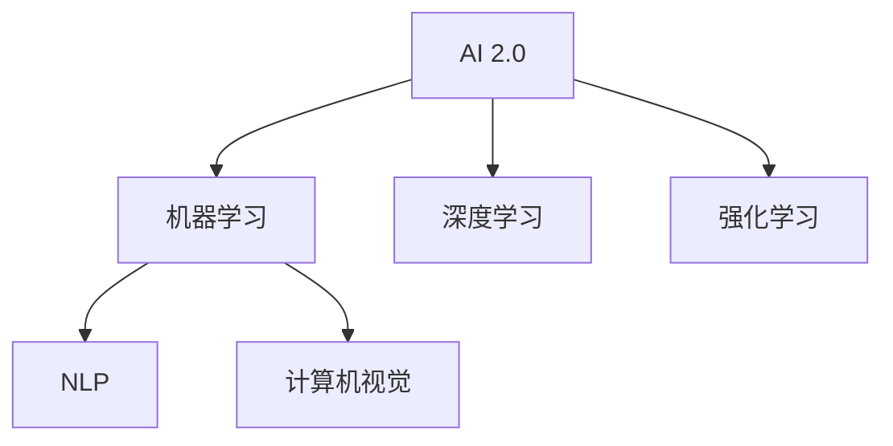

                 

# 李开复：AI 2.0 时代的市场前景

## 1. 背景介绍

在当前人工智能(AI)迅速发展的时代，李开复博士以其对AI领域的深刻洞察和前瞻性研究，提出了“AI 2.0”概念，即超越传统机器学习的智能化AI时代。李开复认为，AI 2.0将彻底改变各行各业的生产力，释放人类潜力，推动人类社会向智能化迈进。本文将从市场前景、技术挑战及未来展望三个方面，深入探讨AI 2.0时代的市场动态及其发展方向。

## 2. 核心概念与联系

### 2.1 核心概念概述

- **AI 2.0**：超越传统机器学习的智能化AI时代，通过深度学习和强化学习等技术，实现更加复杂的任务理解和执行。
- **机器学习**：一种基于数据和统计学原理的算法，使计算机能够自动改进决策和预测。
- **深度学习**：一种特殊的机器学习方法，利用多层神经网络模拟人脑神经元之间的连接关系。
- **强化学习**：通过试错和反馈机制，使智能体在环境中逐步优化其行为策略。
- **自然语言处理(NLP)**：使计算机能够理解、处理和生成人类语言的技术。
- **计算机视觉**：使计算机能够从图像或视频中提取、分析和理解信息的技术。

这些概念之间有着紧密的联系。AI 2.0的发展依赖于机器学习、深度学习和强化学习的进步，而这些技术的进展又推动了自然语言处理和计算机视觉等应用领域的突破。

### 2.2 核心概念原理和架构的 Mermaid 流程图



## 3. 核心算法原理 & 具体操作步骤

### 3.1 算法原理概述

AI 2.0的核心在于通过深度学习和强化学习等技术，构建具备智能感知、理解、推理和执行能力的AI系统。其基本原理如下：

1. **深度学习**：利用多层神经网络，自动提取输入数据的高级特征，从而进行复杂的分类、识别和预测任务。
2. **强化学习**：通过试错机制，智能体在环境中不断优化其策略，实现自动化决策和控制。
3. **迁移学习**：将已在大规模数据上预训练的模型迁移到新任务上，提高模型在新任务上的性能。
4. **无监督学习**：通过未标记的数据进行学习，发现数据的内在结构和模式。

### 3.2 算法步骤详解

AI 2.0的开发流程大致包括以下几个步骤：

1. **数据准备**：收集和处理所需的数据，确保数据质量和多样性。
2. **模型选择**：选择合适的深度学习或强化学习模型作为初始架构。
3. **模型训练**：使用大量标注数据对模型进行训练，使其能够适应特定任务。
4. **模型评估**：在验证集上评估模型性能，进行必要的调整和优化。
5. **部署和应用**：将训练好的模型部署到实际应用环境中，进行实时预测或决策。

### 3.3 算法优缺点

AI 2.0的主要优点包括：
- **高效性**：能够在大规模数据上高效训练和优化模型。
- **泛化能力**：模型通常具备较强的泛化能力，能够在不同场景下表现出色。
- **可解释性**：通过注意力机制、可解释性算法等手段，提高模型的可解释性。

然而，AI 2.0也存在以下缺点：
- **数据依赖**：对数据质量和标注准确性高度依赖，高质量数据的获取成本高。
- **计算资源需求高**：训练深度模型需要大量的计算资源，如高性能GPU和TPU。
- **模型复杂性**：模型结构复杂，难以理解和调试。
- **伦理和隐私问题**：模型可能学习到有害信息，存在数据隐私和伦理风险。

### 3.4 算法应用领域

AI 2.0的应用领域广泛，涵盖了医疗、金融、教育、智能制造、自动驾驶等多个行业。以下是几个典型的应用案例：

1. **医疗诊断**：通过深度学习模型分析医学影像，辅助医生进行疾病诊断和治疗方案制定。
2. **金融风险管理**：利用强化学习模型进行市场预测和风险评估，优化投资策略。
3. **教育个性化**：通过自然语言处理和深度学习技术，提供个性化的学习内容和教学策略。
4. **自动驾驶**：结合计算机视觉和强化学习，实现智能驾驶，提升行车安全和效率。
5. **智能客服**：通过自然语言处理和深度学习，构建智能客服系统，提升用户体验。

## 4. 数学模型和公式 & 详细讲解 & 举例说明

### 4.1 数学模型构建

AI 2.0中的深度学习模型通常由多层神经网络组成，其中以卷积神经网络(CNN)和循环神经网络(RNN)最为常用。

以卷积神经网络为例，其基本结构包括卷积层、池化层和全连接层。卷积层通过卷积核提取局部特征，池化层进行特征降维，全连接层进行分类预测。

### 4.2 公式推导过程

以卷积神经网络为例，其前向传播的计算过程可以表示为：

$$
y = \sigma(W(x) + b)
$$

其中 $x$ 为输入特征，$W$ 为卷积核权重，$b$ 为偏置项，$\sigma$ 为激活函数。

后向传播的计算过程为：

$$
\frac{\partial L}{\partial W} = \frac{\partial L}{\partial y} \cdot \frac{\partial y}{\partial W}
$$

其中 $L$ 为损失函数，$y$ 为模型输出。

### 4.3 案例分析与讲解

假设我们要训练一个简单的图像分类模型，识别狗和猫。使用卷积神经网络作为模型架构，通过大量标注数据进行训练。训练过程中，模型会自动学习到图像中的局部特征，如狗和猫的耳朵、眼睛等特征，并根据这些特征进行分类预测。在验证集上评估模型性能，通过调整模型参数和训练策略，进一步提升模型准确率。

## 5. 项目实践：代码实例和详细解释说明

### 5.1 开发环境搭建

以下是使用TensorFlow和Keras框架搭建卷积神经网络模型的示例：

1. 安装TensorFlow和Keras：
```bash
pip install tensorflow keras
```

2. 导入必要的库：
```python
import tensorflow as tf
from tensorflow.keras import layers, models
```

3. 构建模型：
```python
model = models.Sequential([
    layers.Conv2D(32, (3, 3), activation='relu', input_shape=(28, 28, 1)),
    layers.MaxPooling2D((2, 2)),
    layers.Conv2D(64, (3, 3), activation='relu'),
    layers.MaxPooling2D((2, 2)),
    layers.Conv2D(64, (3, 3), activation='relu'),
    layers.Flatten(),
    layers.Dense(64, activation='relu'),
    layers.Dense(10)
])
```

### 5.2 源代码详细实现

完整的卷积神经网络模型实现如下：

```python
import tensorflow as tf
from tensorflow.keras import layers, models

model = models.Sequential([
    layers.Conv2D(32, (3, 3), activation='relu', input_shape=(28, 28, 1)),
    layers.MaxPooling2D((2, 2)),
    layers.Conv2D(64, (3, 3), activation='relu'),
    layers.MaxPooling2D((2, 2)),
    layers.Conv2D(64, (3, 3), activation='relu'),
    layers.Flatten(),
    layers.Dense(64, activation='relu'),
    layers.Dense(10)
])

model.compile(optimizer='adam',
              loss=tf.keras.losses.SparseCategoricalCrossentropy(from_logits=True),
              metrics=['accuracy'])

model.summary()
```

### 5.3 代码解读与分析

上述代码中，我们使用Keras框架搭建了一个简单的卷积神经网络模型，用于手写数字识别任务。模型由多个卷积层、池化层和全连接层组成，最后使用softmax函数进行分类预测。在模型编译时，选择了Adam优化器和SparseCategoricalCrossentropy损失函数。通过模型summary输出，可以看到模型的结构参数和优化器信息。

### 5.4 运行结果展示

训练完成后，可以在测试集上评估模型性能：

```python
test_loss, test_acc = model.evaluate(test_images, test_labels, verbose=2)
print('Test accuracy:', test_acc)
```

## 6. 实际应用场景

### 6.1 智能医疗

在智能医疗领域，AI 2.0可以应用于疾病诊断、医疗影像分析、药物研发等。例如，利用深度学习模型分析医学影像，辅助医生进行疾病诊断和治疗方案制定。

### 6.2 智能制造

在智能制造领域，AI 2.0可以应用于生产调度、质量检测、设备维护等。例如，利用强化学习模型进行生产调度优化，提高生产效率和资源利用率。

### 6.3 自动驾驶

在自动驾驶领域，AI 2.0可以应用于环境感知、路径规划、决策控制等。例如，利用计算机视觉和深度学习技术进行环境感知，结合强化学习进行路径规划和决策控制。

### 6.4 未来应用展望

随着AI 2.0技术的不断发展，未来将会有更多的应用场景涌现。以下是几个可能的方向：

1. **智能家居**：通过语音和视觉识别技术，构建智能家居系统，提升用户生活体验。
2. **智能城市**：结合物联网和AI技术，实现智能交通、智慧能源、智能安防等应用，提升城市管理水平。
3. **智能金融**：利用AI 2.0技术进行市场预测、风险管理、智能投顾等，优化金融服务。

## 7. 工具和资源推荐

### 7.1 学习资源推荐

为了深入学习AI 2.0技术，以下是几个推荐的学习资源：

1. 《深度学习》：Ian Goodfellow的经典著作，详细介绍了深度学习的基本概念和算法。
2. 《AI Superconference》：每年举办的AI大会，汇集了全球顶尖的AI专家，分享最新的研究成果和技术进展。
3. 《TensorFlow官方文档》：TensorFlow的官方文档，提供了详细的API文档和使用指南。
4. 《Keras官方文档》：Keras的官方文档，提供了丰富的样例和教程，适合初学者入门。
5. 《Coursera AI课程》：Coursera平台上提供的AI相关课程，涵盖了机器学习、深度学习、强化学习等多个方面。

### 7.2 开发工具推荐

以下是几个常用的AI开发工具：

1. TensorFlow：Google开源的深度学习框架，支持多种硬件平台。
2. PyTorch：Facebook开源的深度学习框架，灵活性高，易于使用。
3. Keras：高级深度学习框架，支持多种后端引擎，适合快速开发。
4. Scikit-Learn：Python数据科学库，提供了丰富的机器学习算法和工具。
5. TensorBoard：TensorFlow的可视化工具，用于监控和调试深度学习模型。

### 7.3 相关论文推荐

以下是几个AI 2.0相关的经典论文：

1. AlphaGo Zero：DeepMind的AlphaGo Zero在围棋比赛中取得重大突破，展示了强化学习的强大能力。
2. Inception V3：Google提出的卷积神经网络架构，用于图像分类和识别任务。
3. Generative Adversarial Networks（GANs）：Ian Goodfellow提出的生成对抗网络，用于生成逼真的图像和视频。
4. TensorFlow Serving：Google的TensorFlow Serving平台，支持高效的模型部署和推理服务。
5. NVIDIA DGX-1：NVIDIA推出的高性能AI计算平台，支持大规模深度学习模型的训练和推理。

## 8. 总结：未来发展趋势与挑战

### 8.1 研究成果总结

AI 2.0技术已经在诸多领域展示了其强大的潜力，通过深度学习和强化学习等技术，提升了模型性能和应用效果。未来，AI 2.0有望进一步突破传统机器学习的瓶颈，实现更加智能和自动化的系统。

### 8.2 未来发展趋势

1. **技术融合**：AI 2.0将与其他AI技术（如自然语言处理、计算机视觉、增强现实等）进行更深入的融合，提升系统的综合能力和应用范围。
2. **跨领域应用**：AI 2.0将跨越多个行业和领域，形成智能化的产业生态系统，提升生产力和竞争力。
3. **伦理和隐私**：AI 2.0技术将更加注重伦理和隐私问题，构建更加安全和透明的AI系统。
4. **智能化生态**：AI 2.0将构建智能化生态系统，包括智能家居、智能城市、智能交通等，提升人类生活质量。

### 8.3 面临的挑战

1. **数据质量**：高质量、多样化的数据是AI 2.0的基础，如何获取和处理大量高质量数据，仍是一个重要挑战。
2. **计算资源**：训练深度学习模型需要大量的计算资源，如何优化资源使用，提高模型训练效率，是一个亟待解决的问题。
3. **模型可解释性**：AI 2.0模型通常结构复杂，难以理解和调试，如何提高模型的可解释性，增强用户信任，是一个重要挑战。
4. **伦理和隐私**：AI 2.0模型可能学习到有害信息，存在数据隐私和伦理风险，如何保障数据安全和隐私，是一个重要的课题。

### 8.4 研究展望

1. **多模态融合**：将语音、图像、文本等多模态数据进行融合，提升模型的综合能力和应用效果。
2. **自监督学习**：利用自监督学习方法，减少对标注数据的依赖，提高模型的泛化能力。
3. **模型压缩和优化**：通过模型压缩、稀疏化等技术，提高模型的推理效率和资源利用率。
4. **伦理和隐私保护**：构建更加安全和透明的AI系统，保障数据安全和隐私。

## 9. 附录：常见问题与解答

**Q1：AI 2.0与传统机器学习有何不同？**

A: AI 2.0突破了传统机器学习的瓶颈，利用深度学习和强化学习等技术，构建具备智能感知、理解、推理和执行能力的AI系统。

**Q2：AI 2.0在实际应用中面临哪些挑战？**

A: AI 2.0面临数据质量、计算资源、模型可解释性、伦理和隐私等挑战，需要通过多模态融合、自监督学习、模型压缩等技术进行优化。

**Q3：AI 2.0的未来发展方向是什么？**

A: AI 2.0的未来发展方向包括技术融合、跨领域应用、伦理和隐私保护等。通过不断优化和创新，AI 2.0将推动人类社会向智能化迈进。

---

作者：禅与计算机程序设计艺术 / Zen and the Art of Computer Programming

