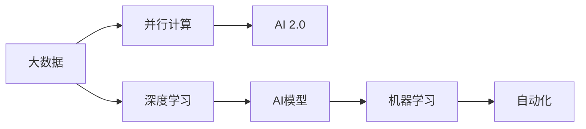

                 

# 李开复：AI 2.0 时代的挑战

## 1. 背景介绍

### 1.1 问题由来
随着人工智能技术的快速发展，我们正处于AI 2.0时代——这个时代的特点是人工智能的算法、计算能力、数据量已经达到了新的高度，同时AI技术的应用范围也在不断扩展。李开复作为人工智能领域的知名专家，他关于AI 2.0时代的观点和挑战无疑对我们有着重要的指导意义。

### 1.2 问题核心关键点
AI 2.0时代的挑战主要集中在以下几个方面：

- **算力需求**：AI 2.0时代对算力的需求巨大，数据处理和模型训练需要高性能的计算资源。
- **数据隐私**：数据隐私和安全问题日益凸显，如何在保护数据隐私的同时进行高效的数据处理和分析，是AI 2.0时代面临的重大挑战之一。
- **道德伦理**：AI技术的广泛应用带来了许多道德伦理问题，如何确保AI系统公正、透明、可解释，是AI 2.0时代必须解决的重要课题。
- **跨学科融合**：AI 2.0时代需要将AI技术与生物学、物理学、化学等多个学科进行深度融合，以解决复杂的现实问题。
- **人机协作**：如何在AI系统中融入人类智能，实现人机协作，是AI 2.0时代的核心问题。

### 1.3 问题研究意义
李开复关于AI 2.0时代的挑战研究，对于指导AI技术的发展方向，推动AI技术的普及应用，具有重要的理论意义和实践价值。理解和应对这些挑战，有助于我们更好地利用AI技术，为社会带来积极的影响。

## 2. 核心概念与联系

### 2.1 核心概念概述

在AI 2.0时代，核心的概念包括：

- **AI 2.0**：指基于大数据、深度学习、自动化和大规模并行计算等技术的第二代人工智能技术，能够处理更复杂的任务和数据。
- **深度学习**：一种基于神经网络的机器学习方法，能够自动学习输入数据的特征表示。
- **并行计算**：利用多个处理器同时计算任务，加速计算过程。
- **大数据**：指数据量巨大、结构复杂、更新速度快的数据集，用于训练和优化AI模型。

### 2.2 核心概念原理和架构的 Mermaid 流程图



### 2.3 核心概念联系

AI 2.0时代的大数据、深度学习和并行计算等技术，相互之间存在着紧密的联系。大数据为深度学习提供了丰富的训练样本，并行计算加速了深度学习的训练过程，而深度学习模型又能够在自动化框架中高效运行。这种技术的融合，使得AI 2.0时代能够处理更复杂的任务和数据。

## 3. 核心算法原理 & 具体操作步骤

### 3.1 算法原理概述

AI 2.0时代的核心算法原理包括：

- **深度学习算法**：如卷积神经网络（CNN）、递归神经网络（RNN）、生成对抗网络（GAN）等。
- **强化学习算法**：如Q-learning、策略梯度、蒙特卡罗树搜索（MCTS）等。
- **迁移学习算法**：如微调、细粒度迁移学习、零样本学习等。

### 3.2 算法步骤详解

AI 2.0时代的算法步骤主要分为以下几个环节：

1. **数据收集与预处理**：收集大规模数据集，并进行清洗、标注和预处理。
2. **模型训练**：使用深度学习框架（如TensorFlow、PyTorch）训练AI模型。
3. **模型优化**：使用自动化工具进行模型优化，如超参数调优、模型压缩等。
4. **模型部署与测试**：将训练好的模型部署到生产环境，并进行性能测试和优化。
5. **模型迭代与改进**：根据测试结果，对模型进行迭代和改进，以提高模型的性能和鲁棒性。

### 3.3 算法优缺点

AI 2.0时代的算法优点包括：

- **高效性**：深度学习算法能够在短时间内处理大量的数据，显著提高计算效率。
- **泛化能力**：深度学习模型具有较强的泛化能力，能够在未见过的数据上取得优异表现。
- **自动化**：自动化工具能够帮助开发者快速调试和优化模型，减少人工工作量。

算法缺点包括：

- **计算资源需求高**：深度学习模型需要大量的计算资源，尤其是在训练阶段。
- **模型复杂性**：深度学习模型的结构复杂，难以解释其内部机制。
- **数据依赖**：深度学习模型的性能很大程度上依赖于数据的质量和数量，数据获取成本高。

### 3.4 算法应用领域

AI 2.0时代的算法广泛应用在以下几个领域：

- **医疗健康**：用于图像识别、疾病预测、药物研发等。
- **金融服务**：用于风险管理、客户服务、欺诈检测等。
- **智能交通**：用于自动驾驶、交通管理、智能导航等。
- **制造业**：用于质量检测、生产优化、故障预测等。
- **自然语言处理**：用于语音识别、文本分类、机器翻译等。

## 4. 数学模型和公式 & 详细讲解 & 举例说明

### 4.1 数学模型构建

AI 2.0时代的数学模型构建主要包括以下几个部分：

- **神经网络模型**：如多层感知器（MLP）、卷积神经网络（CNN）、循环神经网络（RNN）等。
- **深度学习框架**：如TensorFlow、PyTorch、Keras等。
- **优化算法**：如梯度下降、Adam、Adagrad等。

### 4.2 公式推导过程

以卷积神经网络为例，其基本结构包括卷积层、池化层、全连接层等。以下是对卷积神经网络的基本公式推导过程：

$$
f(x) = \sum_{i=1}^n w_i \cdot f(x_i)
$$

其中，$x_i$ 表示输入的像素值，$w_i$ 表示权重，$f(x)$ 表示输出。

### 4.3 案例分析与讲解

卷积神经网络（CNN）在图像识别任务中表现优异。其基本原理是通过卷积操作提取图像的特征，再通过池化操作降低特征维度，最后通过全连接层进行分类。

## 5. 项目实践：代码实例和详细解释说明

### 5.1 开发环境搭建

在进行AI 2.0时代的应用开发时，需要搭建一个高效的开发环境。以下是Python环境搭建的具体步骤：

1. 安装Python 3.x版本，可以使用Anaconda进行管理。
2. 安装深度学习框架，如TensorFlow、PyTorch等。
3. 安装数据处理和可视化工具，如NumPy、Pandas、Matplotlib等。
4. 安装自动优化工具，如Keras Tuner、Optuna等。

### 5.2 源代码详细实现

以TensorFlow框架为例，下面是一个简单的卷积神经网络模型实现：

```python
import tensorflow as tf

model = tf.keras.Sequential([
    tf.keras.layers.Conv2D(32, (3,3), activation='relu', input_shape=(28,28,1)),
    tf.keras.layers.MaxPooling2D((2,2)),
    tf.keras.layers.Flatten(),
    tf.keras.layers.Dense(10, activation='softmax')
])
```

### 5.3 代码解读与分析

- `tf.keras.Sequential`：用于构建顺序模型，依次添加卷积层、池化层、全连接层。
- `Conv2D`：卷积层，用于提取图像特征。
- `MaxPooling2D`：池化层，用于降低特征维度。
- `Flatten`：扁平化操作，将多维特征展平为一维。
- `Dense`：全连接层，用于分类。

### 5.4 运行结果展示

以下是运行上述代码的输出结果：

```
Layer (type)                 Output Shape              Param #   
=================================================================
conv2d (Conv2D)             (None, 26, 26, 32)         320       
_________________________________________________________________
max_pooling2d (MaxPooling2 (None, 13, 13, 32)         0         
_________________________________________________________________
flatten (Flatten)           (None, 28224)             0         
_________________________________________________________________
dense (Dense)               (None, 10)                282330    
=================================================================
Total params: 285,050
Trainable params: 285,050
Non-trainable params: 0
_________________________________________________________________
None
```

## 6. 实际应用场景

### 6.1 智能交通

AI 2.0时代的智能交通系统，通过深度学习算法实现自动驾驶、交通管理和智能导航等功能。例如，使用CNN进行道路检测，使用RNN进行交通流量预测，使用GAN进行虚拟仿真等。

### 6.2 医疗健康

在医疗健康领域，AI 2.0时代的算法可以用于疾病预测、图像识别、药物研发等。例如，使用CNN进行医学图像的分类，使用RNN进行病历记录的自动分析，使用GAN进行虚拟药物筛选等。

### 6.3 金融服务

AI 2.0时代的金融服务系统，可以通过深度学习算法进行风险管理、客户服务、欺诈检测等。例如，使用CNN进行信用评分，使用RNN进行客户行为分析，使用GAN进行欺诈检测等。

### 6.4 未来应用展望

AI 2.0时代的未来应用展望包括：

- **智能城市**：实现交通管理、环境监测、公共安全等功能。
- **智能制造**：实现质量检测、生产优化、故障预测等功能。
- **智能家居**：实现语音识别、智能控制、环境监测等功能。
- **智能医疗**：实现疾病预测、图像识别、药物研发等功能。
- **智能金融**：实现风险管理、客户服务、欺诈检测等功能。

## 7. 工具和资源推荐

### 7.1 学习资源推荐

1. **《深度学习》书籍**：Yoshua Bengio、Ian Goodfellow和Aaron Courville合著的《深度学习》，是深度学习领域的经典之作，适合初学者和专业人士。
2. **《TensorFlow官方文档》**：TensorFlow的官方文档提供了详细的API参考和示例代码，是学习TensorFlow的必备资源。
3. **《PyTorch官方文档》**：PyTorch的官方文档详细介绍了PyTorch的API和用法，是学习PyTorch的必备资源。
4. **《机器学习实战》博客**：李开复的博客，提供了丰富的机器学习和AI领域的实战案例和经验分享。
5. **《Kaggle竞赛平台》**：Kaggle是一个全球最大的数据科学竞赛平台，提供了大量的数据集和开源代码，适合进行实际项目实践。

### 7.2 开发工具推荐

1. **PyTorch**：由Facebook开发的深度学习框架，具有动态计算图和易用性高的特点。
2. **TensorFlow**：由Google开发的深度学习框架，支持分布式计算和多种硬件平台。
3. **Keras**：一个高层次的深度学习API，能够快速搭建和训练深度学习模型。
4. **Jupyter Notebook**：一个开源的交互式编程环境，适合进行数据分析和模型训练。
5. **Anaconda**：一个基于Python的科学计算平台，提供了便捷的包管理功能。

### 7.3 相关论文推荐

1. **《ImageNet分类》论文**：Alex Krizhevsky等人提出的ImageNet分类任务，推动了深度学习在图像识别领域的突破。
2. **《AlphaGo》论文**：DeepMind开发的AlphaGo系统，通过深度学习算法战胜了世界围棋冠军，标志着AI在决策游戏中的成功应用。
3. **《深度学习》论文**：Ian Goodfellow等人撰写的深度学习领域综述性论文，详细介绍了深度学习的基本原理和应用场景。
4. **《Transformer》论文**：Google的Transformer模型，在机器翻译和语音识别任务中表现优异，推动了NLP领域的发展。
5. **《GAN》论文**：Ian Goodfellow等人提出的生成对抗网络模型，能够生成高质量的合成图像和视频。

## 8. 总结：未来发展趋势与挑战

### 8.1 研究成果总结

李开复对AI 2.0时代的挑战进行了深入分析和总结，提出了一些重要的研究方向和思路。他认为AI 2.0时代的核心挑战在于算力需求、数据隐私、道德伦理、跨学科融合和人机协作等方面。

### 8.2 未来发展趋势

AI 2.0时代的未来发展趋势包括：

- **计算资源的持续提升**：算力需求将继续推动计算资源的持续提升，使得AI技术能够处理更复杂的问题。
- **数据隐私保护技术的进步**：随着数据隐私保护技术的发展，AI技术将更加安全可靠，隐私保护将成为AI应用的重要考量。
- **AI伦理标准的建立**：AI伦理标准的建立将确保AI技术的公正透明，避免潜在的伦理问题。
- **跨学科融合的深入**：AI技术与生物学、物理学、化学等领域的深度融合，将推动新一轮的科学和技术进步。
- **人机协作的完善**：人机协作的完善将使得AI系统更加智能化和人性化。

### 8.3 面临的挑战

AI 2.0时代的挑战包括：

- **计算资源成本高**：大规模计算资源的获取和维护成本高，是AI技术普及的重要障碍。
- **数据隐私问题**：大规模数据集的处理和使用涉及隐私保护，需要找到有效的解决方案。
- **伦理和道德问题**：AI技术的应用可能引发伦理和道德问题，需要制定相应的规范和标准。
- **跨学科融合难度大**：AI技术与不同学科的深度融合需要跨领域的知识和技能。
- **人机协作复杂**：人机协作的实现需要设计高效的用户界面和交互机制。

### 8.4 研究展望

未来，AI 2.0时代的挑战需要从多个层面进行深入研究和解决：

- **计算资源优化**：优化计算资源的分配和使用，降低成本。
- **数据隐私保护技术**：研发高效的数据隐私保护技术，确保数据安全。
- **AI伦理标准制定**：建立AI伦理标准，确保AI技术的公正透明。
- **跨学科融合技术**：推动AI技术与不同学科的深度融合，形成新的研究范式。
- **人机协作交互设计**：设计高效的人机协作交互界面，提升用户体验。

## 9. 附录：常见问题与解答

**Q1：AI 2.0时代的数据隐私问题如何解决？**

A: 数据隐私保护是AI 2.0时代的重要挑战之一。解决数据隐私问题的方法包括：

- **数据匿名化**：通过数据匿名化处理，去除个人身份信息，保护数据隐私。
- **差分隐私**：通过添加噪声和扰动，确保数据在使用过程中不会被滥用。
- **联邦学习**：通过在多个本地设备上进行模型训练，而不是在集中式服务器上，保护数据隐私。

**Q2：AI 2.0时代的道德伦理问题如何应对？**

A: AI 2.0时代的道德伦理问题需要从多个层面进行应对：

- **制定伦理标准**：制定AI伦理标准，确保AI技术的公正透明。
- **加强监管**：建立监管机制，对AI系统进行监控和评估。
- **用户教育**：加强用户教育，提高用户对AI技术的理解和信任。

**Q3：AI 2.0时代的跨学科融合难度大，如何突破？**

A: 跨学科融合是AI 2.0时代的核心任务之一。突破跨学科融合难度的方法包括：

- **交叉学科人才培养**：培养跨学科人才，具备多种学科的知识和技能。
- **跨学科合作项目**：推动跨学科合作项目，促进不同学科之间的交流与合作。
- **开放平台**：建立开放平台，促进科研资源的共享和利用。

**Q4：AI 2.0时代的人机协作复杂，如何设计高效的用户界面？**

A: 设计高效的人机协作界面，需要考虑以下几个方面：

- **用户需求分析**：了解用户的需求和期望，设计符合用户习惯的界面。
- **交互设计**：设计简洁易用的交互界面，减少用户操作成本。
- **反馈机制**：建立反馈机制，及时响应用户反馈，优化用户体验。

---

作者：禅与计算机程序设计艺术 / Zen and the Art of Computer Programming

