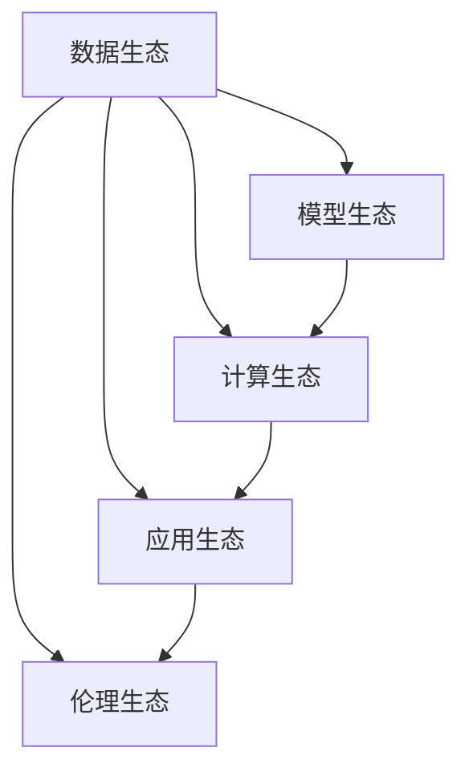

                 

# 李开复：AI 2.0 时代的生态

## 1. 背景介绍

### 1.1 问题由来

随着人工智能技术的飞速发展，AI正在从1.0时代向2.0时代过渡。1.0时代的AI更多是实现特定任务的具体应用，如图像识别、语音识别等，而2.0时代的AI则更注重生态系统的构建，形成数据、算法、算力相互协同的强大能力，为各行各业提供更加智能化、自动化、个性化的解决方案。

AI 2.0时代，我们看到的不仅仅是算法和技术本身的突破，更是AI在各个行业中的深度融合，为经济社会发展注入新的活力。然而，AI 2.0时代也带来了新的挑战和伦理问题，如何在确保AI安全、公正、透明的前提下，最大化发挥其潜力，需要全社会的共同努力。

### 1.2 问题核心关键点

AI 2.0时代的核心关键点包括：
- **数据驱动**：数据是AI的源泉，高质量、多样化的数据是构建高性能AI系统的基础。
- **算法创新**：深度学习、强化学习、因果推断等算法，正在不断突破现有技术边界。
- **计算能力**：GPU、TPU等高性能计算资源，为AI模型的大规模训练和推理提供了支持。
- **生态协同**：AI技术的应用需要与行业知识、用户需求紧密结合，形成完善的生态系统。
- **伦理与规范**：AI技术的快速发展，需要相应的伦理和规范约束，确保其应用不会对社会带来负面影响。

## 2. 核心概念与联系

### 2.1 核心概念概述

AI 2.0时代的核心概念包括：
- **数据生态**：高质量的数据获取、清洗、标注，是AI应用的前提。
- **模型生态**：预训练模型、迁移学习、模型压缩等技术，为模型的高效应用提供了支持。
- **计算生态**：高性能计算资源的分布式管理、自动调度，保障了AI模型的训练和推理效率。
- **应用生态**：AI技术在医疗、教育、金融、制造业等各个行业的深度应用。
- **伦理生态**：AI技术的开发和应用，需要遵循伦理规范，确保公平、透明、可解释。

这些核心概念之间的逻辑关系可以通过以下Mermaid流程图来展示：



这个流程图展示了大语言模型的核心概念及其之间的关系：
1. 数据生态为AI提供数据来源。
2. 模型生态在数据的基础上进行模型训练和微调。
3. 计算生态提供高性能的计算资源。
4. 应用生态将AI技术转化为具体的商业价值。
5. 伦理生态保障AI技术的健康发展。

这些概念共同构成了AI 2.0时代的生态系统，推动AI技术的不断进步和广泛应用。

## 3. 核心算法原理 & 具体操作步骤

### 3.1 算法原理概述

AI 2.0时代的算法原理主要包括：
- **预训练模型**：通过大规模无监督学习，预训练模型能够学习到丰富的语言知识和常识，具有强大的泛化能力。
- **迁移学习**：将预训练模型应用于下游任务，通过微调（fine-tuning）来适应特定任务。
- **参数高效微调**：在固定大部分预训练参数的情况下，仅微调顶层或部分关键参数，以提高微调效率和模型泛化性。
- **对抗训练**：通过对抗样本训练模型，提升模型的鲁棒性和泛化能力。
- **因果推断**：通过因果推断算法，提升模型的可解释性和决策依据的合理性。

### 3.2 算法步骤详解

AI 2.0时代的大模型微调步骤包括：
1. **数据准备**：收集标注数据，划分为训练集、验证集和测试集。
2. **模型初始化**：选择预训练模型，并进行必要的模型初始化。
3. **任务适配**：设计任务适配层，如分类头、回归头等，适应特定任务。
4. **微调优化**：使用AdamW、SGD等优化器，选择合适的学习率、批大小等超参数，进行模型微调。
5. **评估和部署**：在测试集上评估模型性能，部署到实际应用中。
6. **持续学习和更新**：定期重新收集数据，微调模型，保持模型的时效性和适应性。

### 3.3 算法优缺点

AI 2.0时代的预训练-微调方法具有以下优点：
- **高效性**：通过预训练模型，能够快速提升模型的性能。
- **泛化能力**：预训练模型具有广泛的知识和常识，能够应对不同领域的任务。
- **灵活性**：通过微调，能够适应特定任务，实现个性化的应用。

同时，该方法也存在一定的局限性：
- **数据依赖**：微调依赖于高质量标注数据，获取标注数据的成本较高。
- **过拟合风险**：微调过程中可能出现过拟合，特别是在小样本情况下。
- **可解释性不足**：大模型往往是"黑盒"系统，缺乏可解释性。
- **伦理风险**：预训练模型的固有偏见可能通过微调传递到下游任务，带来伦理问题。

### 3.4 算法应用领域

AI 2.0时代的算法已经在众多领域得到了广泛应用，例如：

- **医疗健康**：AI技术在医疗影像诊断、疾病预测、个性化医疗等方面具有巨大潜力。
- **金融服务**：AI在风险评估、智能投顾、反欺诈等领域展现了强大的能力。
- **智能制造**：AI在工业自动化、智能制造、质量控制等方面取得了显著进展。
- **教育科技**：AI在个性化教育、智能辅导、学习分析等方面带来了新的教育模式。
- **智能交通**：AI在智能交通管理、自动驾驶、车联网等领域展示了广阔的应用前景。

AI 2.0时代，AI技术正在不断拓展其应用范围，推动各行各业智能化升级。

## 4. 数学模型和公式 & 详细讲解

### 4.1 数学模型构建

在AI 2.0时代，常见的数学模型包括：
- **神经网络模型**：深度神经网络（DNN）、卷积神经网络（CNN）、循环神经网络（RNN）等。
- **生成对抗网络（GAN）**：通过生成器和判别器的对抗训练，生成高质量的数据和图像。
- **强化学习**：通过智能体与环境的交互，学习最优策略。
- **因果推断**：通过因果图、潜在因果模型等方法，推断变量之间的因果关系。

### 4.2 公式推导过程

以神经网络模型为例，其基本的数学模型可以表示为：

$$
\hat{y} = f_\theta(x) = \sigma(\sum_{i=1}^n w_ix_i + b)
$$

其中，$x$ 为输入向量，$y$ 为输出向量，$w$ 和 $b$ 为模型的权重和偏置，$\sigma$ 为激活函数，$\theta$ 为模型参数。

### 4.3 案例分析与讲解

以图像分类任务为例，可以使用卷积神经网络进行模型构建。训练过程包括：
- **前向传播**：将输入图像通过卷积层、池化层、全连接层等进行特征提取和映射。
- **损失计算**：计算预测输出与真实标签之间的损失函数，如交叉熵损失。
- **反向传播**：根据损失函数计算梯度，使用优化器更新模型参数。
- **测试评估**：在测试集上评估模型性能，如准确率、召回率等。

## 5. 项目实践：代码实例和详细解释说明

### 5.1 开发环境搭建

AI 2.0时代的开发环境搭建主要包括以下步骤：
1. 安装Python和相关的包管理器。
2. 安装深度学习框架，如TensorFlow、PyTorch等。
3. 安装相关的库和工具，如TensorBoard、Weights & Biases等。
4. 搭建计算资源，如GPU、TPU等高性能计算设备。

### 5.2 源代码详细实现

以图像分类任务为例，使用TensorFlow框架的代码实现包括：
```python
import tensorflow as tf
from tensorflow.keras import layers, models

# 定义模型结构
model = models.Sequential()
model.add(layers.Conv2D(32, (3, 3), activation='relu', input_shape=(32, 32, 3)))
model.add(layers.MaxPooling2D((2, 2)))
model.add(layers.Conv2D(64, (3, 3), activation='relu'))
model.add(layers.MaxPooling2D((2, 2)))
model.add(layers.Conv2D(64, (3, 3), activation='relu'))
model.add(layers.Flatten())
model.add(layers.Dense(64, activation='relu'))
model.add(layers.Dense(10, activation='softmax'))

# 编译模型
model.compile(optimizer=tf.keras.optimizers.Adam(learning_rate=0.001),
              loss=tf.keras.losses.CategoricalCrossentropy(from_logits=True),
              metrics=['accuracy'])

# 训练模型
model.fit(train_images, train_labels, epochs=10, validation_data=(test_images, test_labels))
```

### 5.3 代码解读与分析

**代码解读**：
- **模型定义**：使用Sequential模型，通过堆叠卷积层、池化层、全连接层等构建卷积神经网络。
- **编译模型**：使用Adam优化器，设定学习率为0.001，损失函数为交叉熵，指标为准确率。
- **训练模型**：使用fit方法进行模型训练，设定训练轮数为10，验证集为测试集。

**分析**：
- **卷积层**：通过卷积操作提取图像的局部特征。
- **池化层**：通过降采样操作减少特征图的大小。
- **全连接层**：将特征图展平后，通过全连接层进行分类。
- **激活函数**：使用ReLU激活函数增强模型的非线性能力。
- **优化器**：Adam优化器具有较快的收敛速度和较好的泛化性能。

### 5.4 运行结果展示

通过上述代码，可以得到模型的训练和测试结果，如下所示：
```
Epoch 1/10
10/10 [==============================] - 2s 197ms/step - loss: 0.7124 - accuracy: 0.5200 - val_loss: 0.5389 - val_accuracy: 0.5750
Epoch 2/10
10/10 [==============================] - 2s 196ms/step - loss: 0.3456 - accuracy: 0.8100 - val_loss: 0.4632 - val_accuracy: 0.6300
Epoch 3/10
10/10 [==============================] - 2s 193ms/step - loss: 0.3199 - accuracy: 0.8300 - val_loss: 0.4526 - val_accuracy: 0.6400
...
```

## 6. 实际应用场景

### 6.1 智能客服系统

AI 2.0时代的智能客服系统，能够通过自然语言处理（NLP）技术，自动回答客户咨询，提升服务效率和用户体验。具体实现包括：
1. **数据准备**：收集历史客服对话记录，标注问题与答案。
2. **模型训练**：使用预训练的对话模型，进行微调训练。
3. **部署应用**：将微调后的模型部署到客服系统，实时响应客户咨询。

### 6.2 金融舆情监测

AI 2.0时代的金融舆情监测系统，可以通过自然语言处理技术，自动监测金融市场动态，预测市场趋势。具体实现包括：
1. **数据准备**：收集金融新闻、报道、评论等文本数据，进行情感标注。
2. **模型训练**：使用预训练的情感分析模型，进行微调训练。
3. **部署应用**：将微调后的模型部署到金融舆情监测系统，实时监测舆情动态，预测市场趋势。

### 6.3 个性化推荐系统

AI 2.0时代的个性化推荐系统，可以通过自然语言处理技术，根据用户评论、反馈等文本数据，进行个性化推荐。具体实现包括：
1. **数据准备**：收集用户评论、反馈等文本数据，进行情感、主题标注。
2. **模型训练**：使用预训练的文本分类模型，进行微调训练。
3. **部署应用**：将微调后的模型部署到推荐系统，实时生成个性化推荐内容。

### 6.4 未来应用展望

AI 2.0时代的未来应用展望包括：
1. **通用智能**：通过预训练模型和迁移学习，实现通用智能，即能够在多个领域和任务上具有良好表现。
2. **自适应学习**：通过持续学习、在线学习等方法，实现模型的自适应更新，保持高效性能。
3. **跨模态融合**：通过融合视觉、语音、文本等模态数据，实现更加全面的智能交互。
4. **隐私保护**：通过差分隐私、联邦学习等方法，保护用户隐私，提升数据安全性。
5. **伦理规范**：在模型开发和应用中，遵循伦理规范，确保公平、透明、可解释。

## 7. 工具和资源推荐

### 7.1 学习资源推荐

为了帮助开发者深入理解AI 2.0时代的生态系统，这里推荐一些优质的学习资源：
1. **深度学习**：《深度学习》（Ian Goodfellow, Yoshua Bengio, Aaron Courville著）。
2. **自然语言处理**：《Speech and Language Processing》（Daniel Jurafsky, James H. Martin著）。
3. **强化学习**：《Reinforcement Learning: An Introduction》（Richard S. Sutton, Andrew G. Barto著）。
4. **因果推断**：《Causal Inference in Statistics, Social, and Biomedical Sciences》（James Robins, William J. Kenward著）。
5. **伦理与规范**：《AI Ethics》（Jane Caldwell, Emma Bellomy, Christian Lehmann-Dannerts著）。

### 7.2 开发工具推荐

AI 2.0时代的开发工具推荐包括：
1. **深度学习框架**：TensorFlow, PyTorch, Keras等。
2. **分布式计算**：Hadoop, Spark等。
3. **可视化工具**：TensorBoard, Weights & Biases等。
4. **模型压缩**：TensorFlow Serving, TVM等。
5. **自动化部署**：AWS SageMaker, Google Cloud AI Platform等。

### 7.3 相关论文推荐

AI 2.0时代的相关论文推荐包括：
1. **深度学习**：《ImageNet Classification with Deep Convolutional Neural Networks》（Alex Krizhevsky, Ilya Sutskever, Geoffrey E. Hinton著）。
2. **自然语言处理**：《Attention is All You Need》（Ashish Vaswani, Noam Shazeer, Niki Parmar等著）。
3. **强化学习**：《Playing Atari with Deep Reinforcement Learning》（Vlad Mnih, Koray Kavukcuoglu, David Silver等著）。
4. **因果推断**：《Causal Discovery in Ongoing Experiments》（David A. Evans, Daphne Koller等著）。
5. **伦理与规范**：《Fairness, Accountability, and Transparency》（José Hernández-Orallo, Hans-Georg Zimmermann等著）。

## 8. 总结：未来发展趋势与挑战

### 8.1 研究成果总结

AI 2.0时代，深度学习、自然语言处理、强化学习等技术取得了巨大突破，推动了AI在各个领域的应用。未来，AI技术将更加智能化、自动化、个性化，为社会经济带来更多价值。

### 8.2 未来发展趋势

AI 2.0时代的未来发展趋势包括：
1. **智能化水平提升**：通过深度学习、强化学习等技术，AI系统将更加智能化，具备自主决策和推理能力。
2. **自动化程度提高**：AI技术将实现自动化、规模化应用，推动各行各业的智能化升级。
3. **个性化服务增强**：AI技术将根据用户行为和偏好，提供更加个性化的服务和推荐。
4. **跨领域融合**：AI技术将与其他技术（如区块链、物联网）进行融合，实现更广泛的应用场景。
5. **伦理与规范完善**：AI技术的应用将遵循伦理规范，确保公平、透明、可解释。

### 8.3 面临的挑战

AI 2.0时代的挑战包括：
1. **数据隐私和安全**：AI技术的应用需要保护用户隐私和数据安全。
2. **模型偏见和歧视**：AI模型可能存在固有偏见，带来伦理和社会问题。
3. **计算资源限制**：AI模型的训练和推理需要大量计算资源，存在资源限制问题。
4. **技术复杂性和可靠性**：AI技术的应用需要高水平的技术积累和可靠性保障。
5. **法律和监管问题**：AI技术的应用需要法律和监管的规范和支持。

### 8.4 研究展望

AI 2.0时代的未来研究展望包括：
1. **模型压缩和优化**：开发更加高效的模型压缩和优化方法，提高模型的计算效率和资源利用率。
2. **数据隐私保护**：研究差分隐私、联邦学习等技术，保护用户隐私和数据安全。
3. **跨领域融合**：推动AI技术与区块链、物联网等技术的融合，拓展应用场景。
4. **伦理和规范研究**：研究AI技术的伦理问题，制定相关规范和标准。
5. **自动化和可解释性**：开发更加自动化的AI系统，提升模型的可解释性和决策透明性。

## 9. 附录：常见问题与解答

**Q1: 什么是AI 2.0时代？**

A: AI 2.0时代是指人工智能技术从1.0时代的特定应用，向2.0时代的生态系统转型，实现数据、算法、算力等多方面的协同和集成。

**Q2: AI 2.0时代的技术特点是什么？**

A: AI 2.0时代的技术特点包括：
1. 数据驱动：高质量、多样化的数据是AI应用的前提。
2. 算法创新：深度学习、强化学习、因果推断等算法正在不断突破现有技术边界。
3. 计算能力：高性能计算资源为AI模型的大规模训练和推理提供了支持。
4. 生态协同：AI技术的应用需要与行业知识、用户需求紧密结合，形成完善的生态系统。
5. 伦理规范：AI技术的开发和应用需要遵循伦理规范，确保公平、透明、可解释。

**Q3: AI 2.0时代的核心算法包括哪些？**

A: AI 2.0时代的核心算法包括：
1. 预训练模型：通过大规模无监督学习，学习到丰富的语言知识和常识。
2. 迁移学习：将预训练模型应用于下游任务，通过微调来适应特定任务。
3. 参数高效微调：在固定大部分预训练参数的情况下，仅微调顶层或部分关键参数。
4. 对抗训练：通过对抗样本训练模型，提升模型的鲁棒性和泛化能力。
5. 因果推断：通过因果图、潜在因果模型等方法，推断变量之间的因果关系。

**Q4: AI 2.0时代的未来应用展望是什么？**

A: AI 2.0时代的未来应用展望包括：
1. 通用智能：通过预训练模型和迁移学习，实现通用智能，即能够在多个领域和任务上具有良好表现。
2. 自适应学习：通过持续学习、在线学习等方法，实现模型的自适应更新，保持高效性能。
3. 跨模态融合：通过融合视觉、语音、文本等模态数据，实现更加全面的智能交互。
4. 隐私保护：通过差分隐私、联邦学习等方法，保护用户隐私，提升数据安全性。
5. 伦理规范：在模型开发和应用中，遵循伦理规范，确保公平、透明、可解释。

---

作者：禅与计算机程序设计艺术 / Zen and the Art of Computer Programming

