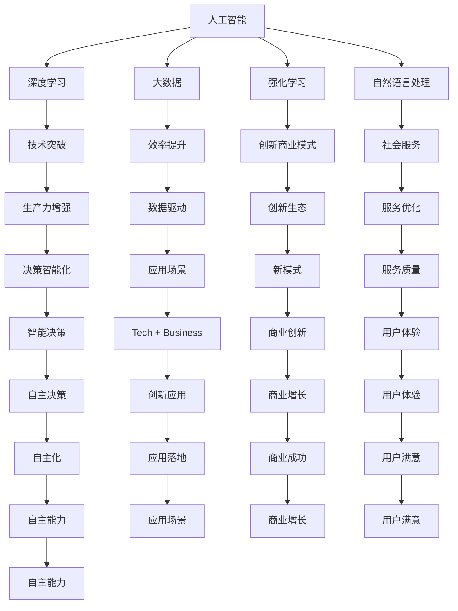

                 

# 李开复：AI 2.0 时代的科技价值

> 关键词：人工智能,AI 2.0,科技伦理,人工智能治理,可持续创新

## 1. 背景介绍

在科技日新月异的今天，人工智能(AI)已经成为引领未来的关键力量。人工智能不仅在科技研发、商业应用、社会服务等多个领域发挥着重要作用，还深刻影响着我们的生活方式和工作方式。作为深度学习领域的奠基人之一，李开复博士在AI领域的深入研究和应用实践为全社会提供了宝贵的洞见。本文将从李开复博士的视角出发，深入探讨AI 2.0时代的科技价值，并结合实际应用场景，分析AI技术对未来社会的深远影响。

## 2. 核心概念与联系

### 2.1 核心概念概述

在李开复博士的理论框架中，AI 2.0代表着新一代的人工智能技术，其核心特征包括深度学习、大数据、强化学习、自然语言处理等。AI 2.0时代的科技价值主要体现在以下几个方面：

1. **技术突破与创新**：AI 2.0通过深度学习等先进技术，使得机器能够更智能地处理复杂任务，推动了各个领域的科技创新。
2. **效率提升与生产力增强**：AI 2.0技术能够自动化处理大量数据，提高工作效率和生产能力。
3. **创新商业模式**：AI 2.0带来的数据分析能力，为新兴商业模式的创新提供了有力支持。
4. **社会服务改善**：AI 2.0在医疗、教育、交通等领域的应用，大大提升了社会服务的质量和效率。
5. **伦理与安全**：AI 2.0技术的广泛应用带来了新的伦理和安全挑战，需要科技界、法律界和社会各界共同应对。

### 2.2 核心概念原理和架构的 Mermaid 流程图



## 3. 核心算法原理 & 具体操作步骤

### 3.1 算法原理概述

AI 2.0时代的科技价值不仅体现在技术的突破上，更在于其广泛的应用和深远的影响。AI 2.0的核心算法包括深度学习、强化学习、迁移学习等，这些算法通过不同的技术手段，实现了对复杂数据的处理和分析。

**深度学习**：通过多层神经网络模拟人脑的计算过程，能够有效处理大规模数据集，并从中学习到高级别的特征表示。

**强化学习**：通过试错机制，智能体在不断与环境互动中，学习最优的策略，实现自动化决策。

**迁移学习**：利用已有知识，在新任务上进行微调，提高模型的泛化能力，减少对大规模标注数据的依赖。

### 3.2 算法步骤详解

AI 2.0技术的应用步骤一般包括以下几个关键环节：

**数据获取与处理**：收集、清洗和标注数据，构建数据集，为AI模型的训练提供基础。

**模型选择与设计**：选择适合任务的深度学习或强化学习模型，并进行必要的模型设计和优化。

**模型训练与微调**：使用大量数据对模型进行训练，并在小规模数据上进行微调，提升模型的泛化能力。

**模型评估与优化**：通过评估指标（如准确率、召回率等）对模型进行评估，并根据评估结果进行调整优化。

**应用部署与迭代**：将模型部署到实际应用中，并根据反馈进行模型迭代和优化，持续提升模型效果。

### 3.3 算法优缺点

AI 2.0技术在带来巨大便利的同时，也存在一些潜在问题：

**优点**：
1. **效率高**：AI 2.0技术能够自动化处理大量数据，极大地提高了工作效率。
2. **智能化决策**：通过深度学习和强化学习等技术，AI 2.0能够实现更加智能化的决策。
3. **创新能力**：AI 2.0技术在数据分析和处理方面的能力，为创新商业模式和新应用场景提供了可能。

**缺点**：
1. **数据依赖**：AI 2.0技术依赖于高质量的数据，对数据的标注和处理要求较高。
2. **模型复杂性**：AI 2.0模型的设计复杂，需要大量的计算资源和技术支持。
3. **伦理与安全**：AI 2.0技术的应用可能带来新的伦理和安全问题，如隐私保护、算法偏见等。

### 3.4 算法应用领域

AI 2.0技术的应用领域十分广泛，包括但不限于：

1. **医疗健康**：通过数据分析和智能诊断，提高医疗服务质量和效率。
2. **金融科技**：利用AI技术进行风险控制、欺诈检测等，提升金融服务水平。
3. **教育培训**：通过个性化推荐和智能教学，提升教育质量和学生体验。
4. **智能制造**：实现工业自动化和智能化，提高生产效率和产品质量。
5. **智能交通**：利用AI技术进行交通流量分析和智能调度，提升交通管理水平。

## 4. 数学模型和公式 & 详细讲解 & 举例说明

### 4.1 数学模型构建

AI 2.0技术的应用通常涉及多个数学模型，如神经网络、深度学习模型、强化学习模型等。以下以深度学习模型为例，介绍其数学模型构建过程。

**神经网络模型**：
神经网络由多个神经元（节点）和连接它们的边组成。每个神经元接收来自前一层的输入，并通过激活函数产生输出，最终输出层的结果即为模型的预测结果。

### 4.2 公式推导过程

以深度学习中的多层感知器模型（MLP）为例，其公式推导过程如下：

**前向传播**：
$$
y = g(Wx + b)
$$

**反向传播**：
$$
\frac{\partial L}{\partial W} = \frac{\partial L}{\partial y} \frac{\partial y}{\partial x} = \frac{\partial L}{\partial y} g'(Wx + b)
$$

其中，$L$为损失函数，$x$为输入，$W$为权重矩阵，$b$为偏置向量，$g$为激活函数，$g'$为激活函数的导数。

### 4.3 案例分析与讲解

以图像分类为例，使用卷积神经网络（CNN）进行图像识别。CNN通过卷积层和池化层提取图像特征，再通过全连接层进行分类，其数学模型构建和公式推导与MLP类似。

## 5. 项目实践：代码实例和详细解释说明

### 5.1 开发环境搭建

以下是使用Python和TensorFlow搭建深度学习项目的开发环境流程：

1. **安装Anaconda**：从官网下载并安装Anaconda，用于创建独立的Python环境。
2. **创建虚拟环境**：
```bash
conda create -n tf-env python=3.8
conda activate tf-env
```
3. **安装TensorFlow**：
```bash
pip install tensorflow
```
4. **安装相关库**：
```bash
pip install numpy pandas scikit-learn matplotlib
```

### 5.2 源代码详细实现

以下是一个简单的图像分类项目的代码实现，包括数据预处理、模型搭建、训练和评估：

```python
import tensorflow as tf
from tensorflow import keras
import numpy as np

# 加载数据
(x_train, y_train), (x_test, y_test) = keras.datasets.mnist.load_data()

# 数据预处理
x_train = x_train / 255.0
x_test = x_test / 255.0
y_train = keras.utils.to_categorical(y_train)
y_test = keras.utils.to_categorical(y_test)

# 构建模型
model = keras.Sequential([
    keras.layers.Flatten(input_shape=(28, 28)),
    keras.layers.Dense(128, activation='relu'),
    keras.layers.Dense(10, activation='softmax')
])

# 编译模型
model.compile(optimizer='adam',
              loss='categorical_crossentropy',
              metrics=['accuracy'])

# 训练模型
model.fit(x_train, y_train, epochs=10, batch_size=32, validation_data=(x_test, y_test))

# 评估模型
model.evaluate(x_test, y_test)
```

### 5.3 代码解读与分析

代码中，我们首先加载MNIST手写数字数据集，并对其进行预处理，包括将像素值归一化和标签编码。接着，我们使用Sequential模型搭建了一个包含两个Dense层的神经网络，用于识别数字图像。在模型编译时，我们选择了adam优化器和交叉熵损失函数，并在训练过程中进行准确率监控。最后，我们对模型进行训练和评估，输出测试集上的准确率。

## 6. 实际应用场景

### 6.1 智能医疗

AI 2.0在医疗领域的应用前景广阔。通过深度学习和大数据技术，AI 2.0能够分析大量的医学影像和病历数据，辅助医生进行诊断和治疗决策，提高医疗服务的质量和效率。例如，利用AI 2.0进行医学影像分类、病变检测等，可以为医生提供更准确的诊断支持。

### 6.2 智能金融

AI 2.0在金融领域的应用同样具有重要意义。通过AI 2.0技术，金融机构可以实时分析交易数据，进行风险评估、欺诈检测等，提升金融服务的安全性和效率。例如，利用AI 2.0进行信用评分、贷款审批等，可以大大提高金融服务的准确性和智能化水平。

### 6.3 智能教育

在教育领域，AI 2.0技术可以用于个性化推荐、智能教学等。通过数据分析和机器学习，AI 2.0能够为每个学生定制个性化的学习计划，推荐最适合的学习资源，提升学习效果和体验。例如，利用AI 2.0进行智能辅导、作业批改等，可以大大提高教育资源的利用效率。

## 7. 工具和资源推荐

### 7.1 学习资源推荐

以下是一些推荐的AI 2.0学习资源：

1. **Deep Learning Specialization**：由Andrew Ng教授主讲的Coursera课程，系统讲解深度学习的基本概念和实现方法。
2. **Reinforcement Learning: An Introduction**：由Richard S. Sutton和Andrew G. Barto合著的经典教材，详细介绍强化学习的理论和实践。
3. **Hands-On Machine Learning with Scikit-Learn and TensorFlow**：由Aurélien Géron编写的实战指南，涵盖机器学习和深度学习的应用案例。
4. **《深度学习》书籍**：由Ian Goodfellow、Yoshua Bengio和Aaron Courville合著的经典教材，系统讲解深度学习的理论基础和应用。
5. **TensorFlow官方文档**：详细的TensorFlow API和教程，帮助开发者快速上手AI开发。

### 7.2 开发工具推荐

以下是一些推荐的AI 2.0开发工具：

1. **TensorFlow**：由Google开发的深度学习框架，支持多种平台和语言，具有强大的计算图和分布式训练能力。
2. **PyTorch**：由Facebook开发的深度学习框架，具有易用性和灵活性，支持动态计算图和自动微分。
3. **JAX**：由Google开发的自动微分库，支持高效的多GPU/TPU训练。
4. **Keras**：一个高层次的神经网络API，提供简单易用的接口，支持多种深度学习框架。
5. **OpenAI Gym**：一个环境库，用于开发和测试强化学习算法，提供多种模拟环境和真实场景。

### 7.3 相关论文推荐

以下是几篇AI 2.0领域的经典论文：

1. **《ImageNet Classification with Deep Convolutional Neural Networks》**：AlexNet的论文，提出卷积神经网络在图像分类任务中的成功应用。
2. **《Playing Atari with Deep Reinforcement Learning》**：Atari AI的论文，展示深度强化学习在控制游戏中的成功应用。
3. **《Natural Language Processing with Transformers》**：Transformer的论文，提出基于自注意力机制的深度学习模型，极大地提升了NLP任务的性能。
4. **《BERT: Pre-training of Deep Bidirectional Transformers for Language Understanding》**：BERT的论文，提出基于掩码自监督学习的预训练模型，大幅提升了语言理解任务的效果。

## 8. 总结：未来发展趋势与挑战

### 8.1 研究成果总结

AI 2.0技术在多个领域已经取得了显著的进展，其科技价值也得到了广泛认可。通过深度学习、大数据、强化学习等先进技术，AI 2.0技术提升了各个领域的效率和智能化水平，推动了科技进步和社会发展。

### 8.2 未来发展趋势

未来，AI 2.0技术的发展趋势包括：

1. **模型规模不断扩大**：随着计算能力的提升，AI 2.0模型的规模将不断扩大，处理能力和精度将进一步提升。
2. **应用场景更加多样化**：AI 2.0技术将在更多领域得到应用，如自动驾驶、智能家居等。
3. **技术融合加速**：AI 2.0技术将与大数据、物联网、云计算等技术深度融合，形成更加综合的解决方案。
4. **伦理与安全问题凸显**：AI 2.0技术的广泛应用将带来新的伦理和安全挑战，如隐私保护、算法偏见等。

### 8.3 面临的挑战

尽管AI 2.0技术带来了巨大的便利，但也面临着诸多挑战：

1. **数据隐私保护**：AI 2.0技术需要大量数据进行训练和应用，如何保护用户隐私成为重要问题。
2. **模型透明性与可解释性**：AI 2.0模型通常被视为"黑盒"，缺乏透明性和可解释性，需要进一步研究其决策过程。
3. **公平性与偏见**：AI 2.0模型可能存在算法偏见，需要采取措施进行公平性检验和调整。
4. **计算资源消耗**：AI 2.0模型的训练和应用需要大量计算资源，如何在保证效果的同时降低成本是重要挑战。

### 8.4 研究展望

未来，AI 2.0技术的研究将更加注重：

1. **公平性与透明性**：研究如何使AI 2.0模型更加公平、透明，可解释性强。
2. **跨领域融合**：研究如何实现AI 2.0技术与各领域的深度融合，形成综合解决方案。
3. **伦理与安全**：研究如何确保AI 2.0技术的伦理与安全，建立完善的治理机制。

## 9. 附录：常见问题与解答

**Q1: 如何选择合适的AI 2.0模型？**

A: 选择AI 2.0模型需要考虑任务类型、数据规模、计算资源等因素。例如，图像分类任务通常选择卷积神经网络，自然语言处理任务通常选择基于Transformer的模型。

**Q2: 如何处理数据隐私问题？**

A: 采用数据匿名化、差分隐私等技术，确保数据在处理和应用过程中的隐私保护。

**Q3: 如何提高模型的可解释性？**

A: 采用可解释性增强技术，如LIME、SHAP等，解释模型的决策过程，帮助用户理解模型输出。

**Q4: 如何应对算力不足的问题？**

A: 使用模型压缩、量化加速等技术，降低模型的计算和存储需求，提升资源利用效率。

**Q5: 如何应对模型的偏见问题？**

A: 进行公平性检测和调整，如重新采样数据、引入偏见校正等，确保模型在各种人群中的公平性。

---

作者：禅与计算机程序设计艺术 / Zen and the Art of Computer Programming

