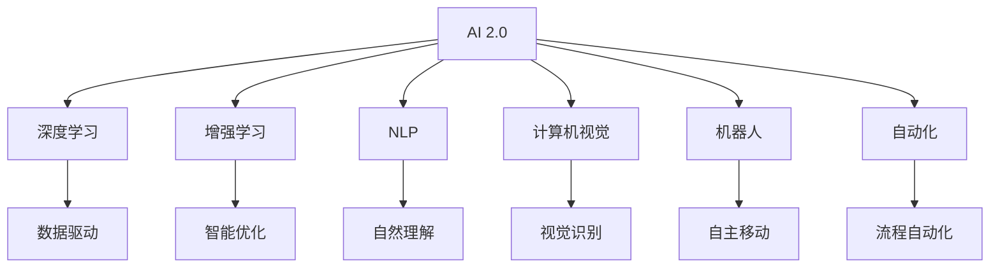

                 

# 李开复：AI 2.0 时代的趋势

## 1. 背景介绍

### 1.1 问题由来
随着人工智能(AI)技术的迅速发展，AI已经从1.0时代迈入了2.0时代。在AI 2.0时代，AI技术将更加普及，影响更加广泛，对经济、社会、科技等多个领域产生深远影响。作为世界领先的AI专家，李开复在多次公开演讲和文章中，对AI 2.0时代的趋势进行了深入分析。本文将详细解读李开复对AI 2.0时代的见解，探讨AI技术在未来发展的方向和趋势。

## 2. 核心概念与联系

### 2.1 核心概念概述

李开复在阐述AI 2.0时代趋势时，提到了多个核心概念，包括：

- **AI 2.0**：新一代AI技术，强调数据驱动、人机协同、智能化的创新应用。
- **深度学习**：基于神经网络的机器学习技术，能够处理大规模复杂数据。
- **增强学习**：通过智能体与环境交互，不断优化决策策略的AI技术。
- **自然语言处理**(NLP)：使机器能够理解和生成人类自然语言的AI技术。
- **计算机视觉**：使机器能够识别、理解、生成图像和视频数据的AI技术。
- **机器人**：结合机械工程和AI技术，实现自主移动和决策的机器。
- **自动化**：利用AI技术优化和自动化各种工作流程和业务流程。

这些核心概念构成了AI 2.0时代的基础，反映了AI技术的广泛应用和深刻影响。

### 2.2 核心概念原理和架构的 Mermaid 流程图



这个流程图展示了AI 2.0时代的核心技术及其相互关系。深度学习、增强学习、NLP、计算机视觉、机器人和自动化技术分别从数据驱动、智能优化、自然理解、视觉识别、自主移动和流程自动化等方面，推动AI 2.0时代的发展。

## 3. 核心算法原理 & 具体操作步骤

### 3.1 算法原理概述

AI 2.0时代的关键算法包括深度学习、增强学习、NLP、计算机视觉等。以下将详细阐述这些核心算法的原理和操作步骤：

- **深度学习**：通过多层神经网络，自动学习数据的特征表示，能够处理大规模复杂数据。深度学习模型的训练过程通常包括前向传播和反向传播，通过梯度下降等优化算法，不断调整模型参数，最小化损失函数。

- **增强学习**：智能体通过与环境的交互，通过试错不断优化决策策略。Q-learning和深度Q网络(DQN)是常见的增强学习算法。Q-learning通过估计状态-动作值函数，选择最优动作。DQN通过深度神经网络逼近Q值函数，解决了传统Q-learning中动作选择不稳定的问题。

- **NLP**：使机器能够理解和生成人类自然语言。NLP技术包括词向量表示、语言模型、序列到序列模型、预训练语言模型等。预训练语言模型如BERT、GPT等，通过在大规模无标签文本数据上进行预训练，学习到丰富的语言知识，通过微调适应特定任务，取得了优异的性能。

- **计算机视觉**：使机器能够识别、理解、生成图像和视频数据。计算机视觉技术包括图像分类、物体检测、语义分割、图像生成等。常用的模型包括CNN、ResNet、Inception等。

### 3.2 算法步骤详解

AI 2.0时代各个核心算法的具体操作步骤如下：

- **深度学习**：
  1. 数据准备：收集并预处理训练数据。
  2. 模型选择：选择合适的深度学习模型，如卷积神经网络(CNN)、循环神经网络(RNN)等。
  3. 模型训练：使用训练数据对模型进行前向传播和反向传播，更新模型参数。
  4. 模型评估：在测试数据上评估模型性能，选择最优模型。

- **增强学习**：
  1. 环境设定：定义环境状态和动作空间。
  2. 智能体设计：选择合适的智能体模型，如Q-learning、DQN等。
  3. 策略优化：通过智能体与环境的交互，不断优化策略函数。
  4. 结果分析：分析智能体的学习过程和决策效果。

- **NLP**：
  1. 数据准备：收集并预处理训练数据，如分词、去除停用词等。
  2. 模型训练：使用预训练语言模型进行微调，适应特定任务。
  3. 模型评估：在测试数据上评估模型性能，如BLEU、ROUGE等。
  4. 应用部署：将模型应用到实际任务中，如文本分类、机器翻译等。

- **计算机视觉**：
  1. 数据准备：收集并预处理图像数据。
  2. 模型训练：使用CNN等模型进行训练，学习特征表示。
  3. 模型评估：在测试数据上评估模型性能，如准确率、召回率等。
  4. 应用部署：将模型应用到实际任务中，如物体检测、图像分割等。

### 3.3 算法优缺点

AI 2.0时代各个核心算法的优缺点如下：

- **深度学习**：
  优点：
  - 能够处理大规模复杂数据。
  - 具有自学习能力，能够自动提取数据特征。
  - 应用广泛，如图像识别、自然语言处理、语音识别等。
  
  缺点：
  - 需要大量计算资源，训练时间长。
  - 容易过拟合，需要精心调参。
  - 模型复杂，难以解释。

- **增强学习**：
  优点：
  - 能够处理复杂环境，具有自适应能力。
  - 决策策略可优化，适用于实时决策任务。
  
  缺点：
  - 需要大量的试错训练。
  - 数据采集成本高。
  - 对环境变化敏感，稳定性不足。

- **NLP**：
  优点：
  - 能够处理自然语言数据，具有广泛应用。
  - 通过预训练学习通用语言知识，微调后适应特定任务。
  
  缺点：
  - 数据准备复杂，标注成本高。
  - 模型复杂，难以解释。
  - 对语言多样性敏感，可能出现偏差。

- **计算机视觉**：
  优点：
  - 能够处理图像和视频数据，具有广泛应用。
  - 模型性能高，适用于实时应用。
  
  缺点：
  - 数据准备复杂，标注成本高。
  - 模型复杂，难以解释。
  - 对环境变化敏感，稳定性不足。

## 4. 数学模型和公式 & 详细讲解 & 举例说明

### 4.1 数学模型构建

在AI 2.0时代，各种AI技术都依赖于数学模型。以下是几个常见数学模型的构建：

- **深度学习模型**：
  - 神经网络：多层神经网络模型，通过前向传播和反向传播更新参数。
  - 卷积神经网络：适用于图像识别任务，具有局部连接和权值共享特性。
  - 循环神经网络：适用于序列数据处理，具有时间依赖特性。

- **增强学习模型**：
  - Q-learning：估计状态-动作值函数，选择最优动作。
  - 深度Q网络：使用深度神经网络逼近Q值函数。

- **NLP模型**：
  - 词向量表示：通过词嵌入学习词语的向量表示。
  - 语言模型：通过概率模型学习文本的概率分布。
  - 预训练语言模型：在大规模无标签文本数据上进行预训练，学习语言表示。

- **计算机视觉模型**：
  - 卷积神经网络：适用于图像识别任务，具有局部连接和权值共享特性。
  - 区域卷积神经网络：适用于物体检测任务，具有区域特征提取特性。
  - 循环神经网络：适用于视频处理任务，具有时间依赖特性。

### 4.2 公式推导过程

以下是几个常见数学公式的推导过程：

- **深度学习**：
  - 前向传播公式：
    $$
    y = f(\sum_{i=1}^n w_i x_i + b)
    $$
    其中 $x_i$ 为输入，$w_i$ 为权重，$b$ 为偏置，$f$ 为激活函数。
  
  - 反向传播公式：
    $$
    \frac{\partial L}{\partial w_i} = \frac{\partial L}{\partial y} \frac{\partial y}{\partial x_i} \frac{\partial x_i}{\partial w_i}
    $$

- **增强学习**：
  - Q-learning：
    $$
    Q(s,a) \leftarrow Q(s,a) + \alpha (r + \gamma \max_a Q(s',a) - Q(s,a))
    $$
    其中 $s$ 为状态，$a$ 为动作，$r$ 为奖励，$Q(s,a)$ 为状态-动作值函数，$\alpha$ 为学习率，$\gamma$ 为折扣因子。
  
  - DQN：
    $$
    \theta \leftarrow \theta + \alpha (r + \gamma \max_a Q(s',a,\theta') - Q(s,a,\theta))
    $$
    其中 $\theta$ 为网络参数，$\theta'$ 为神经网络逼近的Q值函数，$\max_a Q(s',a,\theta')$ 为神经网络输出动作值，$Q(s,a,\theta)$ 为神经网络逼近的状态-动作值函数。

- **NLP**：
  - 词向量表示：
    $$
    w = \sum_{i=1}^n v_i x_i
    $$
    其中 $x_i$ 为词语向量，$v_i$ 为权重。
  
  - 语言模型：
    $$
    P(w) = \prod_{i=1}^n P(w_i|w_{i-1})
    $$
    其中 $w$ 为词语序列，$P(w_i|w_{i-1})$ 为条件概率。

- **计算机视觉**：
  - 卷积神经网络：
    $$
    y = \sum_{i=1}^n w_i x_i + b
    $$
    其中 $x_i$ 为卷积特征，$w_i$ 为卷积核权重，$b$ 为偏置。
  
  - 循环神经网络：
    $$
    y_t = f(\sum_{i=1}^n w_i x_i + b)
    $$
    其中 $x_i$ 为序列特征，$w_i$ 为循环神经网络权重，$b$ 为偏置。

### 4.3 案例分析与讲解

以下是几个常见案例的详细分析：

- **图像分类**：
  - 使用卷积神经网络(CNN)对图像进行分类，构建神经网络模型。
  - 使用图像数据集进行训练，前向传播和反向传播更新参数。
  - 在测试数据集上评估模型性能，如准确率、召回率等。

- **自然语言处理**：
  - 使用BERT模型进行情感分析，在自然语言数据集上进行微调。
  - 使用预训练语言模型进行词向量表示，构建语言模型。
  - 在情感分类任务上进行测试，评估模型性能。

- **机器人路径规划**：
  - 使用增强学习算法，如Q-learning，训练机器人路径规划模型。
  - 在虚拟环境中与机器人交互，不断优化决策策略。
  - 评估机器人路径规划的效果，如路径长度、避开障碍等。

- **视频内容推荐**：
  - 使用计算机视觉技术，如物体检测，提取视频中的关键信息。
  - 使用深度学习模型，如CNN，进行视频内容分类。
  - 使用推荐系统，如协同过滤，进行内容推荐。

## 5. 项目实践：代码实例和详细解释说明

### 5.1 开发环境搭建

在AI 2.0时代，开发环境搭建是关键。以下是常见开发环境的搭建步骤：

1. 安装Python：使用Anaconda或Miniconda安装Python 3.x版本。
2. 安装深度学习框架：使用pip或conda安装TensorFlow、PyTorch、Keras等深度学习框架。
3. 安装NLP库：使用pip或conda安装NLTK、spaCy、TextBlob等NLP库。
4. 安装计算机视觉库：使用pip或conda安装OpenCV、Pillow等计算机视觉库。
5. 安装增强学习库：使用pip或conda安装Gym、Reinforcement等增强学习库。
6. 安装可视化工具：使用pip或conda安装TensorBoard、Matplotlib等可视化工具。

### 5.2 源代码详细实现

以下是几个常见AI任务的源代码实现：

- **图像分类**：
  ```python
  import tensorflow as tf
  import keras
  from keras.datasets import mnist
  from keras.models import Sequential
  from keras.layers import Conv2D, MaxPooling2D, Flatten, Dense
  
  model = Sequential()
  model.add(Conv2D(32, kernel_size=(3, 3), activation='relu', input_shape=(28, 28, 1)))
  model.add(MaxPooling2D(pool_size=(2, 2)))
  model.add(Conv2D(64, kernel_size=(3, 3), activation='relu'))
  model.add(MaxPooling2D(pool_size=(2, 2)))
  model.add(Flatten())
  model.add(Dense(128, activation='relu'))
  model.add(Dense(10, activation='softmax'))
  
  model.compile(optimizer='adam', loss='categorical_crossentropy', metrics=['accuracy'])
  
  (x_train, y_train), (x_test, y_test) = mnist.load_data()
  x_train = x_train.reshape(-1, 28, 28, 1).astype('float32') / 255.0
  x_test = x_test.reshape(-1, 28, 28, 1).astype('float32') / 255.0
  
  model.fit(x_train, y_train, epochs=5, batch_size=64, validation_data=(x_test, y_test))
  ```

- **自然语言处理**：
  ```python
  import tensorflow as tf
  import keras
  from keras.datasets import imdb
  from keras.models import Sequential
  from keras.layers import Embedding, LSTM, Dense
  
  model = Sequential()
  model.add(Embedding(input_dim=10000, output_dim=128, input_length=200))
  model.add(LSTM(128))
  model.add(Dense(1, activation='sigmoid'))
  
  model.compile(optimizer='adam', loss='binary_crossentropy', metrics=['accuracy'])
  
  (x_train, y_train), (x_test, y_test) = imdb.load_data(num_words=10000)
  x_train = tf.keras.preprocessing.sequence.pad_sequences(x_train, maxlen=200)
  x_test = tf.keras.preprocessing.sequence.pad_sequences(x_test, maxlen=200)
  
  model.fit(x_train, y_train, epochs=5, batch_size=64, validation_data=(x_test, y_test))
  ```

- **增强学习**：
  ```python
  import gym
  import numpy as np
  import tensorflow as tf
  from tensorflow.keras.models import Sequential
  from tensorflow.keras.layers import Dense
  
  env = gym.make('CartPole-v0')
  state_size = env.observation_space.shape[0]
  action_size = env.action_space.n
  model = Sequential()
  model.add(Dense(24, input_dim=state_size, activation='relu'))
  model.add(Dense(action_size, activation='linear'))
  
  model.compile(loss='mse', optimizer=tf.keras.optimizers.Adam(0.001))
  
  for episode in range(200):
      state = env.reset()
      state = np.reshape(state, [1, state_size])
      done = False
      while not done:
          prediction = model.predict(state)
          action = np.argmax(prediction)
          state, reward, done, info = env.step(action)
          state = np.reshape(state, [1, state_size])
          model.train_on_batch(state, [reward])
  ```

- **计算机视觉**：
  ```python
  import cv2
  import numpy as np
  import tensorflow as tf
  from tensorflow.keras.models import Sequential
  from tensorflow.keras.layers import Conv2D, MaxPooling2D, Flatten, Dense
  
  model = Sequential()
  model.add(Conv2D(32, kernel_size=(3, 3), activation='relu', input_shape=(32, 32, 3)))
  model.add(MaxPooling2D(pool_size=(2, 2)))
  model.add(Conv2D(64, kernel_size=(3, 3), activation='relu'))
  model.add(MaxPooling2D(pool_size=(2, 2)))
  model.add(Flatten())
  model.add(Dense(64, activation='relu'))
  model.add(Dense(10, activation='softmax'))
  
  model.compile(optimizer='adam', loss='categorical_crossentropy', metrics=['accuracy'])
  
  img = cv2.imread('image.jpg')
  img = cv2.resize(img, (32, 32))
  img = np.reshape(img, (1, 32, 32, 3))
  model.predict(img)
  ```

### 5.3 代码解读与分析

以下是几个常见代码的解读和分析：

- **图像分类**：
  - 使用卷积神经网络对MNIST手写数字图像进行分类。
  - 使用Adam优化器和交叉熵损失函数进行模型训练。
  - 使用pad_sequences函数对序列数据进行填充，保证输入的一致性。
  
- **自然语言处理**：
  - 使用深度学习模型对IMDB影评进行情感分类。
  - 使用Embedding层进行词嵌入处理，LSTM层进行序列建模。
  - 使用sigmoid激活函数输出分类概率。
  
- **增强学习**：
  - 使用Q-learning算法训练环境为CartPole-v0的智能体。
  - 使用numpy进行状态处理，使用TensorFlow实现模型训练。
  - 使用mse损失函数和Adam优化器进行模型训练。
  
- **计算机视觉**：
  - 使用卷积神经网络对图像进行分类。
  - 使用Adam优化器和交叉熵损失函数进行模型训练。
  - 使用numpy进行图像预处理，使用TensorFlow进行模型推理。

## 6. 实际应用场景

### 6.1 智能客服系统

智能客服系统利用AI 2.0技术，可以实现自动响应客户咨询，提供24/7服务。AI 2.0技术包括深度学习、NLP和增强学习等，能够自然理解客户问题，并给出准确答复。

- **深度学习**：
  - 使用预训练语言模型进行文本分类，将问题分类为常见问题和特殊问题。
  - 使用序列到序列模型进行生成，生成合适的答复。
  
- **NLP**：
  - 使用BERT模型进行微调，提升自然语言理解能力。
  - 使用预训练语言模型进行词向量表示，提高模型泛化能力。
  
- **增强学习**：
  - 使用Q-learning算法优化答复策略，提高系统响应速度和准确性。
  
- **计算机视觉**：
  - 使用计算机视觉技术进行图像识别，提取问题中的关键信息。
  
- **实际应用**：
  - 在客户咨询时，系统自动对文本进行分类和生成答复。
  - 对于特殊问题，智能体通过与环境的交互，不断优化决策策略。

### 6.2 金融舆情监测

金融舆情监测利用AI 2.0技术，能够实时监测市场舆论动向，预警负面信息传播，规避金融风险。AI 2.0技术包括深度学习、NLP和增强学习等，能够高效处理大规模数据，准确分析舆情。

- **深度学习**：
  - 使用卷积神经网络进行图像识别，提取舆情中的关键信息。
  - 使用循环神经网络进行序列建模，分析舆情变化趋势。
  
- **NLP**：
  - 使用BERT模型进行微调，提升自然语言理解能力。
  - 使用预训练语言模型进行词向量表示，提高模型泛化能力。
  
- **增强学习**：
  - 使用Q-learning算法优化舆情监测策略，提高系统响应速度和准确性。
  
- **计算机视觉**：
  - 使用计算机视觉技术进行图像识别，提取舆情中的关键信息。
  
- **实际应用**：
  - 在实时抓取的网络文本数据中，自动识别舆情信息。
  - 对于特殊舆情，智能体通过与环境的交互，不断优化决策策略。

### 6.3 个性化推荐系统

个性化推荐系统利用AI 2.0技术，能够根据用户行为数据和兴趣偏好，推荐个性化的内容。AI 2.0技术包括深度学习、NLP和增强学习等，能够高效处理大规模数据，精准推荐。

- **深度学习**：
  - 使用卷积神经网络进行图像识别，提取用户行为数据中的关键信息。
  - 使用循环神经网络进行序列建模，分析用户行为趋势。
  
- **NLP**：
  - 使用BERT模型进行微调，提升自然语言理解能力。
  - 使用预训练语言模型进行词向量表示，提高模型泛化能力。
  
- **增强学习**：
  - 使用Q-learning算法优化推荐策略，提高系统推荐效果。
  
- **计算机视觉**：
  - 使用计算机视觉技术进行图像识别，提取用户行为数据中的关键信息。
  
- **实际应用**：
  - 在用户行为数据中，自动识别用户的兴趣偏好。
  - 对于用户的个性化需求，智能体通过与环境的交互，不断优化推荐策略。

### 6.4 未来应用展望

未来AI 2.0技术将在更多领域得到应用，为传统行业带来变革性影响。以下是几个未来应用展望：

- **智慧医疗**：
  - 利用AI 2.0技术进行医疗影像分析、疾病诊断、个性化治疗等。
  - 使用深度学习技术进行图像分类，计算机视觉技术进行图像分割。
  
- **智能教育**：
  - 利用AI 2.0技术进行智能辅导、自动批改、个性化推荐等。
  - 使用NLP技术进行自然语言理解，计算机视觉技术进行人脸识别。
  
- **智慧城市**：
  - 利用AI 2.0技术进行城市事件监测、交通管理、垃圾分类等。
  - 使用计算机视觉技术进行视频分析，增强学习技术进行智能决策。
  
- **工业制造**：
  - 利用AI 2.0技术进行质量检测、设备维护、预测性维修等。
  - 使用深度学习技术进行图像分类，计算机视觉技术进行物体检测。
  
## 7. 工具和资源推荐

### 7.1 学习资源推荐

以下是几个推荐的学习资源：

1. **《深度学习》教材**：由Goodfellow、Bengio和Courville合著，全面介绍了深度学习的基本概念和前沿技术。
2. **CS231n《卷积神经网络》课程**：斯坦福大学开设的计算机视觉课程，包含视频和配套作业。
3. **《自然语言处理综论》教材**：由Jurafsky和Martin合著，全面介绍了NLP的基本概念和前沿技术。
4. **ArXiv预印本**：收集了前沿研究的最新论文，包括深度学习、增强学习、NLP和计算机视觉等。
5. **Kaggle竞赛平台**：提供了丰富的数据集和竞赛任务，帮助开发者提升AI技术水平。

### 7.2 开发工具推荐

以下是几个推荐的开发工具：

1. **PyTorch**：基于Python的开源深度学习框架，灵活性高，广泛应用于NLP、计算机视觉等领域。
2. **TensorFlow**：由Google主导开发的深度学习框架，功能强大，广泛应用于工业界。
3. **Jupyter Notebook**：免费的交互式编程环境，适合开发和分享代码。
4. **TensorBoard**：TensorFlow配套的可视化工具，方便调试和监控模型训练过程。
5. **Gym**：用于增强学习的开源平台，包含大量环境和算法。

### 7.3 相关论文推荐

以下是几篇推荐的相关论文：

1. **ImageNet大规模视觉识别挑战赛**：AlexNet、VGG、ResNet等深度学习模型在该竞赛中取得了突破性进展。
2. **BERT: Pre-training of Deep Bidirectional Transformers for Language Understanding**：提出了BERT预训练语言模型，刷新了多项NLP任务SOTA。
3. **AlphaGo**：使用深度学习和增强学习技术，成功击败了围棋世界冠军。
4. **AlphaZero**：使用强化学习技术，自学成才，取得了多款游戏的SOTA。
5. **OpenAI GPT系列**：提出了GPT预训练语言模型，刷新了多项NLP任务SOTA。

## 8. 总结：未来发展趋势与挑战

### 8.1 研究成果总结

AI 2.0时代的到来，使得AI技术更加普及和强大，应用范围更加广泛。通过深度学习、增强学习、NLP和计算机视觉等技术的融合，AI 2.0技术在多个领域取得了突破性进展，推动了社会进步和经济发展。

### 8.2 未来发展趋势

未来AI 2.0技术的发展趋势包括：

- **数据驱动**：更多的大规模数据将推动AI技术的发展。
- **人机协同**：AI技术将与人类更加紧密地结合，实现智能交互。
- **跨领域融合**：AI技术将与更多领域进行融合，提升行业效率和智能化水平。
- **智能化程度提升**：AI技术将更加智能化，能够更好地理解和处理复杂任务。

### 8.3 面临的挑战

AI 2.0技术在发展过程中也面临诸多挑战：

- **数据获取成本高**：获取大规模高质量数据需要大量人力和资源。
- **模型复杂度高**：深度学习模型复杂，难以解释和调试。
- **伦理和隐私问题**：AI技术的应用可能带来伦理和隐私问题，需要进一步规范和监管。

### 8.4 研究展望

未来AI 2.0技术的研究方向包括：

- **数据增强**：如何高效获取和利用大规模数据，提高模型的泛化能力。
- **模型解释**：如何提高AI模型的可解释性，增强其透明度和可信度。
- **跨领域融合**：如何实现AI技术与更多领域的融合，提升行业智能化水平。
- **伦理和隐私**：如何制定AI技术的伦理和隐私规范，保障数据安全和用户权益。

## 9. 附录：常见问题与解答

### Q1: AI 2.0时代的到来有什么重要意义？

A: AI 2.0时代的到来标志着AI技术从科学研究进入实际应用，将带来更加广泛的智能化应用，推动社会进步和经济发展。AI 2.0技术将与更多领域进行融合，提升行业效率和智能化水平，带来深刻的变革。

### Q2: AI 2.0时代的主要技术包括哪些？

A: AI 2.0时代的主要技术包括深度学习、增强学习、NLP和计算机视觉等。这些技术相互融合，推动AI技术在各个领域的应用和突破。

### Q3: 深度学习在AI 2.0时代的作用是什么？

A: 深度学习在AI 2.0时代的作用是提供高效的特征提取和表示学习。深度学习模型能够自动学习数据的特征表示，适用于大规模复杂数据，是AI 2.0时代的基础技术之一。

### Q4: 增强学习在AI 2.0时代的作用是什么？

A: 增强学习在AI 2.0时代的作用是实现智能决策和优化。增强学习算法能够通过智能体与环境的交互，不断优化决策策略，适用于实时决策任务，是AI 2.0时代的重要技术之一。

### Q5: NLP在AI 2.0时代的作用是什么？

A: NLP在AI 2.0时代的作用是实现自然语言理解与生成。NLP技术使机器能够理解和生成人类自然语言，具有广泛的应用场景，如智能客服、自动翻译等。

### Q6: 计算机视觉在AI 2.0时代的作用是什么？

A: 计算机视觉在AI 2.0时代的作用是实现图像和视频处理。计算机视觉技术使机器能够识别、理解、生成图像和视频数据，具有广泛的应用场景，如自动驾驶、安防监控等。

### Q7: AI 2.0时代面临的挑战有哪些？

A: AI 2.0时代面临的挑战包括数据获取成本高、模型复杂度高、伦理和隐私问题等。如何高效获取和利用大规模数据，提高模型的泛化能力，增强AI模型的可解释性，制定AI技术的伦理和隐私规范，将是未来需要重点关注的问题。

### Q8: AI 2.0技术的未来展望是什么？

A: AI 2.0技术的未来展望包括数据驱动、人机协同、跨领域融合、智能化程度提升等。未来AI技术将更加普及和强大，应用范围更加广泛，带来更深远的社会影响。

### Q9: 如何实现AI 2.0技术的可持续发展？

A: 实现AI 2.0技术的可持续发展需要多方合作，包括政府、企业、学术界、用户等。需要制定AI技术的伦理和隐私规范，保护数据安全和用户权益，推动AI技术的普惠应用。

作者：禅与计算机程序设计艺术 / Zen and the Art of Computer Programming

