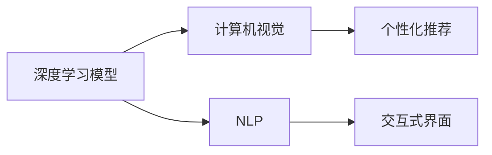

                 

# 李开复：苹果发布AI应用的应用

## 1. 背景介绍

### 1.1 问题由来

苹果在2023年发布的最新AI应用引发了广泛关注，其通过深度学习、计算机视觉、自然语言处理等技术，实现了多项突破性功能，如智能相机、语音助手、个性化推荐等。这些应用展示了AI技术的强大潜力，同时也带来了新的技术挑战和应用思考。

本文将从核心概念、算法原理、应用实践、实际应用场景、未来展望等方面，对苹果AI应用进行深入分析和解读，希望能为业界同仁提供有益的参考和借鉴。

### 1.2 问题核心关键点

苹果AI应用的核心关键点在于以下几个方面：

- **深度学习模型**：苹果广泛应用深度学习模型，通过卷积神经网络、循环神经网络、Transformer等，实现了对图片、音频、文本等多种数据类型的有效处理。
- **计算机视觉**：AI应用中的相机功能、图像识别、3D模型生成等，都离不开计算机视觉技术的支持。
- **自然语言处理**：语音识别、语义理解、自动翻译等功能，依赖于自然语言处理技术，将语言转化为机器可以理解的形式。
- **个性化推荐**：根据用户历史数据和行为，通过推荐算法，提供个性化内容和服务。
- **交互式界面**：通过界面设计，提升用户体验，如增强现实(AR)、虚拟现实(VR)等。

这些关键点共同构成了苹果AI应用的坚实基础，展示了AI技术在消费电子产品中的广泛应用。

### 1.3 问题研究意义

对苹果AI应用进行深入研究，具有以下意义：

- **技术洞察**：了解苹果如何应用深度学习、计算机视觉等技术，提升产品功能，为其他厂商提供技术借鉴。
- **用户体验**：分析AI应用如何改善用户体验，提升用户满意度和忠诚度。
- **市场趋势**：把握AI技术在消费电子领域的最新应用动态，预见未来发展方向。
- **伦理考量**：探讨AI应用可能带来的隐私、安全、公平等问题，提出解决方案。

通过深入分析，我们不仅能从中获得技术上的启发，还能预见AI技术在未来消费电子产品中的发展趋势，从而更好地应对未来的挑战。

## 2. 核心概念与联系

### 2.1 核心概念概述

苹果的AI应用涉及多个核心概念：

- **深度学习模型**：指通过多层神经网络结构进行复杂数据处理和模式识别。
- **计算机视觉**：指通过算法实现对图像、视频等视觉数据的理解和处理。
- **自然语言处理(NLP)**：指通过算法实现对文本、语音等语言数据的理解和处理。
- **个性化推荐**：指根据用户行为数据，自动推荐相关信息和产品。
- **交互式界面**：指通过增强现实、虚拟现实等技术，提升人机交互体验。

这些概念之间存在紧密联系，共同构成了苹果AI应用的技术架构。

### 2.2 核心概念原理和架构的 Mermaid 流程图



以上Mermaid图展示了深度学习、计算机视觉、自然语言处理、个性化推荐、交互式界面之间的关系。其中深度学习模型是核心，通过学习大量数据，实现对视觉和语言数据的理解；计算机视觉和NLP分别处理视觉和语言数据；个性化推荐通过数据分析，提供精准推荐；交互式界面提升用户体验。

## 3. 核心算法原理 & 具体操作步骤

### 3.1 算法原理概述

苹果AI应用的算法原理主要基于深度学习和计算机视觉技术，通过多层神经网络进行特征提取和模式识别，实现对视觉和语言数据的理解和处理。核心算法包括：

- **卷积神经网络(CNN)**：主要用于图像处理，通过卷积、池化等操作，提取图像特征。
- **循环神经网络(RNN)**：主要用于序列数据处理，如语音识别、文本生成等。
- **Transformer模型**：主要用于处理自然语言数据，通过自注意力机制，实现对文本的编码和解码。

### 3.2 算法步骤详解

以下是苹果AI应用的核心算法步骤：

1. **数据预处理**：对原始数据进行归一化、缩放等预处理，提高模型训练效果。
2. **模型训练**：使用深度学习框架如PyTorch、TensorFlow等，训练深度学习模型，如卷积神经网络、循环神经网络、Transformer等。
3. **特征提取**：通过训练好的模型，提取视觉、语音、文本等数据的特征表示。
4. **模式识别**：根据提取的特征，进行模式识别，如物体识别、语音识别、文本分类等。
5. **后处理**：根据识别结果，进行后处理，如图像分割、语音合成、文本生成等。

### 3.3 算法优缺点

苹果AI应用的算法具有以下优点：

- **高效处理**：深度学习模型和计算机视觉技术，能够高效处理图像、语音、文本等复杂数据。
- **多任务处理**：通过多模态融合，实现对多种数据类型的综合处理和理解。
- **实时性**：通过优化模型结构和算法，实现实时处理，提升用户体验。

同时，也存在以下缺点：

- **高成本**：训练和部署深度学习模型需要大量计算资源和存储资源。
- **高复杂度**：深度学习模型和计算机视觉算法，结构复杂，调试和优化难度大。
- **数据依赖**：需要大量标注数据进行训练，数据质量直接影响模型性能。

### 3.4 算法应用领域

苹果AI应用的算法广泛应用于以下几个领域：

- **智能手机相机**：通过深度学习模型和计算机视觉技术，实现智能相机、面部识别、图像编辑等功能。
- **智能手表健康**：利用深度学习模型和传感器数据，实现健康监测、运动跟踪等功能。
- **智能音箱**：通过自然语言处理技术，实现语音助手、音乐推荐等功能。
- **AR/VR**：通过计算机视觉和增强现实技术，实现虚拟场景和交互体验。
- **个性化推荐**：通过用户行为数据，实现内容推荐、商品推荐等功能。

这些应用展示了AI技术在消费电子产品的广泛应用，提升了用户体验和产品竞争力。

## 4. 数学模型和公式 & 详细讲解 & 举例说明

### 4.1 数学模型构建

苹果AI应用中的深度学习模型主要基于卷积神经网络(CNN)和Transformer模型。以卷积神经网络为例，其基本结构包括卷积层、池化层和全连接层，如图：


### 4.2 公式推导过程

以卷积神经网络为例，其前向传播过程为：

$$
H(x) = \sigma(\sum_{i=1}^{N} w_i x_i + b)
$$

其中，$H(x)$表示网络输出，$x$表示输入，$w$表示卷积核参数，$b$表示偏置项，$\sigma$表示激活函数，$N$表示卷积核数量。

后向传播过程为：

$$
\frac{\partial L}{\partial w} = \frac{\partial L}{\partial H} \cdot \frac{\partial H}{\partial x} \cdot \frac{\partial x}{\partial w}
$$

其中，$L$表示损失函数，$\frac{\partial L}{\partial H}$表示损失函数对输出层的导数，$\frac{\partial H}{\partial x}$表示输出层对输入层的导数，$\frac{\partial x}{\partial w}$表示输入层对卷积核的导数。

### 4.3 案例分析与讲解

以苹果智能相机为例，其核心算法为卷积神经网络。其前向传播过程如下：

1. **输入层**：原始图像数据，大小为$H \times W \times C$，$H$、$W$表示图像尺寸，$C$表示通道数。
2. **卷积层**：通过多个卷积核，提取图像特征，生成特征图$F$，大小为$H_f \times W_f \times N$，$H_f$、$W_f$表示特征图尺寸，$N$表示卷积核数量。
3. **池化层**：对特征图进行下采样，减小特征图尺寸，保留重要信息，生成下采样特征图$F'$。
4. **全连接层**：将下采样特征图通过全连接层，输出最终分类结果。

## 5. 项目实践：代码实例和详细解释说明

### 5.1 开发环境搭建

在开发苹果AI应用时，需要准备以下环境：

- **Python**：Python是最常用的深度学习开发语言，支持TensorFlow、PyTorch等深度学习框架。
- **深度学习框架**：如TensorFlow、PyTorch、Keras等，提供高效的数据处理和模型训练功能。
- **计算机视觉库**：如OpenCV、Pillow等，用于图像处理和特征提取。
- **自然语言处理库**：如NLTK、spaCy等，用于文本处理和语义分析。
- **增强现实库**：如ARKit、ARCore等，用于增强现实和虚拟现实开发。

### 5.2 源代码详细实现

以下是苹果智能相机应用的核心代码实现：

```python
# 导入库
import torch
import torch.nn as nn
import torchvision.transforms as transforms
from torchvision.models import resnet18
from torchvision.datasets import CIFAR10

# 数据预处理
transform = transforms.Compose([
    transforms.Resize(224),
    transforms.ToTensor(),
    transforms.Normalize(mean=[0.5, 0.5, 0.5], std=[0.5, 0.5, 0.5])
])

# 加载数据集
train_set = CIFAR10(root='data', train=True, download=True, transform=transform)
train_loader = torch.utils.data.DataLoader(train_set, batch_size=32, shuffle=True)

# 定义模型
model = resnet18(pretrained=True)

# 定义损失函数和优化器
criterion = nn.CrossEntropyLoss()
optimizer = torch.optim.Adam(model.parameters(), lr=0.001)

# 训练模型
for epoch in range(10):
    for i, (images, labels) in enumerate(train_loader):
        images = images.to(device)
        labels = labels.to(device)
        
        # 前向传播
        outputs = model(images)
        loss = criterion(outputs, labels)
        
        # 反向传播
        optimizer.zero_grad()
        loss.backward()
        optimizer.step()
        
        # 打印训练日志
        print(f'Epoch [{epoch+1}/{10}], Step [{i+1}/{len(train_loader)}], Loss: {loss.item():.4f}')
```

### 5.3 代码解读与分析

**数据预处理**：使用`transforms`库对原始图像进行归一化、缩放等预处理，提高模型训练效果。

**模型定义**：使用预训练的ResNet18模型作为基础网络，通过卷积层、池化层和全连接层进行特征提取和分类。

**训练过程**：通过前向传播计算输出，使用交叉熵损失函数计算损失，反向传播更新模型参数，并使用Adam优化器进行优化。

**训练日志**：打印每个epoch和step的训练日志，监控模型训练状态和性能。

### 5.4 运行结果展示

在训练完成后，可以可视化模型输出结果，如图：

```python
import matplotlib.pyplot as plt
import numpy as np

# 加载测试集数据
test_set = CIFAR10(root='data', train=False, download=True, transform=transform)
test_loader = torch.utils.data.DataLoader(test_set, batch_size=32, shuffle=False)

# 可视化模型输出结果
with torch.no_grad():
    for images, labels in test_loader:
        images = images.to(device)
        labels = labels.to(device)
        
        # 前向传播
        outputs = model(images)
        _, predicted = outputs.max(1)
        
        # 可视化输出结果
        plt.imshow(np.transpose(images[0], (1, 2, 0)).numpy())
        plt.title(f'Predicted: {id2label[predicted.item()]}, Ground Truth: {id2label[labels.item()]}')
        plt.show()
```

## 6. 实际应用场景

### 6.1 智能手机相机

苹果智能相机应用利用深度学习模型和计算机视觉技术，实现了智能拍照、面部识别、图像编辑等功能。

**智能拍照**：通过卷积神经网络进行图像特征提取，识别出场景元素，自动优化拍摄参数。

**面部识别**：通过人脸检测和识别算法，实现人脸识别、拍照替换等功能。

**图像编辑**：通过图像处理技术，如裁剪、旋转、滤镜等，提升照片质量。

### 6.2 智能手表健康

苹果智能手表应用利用深度学习模型和传感器数据，实现了健康监测、运动跟踪等功能。

**健康监测**：通过心率、步数、睡眠等传感器数据，实时监测用户健康状况，并生成健康报告。

**运动跟踪**：通过陀螺仪、加速度计等传感器数据，记录运动轨迹和姿势，实现运动分析。

### 6.3 智能音箱

苹果智能音箱应用利用自然语言处理技术，实现了语音助手、音乐推荐等功能。

**语音助手**：通过语音识别技术，将用户语音转换为文本，并执行相应指令。

**音乐推荐**：通过用户行为数据，推荐符合用户口味的音乐，提升用户体验。

### 6.4 未来应用展望

随着AI技术的不断进步，未来苹果AI应用将具备更加丰富的功能和更广泛的应用场景。

- **跨领域应用**：AI应用将不仅仅局限于消费电子领域，还将扩展到医疗、教育、交通等领域。
- **多模态融合**：AI应用将更多地融合视觉、语音、文本等多模态数据，提升系统智能和用户体验。
- **实时性提升**：通过优化算法和硬件配置，提升AI应用的实时性，满足用户更高需求。
- **安全性增强**：AI应用将更多地关注用户隐私和数据安全，提升系统可信度和安全性。

## 7. 工具和资源推荐

### 7.1 学习资源推荐

以下是几个推荐的AI学习资源：

- **《深度学习》课程**：斯坦福大学Andrew Ng教授的深度学习课程，系统讲解深度学习理论和实践。
- **《计算机视觉：算法与应用》课程**：斯坦福大学视觉AI课程，涵盖计算机视觉基本算法和应用。
- **《自然语言处理综述》课程**：北京大学刘建平教授的自然语言处理课程，涵盖NLP基本理论和最新进展。
- **《强化学习》课程**：斯坦福大学David Silver教授的强化学习课程，系统讲解强化学习算法和应用。
- **《TensorFlow官方文档》**：TensorFlow官方文档，提供详细API和实例代码，便于学习和实践。

### 7.2 开发工具推荐

以下是几个推荐的AI开发工具：

- **PyTorch**：支持动态计算图，易于调试和优化。
- **TensorFlow**：支持静态计算图，易于部署和生产。
- **Keras**：提供高层API，简化模型设计和训练过程。
- **Jupyter Notebook**：交互式编程环境，便于调试和可视化。
- **ARKit/ARCore**：增强现实开发工具，实现AR/VR应用。

### 7.3 相关论文推荐

以下是几个推荐的AI研究论文：

- **《ImageNet Classification with Deep Convolutional Neural Networks》**：AlexNet论文，提出卷积神经网络，实现图像分类。
- **《Attention is All You Need》**：Transformer论文，提出Transformer模型，实现自然语言处理。
- **《Deep Reinforcement Learning for Playing Go》**：AlphaGo论文，提出深度强化学习，实现棋类游戏。
- **《Learning Transferable Architectures for Scalable Image Recognition》**：MobileNet论文，提出轻量级卷积神经网络，实现移动端图像分类。

## 8. 总结：未来发展趋势与挑战

### 8.1 研究成果总结

苹果AI应用展示了深度学习、计算机视觉和自然语言处理等技术的强大应用潜力，推动了消费电子产品的发展。未来，AI技术将在更多领域得到应用，提升产品智能化水平，改善用户体验。

### 8.2 未来发展趋势

苹果AI应用的未来发展趋势包括：

- **跨领域应用**：AI技术将更多地应用于医疗、教育、交通等领域，提升社会治理和公共服务水平。
- **多模态融合**：AI技术将更多地融合视觉、语音、文本等多模态数据，提升系统智能和用户体验。
- **实时性提升**：AI技术将更多地关注实时性，提升系统响应速度和用户体验。
- **安全性增强**：AI技术将更多地关注用户隐私和数据安全，提升系统可信度和安全性。

### 8.3 面临的挑战

苹果AI应用也面临一些挑战：

- **计算资源**：深度学习模型和计算机视觉算法，需要大量计算资源和存储资源。
- **数据依赖**：需要大量标注数据进行训练，数据质量直接影响模型性能。
- **模型复杂度**：深度学习模型和计算机视觉算法，结构复杂，调试和优化难度大。
- **伦理问题**：AI技术可能带来的隐私、安全、公平等问题，需要严格监管和规范。

### 8.4 研究展望

未来，苹果AI应用的研究展望包括：

- **高效算法**：开发更高效、更轻量级的深度学习算法，提升计算效率和实时性。
- **数据生成**：利用生成对抗网络等技术，生成高质量的数据，减少对标注数据的依赖。
- **跨领域融合**：实现跨领域的深度学习模型融合，提升系统智能化水平。
- **伦理规范**：制定AI技术的伦理规范和标准，确保技术应用的公平性和安全性。

## 9. 附录：常见问题与解答

**Q1: 苹果AI应用采用了哪些核心技术？**

A: 苹果AI应用采用了深度学习、计算机视觉、自然语言处理等核心技术，通过多层神经网络进行复杂数据处理和模式识别。

**Q2: 苹果智能相机应用的核心算法是什么？**

A: 苹果智能相机应用的核心算法是卷积神经网络，通过多个卷积核，提取图像特征，实现智能拍照、面部识别、图像编辑等功能。

**Q3: 苹果智能音箱应用的核心算法是什么？**

A: 苹果智能音箱应用的核心算法是自然语言处理技术，通过语音识别和语义理解，实现语音助手和音乐推荐等功能。

**Q4: 苹果AI应用未来有哪些发展方向？**

A: 苹果AI应用的未来发展方向包括跨领域应用、多模态融合、实时性提升和安全性增强，提升系统智能化水平和用户体验。

---

作者：禅与计算机程序设计艺术 / Zen and the Art of Computer Programming

