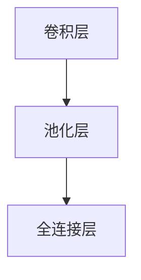
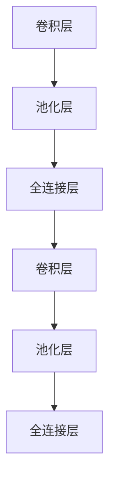

                 

# 李开复：苹果发布AI应用的趋势

## 1. 背景介绍

### 1.1 问题由来

近年来，人工智能(AI)技术在全球范围内迅速发展，各大科技巨头纷纷发布自己的AI战略和产品。特别是苹果公司，其推出的AI应用不仅在技术上处于领先地位，还在用户体验和商业化应用上做出了诸多探索。本文将从苹果的AI战略出发，探讨其发布AI应用的趋势，以及这些应用在推动AI技术发展中的作用。

### 1.2 问题核心关键点

苹果的AI应用主要集中在自然语言处理(NLP)、计算机视觉、机器学习、增强现实(AR)等多个领域。其中，Siri语音助手、Face ID面部识别、图像识别等AI应用已经成为苹果产品的重要组成部分。这些应用在技术创新和用户体验提升方面均取得了显著成效。

## 2. 核心概念与联系

### 2.1 核心概念概述

苹果的AI应用主要围绕以下几个核心概念展开：

- **自然语言处理(NLP)**：通过分析人类语言，使得AI系统能够理解和生成语言。
- **计算机视觉**：使AI系统能够“看到”并理解图像和视频内容，进行图像识别、人脸识别等。
- **机器学习**：通过数据训练AI模型，使其能够自动学习和改进。
- **增强现实(AR)**：利用数字信息增强现实世界体验，如ARKit。

这些核心概念之间相互关联，共同构成了苹果AI应用的生态系统。

### 2.2 核心概念原理和架构的 Mermaid 流程图

```mermaid
graph TB
    A[自然语言处理(NLP)] --> B[计算机视觉]
    A --> C[机器学习]
    B --> D[增强现实(AR)]
    C --> E[图像识别]
    A --> F[语音识别]
    C --> G[人脸识别]
    D --> H[ARKit]
```

## 3. 核心算法原理 & 具体操作步骤

### 3.1 算法原理概述

苹果的AI应用主要采用深度学习算法，特别是卷积神经网络(CNN)和循环神经网络(RNN)。其中，卷积神经网络用于图像识别和分类，循环神经网络用于语言处理和序列预测。此外，苹果还引入了注意力机制(Attention Mechanism)，以提升模型对关键信息的关注度。

### 3.2 算法步骤详解

1. **数据预处理**：对原始数据进行清洗和标注，以便模型能够有效学习。
2. **模型训练**：使用大量标注数据对模型进行训练，优化模型参数。
3. **模型调优**：通过调整超参数和算法改进，提升模型性能。
4. **部署与应用**：将训练好的模型集成到产品中，进行实际应用。

### 3.3 算法优缺点

**优点**：
- **准确率高**：深度学习模型在图像、语言等任务上具有较高的准确率。
- **泛化能力强**：模型可以处理多种类型的数据，具有较强的泛化能力。
- **可扩展性好**：模型可以通过增加数据和计算资源进行扩展。

**缺点**：
- **计算量大**：深度学习模型需要大量的计算资源和时间进行训练。
- **可解释性差**：模型决策过程复杂，难以解释和调试。
- **过拟合风险高**：模型在特定数据集上容易出现过拟合现象。

### 3.4 算法应用领域

苹果的AI应用广泛应用在以下几个领域：

- **智能助理**：如Siri语音助手，能够理解和响应自然语言命令。
- **面部识别**：如Face ID，实现安全解锁和支付。
- **图像识别**：如实时图像处理，增强相机功能。
- **增强现实**：如ARKit，为用户提供沉浸式AR体验。

## 4. 数学模型和公式 & 详细讲解 & 举例说明

### 4.1 数学模型构建

苹果的AI应用主要使用深度学习模型进行建模，以下是常用的深度学习模型：

- **卷积神经网络(CNN)**：用于图像识别和分类任务。
- **循环神经网络(RNN)**：用于序列预测和语言处理任务。
- **注意力机制(Attention Mechanism)**：提升模型对关键信息的关注度。

### 4.2 公式推导过程

以卷积神经网络为例，其基本结构如图1所示：



其中，卷积层使用滤波器对输入数据进行卷积操作，提取特征；池化层对特征图进行下采样，减少计算量；全连接层将特征图转换为分类结果。

**公式推导**：

$$
\mathbf{X} = \mathbf{W} * \mathbf{F} + \mathbf{b}
$$

其中，$\mathbf{X}$ 为输出特征图，$\mathbf{W}$ 为卷积核，$\mathbf{F}$ 为输入特征图，$\mathbf{b}$ 为偏置项。

### 4.3 案例分析与讲解

以Face ID面部识别为例，其使用的深度神经网络结构如图2所示：



其中，前两个卷积层和池化层提取面部特征，后两个全连接层将特征转换为面部识别结果。

## 5. 项目实践：代码实例和详细解释说明

### 5.1 开发环境搭建

苹果的AI应用开发主要使用PyTorch和Caffe2两个框架。首先需要安装PyTorch和Caffe2，并配置好开发环境。

### 5.2 源代码详细实现

以下是使用PyTorch进行面部识别的代码实现：

```python
import torch
import torchvision.transforms as transforms
from torchvision import datasets, models

# 加载预训练模型
model = models.vision.resnet18(pretrained=True)

# 修改模型输出层
model.fc = torch.nn.Linear(512, 2)  # 输出2个类别

# 定义损失函数和优化器
criterion = torch.nn.CrossEntropyLoss()
optimizer = torch.optim.Adam(model.parameters(), lr=0.001)

# 加载训练数据和验证数据
train_data = datasets.CIFAR10(root='data', train=True, download=True, transform=transforms.ToTensor())
train_loader = torch.utils.data.DataLoader(train_data, batch_size=32, shuffle=True)

# 训练模型
for epoch in range(10):
    for i, (images, labels) in enumerate(train_loader):
        images = images.to(device)
        labels = labels.to(device)
        optimizer.zero_grad()
        outputs = model(images)
        loss = criterion(outputs, labels)
        loss.backward()
        optimizer.step()
        if i % 10 == 0:
            print(f"Epoch [{epoch+1}/{10}], Step [{i+1}/{len(train_loader)}], Loss: {loss.item():.4f}")
```

### 5.3 代码解读与分析

以上代码实现了使用预训练的ResNet模型进行面部识别的任务。关键步骤包括：

1. **加载预训练模型**：使用预训练的ResNet模型作为初始化权重。
2. **修改输出层**：将全连接层输出改为2个类别，适应面部识别任务。
3. **定义损失函数和优化器**：使用交叉熵损失和Adam优化器进行模型训练。
4. **加载训练数据和验证数据**：使用CIFAR-10数据集进行训练。
5. **训练模型**：通过10个epoch的训练，优化模型参数，最终得到面部识别模型。

## 6. 实际应用场景

### 6.1 智能助理

Siri语音助手是苹果AI应用的重要组成部分。通过深度学习模型，Siri能够理解和生成自然语言，进行文本转语音、语音转文本等操作。Siri的应用场景包括：

- **日常助手**：设置闹钟、播放音乐、发送信息等。
- **导航导航**：导航路线、搜索餐厅等。
- **信息查询**：天气预报、新闻资讯等。

### 6.2 面部识别

Face ID面部识别技术在iPhone X及以后的苹果设备中得到了广泛应用。Face ID通过深度神经网络进行面部特征提取和比对，实现安全解锁和支付。其应用场景包括：

- **设备解锁**：解锁手机、平板等设备。
- **支付认证**：进行支付交易认证。
- **身份验证**：身份验证、识别等。

### 6.3 图像识别

苹果的图像识别技术主要应用于实时图像处理，通过深度学习模型进行图像分类、识别等操作。其应用场景包括：

- **实时拍照**：使用Face ID进行拍照。
- **增强现实**：使用ARKit进行AR应用开发。
- **图像搜索**：在图库中搜索特定图片。

### 6.4 增强现实

ARKit是苹果推出的增强现实开发框架，利用计算机视觉和深度学习技术，提供沉浸式的AR体验。其应用场景包括：

- **游戏**：开发AR游戏应用。
- **教育**：进行AR教育应用开发。
- **社交**：开发AR社交应用。

## 7. 工具和资源推荐

### 7.1 学习资源推荐

1. **PyTorch官方文档**：PyTorch官网提供的深度学习框架文档，包含丰富的API和教程。
2. **Caffe2官方文档**：Caffe2官网提供的深度学习框架文档，提供详细的API和教程。
3. **深度学习入门书籍**：如《深度学习》（Ian Goodfellow等著）、《神经网络与深度学习》（Michael Nielsen著）。
4. **AI课程**：如Coursera上的深度学习课程、edX上的计算机视觉课程。

### 7.2 开发工具推荐

1. **PyTorch**：广泛用于深度学习应用的框架。
2. **Caffe2**：轻量级的深度学习框架，适用于移动设备和嵌入式系统。
3. **TensorFlow**：谷歌推出的深度学习框架，广泛用于各种应用场景。
4. **Keras**：高层次的深度学习框架，易于上手和调试。

### 7.3 相关论文推荐

1. **《深度学习》（Ian Goodfellow等著）**：全面介绍了深度学习的基本概念和算法。
2. **《计算机视觉：模型、学习和推理》（Simon Haykin著）**：介绍了计算机视觉的基本算法和应用。
3. **《增强现实：开发实战》（Richard Marks等著）**：介绍了AR开发的基础知识和实践技巧。

## 8. 总结：未来发展趋势与挑战

### 8.1 研究成果总结

苹果的AI应用在多个领域取得了显著成果，主要体现在以下几个方面：

1. **自然语言处理**：Siri语音助手在语音识别和理解方面表现优异。
2. **计算机视觉**：Face ID面部识别技术在安全解锁和支付方面得到广泛应用。
3. **增强现实**：ARKit为开发者提供了丰富的AR应用开发工具和API。

### 8.2 未来发展趋势

1. **语音交互的普及**：随着语音识别技术的进步，智能助理将在更多场景中得到应用。
2. **面部识别技术的推广**：Face ID将进一步应用于更多设备和应用场景。
3. **图像处理能力的提升**：图像识别和分类技术将在更多领域得到应用。
4. **增强现实技术的创新**：ARKit将不断优化和扩展，提供更加沉浸式的AR体验。

### 8.3 面临的挑战

1. **计算资源的限制**：深度学习模型需要大量的计算资源，可能面临硬件瓶颈。
2. **数据隐私和安全**：用户数据的隐私和安全问题需要得到充分保障。
3. **算法透明性**：深度学习模型的决策过程需要更加透明和可解释。
4. **跨平台兼容性**：确保不同平台和设备上的应用兼容性和稳定性。

### 8.4 研究展望

未来，苹果的AI应用将向以下方向发展：

1. **跨领域融合**：AI应用将更多地与其他技术融合，如AR、VR、物联网等。
2. **自适应学习**：AI模型将具备更强的自适应学习能力，能够根据环境和用户需求进行动态调整。
3. **隐私保护**：开发隐私保护技术，确保用户数据安全。
4. **可解释性**：提升算法的可解释性，提高用户信任度。

## 9. 附录：常见问题与解答

**Q1：苹果的AI应用如何保证数据隐私和安全？**

A: 苹果的AI应用在数据隐私和安全方面采用了多种措施：

1. **数据加密**：使用AES-256等强加密算法对用户数据进行加密存储。
2. **差分隐私**：采用差分隐私技术，对用户数据进行匿名化处理，保护用户隐私。
3. **用户授权**：用户需授权应用访问特定数据，确保数据使用的合法性和透明性。

**Q2：苹果的AI应用如何提升算法的可解释性？**

A: 苹果的AI应用在提升算法可解释性方面采取了以下措施：

1. **可视化工具**：使用可视化工具（如TensorBoard）展示模型的决策过程和特征权重。
2. **模型解释器**：开发模型解释器，分析模型决策的关键特征和影响因素。
3. **用户反馈**：收集用户反馈，根据反馈优化算法和模型。

**Q3：苹果的AI应用在跨平台兼容性方面有哪些解决方案？**

A: 苹果的AI应用在跨平台兼容性方面采取了以下措施：

1. **标准化API**：使用标准化的API和框架，确保应用在不同平台上的兼容性。
2. **平台优化**：对不同平台进行优化，确保应用在iOS、macOS等平台上的性能一致。
3. **开发者支持**：提供丰富的开发者文档和工具，帮助开发者进行平台适配。

**Q4：苹果的AI应用在性能优化方面有哪些手段？**

A: 苹果的AI应用在性能优化方面采取了以下手段：

1. **模型压缩**：对深度学习模型进行压缩，减少计算量和存储需求。
2. **分布式训练**：使用分布式训练技术，提升模型训练速度和效率。
3. **模型剪枝**：对模型进行剪枝，去除冗余参数，提高计算效率。

**Q5：苹果的AI应用在实际应用中面临的最大挑战是什么？**

A: 苹果的AI应用在实际应用中面临的最大挑战是：

1. **计算资源限制**：深度学习模型需要大量的计算资源，可能面临硬件瓶颈。
2. **数据隐私和安全**：用户数据的隐私和安全问题需要得到充分保障。
3. **算法透明性**：深度学习模型的决策过程需要更加透明和可解释。

---

作者：禅与计算机程序设计艺术 / Zen and the Art of Computer Programming

