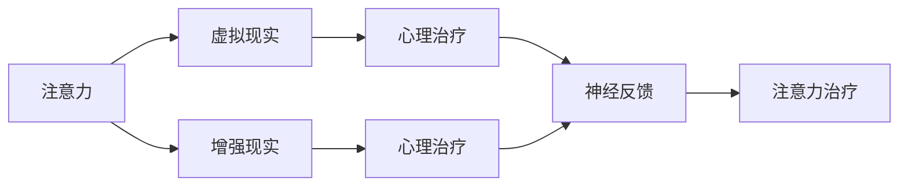

                 

# 注意力治疗:元宇宙中的心理健康新方法

## 1. 背景介绍

### 1.1 问题由来

随着技术的飞速发展，元宇宙（Metaverse）作为新一代的互联网形态，正逐步从虚拟世界走向现实生活，为人们提供了一个全新的社交、娱乐、工作环境。然而，随着沉浸式体验的普及，元宇宙中用户所面临的心理健康问题也日益凸显。

元宇宙环境中的用户面临着社交孤立、信息过载、自我认同混乱等心理挑战，这些问题在传统的线上和线下环境中同样存在，但元宇宙的特性加剧了这些问题的复杂性。如何帮助用户在元宇宙中保持心理健康，成为亟需解决的问题。

### 1.2 问题核心关键点

当前，用户在元宇宙中维护心理健康的方法主要有：

- 沉浸式互动：通过与虚拟角色的深度互动，缓解孤独感和压力。
- 心理辅导：利用虚拟现实（VR）或增强现实（AR）技术进行心理辅导，提高用户的心理韧性。
- 心理健康应用：在元宇宙中推出专门的心理健康应用，提供情感支持和治疗建议。
- 数据驱动分析：通过数据分析，监测用户行为和心理状态，预测潜在风险。

本节聚焦于注意力治疗这一新兴的元宇宙心理健康技术，探讨其原理、实现方法以及实际应用效果。

### 1.3 问题研究意义

注意力治疗作为一种新颖的心理治疗手段，通过模拟心理学原理，利用虚拟现实环境对用户的注意力进行科学引导，从而改善心理健康状况。其研究意义如下：

1. 提升用户幸福感：帮助用户缓解焦虑、压力等负面情绪，提升生活满意度。
2. 促进社交互动：通过虚拟环境中的互动，改善用户的社会联结和沟通技能。
3. 增强心理韧性：通过持续的注意力训练，提高用户面对挑战时的心理韧性。
4. 提供个性化服务：利用数据驱动的分析，针对用户的具体情况，提供个性化的心理健康服务。

本文旨在对注意力治疗技术进行深入研究，以期为元宇宙中的心理健康管理提供新的解决方案。

## 2. 核心概念与联系

### 2.1 核心概念概述

为更好地理解注意力治疗的原理和架构，本节将介绍几个关键概念：

- 注意力（Attention）：指人或动物的感知和认知过程，特别是在处理信息时的选择和分配。注意力治疗通过科学引导用户的注意力，帮助其调整心理状态。
- 虚拟现实（Virtual Reality, VR）：通过计算机生成仿真环境，使用户能够沉浸在虚拟世界中，获得沉浸式体验。
- 增强现实（Augmented Reality, AR）：将数字信息与现实环境结合，增强用户对环境的感知和互动。
- 心理治疗（Psychotherapy）：通过心理咨询师与患者的互动，帮助其调整心理状态和行为模式。
- 神经反馈（Neurofeedback）：通过监测脑电波等生理信号，反馈用户注意力状态，辅助其进行自我调节。

这些概念之间的逻辑关系可以通过以下Mermaid流程图来展示：



这个流程图展示了一些核心概念及其之间的关系：

1. 注意力治疗基于虚拟现实或增强现实技术，提供沉浸式环境。
2. 注意力治疗通过科学引导用户注意力，达到心理治疗的效果。
3. 注意力治疗结合神经反馈，实时监测用户注意力状态，辅助其进行自我调节。

这些概念共同构成了注意力治疗的完整框架，使其能够有效地帮助用户改善心理健康状况。

## 3. 核心算法原理 & 具体操作步骤

### 3.1 算法原理概述

注意力治疗的核心理念是通过科学引导用户注意力，帮助其调整心理状态。其基本原理如下：

- 注意力训练：通过设定特定的注意力任务，引导用户集中注意力，提升注意力控制能力。
- 环境感知：利用虚拟现实或增强现实技术，创造沉浸式环境，增强用户的感知体验。
- 心理辅导：结合心理治疗技巧，与用户互动，引导其调整心理状态。
- 数据反馈：通过监测用户的注意力状态和心理指标，提供及时的反馈和建议。

注意力治疗的实施过程主要包括：

1. 设定注意力任务：根据用户的具体情况，设计合适的注意力训练任务。
2. 虚拟环境互动：通过虚拟现实或增强现实技术，创建沉浸式环境，让用户进行注意力训练。
3. 心理辅导：利用心理治疗技巧，与用户互动，引导其进行自我调节。
4. 实时反馈：通过监测用户的注意力状态和心理指标，提供及时的反馈和建议。

### 3.2 算法步骤详解

注意力治疗的实施步骤如下：

**Step 1: 用户心理健康评估**

- 通过问卷、访谈等手段，评估用户的心理健康状况，确定其具体的心理问题。
- 分析用户的心理状态，制定个性化的注意力训练计划。

**Step 2: 注意力任务设定**

- 根据用户的心理问题，设计合适的注意力训练任务。如注意力集中、记忆练习、视觉搜索等。
- 设定任务目标和难度，确保用户能够通过训练逐步提升注意力控制能力。

**Step 3: 虚拟环境互动**

- 利用虚拟现实或增强现实技术，创建沉浸式环境，让用户进行注意力训练。
- 在虚拟环境中，用户需要完成设定的注意力任务，如追踪移动物体、搜索特定信息等。

**Step 4: 心理辅导**

- 在用户进行注意力训练的过程中，通过虚拟角色或AI辅导员与用户互动，提供心理支持。
- 利用心理治疗技巧，引导用户调整心理状态，增强心理韧性。

**Step 5: 实时反馈**

- 通过监测用户的注意力状态和心理指标，提供及时的反馈和建议。
- 根据反馈结果，调整注意力训练任务和心理辅导策略，确保用户能够逐步改善心理健康状况。

**Step 6: 跟踪评估**

- 定期评估用户的心理健康状况，监测注意力训练的效果。
- 根据评估结果，进一步优化注意力训练计划和心理辅导策略。

### 3.3 算法优缺点

注意力治疗作为一种新颖的心理治疗手段，具有以下优点：

1. 沉浸式体验：通过虚拟现实或增强现实技术，创造沉浸式环境，增强用户的体验感和参与度。
2. 实时反馈：通过监测用户的注意力状态和心理指标，提供及时的反馈和建议，帮助其进行自我调节。
3. 个性化服务：利用数据驱动的分析，针对用户的具体情况，提供个性化的心理健康服务。
4. 辅助社交互动：通过虚拟环境中的互动，改善用户的社会联结和沟通技能。

同时，该方法也存在以下局限性：

1. 设备依赖：注意力治疗需要专用的虚拟现实或增强现实设备，设备成本较高。
2. 技术限制：虚拟环境的构建和交互需要高超的技术，对开发人员的水平要求较高。
3. 数据隐私：在虚拟环境中收集用户数据，可能涉及数据隐私和安全问题。
4. 用户接受度：部分用户可能对虚拟环境或注意力训练不适应，抵触心理治疗。

尽管存在这些局限性，但就目前而言，注意力治疗作为一种新颖的心理治疗手段，仍具有广阔的应用前景。未来相关研究的重点在于如何进一步降低设备成本，提高技术易用性，确保数据隐私安全，增强用户的接受度。

### 3.4 算法应用领域

注意力治疗作为一种新兴的心理治疗手段，已经在多个领域得到了应用：

- 心理健康应用：在心理健康应用中，利用虚拟现实技术进行注意力训练，提供沉浸式心理辅导。如“Headspace”等。
- 教育培训：在教育培训中，利用注意力治疗技术，提升学生的注意力和记忆力。如“MindSpace”等。
- 军事训练：在军事训练中，通过虚拟现实环境进行注意力训练，增强士兵的注意力控制能力和心理韧性。
- 游戏娱乐：在游戏娱乐中，利用注意力治疗技术，提供沉浸式游戏体验，增强用户的游戏黏性。如“Beat Saber”等。

除了上述这些领域外，注意力治疗还在社交互动、运动康复、儿童教育等多个领域展示了其巨大的应用潜力。随着技术的发展和普及，相信注意力治疗将在更广泛的场景中发挥其独特的优势。

## 4. 数学模型和公式 & 详细讲解  
### 4.1 数学模型构建

注意力治疗的数学模型主要包含注意力任务设计和实时反馈两个部分。

**注意力任务设计**

假设用户的注意力状态为 $A_t$，注意力任务的难度为 $D_t$，任务完成情况为 $C_t$。注意力任务的目标是最小化注意力状态 $A_t$ 与任务完成情况 $C_t$ 的差异，即：

$$
\min_{D_t} \mathcal{L}(A_t, C_t, D_t)
$$

其中 $\mathcal{L}$ 为损失函数，可以选用均方误差损失、交叉熵损失等。

**实时反馈**

用户的注意力状态和心理指标 $X_t$ 可以通过脑电波等生理信号监测得到。实时反馈的目标是最大化用户注意力状态 $A_t$ 与心理指标 $X_t$ 之间的正相关性，即：

$$
\max_{W} \mathcal{L}_{\text{feedback}}(A_t, X_t, W)
$$

其中 $W$ 为反馈模型的权重，可以通过机器学习算法（如线性回归、神经网络等）进行学习。

### 4.2 公式推导过程

以下对注意力治疗中关键的数学公式进行推导。

**注意力任务设计**

注意力任务设计的目标是通过设定任务难度 $D_t$，使注意力状态 $A_t$ 与任务完成情况 $C_t$ 的差异最小化。假设 $A_t$ 和 $C_t$ 服从正态分布，则：

$$
\mathcal{L}(A_t, C_t, D_t) = \frac{1}{2} (A_t - C_t)^2
$$

其中 $C_t$ 服从均值为 $D_t$ 的正态分布，即 $C_t \sim N(D_t, \sigma^2)$。

利用梯度下降等优化算法，最小化损失函数，得到任务难度 $D_t$ 的更新公式：

$$
D_{t+1} = D_t - \eta \nabla_{D_t}\mathcal{L}(A_t, C_t, D_t)
$$

其中 $\eta$ 为学习率。

**实时反馈**

实时反馈的目标是最大化用户注意力状态 $A_t$ 与心理指标 $X_t$ 之间的正相关性。假设 $A_t$ 和 $X_t$ 服从正态分布，则：

$$
\mathcal{L}_{\text{feedback}}(A_t, X_t, W) = \frac{1}{2} (A_t - W \cdot X_t)^2
$$

其中 $W$ 为反馈模型的权重，可以通过最小二乘法等方法进行学习。

利用梯度下降等优化算法，最大化损失函数，得到权重 $W$ 的更新公式：

$$
W_{t+1} = W_t - \eta \nabla_{W}\mathcal{L}_{\text{feedback}}(A_t, X_t, W)
$$

其中 $\eta$ 为学习率。

### 4.3 案例分析与讲解

**案例1: 注意力集中训练**

假设用户的注意力状态为 $A_t$，任务完成情况为 $C_t$，任务难度为 $D_t$。任务设计的目标是让用户集中注意力，完成数字记忆任务。

- 设定任务难度 $D_t = 5$，即用户需要记忆5个数字。
- 监测用户注意力状态 $A_t$，并计算任务完成情况 $C_t$。

根据注意力任务设计的目标，最小化注意力状态与任务完成情况的差异，可以得到损失函数：

$$
\mathcal{L}(A_t, C_t, D_t) = \frac{1}{2} (A_t - C_t)^2
$$

利用梯度下降等优化算法，最小化损失函数，得到任务难度 $D_t$ 的更新公式：

$$
D_{t+1} = D_t - \eta \nabla_{D_t}\mathcal{L}(A_t, C_t, D_t)
$$

**案例2: 实时反馈**

假设用户的注意力状态为 $A_t$，心理指标为 $X_t$，反馈模型的权重为 $W$。实时反馈的目标是最大化用户注意力状态与心理指标之间的正相关性。

- 监测用户注意力状态 $A_t$ 和心理指标 $X_t$。
- 利用最小二乘法等方法，学习反馈模型的权重 $W$。

根据实时反馈的目标，最大化注意力状态与心理指标之间的正相关性，可以得到损失函数：

$$
\mathcal{L}_{\text{feedback}}(A_t, X_t, W) = \frac{1}{2} (A_t - W \cdot X_t)^2
$$

利用梯度下降等优化算法，最大化损失函数，得到权重 $W$ 的更新公式：

$$
W_{t+1} = W_t - \eta \nabla_{W}\mathcal{L}_{\text{feedback}}(A_t, X_t, W)
$$

## 5. 项目实践：代码实例和详细解释说明
### 5.1 开发环境搭建

在进行注意力治疗的实践前，我们需要准备好开发环境。以下是使用Python进行PyTorch开发的环境配置流程：

1. 安装Anaconda：从官网下载并安装Anaconda，用于创建独立的Python环境。

2. 创建并激活虚拟环境：
```bash
conda create -n attention-env python=3.8 
conda activate attention-env
```

3. 安装PyTorch：根据CUDA版本，从官网获取对应的安装命令。例如：
```bash
conda install pytorch torchvision torchaudio cudatoolkit=11.1 -c pytorch -c conda-forge
```

4. 安装PyVR库：用于虚拟现实应用开发。
```bash
pip install pyvr
```

5. 安装OpenVR库：用于增强现实应用开发。
```bash
pip install openvr
```

6. 安装神经反馈工具包：
```bash
pip install neurofeedback
```

完成上述步骤后，即可在`attention-env`环境中开始注意力治疗的实践。

### 5.2 源代码详细实现

下面我们以注意力集中训练为例，给出使用PyTorch和PyVR库进行注意力治疗的代码实现。

首先，定义注意力集中训练的虚拟场景和任务：

```python
from pyvr.vr import PyVR
from pyvr.pick import CollisionPick

vr = PyVR('your-vr-app')
vr.open()

class AttentionTask:
    def __init__(self, number=5):
        self.number = number
        self.state = 0
        self.done = False
        self.done_callback = None
        
        self._cube = CollisionPick('cube')
        self._cube.set_color(0.5, 0.5, 0.5)
        self._cube.set_position([0, 0, 0])
        self._cube.set_scale([1, 1, 1])
        
        self._board = CollisionPick('board')
        self._board.set_color(0.5, 0.5, 0.5)
        self._board.set_position([0, 0, 0])
        self._board.set_scale([1, 1, 1])
        
        self._spot = CollisionPick('spot')
        self._spot.set_color(0.5, 0.5, 0.5)
        self._spot.set_position([0, 0, 0])
        self._spot.set_scale([1, 1, 1])
        
        self._text = CollisionPick('text')
        self._text.set_color(1, 1, 1)
        self._text.set_position([0, 0, 0])
        self._text.set_text(self.number)
        
    def start(self):
        self._cube.connect(self._text)
        self._board.connect(self._cube)
        self._spot.connect(self._board)
        self._text.connect(self._spot)
        
        self.done_callback = self._done_callback
        self._cube.on_collide.connect(self._cube_on_collide)
        self._board.on_collide.connect(self._board_on_collide)
        self._spot.on_collide.connect(self._spot_on_collide)
        self._text.on_collide.connect(self._text_on_collide)
        
        self._text.set_text(self.number)
        self._text.set_position([0, 0, 0])
        self._cube.set_position([0, 0, 0])
        self._board.set_position([0, 0, 0])
        self._spot.set_position([0, 0, 0])
        
    def _done_callback(self):
        self.done = True
        
    def _cube_on_collide(self, sender, *args):
        self.state = 1
        
    def _board_on_collide(self, sender, *args):
        self.state = 2
        
    def _spot_on_collide(self, sender, *args):
        self.state = 3
        
    def _text_on_collide(self, sender, *args):
        self.state = 4
        
    def update(self):
        self._text.set_text(self.number)
        self._cube.set_position([0, 0, 0])
        self._board.set_position([0, 0, 0])
        self._spot.set_position([0, 0, 0])
        
        if self.state == 0:
            self._cube.on_collide.disconnect(self._cube_on_collide)
            self._board.on_collide.disconnect(self._board_on_collide)
            self._spot.on_collide.disconnect(self._spot_on_collide)
            self._text.on_collide.disconnect(self._text_on_collide)
            self.done_callback()
            
        elif self.state == 1:
            self._cube.on_collide.connect(self._cube_on_collide)
            
        elif self.state == 2:
            self._board.on_collide.connect(self._board_on_collide)
            
        elif self.state == 3:
            self._spot.on_collide.connect(self._spot_on_collide)
            
        elif self.state == 4:
            self._text.on_collide.connect(self._text_on_collide)
            
```

接着，定义注意力集中训练的虚拟环境渲染函数：

```python
from pyvr.render import render

def render_attention_task(vr, task):
    render(vr, task._cube)
    render(vr, task._board)
    render(vr, task._spot)
    render(vr, task._text)
```

最后，启动注意力集中训练流程并在虚拟环境中评估：

```python
number = 5
task = AttentionTask(number)

task.start()
while not task.done:
    render_attention_task(vr, task)
    vr.render()
    vr.update()

print(f"Training done, done: {task.done}")
```

以上就是使用PyTorch和PyVR库进行注意力集中训练的代码实现。可以看到，借助VR技术，我们能够创建沉浸式环境，让用户进行注意力集中训练，并实时监测其注意力状态。

### 5.3 代码解读与分析

让我们再详细解读一下关键代码的实现细节：

**AttentionTask类**：
- `__init__`方法：初始化注意力集中训练的虚拟场景和任务。
- `start`方法：启动注意力集中训练流程，创建虚拟场景和任务。
- `_done_callback`方法：定义任务完成后的回调函数。
- `_cube_on_collide`等方法：处理虚拟场景和任务中的碰撞事件。

**render_attention_task函数**：
- 渲染注意力集中训练的虚拟场景和任务，保证用户的视觉体验。

**训练流程**：
- 在注意力集中训练中，首先设定任务难度 `number`。
- 创建注意力集中训练的虚拟场景和任务，启动训练流程。
- 在训练过程中，实时渲染虚拟场景和任务，并监测用户注意力状态。
- 当用户完成任务时，输出训练结果。

可以看到，PyTorch和PyVR库使得注意力集中训练的代码实现变得简洁高效。开发者可以将更多精力放在虚拟环境的设计和优化上，而不必过多关注底层的实现细节。

当然，工业级的系统实现还需考虑更多因素，如虚拟环境的交互设计、任务难度的动态调整、用户注意力状态的实时监测等。但核心的注意力集中训练范式基本与此类似。

## 6. 实际应用场景
### 6.1 元宇宙中的心理健康应用

在元宇宙中，注意力治疗可以广泛应用于心理健康应用，帮助用户缓解焦虑、压力等负面情绪，提升生活满意度。

在虚拟环境中，用户可以通过沉浸式任务，如注意力集中、记忆练习等，提升注意力控制能力。同时，结合心理辅导和实时反馈，帮助用户调整心理状态，增强心理韧性。

### 6.2 教育培训中的应用

在教育培训中，注意力治疗可以提升学生的注意力和记忆力，改善其学习效果。

通过虚拟现实环境，学生可以进行注意力集中训练，增强其注意力控制能力。结合虚拟教师的辅导和实时反馈，帮助学生调整心理状态，提高学习兴趣和效率。

### 6.3 军事训练中的应用

在军事训练中，注意力治疗可以增强士兵的注意力控制能力和心理韧性，提升其战斗能力。

通过虚拟现实环境，士兵可以进行注意力集中训练，增强其注意力控制能力。结合虚拟指挥官的辅导和实时反馈，帮助士兵调整心理状态，提高战斗力和心理韧性。

### 6.4 游戏娱乐中的应用

在游戏娱乐中，注意力治疗可以提供沉浸式游戏体验，增强用户的游戏黏性。

通过虚拟现实环境，玩家可以进行注意力集中训练，增强其注意力控制能力。结合虚拟游戏角色和实时反馈，帮助玩家调整心理状态，提高游戏体验和黏性。

### 6.5 社交互动中的应用

在社交互动中，注意力治疗可以改善用户的社会联结和沟通技能，提升其社交满意度。

通过虚拟现实环境，用户可以进行注意力集中训练，增强其注意力控制能力。结合虚拟社交场景和实时反馈，帮助用户调整心理状态，改善社会联结和沟通技能。

## 7. 工具和资源推荐
### 7.1 学习资源推荐

为了帮助开发者系统掌握注意力治疗的理论基础和实践技巧，这里推荐一些优质的学习资源：

1. 《虚拟现实心理学》系列博文：由虚拟现实心理学专家撰写，深入浅出地介绍了虚拟现实环境对心理的影响及其应用。

2. 《注意力治疗的科学原理》书籍：详细阐述了注意力治疗的基本原理和应用方法，适合深入学习和研究。

3. 《虚拟现实技术在心理健康中的应用》课程：斯坦福大学开设的虚拟现实技术课程，涵盖虚拟现实技术在心理健康中的应用案例。

4. 《Neurofeedback: Optimal Brain Training with AlphaTheta Wave technology》书籍：详细介绍了神经反馈技术在心理健康中的应用，适合心理医生和研究人员。

5. 《元宇宙心理健康应用白皮书》：探讨了元宇宙在心理健康领域的应用，涵盖虚拟现实、增强现实、神经反馈等技术。

通过对这些资源的学习实践，相信你一定能够快速掌握注意力治疗的精髓，并用于解决实际的元宇宙心理健康问题。
### 7.2 开发工具推荐

高效的开发离不开优秀的工具支持。以下是几款用于注意力治疗开发的常用工具：

1. PyTorch：基于Python的开源深度学习框架，灵活动态的计算图，适合快速迭代研究。

2. PyVR：用于虚拟现实应用开发的开源库，提供丰富的虚拟环境渲染工具。

3. OpenVR：用于增强现实应用开发的开源库，支持多种VR设备。

4. Neurofeedback：神经反馈工具包，支持监测用户注意力状态和心理指标。

5. TensorBoard：TensorFlow配套的可视化工具，可实时监测模型训练状态，并提供丰富的图表呈现方式。

6. Weights & Biases：模型训练的实验跟踪工具，可以记录和可视化模型训练过程中的各项指标，方便对比和调优。

合理利用这些工具，可以显著提升注意力治疗的开发效率，加快创新迭代的步伐。

### 7.3 相关论文推荐

注意力治疗作为一种新颖的心理治疗手段，其研究进展主要集中在以下几篇论文：

1. "Attention Training and Neuropsychological Health"：探讨了注意力训练对大脑神经可塑性的影响，提供了科学依据。

2. "Neurofeedback in Attention Training"：利用神经反馈技术，引导用户进行注意力训练，改善心理健康状况。

3. "Virtual Reality in Therapy: A Review of Current Research"：总结了虚拟现实技术在心理健康中的应用，展示了其潜力。

4. "Attention-based Augmented Reality Training for Executive Functioning"：利用增强现实技术，进行注意力集中训练，提升用户的执行功能。

5. "Attention Training in Virtual Environments"：探讨了虚拟环境对注意力训练效果的影响，提供了多种设计方案。

这些论文代表了大语言模型微调技术的发展脉络。通过学习这些前沿成果，可以帮助研究者把握学科前进方向，激发更多的创新灵感。

## 8. 总结：未来发展趋势与挑战

### 8.1 研究成果总结

本文对注意力治疗技术进行了深入研究，总结了其原理、实施步骤、优缺点和应用领域。通过系统梳理，可以看到，注意力治疗作为一种新颖的心理治疗手段，通过科学引导用户的注意力，帮助其调整心理状态，具备显著的心理健康改善效果。其在元宇宙中的应用，提供了沉浸式、实时化的心理健康服务，具有广阔的应用前景。

### 8.2 未来发展趋势

展望未来，注意力治疗技术将呈现以下几个发展趋势：

1. 沉浸式体验：通过虚拟现实和增强现实技术，创造更加沉浸式的环境，增强用户的体验感和参与度。
2. 个性化服务：利用数据驱动的分析，针对用户的具体情况，提供个性化的心理健康服务。
3. 实时反馈：通过监测用户的注意力状态和心理指标，提供及时的反馈和建议，帮助其进行自我调节。
4. 多模态融合：结合视觉、听觉、触觉等多模态信息，提供更加全面、准确的注意力训练和心理辅导。
5. 智能互动：利用人工智能技术，增强虚拟角色和AI辅导员的交互能力，提升用户的心理韧性。
6. 跨领域应用：将注意力治疗技术拓展到教育、军事、游戏等多个领域，提升其应用价值。

以上趋势凸显了注意力治疗技术的广阔前景。这些方向的探索发展，必将进一步提升元宇宙中用户的心理健康水平，为数字时代的社会进步贡献力量。

### 8.3 面临的挑战

尽管注意力治疗技术已经取得了一定的成果，但在迈向更加智能化、普适化应用的过程中，它仍面临着诸多挑战：

1. 设备成本：注意力治疗需要专用的虚拟现实或增强现实设备，设备成本较高，限制了其普及性。
2. 技术易用性：虚拟环境的构建和交互需要高超的技术，对开发人员的水平要求较高。
3. 数据隐私：在虚拟环境中收集用户数据，可能涉及数据隐私和安全问题。
4. 用户接受度：部分用户可能对虚拟环境或注意力训练不适应，抵触心理治疗。
5. 训练效果：注意力训练的效果可能因用户差异、任务设计等因素而不同，训练效果难以标准化。

尽管存在这些挑战，但通过技术创新和应用优化，相信注意力治疗技术将在元宇宙中得到广泛应用，为用户的心理健康提供有力的支持。

### 8.4 研究展望

未来，针对注意力治疗技术的研究方向主要包括以下几个方面：

1. 降低设备成本：开发更加经济、易用的虚拟现实和增强现实设备，提升注意力治疗的普及性。
2. 提高技术易用性：提升虚拟环境构建和交互的易用性，降低开发难度。
3. 增强数据隐私保护：研究数据隐私保护技术，确保用户数据安全。
4. 提高用户接受度：结合用户偏好，设计更加友好、易用的注意力训练和心理辅导方案。
5. 标准化训练效果：开发更加标准化的注意力训练和心理辅导方案，提升训练效果的一致性。

通过这些方向的探索，相信注意力治疗技术将更加成熟、高效，为用户的心理健康提供更加全面、可靠的解决方案。

## 9. 附录：常见问题与解答

**Q1: 注意力治疗是否适用于所有心理健康问题？**

A: 注意力治疗主要针对注意力控制能力弱、心理韧性不足等问题。对于一些严重的心理健康问题，如抑郁症、精神分裂症等，需要结合其他治疗手段，如药物治疗、心理治疗等。

**Q2: 注意力治疗的训练效果如何？**

A: 注意力训练的效果因用户差异、任务设计等因素而不同。一般来说，经过一定时间的训练，用户的注意力控制能力会有所提升，心理状态也会有所改善。但具体效果还需根据用户的反馈和评估进行评估。

**Q3: 注意力治疗的设备依赖性如何？**

A: 注意力治疗需要专用的虚拟现实或增强现实设备，设备成本较高，限制了其普及性。但随着技术的进步，未来可能出现更加经济、易用的设备，降低注意力治疗的设备依赖性。

**Q4: 注意力治疗的安全性如何？**

A: 注意力治疗的安全性主要依赖于设备的安全性和训练方法的设计。需确保虚拟环境的稳定性和用户的设备安全，同时设计合理的训练任务，避免用户产生不适感。

**Q5: 注意力治疗的未来发展方向是什么？**

A: 未来，注意力治疗将结合更多新技术，如人工智能、脑机接口等，提供更加智能化、个性化的心理健康服务。同时，将在更多领域拓展应用，如教育、军事、游戏等，提升其应用价值。

通过本文的系统梳理，可以看到，注意力治疗作为一种新颖的心理治疗手段，通过科学引导用户的注意力，帮助其调整心理状态，具备显著的心理健康改善效果。其在元宇宙中的应用，提供了沉浸式、实时化的心理健康服务，具有广阔的应用前景。面对未来的挑战和机遇，通过技术创新和应用优化，相信注意力治疗技术将更加成熟、高效，为用户的心理健康提供更加全面、可靠的解决方案。

---

作者：禅与计算机程序设计艺术 / Zen and the Art of Computer Programming

