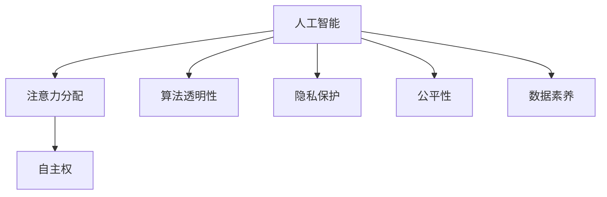

                 

# 注意力的自主权：AI时代的个人选择

> 关键词：人工智能,注意力,自主权,AI伦理,算法透明性,隐私保护,未来趋势,数据素养

## 1. 背景介绍

### 1.1 问题由来
随着人工智能技术的迅猛发展，越来越多的智能系统进入人们的日常生活。从简单的语音助手到复杂的医疗诊断，从自动驾驶到智能推荐系统，人工智能无处不在，极大提升了生产效率和生活质量。然而，在享受这些智能带来便利的同时，人们也开始担忧AI系统的“注意力”——它是否在正确的地方，是否尊重并保护个人的选择与隐私？

“注意力”在这里指的是AI系统在处理海量信息时所赋予的资源分配决策，即它会集中注意力于哪些方面，忽略哪些方面。在AI时代，这种“注意力”往往由算法模型决定，但算法的决策机制和模型训练过程，很多时候并不透明，甚至有时还包含偏见和歧视。这使得AI系统在执行任务时，有时可能未能充分尊重和保护用户的自主权。

例如，搜索引擎可能在未征得用户同意的情况下，通过追踪用户行为来提升搜索结果的精准度，这种行为可能侵犯了用户的隐私；推荐系统通过分析用户的浏览记录，进行个性化推荐，但这种推荐可能基于用户未知的偏好数据，对用户自主选择造成干扰。

面对这些挑战，我们需要重新审视AI系统的“注意力”问题，探讨如何在保证算法公平性、透明性的同时，赋予用户更多的自主权，确保AI系统在提供智能服务时，尊重用户的隐私和选择，维护社会的公平正义。

### 1.2 问题核心关键点
本节将聚焦于以下核心问题：
1. 人工智能的“注意力”是如何分配的，算法模型是如何做出决策的？
2. 如何保证AI系统的透明性和公平性，确保其决策符合伦理标准？
3. 如何提升用户的算法素养，让用户能够主动管理自己的“注意力”？
4. 未来AI技术的发展趋势，以及在这些趋势下个人选择的变化。

### 1.3 问题研究意义
探讨“注意力”的自主权问题，对于构建公正、透明的AI系统，维护社会公平正义，具有重要意义：

1. 促进算法透明性。通过研究AI系统的决策过程，揭示算法的不透明性和偏见，有助于公众理解和监督AI系统的行为。
2. 保护用户隐私。明确AI系统在数据收集和处理过程中应遵循的隐私原则，保障用户的个人信息安全。
3. 提升用户自主权。通过增强AI系统的可解释性，让用户能够主动管理和控制AI系统的“注意力”，维护自己的选择权和隐私权。
4. 推动AI伦理研究。对AI系统的注意力决策进行深入分析，探索合理的决策机制，推动AI伦理学的进步。
5. 促进AI技术的健康发展。通过研究AI系统如何尊重用户自主权，促进AI技术的健康应用，避免潜在的滥用风险。

## 2. 核心概念与联系

### 2.1 核心概念概述

为更好地理解“注意力”的自主权问题，本节将介绍几个密切相关的核心概念：

- **人工智能(Artificial Intelligence, AI)**：通过算法和模型实现，能够模拟人类智能行为的计算机系统。
- **注意力(Mechanism of Attention)**：AI系统在处理数据时，根据特定规则或任务需求，将资源集中于特定部分的能力。
- **自主权(Privacy and Autonomy)**：用户对自己数据和决策的控制权，包括知情权、同意权、选择权等。
- **算法透明性(Algorithm Transparency)**：AI系统的决策过程应可解释、可理解，确保用户和监管者能够理解其工作机制。
- **隐私保护(Privacy Protection)**：保护用户隐私，确保个人数据不被滥用或泄露。
- **公平性(Fairness)**：AI系统的决策应基于客观数据，不偏袒特定群体，不歧视弱势群体。
- **数据素养(Data Literacy)**：用户具备的数据处理和分析能力，能够在AI系统中有效管理和保护自己的数据。

这些概念之间的逻辑关系可以通过以下Mermaid流程图来展示：



这个流程图展示了几大核心概念及其之间的关系：

1. 人工智能通过注意力分配实现数据处理和决策，而这些决策应当是透明的、公平的，并保护用户的自主权。
2. 算法透明性、隐私保护和公平性共同构成了AI系统的基本伦理原则。
3. 数据素养是用户有效管理自己数据的前提，也是AI系统设计时应考虑的重要因素。

## 3. 核心算法原理 & 具体操作步骤
### 3.1 算法原理概述

人工智能系统的“注意力”决策主要通过以下机制实现：

1. **数据处理**：AI系统首先对数据进行编码和特征提取，形成数据表示。
2. **模型训练**：使用大量标注数据，训练一个能够预测目标变量的模型。
3. **注意力机制**：在模型预测过程中，通过注意力机制决定哪些数据特征对模型输出有重要影响。
4. **输出决策**：根据模型输出和注意力机制，生成最终决策。

注意力机制的原理可以简单理解为“有选择地关注数据中的关键部分”。例如，在自然语言处理中，注意力机制可以让模型在处理长文本时，只关注最相关的词句；在计算机视觉中，注意力机制可以识别图像中最显著的特征。

注意力机制的核心是注意力权重向量，它描述了不同数据特征对模型输出的贡献程度。权重向量的计算通常基于某种函数，如点积、加权平均等。

### 3.2 算法步骤详解

基于注意力机制的AI系统大致可分为以下步骤：

**Step 1: 数据准备**
- 收集标注数据，分为训练集、验证集和测试集。
- 对数据进行预处理，如分词、编码、归一化等。

**Step 2: 模型设计**
- 选择合适的模型架构，如Transformer、RNN等。
- 设计注意力机制，定义注意力权重计算函数。

**Step 3: 模型训练**
- 在训练集上使用优化算法，如Adam、SGD等，最小化损失函数。
- 在训练过程中，计算注意力权重向量。

**Step 4: 模型评估**
- 在验证集上评估模型性能，调整超参数。
- 在测试集上验证模型泛化能力。

**Step 5: 部署应用**
- 将训练好的模型部署到实际应用中。
- 确保模型的透明性和可解释性，提升用户信任度。

### 3.3 算法优缺点

基于注意力机制的AI系统具有以下优点：

1. 高效处理复杂数据。注意力机制能够动态选择关键特征，减少冗余信息，提升模型效率。
2. 提高决策质量。通过权衡不同特征的重要性，增强模型的决策准确性。
3. 可解释性提升。注意力权重向量提供了模型决策的透明度，帮助用户理解AI的决策过程。

但该系统也存在一些局限性：

1. 数据依赖性强。模型性能受数据质量和多样性的影响较大。
2. 存在偏见。若训练数据存在偏见，模型可能学习到并放大这些偏见，影响公平性。
3. 可解释性不足。注意力机制本身是“黑盒”的，模型决策的透明度仍有待提升。

### 3.4 算法应用领域

基于注意力机制的AI系统在众多领域均有应用，如自然语言处理、计算机视觉、推荐系统等。

1. **自然语言处理**：使用注意力机制处理长文本，提升文本生成、情感分析、问答系统等任务的效果。
2. **计算机视觉**：用于图像分类、目标检测、语义分割等，提升模型的视觉感知能力。
3. **推荐系统**：通过注意力机制计算用户对不同物品的兴趣权重，提升推荐精度和多样性。
4. **医疗诊断**：用于图像分析、病历分析等，帮助医生进行疾病诊断和治疗方案推荐。
5. **金融分析**：分析交易数据、市场动态，提供投资建议和风险预警。

## 4. 数学模型和公式 & 详细讲解 & 举例说明
### 4.1 数学模型构建

在自然语言处理中，常用的注意力模型包括Transformer。下面以Transformer模型为例，展示其注意力机制的数学模型构建。

Transformer模型由编码器和解码器两部分组成，其中编码器用于处理输入序列，解码器用于生成输出序列。注意力机制位于编码器和解码器中，用于处理序列间的依赖关系。

**编码器中的注意力机制**

假设输入序列为 $x_1, x_2, ..., x_n$，编码器的注意力权重向量为 $a_1, a_2, ..., a_n$，则注意力机制的计算公式为：

$$
a_i = \frac{\exp(s(x_i, x_j))}{\sum_{k=1}^n \exp(s(x_k, x_j))}
$$

其中 $s$ 为注意力函数，可以是点积、加权平均等。注意力权重 $a_i$ 表示输入序列中第 $i$ 个词与输出序列中第 $j$ 个词的注意力程度。

**解码器中的注意力机制**

假设输出序列为 $y_1, y_2, ..., y_m$，解码器中的注意力权重向量为 $b_1, b_2, ..., b_m$，则注意力机制的计算公式为：

$$
b_i = \frac{\exp(s(y_i, x_j))}{\sum_{k=1}^n \exp(s(y_k, x_j))}
$$

其中 $s$ 同样为注意力函数，可以是点积、加权平均等。注意力权重 $b_i$ 表示输出序列中第 $i$ 个词与输入序列中所有词的注意力程度。

### 4.2 公式推导过程

以Transformer模型中的注意力机制为例，推导其数学公式。

假设输入序列 $x_1, x_2, ..., x_n$，输出序列 $y_1, y_2, ..., y_m$，解码器中第 $i$ 个词的注意力权重 $b_i$ 表示为：

$$
b_i = \frac{\exp(\sum_{k=1}^n s(y_i, x_k))}{\sum_{j=1}^m \exp(\sum_{k=1}^n s(y_j, x_k))}
$$

其中 $s$ 为注意力函数，可以是点积：

$$
s(y_i, x_k) = y_i^T x_k
$$

将上述公式带入解码器中的注意力计算公式：

$$
b_i = \frac{\exp(\sum_{k=1}^n y_i^T x_k)}{\sum_{j=1}^m \exp(\sum_{k=1}^n y_j^T x_k)}
$$

对 $y_i$ 进行编码器计算，得：

$$
y_i = \text{Transformer}_{\theta}(x_k)
$$

将 $y_i$ 代入上式：

$$
b_i = \frac{\exp(\sum_{k=1}^n \text{Transformer}_{\theta}(x_k)^T x_k)}{\sum_{j=1}^m \exp(\sum_{k=1}^n \text{Transformer}_{\theta}(x_k)^T x_k)}
$$

### 4.3 案例分析与讲解

假设有一句话：“今天天气不错，适合去公园。”，我们需要将其翻译成英文。使用Transformer模型时，先对输入的中文句子进行编码，生成向量表示。然后通过解码器，逐步生成输出英文单词。

1. 将输入句子编码，生成向量表示：

$$
x_1, x_2, ..., x_n = \text{Tokenizer}(\text{句子})
$$

2. 通过编码器计算注意力权重向量：

$$
a_1, a_2, ..., a_n = \text{Attention}(x_1, x_2, ..., x_n)
$$

3. 使用注意力机制解码，逐步生成输出：

$$
y_1 = \text{Transformer}_{\theta}(x_k)
$$

4. 计算解码器中的注意力权重向量：

$$
b_1 = \frac{\exp(\sum_{k=1}^n \text{Transformer}_{\theta}(x_k)^T x_k)}{\sum_{j=1}^m \exp(\sum_{k=1}^n \text{Transformer}_{\theta}(x_k)^T x_k)}
$$

5. 根据注意力权重向量生成输出单词：

$$
y_i = \text{Softmax}(b_i)
$$

6. 重复步骤3-5，直到生成完整英文句子。

## 5. 项目实践：代码实例和详细解释说明
### 5.1 开发环境搭建

在进行Transformer模型的注意力机制实践时，我们需要准备好开发环境。以下是使用Python进行PyTorch开发的环境配置流程：

1. 安装Anaconda：从官网下载并安装Anaconda，用于创建独立的Python环境。

2. 创建并激活虚拟环境：
```bash
conda create -n transformers-env python=3.8 
conda activate transformers-env
```

3. 安装PyTorch：根据CUDA版本，从官网获取对应的安装命令。例如：
```bash
conda install pytorch torchvision torchaudio cudatoolkit=11.1 -c pytorch -c conda-forge
```

4. 安装Transformer库：
```bash
pip install transformers
```

5. 安装各类工具包：
```bash
pip install numpy pandas scikit-learn matplotlib tqdm jupyter notebook ipython
```

完成上述步骤后，即可在`transformers-env`环境中开始注意力机制的实践。

### 5.2 源代码详细实现

下面我们以自然语言处理中的Transformer模型为例，给出使用PyTorch实现注意力机制的完整代码实现。

首先，定义Transformer模型的编码器：

```python
import torch
from torch import nn

class TransformerEncoderLayer(nn.Module):
    def __init__(self, d_model, nhead, dim_feedforward, dropout):
        super(TransformerEncoderLayer, self).__init__()
        
        self.self_attn = nn.MultiheadAttention(d_model, nhead)
        self.self_attn_layer_norm = nn.LayerNorm(d_model)
        
        self.feedforward = nn.Sequential(
            nn.Linear(d_model, dim_feedforward),
            nn.ReLU(),
            nn.Linear(dim_feedforward, d_model),
        )
        self.feedforward_layer_norm = nn.LayerNorm(d_model)
        
        self.activation = nn.ReLU()
        self.dropout = nn.Dropout(dropout)
        
    def forward(self, src, src_mask):
        attn_output, attn_weights = self.self_attn(src, src, src, key_padding_mask=src_mask)
        src = self.self_attn_layer_norm(src + self.dropout(attn_output))
        
        ff_output = self.feedforward(src)
        src = self.feedforward_layer_norm(src + self.dropout(ff_output))
        
        return src, attn_weights
```

然后，定义Transformer模型的解码器：

```python
class TransformerDecoderLayer(nn.Module):
    def __init__(self, d_model, nhead, dim_feedforward, dropout):
        super(TransformerDecoderLayer, self).__init__()
        
        self.self_attn = nn.MultiheadAttention(d_model, nhead)
        self.self_attn_layer_norm = nn.LayerNorm(d_model)
        
        self.multihead_attn = nn.MultiheadAttention(d_model, nhead)
        self.multihead_attn_layer_norm = nn.LayerNorm(d_model)
        
        self.activation = nn.ReLU()
        self.dropout = nn.Dropout(dropout)
        
        self.linear1 = nn.Linear(d_model, dim_feedforward)
        self.linear2 = nn.Linear(dim_feedforward, d_model)
        
        self.activation = nn.ReLU()
        self.dropout = nn.Dropout(dropout)
        
    def forward(self, tgt, memory, tgt_mask, src_mask):
        attn_output, attn_weights = self.self_attn(tgt, tgt, tgt, key_padding_mask=tgt_mask)
        tgt = self.self_attn_layer_norm(tgt + self.dropout(attn_output))
        
        attn_output, attn_weights = self.multihead_attn(tgt, memory, memory, key_padding_mask=src_mask)
        tgt = self.multihead_attn_layer_norm(tgt + self.dropout(attn_output))
        
        ff_output = self.linear2(self.activation(self.linear1(tgt)))
        tgt = self.dropout(ff_output) + tgt
        
        return tgt, attn_weights
```

最后，定义整个Transformer模型：

```python
class TransformerModel(nn.Module):
    def __init__(self, d_model, nhead, num_layers, dim_feedforward, dropout, src_mask, tgt_mask):
        super(TransformerModel, self).__init__()
        
        self.encoder_layer = nn.ModuleList([TransformerEncoderLayer(d_model, nhead, dim_feedforward, dropout) for _ in range(num_layers)])
        self.decoder_layer = nn.ModuleList([TransformerDecoderLayer(d_model, nhead, dim_feedforward, dropout) for _ in range(num_layers)])
        
        self.encoder_norm = nn.LayerNorm(d_model)
        self.decoder_norm = nn.LayerNorm(d_model)
        
        self.final_linear = nn.Linear(d_model, 1)
        self.softmax = nn.Softmax(dim=-1)
        
    def forward(self, src, tgt, src_mask, tgt_mask):
        for encoder_layer in self.encoder_layer:
            src, attn_weights = encoder_layer(src, src_mask)
        
        for decoder_layer in self.decoder_layer:
            tgt, attn_weights = decoder_layer(tgt, src, tgt_mask, src_mask)
        
        output = self.final_linear(self.decoder_norm(tgt))
        softmax_output = self.softmax(output)
        
        return softmax_output, attn_weights
```

在上述代码中，`TransformerEncoderLayer`和`TransformerDecoderLayer`分别定义了编码器和解码器的注意力机制。通过这种方式，Transformer模型可以高效地处理序列数据，并生成输出序列。

### 5.3 代码解读与分析

让我们再详细解读一下关键代码的实现细节：

**TransformerEncoderLayer类**：
- `__init__`方法：初始化自注意力机制、前馈神经网络、归一化层、激活函数、Dropout等组件。
- `forward`方法：计算自注意力和前馈神经网络，并将结果与源序列拼接。

**TransformerDecoderLayer类**：
- `__init__`方法：初始化自注意力机制、多头注意力机制、归一化层、激活函数、线性层、Dropout等组件。
- `forward`方法：计算自注意力和多头注意力，并将结果与目标序列拼接。

**TransformerModel类**：
- `__init__`方法：初始化编码器和解码器的多个层，并定义归一化层、线性层、Softmax等组件。
- `forward`方法：遍历编码器和解码器的所有层，计算注意力权重向量，并输出最终的预测结果。

通过上述代码，我们可以看到，Transformer模型的注意力机制通过自注意力和多头注意力实现，可以动态选择关键特征，提升模型的处理效率和决策质量。

## 6. 实际应用场景
### 6.1 智能客服系统

基于Transformer模型的智能客服系统，可以通过自然语言处理技术，实现自动回复、意图识别、情感分析等功能。通过收集用户的历史对话记录，训练Transformer模型，可以实现对用户意图的精准识别，并生成自然流畅的回复。

在技术实现上，可以使用自然语言处理工具库，如NLTK、spaCy、StanfordNLP等，对用户输入的文本进行预处理，包括分词、去除停用词等。然后，通过Transformer模型进行文本编码和解码，生成回复文本。最后，将回复文本输出给用户。

### 6.2 金融舆情监测

金融舆情监测系统可以通过Transformer模型，实时监测金融市场的舆情动态。通过对社交媒体、新闻网站、论坛等来源的信息进行爬取，使用Transformer模型进行文本分类和情感分析，识别市场趋势和风险信号。

在具体实现中，可以通过训练多个Transformer模型，分别对不同来源的数据进行分类和分析。然后，将这些模型的输出进行融合，生成最终的舆情报告。系统可以定期输出舆情报告，或者实时推送关键事件。

### 6.3 个性化推荐系统

基于Transformer模型的推荐系统，可以通过注意力机制，实现对用户兴趣的精准捕捉和推荐。通过对用户的历史行为数据进行编码，使用Transformer模型计算用户对不同物品的兴趣权重，生成个性化推荐列表。

在推荐系统中，Transformer模型的注意力机制可以动态调整用户兴趣的权重，从而提升推荐精度和多样性。推荐系统可以根据用户对推荐结果的反馈，进一步优化Transformer模型的参数，提升推荐效果。

## 7. 工具和资源推荐
### 7.1 学习资源推荐

为了帮助开发者系统掌握Transformer模型的注意力机制，这里推荐一些优质的学习资源：

1. Attention Is All You Need（即Transformer原论文）：详细介绍了Transformer模型的结构和原理，是研究注意力机制的必读之作。

2. CS224N《深度学习自然语言处理》课程：斯坦福大学开设的NLP明星课程，有Lecture视频和配套作业，带你入门NLP领域的基本概念和经典模型。

3. Transformers: Deep Learning for Natural Language Processing（书籍）：HuggingFace团队所写，全面介绍了Transformer模型的应用和技术细节，适合进阶学习。

4. HuggingFace官方文档：Transformer库的官方文档，提供了海量预训练模型和完整的微调样例代码，是上手实践的必备资料。

5. Fast.ai NLP课程：通过实例项目，系统讲解了Transformer模型在自然语言处理中的应用。

通过对这些资源的学习实践，相信你一定能够快速掌握Transformer模型的注意力机制，并用于解决实际的NLP问题。

### 7.2 开发工具推荐

高效的开发离不开优秀的工具支持。以下是几款用于Transformer模型开发的常用工具：

1. PyTorch：基于Python的开源深度学习框架，灵活动态的计算图，适合快速迭代研究。Transformer模型有PyTorch版本的实现。

2. TensorFlow：由Google主导开发的开源深度学习框架，生产部署方便，适合大规模工程应用。Transformer模型也有TensorFlow版本的实现。

3. HuggingFace Transformers库：提供了丰富的预训练语言模型和工具库，支持PyTorch和TensorFlow，是进行自然语言处理任务的必备工具。

4. Weights & Biases：模型训练的实验跟踪工具，可以记录和可视化模型训练过程中的各项指标，方便对比和调优。与主流深度学习框架无缝集成。

5. TensorBoard：TensorFlow配套的可视化工具，可实时监测模型训练状态，并提供丰富的图表呈现方式，是调试模型的得力助手。

6. Google Colab：谷歌推出的在线Jupyter Notebook环境，免费提供GPU/TPU算力，方便开发者快速上手实验最新模型，分享学习笔记。

合理利用这些工具，可以显著提升Transformer模型的开发效率，加快创新迭代的步伐。

### 7.3 相关论文推荐

Transformer模型和注意力机制的发展源于学界的持续研究。以下是几篇奠基性的相关论文，推荐阅读：

1. Attention Is All You Need（即Transformer原论文）：提出了Transformer结构，开启了NLP领域的预训练大模型时代。

2. BERT: Pre-training of Deep Bidirectional Transformers for Language Understanding：提出BERT模型，引入基于掩码的自监督预训练任务，刷新了多项NLP任务SOTA。

3. Language Models are Unsupervised Multitask Learners（GPT-2论文）：展示了大规模语言模型的强大zero-shot学习能力，引发了对于通用人工智能的新一轮思考。

4. Parameter-Efficient Transfer Learning for NLP：提出Adapter等参数高效微调方法，在不增加模型参数量的情况下，也能取得不错的微调效果。

5. Adaptive Low-Rank Adaptation for Parameter-Efficient Fine-Tuning（LoRA）：使用自适应低秩适应的微调方法，在参数效率和精度之间取得了新的平衡。

这些论文代表了大语言模型注意力机制的发展脉络。通过学习这些前沿成果，可以帮助研究者把握学科前进方向，激发更多的创新灵感。

## 8. 总结：未来发展趋势与挑战
### 8.1 总结

本文对基于Transformer模型的注意力机制进行了全面系统的介绍。首先，阐述了注意力机制在AI系统中的应用背景和重要性，明确了其在数据处理和决策过程中的关键作用。其次，从原理到实践，详细讲解了Transformer模型的注意力机制和关键步骤，给出了模型训练的完整代码实例。同时，本文还探讨了注意力机制在实际应用中的诸多场景，展示了其在智能客服、金融舆情、推荐系统等领域的广阔前景。最后，本文精选了相关的学习资源、开发工具和论文，力求为读者提供全方位的技术指引。

通过本文的系统梳理，可以看到，基于Transformer模型的注意力机制正在成为NLP领域的重要范式，极大地提升了模型处理复杂数据的能力，拓展了AI系统的应用边界。随着Transformer模型的不断演进，相信在未来的AI时代，“注意力”的自主权将变得越来越重要，如何确保算法的透明性、公平性和用户隐私保护，将成为AI技术发展的关键课题。

### 8.2 未来发展趋势

展望未来，Transformer模型的注意力机制将呈现以下几个发展趋势：

1. 模型规模持续增大。随着算力成本的下降和数据规模的扩张，Transformer模型的参数量还将持续增长。超大规模模型蕴含的丰富语言知识，有望支撑更加复杂多变的下游任务。

2. 模型结构不断优化。未来的Transformer模型将继续优化注意力机制，提升模型的处理能力和决策质量。例如，引入自适应权重、多层次注意力等新机制，提升模型的可解释性和公平性。

3. 多模态注意力机制。未来的模型将更加注重多模态数据的融合，例如视觉、语音、文本等多模态信息。通过多模态注意力机制，模型可以更全面地理解现实世界的信息。

4. 更加高效的推理算法。随着推理任务复杂性的增加，推理算法也需不断优化。如分布式推理、向量量化等方法，有望提升推理速度和准确性。

5. 持续学习和迁移学习。未来的模型需要具备持续学习的能力，能够不断从新数据中学习，同时保留已学知识。迁移学习将使得模型能够更好地跨领域迁移，提升泛化能力。

6. 跨领域应用推广。Transformer模型将突破NLP的界限，广泛应用于更多领域，如医学、金融、交通等。跨领域应用将使得模型具备更广泛的适用性。

以上趋势凸显了Transformer模型在AI时代的强大潜力和广阔前景。这些方向的探索发展，必将进一步提升Transformer模型的性能和应用范围，为构建更智能、更高效、更公平的AI系统铺平道路。

### 8.3 面临的挑战

尽管Transformer模型在自然语言处理中取得了显著的成果，但在迈向更加智能化、普适化应用的过程中，仍面临诸多挑战：

1. 数据依赖性强。模型性能受数据质量和多样性的影响较大。在特定领域的数据缺乏的情况下，模型的性能可能不佳。

2. 模型复杂度高。大规模Transformer模型对计算资源的需求巨大，难以在小型设备和嵌入式系统中部署。

3. 可解释性不足。Transformer模型本质上是一个“黑盒”系统，缺乏对其决策过程的透明性。

4. 训练成本高。大模型通常需要大量的训练数据和计算资源，难以快速迭代开发。

5. 对抗攻击脆弱。模型容易受到对抗样本的攻击，导致模型决策出现错误。

6. 偏见和歧视问题。在数据偏斜或模型设计不当的情况下，模型可能学习到并放大偏见，影响公平性。

7. 鲁棒性和泛化性不足。模型在不同数据分布上的泛化能力仍需提升，避免过拟合。

这些挑战需要研究者不断探索新的技术和方法，才能实现Transformer模型的广泛应用和高效部署。唯有在技术创新和伦理约束并重的基础上，才能使Transformer模型真正服务于社会，促进人工智能的健康发展。

### 8.4 研究展望

面对Transformer模型面临的诸多挑战，未来的研究需要在以下几个方面寻求新的突破：

1. 研究更高效的数据获取和处理技术，提升模型的训练效率和泛化能力。

2. 开发更轻量级的模型架构，提升模型的推理速度和资源利用率。

3. 提升模型的可解释性和公平性，确保其决策过程透明、公正。

4. 构建更鲁棒的对抗防御机制，增强模型的安全性和可靠性。

5. 引入更多先验知识，提升模型的泛化能力和跨领域迁移能力。

6. 探索多模态注意力机制，增强模型对复杂信息环境的适应能力。

7. 引入因果推理机制，提升模型的解释能力和决策质量。

8. 进一步研究隐私保护和数据安全技术，确保用户数据的安全性。

这些研究方向的探索，必将引领Transformer模型的持续进步，为构建公平、透明、安全的AI系统提供强有力的技术支持。

## 9. 附录：常见问题与解答

**Q1：Transformer模型为什么能够实现高效的数据处理？**

A: Transformer模型通过自注意力和多头注意力机制，可以动态选择关键特征，减少冗余信息，提升模型效率。自注意力机制可以让模型对输入序列中的所有位置进行同时计算，多头注意力机制可以并行处理多条序列，进一步提升计算效率。

**Q2：Transformer模型中的注意力权重是如何计算的？**

A: 在Transformer模型中，注意力权重是通过注意力函数计算得到的。常见的注意力函数包括点积、加权平均等。在计算过程中，模型会自动分配不同的权重给输入序列中的各个位置，这些权重决定了模型在计算输出时的“注意力”，即哪些位置的信息对输出有重要影响。

**Q3：Transformer模型的可解释性不足，如何解决？**

A: 解决Transformer模型可解释性不足的问题，可以从以下几个方面入手：
1. 引入可解释性模块，如解释性向量机、决策树等，对模型输出进行解释。
2. 使用注意力可视化工具，展示模型在处理输入时的“注意力”分布，帮助理解模型决策过程。
3. 通过对抗训练、鲁棒性测试等方法，增强模型的鲁棒性和可解释性。

**Q4：Transformer模型是否适用于所有NLP任务？**

A: 虽然Transformer模型在自然语言处理中表现优异，但其并不是所有NLP任务的万能解。对于一些特定领域的数据，模型的表现可能不佳。因此，在特定领域的应用中，需要结合任务特点，对模型进行针对性的改进。

**Q5：Transformer模型在实际应用中，有哪些潜在的风险？**

A: Transformer模型在实际应用中，可能面临以下风险：
1. 数据隐私风险：在处理用户数据时，需要严格保护用户隐私，避免数据泄露。
2. 模型偏见风险：在数据偏斜或模型设计不当的情况下，模型可能学习到并放大偏见，影响公平性。
3. 鲁棒性风险：模型在面对对抗攻击、噪声干扰时，可能出现决策错误。
4. 安全风险：模型在特定攻击下，可能被用于不当用途，例如制造虚假信息、攻击他人等。

---

作者：禅与计算机程序设计艺术 / Zen and the Art of Computer Programming

