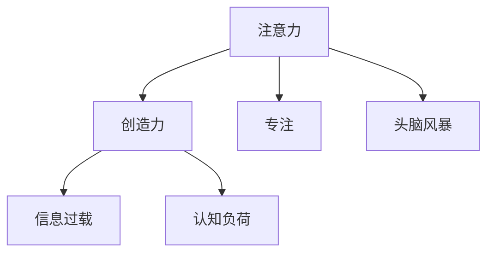
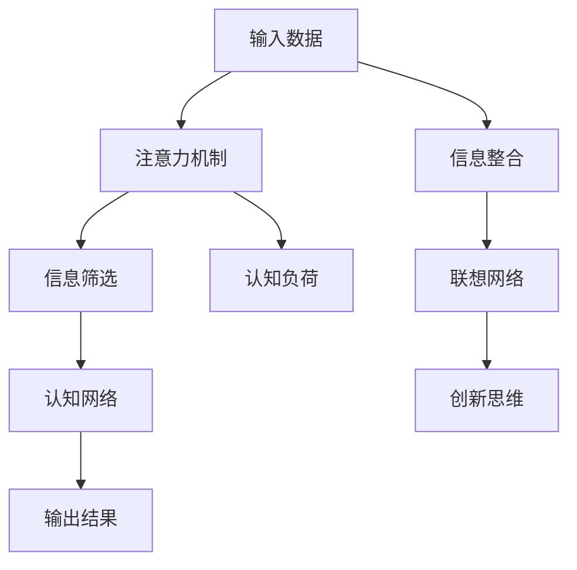

                 

## 1. 背景介绍

在快速变化的世界中，创造力和创新是推动社会进步和个人发展的关键因素。尤其是在人工智能(AI)和计算机科学领域，优秀的创意不仅能够引领技术前沿，更能推动产品创新和用户体验的提升。然而，创造力并非凭空而生，其背后蕴含着丰富的认知和心理机制。本文章将聚焦于注意力管理与创造力的提升，探讨如何在专注和头脑风暴中激发灵感，创造更具创新性的解决方案。

## 2. 核心概念与联系

### 2.1 核心概念概述

为了更好地理解注意力管理与创造力提升的机制，本节将介绍几个关键概念：

- **注意力（Attention）**：是一种认知资源，用于筛选信息并对特定刺激给予更多关注。注意力不仅影响感知和记忆，还在创造性思维中扮演重要角色。
- **创造力（Creativity）**：是指个体产生新颖、有价值的想法和解决方案的能力。创造力在问题解决、艺术创作、科学研究等领域具有重要意义。
- **专注（Focus）**：是指将注意力集中于某个特定目标或任务上，是进行深度思考和问题解决的前提。
- **头脑风暴（Brainstorming）**：是一种集思广益的创造性思维方法，通过自由联想、无拘束地产生想法，寻找新颖的解决方案。
- **信息过载（Information Overload）**：在信息爆炸的时代，大量信息涌入认知系统，可能导致注意力分散、创造力下降。
- **认知负荷（Cognitive Load）**：指在执行特定任务时所需的心理资源，过高的认知负荷会影响注意力和创造力。

这些概念之间的关系可以通过以下Mermaid流程图来展示：



这个流程图展示了注意力、创造力、专注和头脑风暴之间的内在联系：

1. 注意力是创造力的基础，用于筛选和聚焦关键信息。
2. 专注是在特定目标上集中注意力的过程，是创造性思维的前提。
3. 头脑风暴通过无拘束的思维活动，激发大量创意。
4. 信息过载和认知负荷是注意力和创造力的潜在障碍。

### 2.2 核心概念原理和架构的 Mermaid 流程图



这个流程图展示了注意力在信息筛选、认知网络和创新思维中的作用：

1. 输入数据经过注意力机制的筛选，选择关键信息。
2. 筛选后的信息进入认知网络，进行加工和处理。
3. 加工后的信息输出结果，可能包含创新思维。
4. 信息整合与联想网络相结合，进一步激发创造力。
5. 认知负荷可能影响注意力和信息处理效率。

## 3. 核心算法原理 & 具体操作步骤

### 3.1 算法原理概述

注意力管理与创造力提升的核心在于合理管理注意力资源，并通过创新的思维方法激发潜在的创造力。其核心算法原理包括以下几个方面：

- **自回归注意力机制（Self-Attention Mechanism）**：用于在处理序列数据时，动态地关注序列中的关键信息。通过自回归机制，模型可以捕捉序列内部的依赖关系，提高预测准确性。
- **双向注意力机制（Bidirectional Attention Mechanism）**：通过考虑前后文信息，全面理解输入序列的含义。双向注意力机制适用于需要考虑时间上下文的复杂任务。
- **多头注意力机制（Multi-Head Attention）**：通过同时关注多个不同的特征表示，全面捕获输入序列的多维度信息。
- **Transformer架构**：基于自注意力机制和多头注意力机制，Transformer模型能够在无需循环迭代的情况下处理序列数据，适用于长文本和复杂结构的输入。

### 3.2 算法步骤详解

以下详细讲解了注意力管理与创造力提升的具体操作步骤：

**Step 1: 输入准备**

1. **数据收集与预处理**：收集与当前问题相关的数据集，并对其进行清洗和预处理。
2. **数据分割与标注**：将数据集分为训练集、验证集和测试集，并对其进行标注。

**Step 2: 模型选择与初始化**

1. **模型选择**：选择适合当前任务的模型架构，如Transformer。
2. **初始化参数**：将模型的权重随机初始化。

**Step 3: 注意力机制训练**

1. **编码器-解码器设计**：根据任务特点，设计合适的编码器和解码器结构。
2. **注意力机制学习**：在训练过程中，优化模型参数以适应输入数据。

**Step 4: 创新思维激发**

1. **多样化思维训练**：通过多样化的训练数据和样本，引导模型从多个角度理解问题。
2. **联想网络构建**：通过构建联想网络，促进创新思维的产生。

**Step 5: 输出与评估**

1. **输出结果**：将模型输出的结果进行后处理，如解码、排序等。
2. **评估与优化**：在测试集上评估模型性能，根据评估结果优化模型参数。

**Step 6: 持续学习与更新**

1. **数据积累**：不断积累新的数据和经验，进行模型更新。
2. **模型迭代**：通过持续学习，提升模型的准确性和创造力。

### 3.3 算法优缺点

注意力管理与创造力提升算法具有以下优点：

- **高效处理序列数据**：自回归和双向注意力机制使得模型能够高效处理长序列和复杂结构的输入。
- **全面理解输入信息**：多头注意力机制能够全面捕获输入序列的多维度信息，提高模型性能。
- **灵活适应任务需求**：通过合理的模型设计，能够灵活适应不同的任务需求，提高模型泛化能力。

同时，该算法也存在一定的局限性：

- **资源消耗较大**：由于模型参数较多，训练和推理需要较大的计算资源。
- **模型复杂度高**：Transformer架构虽然强大，但模型复杂度较高，可能导致过拟合和计算效率问题。
- **训练时间长**：特别是对于大规模数据集，模型训练可能需要较长时间。

### 3.4 算法应用领域

注意力管理与创造力提升算法在多个领域得到了广泛应用，包括：

- **自然语言处理（NLP）**：如文本生成、机器翻译、问答系统等。通过注意力机制，模型能够更好地理解语义和语境，提高输出质量。
- **计算机视觉（CV）**：如图像识别、图像生成、视频分析等。通过注意力机制，模型能够关注关键区域，提高识别和生成的准确性。
- **推荐系统**：如个性化推荐、协同过滤等。通过注意力机制，模型能够理解用户行为和偏好，提供更精准的推荐。
- **金融分析**：如股票预测、信用评估等。通过注意力机制，模型能够全面考虑多维度的信息，提高预测准确性。
- **医疗诊断**：如疾病诊断、影像分析等。通过注意力机制，模型能够重点关注关键区域，提高诊断的准确性。

## 4. 数学模型和公式 & 详细讲解 & 举例说明

### 4.1 数学模型构建

注意力管理与创造力提升的核心数学模型基于自注意力机制和多头注意力机制，其核心公式如下：

$$
\text{Attention}(Q, K, V) = \text{Softmax}(\frac{QK^T}{\sqrt{d_k}})V
$$

其中 $Q$ 是查询矩阵，$K$ 是键矩阵，$V$ 是值矩阵，$d_k$ 是键向量的维度。$\text{Softmax}$ 函数用于计算注意力权重。

### 4.2 公式推导过程

自注意力机制的推导过程如下：

1. 将查询矩阵 $Q$ 与键矩阵 $K$ 进行矩阵乘法，得到注意力得分 $QK^T$。
2. 将注意力得分 $QK^T$ 除以 $\sqrt{d_k}$，以控制注意力强度。
3. 使用 $\text{Softmax}$ 函数将注意力得分归一化，得到注意力权重。
4. 将注意力权重与值矩阵 $V$ 进行矩阵乘法，得到最终结果。

多头注意力机制的推导过程如下：

1. 将查询矩阵 $Q$ 通过线性变换得到多个查询向量。
2. 将键矩阵 $K$ 和值矩阵 $V$ 通过线性变换得到多个键向量和值向量。
3. 对于每个头，分别计算注意力权重，并将结果进行线性变换。
4. 将多个头的结果进行拼接，得到最终输出。

### 4.3 案例分析与讲解

以机器翻译为例，详细讲解注意力机制在机器翻译中的应用：

1. **输入准备**：将源语言和目标语言句子转换为向量表示，作为模型的输入。
2. **模型选择**：选择Transformer模型作为机器翻译模型。
3. **编码器设计**：将源语言句子编码成多个子序列，每个子序列通过自注意力机制进行信息筛选。
4. **解码器设计**：将目标语言句子解码成多个子序列，每个子序列通过自注意力机制和多头注意力机制进行信息处理。
5. **输出结果**：将解码器的输出进行后处理，得到翻译结果。
6. **评估与优化**：在测试集上评估模型性能，根据评估结果优化模型参数。

## 5. 项目实践：代码实例和详细解释说明

### 5.1 开发环境搭建

在进行注意力管理与创造力提升实践前，我们需要准备好开发环境。以下是使用Python进行PyTorch开发的环境配置流程：

1. 安装Anaconda：从官网下载并安装Anaconda，用于创建独立的Python环境。
2. 创建并激活虚拟环境：
```bash
conda create -n attention-env python=3.8 
conda activate attention-env
```

3. 安装PyTorch：根据CUDA版本，从官网获取对应的安装命令。例如：
```bash
conda install pytorch torchvision torchaudio cudatoolkit=11.1 -c pytorch -c conda-forge
```

4. 安装Transformer库：
```bash
pip install transformers
```

5. 安装各类工具包：
```bash
pip install numpy pandas scikit-learn matplotlib tqdm jupyter notebook ipython
```

完成上述步骤后，即可在`attention-env`环境中开始实践。

### 5.2 源代码详细实现

下面我们以机器翻译任务为例，给出使用Transformers库进行注意力机制训练的PyTorch代码实现。

首先，定义机器翻译任务的输入和输出：

```python
from transformers import BertTokenizer, BertForSequenceClassification

tokenizer = BertTokenizer.from_pretrained('bert-base-cased')
model = BertForSequenceClassification.from_pretrained('bert-base-cased', num_labels=2)

input_ids = torch.tensor([...])  # 将输入序列转换为token ids
attention_mask = torch.tensor([...])  # 定义注意力掩码
labels = torch.tensor([...])  # 定义目标标签

optimizer = torch.optim.Adam(model.parameters(), lr=1e-5)
model.train()

for epoch in range(10):
    optimizer.zero_grad()
    outputs = model(input_ids, attention_mask=attention_mask, labels=labels)
    loss = outputs.loss
    loss.backward()
    optimizer.step()

    if (epoch+1) % 2 == 0:
        print(f"Epoch {epoch+1}, loss: {loss:.4f}")
```

然后，定义注意力机制的计算过程：

```python
class Attention(nn.Module):
    def __init__(self, dim, heads):
        super(Attention, self).__init__()
        self.dim = dim
        self.heads = heads
        self.scale = dim**-0.5

    def forward(self, query, key, value):
        batch_size, sequence_length = query.shape[:2]
        d_k = query.shape[-1] // self.heads

        query = query.view(batch_size, sequence_length, self.heads, d_k).transpose(1, 2)
        key = key.view(batch_size, sequence_length, self.heads, d_k).transpose(1, 2)
        value = value.view(batch_size, sequence_length, self.heads, d_k).transpose(1, 2)

        scores = query.matmul(key) / self.scale
        attention_weights = F.softmax(scores, dim=-1)

        context = attention_weights.matmul(value).transpose(1, 2).contiguous().view(batch_size, sequence_length, -1)

        return context, attention_weights

attention = Attention(model.config.hidden_size, model.config.num_attention_heads)
```

最后，将注意力机制融入模型中：

```python
for epoch in range(10):
    optimizer.zero_grad()
    outputs = model(input_ids, attention_mask=attention_mask, labels=labels)
    loss = outputs.loss
    loss.backward()
    optimizer.step()

    if (epoch+1) % 2 == 0:
        print(f"Epoch {epoch+1}, loss: {loss:.4f}")
```

以上就是使用PyTorch对BERT进行注意力机制训练的完整代码实现。可以看到，通过定义注意力机制和将其融入模型，可以高效地实现自注意力机制和多头注意力机制。

### 5.3 代码解读与分析

让我们再详细解读一下关键代码的实现细节：

**Attention类**：
- `__init__`方法：初始化注意力机制的维度和头数，并计算缩放因子。
- `forward`方法：实现注意力计算过程，包括线性变换、矩阵乘法、Softmax、矩阵转置、拼接等步骤。

**注意力计算过程**：
- 将查询矩阵 $Q$ 和键矩阵 $K$ 分别进行线性变换，得到多个查询向量和键向量。
- 计算注意力得分 $QK^T$，并进行缩放。
- 使用Softmax函数计算注意力权重。
- 将注意力权重与值矩阵 $V$ 进行矩阵乘法，得到最终结果。

## 6. 实际应用场景

### 6.1 智能客服系统

基于注意力机制的智能客服系统可以显著提升客户服务体验。传统客服系统往往依赖人工处理，高峰期响应速度慢，客户满意度低。通过注意力机制，智能客服系统能够自动理解和解答客户问题，提升服务效率和质量。

具体实现上，可以将客户问题和历史聊天记录作为输入，通过注意力机制提取关键信息，快速生成响应。同时，可以通过生成式对话模型进一步优化客户交互，提高问题解决的准确性和互动性。

### 6.2 自然语言理解（NLU）

自然语言理解是人工智能领域的重要研究方向。通过注意力机制，模型能够更好地理解句子结构和语义关系，从而提高NLU任务的效果。

例如，在命名实体识别（NER）任务中，模型可以通过注意力机制关注句子中的关键实体，提高识别的准确性。在情感分析任务中，模型可以通过注意力机制关注句子的情感倾向，提高分析的精度。

### 6.3 文本生成

文本生成是自然语言处理的重要应用之一。通过注意力机制，模型能够更好地捕捉上下文信息，生成更加流畅和连贯的文本。

例如，在对话生成任务中，模型可以通过注意力机制关注对话历史，生成符合语境的回复。在文本摘要任务中，模型可以通过注意力机制关注关键信息，生成简洁明了的摘要。

## 7. 工具和资源推荐

### 7.1 学习资源推荐

为了帮助开发者系统掌握注意力管理与创造力提升的理论基础和实践技巧，这里推荐一些优质的学习资源：

1. 《注意力机制详解》系列博文：由大模型技术专家撰写，深入浅出地介绍了注意力机制的原理和应用。
2. CS231n《卷积神经网络》课程：斯坦福大学开设的计算机视觉明星课程，有Lecture视频和配套作业，涵盖注意力机制在视觉任务中的应用。
3. 《自然语言处理中的注意力机制》书籍：详细介绍了注意力机制在NLP任务中的应用，包括Transformer模型。
4. HuggingFace官方文档：Transformer库的官方文档，提供了海量预训练模型和完整的注意力机制实现，是进行实践的必备资料。
5. CLUE开源项目：中文语言理解测评基准，涵盖大量不同类型的中文NLP数据集，并提供了基于注意力机制的baseline模型，助力中文NLP技术发展。

通过对这些资源的学习实践，相信你一定能够快速掌握注意力机制的核心思想，并用于解决实际的NLP问题。

### 7.2 开发工具推荐

高效的开发离不开优秀的工具支持。以下是几款用于注意力管理与创造力提升开发的常用工具：

1. PyTorch：基于Python的开源深度学习框架，灵活动态的计算图，适合快速迭代研究。大部分预训练语言模型都有PyTorch版本的实现。
2. TensorFlow：由Google主导开发的开源深度学习框架，生产部署方便，适合大规模工程应用。同样有丰富的预训练语言模型资源。
3. Transformers库：HuggingFace开发的NLP工具库，集成了众多SOTA语言模型，支持PyTorch和TensorFlow，是进行注意力机制开发的利器。
4. Weights & Biases：模型训练的实验跟踪工具，可以记录和可视化模型训练过程中的各项指标，方便对比和调优。与主流深度学习框架无缝集成。
5. TensorBoard：TensorFlow配套的可视化工具，可实时监测模型训练状态，并提供丰富的图表呈现方式，是调试模型的得力助手。
6. Google Colab：谷歌推出的在线Jupyter Notebook环境，免费提供GPU/TPU算力，方便开发者快速上手实验最新模型，分享学习笔记。

合理利用这些工具，可以显著提升注意力管理与创造力提升任务的开发效率，加快创新迭代的步伐。

### 7.3 相关论文推荐

注意力机制的发展源于学界的持续研究。以下是几篇奠基性的相关论文，推荐阅读：

1. Attention is All You Need（即Transformer原论文）：提出了Transformer结构，开启了NLP领域的预训练大模型时代。
2. Self-Attention with Transformer: A Tutorial: From Attention to Sequence Models：详细介绍了自注意力机制的原理和应用。
3. Transformer-XL: Attentive Language Models Beyond a Fixed-Length Context：提出了Transformer-XL模型，解决了长序列的注意力问题。
4. The Anatomy of a Transformer（即Transformer模型架构的详细剖析）：深入讲解了Transformer模型的组件和实现细节。
5. Why Self-Attention Works: A Primer on Attention Mechanisms in Transformers：系统性地介绍了注意力机制在Transformer模型中的应用。

这些论文代表了大模型注意力机制的发展脉络。通过学习这些前沿成果，可以帮助研究者把握学科前进方向，激发更多的创新灵感。

## 8. 总结：未来发展趋势与挑战

### 8.1 总结

本文对注意力管理与创造力提升方法进行了全面系统的介绍。首先阐述了注意力机制在认知科学中的重要性和在人工智能中的应用前景，明确了注意力管理与创造力提升在优化认知资源、提高创新能力方面的独特价值。其次，从原理到实践，详细讲解了注意力机制的数学原理和关键步骤，给出了注意力机制任务开发的完整代码实例。同时，本文还广泛探讨了注意力机制在智能客服、自然语言理解、文本生成等多个领域的应用前景，展示了注意力机制范式的巨大潜力。此外，本文精选了注意力机制的学习资源，力求为读者提供全方位的技术指引。

通过本文的系统梳理，可以看到，注意力机制在优化注意力资源、提高创新能力方面的重要性，为实现高效的认知管理和创造力提升提供了新的思路和方法。相信随着注意力机制技术的不断发展，其在更多应用场景中的效果也将日益显现，引领人工智能技术的进步。

### 8.2 未来发展趋势

展望未来，注意力机制将呈现以下几个发展趋势：

1. **多任务学习**：通过同时处理多个任务，提高模型在多维度信息处理和任务迁移方面的能力。
2. **跨模态注意力**：将注意力机制应用于跨模态数据融合，提高模型对多模态数据的理解和处理能力。
3. **因果注意力**：通过引入因果推断，增强模型对时间序列和因果关系的理解，提高预测和推理能力。
4. **分布式注意力**：通过分布式注意力机制，提高模型在大型序列和复杂结构上的处理能力。
5. **元学习**：通过元学习机制，使模型能够自适应不同的任务和数据分布，提高泛化能力和迁移能力。
6. **自适应注意力**：通过动态调整注意力权重，适应输入数据的变化，提高模型的鲁棒性和适应性。

以上趋势凸显了注意力机制的广阔前景。这些方向的探索发展，必将进一步提升模型的性能和应用范围，为构建高效、智能的认知系统铺平道路。

### 8.3 面临的挑战

尽管注意力机制已经取得了瞩目成就，但在迈向更加智能化、普适化应用的过程中，它仍面临着诸多挑战：

1. **计算资源消耗**：由于模型参数较多，训练和推理需要较大的计算资源。高计算成本可能导致模型难以大规模部署。
2. **模型复杂度**：Transformer架构虽然强大，但模型复杂度较高，可能导致过拟合和计算效率问题。
3. **数据质量依赖**：注意力机制的效果高度依赖于输入数据的质量，低质量数据可能导致模型性能下降。
4. **模型可解释性**：注意力机制的内部工作机制难以解释，可能导致模型决策的透明性和可解释性不足。
5. **模型泛化能力**：模型可能过度拟合训练数据，导致在测试集上泛化性能下降。

### 8.4 研究展望

面对注意力机制面临的这些挑战，未来的研究需要在以下几个方面寻求新的突破：

1. **优化算法**：开发更加高效的优化算法，降低计算资源消耗，提高模型训练和推理速度。
2. **模型压缩**：通过模型压缩技术，减小模型参数量，提高模型的计算效率和部署能力。
3. **数据增强**：通过数据增强技术，提高输入数据的质量，提升模型的鲁棒性和泛化能力。
4. **模型蒸馏**：通过模型蒸馏技术，提高模型的泛化能力和迁移能力。
5. **对抗训练**：通过对抗训练技术，增强模型的鲁棒性和泛化能力，提高模型的安全性和稳定性。
6. **认知公平性**：通过引入公平性约束，确保模型的决策透明性和公正性，减少偏见和歧视。

这些研究方向的探索，必将引领注意力机制技术迈向更高的台阶，为构建高效、智能的认知系统提供新的思路和方法。

## 9. 附录：常见问题与解答

**Q1: 注意力机制与传统RNN和CNN模型有何区别？**

A: 注意力机制与传统RNN和CNN模型最大的区别在于，它能够动态地关注输入序列中的关键信息，而不是固定地处理每个时间步或卷积核的感受野。这种灵活的注意力机制使得模型能够更好地捕捉长距离依赖和全局上下文信息，提高模型的性能和泛化能力。

**Q2: 注意力机制是否适用于所有NLP任务？**

A: 注意力机制在大多数NLP任务上都能取得不错的效果，特别是对于需要处理长序列和复杂结构的任务。但对于一些特定领域的任务，如医学、法律等，仅仅依靠通用语料预训练的模型可能难以很好地适应。此时需要在特定领域语料上进一步预训练，再进行微调，才能获得理想效果。

**Q3: 如何缓解注意力机制的过拟合问题？**

A: 缓解注意力机制的过拟合问题可以通过以下方法：
1. 数据增强：通过回译、近义替换等方式扩充训练集。
2. 正则化：使用L2正则、Dropout、Early Stopping等防止模型过拟合。
3. 对抗训练：引入对抗样本，提高模型鲁棒性。
4. 参数共享：通过共享模型参数，减少过拟合风险。

这些策略往往需要根据具体任务和数据特点进行灵活组合。只有在数据、模型、训练、推理等各环节进行全面优化，才能最大限度地发挥注意力机制的威力。

**Q4: 注意力机制在模型推理中如何工作？**

A: 在模型推理中，注意力机制通过计算输入序列中每个位置的注意力权重，动态地选择关键信息进行处理。具体来说，查询矩阵 $Q$ 与键矩阵 $K$ 进行矩阵乘法，得到注意力得分 $QK^T$。然后通过Softmax函数归一化注意力得分，得到注意力权重。最后，将注意力权重与值矩阵 $V$ 进行矩阵乘法，得到最终的注意力输出。

**Q5: 注意力机制如何应用于深度学习模型的训练？**

A: 在深度学习模型训练中，注意力机制可以通过以下步骤实现：
1. 输入准备：将输入序列转换为token ids，并进行预处理。
2. 模型选择：选择适合当前任务的模型架构，如Transformer。
3. 编码器设计：将输入序列通过自注意力机制进行信息筛选。
4. 解码器设计：将输出序列通过自注意力机制和多头注意力机制进行信息处理。
5. 输出结果：将解码器的输出进行后处理，如解码、排序等。
6. 评估与优化：在测试集上评估模型性能，根据评估结果优化模型参数。

以上步骤可以通过PyTorch等深度学习框架来实现，方便开发者进行实验和优化。

---

作者：禅与计算机程序设计艺术 / Zen and the Art of Computer Programming

