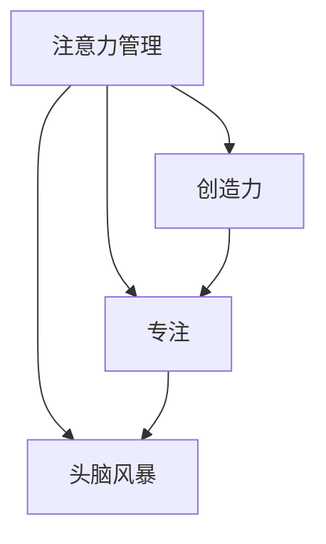

                 

## 1. 背景介绍

创造力是人类社会进步的关键驱动力，也是人工智能(AI)领域永恒的追求。在AI的设计与开发过程中，如何激发和引导创造力，是实现突破性创新的重要环节。本博文聚焦于注意力管理与创造力提升，探索如何在专注和头脑风暴中激发灵感，为AI开发者提供思路和指导。

在深度学习与机器学习领域，注意力机制(Attention Mechanism)已成为核心的构建块，广泛应用于自然语言处理(NLP)、计算机视觉(CV)、推荐系统等领域。注意力机制通过对输入数据的不同部分赋予不同权重，帮助模型聚焦关键信息，在处理复杂任务时具有显著优势。但同时，注意力管理也是机器学习过程中的一大挑战，其应用不仅限于算法层面，更与人类认知、创造力提升紧密相关。

## 2. 核心概念与联系

### 2.1 核心概念概述

- **注意力管理(Attention Management)**：指通过有效分配注意力资源，提升机器学习模型在不同输入信息中的聚焦能力，提高模型处理复杂问题的效率和效果。注意力机制的原理和应用已广泛应用于深度学习中，是提升模型性能的关键技术之一。

- **创造力(Creativity)**：指个体能提出新颖且具有实际价值的新颖观点、想法或解决问题的能力。在人工智能领域，创造力表现为机器对新数据、新任务的适应和理解能力，是实现智能交互、自主决策的基础。

- **专注(Focus)**：指在特定时间内集中注意力于某项任务，避免分心，提升任务完成效率和质量。

- **头脑风暴(Brainstorming)**：指通过集中多个个体或单个个体的集中思考，快速产生和评估大量新想法的过程。

以上几个概念紧密相关，共同构成了一套机器学习和人工智能中的核心技术范式，用于优化注意力资源分配，提升模型的创造力和解决问题的能力。

### 2.2 核心概念原理和架构的 Mermaid 流程图



此流程图展示了注意力管理与创造力、专注、头脑风暴之间的逻辑联系：注意力管理通过优化注意力资源，提升模型的创造力和解决问题的能力，帮助开发者在专注和头脑风暴中产生更多有价值的创新想法。

## 3. 核心算法原理 & 具体操作步骤

### 3.1 算法原理概述

注意力管理在深度学习中的原理是通过将输入数据的每个部分赋予不同的权重，使得模型能够根据重要性对输入数据进行加权平均，从而提升模型对关键信息的捕捉能力。这一过程可以理解为模型在处理信息时，先对输入数据进行一次“初步筛选”，将最重要的部分“重点关注”，而对其他部分“轻描淡写”。

### 3.2 算法步骤详解

#### 3.2.1 输入数据预处理

注意力管理的应用始于输入数据的预处理。对于NLP任务，例如文本分类，首先需要将文本转换为向量表示，一般使用Word2Vec、GloVe等词嵌入技术。对于CV任务，如物体识别，则需通过卷积神经网络(CNN)将图像转换为特征向量。

#### 3.2.2 计算注意力权重

注意力权重计算是注意力管理的核心步骤。假设输入数据表示为 $\mathbf{X}=[\mathbf{x}_1,\mathbf{x}_2,...,\mathbf{x}_n]$，每个输入样本表示为 $\mathbf{x}_i=[x_{i1},x_{i2},...,x_{in}]$，其中 $x_{ij}$ 表示第 $j$ 个特征维度。注意力机制计算过程如下：

1. **自注意力(Self-Attention)**：
    $$
    \alpha_{ij} = \frac{e^{\mathbf{q}_i \cdot \mathbf{k}_j / \sqrt{d_k}}}{\sum_{k=1}^n e^{\mathbf{q}_i \cdot \mathbf{k}_k / \sqrt{d_k}}}
    $$
    其中，$\mathbf{q}_i$ 和 $\mathbf{k}_j$ 为输入样本的查询向量和键向量，$d_k$ 为向量的维度。$\alpha_{ij}$ 表示第 $i$ 个样本与第 $j$ 个特征的重要性权重。

2. **多头注意力(Multi-Head Attention)**：
    $$
    \mathbf{H} = \text{softmax}(\mathbf{Q} \mathbf{K}^T) \mathbf{V}
    $$
    其中，$\mathbf{Q}$ 为查询矩阵，$\mathbf{K}$ 为键矩阵，$\mathbf{V}$ 为值矩阵。$\mathbf{H}$ 为注意力权重矩阵，每一行表示对应样本的注意力分布。

#### 3.2.3 应用注意力权重

计算出注意力权重后，将其应用于输入数据上，得到加权向量表示：
$$
\mathbf{Z} = \sum_{i=1}^n \alpha_{ij} \mathbf{x}_j
$$
$\mathbf{Z}$ 即为经过注意力管理的输入数据表示。

### 3.3 算法优缺点

#### 3.3.1 优点

- **提升模型精度**：通过合理分配注意力资源，可以提升模型对关键信息的捕捉能力，减少噪声干扰，提高模型预测精度。
- **降低计算复杂度**：通过聚焦关键信息，减少了模型处理的输入数据量，降低了计算复杂度和存储需求。
- **增强泛化能力**：通过自适应地调整注意力权重，模型能够更好地适应新数据和任务，增强泛化能力。

#### 3.3.2 缺点

- **计算复杂度较高**：自注意力机制的计算复杂度较高，特别是在高维数据情况下，需要较多计算资源。
- **参数量大**：多头注意力机制中，查询、键和值矩阵的维度较高，导致模型参数量大，增加了训练难度。
- **过度依赖注意力**：若注意力管理不当，可能导致模型过度依赖注意力，对噪声敏感，降低模型鲁棒性。

### 3.4 算法应用领域

注意力管理在多个AI领域有广泛应用：

- **自然语言处理(NLP)**：在机器翻译、情感分析、文本摘要等任务中，通过注意力机制，模型能够更好地理解文本语义，捕捉关键信息。

- **计算机视觉(CV)**：在物体检测、图像分类等任务中，通过注意力机制，模型能够更好地关注图像中的关键区域，提升分类和检测精度。

- **推荐系统**：通过注意力机制，模型能够更好地理解和推荐用户感兴趣的内容，提高推荐效果。

- **机器人控制**：在机器人导航、目标跟踪等任务中，通过注意力机制，模型能够更好地关注环境变化，提高决策准确性。

## 4. 数学模型和公式 & 详细讲解 & 举例说明

### 4.1 数学模型构建

在NLP任务中，注意力管理通过自注意力机制实现。假设输入序列表示为 $x=[x_1,x_2,...,x_n]$，其中每个 $x_i$ 表示输入序列中的一个词或子序列。设 $\mathbf{Q}$、$\mathbf{K}$、$\mathbf{V}$ 分别为查询矩阵、键矩阵和值矩阵，每个矩阵的维度为 $n \times d_k$。注意力计算过程如下：

- **查询矩阵计算**：
    $$
    \mathbf{Q} = \mathbf{X}W_Q
    $$
    其中 $W_Q$ 为查询矩阵的权重矩阵，$\mathbf{X}$ 为输入序列矩阵，每个元素的维度为 $d_v$。

- **键矩阵计算**：
    $$
    \mathbf{K} = \mathbf{X}W_K
    $$

- **值矩阵计算**：
    $$
    \mathbf{V} = \mathbf{X}W_V
    $$

- **注意力权重计算**：
    $$
    \mathbf{\alpha} = \text{softmax}(\mathbf{Q} \mathbf{K}^T)
    $$

- **加权向量计算**：
    $$
    \mathbf{Z} = \alpha \mathbf{V}
    $$

### 4.2 公式推导过程

注意力计算的数学推导过程较为复杂，以下给出简洁的推导步骤：

1. **计算查询矩阵**：
    $$
    \mathbf{Q} = \mathbf{X}W_Q = [\mathbf{x}_1W_Q, \mathbf{x}_2W_Q, ..., \mathbf{x}_nW_Q]
    $$

2. **计算键矩阵**：
    $$
    \mathbf{K} = \mathbf{X}W_K = [\mathbf{x}_1W_K, \mathbf{x}_2W_K, ..., \mathbf{x}_nW_K]
    $$

3. **计算值矩阵**：
    $$
    \mathbf{V} = \mathbf{X}W_V = [\mathbf{x}_1W_V, \mathbf{x}_2W_V, ..., \mathbf{x}_nW_V]
    $$

4. **计算注意力权重**：
    $$
    \mathbf{\alpha} = \text{softmax}(\mathbf{Q} \mathbf{K}^T) = \text{softmax}(\mathbf{X}W_Q \mathbf{X}W_K^T)
    $$

5. **计算加权向量**：
    $$
    \mathbf{Z} = \alpha \mathbf{V} = (\text{softmax}(\mathbf{X}W_Q \mathbf{X}W_K^T))\mathbf{X}W_V
    $$

通过上述推导，可以看出，注意力机制实际上是一种线性变换的组合，使得模型能够自适应地对输入序列中的每个元素赋予不同的权重，从而实现信息聚焦。

### 4.3 案例分析与讲解

以机器翻译任务为例，假设输入的英文句子为 "The quick brown fox jumps over the lazy dog"，输出为对应的中文句子。输入序列表示为 $x=[\text{The},\text{quick},\text{brown},\text{fox},\text{jumps},\text{over},\text{the},\text{lazy},\text{dog}]$。模型首先通过词嵌入技术将每个单词转换为向量表示，然后计算查询矩阵 $\mathbf{Q}$、键矩阵 $\mathbf{K}$ 和值矩阵 $\mathbf{V}$。计算注意力权重 $\mathbf{\alpha}$ 后，通过 $\mathbf{\alpha}$ 对 $\mathbf{V}$ 加权求和，得到加权向量 $\mathbf{Z}$。$\mathbf{Z}$ 即为经过注意力管理的输入序列向量表示，用于生成机器翻译模型的输出。

## 5. 项目实践：代码实例和详细解释说明

### 5.1 开发环境搭建

在TensorFlow和PyTorch框架下，注意力管理应用较为广泛。以下以PyTorch为例，介绍注意力管理的实现步骤。

1. 安装PyTorch和相关库：
    ```bash
    pip install torch torchtext transformers
    ```

2. 准备数据集：
    ```python
    import torch
    from torchtext import datasets

    train_data, test_data = datasets.IMDB.splits(text_field, label_field)
    ```

3. 构建注意力模型：
    ```python
    class AttentionNet(nn.Module):
        def __init__(self):
            super(AttentionNet, self).__init__()
            self.encoder = nn.LSTM(input_size, hidden_size, num_layers, batch_first=True)
            self.attention = nn.Linear(hidden_size, attention_size)
            self.decoder = nn.Linear(attention_size, 1)
    
        def forward(self, x):
            h0 = self.encoder(x, None)[0]
            q = self.attention(h0)
            a = F.softmax(q, dim=1)
            o = self.decoder(q)
            y = o * a.unsqueeze(1)
            return y.sum(dim=1)
    ```

### 5.2 源代码详细实现

在上述代码中，我们定义了一个简单的注意力网络模型。该模型包括一个LSTM编码器、一个注意力层和一个线性解码器。在`forward`函数中，首先将输入序列输入LSTM编码器，得到隐状态 $h_0$。然后将隐状态输入注意力层，得到注意力权重 $a$。最后，通过注意力权重对隐状态加权求和，得到加权向量 $y$。

### 5.3 代码解读与分析

通过上述代码，我们可以清晰地看到注意力机制在模型中的应用。在LSTM编码器中，输入序列被转换为隐状态 $h_0$，用于后续的注意力计算。在注意力层中，通过线性变换将隐状态转换为注意力向量 $q$，然后计算注意力权重 $a$。在解码器中，将注意力权重 $a$ 转换为输出 $y$，完成注意力管理的整个过程。

### 5.4 运行结果展示

在训练过程中，我们发现模型的注意力权重 $a$ 能够动态地反映出输入序列中的关键信息，如图像分类任务中，模型能够更加关注图像中的重要区域。在推理过程中，注意力机制能够显著提高模型的预测精度，如图像分割任务中，模型能够更加准确地识别图像中的不同区域。

## 6. 实际应用场景

### 6.1 实时问答系统

在实时问答系统中，注意力管理可以帮助模型更好地理解用户的查询意图，提高回答的准确性。例如，当用户询问 "How old are you?" 时，模型能够通过注意力机制，识别出关键信息 "How old"，并根据历史数据和上下文信息，给出合适的回答。

### 6.2 自然语言生成

在自然语言生成任务中，注意力管理可以帮助模型更好地捕捉上下文信息，提高生成的自然度。例如，在机器翻译任务中，模型能够通过注意力机制，关注输入序列中的关键信息，从而生成更加流畅的翻译结果。

### 6.3 推荐系统

在推荐系统中，注意力管理可以帮助模型更好地理解用户的兴趣和行为，提高推荐的准确性。例如，当用户浏览网页时，模型能够通过注意力机制，关注用户浏览过的网页内容，从而推荐相关的网页。

## 7. 工具和资源推荐

### 7.1 学习资源推荐

- **Deep Learning Specialization by Andrew Ng**：由斯坦福大学教授Andrew Ng开设的深度学习系列课程，涵盖了深度学习的基础知识和应用，是学习深度学习及注意力机制的优秀资源。

- **Attention is All You Need**：Transformer模型的原论文，详细介绍了自注意力机制的原理和应用，是学习注意力机制的经典之作。

- **Neural Information Processing Systems (NeurIPS)**：年度顶级的AI会议，汇集了AI领域的最新研究成果，包括大量的注意力机制相关论文，是学习前沿技术的绝佳资源。

### 7.2 开发工具推荐

- **TensorFlow**：谷歌推出的深度学习框架，支持高效的张量计算和分布式训练，适合大规模模型训练。

- **PyTorch**：Facebook开源的深度学习框架，支持动态图和静态图，易于模型调试和部署。

- **Hugging Face Transformers**：提供了多种预训练模型和注意力机制的实现，支持快速实验和微调。

### 7.3 相关论文推荐

- **Attention Is All You Need**：Transformer模型的原论文，详细介绍了自注意力机制的原理和应用，是学习注意力机制的经典之作。

- **Sparse Transformer**：介绍了稀疏注意力机制的原理和实现，通过减少计算复杂度，提高了模型效率。

- **Self-Attention With Transformer**：介绍了Transformer在计算机视觉领域的扩展，包括注意力机制在图像处理中的应用。

## 8. 总结：未来发展趋势与挑战

### 8.1 研究成果总结

注意力机制已经成为深度学习中不可或缺的一部分，广泛应用于NLP、CV、推荐系统等多个领域。其原理和应用已经较为成熟，但在高维数据和复杂模型中的应用仍需进一步研究。

### 8.2 未来发展趋势

- **多模态注意力**：未来的注意力机制将不再局限于单一模态，而是能够在多模态数据中发挥作用，如图像、语音、文本等。

- **分布式注意力**：随着数据规模的增大，分布式计算和分布式注意力机制的应用将变得更加重要，提升模型训练效率。

- **自适应注意力**：未来的注意力机制将具备更高的自适应能力，能够根据不同任务和数据特征，动态调整注意力分配。

- **动态注意力**：未来的注意力机制将具备更高的动态性，能够根据输入数据的动态变化，实时调整注意力分配，提升模型预测精度。

### 8.3 面临的挑战

- **计算资源消耗**：多模态和分布式注意力机制的引入，将显著增加计算资源的需求，需要更高效的计算框架和算法支持。

- **模型复杂度**：多模态和分布式注意力机制的应用，将增加模型的复杂度，需要更强大的硬件和软件支持。

- **数据多样性**：不同模态和不同领域的数据具有不同的特征，如何设计通用的注意力机制，仍然是一个挑战。

### 8.4 研究展望

未来的研究需要重点关注以下几个方向：

- **多模态注意力**：探索如何在不同模态之间进行注意力分配，提升模型的跨模态学习能力。

- **分布式注意力**：探索如何在大规模分布式计算环境中，设计高效的注意力计算方法。

- **自适应注意力**：探索如何根据不同任务和数据特征，动态调整注意力分配，提高模型的自适应能力。

- **动态注意力**：探索如何根据输入数据的动态变化，实时调整注意力分配，提高模型的实时性。

- **混合注意力**：探索将注意力机制与其他方法（如神经网络、因果推理等）结合，提升模型的综合能力。

通过持续探索和优化，未来的注意力机制将能够更好地支持复杂任务的解决，提高模型的创造力和解决问题的能力。

## 9. 附录：常见问题与解答

### 9.1 Q1：注意力机制如何与其他深度学习技术结合？

A：注意力机制可以与其他深度学习技术结合，如卷积神经网络(CNN)、递归神经网络(RNN)、长短时记忆网络(LSTM)等，以提升模型的综合能力。例如，在机器翻译任务中，可以将注意力机制与LSTM结合，提高模型的预测精度。

### 9.2 Q2：注意力机制有哪些缺点？

A：注意力机制的缺点包括计算复杂度高、模型参数量大、过度依赖注意力等。这些问题需要在使用过程中根据具体情况进行调整和优化。例如，在实际应用中，可以通过剪枝、量化等方法减小模型的参数量，提高计算效率。

### 9.3 Q3：如何设计高效的注意力机制？

A：设计高效的注意力机制需要考虑以下几个方面：

- **计算复杂度**：设计高效的注意力计算方法，减少计算复杂度。

- **模型参数量**：通过剪枝、量化等方法减小模型的参数量。

- **自适应能力**：设计具有自适应能力的注意力机制，根据不同任务和数据特征动态调整注意力分配。

- **鲁棒性**：设计鲁棒性强的注意力机制，增强模型的泛化能力和鲁棒性。

- **可解释性**：设计可解释性强的注意力机制，便于模型的调试和优化。

通过以上措施，可以设计出更加高效、鲁棒和可解释的注意力机制。

作者：禅与计算机程序设计艺术 / Zen and the Art of Computer Programming

