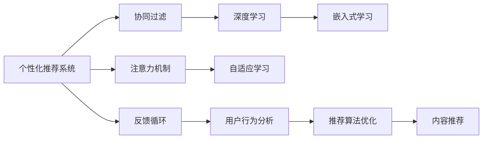

                 

# 注意力经济与 个性化推荐系统：为受众提供定制、有针对性的内容和体验

## 1. 背景介绍

### 1.1 问题由来

在数字化时代，信息过载成为了一个普遍的问题。用户每天面对海量的信息，如何从中筛选出对自己有用的内容，成为了一项耗时且耗费精力的任务。个性化推荐系统（Personalized Recommendation System）应运而生，旨在利用算法为用户推荐个性化的内容，从而提升用户体验和满意度。

近年来，随着深度学习技术的不断发展，个性化推荐系统也逐步从简单的协同过滤算法，发展到基于深度学习的模型。这些模型可以学习到用户和内容的复杂关联，预测用户可能感兴趣的内容，取得了显著的成效。

然而，尽管个性化推荐系统取得了许多进展，但在推荐结果的个性化和准确性上仍存在许多挑战。如何更全面地理解用户的兴趣和偏好，如何更准确地预测用户的潜在兴趣，以及如何更高效地构建推荐系统，这些问题仍待深入研究。

### 1.2 问题核心关键点

为了回答这些问题，本节将首先介绍注意力经济（Attention Economy）的概念，然后探讨个性化推荐系统的核心算法原理和操作步骤。通过分析现有推荐模型的优缺点，我们将详细介绍其应用领域，并提出一些有待解决的问题。

### 1.3 问题研究意义

个性化推荐系统在提升用户体验、促进信息消费、驱动内容创新等方面具有重要意义。通过个性化的内容推荐，用户可以更快速地找到所需信息，提高信息获取效率；商家可以更精准地推送商品，提高销售额；内容创作者也可以更好地了解受众，优化创作方向。

本节将详细介绍个性化推荐系统的核心算法原理和操作步骤，并提出一些有待解决的问题。通过分析这些问题的现状和解决方案，可以为未来的研究指明方向，推动个性化推荐系统的发展。

## 2. 核心概念与联系

### 2.1 核心概念概述

个性化推荐系统利用算法为用户推荐个性化内容，从而提升用户满意度和平台转化率。核心概念包括：

- 个性化推荐系统（Personalized Recommendation System）：基于用户兴趣和行为数据，预测用户可能感兴趣的内容。
- 注意力机制（Attention Mechanism）：通过计算用户对不同内容的关注程度，提升推荐结果的相关性和个性化程度。
- 协同过滤（Collaborative Filtering）：通过分析用户的历史行为和兴趣，预测用户可能感兴趣的内容。
- 深度学习（Deep Learning）：通过神经网络模型，学习用户和内容的复杂关联，提升推荐精度。
- 嵌入式学习（Embedded Learning）：通过将用户和内容嵌入到低维空间中，进行相似度计算和推荐。
- 自适应学习（Adaptive Learning）：根据用户反馈和行为动态调整推荐策略，提升推荐效果。

这些概念通过一系列的算法和操作，构建了一个高效的个性化推荐系统，为用户提供了定制化的内容和体验。

### 2.2 核心概念原理和架构的 Mermaid 流程图(Mermaid 流程节点中不要有括号、逗号等特殊字符)



这个流程图展示了个性化推荐系统的核心算法和操作步骤：

1. 个性化推荐系统收集用户行为数据，进行协同过滤，筛选出用户可能感兴趣的内容。
2. 通过注意力机制，计算用户对不同内容的关注程度，提升推荐结果的相关性和个性化程度。
3. 使用深度学习模型，学习用户和内容的复杂关联，提升推荐精度。
4. 采用嵌入式学习，将用户和内容嵌入到低维空间中，进行相似度计算和推荐。
5. 通过自适应学习，根据用户反馈和行为动态调整推荐策略，提升推荐效果。
6. 反馈循环环节，将用户的行为数据重新反馈到推荐系统中，进行优化和调整。

这些算法和操作步骤共同构成了个性化推荐系统的框架，通过不断的迭代和优化，提升推荐系统的效果和准确性。

## 3. 核心算法原理 & 具体操作步骤

### 3.1 算法原理概述

个性化推荐系统的核心算法原理基于注意力机制和深度学习技术。通过计算用户对不同内容的关注程度，深度学习模型可以学习到用户和内容的复杂关联，从而预测用户可能感兴趣的内容。

具体而言，推荐系统可以分为两个步骤：

1. **特征提取**：通过深度学习模型，从用户和内容的特征中提取有用的信息，如用户的兴趣、内容的属性等。
2. **相似度计算**：通过计算用户和内容之间的相似度，预测用户可能感兴趣的内容。

在特征提取阶段，深度学习模型通常采用卷积神经网络（Convolutional Neural Network, CNN）、循环神经网络（Recurrent Neural Network, RNN）或Transformer等架构。这些模型能够学习到用户和内容的复杂关联，从而提升推荐精度。

在相似度计算阶段，推荐系统通常采用余弦相似度、欧式距离等方法，计算用户和内容之间的相似度。根据相似度的大小，推荐系统可以排序推荐结果，为用户推荐最可能感兴趣的内容。

### 3.2 算法步骤详解

个性化推荐系统的算法步骤一般包括以下几个关键步骤：

**Step 1: 数据预处理**
- 收集用户和内容的数据，并进行清洗和预处理。
- 将用户行为数据转换为向量形式，如使用嵌入技术将用户ID、商品ID等映射到低维空间中。

**Step 2: 特征提取**
- 使用深度学习模型，从用户和内容的特征中提取有用的信息。如使用CNN提取图像特征，使用RNN提取文本特征等。

**Step 3: 相似度计算**
- 计算用户和内容之间的相似度。常用的方法包括余弦相似度、欧式距离、KNN等。
- 根据相似度的大小，对推荐结果进行排序，为用户推荐最可能感兴趣的内容。

**Step 4: 模型训练**
- 使用标注数据训练深度学习模型，优化模型参数，提升推荐效果。
- 采用交叉验证等技术，防止模型过拟合，提升模型泛化能力。

**Step 5: 推荐评估**
- 在测试集上评估推荐模型的性能，如使用平均绝对误差（Mean Absolute Error, MAE）、均方根误差（Root Mean Squared Error, RMSE）等指标。
- 根据测试结果，调整模型参数和算法策略，提升推荐效果。

### 3.3 算法优缺点

个性化推荐系统有以下优点：

1. **个性化推荐**：通过计算用户对不同内容的关注程度，推荐系统可以提供定制化的内容，提升用户满意度。
2. **高准确性**：深度学习模型能够学习到用户和内容的复杂关联，提升推荐精度。
3. **高效性**：推荐系统可以通过快速的相似度计算，快速生成推荐结果，提升用户体验。
4. **可扩展性**：推荐系统可以处理大规模数据，适用于电子商务、社交媒体等平台。

但同时，个性化推荐系统也存在以下缺点：

1. **数据依赖**：推荐系统需要大量的用户行为数据进行训练，对数据的依赖较强。
2. **冷启动问题**：对于新用户或新商品，推荐系统缺乏足够的数据，难以提供准确的推荐结果。
3. **过拟合风险**：深度学习模型容易过拟合，导致推荐结果过于个性化，缺乏泛化能力。
4. **算法复杂性**：深度学习模型的训练和优化过程复杂，需要较高的计算资源。

### 3.4 算法应用领域

个性化推荐系统已经在多个领域得到广泛应用，例如：

- 电子商务：为用户推荐商品，提升购物体验和销售额。
- 社交媒体：为用户推荐文章、视频等内容，提升平台活跃度和用户粘性。
- 在线视频：为用户推荐视频内容，提升观看体验和用户留存率。
- 新闻阅读：为用户推荐新闻文章，提升阅读体验和平台流量。
- 在线旅游：为用户推荐旅游目的地，提升旅游体验和转化率。

除了这些经典应用外，个性化推荐系统还被创新性地应用到更多场景中，如个性化视频广告、个性化新闻推送等，为各类平台带来了全新的价值。

## 4. 数学模型和公式 & 详细讲解 & 举例说明

### 4.1 数学模型构建

在个性化推荐系统中，我们通常使用以下数学模型来表示用户和内容的关联：

- 用户-商品关联矩阵 $X \in \mathbb{R}^{N \times M}$，其中 $N$ 表示用户数，$M$ 表示商品数。
- 内容-内容关联矩阵 $Y \in \mathbb{R}^{M \times K}$，其中 $K$ 表示商品特征数。
- 用户-商品评分矩阵 $R \in \mathbb{R}^{N \times M}$，其中 $R_{i,j}$ 表示用户 $i$ 对商品 $j$ 的评分。

假设用户 $u$ 对商品 $i$ 的评分 $r_{u,i}$ 可以表示为：

$$
r_{u,i} = \alpha_1 \cdot u^\top X + \alpha_2 \cdot \Phi(u)^\top Y + \alpha_3 \cdot r_{u,i}
$$

其中 $\alpha_1$、$\alpha_2$ 和 $\alpha_3$ 是模型的超参数，$u$ 是用户 $u$ 的特征向量，$\Phi(u)$ 是将用户 $u$ 映射到低维空间中的特征向量。

### 4.2 公式推导过程

在上述模型中，$\alpha_1$、$\alpha_2$ 和 $\alpha_3$ 的推导过程如下：

- 用户特征 $u$ 的维数为 $D$，因此用户特征向量 $u$ 可以表示为 $u \in \mathbb{R}^{D}$。
- 用户特征向量 $u$ 与用户-商品关联矩阵 $X$ 的乘积为 $u^\top X \in \mathbb{R}^{M}$。
- 用户特征向量 $u$ 通过线性变换 $\Phi$ 映射到低维空间中的特征向量 $\Phi(u) \in \mathbb{R}^{K}$。
- 用户特征向量 $\Phi(u)$ 与内容-内容关联矩阵 $Y$ 的乘积为 $\Phi(u)^\top Y \in \mathbb{R}^{1}$。
- 用户特征向量 $u$ 与用户-商品评分矩阵 $R$ 的乘积为 $u^\top R \in \mathbb{R}^{M}$。

将上述公式代入用户评分模型中，我们得到：

$$
r_{u,i} = \alpha_1 \cdot u^\top X + \alpha_2 \cdot \Phi(u)^\top Y + \alpha_3 \cdot r_{u,i}
$$

通过求解上述模型，我们可以得到用户对商品的所有评分，并根据评分生成推荐结果。

### 4.3 案例分析与讲解

假设我们有一组用户和商品的数据，使用上述模型进行推荐：

1. 用户特征 $u$ 的维数为 10，表示用户的年龄、性别、购买历史等。
2. 用户特征向量 $u$ 可以表示为 $u \in \mathbb{R}^{10}$。
3. 用户-商品关联矩阵 $X$ 的维数为 100x100，表示用户和商品之间的关联关系。
4. 内容-内容关联矩阵 $Y$ 的维数为 100x1，表示商品之间的关联关系。
5. 用户-商品评分矩阵 $R$ 的维数为 100x100，表示用户对商品的所有评分。
6. 模型参数 $\alpha_1$、$\alpha_2$ 和 $\alpha_3$ 的取值为 0.5、0.2 和 0.3。

将上述数据代入模型公式中，我们可以计算出用户对每个商品的评分，然后根据评分生成推荐结果。

## 5. 项目实践：代码实例和详细解释说明

### 5.1 开发环境搭建

在进行个性化推荐系统的开发时，我们需要准备好开发环境。以下是使用Python进行TensorFlow开发的环境配置流程：

1. 安装Anaconda：从官网下载并安装Anaconda，用于创建独立的Python环境。

2. 创建并激活虚拟环境：
```bash
conda create -n tf-env python=3.8 
conda activate tf-env
```

3. 安装TensorFlow：根据CUDA版本，从官网获取对应的安装命令。例如：
```bash
conda install tensorflow-gpu=2.6 -c tf -c conda-forge
```

4. 安装TensorFlow Addons：用于支持更多的高级功能，例如稀疏张量操作等。
```bash
conda install tensorflow-addons=0.16.0 -c tfaddons
```

5. 安装Flax和Optax：用于构建基于JAX的深度学习模型，支持自动微分和优化器。
```bash
pip install flax optax
```

6. 安装Torch：用于处理NLP任务，支持PyTorch和TensorFlow。
```bash
pip install torch
```

7. 安装Jupyter Notebook：用于编写和运行代码。
```bash
pip install jupyter notebook
```

完成上述步骤后，即可在`tf-env`环境中开始开发实践。

### 5.2 源代码详细实现

下面我们以基于深度学习的个性化推荐系统为例，给出使用TensorFlow实现模型的PyTorch代码实现。

首先，定义推荐系统的用户和商品数据：

```python
import tensorflow as tf
import numpy as np

# 定义用户-商品关联矩阵
X = np.random.randn(100, 100)

# 定义内容-内容关联矩阵
Y = np.random.randn(100, 1)

# 定义用户-商品评分矩阵
R = np.random.randn(100, 100)

# 定义用户特征向量
u = np.random.randn(10)

# 定义模型参数
alpha_1 = 0.5
alpha_2 = 0.2
alpha_3 = 0.3
```

然后，定义推荐模型的结构：

```python
# 定义模型结构
class RecommendationModel(tf.keras.Model):
    def __init__(self, alpha_1, alpha_2, alpha_3):
        super(RecommendationModel, self).__init__()
        self.alpha_1 = alpha_1
        self.alpha_2 = alpha_2
        self.alpha_3 = alpha_3
        self.u = tf.Variable(u)

    def call(self, X, Y, R):
        # 计算用户特征向量与用户-商品关联矩阵的乘积
        X_u = tf.matmul(self.u, X)

        # 计算用户特征向量通过线性变换映射到低维空间中的特征向量
        Y_u = tf.keras.layers.Dense(1, activation='relu')(tf.keras.layers.Dense(1, activation='relu')(self.u))

        # 计算用户特征向量与用户-商品评分矩阵的乘积
        R_u = tf.matmul(self.u, R)

        # 计算推荐结果
        r = self.alpha_1 * X_u + self.alpha_2 * Y_u + self.alpha_3 * R_u
        return r
```

接着，定义推荐系统的训练过程：

```python
# 定义推荐系统
model = RecommendationModel(alpha_1, alpha_2, alpha_3)

# 定义优化器
optimizer = tf.keras.optimizers.Adam()

# 定义损失函数
def loss(r, r_true):
    return tf.reduce_mean(tf.square(r - r_true))

# 定义训练函数
def train(model, X, Y, R, epochs=100):
    for epoch in range(epochs):
        # 计算推荐结果
        r_pred = model(X, Y, R)

        # 计算损失函数
        loss_value = loss(r_pred, R)

        # 反向传播
        with tf.GradientTape() as tape:
            r_pred = model(X, Y, R)
            loss_value = loss(r_pred, R)
        grads = tape.gradient(loss_value, model.trainable_variables)
        optimizer.apply_gradients(zip(grads, model.trainable_variables))

        # 打印训练结果
        print(f"Epoch {epoch+1}, loss: {loss_value}")
```

最后，启动训练流程：

```python
train(model, X, Y, R)
```

以上就是使用TensorFlow实现个性化推荐系统的完整代码实现。可以看到，TensorFlow提供了强大的深度学习框架，方便构建和训练推荐模型。

### 5.3 代码解读与分析

让我们再详细解读一下关键代码的实现细节：

**RecommendationModel类**：
- `__init__`方法：初始化模型参数和用户特征向量。
- `call`方法：实现推荐模型的前向传播过程。

**训练函数train**：
- 使用TensorFlow的梯度计算和优化器，对模型进行训练。
- 在每个epoch内，计算推荐结果，计算损失函数，反向传播更新模型参数，输出训练结果。

**损失函数loss**：
- 计算推荐结果与真实评分之间的均方误差，用于训练模型的优化。

通过上述代码，我们构建了一个基于深度学习的个性化推荐系统，并使用TensorFlow实现了模型的训练过程。

## 6. 实际应用场景

### 6.1 智能电商推荐

个性化推荐系统在智能电商推荐中得到了广泛应用。通过分析用户的浏览、点击、购买等行为，电商平台可以为用户推荐个性化的商品，提升用户购物体验和转化率。例如，亚马逊、京东等电商平台都在使用个性化推荐系统，为每名用户推荐最适合的商品。

### 6.2 社交媒体推荐

社交媒体平台通过个性化推荐系统，为用户推荐最感兴趣的内容，提升平台活跃度和用户粘性。例如，微博、抖音等平台都在使用个性化推荐系统，推荐用户感兴趣的文章、视频等。

### 6.3 在线视频推荐

在线视频平台通过个性化推荐系统，为用户推荐最感兴趣的视频内容，提升观看体验和用户留存率。例如，Netflix、爱奇艺等平台都在使用个性化推荐系统，推荐用户感兴趣的视频内容。

### 6.4 新闻阅读推荐

新闻阅读平台通过个性化推荐系统，为用户推荐最感兴趣的新闻文章，提升阅读体验和平台流量。例如，今日头条、搜狐新闻等平台都在使用个性化推荐系统，推荐用户感兴趣的新闻文章。

## 7. 工具和资源推荐

### 7.1 学习资源推荐

为了帮助开发者系统掌握个性化推荐系统的理论基础和实践技巧，这里推荐一些优质的学习资源：

1. 《推荐系统实战》系列博文：由推荐系统专家撰写，深入浅出地介绍了推荐系统的原理、算法和优化方法。

2. CS345X《机器学习与数据挖掘》课程：斯坦福大学开设的推荐系统明星课程，涵盖了推荐系统的基本概念和前沿方法。

3. 《推荐系统》书籍：由推荐系统领域的知名专家编写，系统介绍了推荐系统的理论基础和实际应用。

4. Kaggle推荐系统竞赛：Kaggle平台上许多推荐系统竞赛，可以参与其中，学习推荐系统在实际应用中的经验和方法。

5. RecSys会议论文：RecSys会议是推荐系统领域的顶级会议，汇集了许多推荐系统领域的最新研究成果。

通过对这些资源的学习实践，相信你一定能够快速掌握个性化推荐系统的精髓，并用于解决实际的推荐问题。

### 7.2 开发工具推荐

高效的开发离不开优秀的工具支持。以下是几款用于个性化推荐系统开发的常用工具：

1. TensorFlow：由Google主导开发的深度学习框架，生产部署方便，适合大规模工程应用。

2. PyTorch：基于Python的开源深度学习框架，灵活动态的计算图，适合快速迭代研究。

3. Scikit-learn：Python科学计算库，提供了一系列常用的机器学习算法，包括协同过滤、嵌入式学习等。

4. LightGBM：LightGBM是一个高效的梯度提升框架，适用于推荐系统的在线学习。

5. H2O.ai：开源机器学习平台，提供了一系列的推荐系统组件，支持高效的在线推荐。

合理利用这些工具，可以显著提升个性化推荐系统的开发效率，加快创新迭代的步伐。

### 7.3 相关论文推荐

个性化推荐系统的发展源于学界的持续研究。以下是几篇奠基性的相关论文，推荐阅读：

1. 《The BellKor@AOL Learning-to-Rank Challenge》：AOL公司提出的基于学习到排序的学习算法，提升了推荐系统的排序精度。

2. 《Adaptive Computation Time for Online Learning with a Limited Budget》：提出了基于在线学习的推荐系统，适用于数据流场景。

3. 《Item-based Collaborative Filtering with Small Latin Hypercube Sampling》：提出了基于拉丁超立方采样的协同过滤算法，提高了推荐系统的效率。

4. 《Embedded Collaborative Filtering with Matrix Factorization》：提出了基于矩阵分解的协同过滤算法，提高了推荐系统的精度和效率。

5. 《Hybrid Recommendation System: An Overview of Approaches》：全面介绍了混合推荐系统的方法和应用，提高了推荐系统的综合性能。

这些论文代表了个性化推荐系统的发展脉络。通过学习这些前沿成果，可以帮助研究者把握学科前进方向，激发更多的创新灵感。

## 8. 总结：未来发展趋势与挑战

### 8.1 总结

本文对基于深度学习的个性化推荐系统进行了全面系统的介绍。首先阐述了注意力经济的概念，然后探讨了个性化推荐系统的核心算法原理和操作步骤，详细讲解了推荐模型的构建和训练过程。通过分析现有推荐模型的优缺点，我们提出了一些有待解决的问题，并为未来的研究指明了方向。

通过本文的系统梳理，可以看到，个性化推荐系统在提升用户体验、促进信息消费、驱动内容创新等方面具有重要意义。未来，随着技术的不断进步，个性化推荐系统将能够更好地理解用户的兴趣和偏好，提供更加准确和个性化的推荐结果。

### 8.2 未来发展趋势

展望未来，个性化推荐系统的发展趋势如下：

1. **深度学习技术的发展**：深度学习技术将继续推动个性化推荐系统的进步，提升推荐精度和效果。
2. **多模态推荐**：推荐系统将引入多模态信息，如图像、视频等，提升推荐结果的全面性和准确性。
3. **实时推荐**：推荐系统将引入在线学习技术，实时更新模型，提升推荐系统的动态性和时效性。
4. **跨领域推荐**：推荐系统将引入跨领域知识，提升推荐系统的泛化能力和鲁棒性。
5. **用户隐私保护**：推荐系统将引入隐私保护技术，保护用户数据的安全和隐私。
6. **推荐系统的可解释性**：推荐系统将引入可解释性技术，提升推荐结果的可理解性和可信度。

这些趋势将推动个性化推荐系统向更高的目标迈进，为用户的个性化需求提供更好的服务。

### 8.3 面临的挑战

尽管个性化推荐系统取得了许多进展，但在推荐结果的个性化和准确性上仍存在许多挑战。

1. **数据依赖**：推荐系统需要大量的用户行为数据进行训练，对数据的依赖较强。如何在大数据时代获取和处理用户行为数据，是一个重要的问题。
2. **冷启动问题**：对于新用户或新商品，推荐系统缺乏足够的数据，难以提供准确的推荐结果。如何在新用户或新商品出现时，快速获取和处理相关数据，是一个重要的问题。
3. **推荐系统的泛化能力**：推荐系统在处理特定用户或特定商品时，容易出现过拟合。如何提高推荐系统的泛化能力，是一个重要的问题。
4. **推荐系统的可解释性**：推荐系统通常被视为一个“黑盒”系统，难以解释其内部工作机制和决策逻辑。如何提高推荐系统的可解释性，是一个重要的问题。

### 8.4 研究展望

面对个性化推荐系统面临的诸多挑战，未来的研究需要在以下几个方面寻求新的突破：

1. **大数据处理技术**：如何在大数据时代，高效地处理和分析用户行为数据，获取有用的信息，是一个重要的问题。
2. **在线学习技术**：如何引入在线学习技术，实时更新推荐模型，提升推荐系统的动态性和时效性，是一个重要的问题。
3. **多模态推荐技术**：如何引入多模态信息，提升推荐系统的全面性和准确性，是一个重要的问题。
4. **隐私保护技术**：如何引入隐私保护技术，保护用户数据的安全和隐私，是一个重要的问题。
5. **可解释性技术**：如何引入可解释性技术，提升推荐系统的可理解性和可信度，是一个重要的问题。

这些研究方向将推动个性化推荐系统向更高的目标迈进，为用户的个性化需求提供更好的服务。

## 9. 附录：常见问题与解答

**Q1: 推荐系统如何平衡推荐结果的个性化和多样性？**

A: 推荐系统在推荐结果的个性化和多样性之间存在一定的平衡。通常，推荐系统会在推荐结果中包含一定的多样性，以防止推荐过度同质化。可以通过引入多个推荐策略，如基于协同过滤的推荐和基于内容的推荐，来平衡个性化和多样性。

**Q2: 推荐系统如何避免过拟合？**

A: 推荐系统容易过拟合，特别是在数据量较小的情况下。为了避免过拟合，可以采用以下方法：
1. 数据增强：通过回译、近义替换等方式扩充训练集。
2. 正则化：使用L2正则、Dropout、Early Stopping等防止模型过度适应小规模训练集。
3. 多模型集成：训练多个推荐模型，取平均输出，抑制过拟合。

**Q3: 推荐系统如何提高推荐结果的实时性？**

A: 推荐系统可以通过引入在线学习技术，实时更新模型，提升推荐系统的动态性和时效性。例如，可以使用Stochastic Gradient Descent（SGD）等在线学习算法，实时更新模型参数，提高推荐结果的实时性。

**Q4: 推荐系统如何提高推荐结果的准确性？**

A: 推荐系统可以通过引入深度学习技术，提升推荐结果的准确性。例如，可以使用CNN、RNN等深度学习模型，学习用户和内容的复杂关联，提升推荐精度。

**Q5: 推荐系统如何保护用户隐私？**

A: 推荐系统可以通过引入隐私保护技术，保护用户数据的安全和隐私。例如，可以使用差分隐私（Differential Privacy）等技术，保护用户的隐私信息，防止数据泄露。

通过上述回答，我们可以看到，个性化推荐系统在平衡个性化和多样性、避免过拟合、提高实时性和准确性、保护用户隐私等方面存在诸多挑战。只有在这些方面不断优化，才能提供更好的个性化推荐服务，提升用户的满意度和平台转化率。

