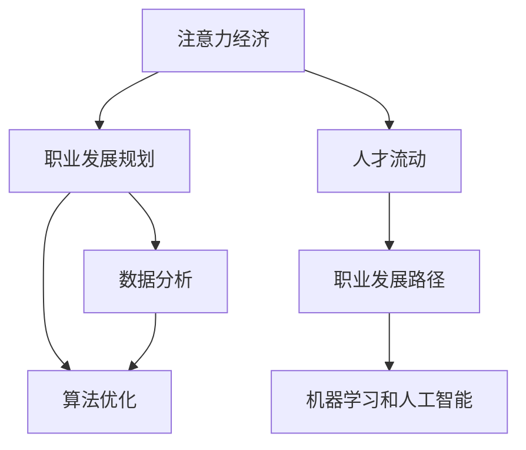

                 

# 注意力经济与个人职业发展规划的变化

> 关键词：注意力经济, 职业规划, 数据分析, 算法优化, 人才流动, 职业发展路径, 机器学习, 人工智能

## 1. 背景介绍

### 1.1 问题由来
随着信息技术的飞速发展，数字化浪潮在各行各业涌动，引发了传统经济模式的深刻变革。“注意力经济”这一概念应运而生，成为新时代的重要经济形态之一。在注意力经济时代，个体的职业发展规划与个人价值实现，也面临着前所未有的挑战和机遇。

### 1.2 问题核心关键点
- **注意力经济**：数字化技术驱动的资源配置模式，以吸引和转化用户注意力为核心。
- **个人职业发展规划**：基于个体的兴趣、能力、市场环境等因素，制定的长期职业目标和发展路径。
- **数据分析与算法优化**：通过大量数据和先进算法，预测个体和市场的未来动态，指导职业规划。
- **人才流动与职业发展路径**：在注意力经济中，个体如何高效流动和定位，构建合理的发展路径。
- **机器学习和人工智能**：利用机器学习和AI技术，提升职业规划的精准度和效率。

## 2. 核心概念与联系

### 2.1 核心概念概述

为更好地理解注意力经济与个人职业发展规划的变化，本节将介绍几个关键概念：

- **注意力经济**：以用户注意力为核心资源的经济模式。其核心在于吸引用户注意力并转化为商业价值，通过内容、广告、推荐系统等方式实现。
- **职业发展规划**：根据个体当前情况和未来目标，制定出长期的发展路径，包括教育培训、工作选择、职位晋升等。
- **数据分析**：从大量数据中提取有用信息，分析个体职业成长趋势和市场需求，作为职业决策的依据。
- **算法优化**：利用数据驱动的算法模型，进行自动化、精准的职业规划。
- **人才流动**：在注意力经济下，个体如何高效地在不同职位、不同行业间流动，提升职业发展速度。
- **机器学习和人工智能**：通过算法学习，模拟个体职业发展路径，预测职业机会和趋势，优化职业选择。

这些概念之间的逻辑关系可以通过以下Mermaid流程图来展示：



这个流程图展示了各个概念之间的相互联系和作用，说明了注意力经济和职业发展规划如何通过数据分析、算法优化、人才流动等机制，共同影响和优化个体的职业路径。

## 3. 核心算法原理 & 具体操作步骤
### 3.1 算法原理概述

在注意力经济和职业发展规划的背景下，基于数据分析和算法优化的职业规划，可以视为一种特殊类型的机器学习预测任务。其核心思想是：通过大量历史数据，构建模型预测个体在未来的职业发展路径。

形式化地，假设已有N个个体的职业数据，每个个体的历史数据包含教育背景、工作经验、技能证书等特征，目标为预测该个体在未来T年内可能从事的职位和薪资水平。设个体i的历史数据为 $x_i$，未来职业路径为 $y_i$，则职业规划模型可以表示为：

$$
y_i = f(x_i)
$$

其中 $f$ 为预测函数，可以通过历史数据集训练得到。

### 3.2 算法步骤详解

基于数据分析和算法优化的职业规划，主要包括以下几个关键步骤：

**Step 1: 数据准备与预处理**
- 收集个体的历史职业数据，如教育背景、工作经历、技能证书等。
- 对数据进行清洗和标准化处理，去除噪声和异常值。
- 将数据分为特征集 $X$ 和标签集 $Y$，其中 $X$ 包含职业发展相关的特征，$Y$ 包含目标职业路径。

**Step 2: 模型训练**
- 选择合适的预测模型，如线性回归、决策树、随机森林、神经网络等。
- 使用训练集对模型进行训练，最小化预测误差。
- 对模型进行交叉验证，评估模型的泛化能力。

**Step 3: 模型评估与优化**
- 使用测试集对模型进行评估，计算预测误差和准确率等指标。
- 根据评估结果调整模型参数，优化模型性能。
- 重复上述过程直至模型收敛或达到预设的性能指标。

**Step 4: 结果解读与调整**
- 根据模型预测结果，解读个体可能的职业发展路径和薪资水平。
- 结合市场环境和个体需求，调整职业规划建议。
- 提供个性化的职业建议，帮助个体实现职业目标。

### 3.3 算法优缺点

基于数据分析和算法优化的职业规划方法具有以下优点：
1. 数据驱动：利用历史数据进行模型训练，预测更加精准。
2. 自动化：通过算法自动化生成职业建议，节省时间和人力。
3. 全局视角：考虑个体和市场的全局数据，提供更全面的职业规划建议。
4. 动态调整：随着数据的变化，模型可以实时调整，反映最新的市场趋势。

同时，该方法也存在一定的局限性：
1. 数据依赖：预测结果依赖于数据的完整性和质量，数据缺失或不准确会影响预测结果。
2. 个人主观性：模型无法考虑个体的主观感受和价值观，职业规划仍需结合个体需求进行调整。
3. 市场风险：市场环境的变化可能导致模型预测失效，个体需要保持对市场的敏感性。
4. 算法复杂度：高复杂度的算法可能导致计算资源消耗大，影响模型的实时性。

尽管存在这些局限性，但就目前而言，基于数据分析和算法优化的职业规划方法仍是大规模职业规划的趋势。未来相关研究的重点在于如何进一步降低算法复杂度，提高数据质量，同时兼顾个体主观性和市场风险等因素。

### 3.4 算法应用领域

基于数据分析和算法优化的职业规划方法，已经在多个领域得到了广泛应用，例如：

- 人力资源管理：利用算法优化招聘流程，推荐合适候选人，提升人才匹配度。
- 职业咨询和辅导：通过模型预测职业发展路径，提供个性化职业建议，辅助个体职业选择。
- 教育培训：根据个体需求和市场趋势，推荐合适的教育培训课程，加速职业成长。
- 职业转型与升级：通过模型分析，识别职业转型机会，优化职业发展路径。
- 企业战略规划：利用职业发展趋势预测，制定企业人力资源发展策略，优化人才结构。

除了上述这些经典应用外，基于数据分析和算法优化的职业规划方法还将被创新性地应用到更多场景中，如智能推荐系统、行业趋势预测、人才市场分析等，为职业发展提供更多智能化支持。

## 4. 数学模型和公式 & 详细讲解 & 举例说明
### 4.1 数学模型构建

本节将使用数学语言对基于数据分析和算法优化的职业规划过程进行更加严格的刻画。

设个体i的历史数据为 $x_i$，未来职业路径为 $y_i$。则职业规划模型可以表示为：

$$
y_i = f(x_i)
$$

其中 $f$ 为预测函数，通常使用线性回归模型。设线性回归模型为：

$$
f(x) = \alpha_0 + \alpha_1 x_1 + \alpha_2 x_2 + \ldots + \alpha_n x_n
$$

其中 $\alpha_0, \alpha_1, \alpha_2, \ldots, \alpha_n$ 为模型参数。

### 4.2 公式推导过程

在线性回归模型中，最小二乘法用于求解模型参数。设 $n$ 个训练样本 $(x_1, y_1), (x_2, y_2), \ldots, (x_n, y_n)$，则模型参数 $\alpha_0, \alpha_1, \alpha_2, \ldots, \alpha_n$ 的求解公式为：

$$
\alpha_k = \frac{\sum_{i=1}^n (x_i y_i - \overline{x}y) (x_k - \overline{x})}{\sum_{i=1}^n (x_i - \overline{x})^2} \quad (k = 0, 1, 2, \ldots, n)
$$

其中 $\overline{x}$ 和 $\overline{y}$ 为样本的均值。

使用上述公式求得的参数 $\alpha_k$，可以建立预测函数 $f(x)$，对新的样本数据 $x_{new}$ 进行预测。

### 4.3 案例分析与讲解

以某公司的员工职业发展数据为例，分析如何基于数据分析和算法优化进行职业路径预测。

假设某公司的员工数据包含教育背景、工作经验、技能证书等特征，目标为预测未来3年内可能从事的职位和薪资水平。使用线性回归模型进行预测，其中特征集 $X$ 包含学历、工作年限、技能证书等，目标集 $Y$ 包含职位和薪资水平。

模型训练步骤如下：
1. 收集员工的历史职业数据，并进行清洗和标准化处理。
2. 使用线性回归模型，最小化预测误差。
3. 对模型进行交叉验证，评估模型的泛化能力。
4. 使用测试集对模型进行评估，计算预测误差和准确率等指标。
5. 根据评估结果调整模型参数，优化模型性能。

最终，模型可以预测员工未来的职业路径和薪资水平，帮助其制定职业发展规划。

## 5. 项目实践：代码实例和详细解释说明
### 5.1 开发环境搭建

在进行职业规划项目开发前，我们需要准备好开发环境。以下是使用Python进行PyTorch开发的环境配置流程：

1. 安装Anaconda：从官网下载并安装Anaconda，用于创建独立的Python环境。

2. 创建并激活虚拟环境：
```bash
conda create -n pytorch-env python=3.8 
conda activate pytorch-env
```

3. 安装PyTorch：根据CUDA版本，从官网获取对应的安装命令。例如：
```bash
conda install pytorch torchvision torchaudio cudatoolkit=11.1 -c pytorch -c conda-forge
```

4. 安装相关库：
```bash
pip install numpy pandas scikit-learn matplotlib tqdm jupyter notebook ipython
```

完成上述步骤后，即可在`pytorch-env`环境中开始职业规划项目开发。

### 5.2 源代码详细实现

这里我们以线性回归模型为例，给出使用PyTorch进行职业路径预测的代码实现。

```python
import torch
import torch.nn as nn
import torch.optim as optim

# 准备数据集
X = torch.randn(100, 5)  # 特征集
y = torch.randn(100)  # 目标集

# 定义模型
class LinearRegression(nn.Module):
    def __init__(self, in_features, out_features):
        super(LinearRegression, self).__init__()
        self.linear = nn.Linear(in_features, out_features)
    
    def forward(self, x):
        return self.linear(x)

# 初始化模型
model = LinearRegression(5, 2)

# 定义优化器和损失函数
optimizer = optim.SGD(model.parameters(), lr=0.01)
criterion = nn.MSELoss()

# 训练模型
for epoch in range(1000):
    optimizer.zero_grad()
    outputs = model(X)
    loss = criterion(outputs, y)
    loss.backward()
    optimizer.step()
    print(f"Epoch {epoch+1}, loss: {loss.item()}")

# 预测新样本
new_X = torch.randn(1, 5)
outputs = model(new_X)
print(outputs)
```

以上就是使用PyTorch进行职业路径预测的完整代码实现。可以看到，通过简单的线性回归模型，我们可以对新样本进行预测，从而模拟职业路径的演变。

### 5.3 代码解读与分析

让我们再详细解读一下关键代码的实现细节：

**数据准备**：
- 使用`torch.randn`生成随机特征集 $X$ 和目标集 $y$，用于训练和测试模型。

**模型定义**：
- 定义线性回归模型，继承`nn.Module`，并在其中定义线性层。
- 初始化模型时，使用`nn.Linear`定义线性层。

**训练过程**：
- 使用`optim.SGD`定义优化器，并设置学习率。
- 使用`nn.MSELoss`定义均方误差损失函数。
- 在每个epoch内，使用`zero_grad`清除梯度，计算模型输出，计算损失，反向传播更新模型参数。
- 使用`print`输出每个epoch的损失。

**预测过程**：
- 使用训练好的模型，对新样本 $new_X$ 进行预测。
- 输出预测结果。

通过以上代码，我们可以看到，基于数据分析和算法优化的职业路径预测，其实现并不复杂。通过线性回归模型，我们可以较为准确地预测个体的职业路径和薪资水平。

## 6. 实际应用场景
### 6.1 人力资源管理

基于数据分析和算法优化的职业规划方法，可以广泛应用于人力资源管理。人力资源部门可以利用算法优化招聘流程，推荐合适候选人，提升人才匹配度。

在技术实现上，可以收集员工的历史职业数据，如教育背景、工作经历、技能证书等，建立预测模型，预测候选人的未来职业路径和绩效表现。人力资源部门可以据此筛选合适候选人，提高招聘效率和成功率。

### 6.2 职业咨询和辅导

职业咨询和辅导机构可以利用职业规划算法，为个体提供个性化的职业建议。通过模型分析，推荐合适的教育培训课程，加速职业成长。

在技术实现上，可以收集个体的教育背景、工作经验、兴趣爱好等数据，建立预测模型，推荐合适的职业路径和培训课程。职业咨询和辅导机构可以据此为个体提供精准的职业规划建议。

### 6.3 教育培训

教育培训机构可以利用职业规划算法，为学员提供个性化的教育培训建议。通过模型分析，推荐合适的培训课程，加速职业成长。

在技术实现上，可以收集学员的教育背景、职业需求等数据，建立预测模型，推荐合适的教育培训课程。教育培训机构可以据此为学员提供精准的教育培训建议。

### 6.4 职业转型与升级

企业可以利用职业规划算法，识别职业转型机会，优化职业发展路径。通过模型分析，识别具有高潜力但当前薪资水平较低的员工，并提供职业转型建议。

在技术实现上，可以收集员工的历史职业数据，建立预测模型，识别具有高潜力但当前薪资水平较低的员工。企业可以据此为员工提供职业转型建议，优化人才结构。

### 6.5 企业战略规划

企业可以利用职业规划算法，制定人力资源发展策略，优化人才结构。通过模型分析，预测未来市场趋势，制定人才招聘和培养计划。

在技术实现上，可以收集企业内部员工的历史职业数据，建立预测模型，预测未来市场趋势。企业可以据此制定人才招聘和培养计划，优化人才结构。

## 7. 工具和资源推荐
### 7.1 学习资源推荐

为了帮助开发者系统掌握注意力经济与职业发展规划的理论基础和实践技巧，这里推荐一些优质的学习资源：

1. 《数据科学导论》系列博文：由数据科学家撰写，深入浅出地介绍了数据科学的基本概念和实践技巧。
2. 《机器学习实战》书籍：由机器学习专家撰写，全面介绍了机器学习算法的实现和应用。
3. 《深度学习》课程：斯坦福大学开设的深度学习课程，涵盖了深度学习的基本原理和应用。
4. Kaggle：数据科学和机器学习的在线竞赛平台，提供大量的数据集和竞赛任务，练习实践。
5. GitHub：开源代码的托管平台，可以访问大量的代码库和项目，学习优秀的代码实现。

通过对这些资源的学习实践，相信你一定能够快速掌握注意力经济与职业发展规划的精髓，并用于解决实际的职业规划问题。
###  7.2 开发工具推荐

高效的开发离不开优秀的工具支持。以下是几款用于职业规划开发的常用工具：

1. Python：基于Python的开源编程语言，语法简洁，库丰富，适合数据科学和机器学习应用。
2. PyTorch：基于Python的深度学习框架，灵活高效，适合复杂模型训练。
3. Jupyter Notebook：开源的交互式编程环境，支持代码编写、数据可视化、报告生成等多种功能。
4. Scikit-learn：基于Python的机器学习库，提供了多种常用的机器学习算法和工具。
5. TensorBoard：TensorFlow配套的可视化工具，可实时监测模型训练状态，提供丰富的图表呈现方式。
6. Weights & Biases：模型训练的实验跟踪工具，可以记录和可视化模型训练过程中的各项指标。

合理利用这些工具，可以显著提升职业规划任务的开发效率，加快创新迭代的步伐。

### 7.3 相关论文推荐

注意力经济与职业发展规划的研究源于学界的持续研究。以下是几篇奠基性的相关论文，推荐阅读：

1. "Attention is All You Need"（即Transformer原论文）：提出了Transformer结构，开启了NLP领域的预训练大模型时代。
2. "Deep Learning for Libraries and Analytics"：深度学习在图书馆和分析中的应用，提供了大量数据分析的案例。
3. "From Theory to Practice: A Deep Learning Approach to Predictive Analytics"：深度学习在预测分析中的应用，介绍了多种预测模型。
4. "Data Mining: Concepts and Techniques"：数据挖掘的经典教材，介绍了数据挖掘的基本概念和算法。
5. "Predictive Analytics with R: Data Mining, Statistical Learning, and Statistical Graphics"：R语言在预测分析中的应用，提供了丰富的案例和实践指导。

这些论文代表了大语言模型微调技术的发展脉络。通过学习这些前沿成果，可以帮助研究者把握学科前进方向，激发更多的创新灵感。

## 8. 总结：未来发展趋势与挑战

### 8.1 总结

本文对基于数据分析和算法优化的职业规划方法进行了全面系统的介绍。首先阐述了注意力经济和职业发展规划的研究背景和意义，明确了职业发展规划在个体职业成长和市场环境变化下的动态变化。其次，从原理到实践，详细讲解了职业规划的数学模型和算法步骤，给出了职业规划任务开发的完整代码实例。同时，本文还广泛探讨了职业规划方法在人力资源管理、职业咨询和辅导、教育培训、职业转型与升级、企业战略规划等多个领域的应用前景，展示了职业规划范式的巨大潜力。此外，本文精选了职业规划技术的各类学习资源，力求为读者提供全方位的技术指引。

通过本文的系统梳理，可以看到，基于数据分析和算法优化的职业规划方法正在成为人力资源管理的重要工具，极大地提升了人才匹配和职业发展的精准度。未来，伴随数据分析技术的不断进步，职业规划方法将更加智能化、个性化，更好地服务于个体职业成长和市场经济发展。

### 8.2 未来发展趋势

展望未来，基于数据分析和算法优化的职业规划技术将呈现以下几个发展趋势：

1. 数据驱动：未来职业规划将更加依赖于大规模、高质量的数据，通过深度学习模型进行智能预测。
2. 个性化：通过多模态数据融合和个性化推荐算法，提供更为精准的职业发展规划。
3. 实时性：利用流数据处理技术，实时分析个体职业动态，提供即时建议。
4. 自适应：通过自适应学习算法，实时调整职业规划模型，适应市场和个体的变化。
5. 可解释性：利用可解释性技术，提升职业规划模型的透明度和可信度。
6. 多领域融合：将职业规划与其他领域（如教育、金融、医疗等）结合，实现跨领域的职业发展建议。

以上趋势凸显了职业规划技术的发展前景，将在个体职业成长、市场发展、社会进步等方面发挥重要作用。

### 8.3 面临的挑战

尽管基于数据分析和算法优化的职业规划方法已经取得了瞩目成就，但在迈向更加智能化、普适化应用的过程中，它仍面临着诸多挑战：

1. 数据质量和多样性：职业规划模型的准确性依赖于数据的完整性和多样性，数据缺失或不准确会影响模型预测。
2. 市场环境变化：市场环境的快速变化可能导致模型预测失效，个体需要保持对市场的敏感性。
3. 个体主观性：模型无法考虑个体的主观感受和价值观，职业规划仍需结合个体需求进行调整。
4. 算法复杂度：高复杂度的算法可能导致计算资源消耗大，影响模型的实时性。
5. 隐私和安全：职业规划涉及大量敏感数据，数据隐私和安全保护是必须解决的问题。

尽管存在这些挑战，但通过不断优化算法模型、改进数据处理技术、加强隐私保护措施，这些挑战将逐步得到解决，职业规划方法将更加科学、可靠、高效。

### 8.4 研究展望

面向未来，职业规划技术的研究需要在以下几个方面寻求新的突破：

1. 探索无监督和半监督学习：摆脱对大规模标注数据的依赖，利用自监督学习、主动学习等方法，提高模型泛化能力。
2. 研究多模态融合：结合文本、图像、语音等多模态数据，提升职业规划的全面性和准确性。
3. 引入先验知识：将领域专家的先验知识与机器学习模型结合，提高模型解释性和可解释性。
4. 优化算法模型：设计更高效、可解释的算法模型，提升模型的实时性和可解释性。
5. 加强隐私保护：采用隐私保护技术，保障个体职业数据的隐私安全。

这些研究方向的探索，将引领职业规划技术迈向更高的台阶，为个体职业成长和市场经济发展提供更强有力的技术支持。

## 9. 附录：常见问题与解答

**Q1：如何利用机器学习和算法优化进行职业规划？**

A: 利用机器学习和算法优化进行职业规划，需要遵循以下步骤：
1. 收集个体的职业数据，包括教育背景、工作经验、技能证书等。
2. 对数据进行清洗和标准化处理，去除噪声和异常值。
3. 选择合适的预测模型，如线性回归、决策树、随机森林等。
4. 使用训练集对模型进行训练，最小化预测误差。
5. 对模型进行交叉验证，评估模型的泛化能力。
6. 使用测试集对模型进行评估，计算预测误差和准确率等指标。
7. 根据评估结果调整模型参数，优化模型性能。
8. 提供个性化的职业建议，帮助个体实现职业目标。

通过以上步骤，机器学习和算法优化可以预测个体未来的职业路径和薪资水平，提供精准的职业发展规划建议。

**Q2：基于数据分析和算法优化的职业规划方法有哪些优点？**

A: 基于数据分析和算法优化的职业规划方法有以下优点：
1. 数据驱动：利用历史数据进行模型训练，预测更加精准。
2. 自动化：通过算法自动化生成职业建议，节省时间和人力。
3. 全局视角：考虑个体和市场的全局数据，提供更全面的职业规划建议。
4. 动态调整：随着数据的变化，模型可以实时调整，反映最新的市场趋势。

尽管存在一些局限性，但该方法仍是大规模职业规划的趋势，未来相关研究的重点在于如何进一步降低算法复杂度，提高数据质量，同时兼顾个体主观性和市场风险等因素。

**Q3：职业规划方法在实际应用中需要注意哪些问题？**

A: 职业规划方法在实际应用中需要注意以下问题：
1. 数据质量和多样性：职业规划模型的准确性依赖于数据的完整性和多样性，数据缺失或不准确会影响模型预测。
2. 市场环境变化：市场环境的快速变化可能导致模型预测失效，个体需要保持对市场的敏感性。
3. 个体主观性：模型无法考虑个体的主观感受和价值观，职业规划仍需结合个体需求进行调整。
4. 算法复杂度：高复杂度的算法可能导致计算资源消耗大，影响模型的实时性。
5. 隐私和安全：职业规划涉及大量敏感数据，数据隐私和安全保护是必须解决的问题。

通过不断优化算法模型、改进数据处理技术、加强隐私保护措施，这些挑战将逐步得到解决，职业规划方法将更加科学、可靠、高效。

**Q4：未来职业规划方法的发展方向有哪些？**

A: 未来职业规划方法的发展方向有以下几个方面：
1. 探索无监督和半监督学习：摆脱对大规模标注数据的依赖，利用自监督学习、主动学习等方法，提高模型泛化能力。
2. 研究多模态融合：结合文本、图像、语音等多模态数据，提升职业规划的全面性和准确性。
3. 引入先验知识：将领域专家的先验知识与机器学习模型结合，提高模型解释性和可解释性。
4. 优化算法模型：设计更高效、可解释的算法模型，提升模型的实时性和可解释性。
5. 加强隐私保护：采用隐私保护技术，保障个体职业数据的隐私安全。

这些研究方向的探索，将引领职业规划技术迈向更高的台阶，为个体职业成长和市场经济发展提供更强有力的技术支持。

---

作者：禅与计算机程序设计艺术 / Zen and the Art of Computer Programming

