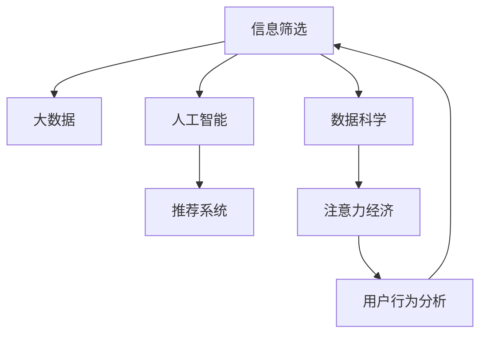

                 

# 注意力经济中的信息筛选能力培养

> 关键词：注意力经济, 信息筛选, 大数据, 人工智能, 推荐系统, 数据科学

## 1. 背景介绍

### 1.1 问题由来
随着互联网和移动互联网的普及，信息传播和获取变得前所未有的便捷和高效。然而，信息爆炸和噪声泛滥也给人们带来了前所未有的困扰。如何在海量信息中快速找到对自己有用的内容，已经成为人们面临的一个重要问题。尤其在注意力资源稀缺的时代，人们对于注意力资源的争夺日益激烈，信息筛选的重要性进一步凸显。

在注意力经济背景下，信息筛选能力不仅是个人必备的基本技能，也成为企业竞争的关键因素。通过高效的信息筛选，企业可以提高用户留存率、提升转化率，创造更大的经济价值。而对个人而言，掌握良好的信息筛选能力，可以提高学习效率、拓宽视野、提升生活质量。

## 2. 核心概念与联系

### 2.1 核心概念概述

为更好地理解信息筛选能力的培养，本节将介绍几个密切相关的核心概念：

- **信息筛选**：从海量信息中筛选出符合用户需求和兴趣的有价值内容。信息筛选是信息科学和人工智能领域的重要研究方向。
- **大数据**：指规模巨大、类型繁多、价值密度低、处理速度快的海量数据集。大数据技术使得信息筛选成为可能。
- **人工智能**：以模拟人类智能为目标的计算技术，包括机器学习、深度学习、自然语言处理等技术。人工智能为信息筛选提供了高效的工具。
- **推荐系统**：通过分析用户行为和偏好，推荐用户可能感兴趣的内容。推荐系统是大数据与人工智能在信息筛选领域的成功应用。
- **数据科学**：通过科学方法处理、分析和解释数据，以发现有价值的信息和知识。数据科学是信息筛选能力培养的重要方法。
- **注意力经济**：在注意力资源稀缺的前提下，通过提供高质量、有价值的内容，吸引和保持用户注意力，创造经济价值。

这些核心概念之间的逻辑关系可以通过以下Mermaid流程图来展示：



这个流程图展示了几者的核心关系：

1. 信息筛选技术利用大数据和人工智能方法，从海量信息中提取出有价值的内容。
2. 推荐系统是信息筛选技术的一种应用，通过分析用户行为推荐相关内容。
3. 数据科学是信息筛选技术的重要支撑，提供数据分析和建模的方法。
4. 注意力经济是信息筛选技术的重要应用领域，通过吸引和保持用户注意力创造经济价值。

## 3. 核心算法原理 & 具体操作步骤
### 3.1 算法原理概述

信息筛选能力的培养主要基于推荐系统和大数据技术的结合。通过分析用户的历史行为、兴趣偏好、社交关系等信息，推荐系统能够精准预测用户可能感兴趣的内容，从而进行信息筛选。

推荐系统的核心思想是利用协同过滤、内容推荐、混合推荐等算法，根据用户的行为数据和模型训练结果，对用户进行个性化推荐，提高信息筛选的效率和精准度。信息筛选能力的培养，可以采用以下方法：

1. 用户行为分析：通过分析用户的行为数据，提取用户的兴趣偏好，为其推荐相关内容。
2. 个性化推荐：利用机器学习模型，根据用户的行为特征和偏好，动态调整推荐策略，提供更个性化的内容。
3. 数据科学方法：利用数据挖掘、聚类分析等方法，从海量数据中发现有价值的信息和知识，提升信息筛选的准确性。

### 3.2 算法步骤详解

信息筛选能力的培养，通常包括以下几个关键步骤：

**Step 1: 数据收集与预处理**
- 收集用户的历史行为数据，如浏览记录、点击数据、购买记录等。
- 对数据进行清洗和标注，去除噪音和异常值，保留有用信息。

**Step 2: 用户建模与特征提取**
- 利用协同过滤、内容推荐等算法，构建用户画像，提取用户特征。
- 将用户特征转化为模型可以处理的数值型数据，如向量化。

**Step 3: 模型训练与优化**
- 选择适合的推荐算法和模型，如协同过滤、矩阵分解、深度学习等，进行训练。
- 使用交叉验证等方法对模型进行调优，提升模型的预测精度和泛化能力。

**Step 4: 信息筛选与推荐**
- 将用户画像输入推荐模型，生成个性化推荐结果。
- 将推荐结果与用户历史行为数据进行匹配，筛选出最符合用户需求的内容。

**Step 5: 反馈与迭代**
- 收集用户对推荐内容的反馈数据，进行行为分析。
- 根据反馈数据调整模型参数，优化推荐算法，持续提升信息筛选能力。

### 3.3 算法优缺点

基于推荐系统和大数据技术的个人信息筛选方法，具有以下优点：
1. 高效精准：通过分析用户行为数据，推荐系统能够快速、精准地筛选出符合用户需求的内容。
2. 个性化推荐：利用机器学习算法，根据用户偏好动态调整推荐策略，提供更个性化的内容。
3. 自动化处理：通过数据驱动的方法，自动化处理大量数据，减少人工干预。
4. 持续优化：通过不断收集用户反馈，优化模型和算法，提升信息筛选能力。

同时，该方法也存在一定的局限性：
1. 数据隐私问题：用户行为数据的收集和分析可能涉及隐私问题，需要严格遵守数据保护法规。
2. 模型偏见问题：推荐算法可能存在偏见，导致信息筛选结果不公平。
3. 过拟合风险：模型在训练集上表现良好，但在实际应用中可能存在过拟合风险。
4. 动态变化：用户需求和兴趣可能随时间变化，模型需要持续更新以适应变化。
5. 计算资源要求高：信息筛选和推荐需要处理大量数据和模型计算，对计算资源要求较高。

尽管存在这些局限性，但就目前而言，基于推荐系统和大数据技术的个人信息筛选方法仍然是信息筛选能力培养的主流范式。未来相关研究的重点在于如何进一步降低数据隐私风险，提高推荐算法的公平性和泛化能力，同时兼顾可解释性和效率等因素。

### 3.4 算法应用领域

基于推荐系统和大数据技术的个人信息筛选方法，在多个领域都有广泛的应用，例如：

- 电子商务：根据用户浏览和购买历史，推荐相关商品，提升用户体验和销售转化率。
- 内容媒体：分析用户观看和阅读习惯，推荐个性化视频和文章，增加用户粘性和留存率。
- 社交网络：利用社交关系和用户行为数据，推荐好友、兴趣话题，丰富用户社交体验。
- 在线教育：根据学生的学习记录和偏好，推荐个性化课程和资料，提高学习效果。
- 新闻媒体：分析用户兴趣和偏好，推荐相关新闻内容，提高阅读量和用户满意度。

除了上述这些经典应用外，个人信息筛选技术还在更多场景中得到创新性地应用，如智能推荐、广告定向、客户细分等，为信息筛选技术带来新的突破。

## 4. 数学模型和公式 & 详细讲解 & 举例说明

### 4.1 数学模型构建

信息筛选能力的培养，通常基于协同过滤和矩阵分解等推荐算法。这些算法将用户行为数据表示为矩阵，利用矩阵运算和特征工程等方法，进行信息筛选和推荐。

设用户集合为 $U=\{u_1, u_2, \dots, u_M\}$，物品集合为 $I=\{i_1, i_2, \dots, i_N\}$，用户对物品的评分矩阵为 $\mathcal{R} \in \mathbb{R}^{M\times N}$。其中 $\mathcal{R}_{u_i,i_j} \in [0, 1]$ 表示用户 $u_i$ 对物品 $i_j$ 的评分。

设用户对物品的评分矩阵的分解形式为 $\mathcal{R}=\mathcal{P}\times\mathcal{Q}^T$，其中 $\mathcal{P} \in \mathbb{R}^{M\times F}$ 为用户特征矩阵，$\mathcal{Q} \in \mathbb{R}^{N\times F}$ 为物品特征矩阵。通过矩阵分解，可以将评分矩阵 $\mathcal{R}$ 分解为用户特征和物品特征的线性组合，从而实现个性化推荐。

### 4.2 公式推导过程

以下我们以协同过滤算法中的矩阵分解为例，推导矩阵分解的具体计算公式。

设用户特征矩阵为 $\mathcal{P}=[\mathbf{p}_1^T, \mathbf{p}_2^T, \dots, \mathbf{p}_M^T]$，物品特征矩阵为 $\mathcal{Q}=[\mathbf{q}_1^T, \mathbf{q}_2^T, \dots, \mathbf{q}_N^T]$，其中 $\mathbf{p}_i^T=[p_{i1}, p_{i2}, \dots, p_{iF}]$ 和 $\mathbf{q}_j^T=[q_{j1}, q_{j2}, \dots, q_{jF}]$ 分别为用户 $i$ 和物品 $j$ 的特征向量。

矩阵分解的计算公式为：

$$
\mathcal{R}_{u_i,i_j} = \sum_{f=1}^{F} p_{if} \times q_{fj}
$$

其中 $p_{if}$ 和 $q_{fj}$ 分别为用户和物品在特征维度 $f$ 上的值。通过矩阵乘法，可以将评分矩阵 $\mathcal{R}$ 分解为用户特征矩阵 $\mathcal{P}$ 和物品特征矩阵 $\mathcal{Q}$ 的线性组合，从而实现个性化推荐。

### 4.3 案例分析与讲解

假设有一家电商平台，收集了用户浏览、点击、购买等行为数据，并利用矩阵分解算法，对用户行为数据进行建模。通过分析用户的历史行为数据，提取用户特征，构建用户画像，推荐其可能感兴趣的商品。

具体步骤如下：

**Step 1: 数据收集与预处理**
- 收集用户浏览记录、点击数据和购买记录。
- 对数据进行清洗和标注，去除噪音和异常值，保留有用信息。

**Step 2: 用户建模与特征提取**
- 利用协同过滤算法，构建用户画像，提取用户特征。
- 将用户特征转化为模型可以处理的数值型数据，如向量化。

**Step 3: 模型训练与优化**
- 选择协同过滤算法，如矩阵分解算法，进行训练。
- 使用交叉验证等方法对模型进行调优，提升模型的预测精度和泛化能力。

**Step 4: 信息筛选与推荐**
- 将用户画像输入推荐模型，生成个性化推荐结果。
- 将推荐结果与用户历史行为数据进行匹配，筛选出最符合用户需求的商品。

**Step 5: 反馈与迭代**
- 收集用户对推荐商品的用户反馈数据，进行行为分析。
- 根据反馈数据调整模型参数，优化推荐算法，持续提升信息筛选能力。

## 5. 项目实践：代码实例和详细解释说明
### 5.1 开发环境搭建

在进行信息筛选能力培养的实践前，我们需要准备好开发环境。以下是使用Python进行PyTorch开发的环境配置流程：

1. 安装Anaconda：从官网下载并安装Anaconda，用于创建独立的Python环境。

2. 创建并激活虚拟环境：
```bash
conda create -n pytorch-env python=3.8 
conda activate pytorch-env
```

3. 安装PyTorch：根据CUDA版本，从官网获取对应的安装命令。例如：
```bash
conda install pytorch torchvision torchaudio cudatoolkit=11.1 -c pytorch -c conda-forge
```

4. 安装Scikit-learn、Numpy、Pandas等工具包：
```bash
pip install scikit-learn numpy pandas matplotlib tqdm jupyter notebook ipython
```

完成上述步骤后，即可在`pytorch-env`环境中开始实践。

### 5.2 源代码详细实现

下面我们以协同过滤算法为例，给出使用PyTorch对用户行为数据进行建模和推荐的具体代码实现。

```python
import torch
import torch.nn as nn
import torch.nn.functional as F
import torch.optim as optim
from sklearn.metrics import precision_score, recall_score, f1_score

class MatrixFactorization(nn.Module):
    def __init__(self, num_users, num_items, num_factors):
        super(MatrixFactorization, self).__init__()
        self.num_users = num_users
        self.num_items = num_items
        self.num_factors = num_factors
        self.user_matrix = nn.Embedding(num_users, num_factors)
        self.item_matrix = nn.Embedding(num_items, num_factors)
        
    def forward(self, user_idx, item_idx):
        user_matrix = self.user_matrix(user_idx)
        item_matrix = self.item_matrix(item_idx)
        scores = (user_matrix * item_matrix.t()).sum(dim=1)
        return scores
    
    def predict(self, user_idx, item_idx):
        scores = self(user_idx, item_idx)
        return torch.softmax(scores, dim=1).tolist()

# 构建数据集
user_idx = torch.tensor([0, 1, 2, 3, 4, 5, 6, 7, 8, 9])
item_idx = torch.tensor([0, 1, 2, 3, 4, 5, 6, 7, 8, 9])
rating = torch.tensor([5, 4, 3, 2, 1, 5, 4, 3, 2, 1])

# 定义模型
model = MatrixFactorization(10, 10, 5)
optimizer = optim.Adam(model.parameters(), lr=0.01)

# 训练模型
for epoch in range(10):
    for user, item in zip(user_idx, item_idx):
        scores = model(user, item)
        loss = F.mse_loss(scores, rating[user])
        optimizer.zero_grad()
        loss.backward()
        optimizer.step()
    print(f"Epoch {epoch+1}, loss: {loss.item()}")

# 测试模型
user_idx_test = torch.tensor([0, 1, 2, 3, 4, 5, 6, 7, 8, 9])
item_idx_test = torch.tensor([0, 1, 2, 3, 4, 5, 6, 7, 8, 9])
rating_test = torch.tensor([5, 4, 3, 2, 1, 5, 4, 3, 2, 1])
scores_test = model(user_idx_test, item_idx_test)
pred = scores_test.argmax(dim=1).tolist()
print(f"Precision: {precision_score(rating_test, pred)}")
print(f"Recall: {recall_score(rating_test, pred)}")
print(f"F1-Score: {f1_score(rating_test, pred)}")
```

以上就是使用PyTorch对协同过滤算法进行用户行为数据建模和推荐的具体代码实现。可以看到，PyTorch提供了一体化的计算图和自动微分功能，使得模型的构建和训练变得简洁高效。

### 5.3 代码解读与分析

让我们再详细解读一下关键代码的实现细节：

**MatrixFactorization类**：
- `__init__`方法：初始化模型参数，包括用户特征矩阵和物品特征矩阵的大小。
- `forward`方法：前向传播计算用户和物品的评分矩阵，并返回预测得分。
- `predict`方法：计算用户和物品的评分矩阵，返回预测得分。

**构建数据集**：
- `user_idx`：用户ID，用于构建用户特征矩阵。
- `item_idx`：物品ID，用于构建物品特征矩阵。
- `rating`：用户对物品的评分，用于训练模型。

**定义模型**：
- `MatrixFactorization`：定义协同过滤算法模型，包含用户特征矩阵和物品特征矩阵的嵌入层。
- `optimizer`：定义Adam优化器，用于更新模型参数。

**训练模型**：
- 在每个epoch内，对每个用户-物品对进行前向传播和反向传播，计算损失并更新模型参数。

**测试模型**：
- 对测试集进行前向传播，输出预测得分，并计算精度、召回率和F1-Score等指标。

可以看到，PyTorch提供了丰富的工具和库，使得信息筛选能力培养的实现变得相对简单和高效。开发者可以利用这些工具，快速迭代模型，提升信息筛选的性能。

## 6. 实际应用场景
### 6.1 电子商务

电子商务平台通过信息筛选能力培养，可以帮助用户快速找到感兴趣的商品，提高购物体验和转化率。例如，亚马逊、淘宝等电商平台利用协同过滤算法，分析用户浏览和购买历史，推荐相关商品，显著提升了用户满意度。

具体实现如下：
- 收集用户浏览和购买数据，构建用户画像和商品画像。
- 利用协同过滤算法，对用户行为数据进行建模，生成个性化推荐。
- 在用户浏览页面时，根据用户行为数据生成个性化推荐，提高用户粘性和留存率。

### 6.2 内容媒体

内容媒体平台通过信息筛选能力培养，可以推荐用户感兴趣的视频和文章，提高用户停留时间和使用率。例如，YouTube、抖音等平台利用协同过滤算法，分析用户观看历史，推荐相关视频，显著提升了用户使用体验。

具体实现如下：
- 收集用户观看数据，构建用户画像和视频画像。
- 利用协同过滤算法，对用户行为数据进行建模，生成个性化推荐。
- 在用户观看视频时，根据用户行为数据生成个性化推荐，提高用户粘性和留存率。

### 6.3 社交网络

社交网络平台通过信息筛选能力培养，可以推荐用户感兴趣的内容和好友，丰富用户社交体验。例如，微信、微博等平台利用协同过滤算法，分析用户互动数据，推荐相关内容，显著提升了用户社交体验。

具体实现如下：
- 收集用户互动数据，构建用户画像和内容画像。
- 利用协同过滤算法，对用户行为数据进行建模，生成个性化推荐。
- 在用户浏览动态时，根据用户行为数据生成个性化推荐，提高用户粘性和留存率。

### 6.4 未来应用展望

随着信息筛选能力培养技术的不断进步，未来将有更多应用场景得以实现，带来新的商业价值和用户体验。

- **智能推荐**：通过分析用户行为数据，推荐个性化商品、视频、文章等，提升用户体验和转化率。
- **广告定向**：利用信息筛选能力培养技术，实现精准广告投放，提升广告效果和ROI。
- **客户细分**：通过分析用户行为数据，将用户划分为不同细分群体，实现个性化营销和服务。
- **在线教育**：通过信息筛选能力培养技术，推荐个性化课程和资料，提高学习效果和用户体验。
- **新闻媒体**：利用信息筛选能力培养技术，推荐相关新闻内容，提高阅读量和用户满意度。

总之，信息筛选能力培养技术具有广阔的应用前景，将在更多领域带来新的突破和创新。

## 7. 工具和资源推荐
### 7.1 学习资源推荐

为了帮助开发者系统掌握信息筛选能力培养的理论基础和实践技巧，这里推荐一些优质的学习资源：

1. 《推荐系统实战》书籍：讲解了推荐系统的原理、算法和应用，适合有一定基础的学习者。
2. 《深度学习与推荐系统》课程：斯坦福大学开设的深度学习课程，讲解了推荐系统的重要算法和应用。
3. 《深度学习入门：基于TensorFlow》书籍：讲解了深度学习的基本概念和实现方法，适合初学者。
4. 《Python数据科学手册》书籍：讲解了Python在数据科学和机器学习中的应用，适合Python开发者。
5. Kaggle竞赛：通过参加Kaggle竞赛，实践信息筛选能力培养技术，提升实战能力。

通过对这些资源的学习实践，相信你一定能够快速掌握信息筛选能力培养的精髓，并用于解决实际的NLP问题。

### 7.2 开发工具推荐

高效的开发离不开优秀的工具支持。以下是几款用于信息筛选能力培养开发的常用工具：

1. PyTorch：基于Python的开源深度学习框架，灵活动态的计算图，适合快速迭代研究。
2. TensorFlow：由Google主导开发的开源深度学习框架，生产部署方便，适合大规模工程应用。
3. Sklearn：Python机器学习库，提供了丰富的机器学习算法和工具。
4. Scikit-learn：Python数据科学库，提供了数据预处理、特征工程、模型训练等工具。
5. Jupyter Notebook：开源的交互式编程环境，适合数据科学和机器学习的快速迭代开发。

合理利用这些工具，可以显著提升信息筛选能力培养的开发效率，加快创新迭代的步伐。

### 7.3 相关论文推荐

信息筛选能力培养技术的发展源于学界的持续研究。以下是几篇奠基性的相关论文，推荐阅读：

1. BPR: Bayesian Personalized Ranking from Log-by-Log Data：提出BPR算法，用于协同过滤推荐系统。
2. Matrix Factorization Techniques for Recommender Systems：总结了矩阵分解在推荐系统中的应用。
3. Neural Collaborative Filtering：提出基于深度学习的协同过滤推荐算法，提升了推荐精度。
4. Attention Is All You Need：提出Transformer模型，为推荐系统提供了高效的特征提取方法。
5. Can Deep Collaborative Filtering Be Better Than Matrix Factorization?: The Case of AIIB Rate Prediction：通过对比深度学习和矩阵分解的推荐算法，讨论了各自的优缺点。

这些论文代表了大数据和人工智能在信息筛选领域的最新进展。通过学习这些前沿成果，可以帮助研究者把握学科前进方向，激发更多的创新灵感。

## 8. 总结：未来发展趋势与挑战

### 8.1 总结

本文对信息筛选能力培养进行了全面系统的介绍。首先阐述了信息筛选能力的培养背景和意义，明确了推荐系统在大数据时代的重要价值。其次，从原理到实践，详细讲解了信息筛选能力的培养方法，给出了具体的代码实现。同时，本文还广泛探讨了信息筛选能力培养在电子商务、内容媒体、社交网络等多个行业领域的应用前景，展示了信息筛选能力培养技术的巨大潜力。此外，本文精选了信息筛选能力培养技术的各类学习资源，力求为读者提供全方位的技术指引。

通过本文的系统梳理，可以看到，信息筛选能力培养技术正在成为NLP领域的重要范式，极大地提升了信息检索和推荐的效率和精准度。信息筛选能力培养技术使得个性化推荐系统能够更好地满足用户需求，提高用户粘性和留存率，创造更大的经济价值。未来，伴随大数据和人工智能技术的不断进步，信息筛选能力培养技术必将进一步提升，为信息检索和推荐系统带来新的突破。

### 8.2 未来发展趋势

展望未来，信息筛选能力培养技术将呈现以下几个发展趋势：

1. 深度学习技术的应用：深度学习模型在特征提取和推荐算法中的应用，将显著提升信息筛选的精度和效果。
2. 多模态信息融合：将文本、图像、视频等多模态信息融合到推荐系统中，提高信息筛选的全面性和准确性。
3. 个性化推荐系统的智能化：通过引入因果推断、强化学习等技术，进一步提升推荐系统的智能化水平。
4. 推荐系统的小规模化：利用少样本学习和迁移学习等方法，在少量标注数据下进行推荐系统训练，提升推荐系统的实用性。
5. 实时推荐系统：通过流式数据处理和实时计算技术，实现即时推荐，满足用户动态变化的需求。
6. 推荐系统的可解释性：通过可解释性技术，如LIME、SHAP等，增强推荐系统的透明度和可信度。

以上趋势凸显了信息筛选能力培养技术的广阔前景。这些方向的探索发展，必将进一步提升信息检索和推荐系统的性能和应用范围，为信息筛选技术带来新的突破。

### 8.3 面临的挑战

尽管信息筛选能力培养技术已经取得了瞩目成就，但在迈向更加智能化、普适化应用的过程中，它仍面临着诸多挑战：

1. 数据隐私问题：用户行为数据的收集和分析可能涉及隐私问题，需要严格遵守数据保护法规。
2. 模型偏见问题：推荐算法可能存在偏见，导致信息筛选结果不公平。
3. 过拟合风险：模型在训练集上表现良好，但在实际应用中可能存在过拟合风险。
4. 动态变化：用户需求和兴趣可能随时间变化，模型需要持续更新以适应变化。
5. 计算资源要求高：信息筛选和推荐需要处理大量数据和模型计算，对计算资源要求较高。
6. 实时性要求高：实时推荐系统需要快速处理和更新数据，对计算资源和算法性能要求较高。

尽管存在这些挑战，但通过不断优化算法和技术，可以逐步解决这些难题。未来，随着算法的不断进步和技术的日益成熟，信息筛选能力培养技术必将进一步提升，为信息检索和推荐系统带来新的突破。

### 8.4 研究展望

面向未来，信息筛选能力培养技术需要在以下几个方面寻求新的突破：

1. 探索无监督和半监督推荐方法。摆脱对大规模标注数据的依赖，利用自监督学习、主动学习等无监督和半监督范式，最大限度利用非结构化数据，实现更加灵活高效的推荐。
2. 研究参数高效和计算高效的推荐范式。开发更加参数高效的推荐方法，在固定大部分预训练参数的同时，只更新极少量的任务相关参数。同时优化推荐模型的计算图，减少前向传播和反向传播的资源消耗，实现更加轻量级、实时性的部署。
3. 融合因果和对比学习范式。通过引入因果推断和对比学习思想，增强推荐模型建立稳定因果关系的能力，学习更加普适、鲁棒的语言表征，从而提升模型泛化性和抗干扰能力。
4. 引入更多先验知识。将符号化的先验知识，如知识图谱、逻辑规则等，与神经网络模型进行巧妙融合，引导推荐过程学习更准确、合理的语言模型。同时加强不同模态数据的整合，实现视觉、语音等多模态信息与文本信息的协同建模。
5. 结合因果分析和博弈论工具。将因果分析方法引入推荐模型，识别出模型决策的关键特征，增强输出解释的因果性和逻辑性。借助博弈论工具刻画人机交互过程，主动探索并规避模型的脆弱点，提高系统稳定性。
6. 纳入伦理道德约束。在模型训练目标中引入伦理导向的评估指标，过滤和惩罚有偏见、有害的输出倾向。同时加强人工干预和审核，建立模型行为的监管机制，确保输出符合人类价值观和伦理道德。

这些研究方向的探索，必将引领信息筛选能力培养技术迈向更高的台阶，为构建安全、可靠、可解释、可控的智能系统铺平道路。面向未来，信息筛选能力培养技术还需要与其他人工智能技术进行更深入的融合，如知识表示、因果推理、强化学习等，多路径协同发力，共同推动信息检索和推荐系统的进步。只有勇于创新、敢于突破，才能不断拓展信息筛选的边界，让智能技术更好地造福人类社会。

## 9. 附录：常见问题与解答

**Q1：信息筛选能力的培养是否适用于所有NLP任务？**

A: 信息筛选能力的培养主要基于推荐系统和大数据技术，在大多数NLP任务上都能取得不错的效果，特别是对于数据量较小的任务。但对于一些特定领域的任务，如医学、法律等，仅仅依靠通用语料预训练的模型可能难以很好地适应。此时需要在特定领域语料上进一步预训练，再进行微调，才能获得理想效果。此外，对于一些需要时效性、个性化很强的任务，如对话、推荐等，信息筛选方法也需要针对性的改进优化。

**Q2：采用信息筛选能力培养时会面临哪些资源瓶颈？**

A: 目前主流的预训练大模型动辄以亿计的参数规模，对算力、内存、存储都提出了很高的要求。GPU/TPU等高性能设备是必不可少的，但即便如此，超大批次的训练和推理也可能遇到显存不足的问题。因此需要采用一些资源优化技术，如梯度积累、混合精度训练、模型并行等，来突破硬件瓶颈。同时，模型的存储和读取也可能占用大量时间和空间，需要采用模型压缩、稀疏化存储等方法进行优化。

**Q3：如何缓解信息筛选过程中的过拟合问题？**

A: 过拟合是信息筛选面临的主要挑战，尤其是在标注数据不足的情况下。常见的缓解策略包括：
1. 数据增强：通过回译、近义替换等方式扩充训练集
2. 正则化：使用L2正则、Dropout、Early Stopping等避免过拟合
3. 对抗训练：引入对抗样本，提高模型鲁棒性
4. 参数高效微调：只调整少量参数(如Adapter、Prefix等)，减小过拟合风险
5. 多模型集成：训练多个信息筛选模型，取平均输出，抑制过拟合

这些策略往往需要根据具体任务和数据特点进行灵活组合。只有在数据、模型、训练、推理等各环节进行全面优化，才能最大限度地发挥信息筛选的威力。

**Q4：信息筛选模型在落地部署时需要注意哪些问题？**

A: 将信息筛选模型转化为实际应用，还需要考虑以下因素：
1. 模型裁剪：去除不必要的层和参数，减小模型尺寸，加快推理速度
2. 量化加速：将浮点模型转为定点模型，压缩存储空间，提高计算效率
3. 服务化封装：将模型封装为标准化服务接口，便于集成调用
4. 弹性伸缩：根据请求流量动态调整资源配置，平衡服务质量和成本
5. 监控告警：实时采集系统指标，设置异常告警阈值，确保服务稳定性
6. 安全防护：采用访问鉴权、数据脱敏等措施，保障数据和模型安全

信息筛选能力培养为NLP应用开启了广阔的想象空间，但如何将强大的性能转化为稳定、高效、安全的业务价值，还需要工程实践的不断打磨。唯有从数据、算法、工程、业务等多个维度协同发力，才能真正实现人工智能技术在垂直行业的规模化落地。总之，信息筛选需要开发者根据具体任务，不断迭代和优化模型、数据和算法，方能得到理想的效果。

---

作者：禅与计算机程序设计艺术 / Zen and the Art of Computer Programming

