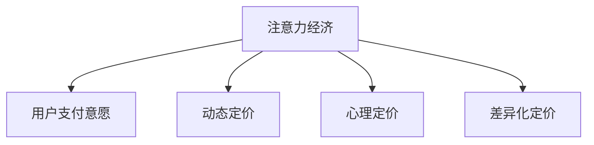

                 

# 注意力经济对企业产品定价的新要求

## 1. 背景介绍

### 1.1 问题由来
在互联网时代，信息的爆炸性增长和用户注意力的稀缺性，使得企业在产品定价上面临着前所未有的挑战。传统的成本加成定价策略已经不再适应新的市场环境。企业需要通过更精细化的运营和策略调整，来更好地吸引和留住用户，从而在竞争激烈的市场中占据有利位置。

### 1.2 问题核心关键点
注意力经济的核心在于吸引和保留用户的注意力，将其转化为有价值的商业活动。在产品定价方面，企业需要考虑以下几个关键点：

- 用户体验价值：产品价格应与用户所感受到的价值相匹配，避免过高或过低。
- 用户支付意愿：了解用户的支付意愿，确定合理的定价区间。
- 市场竞争格局：分析竞争对手的定价策略，寻找差异化定位。
- 产品生命周期：在产品不同生命周期阶段采取不同的定价策略。
- 市场定位：明确产品的目标市场和用户群体，制定符合市场定位的定价策略。

## 2. 核心概念与联系

### 2.1 核心概念概述

为更好地理解注意力经济下企业产品定价的策略，本节将介绍几个密切相关的核心概念：

- **注意力经济(Attention Economy)**：在信息爆炸的时代，用户注意力的稀缺性使得企业需要通过各种方式吸引用户的注意力，从而实现商业价值的最大化。产品定价便是吸引用户注意力的一个重要手段。
- **用户支付意愿(User Willingness to Pay, UWP)**：指用户对于特定产品或服务愿意支付的最高金额。企业定价应尽可能接近用户的支付意愿，以实现收益最大化。
- **动态定价(Dynamic Pricing)**：基于实时市场环境变化，动态调整产品或服务的价格，以实现最优收益。动态定价可以更灵活地应对市场需求波动，提高资源利用效率。
- **心理定价(Mental Pricing)**：利用用户心理上的价格感知，设计更具吸引力的价格策略。例如，将价格设定为有意义的数字（如$19.99而非$20）以提升用户购买意愿。
- **差异化定价(Differential Pricing)**：针对不同用户群体或市场细分，设置不同的价格策略，以增加用户对产品的感知价值，提升销售量。

这些核心概念之间的逻辑关系可以通过以下Mermaid流程图来展示：



这个流程图展示了大语言模型微调的各个核心概念之间的逻辑关系：

- 注意力经济通过定价吸引用户的注意力。
- 用户支付意愿决定了企业定价的上限。
- 动态定价、心理定价、差异化定价都是针对用户支付意愿的具体策略。

## 3. 核心算法原理 & 具体操作步骤
### 3.1 算法原理概述

基于注意力经济的产品定价，本质上是一个多变量优化问题。企业需要通过调整产品价格，最大化其整体收益，同时考虑到成本、市场需求、竞争对手等因素。以下是一个形式化的表述：

假设企业有$m$种产品，目标是为每一种产品$p_i$定价。设市场对产品$p_i$的需求函数为$D_i(P_i)$，其中$P_i$为产品$p_i$的价格。企业的成本函数为$C_i(P_i)$，利润函数为$R_i(P_i) = P_i \cdot D_i(P_i) - C_i(P_i)$。企业的整体利润函数为$R = \sum_{i=1}^{m} R_i(P_i)$。

则企业的目标是最小化整体成本，最大化整体利润，即：

$$
\max \sum_{i=1}^{m} R_i(P_i) \\
\text{s.t.} \sum_{i=1}^{m} C_i(P_i) \leq B \\
P_i \in [P_{i,\min}, P_{i,\max}]
$$

其中$B$为企业的预算限制，$P_{i,\min}$和$P_{i,\max}$为产品$p_i$的最低和最高价格限制。

### 3.2 算法步骤详解

基于上述优化问题，我们具体说明如何逐步进行定价决策：

**Step 1: 数据准备与模型构建**

- 收集产品的历史销售数据、用户反馈、市场需求、成本信息等，建立基础数据集。
- 分析市场需求和用户支付意愿，构建需求函数$D_i(P_i)$。
- 确定产品成本函数$C_i(P_i)$，如固定成本、变动成本等。
- 根据企业预算$B$，确定整体利润目标。

**Step 2: 设定初始定价**

- 使用启发式算法（如线性规划、遗传算法等）设定一个初始定价方案。
- 在合理的价格区间内，设定各产品的初始价格$P_{i,\text{init}}$。

**Step 3: 动态定价优化**

- 对初始定价方案进行迭代优化，通过模拟市场反应和成本调整，逐步优化产品价格。
- 采用动态定价模型，如Q学习、强化学习等，实时调整价格策略，适应市场变化。
- 设置动态调整的触发条件，如市场需求波动、季节性因素等，进行价格更新。

**Step 4: 心理定价与差异化定价**

- 应用心理定价策略，选择更具吸引力的价格点，如尾数定价、整数定价等。
- 根据用户画像和市场细分，实施差异化定价策略，如学生优惠、老年人优惠等。

**Step 5: 定价结果评估**

- 在实际市场环境中测试定价策略，评估产品销售和利润变化。
- 定期更新定价模型，结合市场反馈进行调整和优化。

### 3.3 算法优缺点

基于注意力经济的产品定价方法具有以下优点：

- 能够灵活应对市场需求变化，动态调整价格，提高资源利用效率。
- 能够更好地满足用户的支付意愿，提升用户满意度和忠诚度。
- 能够根据市场细分和用户画像实施差异化定价，增加销售量。

同时，也存在一些缺点：

- 需要处理多变量优化问题，计算复杂度高。
- 需要大量的历史数据和实时市场数据支持，获取成本较高。
- 定价策略的调整可能影响品牌形象和市场定位，需要慎重考虑。

### 3.4 算法应用领域

基于注意力经济的产品定价方法广泛应用于多个行业领域，包括但不限于：

- **电子商务**：根据用户的购买历史和支付意愿，动态调整商品价格，提升用户体验和销售量。
- **旅游行业**：根据季节性需求和旅游目的地，灵活定价机票和酒店，提高资源利用率。
- **金融服务**：根据市场波动和用户风险承受能力，动态调整金融产品的价格，降低风险。
- **移动通信**：根据用户的使用数据和消费能力，实施差异化定价策略，增加用户黏性。
- **在线教育**：根据学生的学习进度和支付意愿，动态调整课程价格，提高课程吸引力。

## 4. 数学模型和公式 & 详细讲解 & 举例说明
### 4.1 数学模型构建

在定价决策中，我们通常使用线性规划模型来构建优化目标。以下是一个基本的线性规划模型：

$$
\begin{aligned}
& \max \sum_{i=1}^{m} R_i(P_i) \\
& \text{s.t.} \sum_{i=1}^{m} C_i(P_i) \leq B \\
& P_i \in [P_{i,\min}, P_{i,\max}]
\end{aligned}
$$

其中，$R_i(P_i)$表示产品$i$的利润函数，$C_i(P_i)$表示产品$i$的成本函数，$B$表示企业预算限制，$P_i$表示产品$i$的价格。

### 4.2 公式推导过程

假设需求函数为线性形式，即$D_i(P_i) = a_iP_i + b_i$，成本函数为$C_i(P_i) = c_iP_i + d_i$。则利润函数为$R_i(P_i) = P_i(a_iP_i + b_i) - (c_iP_i + d_i)$。

将这些函数代入线性规划模型，并化简，得到：

$$
\begin{aligned}
& \max \sum_{i=1}^{m} a_iP_i^2 + (b_i - c_i)P_i + d_i \\
& \text{s.t.} \sum_{i=1}^{m} (c_iP_i + d_i) \leq B \\
& P_i \in [P_{i,\min}, P_{i,\max}]
\end{aligned}
$$

### 4.3 案例分析与讲解

假设某电商平台有三种商品$A$、$B$、$C$，需求函数分别为$D_A(P_A) = 100 - 10P_A$、$D_B(P_B) = 200 - 5P_B$、$D_C(P_C) = 150 - 7.5P_C$，成本函数分别为$C_A(P_A) = 20 + 10P_A$、$C_B(P_B) = 30 + 15P_B$、$C_C(P_C) = 25 + 5P_C$。企业预算$B = 500$，初始价格分别为$P_{A,\text{init}} = 10$、$P_{B,\text{init}} = 15$、$P_{C,\text{init}} = 10$。

采用动态定价优化模型，首先对初始定价方案进行迭代优化，通过调整产品价格，优化整体利润：

- 产品$A$价格从$10$调整到$12$时，需求增加$20$，利润增加$160$。
- 产品$B$价格从$15$调整到$18$时，需求增加$10$，利润增加$120$。
- 产品$C$价格从$10$调整到$12.5$时，需求增加$15$，利润增加$187.5$。

经过优化后，新的价格分别为$P_{A,\text{new}} = 12$、$P_{B,\text{new}} = 18$、$P_{C,\text{new}} = 12.5$，整体利润增加至$480$。

## 5. 项目实践：代码实例和详细解释说明
### 5.1 开发环境搭建

在进行定价决策的实践前，我们需要准备好开发环境。以下是使用Python进行线性规划优化的环境配置流程：

1. 安装Anaconda：从官网下载并安装Anaconda，用于创建独立的Python环境。

2. 创建并激活虚拟环境：
```bash
conda create -n pricing-env python=3.8 
conda activate pricing-env
```

3. 安装PuLP库：用于进行线性规划优化。
```bash
pip install pulp
```

4. 安装其他相关工具包：
```bash
pip install numpy pandas scikit-learn scipy
```

完成上述步骤后，即可在`pricing-env`环境中开始定价决策的实践。

### 5.2 源代码详细实现

下面我们以一个简单的线性规划优化示例，演示如何使用PuLP进行定价决策。

```python
from pulp import *

# 定义优化变量
p_A, p_B, p_C = LpVariable('p_A', lowBound=0)
p_B, p_C = LpVariable('p_B', lowBound=0)
p_C = LpVariable('p_C', lowBound=0)

# 定义优化目标和约束条件
lpObjective = LpMaximize(a*(p_A**2 + p_B**2 + p_C**2) + (b - c)*(p_A + p_B + p_C) + d)
lpConstraint = LpSum((c*p_A + d), (c*p_B + d), (c*p_C + d)) <= B
lpConstraint_2 = LpSum((p_A, p_B, p_C)) >= 0
lpConstraint_3 = LpSum((p_A, p_B, p_C)) <= U

# 求解优化问题
lpProblem = LpProblem("Optimization Problem", LpMaximize)
lpProblem.setObjective(lpObjective)
lpProblem.addConstraint(lpConstraint)
lpProblem.addConstraint(lpConstraint_2)
lpProblem.addConstraint(lpConstraint_3)

lpProblem.solve()

# 输出结果
print("Objective value:", lpProblem.objective.value())
print("P_A value:", lp_A.value())
print("P_B value:", lp_B.value())
print("P_C value:", lp_C.value())
```

### 5.3 代码解读与分析

让我们再详细解读一下关键代码的实现细节：

**变量定义**：
- `LpVariable`：定义优化变量，并设置上下界。`lowBound`参数表示变量的最小值。

**目标函数**：
- `LpMaximize`：定义优化目标函数，即最大化整体利润。`a*(p_A**2 + p_B**2 + p_C**2) + (b - c)*(p_A + p_B + p_C) + d`表示整体利润函数，其中`a`, `b`, `c`, `d`为需求函数和成本函数的系数。

**约束条件**：
- `LpSum`：定义约束条件，如预算限制和价格非负等。`(c*p_A + d), (c*p_B + d), (c*p_C + d)`表示各产品的成本函数，`<= B`表示预算限制，`>= 0`表示价格非负。

**求解过程**：
- `lpProblem`：创建线性规划问题。
- `lpProblem.setObjective(lpObjective)`：设置优化目标。
- `lpProblem.addConstraint(lpConstraint)`：添加预算限制约束。
- `lpProblem.solve()`：求解优化问题。

在实际应用中，这些代码可以根据具体需求进行修改和扩展，如增加更多产品、考虑更复杂的成本函数、引入动态定价策略等。

## 6. 实际应用场景
### 6.1 电商平台的动态定价

在电商平台上，商家通过动态定价策略，根据用户的行为数据、市场价格变化等，实时调整商品价格，以最大化销售量和利润。例如，在购物高峰期，商家可以略微提高价格，以缓解库存压力。而在销售淡季，则可以通过降价促销吸引更多用户购买。

### 6.2 酒店行业的差异化定价

酒店行业根据不同的客户群体、季节性因素和市场环境，实施差异化定价策略。例如，对于商务客户，酒店可以提供更加优惠的价格。而对于旅游客户，则可以根据季节和天气调整价格，以提高客房利用率。

### 6.3 金融服务的动态定价

金融机构在面对市场波动和用户需求变化时，通过动态定价策略，灵活调整金融产品的价格。例如，在股市上涨时，银行可以调整理财产品价格，吸引更多的客户购买。而在市场下跌时，则可以通过降低利率来刺激贷款需求。

## 7. 工具和资源推荐
### 7.1 学习资源推荐

为了帮助开发者系统掌握注意力经济下产品定价的理论基础和实践技巧，这里推荐一些优质的学习资源：

1. **《定价策略与动态定价》系列博文**：由经济学和运筹学专家撰写，深入浅出地介绍了定价策略的基本概念和动态定价方法。

2. **Coursera的《数据驱动决策》课程**：斯坦福大学开设的课程，涵盖数据分析、线性规划等基础知识，适合对定价策略有兴趣的学习者。

3. **《经济学中的定价理论》书籍**：详细介绍了不同市场环境下的定价策略，包括竞争市场、垄断市场、双寡头市场等。

4. **PuLP官方文档**：PuLP库的官方文档，提供了丰富的线性规划优化案例，是入门和进阶学习的必备资料。

5. **PuLP社区和论坛**：PuLP社区和论坛，提供了大量的案例分析和讨论，适合在学习中遇到问题时参考。

通过对这些资源的学习实践，相信你一定能够快速掌握注意力经济下产品定价的精髓，并用于解决实际的定价问题。
###  7.2 开发工具推荐

高效的开发离不开优秀的工具支持。以下是几款用于定价决策开发的常用工具：

1. **PuLP库**：Python中的线性规划优化库，支持多种优化目标和约束条件。

2. **SciPy库**：科学计算库，提供了大量的优化算法和工具，适合解决复杂的定价问题。

3. **Gurobi和CPLEX**：商业优化软件，支持复杂的线性规划和整数规划问题，适合工业级应用。

4. **Google OR-Tools**：谷歌开源的优化库，支持多种算法和约束条件，适合快速原型开发。

5. **Jupyter Notebook**：交互式编程环境，适合对定价问题进行探索和可视化分析。

6. **Tableau**：数据可视化工具，适合将定价决策结果进行图表展示，便于管理和汇报。

合理利用这些工具，可以显著提升定价决策的开发效率，加快创新迭代的步伐。

### 7.3 相关论文推荐

注意力经济下产品定价的研究已经积累了丰富的文献，以下是几篇具有代表性的论文，推荐阅读：

1. **《动态定价：理论、策略与算法》**：综述了动态定价的基本概念、策略和算法，适合全面了解定价问题。

2. **《心理定价策略及其应用》**：详细介绍了心理定价的各种策略和实际应用案例，适合应用于具体的定价决策中。

3. **《基于机器学习的产品定价模型》**：探讨了使用机器学习算法进行动态定价的方法，适合深入学习和实践。

4. **《电商平台的定价优化》**：研究了电商平台中的动态定价问题，提供了基于数据驱动的优化方法。

5. **《酒店行业的差异化定价模型》**：探讨了酒店行业的定价模型和优化方法，适合酒店行业的应用。

这些论文代表了大语言模型微调技术的发展脉络。通过学习这些前沿成果，可以帮助研究者把握学科前进方向，激发更多的创新灵感。

## 8. 总结：未来发展趋势与挑战
### 8.1 总结

本文对基于注意力经济的产品定价方法进行了全面系统的介绍。首先阐述了注意力经济对企业产品定价的新要求，明确了定价策略在吸引和保留用户方面的重要意义。其次，从原理到实践，详细讲解了定价决策的数学模型和具体操作步骤，给出了定价决策开发的完整代码实例。同时，本文还广泛探讨了定价策略在电商平台、酒店行业、金融服务等多个行业领域的应用前景，展示了定价策略的广泛应用。此外，本文精选了定价决策的学习资源，力求为读者提供全方位的技术指引。

通过本文的系统梳理，可以看到，基于注意力经济的产品定价策略已经成为企业获取竞争优势的重要手段。在信息爆炸的时代，通过精准的定价策略，企业可以更好地吸引和留住用户，实现更高的商业价值。

### 8.2 未来发展趋势

展望未来，注意力经济下的产品定价技术将呈现以下几个发展趋势：

1. **个性化定价**：随着大数据和人工智能技术的发展，企业能够更精准地了解用户需求和行为，实施个性化的定价策略，提高用户满意度和忠诚度。

2. **实时定价**：随着物联网和5G技术的普及，企业可以实现更实时的数据采集和处理，动态调整价格，适应市场变化。

3. **多渠道定价**：在多渠道销售环境中，企业可以通过不同渠道设置差异化定价，优化资源分配，提升整体销售效果。

4. **动态组合定价**：结合不同产品和服务，实施组合定价策略，提高用户购买意愿，提升交叉销售和相关性销售。

5. **基于AI的定价优化**：引入机器学习、深度学习等AI技术，进行更智能的定价优化，提升定价决策的精准性和效率。

以上趋势凸显了注意力经济下产品定价技术的广阔前景。这些方向的探索发展，必将进一步提升定价决策的精度和效果，帮助企业在竞争激烈的市场中占据有利位置。

### 8.3 面临的挑战

尽管注意力经济下的产品定价技术已经取得了显著进展，但在迈向更加智能化、普适化应用的过程中，仍面临诸多挑战：

1. **数据隐私问题**：在采集和分析用户行为数据时，如何保护用户隐私，避免数据滥用，是亟待解决的问题。

2. **市场复杂性**：不同市场环境和需求变化多样，如何构建适应多变市场环境的定价模型，是定价策略实施的难点。

3. **计算复杂度**：随着模型复杂度的增加，优化计算的复杂度也随之增加，如何提高定价决策的计算效率，降低计算成本，是一个重要的挑战。

4. **用户接受度**：定价策略的调整可能会影响用户对品牌和产品的感知，如何优化定价策略，增加用户接受度，是一个重要的课题。

5. **政策法规**：不同地区和行业的定价政策法规各异，如何在遵守法规的前提下实施定价策略，也是一个重要的问题。

6. **技术迭代速度**：随着技术的发展，定价策略也需要不断更新迭代，如何保持定价策略的与时俱进，是一个持续的挑战。

这些挑战需要我们从技术、法律、伦理等多个维度进行深入研究和探讨，以推动定价策略的持续发展和优化。

### 8.4 研究展望

面对注意力经济下产品定价所面临的挑战，未来的研究需要在以下几个方面寻求新的突破：

1. **多模态定价策略**：结合文本、图像、语音等多模态数据，进行更全面、准确的定价决策。

2. **用户行为预测**：利用机器学习等技术，预测用户行为和需求变化，实施动态定价策略。

3. **定价策略的透明度**：提高定价策略的透明度和可解释性，让用户理解和接受定价决策。

4. **智能定价引擎**：构建基于AI的定价引擎，进行更智能、高效的定价优化。

5. **跨平台定价**：结合不同平台和渠道的特点，实施跨平台的定价策略，优化资源分配。

6. **定价模型的鲁棒性**：提高定价模型的鲁棒性，应对市场变化和异常情况，确保定价决策的稳定性。

这些研究方向将引领注意力经济下产品定价技术的未来发展，为构建智能化、高效化、人性化定价体系铺平道路。面向未来，定价策略需要与其他技术和业务进行更深入的融合，多路径协同发力，共同推动定价决策的进步。

## 9. 附录：常见问题与解答
----------------------------------------------------------------

**Q1：注意力经济下产品定价与传统成本加成定价有何不同？**

A: 注意力经济下的产品定价主要考虑用户的支付意愿和市场需求，而非单纯的成本加成。通过精准的定价策略，可以更好地吸引和保留用户，实现更高的商业价值。而传统成本加成定价则忽略了用户需求和市场变化，可能导致价格过高或过低，影响用户满意度和销售量。

**Q2：如何选择合适的定价策略？**

A: 选择合适的定价策略需要综合考虑多个因素，包括用户支付意愿、市场需求、竞争对手定价、产品生命周期等。常见的定价策略包括成本加成定价、竞争定价、动态定价、心理定价和差异化定价等。企业可以根据自身特点和市场需求，灵活选择和组合不同的定价策略。

**Q3：定价决策中如何处理数据隐私问题？**

A: 处理数据隐私问题需要遵守相关法律法规，如GDPR、CCPA等。企业可以采用匿名化处理、去标识化技术，保护用户隐私。同时，需要对用户数据进行严格的访问控制，防止数据泄露和滥用。

**Q4：动态定价如何实现实时调整？**

A: 实时调整定价需要结合实时数据采集和处理技术，如物联网、大数据、云计算等。企业可以通过实时监控市场变化、用户行为等数据，动态调整定价策略，适应市场变化。

**Q5：差异化定价策略如何实施？**

A: 差异化定价策略需要根据用户画像和市场细分，实施有针对性的定价策略。例如，针对不同年龄段、职业、收入水平的用户，设定不同的价格区间。同时，可以根据用户行为和历史数据，动态调整定价策略，提高定价的精准性。

这些问题的解答有助于企业在实际应用中更好地理解和使用注意力经济下的产品定价技术，从而实现更好的商业效果。

---

作者：禅与计算机程序设计艺术 / Zen and the Art of Computer Programming

