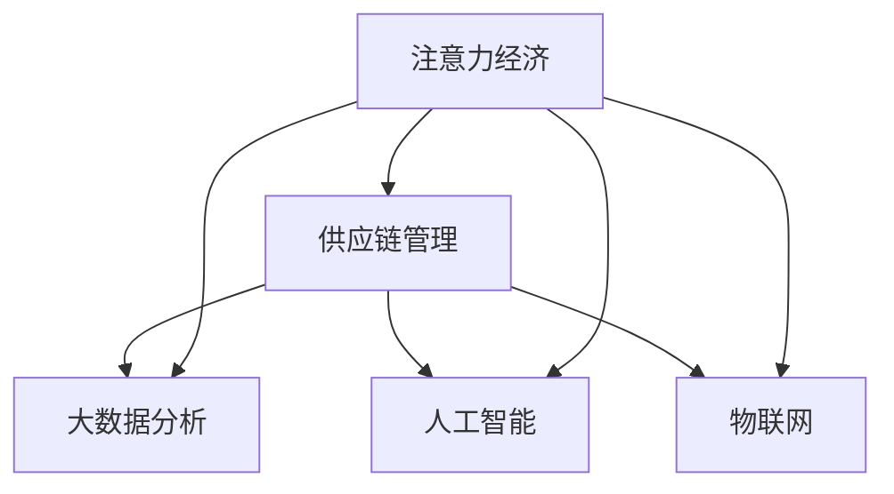

                 

## 1. 背景介绍

### 1.1 问题由来

在数字化转型浪潮的推动下，企业供应链管理正在经历深刻变革。传统的供应链模式越来越难以适应快速变化的市场需求和复杂的业务环境。与此同时，大数据、物联网、人工智能等技术的飞速发展，为供应链管理带来了全新的思路和工具。在众多技术创新中，注意力经济（Attention Economy）因其高效整合资源和精准洞察需求的特点，逐渐成为企业供应链管理的重要支撑。

### 1.2 问题核心关键点

注意力经济的概念最早由经济学家约翰·霍普金斯提出，指的是在信息爆炸的现代社会中，人们难以处理和利用海量的信息资源，只能将注意力集中在少数重要的内容上。对于企业供应链管理而言，注意力经济的应用在于：

- 精准定位消费者需求，优化产品组合
- 识别关键资源，提升供应链效率
- 实时监控市场变化，动态调整策略
- 强化与供应商的合作关系，降低成本

#### 1.2.1 精准定位需求
消费者行为数据的分析是注意力经济在供应链管理中的核心应用。通过对消费者关注的热点、搜索行为、购买历史等数据的深入挖掘，企业可以精准识别市场需求的变化，优化产品组合，提高销售效率。

#### 1.2.2 提升供应链效率
注意力经济能够帮助企业识别和分配关键资源，提升供应链整体效率。例如，通过对生产线的实时监控和优化，能够减少资源浪费，降低生产成本。

#### 1.2.3 动态调整策略
实时监控市场变化，根据消费者反馈和市场趋势调整供应链策略，是注意力经济应用的另一个重要方面。通过及时获取消费者反馈，企业可以快速调整产品策略，优化供应链布局。

#### 1.2.4 强化供应商关系
供应链管理中，供应商是重要的合作伙伴。通过分析供应商的关注点和需求，企业可以更好地与供应商合作，提升供应链稳定性。

### 1.3 问题研究意义

在数字化转型和信息爆炸的背景下，如何高效整合和利用信息资源，成为了供应链管理中的关键问题。注意力经济的应用，为企业提供了一种新型的思路和方法，能够帮助企业更好地理解和响应市场需求，优化供应链管理，提升企业竞争力。

## 2. 核心概念与联系

### 2.1 核心概念概述

为更好地理解注意力经济在企业供应链管理中的应用，本节将介绍几个密切相关的核心概念：

- 注意力经济（Attention Economy）：指在信息爆炸的现代社会中，人们难以处理和利用海量的信息资源，只能将注意力集中在少数重要的内容上。
- 供应链管理（Supply Chain Management）：指企业为了提高效率、降低成本，通过整合资源、优化流程，实现从原材料采购到产品交付的全流程管理。
- 大数据分析（Big Data Analytics）：指通过分析海量数据，挖掘隐藏的模式、趋势和关联，为企业决策提供支撑。
- 人工智能（AI）：指通过机器学习、深度学习等技术，实现自动化决策和智能控制。
- 物联网（IoT）：指通过传感器、智能设备等，实现物理世界和信息世界的深度融合。

这些核心概念之间的逻辑关系可以通过以下Mermaid流程图来展示：



这个流程图展示了大语言模型的核心概念及其之间的关系：

1. 注意力经济是信息时代的产物，对供应链管理有重要影响。
2. 供应链管理需要借助大数据分析、人工智能、物联网等技术手段，提升效率和响应速度。
3. 大数据分析、人工智能、物联网等技术手段，都依赖于注意力经济，用于优化资源配置和信息处理。

这些概念共同构成了企业供应链管理的技术框架，为其提供了一个全面、系统的解决方案。

## 3. 核心算法原理 & 具体操作步骤
### 3.1 算法原理概述

注意力经济在企业供应链管理中的应用，主要基于以下两个核心原理：

1. 数据驱动决策：通过大数据分析技术，企业能够实时获取供应链各环节的运行数据，基于这些数据进行精准决策，优化供应链管理。
2. 智能自动化控制：通过人工智能技术，企业可以实现供应链的智能自动化控制，提升供应链的响应速度和灵活性。

### 3.2 算法步骤详解

注意力经济在企业供应链管理中的应用，通常包括以下几个关键步骤：

**Step 1: 数据收集与预处理**
- 收集供应链各环节的相关数据，包括生产数据、库存数据、物流数据、消费者数据等。
- 清洗和处理数据，去除异常值和噪声，保证数据质量。

**Step 2: 注意力模型构建**
- 使用机器学习或深度学习技术，构建注意力模型。注意力模型能够根据数据的重要程度，自动分配资源，优先处理关键任务。
- 常用的注意力模型包括Transformer模型、自注意力模型等。

**Step 3: 模型训练与优化**
- 使用历史数据训练注意力模型，不断调整模型参数，优化模型的预测能力。
- 根据模型效果进行超参数调优，提升模型性能。

**Step 4: 实时监控与动态调整**
- 将训练好的注意力模型应用到供应链的各个环节，实时监控供应链状态。
- 根据实时监控数据，动态调整供应链策略，提升供应链效率。

**Step 5: 反馈与迭代**
- 收集供应链各环节的反馈数据，评估模型效果。
- 根据反馈数据不断优化模型，提升供应链管理的准确性和可靠性。

### 3.3 算法优缺点

注意力经济在企业供应链管理中的应用，具有以下优点：

1. 数据驱动：通过实时数据分析，能够快速响应市场变化，提升供应链的灵活性和适应性。
2. 智能优化：基于人工智能技术，能够优化供应链资源配置，提升运营效率。
3. 精准决策：通过深度学习模型，能够精准预测市场需求，优化产品组合。
4. 实时监控：能够实时监控供应链状态，及时发现和解决问题，提升供应链稳定性。

同时，注意力经济的应用也存在以下局限性：

1. 数据获取难度：需要大量的实时数据和历史数据，数据获取难度较大。
2. 模型复杂度：注意力模型的训练和优化复杂，需要较长的训练时间和计算资源。
3. 技术门槛高：需要掌握大数据分析、人工智能等先进技术，技术门槛较高。
4. 成本高：需要投入大量的人力和物力进行数据收集和模型训练，成本较高。

尽管存在这些局限性，但就目前而言，注意力经济的应用仍是提升企业供应链管理的重要手段。未来相关研究的重点在于如何进一步降低技术门槛，提高模型效率，降低成本，使其能够更广泛地应用于企业供应链管理中。

### 3.4 算法应用领域

注意力经济在企业供应链管理中的应用，已经广泛应用于多个领域，例如：

- 制造行业：通过实时监控生产线和库存，优化生产计划和库存管理，提升生产效率。
- 零售行业：通过分析消费者行为数据，优化商品陈列和库存管理，提高销售效率。
- 物流行业：通过优化物流路线和运输方式，降低物流成本，提升配送速度。
- 能源行业：通过实时监控能源消耗和生产情况，优化能源分配和生产计划，提升能源利用率。
- 医疗行业：通过分析病人数据和医疗资源，优化医疗资源配置和患者治疗方案，提高医疗服务质量。

除了上述这些领域外，注意力经济在供应链管理中的应用还在不断扩展，为各行各业带来了新的管理思路和方法。

## 4. 数学模型和公式 & 详细讲解 & 举例说明

### 4.1 数学模型构建

本节将使用数学语言对注意力经济在企业供应链管理中的应用进行更加严格的刻画。

设供应链管理涉及的节点数量为 $n$，节点之间的连接关系为 $A$，节点 $i$ 的运行状态为 $x_i$，供应链的目标为最小化总成本 $C$。注意力经济的应用可以通过以下数学模型来描述：

$$
\begin{aligned}
& \min_{x} \sum_{i=1}^{n} c_i x_i \\
& \text{s.t.} \\
& A x = b \\
& x \in \{0,1\}^n
\end{aligned}
$$

其中 $c_i$ 为节点 $i$ 的单位成本，$A$ 为供应链网络矩阵，$b$ 为需求向量，$x_i$ 为节点 $i$ 的运行状态（0表示未运行，1表示运行）。

### 4.2 公式推导过程

上述数学模型中，最小化成本 $C$ 是供应链管理的主要目标，约束条件 $A x = b$ 表示节点之间的连接关系，$x \in \{0,1\}^n$ 表示节点运行状态的取值范围。

通过对约束条件进行线性规划，可以得到最优的节点运行状态 $x^*$ 和对应的总成本 $C^*$。具体推导过程如下：

1. 将约束条件 $A x = b$ 转化为矩阵形式：$Ax - b = 0$。
2. 使用线性规划算法求解 $Ax - b = 0$ 的可行解集合。
3. 在可行解集合中，选取成本最小的解 $x^*$，即为最优的节点运行状态。

通过上述推导过程，可以得到最优的节点运行状态 $x^*$ 和对应的总成本 $C^*$，从而实现对供应链的最优管理。

### 4.3 案例分析与讲解

假设某制造企业生产两种产品 $A$ 和 $B$，生产 $A$ 需要时间为 2 天，生产 $B$ 需要时间为 3 天，单位成本分别为 10 元和 15 元。产品的需求分别为 100 件和 150 件。企业可以使用注意力经济模型来优化生产计划。

首先，建立供应链网络的节点关系矩阵 $A$：

$$
A = \begin{pmatrix}
0 & 1 \\
1 & 0
\end{pmatrix}
$$

其次，根据需求向量 $b = (100, 150)$，求解线性规划问题：

$$
\begin{aligned}
& \min_{x} 10 x_1 + 15 x_2 \\
& \text{s.t.} \\
& \begin{pmatrix}
0 & 1 \\
1 & 0
\end{pmatrix} \begin{pmatrix}
x_1 \\
x_2
\end{pmatrix} = \begin{pmatrix}
100 \\
150
\end{pmatrix} \\
& x_1, x_2 \in \{0,1\}
\end{aligned}
$$

通过求解线性规划问题，可以得到最优的节点运行状态 $x^* = (1, 1)$，对应的总成本 $C^* = 30$ 元。因此，企业可以选择同时生产 $A$ 和 $B$ 两种产品，总成本最小，生产效率最高。

通过这个案例，可以看到，注意力经济在企业供应链管理中的应用，可以通过数学模型进行量化和优化，显著提升生产效率和资源利用率。

## 5. 项目实践：代码实例和详细解释说明
### 5.1 开发环境搭建

在进行注意力经济在企业供应链管理中的应用实践前，我们需要准备好开发环境。以下是使用Python进行SciPy开发的环境配置流程：

1. 安装Anaconda：从官网下载并安装Anaconda，用于创建独立的Python环境。

2. 创建并激活虚拟环境：
```bash
conda create -n attention-env python=3.8 
conda activate attention-env
```

3. 安装SciPy：
```bash
conda install scipy
```

4. 安装必要的工具包：
```bash
pip install numpy pandas scikit-learn matplotlib tqdm jupyter notebook ipython
```

完成上述步骤后，即可在`attention-env`环境中开始项目实践。

### 5.2 源代码详细实现

下面我们以一个简单的供应链优化案例为例，给出使用SciPy库进行供应链优化问题的代码实现。

首先，定义供应链网络关系和需求向量：

```python
from scipy.optimize import linprog
import numpy as np

# 定义网络矩阵
A = np.array([[0, 1], [1, 0]])

# 定义需求向量
b = np.array([100, 150])

# 定义成本向量
c = np.array([10, 15])

# 定义决策变量
x = np.zeros((2, 1))
```

然后，求解线性规划问题：

```python
# 求解线性规划问题
res = linprog(c, A_ub=A, b_ub=b, bounds=(0, None), method='highs')
```

最后，打印输出最优解：

```python
# 打印输出最优解
print("最优解：", res.x)
print("最小成本：", res.fun)
```

### 5.3 代码解读与分析

让我们再详细解读一下关键代码的实现细节：

**线性规划求解**：
- 使用SciPy库中的`linprog`函数求解线性规划问题，`c`为成本向量，`A_ub`和`b_ub`为约束条件的矩阵和向量，`bounds`为变量的取值范围。

**变量定义**：
- 使用`np.zeros`函数定义决策变量`x`，其取值范围为0和1，表示节点的运行状态。

**输出结果**：
- 通过`res.x`和`res.fun`获取最优解和对应的最小成本。

可以看到，通过SciPy库，我们可以轻松实现供应链优化问题的求解，从而优化供应链管理，提高运营效率。

## 6. 实际应用场景
### 6.1 智能制造

智能制造是当前制造业发展的趋势。通过引入注意力经济，企业可以实现生产计划的优化和资源的高效配置，大幅提升生产效率。

在智能制造中，注意力经济可以应用于以下几个方面：

- 生产线的监控与优化：通过实时监控生产线的运行状态，根据设备的使用情况和生产需求，动态调整生产计划，优化资源配置。
- 库存管理的优化：通过分析库存数据和市场需求，优化库存策略，减少库存积压和缺货情况，提高供应链的稳定性。
- 供应链网络的设计：通过分析供应链网络的结构和数据，优化供应链布局，提升供应链的整体效率。

### 6.2 智能物流

智能物流是提高物流效率的重要手段。通过引入注意力经济，企业可以实现物流路径和运输方式的优化，降低物流成本，提升配送速度。

在智能物流中，注意力经济可以应用于以下几个方面：

- 物流路线的优化：通过分析物流数据和市场需求，优化物流路线，减少运输成本和运输时间，提升配送效率。
- 仓储管理的优化：通过实时监控仓储数据和市场需求，优化仓储策略，减少仓储成本，提高库存利用率。
- 物流设备的优化：通过分析物流设备的使用情况和市场需求，优化物流设备的配置，提升物流效率。

### 6.3 智能零售

智能零售是提高零售效率的重要手段。通过引入注意力经济，企业可以实现商品陈列和库存管理的优化，提升销售效率。

在智能零售中，注意力经济可以应用于以下几个方面：

- 商品陈列的优化：通过分析消费者行为数据和市场需求，优化商品陈列，提高商品的曝光率和销售量。
- 库存管理的优化：通过实时监控库存数据和市场需求，优化库存策略，减少库存积压和缺货情况，提高供应链的稳定性。
- 促销策略的优化：通过分析消费者行为数据和市场需求，优化促销策略，提升促销效果，增加销售额。

### 6.4 未来应用展望

随着人工智能和大数据技术的不断发展，注意力经济在企业供应链管理中的应用将更加广泛和深入。未来，注意力经济的应用将涵盖更多的场景和领域，例如：

- 智能农业：通过实时监控农田数据和市场需求，优化农业生产计划，提升农业生产效率。
- 智能金融：通过分析消费者行为数据和市场需求，优化金融产品和服务，提升客户满意度。
- 智能交通：通过实时监控交通数据和市场需求，优化交通网络，提升交通效率。

通过引入注意力经济，企业可以实现供应链管理的智能化、精准化和自动化，提高运营效率和客户满意度，实现高质量发展。

## 7. 工具和资源推荐
### 7.1 学习资源推荐

为了帮助开发者系统掌握注意力经济在企业供应链管理中的应用，这里推荐一些优质的学习资源：

1. 《数据分析与机器学习基础》系列博文：由数据科学家撰写，深入浅出地介绍了数据分析和机器学习的基本概念和经典模型，是学习注意力经济的基础。
2. 《供应链管理》课程：由大学开设的供应链管理课程，涵盖供应链规划、运营、控制等核心内容，是学习注意力经济的应用场景。
3. 《人工智能与智能制造》书籍：介绍人工智能在制造业中的应用，包括智能制造、智能物流等，是学习注意力经济在制造业中的应用的优质资源。
4. 《大数据在供应链中的应用》书籍：介绍大数据在供应链中的各个环节的应用，包括数据采集、数据存储、数据分析等，是学习注意力经济在供应链中的应用场景。
5. 《线性规划理论与算法》书籍：深入介绍线性规划的基本理论和算法，是学习注意力经济中线性规划问题的必备资源。

通过对这些资源的学习实践，相信你一定能够快速掌握注意力经济在企业供应链管理中的应用，并用于解决实际的供应链问题。

### 7.2 开发工具推荐

高效的开发离不开优秀的工具支持。以下是几款用于注意力经济在企业供应链管理中的应用开发的常用工具：

1. Jupyter Notebook：交互式编程环境，支持Python、R等语言，适合快速迭代研究。
2. SciPy：Python科学计算库，提供了丰富的科学计算工具，适合线性规划等数学模型的求解。
3. TensorFlow：谷歌开源的深度学习框架，支持分布式训练和模型部署，适合大规模工程应用。
4. Kaggle：数据科学竞赛平台，提供了大量的数据集和数据处理工具，适合数据驱动的决策。
5. Apache Kafka：分布式流处理系统，适合实时数据流的处理和分析，适合实时监控和动态调整。

合理利用这些工具，可以显著提升注意力经济在企业供应链管理中的应用开发效率，加快创新迭代的步伐。

### 7.3 相关论文推荐

注意力经济在企业供应链管理中的应用源于学界的持续研究。以下是几篇奠基性的相关论文，推荐阅读：

1. 《注意力的经济》：经济学家约翰·霍普金斯提出的注意力经济概念，介绍了注意力经济的背景和应用。
2. 《供应链网络优化》：介绍了供应链网络的基本概念和优化方法，为注意力经济在供应链管理中的应用提供了理论基础。
3. 《深度学习在供应链管理中的应用》：介绍了深度学习在供应链管理中的应用，为注意力经济在供应链管理中的应用提供了技术支撑。
4. 《大数据在供应链中的应用》：介绍了大数据在供应链中的各个环节的应用，为注意力经济在供应链管理中的应用提供了数据支撑。
5. 《线性规划在供应链中的应用》：介绍了线性规划在供应链中的优化方法，为注意力经济在供应链管理中的应用提供了数学工具。

这些论文代表了大语言模型微调技术的发展脉络。通过学习这些前沿成果，可以帮助研究者把握学科前进方向，激发更多的创新灵感。

## 8. 总结：未来发展趋势与挑战

### 8.1 总结

本文对注意力经济在企业供应链管理中的应用进行了全面系统的介绍。首先阐述了注意力经济的背景和核心原理，明确了注意力经济在供应链管理中的应用场景和价值。其次，从原理到实践，详细讲解了注意力经济的应用模型和关键步骤，给出了应用实践的完整代码实例。同时，本文还广泛探讨了注意力经济在智能制造、智能物流、智能零售等诸多行业领域的应用前景，展示了其广泛的应用潜力。此外，本文精选了注意力经济应用的各类学习资源，力求为读者提供全方位的技术指引。

通过本文的系统梳理，可以看到，注意力经济在企业供应链管理中的应用，正逐渐成为现代供应链管理的重要手段，能够帮助企业更好地理解市场需求，优化资源配置，提升运营效率。

### 8.2 未来发展趋势

展望未来，注意力经济在企业供应链管理中的应用将呈现以下几个发展趋势：

1. 实时化：随着物联网和大数据技术的不断进步，企业能够实时获取供应链各环节的数据，实现供应链的动态监控和优化。
2. 智能化：结合人工智能技术，企业可以实现供应链的智能控制和决策，提高供应链的响应速度和灵活性。
3. 精准化：通过深度学习等技术，企业可以实现对消费者需求的精准预测和优化，提升供应链的适应性和稳定性。
4. 可视化：利用数据可视化工具，企业可以直观地展示供应链的运行状态和优化效果，帮助管理层进行决策。
5. 集成化：将注意力经济与其他先进技术手段（如区块链、物联网等）集成，形成更加全面、高效的供应链管理解决方案。

以上趋势凸显了注意力经济在企业供应链管理中的应用前景。这些方向的探索发展，必将进一步提升供应链管理的智能化、精准化和自动化水平，为企业带来更高的运营效率和更高的客户满意度。

### 8.3 面临的挑战

尽管注意力经济在企业供应链管理中的应用已经取得了显著成果，但在迈向更加智能化、精准化应用的过程中，它仍面临诸多挑战：

1. 数据获取难度：需要大量的实时数据和历史数据，数据获取难度较大。
2. 技术门槛高：需要掌握大数据分析、人工智能等先进技术，技术门槛较高。
3. 系统复杂度：注意力经济系统的设计和实现复杂，需要综合考虑数据采集、模型训练、实时监控等多个环节。
4. 成本高：需要投入大量的人力和物力进行数据收集和模型训练，成本较高。
5. 安全风险：供应链数据的隐私和安全问题，需要有效的数据保护措施。

尽管存在这些挑战，但通过不断的技术创新和应用实践，相信注意力经济在企业供应链管理中的应用将得到进一步推广和普及，为企业带来更加高效、精准、智能化的供应链管理解决方案。

### 8.4 研究展望

面对注意力经济在企业供应链管理中的应用面临的种种挑战，未来的研究需要在以下几个方面寻求新的突破：

1. 数据融合与集成：将不同来源的数据进行融合和集成，形成统一的数据视图，提升供应链数据的完整性和一致性。
2. 数据治理与隐私保护：建立数据治理框架，规范数据采集、存储、处理和共享，确保供应链数据的安全性和隐私性。
3. 技术栈优化：采用先进的技术手段（如云计算、区块链等），优化注意力经济系统的技术栈，提升系统性能和稳定性。
4. 智能决策引擎：结合人工智能技术，开发智能决策引擎，实现供应链的智能控制和决策。
5. 跨领域应用：将注意力经济应用于更多领域，如智能农业、智能金融、智能交通等，形成通用的供应链管理解决方案。

这些研究方向的探索，必将引领注意力经济在企业供应链管理中的应用走向更加成熟，为企业的数字化转型提供更强大的支撑。

## 9. 附录：常见问题与解答

**Q1：注意力经济在企业供应链管理中的应用是否适用于所有企业？**

A: 注意力经济在企业供应链管理中的应用，适用于大部分企业，特别是那些拥有丰富数据资源和先进技术的企业。但对于一些规模较小、数据获取能力有限的企业，需要根据自身实际情况进行适当调整和优化。

**Q2：注意力经济在供应链管理中的应用是否需要大规模的计算资源？**

A: 注意力经济在供应链管理中的应用，通常需要大量的计算资源进行数据处理和模型训练。因此，对于计算资源有限的中小企业，需要采用一些优化策略，如分布式计算、云计算等，降低计算成本。

**Q3：注意力经济在供应链管理中的应用是否需要大量的实时数据？**

A: 注意力经济在供应链管理中的应用，确实需要大量的实时数据进行决策和优化。对于数据获取能力有限的企业，可以通过定期采集和补充数据，逐步提高数据质量和实时性。

**Q4：注意力经济在供应链管理中的应用是否需要高水平的专家团队？**

A: 注意力经济在供应链管理中的应用，需要高水平的专家团队进行设计和实施。但对于一般企业，可以通过引入外部专家或培训内部团队，逐步提升团队的专业能力。

**Q5：注意力经济在供应链管理中的应用是否需要高昂的初始投入？**

A: 注意力经济在供应链管理中的应用，需要一定的初始投入进行系统设计和数据采集。但相比于传统的供应链管理方式，其长期收益（如提高效率、降低成本）更为显著，对于追求高效、精准管理的企业而言，高昂的初始投入是值得的。

通过这些问题的回答，可以看到，注意力经济在企业供应链管理中的应用，虽然面临一定的挑战，但其应用前景广阔，通过不断的技术创新和实践探索，必将为企业的数字化转型带来巨大的推动作用。

---

作者：禅与计算机程序设计艺术 / Zen and the Art of Computer Programming

