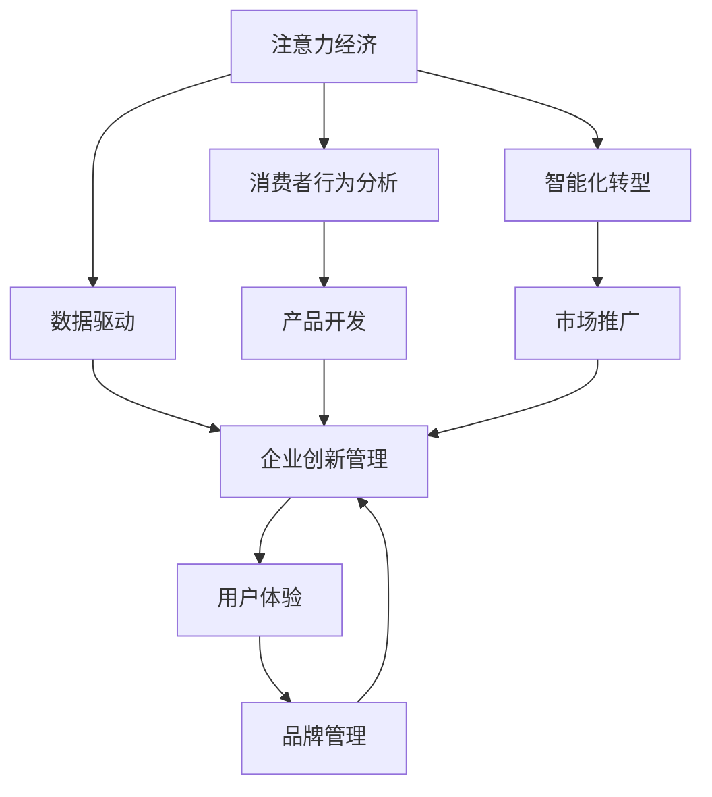

                 

# 注意力经济对企业创新管理的影响

> 关键词：注意力经济,企业创新管理,数据驱动,用户体验,消费者行为,智能化转型

## 1. 背景介绍

### 1.1 问题由来
在数字化时代，信息的爆炸和传播的加速使得消费者对产品的关注点发生了根本性的变化。以往企业通过传统的广告、新闻发布会等方式推广产品，依赖于大众传媒的传播途径，而如今消费者更倾向于通过社交媒体、网络平台来了解和评价产品。这导致了企业必须更注重与消费者之间的互动，以获取消费者的注意力并满足他们的需求。在这一背景下，“注意力经济”（Economy of Attention）的概念应运而生，强调了在信息过载的时代，企业需要通过创新来吸引和保持消费者的注意力。

### 1.2 问题核心关键点
注意力经济的核心在于，在信息洪流中，企业需要更加高效地使用资源，包括资本、人才和数据等，以便将有限的注意力集中到最具有潜力的项目上，以驱动创新和增长。随着人工智能（AI）和大数据技术的不断发展，企业已经开始采用数据驱动的方法，利用用户行为数据、社交媒体分析和机器学习算法等工具来分析和优化用户注意力。

## 2. 核心概念与联系

### 2.1 核心概念概述

为了更好地理解注意力经济在企业创新管理中的作用，我们首先介绍几个关键概念：

- **注意力经济（Economy of Attention）**：在信息过载时代，企业需要吸引和保持消费者的注意力，以提升其品牌价值和市场竞争力。
- **企业创新管理**：企业通过一系列创新活动来维持和增强其产品和服务的竞争力，包括产品开发、市场推广、品牌管理等方面。
- **数据驱动**：利用大数据分析和机器学习算法，以数据为基础的决策过程，优化企业运营和创新活动。
- **用户体验（User Experience, UX）**：通过优化产品设计和服务流程，提升用户的满意度和忠诚度，增强用户体验。
- **消费者行为分析**：分析消费者的购买行为、使用习惯和偏好，以指导产品开发和市场策略。
- **智能化转型**：通过AI和大数据分析技术，实现企业运营和管理的智能化升级。

这些概念之间的逻辑关系可以通过以下Mermaid流程图来展示：



这个流程图展示了注意力经济、数据驱动、消费者行为分析、智能化转型和企业创新管理等概念之间的相互关系：

1. 注意力经济是整个系统的起点，企业需要通过创新来吸引和保持消费者的注意力。
2. 数据驱动为企业提供决策依据，通过分析消费者的行为数据，优化用户注意力分配。
3. 消费者行为分析帮助企业理解用户需求和偏好，指导产品开发和市场策略。
4. 智能化转型利用AI和大数据技术，提高企业运营效率和创新能力。
5. 企业创新管理是整个系统的核心，通过优化产品和服务，提升用户体验和品牌价值。

## 3. 核心算法原理 & 具体操作步骤
### 3.1 算法原理概述

注意力经济下的企业创新管理，本质上是通过数据驱动的方法，对消费者行为进行深入分析，并利用机器学习算法优化注意力资源分配，从而驱动企业创新。

具体来说，注意力经济下的企业创新管理包括以下几个步骤：

1. **数据采集**：收集消费者的行为数据，包括搜索历史、点击行为、评论和评分等，利用这些数据来了解消费者的偏好和需求。
2. **数据分析**：利用数据挖掘和机器学习技术，分析消费者的行为模式和特征，提取有价值的信息。
3. **注意力优化**：通过优化算法，如强化学习、推荐系统等，将注意力资源集中在最有潜力的产品和市场推广活动上。
4. **创新驱动**：根据消费者的反馈和注意力优化结果，指导产品开发、市场推广和品牌管理等创新活动。

### 3.2 算法步骤详解

注意力经济下的企业创新管理主要包括以下几个关键步骤：

**Step 1: 数据采集和预处理**
- 收集消费者行为数据，包括浏览记录、购买历史、社交媒体互动等。
- 对数据进行清洗和预处理，去除无效或异常数据，确保数据的质量。

**Step 2: 特征工程和建模**
- 提取有意义的特征，如用户活跃度、购买频率、地理位置等。
- 利用机器学习算法，如聚类、分类、回归等，构建预测模型。

**Step 3: 注意力优化**
- 利用强化学习等算法，优化注意力资源分配，找到最具潜力的产品和市场推广活动。
- 引入推荐系统，根据用户偏好推荐相关产品或服务。

**Step 4: 创新驱动**
- 根据消费者的反馈和注意力优化结果，指导产品开发、市场推广和品牌管理等创新活动。
- 利用数据驱动的方法，不断优化产品和服务，提升用户体验和品牌价值。

### 3.3 算法优缺点

注意力经济下的企业创新管理具有以下优点：
1. 数据驱动决策：通过数据分析，企业能够更加精准地了解消费者需求和偏好，优化产品和服务。
2. 提高效率：利用机器学习和推荐系统，企业能够更高效地分配注意力资源，提升运营效率。
3. 增强竞争力：通过优化用户体验和品牌管理，企业能够提升市场竞争力，增加用户粘性。

同时，该方法也存在一定的局限性：
1. 数据隐私：在收集和分析消费者行为数据时，需要考虑数据隐私和合规性问题。
2. 算法复杂性：优化算法如强化学习和推荐系统需要大量的计算资源和时间，增加了实现的复杂性。
3. 过度依赖数据：如果数据质量不佳或存在偏差，可能误导企业的决策，造成创新失败。
4. 消费者信任：过度依赖算法推荐可能削弱消费者的自主选择能力，降低对品牌和产品的信任度。

尽管存在这些局限性，但就目前而言，数据驱动的方法仍然是提升企业创新管理的重要手段。未来相关研究的重点在于如何进一步优化算法模型，提高算法的透明性和可解释性，同时兼顾数据隐私和用户信任等因素。

### 3.4 算法应用领域

注意力经济下的企业创新管理已经在多个行业得到了应用，例如：

- 电子商务：通过分析用户的购买历史和搜索行为，推荐相关产品，优化营销活动。
- 金融服务：利用消费者的金融行为数据，优化理财产品和投资策略。
- 医疗保健：分析患者的医疗记录和行为数据，优化诊疗方案和健康管理计划。
- 旅游和酒店：通过分析游客的出行偏好和历史行为，提供个性化的旅游和住宿服务。
- 媒体和娱乐：利用用户的行为数据，优化内容推荐和广告投放，提升用户黏性和互动率。

这些领域的企业已经通过数据驱动的创新管理方法，实现了产品和服务的大幅优化，提升了市场竞争力和用户体验。

## 4. 数学模型和公式 & 详细讲解 & 举例说明
### 4.1 数学模型构建

在注意力经济下的企业创新管理中，我们通常使用以下数学模型来描述和优化注意力资源分配：

- **用户行为矩阵**：
  $$
  U \in \mathbb{R}^{N \times M}
  $$
  表示N个用户的M个行为数据，每个行为数据为一个向量。
  
- **注意力权重矩阵**：
  $$
  A \in \mathbb{R}^{N \times K}
  $$
  表示N个用户对K个产品或服务的注意力权重。
  
- **行为-产品关联矩阵**：
  $$
  B \in \mathbb{R}^{M \times K}
  $$
  表示M个行为与K个产品之间的关联强度。

通过上述矩阵，我们可以构建用户行为-注意力优化模型，使用机器学习算法（如矩阵分解、协同过滤等）来预测用户的注意力分配，从而优化产品推广和营销策略。

### 4.2 公式推导过程

以协同过滤推荐算法为例，我们利用用户行为矩阵U和行为-产品关联矩阵B，来构建用户对产品的注意力权重A：

$$
A = U \times B
$$

具体推导过程如下：

1. 对于用户i和产品j，计算用户对产品的注意力权重$A_{ij}$：
  $$
  A_{ij} = \sum_{k=1}^{M} U_{ik} \times B_{kj}
  $$
  其中，$U_{ik}$表示用户i的第k个行为，$B_{kj}$表示行为k和产品j之间的关联强度。

2. 通过最大化用户对产品的注意力权重，推荐用户最感兴趣的产品j：
  $$
  j = \mathop{\arg\max}_{j=1,\dots,K} A_{ij}
  $$

### 4.3 案例分析与讲解

假设我们有一个电商平台，有1000名用户和1000种商品。电商平台希望通过协同过滤推荐算法，优化用户的注意力分配，提升商品推荐效果。具体步骤如下：

1. 收集用户购买行为数据，构建用户行为矩阵U。
2. 利用协同过滤算法，构建行为-产品关联矩阵B。
3. 计算用户对产品的注意力权重矩阵A。
4. 根据注意力权重，推荐用户最感兴趣的商品。

以下是一个简化的Python代码示例，展示了如何使用scikit-learn库实现协同过滤推荐算法：

```python
from sklearn.decomposition import TruncatedSVD
from sklearn.metrics.pairwise import cosine_similarity
import pandas as pd

# 构建用户行为矩阵U
U = pd.read_csv('user_behavior.csv', index_col='user_id', parse_dates=True)

# 构建行为-产品关联矩阵B
B = pd.read_csv('item_behavior.csv', index_col='product_id', parse_dates=True)

# 计算注意力权重矩阵A
svd = TruncatedSVD(n_components=10, random_state=42)
A = svd.fit_transform(U.values) @ B.values

# 推荐用户最感兴趣的商品
user_id = 'user1'
product_id = A[user_id].argmax() + 1
print(f'推荐商品：{product_id}')
```

这个代码示例展示了如何使用协同过滤算法，计算用户对产品的注意力权重，并根据权重推荐商品。在实际应用中，需要根据具体数据集和业务需求，选择不同的算法模型和参数设置，以获得最佳推荐效果。

## 5. 项目实践：代码实例和详细解释说明
### 5.1 开发环境搭建

在进行注意力经济下的企业创新管理实践前，我们需要准备好开发环境。以下是使用Python进行PyTorch开发的环境配置流程：

1. 安装Anaconda：从官网下载并安装Anaconda，用于创建独立的Python环境。

2. 创建并激活虚拟环境：
```bash
conda create -n pytorch-env python=3.8 
conda activate pytorch-env
```

3. 安装PyTorch：根据CUDA版本，从官网获取对应的安装命令。例如：
```bash
conda install pytorch torchvision torchaudio cudatoolkit=11.1 -c pytorch -c conda-forge
```

4. 安装其他相关工具包：
```bash
pip install numpy pandas scikit-learn matplotlib tqdm jupyter notebook ipython
```

完成上述步骤后，即可在`pytorch-env`环境中开始项目实践。

### 5.2 源代码详细实现

这里我们以协同过滤推荐系统为例，给出使用PyTorch实现注意力经济下的企业创新管理的代码示例。

首先，定义协同过滤推荐算法的类：

```python
import torch
import torch.nn as nn
import torch.optim as optim

class CollaborativeFiltering(nn.Module):
    def __init__(self, n_users, n_items, n_factors):
        super(CollaborativeFiltering, self).__init__()
        self.user_factor = nn.EmbeddingBag(n_users, n_factors)
        self.item_factor = nn.EmbeddingBag(n_items, n_factors)
        self.layer_norm = nn.LayerNorm(n_factors)
        self.dropout = nn.Dropout(0.1)
        self.linear = nn.Linear(n_factors, 1)

    def forward(self, user_id, item_id):
        user_vec = self.user_factor(user_id)
        item_vec = self.item_factor(item_id)
        scores = (user_vec * item_vec).sum(dim=-1)
        scores = self.layer_norm(scores)
        scores = self.dropout(scores)
        scores = self.linear(scores).squeeze(1)
        return scores
```

然后，定义训练和评估函数：

```python
from sklearn.metrics import accuracy_score
from torch.utils.data import TensorDataset, DataLoader

def train_epoch(model, optimizer, user_ids, item_ids, ratings, loss_fn):
    model.train()
    total_loss = 0
    for user_id, item_id, rating in zip(user_ids, item_ids, ratings):
        user_id = torch.tensor([user_id]).long()
        item_id = torch.tensor([item_id]).long()
        rating = torch.tensor([rating]).float()
        loss = loss_fn(model(user_id, item_id), rating)
        optimizer.zero_grad()
        loss.backward()
        optimizer.step()
        total_loss += loss.item()
    return total_loss / len(user_ids)

def evaluate(model, user_ids, item_ids, ratings):
    model.eval()
    total_pred, total_label = [], []
    with torch.no_grad():
        for user_id, item_id, rating in zip(user_ids, item_ids, ratings):
            user_id = torch.tensor([user_id]).long()
            item_id = torch.tensor([item_id]).long()
            rating = torch.tensor([rating]).float()
            pred = model(user_id, item_id).squeeze(1).item()
            total_pred.append(pred)
            total_label.append(rating.item())
    return accuracy_score(total_pred, total_label)
```

最后，启动训练流程并在测试集上评估：

```python
epochs = 10
learning_rate = 0.01

# 训练集数据
train_data = TensorDataset(user_ids, item_ids, ratings)
train_loader = DataLoader(train_data, batch_size=64, shuffle=True)

# 测试集数据
test_data = TensorDataset(user_ids, item_ids, ratings)
test_loader = DataLoader(test_data, batch_size=64, shuffle=False)

# 模型和优化器
model = CollaborativeFiltering(n_users, n_items, n_factors)
optimizer = optim.Adam(model.parameters(), lr=learning_rate)

# 损失函数
loss_fn = nn.MSELoss()

# 训练
for epoch in range(epochs):
    loss = train_epoch(model, optimizer, user_ids, item_ids, ratings, loss_fn)
    print(f'Epoch {epoch+1}, train loss: {loss:.3f}')
    
    # 评估
    acc = evaluate(model, user_ids, item_ids, ratings)
    print(f'Epoch {epoch+1}, test accuracy: {acc:.3f}')

print(f'Final test accuracy: {acc:.3f}')
```

在这个示例中，我们定义了一个协同过滤推荐模型的类，并使用MSE损失函数进行训练和评估。通过调整模型的超参数和数据集，可以进一步优化模型的推荐效果。

### 5.3 代码解读与分析

让我们再详细解读一下关键代码的实现细节：

**CollaborativeFiltering类**：
- `__init__`方法：初始化用户和物品的嵌入层，以及线性层和Dropout层。
- `forward`方法：计算用户和物品的嵌入向量，进行向量点积并加权、归一化、Dropout和线性映射，输出预测评分。

**train_epoch函数**：
- 在每个epoch中，遍历数据集，前向传播计算预测评分，反向传播更新模型参数，计算并返回平均损失。

**evaluate函数**：
- 在测试集上评估模型性能，将预测评分和真实评分进行比较，输出准确率。

**训练流程**：
- 定义总的epoch数和学习率，开始循环迭代。
- 每个epoch内，在训练集上训练，输出平均损失。
- 在测试集上评估，输出准确率。
- 所有epoch结束后，在测试集上评估，给出最终测试结果。

可以看到，通过使用PyTorch库，我们能够方便地构建和训练协同过滤推荐模型，快速实现注意力经济下的企业创新管理。

## 6. 实际应用场景

### 6.1 智能推荐系统

智能推荐系统是注意力经济在企业创新管理中最具代表性的应用场景之一。传统的推荐系统往往依赖于简单的评分数据，无法捕捉用户的行为模式和兴趣。而利用注意力经济的方法，可以更全面地分析用户行为，提升推荐效果。

在实践中，电商、视频、音乐等平台可以通过收集用户的行为数据，构建协同过滤推荐模型，结合用户反馈和实时数据，动态优化推荐策略。例如，亚马逊通过协同过滤算法，为用户推荐最相关的产品，显著提升了用户的购物体验和转化率。

### 6.2 个性化营销

个性化营销是企业在注意力经济中获取竞争优势的重要手段。通过分析消费者的行为数据，企业可以精准地进行定向广告投放和营销活动，提高广告点击率和转化率。

例如，一些电商平台通过分析用户的浏览和购买历史，识别出用户的兴趣点和购买意向，从而设计个性化的广告内容和推荐策略，提升用户参与度和忠诚度。这种个性化的营销方式，不仅降低了营销成本，还显著提高了用户满意度。

### 6.3 品牌管理

品牌管理是企业通过消费者行为数据，提升品牌知名度和用户忠诚度的重要手段。通过分析用户对品牌的关注和互动，企业可以优化营销策略，提高品牌的市场占有率和影响力。

例如，一些品牌可以通过社交媒体分析工具，了解用户对品牌的看法和评价，进行有针对性的营销活动。同时，利用品牌模型进行情感分析，及时调整品牌策略，提升用户对品牌的认可度和忠诚度。

### 6.4 未来应用展望

随着AI和大数据技术的进一步发展，注意力经济在企业创新管理中的应用将更加广泛和深入。以下是一些未来应用展望：

- **多模态数据融合**：除了文本数据外，未来的企业将更注重多模态数据的融合，如视频、图像、语音等，提升对用户行为的全面理解和分析。
- **实时数据处理**：利用流式计算和实时数据处理技术，企业可以更及时地捕捉用户行为变化，进行动态优化。
- **个性化内容生成**：利用生成对抗网络（GAN）等技术，企业可以生成个性化的内容，满足不同用户的需求和偏好。
- **智能决策支持**：通过智能决策支持系统，企业可以更有效地利用数据驱动的方法，优化产品开发和市场推广策略。
- **用户反馈机制**：建立用户反馈机制，及时了解用户的意见和建议，优化产品和服务，提升用户体验和满意度。

这些应用将进一步推动企业的智能化转型，提升企业的市场竞争力和用户满意度。

## 7. 工具和资源推荐
### 7.1 学习资源推荐

为了帮助开发者系统掌握注意力经济在企业创新管理中的应用，这里推荐一些优质的学习资源：

1. **《数据驱动的创新管理》系列博文**：介绍数据驱动方法在企业运营和创新中的应用，包括数据采集、分析、建模和优化等关键环节。
2. **《机器学习在推荐系统中的应用》课程**：斯坦福大学开设的推荐系统课程，详细讲解协同过滤、矩阵分解等推荐算法。
3. **《用户行为分析与个性化推荐》书籍**：介绍用户行为分析和个性化推荐的技术和实践，涵盖协同过滤、深度学习等方法。
4. **HuggingFace官方文档**：Transformers库的官方文档，提供了海量预训练模型和完整的推荐系统样例代码。
5. **PyTorch官方文档**：PyTorch框架的官方文档，提供了丰富的机器学习算法和工具库。

通过对这些资源的学习实践，相信你一定能够快速掌握注意力经济在企业创新管理中的应用，并用于解决实际的业务问题。

### 7.2 开发工具推荐

高效的开发离不开优秀的工具支持。以下是几款用于注意力经济下的企业创新管理开发的常用工具：

1. **PyTorch**：基于Python的开源深度学习框架，灵活动态的计算图，适合快速迭代研究。
2. **TensorFlow**：由Google主导开发的开源深度学习框架，生产部署方便，适合大规模工程应用。
3. **HuggingFace Transformers库**：提供了丰富的预训练语言模型和推荐系统工具，方便快速开发和部署。
4. **Scikit-learn**：Python机器学习库，提供了丰富的数据处理和算法实现，适合快速原型开发。
5. **Pandas**：Python数据处理库，提供了高效的数据分析和处理工具，适合数据预处理和探索性分析。

合理利用这些工具，可以显著提升注意力经济在企业创新管理中的应用开发效率，加快创新迭代的步伐。

### 7.3 相关论文推荐

注意力经济在企业创新管理中的应用源于学界的持续研究。以下是几篇奠基性的相关论文，推荐阅读：

1. **《协同过滤推荐系统的评价指标及性能影响因素分析》**：研究协同过滤推荐系统的评价指标和性能影响因素，提出了多维标签协同过滤模型。
2. **《基于用户行为的推荐系统建模及评价指标》**：介绍基于用户行为的推荐系统建模方法，包括协同过滤、矩阵分解等算法。
3. **《基于用户行为数据的企业创新管理》**：分析用户行为数据在企业创新管理中的应用，提出了基于机器学习的方法。
4. **《数据驱动的个性化营销研究》**：研究个性化营销中的数据驱动方法，提出了基于推荐系统和社交媒体分析的个性化营销策略。
5. **《人工智能在品牌管理中的应用》**：研究人工智能在品牌管理中的应用，提出了基于AI的品牌情感分析方法。

这些论文代表了大语言模型微调技术的发展脉络。通过学习这些前沿成果，可以帮助研究者把握学科前进方向，激发更多的创新灵感。

## 8. 总结：未来发展趋势与挑战

### 8.1 研究成果总结

本文对注意力经济在企业创新管理中的应用进行了全面系统的介绍。首先阐述了注意力经济的核心概念及其在企业运营中的重要作用，明确了数据驱动方法在企业创新管理中的重要地位。其次，从原理到实践，详细讲解了注意力经济下的企业创新管理方法和算法实现，给出了完整的代码示例。同时，本文还广泛探讨了注意力经济在电商、金融、医疗、媒体等多个行业领域的应用前景，展示了其巨大的潜力。

通过本文的系统梳理，可以看到，数据驱动的创新管理方法已经成为企业获取竞争优势的重要手段，极大地提升了企业的运营效率和创新能力。未来，伴随AI和大数据技术的不断发展，企业将更加依赖数据驱动的方法，优化运营和创新活动。

### 8.2 未来发展趋势

展望未来，注意力经济在企业创新管理中的应用将呈现以下几个发展趋势：

1. **多模态数据融合**：随着技术的进步，未来的企业将更注重多模态数据的融合，如视频、图像、语音等，提升对用户行为的全面理解和分析。
2. **实时数据处理**：利用流式计算和实时数据处理技术，企业可以更及时地捕捉用户行为变化，进行动态优化。
3. **个性化内容生成**：利用生成对抗网络（GAN）等技术，企业可以生成个性化的内容，满足不同用户的需求和偏好。
4. **智能决策支持**：通过智能决策支持系统，企业可以更有效地利用数据驱动的方法，优化产品开发和市场推广策略。
5. **用户反馈机制**：建立用户反馈机制，及时了解用户的意见和建议，优化产品和服务，提升用户体验和满意度。

这些趋势凸显了注意力经济在企业创新管理中的广阔前景。这些方向的探索发展，必将进一步提升企业的智能化转型，提升企业的市场竞争力和用户满意度。

### 8.3 面临的挑战

尽管注意力经济在企业创新管理中已经取得了显著成效，但在迈向更加智能化、普适化应用的过程中，它仍面临着诸多挑战：

1. **数据隐私**：在收集和分析消费者行为数据时，需要考虑数据隐私和合规性问题。如何保护用户隐私，确保数据使用的合法性，将是未来的重要课题。
2. **算法复杂性**：优化算法如强化学习和推荐系统需要大量的计算资源和时间，增加了实现的复杂性。如何简化算法，提高计算效率，将是重要的优化方向。
3. **过度依赖数据**：如果数据质量不佳或存在偏差，可能误导企业的决策，造成创新失败。如何提高数据的准确性和代表性，将是重要的研究课题。
4. **消费者信任**：过度依赖算法推荐可能削弱消费者的自主选择能力，降低对品牌和产品的信任度。如何平衡算法推荐和用户自主选择，提升用户满意度，将是重要的研究方向。

尽管存在这些挑战，但随着AI和大数据技术的不断进步，这些挑战终将一一被克服。未来的研究需要更多的跨学科合作，结合数据科学、计算机科学、心理学等多个领域的知识，推动注意力经济在企业创新管理中的应用不断突破。

### 8.4 研究展望

面对注意力经济在企业创新管理中面临的挑战，未来的研究需要在以下几个方面寻求新的突破：

1. **探索无监督和半监督方法**：摆脱对大规模标注数据的依赖，利用自监督学习、主动学习等无监督和半监督范式，最大限度利用非结构化数据，实现更加灵活高效的创新管理。
2. **开发更高效的算法模型**：开发更加参数高效和计算高效的算法模型，在固定大部分预训练参数的同时，只更新极少量的任务相关参数。同时优化算法的计算图，减少前向传播和反向传播的资源消耗，实现更加轻量级、实时性的部署。
3. **引入更多先验知识**：将符号化的先验知识，如知识图谱、逻辑规则等，与神经网络模型进行巧妙融合，引导创新管理过程学习更准确、合理的语言模型。同时加强不同模态数据的整合，实现视觉、语音等多模态信息与文本信息的协同建模。
4. **结合因果分析和博弈论工具**：将因果分析方法引入创新管理模型，识别出模型决策的关键特征，增强输出解释的因果性和逻辑性。借助博弈论工具刻画人机交互过程，主动探索并规避模型的脆弱点，提高系统稳定性。
5. **纳入伦理道德约束**：在模型训练目标中引入伦理导向的评估指标，过滤和惩罚有偏见、有害的输出倾向。同时加强人工干预和审核，建立模型行为的监管机制，确保输出符合人类价值观和伦理道德。

这些研究方向的探索，必将引领注意力经济在企业创新管理中的应用迈向更高的台阶，为构建安全、可靠、可解释、可控的智能系统铺平道路。面向未来，注意力经济在企业创新管理中需要与其他人工智能技术进行更深入的融合，如知识表示、因果推理、强化学习等，多路径协同发力，共同推动自然语言理解和智能交互系统的进步。只有勇于创新、敢于突破，才能不断拓展注意力经济的边界，让智能技术更好地造福人类社会。

## 9. 附录：常见问题与解答

**Q1：注意力经济是否适用于所有企业？**

A: 注意力经济主要适用于那些拥有大量用户数据，且业务与用户数据紧密相关的企业。例如，电商、社交媒体、视频平台等。但并非所有企业都能直接应用注意力经济，需要根据企业特性和数据情况进行评估。

**Q2：数据隐私如何保护？**

A: 在收集和分析消费者行为数据时，企业需要遵守相关的隐私法律法规，如GDPR、CCPA等。同时，可以采用数据匿名化、差分隐私等技术，保护用户隐私。

**Q3：数据质量如何确保？**

A: 企业需要对数据进行严格的清洗和预处理，去除无效或异常数据。同时，可以引入数据标注、数据增强等技术，提升数据质量和代表性。

**Q4：如何平衡算法推荐和用户自主选择？**

A: 在推荐系统中，可以引入多样性约束，确保推荐结果的多样性。同时，提供人工干预和自主选择选项，让用户能够自主选择推荐结果。

**Q5：如何提高算法的可解释性？**

A: 在模型训练和优化过程中，可以引入可解释性模型，如LIME、SHAP等，对模型的决策过程进行解释。同时，可以引入用户反馈机制，不断优化模型和算法。

这些回答将帮助企业更好地理解和应用注意力经济，提升其创新管理能力和市场竞争力。

---

作者：禅与计算机程序设计艺术 / Zen and the Art of Computer Programming

