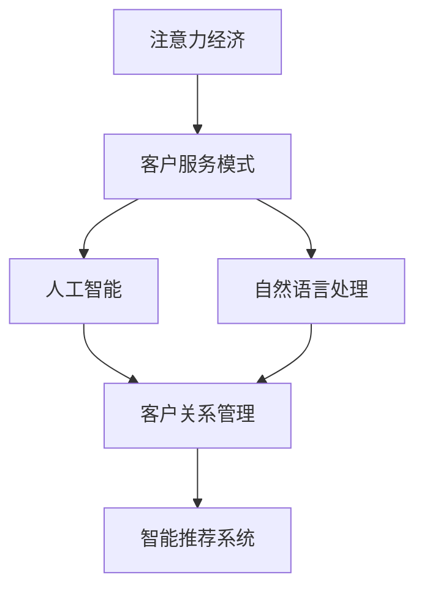

                 

# 注意力经济对企业客户服务模式的改变

## 1. 背景介绍

在数字化时代，企业面临着前所未有的机遇与挑战。客户需求的多样化和个性化，催生了以客户为中心的服务模式转型。与此同时，注意力经济的出现，为企业提供了新的视角和工具，以提高客户服务的效率和质量。

### 1.1 数字化转型的驱动因素

数字化转型不仅是技术革新，更是理念变革。以下因素推动了数字化转型的进程：

- **技术进步**：云计算、大数据、人工智能等新兴技术的成熟，提供了更加灵活、高效的服务基础设施。
- **客户需求**：消费者对个性化、即时性、自助性服务的要求日益增加，推动了客户服务模式的变革。
- **市场竞争**：数字化成为企业竞争的新战场，敏捷响应和精准服务成为胜负的关键。

### 1.2 注意力经济的出现

注意力经济是指在信息过载的时代，企业需要争夺和利用用户的注意力资源，以获得市场份额和竞争优势。这一概念最早由马克·波斯特提出，强调了信息时代注意力资源的稀缺性和价值。

注意力经济的核心在于如何高效利用用户注意力，实现产品、服务和营销的精准推送，提高用户满意度和品牌忠诚度。这对于企业客户服务模式的转变，具有重要意义。

## 2. 核心概念与联系

### 2.1 核心概念概述

为了更好地理解注意力经济如何改变客户服务模式，本节将介绍几个核心概念：

- **注意力经济**：企业通过争夺用户注意力，实现市场竞争优势的经济模式。
- **客户服务模式**：企业在产品和服务交付过程中，对客户需求和反馈的响应方式。
- **人工智能(AI)**：通过模拟人类智能，使计算机能够执行复杂的任务。
- **自然语言处理(NLP)**：使计算机能够理解、解释和生成人类语言的技术。
- **客户关系管理(CRM)**：通过技术手段管理客户数据和互动，提升客户体验。
- **智能推荐系统**：利用算法推荐个性化内容和服务，提高用户满意度。

这些核心概念之间的逻辑关系可以通过以下Mermaid流程图来展示：



这个流程图展示了几大核心概念之间的关联：

1. 注意力经济通过争夺用户注意力，提升企业竞争优势。
2. 客户服务模式是企业对客户需求和反馈的响应方式。
3. 人工智能通过模拟人类智能，实现复杂任务。
4. 自然语言处理使计算机能够理解人类语言。
5. 客户关系管理通过技术手段提升客户体验。
6. 智能推荐系统利用算法推荐个性化内容。

## 3. 核心算法原理 & 具体操作步骤

### 3.1 算法原理概述

注意力经济对客户服务模式的改变，主要体现在以下几个方面：

- **数据驱动**：通过大数据分析，了解用户行为和偏好，提供个性化的服务。
- **AI支持**：利用AI技术，如自然语言处理、机器学习等，提高服务效率和准确性。
- **自动化流程**：通过自动化工具和流程，减少人工干预，提高服务响应速度。
- **实时反馈**：实时收集用户反馈，动态调整服务策略，持续优化用户体验。

### 3.2 算法步骤详解

以下是实现注意力经济对客户服务模式改变的具体步骤：

**Step 1: 数据收集与分析**
- 收集客户的历史行为数据，包括购买记录、浏览记录、服务请求等。
- 利用数据挖掘和机器学习算法，分析用户偏好、兴趣点、行为模式等。

**Step 2: 构建客户画像**
- 根据分析结果，构建详细的客户画像，包含用户的年龄、性别、消费习惯、兴趣偏好等信息。
- 利用数据可视化工具，直观展示客户画像，便于服务团队的快速理解。

**Step 3: 智能推荐系统设计**
- 设计智能推荐算法，根据客户画像和行为数据，推荐个性化产品、服务或内容。
- 选择适当的推荐算法，如协同过滤、基于内容的推荐等，并设置模型参数。

**Step 4: 智能客服系统部署**
- 使用AI技术，如自然语言处理、对话系统，构建智能客服系统。
- 集成推荐系统，根据客户对话内容，实时推送个性化服务。

**Step 5: 实时反馈与调整**
- 实时监控客户服务质量，收集用户反馈，分析服务痛点。
- 根据反馈结果，动态调整推荐和客服策略，持续优化用户体验。

### 3.3 算法优缺点

利用注意力经济优化客户服务模式，具有以下优点：

- **个性化服务**：通过分析用户行为数据，提供精准的个性化服务，提升用户满意度。
- **高效响应**：智能推荐和客服系统，减少了人工干预，提高了服务响应速度。
- **成本优化**：自动化流程减少了人力成本，降低了运营成本。
- **持续改进**：通过实时反馈和数据驱动，持续优化服务策略，提高客户体验。

然而，该方法也存在一些局限：

- **数据隐私**：收集和分析客户数据需要遵守隐私保护法规，处理不当可能带来法律风险。
- **算法偏见**：推荐的准确性受限于数据质量和算法公平性，可能出现偏差。
- **系统复杂性**：构建和维护智能推荐和客服系统，需要较高的技术投入和资源。
- **用户适应**：部分用户可能对自动化和推荐不适应，降低系统的接受度。

### 3.4 算法应用领域

注意力经济对客户服务模式的改变，已广泛应用于多个行业：

- **电子商务**：根据用户浏览和购买历史，推荐个性化商品，提高转化率。
- **金融服务**：通过分析客户交易行为，提供定制化金融产品，提升客户粘性。
- **旅游行业**：利用客户偏好数据，推荐个性化旅游路线和产品，提升客户体验。
- **医疗健康**：根据患者历史数据，推荐个性化诊疗方案和治疗建议，提高诊疗效果。
- **教育培训**：根据学生学习行为，推荐个性化学习内容和方法，提升学习效果。

## 4. 数学模型和公式 & 详细讲解 & 举例说明

### 4.1 数学模型构建

本节将使用数学语言对注意力经济在客户服务模式中的应用进行更加严格的刻画。

假设客户数据集为 $D=\{(x_i, y_i)\}_{i=1}^N$，其中 $x_i$ 为客户的输入数据（如浏览记录、服务请求），$y_i$ 为对应的输出标签（如购买行为、服务评价）。

定义一个线性回归模型 $M_{\theta}$ 用于预测客户行为：

$$
y = M_{\theta}(x) = \theta_0 + \sum_{j=1}^{d} \theta_j x_j
$$

其中 $\theta = (\theta_0, \theta_1, ..., \theta_d)$ 为模型参数。

目标是最小化预测误差 $\epsilon_i = y_i - M_{\theta}(x_i)$，通过梯度下降等优化算法求解最优参数。

### 4.2 公式推导过程

以客户购买行为预测为例，推导线性回归模型的参数更新公式。

根据梯度下降优化算法，参数更新公式为：

$$
\theta \leftarrow \theta - \eta \nabla_{\theta}\mathcal{L}(\theta)
$$

其中 $\eta$ 为学习率，$\mathcal{L}(\theta)$ 为损失函数，$\nabla_{\theta}\mathcal{L}(\theta)$ 为损失函数对参数 $\theta$ 的梯度。

对于线性回归模型，损失函数通常采用均方误差损失：

$$
\mathcal{L}(\theta) = \frac{1}{N} \sum_{i=1}^N (\epsilon_i)^2
$$

因此，梯度更新公式为：

$$
\theta_j \leftarrow \theta_j - \eta \frac{2}{N} \sum_{i=1}^N (y_i - M_{\theta}(x_i)) x_{ij}
$$

其中 $x_{ij}$ 为输入数据 $x_i$ 的第 $j$ 个特征。

通过反复迭代优化，模型能够逐步学习到客户数据中的规律，预测客户行为。

### 4.3 案例分析与讲解

假设某电商平台的客户服务团队，利用线性回归模型预测客户的购买行为。具体步骤如下：

**Step 1: 数据准备**
- 收集客户的历史浏览记录和购买行为数据，构建训练集和测试集。
- 定义特征向量 $x_i$ 和标签 $y_i$，其中 $x_i$ 包含客户的浏览记录、评价等信息，$y_i$ 为客户的购买行为（购买或不购买）。

**Step 2: 模型训练**
- 使用线性回归算法，训练模型 $M_{\theta}$。
- 通过交叉验证等技术，选择最优的模型参数 $\theta$。

**Step 3: 模型评估**
- 在测试集上评估模型性能，计算准确率、召回率等指标。
- 根据评估结果，调整模型参数，提高预测准确性。

**Step 4: 服务优化**
- 根据模型预测结果，向客户推荐个性化商品。
- 实时监控推荐效果，收集用户反馈，动态调整推荐策略。

## 5. 项目实践：代码实例和详细解释说明

### 5.1 开发环境搭建

在进行项目实践前，我们需要准备好开发环境。以下是使用Python进行PyTorch开发的环境配置流程：

1. 安装Anaconda：从官网下载并安装Anaconda，用于创建独立的Python环境。

2. 创建并激活虚拟环境：
```bash
conda create -n pytorch-env python=3.8 
conda activate pytorch-env
```

3. 安装PyTorch：根据CUDA版本，从官网获取对应的安装命令。例如：
```bash
conda install pytorch torchvision torchaudio cudatoolkit=11.1 -c pytorch -c conda-forge
```

4. 安装各类工具包：
```bash
pip install numpy pandas scikit-learn matplotlib tqdm jupyter notebook ipython
```

完成上述步骤后，即可在`pytorch-env`环境中开始项目实践。

### 5.2 源代码详细实现

这里以线性回归模型为例，给出使用PyTorch进行客户行为预测的完整代码实现。

```python
import torch
import torch.nn as nn
import torch.optim as optim
import torch.utils.data as data
from sklearn.datasets import load_boston
from sklearn.model_selection import train_test_split
from sklearn.preprocessing import StandardScaler

class BostonDataset(data.Dataset):
    def __init__(self, X, y, scaler):
        self.X = X
        self.y = y
        self.scaler = scaler
    
    def __len__(self):
        return len(self.X)
    
    def __getitem__(self, idx):
        x = self.X.iloc[idx].values
        x = self.scaler.transform(x.reshape(1, -1))
        y = self.y.iloc[idx]
        return x, y

class LinearRegression(nn.Module):
    def __init__(self, input_dim, output_dim):
        super(LinearRegression, self).__init__()
        self.linear = nn.Linear(input_dim, output_dim)
    
    def forward(self, x):
        return self.linear(x)

def train_model(model, train_dataset, test_dataset, learning_rate, num_epochs):
    device = torch.device('cuda') if torch.cuda.is_available() else torch.device('cpu')
    model.to(device)
    
    criterion = nn.MSELoss()
    optimizer = optim.SGD(model.parameters(), lr=learning_rate)
    
    train_loader = data.DataLoader(train_dataset, batch_size=32, shuffle=True)
    test_loader = data.DataLoader(test_dataset, batch_size=32)
    
    for epoch in range(num_epochs):
        model.train()
        for x, y in train_loader:
            x, y = x.to(device), y.to(device)
            optimizer.zero_grad()
            output = model(x)
            loss = criterion(output, y)
            loss.backward()
            optimizer.step()
        
        model.eval()
        with torch.no_grad():
            test_loss = 0
            for x, y in test_loader:
                x, y = x.to(device), y.to(device)
                output = model(x)
                test_loss += criterion(output, y).item()
            test_loss /= len(test_loader)
        
        print(f'Epoch {epoch+1}, Test Loss: {test_loss:.4f}')

# 加载数据集
boston = load_boston()
X_train, X_test, y_train, y_test = train_test_split(boston.data, boston.target, test_size=0.2, random_state=42)
scaler = StandardScaler()
X_train_scaled = scaler.fit_transform(X_train)
X_test_scaled = scaler.transform(X_test)

# 构建数据集
train_dataset = BostonDataset(X_train_scaled, y_train, scaler)
test_dataset = BostonDataset(X_test_scaled, y_test, scaler)

# 训练模型
model = LinearRegression(input_dim=X_train.shape[1], output_dim=1)
train_model(model, train_dataset, test_dataset, learning_rate=0.01, num_epochs=100)

# 评估模型
test_loader = data.DataLoader(test_dataset, batch_size=32)
with torch.no_grad():
    test_output = model(test_dataset.X_test.to(device))
    test_mae = torch.sqrt(torch.mean((test_output - test_dataset.y_test.to(device))**2))
    print(f'Test MAE: {test_mae:.4f}')
```

### 5.3 代码解读与分析

让我们再详细解读一下关键代码的实现细节：

**BostonDataset类**：
- `__init__`方法：初始化数据集。
- `__len__`方法：返回数据集长度。
- `__getitem__`方法：返回单个样本的特征和标签。

**LinearRegression类**：
- `__init__`方法：定义模型结构，包括线性层。
- `forward`方法：前向传播计算输出。

**train_model函数**：
- 设置模型、优化器和损失函数。
- 定义训练和测试过程，使用数据加载器处理数据。
- 迭代训练，记录每个epoch的测试损失。

**数据加载和模型评估**：
- 加载数据集，进行特征缩放。
- 定义训练集和测试集。
- 构建模型并训练。
- 评估模型性能，输出均方误差。

## 6. 实际应用场景

### 6.1 智能推荐系统

智能推荐系统是注意力经济的重要应用场景。通过分析用户行为数据，推荐个性化商品，显著提升用户满意度和购买转化率。

具体而言，可以构建一个基于协同过滤和深度学习的推荐系统，利用用户行为数据和物品属性数据，训练预测模型，推荐符合用户兴趣的商品。通过实时收集用户反馈，动态调整推荐策略，进一步提高推荐效果。

### 6.2 智能客服系统

智能客服系统通过自然语言处理和对话系统，实现自动化的客户服务。利用注意力经济，可以根据客户的历史服务记录和实时对话内容，推荐个性化的回答模板和解决方案。通过实时反馈和优化，不断提升客服服务质量和用户体验。

### 6.3 金融风险预警

金融风险预警系统利用注意力经济，通过分析客户的交易记录和市场动向，实时监测和预警潜在的金融风险。通过智能推荐系统，向客户推荐合规的交易策略和金融产品，提升客户防范风险的能力。

### 6.4 医疗健康管理

医疗健康管理系统利用注意力经济，根据患者的病历数据和历史诊疗记录，推荐个性化的诊疗方案和治疗建议。通过实时反馈和优化，不断提升诊疗效果和患者满意度。

### 6.5 教育个性化学习

教育个性化学习系统通过分析学生的学习行为和成绩数据，推荐个性化的学习资源和方法。通过实时反馈和优化，不断提升学习效果和学生体验。

## 7. 工具和资源推荐

### 7.1 学习资源推荐

为了帮助开发者系统掌握注意力经济在客户服务模式中的应用，这里推荐一些优质的学习资源：

1. **《深度学习实战》**：讲解了深度学习的基础知识和应用，包括自然语言处理和推荐系统。
2. **《Python机器学习》**：介绍了机器学习算法和工具，包括线性回归、数据预处理等。
3. **《TensorFlow官方文档》**：提供了完整的TensorFlow框架和模型训练教程，适合动手实践。
4. **《机器学习实战》**：讲解了机器学习的基础和实战案例，适合初学者入门。
5. **《Kaggle竞赛》**：参与数据科学竞赛，实践机器学习算法，提升实战能力。

### 7.2 开发工具推荐

高效的开发离不开优秀的工具支持。以下是几款用于注意力经济应用开发的常用工具：

1. **PyTorch**：基于Python的开源深度学习框架，灵活动态的计算图，适合快速迭代研究。
2. **TensorFlow**：由Google主导开发的开源深度学习框架，生产部署方便，适合大规模工程应用。
3. **Jupyter Notebook**：交互式编程环境，适合数据分析和模型训练。
4. **Weights & Biases**：模型训练的实验跟踪工具，记录和可视化训练过程。
5. **TensorBoard**：TensorFlow配套的可视化工具，监测模型训练状态。
6. **Scikit-learn**：Python科学计算库，提供数据处理和模型训练功能。

### 7.3 相关论文推荐

注意力经济和客户服务模式的研究源于学界的持续探索。以下是几篇奠基性的相关论文，推荐阅读：

1. **《注意力机制》**：提出了注意力机制的概念，用于处理序列数据。
2. **《深度推荐系统》**：介绍了深度学习在推荐系统中的应用，包括协同过滤和神经网络模型。
3. **《智能客服系统》**：介绍了自然语言处理和对话系统在智能客服中的应用。
4. **《金融风险预警系统》**：介绍了机器学习在金融风险预警中的应用。
5. **《医疗健康管理》**：介绍了机器学习在医疗健康管理中的应用。
6. **《教育个性化学习》**：介绍了机器学习在教育个性化学习中的应用。

这些论文代表了大语言模型微调技术的发展脉络。通过学习这些前沿成果，可以帮助研究者把握学科前进方向，激发更多的创新灵感。

## 8. 总结：未来发展趋势与挑战

### 8.1 总结

本文对注意力经济在企业客户服务模式中的应用进行了全面系统的介绍。首先阐述了注意力经济的概念及其对客户服务模式的变革作用，明确了数据驱动、AI支持、自动化流程、实时反馈等关键技术。其次，从原理到实践，详细讲解了智能推荐系统和智能客服系统的数学模型和实现过程，给出了完整的代码实例。同时，本文还探讨了智能推荐系统在电商、金融、医疗、教育等多个行业领域的应用前景，展示了注意力经济技术的广阔潜力。

通过本文的系统梳理，可以看到，注意力经济在客户服务模式的变革中，具有重要意义。借助大数据分析、AI技术、自动化工具等，企业能够更高效地响应客户需求，提升服务质量和客户满意度，实现商业价值的最大化。

### 8.2 未来发展趋势

展望未来，注意力经济将呈现以下几个发展趋势：

1. **智能推荐系统**：随着推荐算法和模型的不断优化，智能推荐系统将更加精准、个性化，提升用户体验。
2. **自然语言处理**：自然语言处理技术将不断进步，智能客服系统将更加自然、流畅，提升用户满意度。
3. **实时反馈**：实时反馈机制将更加完善，帮助企业动态调整服务策略，持续优化用户体验。
4. **多模态融合**：通过融合语音、视觉等多模态数据，智能推荐和客服系统将更加全面、准确。
5. **隐私保护**：随着数据隐私意识的提高，隐私保护技术将更加重要，确保用户数据的安全。
6. **社会责任**：企业将更加注重社会责任，提升服务质量和公平性，避免负面影响。

以上趋势凸显了注意力经济的巨大潜力和应用前景。这些方向的探索发展，必将进一步提升客户服务的智能化水平，为人类社会带来深远影响。

### 8.3 面临的挑战

尽管注意力经济在客户服务模式中具有广阔前景，但在实现过程中，仍面临诸多挑战：

1. **数据隐私**：数据收集和分析需要遵守隐私保护法规，处理不当可能带来法律风险。
2. **算法偏见**：推荐的准确性受限于数据质量和算法公平性，可能出现偏差。
3. **系统复杂性**：智能推荐和客服系统的构建和维护需要较高的技术投入和资源。
4. **用户适应**：部分用户可能对自动化和推荐不适应，降低系统的接受度。
5. **模型可解释性**：推荐和客服系统的决策过程缺乏可解释性，难以对其推理逻辑进行分析和调试。
6. **技术更新**：需要不断跟踪前沿技术，及时更新和升级系统。

### 8.4 研究展望

为了应对这些挑战，未来的研究需要在以下几个方面寻求新的突破：

1. **隐私保护**：研究隐私保护技术，确保用户数据的安全和匿名性。
2. **算法公平性**：研究算法公平性评估和优化方法，避免推荐和客服系统中的偏见。
3. **系统优化**：研究系统优化技术，提高智能推荐和客服系统的性能和可扩展性。
4. **用户教育**：研究用户教育和接受度提升方法，增强系统的接受度和满意度。
5. **模型可解释性**：研究可解释性技术，提升推荐和客服系统的决策透明性和可信度。
6. **跨领域应用**：研究跨领域应用方法，将注意力经济技术应用于更多行业和场景。

这些研究方向的探索，必将进一步推动注意力经济在客户服务模式中的应用和发展，为人类社会带来更加智能、高效的服务体验。

## 9. 附录：常见问题与解答

**Q1: 注意力经济如何影响客户服务模式？**

A: 注意力经济通过争夺用户注意力，提升企业竞争优势。在客户服务模式中，利用大数据分析用户行为，提供个性化的服务，显著提升用户体验和满意度。

**Q2: 智能推荐系统如何实现个性化推荐？**

A: 智能推荐系统利用用户行为数据和物品属性数据，训练预测模型，推荐符合用户兴趣的商品。通过实时反馈和优化，不断调整推荐策略，提高推荐效果。

**Q3: 智能客服系统如何提高服务质量？**

A: 智能客服系统利用自然语言处理和对话系统，实现自动化的客户服务。通过分析用户历史对话记录，推荐个性化的回答模板和解决方案。

**Q4: 金融风险预警系统如何识别风险？**

A: 金融风险预警系统利用机器学习算法，分析客户交易记录和市场动向，实时监测和预警潜在的金融风险。通过智能推荐系统，向客户推荐合规的交易策略和金融产品。

**Q5: 医疗健康管理系统如何提升诊疗效果？**

A: 医疗健康管理系统利用机器学习算法，分析患者的病历数据和历史诊疗记录，推荐个性化的诊疗方案和治疗建议。通过实时反馈和优化，不断提升诊疗效果和患者满意度。

总之，注意力经济在客户服务模式中的应用，不仅提升了企业竞争力，也显著提高了客户满意度。通过大数据分析、AI技术、自动化工具等，企业能够更高效地响应客户需求，实现商业价值的最大化。未来，随着技术的不断进步和应用，注意力经济将在更多领域发挥重要作用，推动人类社会向更加智能、高效的方向发展。

