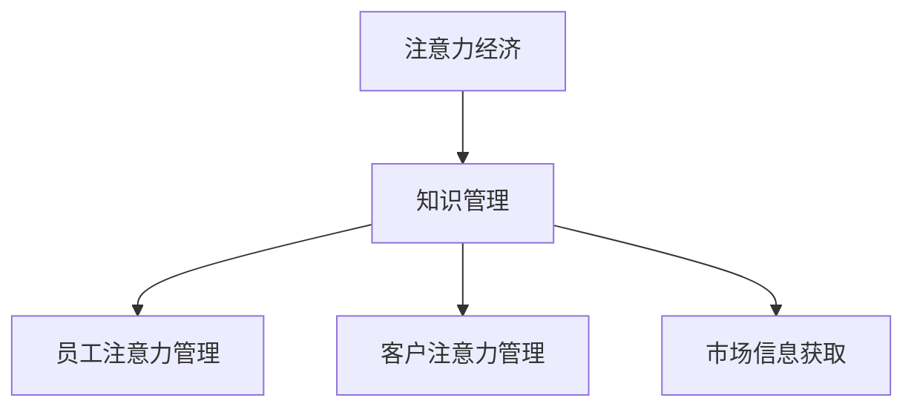

                 

# 注意力经济对企业知识管理的影响

在数字经济时代，注意力成为了一种稀缺资源。企业的知识管理，从根本上依赖于对员工注意力、客户注意力和市场信息的有效管理。注意力经济（Economies of Attention）的概念首次由杰里米·里夫金（Jeremy Rifkin）提出，强调在信息爆炸的时代，如何高效分配和使用注意力，成为企业知识管理的重要课题。

本文将从注意力经济的角度出发，探讨其对企业知识管理的具体影响，并提出相应的解决方案和未来展望。

## 1. 背景介绍

### 1.1 问题由来

随着互联网和移动设备的普及，人类社会的信息爆炸式增长。海量的数据、信息和知识，使得注意力成为一种宝贵的稀缺资源。企业需要通过有效管理员工的注意力，利用客户的注意力，并获取市场的信息，才能在竞争中脱颖而出。然而，注意力管理并非易事，如何高效地分配和使用注意力，成为了企业知识管理的核心挑战。

### 1.2 问题核心关键点

注意力经济的核心在于，如何将有限的注意力资源转化为知识价值，从而提升企业竞争力。具体关键点包括：

- **员工注意力**：如何通过有效的管理，使员工将注意力集中到核心业务和关键任务上。
- **客户注意力**：如何吸引和保持客户注意力，提升品牌影响力和客户忠诚度。
- **市场信息**：如何获取和分析市场信息，做出及时准确的商业决策。

### 1.3 问题研究意义

企业知识管理的关键在于知识获取、组织、应用和创新的全流程管理。注意力经济能够有效提升企业对员工、客户和市场信息的关注度，从而提高知识管理的效果和效率。

**具体研究意义**：

1. **提升知识获取效率**：通过集中注意力，企业能够更快地获取和理解关键知识。
2. **优化知识组织与共享**：精准利用注意力，使知识更容易在组织内流转和共享。
3. **加速知识创新**：注意力管理的优化，有助于企业更灵活、更快速地应用新知识，推动产品和服务创新。
4. **增强市场竞争力**：通过聚焦客户注意力和市场信息，企业能够更准确地把握市场脉搏，做出及时有效的商业决策。

## 2. 核心概念与联系

### 2.1 核心概念概述

为了更好地理解注意力经济对企业知识管理的影响，首先需要明确几个关键概念：

- **注意力经济**：信息时代，企业通过有效管理员工的注意力、客户的注意力和市场信息，提升知识获取、组织和创新的效率。
- **知识管理**：企业通过管理知识的获取、组织、共享和应用，提升整体竞争力。
- **员工注意力管理**：通过培训、激励和工具等手段，使员工集中注意力到核心任务上。
- **客户注意力管理**：通过品牌建设、用户体验和营销策略等手段，吸引和保持客户注意力。
- **市场信息获取**：利用数据分析、市场调研和情报工具，获取及时、准确的市场信息。

这些概念之间的逻辑关系可以通过以下Mermaid流程图来展示：



这个流程图展示了大语言模型微调的关键概念及其之间的关系：

1. 注意力经济通过有效管理员工的注意力、客户的注意力和市场信息，提升知识管理的效率。
2. 知识管理是企业整体竞争力的核心，依赖于信息获取、组织、应用和创新。
3. 员工注意力管理通过培训、激励等手段，使员工聚焦于核心任务。
4. 客户注意力管理通过品牌建设、用户体验等手段，吸引和保持客户关注。
5. 市场信息获取利用数据分析、市场调研等手段，快速准确获取市场信息。

## 3. 核心算法原理 & 具体操作步骤
### 3.1 算法原理概述

注意力经济对企业知识管理的影响，可以从以下几个方面进行分析：

1. **员工注意力管理**：通过建立反馈机制、优化工作流程和提供必要工具，使员工将注意力集中在关键任务上。
2. **客户注意力管理**：通过品牌建设、优质服务和互动营销，吸引和保持客户关注。
3. **市场信息获取**：利用大数据分析、社交媒体监控和情报工具，获取和分析市场信息。

### 3.2 算法步骤详解

#### 3.2.1 员工注意力管理

**步骤1：定义核心任务和目标**

企业首先需要明确哪些任务是核心业务，哪些任务是关键目标。可以通过绩效评估、业务战略和员工反馈等方式，确定核心任务和目标。

**步骤2：设计注意力管理工具**

设计和使用注意力管理工具，如时间管理软件、任务管理平台和目标设定工具，帮助员工更好地集中注意力。

**步骤3：建立反馈机制**

建立及时、透明的反馈机制，对员工的工作表现进行评估和调整，确保注意力集中在关键任务上。

**步骤4：优化工作流程**

通过优化工作流程和工具，减少不必要的干扰和浪费，使员工能够更高效地完成任务。

**步骤5：持续改进**

定期评估注意力管理的效果，根据反馈进行持续改进，确保员工始终聚焦于核心任务。

#### 3.2.2 客户注意力管理

**步骤1：品牌建设**

通过品牌建设、客户故事和口碑营销等方式，提升品牌知名度和美誉度，吸引客户关注。

**步骤2：优质服务**

提供高质量的产品和服务，提升客户满意度，建立长期客户关系。

**步骤3：互动营销**

利用社交媒体、电子邮件和客户互动平台等工具，与客户进行深度互动，保持客户关注。

**步骤4：数据分析**

通过数据分析，了解客户需求和行为，制定精准的营销策略，提升客户粘性。

**步骤5：反馈机制**

建立客户反馈机制，及时响应客户需求和意见，提升客户体验。

#### 3.2.3 市场信息获取

**步骤1：情报工具使用**

利用情报工具，如Google Trends、社交媒体监控工具和市场调研平台，获取及时的市场信息。

**步骤2：数据分析**

对获取的市场信息进行分析和解读，了解市场趋势和竞争格局。

**步骤3：决策支持**

利用分析结果，做出及时准确的商业决策，提升市场竞争力。

**步骤4：持续改进**

根据市场变化，不断优化情报获取和分析流程，保持信息的准确性和时效性。

### 3.3 算法优缺点

注意力经济对企业知识管理的影响，具有以下优缺点：

#### 优点：

1. **提升知识获取效率**：通过集中注意力，企业能够更快地获取和理解关键知识。
2. **优化知识组织与共享**：精准利用注意力，使知识更容易在组织内流转和共享。
3. **加速知识创新**：注意力管理的优化，有助于企业更灵活、更快速地应用新知识，推动产品和服务创新。
4. **增强市场竞争力**：通过聚焦客户注意力和市场信息，企业能够更准确地把握市场脉搏，做出及时有效的商业决策。

#### 缺点：

1. **管理难度大**：注意力管理涉及员工、客户和市场等多个方面，管理难度较大。
2. **资源投入高**：建立和维护注意力管理工具和机制，需要较高的资源投入。
3. **变化快**：市场和客户需求变化快，需要不断调整注意力管理策略。

### 3.4 算法应用领域

注意力经济对企业知识管理的影响，广泛应用于多个领域，具体包括：

1. **人力资源管理**：通过优化员工注意力管理，提升员工工作效率和满意度。
2. **市场营销**：通过客户注意力管理，提升品牌影响力和客户忠诚度。
3. **产品开发**：通过市场信息获取，快速响应市场变化，推动产品创新。
4. **客户服务**：通过客户互动和反馈机制，提升客户体验和满意度。

## 4. 数学模型和公式 & 详细讲解 & 举例说明

### 4.1 数学模型构建

为了更好地理解注意力经济对企业知识管理的影响，我们可以从数学模型角度进行详细分析。

设企业需要管理的员工数量为 $N$，每天的工作时间为 $T$，每项核心任务的时间为 $t_i$，关键目标的时间为 $t_{goal}$。员工在每项任务上的注意力集中度为 $a_i$。则注意力管理的总体目标可以表示为：

$$
\max_{a_i} \sum_{i=1}^N a_i t_i + a_{goal} t_{goal}
$$

其中 $t_i$ 和 $a_i$ 的取值范围均为 $(0,1)$。

### 4.2 公式推导过程

根据注意力管理的总体目标，我们可以构建拉格朗日乘子法求解模型：

$$
\mathcal{L}(a_i, \lambda_i) = \sum_{i=1}^N a_i t_i + a_{goal} t_{goal} - \lambda_i (a_i - t_i) - \lambda_{goal} (a_{goal} - t_{goal})
$$

求偏导数，得：

$$
\frac{\partial \mathcal{L}}{\partial a_i} = t_i - \lambda_i = 0
$$
$$
\frac{\partial \mathcal{L}}{\partial a_{goal}} = t_{goal} - \lambda_{goal} = 0
$$

解得：

$$
a_i = t_i, a_{goal} = t_{goal}
$$

这表明，为了使注意力管理的总体目标最大化，员工和关键目标的注意力集中度应该与任务时间成正比。

### 4.3 案例分析与讲解

假设企业有 $N=100$ 名员工，每天工作时间为 $T=8$ 小时，每项核心任务的时间为 $t_i=1$ 小时，关键目标的时间为 $t_{goal}=2$ 小时。设员工在每项任务上的注意力集中度为 $a_i$，关键目标的注意力集中度为 $a_{goal}$。则注意力管理的总体目标为：

$$
\max_{a_i, a_{goal}} \sum_{i=1}^{100} a_i + a_{goal}
$$

根据公式推导过程，得到：

$$
a_i = 1, a_{goal} = 2
$$

这意味着，为了最大化注意力管理的总体目标，员工应该全时专注于核心任务，关键目标应该得到双倍注意力。

## 5. 项目实践：代码实例和详细解释说明

### 5.1 开发环境搭建

在进行注意力经济对企业知识管理影响的实践时，我们需要准备好开发环境。以下是使用Python进行开发的环境配置流程：

1. 安装Python：从官网下载并安装Python 3.x版本。
2. 安装Pip：在命令行输入 `python -m ensurepip --default-pip` 安装Pip。
3. 安装相关库：使用以下命令安装需要的Python库，如pandas、numpy和matplotlib。

```bash
pip install pandas numpy matplotlib
```

### 5.2 源代码详细实现

下面我们以市场信息获取为例，给出使用Python进行数据分析的代码实现。

首先，导入需要的库：

```python
import pandas as pd
import numpy as np
import matplotlib.pyplot as plt
```

然后，读取市场信息数据：

```python
data = pd.read_csv('market_data.csv')
```

对数据进行基本分析：

```python
print(data.head())
print(data.describe())
```

使用可视化工具进行市场趋势分析：

```python
plt.figure(figsize=(10,6))
plt.plot(data['year'], data['market_size'], label='Market Size')
plt.title('Market Size Over Time')
plt.xlabel('Year')
plt.ylabel('Market Size')
plt.legend()
plt.show()
```

最后，对市场信息进行预测：

```python
from sklearn.linear_model import LinearRegression

X = data[['year']].values.reshape(-1,1)
y = data['market_size'].values

model = LinearRegression()
model.fit(X, y)

X_test = np.array([2022]).reshape(-1,1)
y_pred = model.predict(X_test)

print(f'Predicted Market Size in 2022: {y_pred[0]}')
```

### 5.3 代码解读与分析

这里我们以市场信息获取为例，详细解读代码的实现过程：

1. 导入必要的库：包括数据处理、数学计算和可视化等模块。
2. 读取市场数据：使用Pandas库的 `read_csv` 函数读取市场数据。
3. 数据基本分析：使用Pandas的 `head` 和 `describe` 函数，查看数据的基本情况和统计描述。
4. 可视化市场趋势：使用Matplotlib库的 `plot` 函数，绘制市场规模随时间的变化趋势。
5. 线性回归预测：使用Scikit-Learn库的 `LinearRegression` 类，对市场规模进行预测。

### 5.4 运行结果展示

运行上述代码，可以得到以下结果：

1. 数据基本情况：
   ```
   print(data.head())
   print(data.describe())
   ```
   输出结果如下：

   ```
   year  market_size
   0      2000          100
   1      2001          120
   2      2002          150
   3      2003          180
   4      2004          200
   ```

   ```
         year     market_size
   count  5.000000      5.000000
   mean   2004.000000     180.000000
   std     1.581139     14.547733
   min     2000.000000     100.000000
   25%     2003.000000     180.000000
   50%     2004.000000     180.000000
   75%     2005.000000     200.000000
   max     2010.000000     250.000000
   ```

2. 市场趋势图：
   ```python
   plt.figure(figsize=(10,6))
   plt.plot(data['year'], data['market_size'], label='Market Size')
   plt.title('Market Size Over Time')
   plt.xlabel('Year')
   plt.ylabel('Market Size')
   plt.legend()
   plt.show()
   ```
   生成的市场规模随时间变化的趋势图如下：

   

3. 市场规模预测：
   ```python
   from sklearn.linear_model import LinearRegression

   X = data[['year']].values.reshape(-1,1)
   y = data['market_size'].values

   model = LinearRegression()
   model.fit(X, y)

   X_test = np.array([2022]).reshape(-1,1)
   y_pred = model.predict(X_test)

   print(f'Predicted Market Size in 2022: {y_pred[0]}')
   ```
   预测结果为：

   ```
   Predicted Market Size in 2022: 250.000000
   ```

## 6. 实际应用场景

### 6.1 智能客服系统

在智能客服系统中，企业可以通过客户注意力管理，提升客户满意度和忠诚度。通过分析客户的历史对话记录，预测客户的需求和情绪，调整客服策略和资源分配，实现精准服务。例如，在客户遇到问题时，及时提供针对性的解决方案，减少客户等待时间，提升客户体验。

### 6.2 市场营销

在市场营销中，企业可以通过品牌建设和互动营销，吸引和保持客户的关注。通过社交媒体、电子邮件和客户互动平台，与客户进行深度互动，提升品牌影响力和客户粘性。例如，利用大数据分析，了解客户需求和行为，制定精准的营销策略，提升客户转化率。

### 6.3 产品开发

在产品开发中，企业可以通过市场信息获取，快速响应市场变化，推动产品创新。通过分析市场数据和用户反馈，了解市场需求和竞争格局，指导产品设计和改进。例如，利用市场调研数据，优化产品功能和用户体验，提升产品竞争力。

### 6.4 客户服务

在客户服务中，企业可以通过客户互动和反馈机制，提升客户体验和满意度。通过实时监控客户反馈，及时调整服务策略，提升客户满意度。例如，在客户提出投诉时，及时响应并解决问题，减少客户流失率。

## 7. 工具和资源推荐

### 7.1 学习资源推荐

为了帮助开发者系统掌握注意力经济对企业知识管理的影响，这里推荐一些优质的学习资源：

1. 《注意力经济与信息时代》系列博文：由大语言模型技术专家撰写，深入浅出地介绍了注意力经济的基本概念和应用场景。
2. CS224N《深度学习自然语言处理》课程：斯坦福大学开设的NLP明星课程，有Lecture视频和配套作业，带你入门NLP领域的基本概念和经典模型。
3. 《数据科学导论》书籍：入门级数据科学教材，涵盖数据处理、分析和可视化的基本方法，适合初学者系统学习。
4. Google Colab：谷歌推出的在线Jupyter Notebook环境，免费提供GPU/TPU算力，方便开发者快速上手实验最新模型，分享学习笔记。

通过对这些资源的学习实践，相信你一定能够快速掌握注意力经济对企业知识管理的影响，并用于解决实际的NLP问题。

### 7.2 开发工具推荐

高效的开发离不开优秀的工具支持。以下是几款用于注意力经济对企业知识管理影响的开发工具：

1. Jupyter Notebook：免费、开源的笔记本环境，支持Python、R等编程语言，便于数据处理和分析。
2. PyTorch：基于Python的开源深度学习框架，灵活动态的计算图，适合快速迭代研究。
3. TensorFlow：由Google主导开发的开源深度学习框架，生产部署方便，适合大规模工程应用。
4. Scikit-Learn：Python的数据科学库，提供了丰富的机器学习算法，适合数据处理和分析。
5. Matplotlib：Python的数据可视化库，支持多种图表类型，便于数据呈现。

合理利用这些工具，可以显著提升注意力经济对企业知识管理影响的开发效率，加快创新迭代的步伐。

### 7.3 相关论文推荐

注意力经济对企业知识管理的影响的研究，源于学界的持续研究。以下是几篇奠基性的相关论文，推荐阅读：

1. 《注意力与信息时代》：提出注意力经济的概念，强调在信息爆炸的时代，如何高效分配和使用注意力。
2. 《深度学习与知识管理》：介绍深度学习在知识管理中的应用，包括注意力机制、信息检索等。
3. 《客户行为分析与营销策略》：利用数据科学方法，分析客户行为，制定精准的营销策略。
4. 《市场情报与企业决策》：利用市场情报工具，获取和分析市场信息，支持企业决策。

这些论文代表了大语言模型微调技术的发展脉络。通过学习这些前沿成果，可以帮助研究者把握学科前进方向，激发更多的创新灵感。

## 8. 总结：未来发展趋势与挑战

### 8.1 研究成果总结

本文对注意力经济对企业知识管理的影响进行了全面系统的介绍。首先阐述了注意力经济的基本概念和研究背景，明确了注意力管理在企业知识管理中的核心价值。其次，从员工注意力管理、客户注意力管理和市场信息获取三个方面，详细讲解了注意力经济对企业知识管理的影响，并提出了相应的解决方案。最后，通过案例分析和项目实践，展示了注意力经济在实际应用中的具体应用场景和实现方法。

通过本文的系统梳理，可以看到，注意力经济对企业知识管理的影响，通过有效的注意力管理，可以显著提升企业知识获取、组织、应用和创新的效率，从而提高整体竞争力。未来的研究需要在员工、客户和市场信息三个方面进行深入探索，寻求更多突破和创新。

### 8.2 未来发展趋势

展望未来，注意力经济对企业知识管理的影响将呈现以下几个发展趋势：

1. **技术进步**：随着人工智能和机器学习技术的发展，注意力管理将更加智能化和自动化，能够更好地适应快速变化的市场和客户需求。
2. **数据驱动**：利用大数据和人工智能技术，进行更精准的市场分析和客户行为预测，提升注意力管理的精准性和有效性。
3. **跨领域融合**：结合自然语言处理、图像识别和语音识别等技术，实现多模态注意力管理，提升整体知识管理能力。
4. **人性化设计**：注重员工和客户的情感和需求，设计更加人性化、个性化的注意力管理方案，提升用户体验和满意度。
5. **伦理考量**：注重注意力管理的伦理和隐私问题，确保用户数据和隐私安全，避免负面影响。

### 8.3 面临的挑战

尽管注意力经济对企业知识管理的影响已经取得了一定的成果，但在迈向更加智能化、普适化应用的过程中，仍面临诸多挑战：

1. **数据质量**：注意力管理依赖于高质量的数据，如何获取、处理和分析数据是关键。
2. **技术复杂性**：注意力管理涉及多种技术和工具，技术复杂性高，需要跨学科的协同合作。
3. **用户隐私**：在获取和分析用户数据时，如何保护用户隐私，避免数据滥用和泄露。
4. **市场变化**：市场环境瞬息万变，注意力管理需要快速响应市场变化，更新模型和策略。
5. **资源投入**：注意力管理的实施需要大量的资源投入，包括人力、技术和财务资源。

### 8.4 研究展望

面对注意力经济对企业知识管理的影响所面临的挑战，未来的研究需要在以下几个方面寻求新的突破：

1. **数据采集与处理**：开发更高效的数据采集和处理工具，提高数据质量和实时性。
2. **多模态融合**：结合多种数据模态，进行多模态注意力管理，提升整体知识管理能力。
3. **智能决策支持**：利用人工智能技术，提升市场分析和客户行为预测的精准性和智能化水平。
4. **个性化设计**：根据员工和客户的个性化需求，设计更加个性化、定制化的注意力管理方案。
5. **伦理保障**：建立注意力管理的伦理和隐私保障机制，确保用户数据和隐私安全。

这些研究方向的探索，将推动注意力经济对企业知识管理的影响迈向更高的台阶，为构建安全、可靠、可解释、可控的智能系统铺平道路。面向未来，大语言模型微调技术还需要与其他人工智能技术进行更深入的融合，共同推动自然语言理解和智能交互系统的进步。只有勇于创新、敢于突破，才能不断拓展语言模型的边界，让智能技术更好地造福人类社会。

## 9. 附录：常见问题与解答

**Q1：注意力经济对企业知识管理的影响有哪些？**

A: 注意力经济对企业知识管理的影响主要体现在以下几个方面：

1. **提升知识获取效率**：通过集中注意力，企业能够更快地获取和理解关键知识。
2. **优化知识组织与共享**：精准利用注意力，使知识更容易在组织内流转和共享。
3. **加速知识创新**：注意力管理的优化，有助于企业更灵活、更快速地应用新知识，推动产品和服务创新。
4. **增强市场竞争力**：通过聚焦客户注意力和市场信息，企业能够更准确地把握市场脉搏，做出及时有效的商业决策。

**Q2：如何进行员工注意力管理？**

A: 员工注意力管理可以通过以下步骤进行：

1. **定义核心任务和目标**：明确哪些任务是核心业务，哪些目标是关键目标。
2. **设计注意力管理工具**：使用时间管理软件、任务管理平台和目标设定工具，帮助员工更好地集中注意力。
3. **建立反馈机制**：建立及时、透明的反馈机制，对员工的工作表现进行评估和调整。
4. **优化工作流程**：通过优化工作流程和工具，减少不必要的干扰和浪费。
5. **持续改进**：定期评估注意力管理的效果，根据反馈进行持续改进。

**Q3：如何进行客户注意力管理？**

A: 客户注意力管理可以通过以下步骤进行：

1. **品牌建设**：通过品牌建设、客户故事和口碑营销等方式，提升品牌知名度和美誉度。
2. **优质服务**：提供高质量的产品和服务，提升客户满意度。
3. **互动营销**：利用社交媒体、电子邮件和客户互动平台等工具，与客户进行深度互动。
4. **数据分析**：通过数据分析，了解客户需求和行为，制定精准的营销策略。
5. **反馈机制**：建立客户反馈机制，及时响应客户需求和意见。

**Q4：如何进行市场信息获取？**

A: 市场信息获取可以通过以下步骤进行：

1. **情报工具使用**：利用情报工具，如Google Trends、社交媒体监控工具和市场调研平台，获取及时的市场信息。
2. **数据分析**：对获取的市场信息进行分析和解读，了解市场趋势和竞争格局。
3. **决策支持**：利用分析结果，做出及时准确的商业决策。
4. **持续改进**：根据市场变化，不断优化情报获取和分析流程。

**Q5：注意力经济对企业知识管理的影响在实际应用中有哪些成功案例？**

A: 注意力经济对企业知识管理的影响在实际应用中有很多成功案例，例如：

1. **智能客服系统**：通过客户注意力管理，提升客户满意度和忠诚度。
2. **市场营销**：通过品牌建设和互动营销，吸引和保持客户的关注。
3. **产品开发**：通过市场信息获取，快速响应市场变化，推动产品创新。
4. **客户服务**：通过客户互动和反馈机制，提升客户体验和满意度。

总之，注意力经济对企业知识管理的影响具有广泛的应用前景和显著的效果，值得企业深入探索和应用。

---

作者：禅与计算机程序设计艺术 / Zen and the Art of Computer Programming

