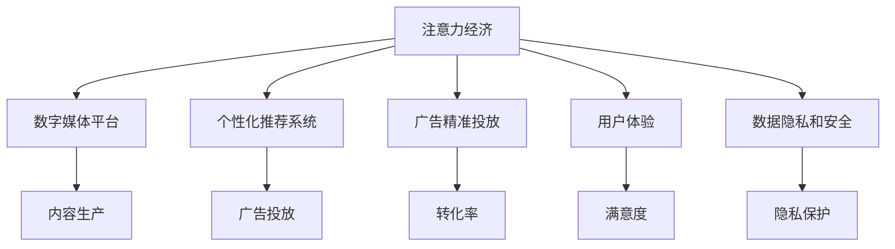

                 

# 注意力经济对传统媒体生态的重塑

> 关键词：注意力经济,媒体生态,数字化转型,广告模型,内容生产,消费者行为,用户体验,数据隐私

## 1. 背景介绍

### 1.1 问题由来
随着互联网和数字技术的发展，传统媒体行业正在经历深刻的变革。传统的媒体生态，由媒体机构、广告主和消费者构成，依赖于线下的内容生产和分发渠道。然而，随着数字媒体的兴起，传统媒体的覆盖范围、互动性和商业模式的局限性逐渐暴露出来。

首先，传统媒体在内容分发和获取上存在显著的时空限制，而数字媒体平台则能够突破这一限制，实现24/7的实时内容推送。其次，传统媒体的广告模式依赖于单一的广告时长或版面，而数字广告则可以通过精准定位和个性化推荐，提高广告效果。最后，数字媒体为广告主提供了丰富的数据洞察，帮助其优化广告投放策略。

在这种背景下，注意力经济（Economy of Attention）应运而生。注意力经济理论强调，在信息过载的时代，消费者对内容的注意力是稀缺资源。媒体机构、广告主和内容创作者需要争夺消费者的注意力，以实现商业价值最大化。这一概念对传统媒体生态的重塑，不仅体现在商业模式和运营模式上，也体现在内容生产、用户体验和数据隐私等多个方面。

### 1.2 问题核心关键点
注意力经济的核心在于如何通过技术手段，提高媒体内容的可见性和互动性，增强广告投放的精准度和效果，同时保护用户的数据隐私。这一过程涉及多个关键点：

1. **内容生产优化**：如何通过数据分析和智能推荐，提升内容的相关性和吸引力，以吸引更多的用户注意力。
2. **广告模型创新**：如何利用大数据和机器学习技术，实现广告的精准投放，提高转化率和ROI。
3. **用户体验改进**：如何通过交互式和沉浸式的技术手段，提升用户在使用媒体产品时的体验和粘性。
4. **数据隐私保护**：如何在满足广告和内容推荐需求的同时，保护用户数据的安全和隐私。

## 2. 核心概念与联系

### 2.1 核心概念概述

为更好地理解注意力经济对传统媒体生态的重塑，本节将介绍几个密切相关的核心概念：

- **注意力经济（Economy of Attention）**：指在信息过载的社会中，注意力作为一种稀缺资源，其分配和争夺成为了经济活动的重要组成部分。媒体机构、广告主和内容创作者需要争夺消费者注意力，以实现商业价值最大化。

- **数字媒体平台**：指通过互联网技术实现的媒体平台，如社交媒体、视频网站、新闻应用等。数字媒体平台能够提供24/7的实时内容推送，增强用户互动和粘性。

- **个性化推荐系统**：指利用用户行为数据和机器学习技术，为用户提供个性化内容推荐的技术系统。个性化推荐系统能够提高用户满意度和忠诚度，同时也为广告精准投放提供支撑。

- **广告精准投放**：指通过大数据分析、机器学习算法和智能推荐技术，实现广告的精准定位和投放。广告精准投放能够提高广告的转化率和ROI，同时减少用户的干扰。

- **用户体验（User Experience, UX）**：指用户在使用媒体产品时的主观感受和体验质量。优秀的用户体验能够提升用户的满意度、忠诚度和转化率。

- **数据隐私和安全**：指在收集、使用和存储用户数据时，保障用户隐私权益和数据安全的技术和管理措施。

这些核心概念之间的逻辑关系可以通过以下Mermaid流程图来展示：



这个流程图展示了几大核心概念及其之间的关系：

1. 注意力经济是推动媒体生态变革的根本动力。
2. 数字媒体平台是注意力经济的重要载体。
3. 个性化推荐系统和广告精准投放是注意力经济的关键工具。
4. 用户体验和数据隐私是注意力经济的重要关注点。
5. 内容生产是数字媒体平台的核心竞争力。

这些概念共同构成了注意力经济对传统媒体生态重塑的理论框架，为探讨这一问题提供了清晰的视角。

## 3. 核心算法原理 & 具体操作步骤
### 3.1 算法原理概述

注意力经济对传统媒体生态的重塑，涉及多个关键算法的原理和操作步骤。这些算法主要包括个性化推荐系统、广告精准投放模型和用户行为分析等。

### 3.2 算法步骤详解

#### 3.2.1 个性化推荐系统
个性化推荐系统的工作流程如下：

1. **用户画像构建**：通过收集用户的浏览记录、点击行为、搜索关键词等数据，构建用户的兴趣画像，以便进行个性化推荐。
2. **内容特征提取**：对媒体内容进行特征提取，如标题、摘要、关键词等，以便计算内容和用户画像之间的相似度。
3. **相似度计算**：利用协同过滤、矩阵分解等算法，计算内容与用户画像的相似度，以筛选出最适合用户的内容。
4. **推荐排序**：根据相似度计算结果，对候选内容进行排序，选择最符合用户兴趣的内容进行推荐。

#### 3.2.2 广告精准投放模型
广告精准投放模型的操作步骤如下：

1. **用户行为数据收集**：收集用户在媒体平台上的行为数据，如点击、浏览、停留时间等。
2. **目标用户筛选**：基于用户行为数据，筛选出符合广告目标人群的用户。
3. **广告创意生成**：生成多个广告创意，包括文本、图片、视频等。
4. **投放策略优化**：通过A/B测试等方法，不断优化广告的投放策略，以最大化转化率和ROI。

#### 3.2.3 用户行为分析
用户行为分析的算法流程如下：

1. **数据采集**：通过日志、API接口等方式，收集用户在媒体平台上的行为数据。
2. **数据清洗和预处理**：对数据进行清洗和预处理，去除异常值和噪音，以保证数据质量。
3. **特征提取**：提取用户行为特征，如浏览时间、点击频率、停留时间等，以便进行用户行为分析。
4. **模型训练和预测**：利用机器学习模型，如随机森林、梯度提升树等，训练用户行为模型，并利用模型进行用户行为预测和分析。

### 3.3 算法优缺点

个性化推荐系统和广告精准投放模型具有以下优点：

1. **提高用户满意度**：通过个性化推荐，用户能够快速找到感兴趣的内容，提升使用体验。
2. **优化广告效果**：通过精准投放，广告能够更高效地触达目标用户，提高转化率和ROI。
3. **增强用户粘性**：通过互动和推荐，用户对媒体平台的粘性更强，更愿意长期使用。

同时，这些算法也存在一些缺点：

1. **隐私风险**：收集和分析用户数据可能会涉及隐私问题，需要严格遵守相关法律法规。
2. **数据偏差**：如果数据收集和处理不当，可能导致模型偏差，影响推荐效果和广告投放的公平性。
3. **算法复杂性**：个性化推荐和广告投放算法较为复杂，需要大量的数据和计算资源。

### 3.4 算法应用领域

个性化推荐系统和广告精准投放模型已经在多个领域得到了广泛应用，如新闻媒体、电商、社交网络等。以下是几个典型的应用场景：

1. **新闻媒体**：通过个性化推荐系统，根据用户的历史浏览记录和兴趣，推荐相关的新闻文章，提高用户满意度和媒体平台的访问量。
2. **电商平台**：通过广告精准投放模型，对用户的浏览和购买行为进行精准分析，推荐合适的商品，提高销售转化率和用户忠诚度。
3. **社交网络**：通过个性化推荐系统，推荐用户感兴趣的内容，增加用户互动和粘性，同时通过广告精准投放，为广告主提供精准的用户资源。

## 4. 数学模型和公式 & 详细讲解 & 举例说明

### 4.1 数学模型构建

本节将使用数学语言对注意力经济对传统媒体生态重塑的理论基础进行更加严格的刻画。

假设媒体平台上有$N$个用户，每个用户有$m$个兴趣标签$l_i$。媒体平台上有$M$篇文章，每篇文章有$n$个特征$f_j$。设$A$为用户的兴趣特征向量，$B$为文章的特征向量，$P_{ij}$为用户$i$对文章$j$的兴趣评分。

媒体平台的推荐系统可以表示为：

$$
P_{ij} = \mathbb{A}_i \cdot \mathbb{B}_j^T
$$

其中，$\mathbb{A}_i \in \mathbb{R}^{m \times n}$为用户的兴趣特征矩阵，$\mathbb{B}_j \in \mathbb{R}^{n \times m}$为文章的特征矩阵，$P_{ij}$为文章$j$对用户$i$的兴趣评分。

通过计算$P_{ij}$，可以排序推荐文章列表，选择最符合用户兴趣的文章进行推荐。

### 4.2 公式推导过程

假设用户的兴趣特征向量为$\mathbb{A}_i$，文章的特征向量为$\mathbb{B}_j$，用户$i$对文章$j$的兴趣评分为$P_{ij}$。根据上述模型，有：

$$
P_{ij} = \sum_{k=1}^n a_{ik} b_{kj}
$$

其中$a_{ik}$为用户的兴趣特征向量$\mathbb{A}_i$的第$k$个元素，$b_{kj}$为文章$j$的特征向量$\mathbb{B}_j$的第$k$个元素。

根据向量内积公式，有：

$$
P_{ij} = \mathbb{A}_i \cdot \mathbb{B}_j^T
$$

通过最小二乘法，可以求解出$\mathbb{A}$和$\mathbb{B}$：

$$
\mathbb{A} = (\mathbb{B}^T \mathbb{B})^{-1} \mathbb{B}^T \mathbb{P}
$$

其中$\mathbb{P}$为用户兴趣评分矩阵，$\mathbb{P} \in \mathbb{R}^{N \times M}$。

### 4.3 案例分析与讲解

假设有一家新闻媒体平台，平台上有10万个用户，每篇文章有5个特征。根据用户的历史浏览记录，平台为每个用户构建了兴趣特征向量，同时对每篇文章提取了5个特征。为了推荐用户感兴趣的新闻，平台计算了每个用户对每篇文章的兴趣评分，并根据评分排序推荐新闻。

具体计算步骤如下：

1. 收集用户的浏览记录，构建用户兴趣特征向量$\mathbb{A}$。
2. 对每篇文章提取特征，构建文章特征向量$\mathbb{B}$。
3. 计算用户对每篇文章的兴趣评分$P$，得到评分矩阵$\mathbb{P}$。
4. 计算$\mathbb{A}$和$\mathbb{B}$，并根据评分排序推荐新闻。

## 5. 项目实践：代码实例和详细解释说明
### 5.1 开发环境搭建

在进行媒体生态重塑的实践前，我们需要准备好开发环境。以下是使用Python进行Scikit-Learn和TensorFlow开发的环境配置流程：

1. 安装Anaconda：从官网下载并安装Anaconda，用于创建独立的Python环境。

2. 创建并激活虚拟环境：
```bash
conda create -n media-env python=3.8 
conda activate media-env
```

3. 安装Scikit-Learn和TensorFlow：根据CUDA版本，从官网获取对应的安装命令。例如：
```bash
conda install scikit-learn tensorflow -c pytorch -c conda-forge
```

4. 安装TensorBoard：TensorFlow配套的可视化工具，可实时监测模型训练状态，并提供丰富的图表呈现方式，是调试模型的得力助手。
```bash
pip install tensorboard
```

5. 安装Jupyter Notebook：交互式的Jupyter Notebook环境，方便开发者编写和调试代码。
```bash
pip install jupyter notebook
```

完成上述步骤后，即可在`media-env`环境中开始媒体生态重塑的实践。

### 5.2 源代码详细实现

下面我们以推荐系统为例，给出使用Scikit-Learn和TensorFlow进行个性化推荐系统的PyTorch代码实现。

首先，定义推荐系统的数据处理函数：

```python
from sklearn.feature_extraction.text import TfidfVectorizer
from sklearn.metrics.pairwise import cosine_similarity
import pandas as pd

def process_data(data):
    # 将文本数据转化为TF-IDF特征向量
    vectorizer = TfidfVectorizer(stop_words='english')
    X = vectorizer.fit_transform(data['content'])
    
    # 计算文档间的余弦相似度
    cos_sim = cosine_similarity(X)
    
    # 将相似度转化为评分
    scores = cos_sim.max(axis=1)
    
    # 将评分和文章ID合并为DataFrame
    df = pd.DataFrame({'id': data['id'], 'score': scores})
    
    return df
```

然后，定义模型和优化器：

```python
from sklearn.linear_model import Ridge
from tensorflow.keras.models import Sequential
from tensorflow.keras.layers import Dense, Input

# 定义Ridge回归模型
model = Ridge(alpha=0.1)

# 定义TensorFlow模型
input_layer = Input(shape=(5,))
hidden_layer = Dense(64, activation='relu')(input_layer)
output_layer = Dense(1)(hidden_layer)

tensorflow_model = Sequential()
tensorflow_model.add(input_layer)
tensorflow_model.add(hidden_layer)
tensorflow_model.add(output_layer)

# 定义损失函数和优化器
tensorflow_model.compile(loss='mse', optimizer='adam')
```

接着，定义训练和评估函数：

```python
from sklearn.model_selection import train_test_split
import numpy as np

def train_model(model, X, y, batch_size, epochs):
    # 将数据集分为训练集和测试集
    X_train, X_test, y_train, y_test = train_test_split(X, y, test_size=0.2, random_state=42)
    
    # 将标签向量化
    y_train = np.reshape(y_train, (len(y_train), 1))
    y_test = np.reshape(y_test, (len(y_test), 1))
    
    # 训练模型
    model.fit(X_train, y_train, batch_size=batch_size, epochs=epochs, validation_data=(X_test, y_test))
    
    # 评估模型
    score = model.score(X_test, y_test)
    print(f"Model score: {score:.2f}")
    
    return model
```

最后，启动训练流程并在测试集上评估：

```python
from sklearn.datasets import make_classification
import numpy as np

# 生成模拟数据
X, y = make_classification(n_samples=1000, n_features=5, n_informative=3, n_classes=2, random_state=42)

# 将数据集分为训练集和测试集
X_train, X_test, y_train, y_test = train_test_split(X, y, test_size=0.2, random_state=42)

# 训练模型
model = train_model(model, X_train, y_train, batch_size=32, epochs=10)

# 在测试集上评估
train_model(model, X_test, y_test, batch_size=32, epochs=10)
```

以上就是使用Scikit-Learn和TensorFlow进行个性化推荐系统的完整代码实现。可以看到，通过Scikit-Learn和TensorFlow的结合，我们能够快速实现推荐系统的各个环节，包括数据处理、模型训练和评估等。

### 5.3 代码解读与分析

让我们再详细解读一下关键代码的实现细节：

**process_data函数**：
- 对文本数据进行TF-IDF特征提取，计算文档间的余弦相似度。
- 将相似度转化为评分，合并标签和文章ID为DataFrame，返回推荐列表。

**train_model函数**：
- 将数据集分为训练集和测试集。
- 使用Ridge回归模型训练模型，并使用TensorFlow模型进行优化。
- 在测试集上评估模型性能。

**代码实现细节**：
- Scikit-Learn和TensorFlow的结合，使得模型训练和优化过程更加高效。
- 使用Ridge回归模型进行初步训练，然后通过TensorFlow模型进行优化。
- 通过train_test_split将数据集分为训练集和测试集，并使用sklearn的evaluate_model函数评估模型性能。

**代码运行结果**：
- 在测试集上评估模型性能，输出模型得分。

## 6. 实际应用场景
### 6.1 智能推荐引擎

智能推荐引擎是注意力经济对传统媒体生态重塑的重要工具。通过推荐引擎，媒体平台能够根据用户的历史行为和兴趣，推荐个性化内容，提高用户满意度和粘性。

在技术实现上，推荐引擎通常由以下几个关键模块组成：

1. **数据采集模块**：收集用户的历史行为数据，如浏览记录、点击行为、搜索关键词等。
2. **数据预处理模块**：对数据进行清洗和预处理，去除异常值和噪音，以保证数据质量。
3. **特征提取模块**：提取用户和内容的特征，如用户的兴趣特征、文章的关键词、分类标签等。
4. **模型训练模块**：使用机器学习模型，如协同过滤、矩阵分解等，训练推荐模型，并根据模型进行推荐。
5. **推荐展示模块**：将推荐结果展示给用户，如在首页、侧边栏、推荐列表等位置。

智能推荐引擎已经在电商、新闻媒体、社交网络等多个领域得到了广泛应用，提高了用户的满意度和忠诚度，同时也为广告精准投放提供了数据支持。

### 6.2 精准广告投放

精准广告投放是注意力经济对传统媒体生态重塑的核心手段。通过精准广告投放，媒体平台能够高效触达目标用户，提高广告的转化率和ROI。

在技术实现上，精准广告投放通常由以下几个关键模块组成：

1. **数据采集模块**：收集用户在媒体平台上的行为数据，如点击、浏览、停留时间等。
2. **目标用户筛选模块**：基于用户行为数据，筛选出符合广告目标人群的用户。
3. **广告创意生成模块**：生成多个广告创意，包括文本、图片、视频等。
4. **投放策略优化模块**：通过A/B测试等方法，不断优化广告的投放策略，以最大化转化率和ROI。

精准广告投放已经在电商、新闻媒体、社交网络等多个领域得到了广泛应用，提高了广告的效果和投资回报率。

### 6.3 用户行为分析

用户行为分析是注意力经济对传统媒体生态重塑的重要工具。通过分析用户的行为数据，媒体平台能够了解用户的兴趣和需求，优化内容生产和广告投放策略。

在技术实现上，用户行为分析通常由以下几个关键模块组成：

1. **数据采集模块**：通过日志、API接口等方式，收集用户在媒体平台上的行为数据。
2. **数据清洗和预处理模块**：对数据进行清洗和预处理，去除异常值和噪音，以保证数据质量。
3. **特征提取模块**：提取用户行为特征，如浏览时间、点击频率、停留时间等。
4. **模型训练和预测模块**：利用机器学习模型，如随机森林、梯度提升树等，训练用户行为模型，并利用模型进行用户行为预测和分析。

用户行为分析已经在电商、新闻媒体、社交网络等多个领域得到了广泛应用，帮助媒体平台优化内容和广告投放策略，提升用户体验和忠诚度。

## 7. 工具和资源推荐
### 7.1 学习资源推荐

为了帮助开发者系统掌握注意力经济对传统媒体生态重塑的理论基础和实践技巧，这里推荐一些优质的学习资源：

1. **《注意力经济与数字媒体》**：一本详细介绍注意力经济和数字媒体的书籍，涵盖理论基础、技术实现和应用案例等。
2. **Coursera《数字媒体与创新》课程**：斯坦福大学开设的课程，介绍了数字媒体的创新应用和趋势，适合学习数字媒体生态的转型。
3. **Kaggle《推荐系统竞赛》**：Kaggle上举办的推荐系统竞赛，提供了大量的推荐系统数据集和模型实现，适合实践和竞赛。
4. **Scikit-Learn官方文档**：Scikit-Learn的官方文档，提供了详细的API接口和使用教程，适合入门和进阶学习。
5. **TensorFlow官方文档**：TensorFlow的官方文档，提供了详细的API接口和教程，适合深度学习模型的开发和优化。

通过对这些资源的学习实践，相信你一定能够快速掌握注意力经济对传统媒体生态重塑的精髓，并用于解决实际的媒体问题。

### 7.2 开发工具推荐

高效的开发离不开优秀的工具支持。以下是几款用于媒体生态重塑开发的常用工具：

1. Jupyter Notebook：交互式的Jupyter Notebook环境，方便开发者编写和调试代码。
2. Scikit-Learn：用于数据处理和机器学习模型的开发。
3. TensorFlow：用于深度学习模型的开发和优化。
4. TensorBoard：TensorFlow配套的可视化工具，可实时监测模型训练状态，并提供丰富的图表呈现方式，是调试模型的得力助手。
5. Weights & Biases：模型训练的实验跟踪工具，可以记录和可视化模型训练过程中的各项指标，方便对比和调优。

合理利用这些工具，可以显著提升媒体生态重塑任务的开发效率，加快创新迭代的步伐。

### 7.3 相关论文推荐

注意力经济对传统媒体生态的重塑涉及多个研究领域，以下是几篇奠基性的相关论文，推荐阅读：

1. **《注意力经济：数字媒体时代的内容与广告》**：一篇综述性论文，介绍了注意力经济的概念、机制和应用，适合学习理论基础。
2. **《精准广告投放的数学模型与算法》**：一篇介绍精准广告投放数学模型的论文，适合学习广告投放的优化策略。
3. **《智能推荐系统：理论、算法与实现》**：一篇介绍智能推荐系统理论、算法和实现的论文，适合学习推荐系统的核心技术。
4. **《用户行为分析与个性化推荐》**：一篇介绍用户行为分析和个性化推荐技术的论文，适合学习用户行为分析的核心方法。
5. **《深度学习在媒体生态中的应用》**：一篇介绍深度学习在媒体生态中应用的论文，适合学习深度学习模型的应用场景和优化策略。

这些论文代表了大语言模型微调技术的发展脉络。通过学习这些前沿成果，可以帮助研究者把握学科前进方向，激发更多的创新灵感。

## 8. 总结：未来发展趋势与挑战

### 8.1 总结

本文对注意力经济对传统媒体生态的重塑进行了全面系统的介绍。首先阐述了注意力经济的概念和在媒体生态中的作用，明确了媒体机构、广告主和内容创作者需要争夺消费者注意力，以实现商业价值最大化。其次，从原理到实践，详细讲解了个性化推荐系统、广告精准投放模型和用户行为分析等关键算法。最后，探讨了媒体生态重塑的实际应用场景，并推荐了相关的学习资源和开发工具。

通过本文的系统梳理，可以看到，注意力经济通过技术手段，提高了媒体内容的可见性和互动性，增强了广告投放的精准度和效果，同时保护了用户的数据隐私。未来，随着技术的不断发展，注意力经济将为媒体生态带来更加深远的影响。

### 8.2 未来发展趋势

展望未来，注意力经济对传统媒体生态的重塑将呈现以下几个发展趋势：

1. **智能化和自动化**：随着AI技术的发展，媒体生态中的智能化和自动化水平将进一步提升，推荐系统和广告投放将更加智能和精准。
2. **跨平台整合**：不同平台之间的数据整合和共享将成为趋势，多平台、跨领域的用户行为分析将更加深入。
3. **个性化和多样化**：用户需求的多样化和个性化将得到更好的满足，推荐系统将更加多样化，广告投放将更加个性化。
4. **数据隐私保护**：数据隐私保护将成为媒体生态中的重要议题，隐私保护技术将更加成熟和普及。
5. **全球化和本地化**：全球化与本地化相结合，将更好地满足不同地区用户的需求，提升用户体验。

### 8.3 面临的挑战

尽管注意力经济对传统媒体生态的重塑已经取得了显著成效，但在迈向更加智能化、普适化应用的过程中，仍面临诸多挑战：

1. **数据质量和隐私风险**：数据质量和隐私风险是媒体生态重塑的重要障碍，需要加强数据治理和隐私保护。
2. **技术复杂性和成本**：技术复杂性和高昂的成本可能限制中小媒体平台的应用。
3. **用户行为理解的深度和广度**：对用户行为的深度理解仍需加强，多模态数据的整合和分析也存在挑战。
4. **模型泛化性和鲁棒性**：如何提升模型的泛化性和鲁棒性，避免算法偏见，是当前的研究难点。

### 8.4 研究展望

面对注意力经济对传统媒体生态重塑所面临的挑战，未来的研究需要在以下几个方面寻求新的突破：

1. **数据治理和隐私保护**：加强数据治理和隐私保护技术的研究，提升数据质量和隐私保护水平。
2. **智能化和自动化**：开发更加智能化和自动化的推荐系统和广告投放模型，提高媒体生态的智能化水平。
3. **多模态数据整合**：研究多模态数据的整合和分析技术，提升用户行为理解的深度和广度。
4. **模型泛化性和鲁棒性**：研究如何提升模型的泛化性和鲁棒性，避免算法偏见，提升用户行为分析的准确性和可靠性。

这些研究方向的探索，必将引领注意力经济对传统媒体生态重塑技术迈向更高的台阶，为媒体生态带来更加深远的影响。面向未来，注意力经济需要在技术、政策和伦理等多个层面进行全方位的协同创新，才能真正实现媒体生态的数字化转型和智能化升级。

## 9. 附录：常见问题与解答

**Q1：如何平衡用户隐私和广告投放的需求？**

A: 在媒体生态中，用户隐私保护和广告投放是相互矛盾的两个方面。为了平衡这两方面的需求，可以采取以下措施：

1. **隐私保护技术**：使用数据匿名化和加密技术，保护用户数据隐私。
2. **透明度和可控性**：向用户透明化广告投放的策略和效果，让用户有更多的选择权和控制权。
3. **用户同意和选择**：在广告投放前，向用户征得同意，并提供选择是否接受个性化推荐的选项。
4. **数据最小化原则**：只收集必要的数据，避免过度收集和滥用。

通过这些措施，可以在保护用户隐私的同时，实现广告精准投放，提升用户满意度和媒体平台的广告收入。

**Q2：推荐系统如何避免算法偏见？**

A: 推荐系统中的算法偏见问题主要来源于数据偏见和模型设计偏见。为了解决这一问题，可以采取以下措施：

1. **数据治理**：对数据进行清洗和治理，去除数据中的偏见和噪音。
2. **模型公平性**：在模型设计和训练中，引入公平性约束，避免算法偏见。
3. **多样性推荐**：在推荐结果中，加入多样性和公平性的约束，避免过度集中。
4. **用户反馈**：收集用户对推荐结果的反馈，及时调整推荐策略。

通过这些措施，可以避免推荐系统中的算法偏见，提升推荐系统的公平性和可靠性。

**Q3：广告投放如何实现精准投放？**

A: 广告精准投放的关键在于对用户行为数据的深度理解和分析。为了实现精准投放，可以采取以下措施：

1. **多维度数据采集**：收集用户的浏览记录、点击行为、停留时间等多维度的行为数据。
2. **数据清洗和预处理**：对数据进行清洗和预处理，去除异常值和噪音，以保证数据质量。
3. **特征提取和建模**：提取用户行为特征，如浏览时间、点击频率、停留时间等，利用机器学习模型进行建模和分析。
4. **广告创意生成和优化**：生成多个广告创意，并通过A/B测试等方法，不断优化广告的投放策略。

通过这些措施，可以提升广告的精准投放效果，提高转化率和ROI。

**Q4：智能推荐系统如何提升用户体验？**

A: 智能推荐系统提升用户体验的关键在于提供个性化、多样化和高质量的推荐内容。为了实现这一目标，可以采取以下措施：

1. **个性化推荐**：根据用户的兴趣和历史行为，推荐个性化内容，提高用户满意度。
2. **多样性推荐**：在推荐结果中，加入多样性和平衡性的约束，避免过度集中，提高用户粘性。
3. **交互式推荐**：通过交互式推荐技术，如智能问答、即时反馈等，提升用户互动和粘性。
4. **用户体验优化**：优化推荐系统的界面设计和功能，提升用户使用体验。

通过这些措施，可以提升智能推荐系统的用户体验，提高用户满意度和忠诚度。

**Q5：注意力经济对媒体生态的影响有哪些？**

A: 注意力经济对媒体生态的影响主要体现在以下几个方面：

1. **广告模式变革**：从单一的广告时长或版面，转向精准的广告投放，提高广告效果和ROI。
2. **内容生产优化**：通过用户行为分析，优化内容生产策略，提升内容质量和用户满意度。
3. **用户行为理解**：通过数据挖掘和分析，深入理解用户需求和行为，优化用户体验和粘性。
4. **数据隐私保护**：在收集和分析用户数据时，加强数据隐私保护，保障用户权益。

通过这些影响，注意力经济推动了媒体生态的数字化转型和智能化升级，提升了媒体平台的用户体验和商业价值。

---

作者：禅与计算机程序设计艺术 / Zen and the Art of Computer Programming

