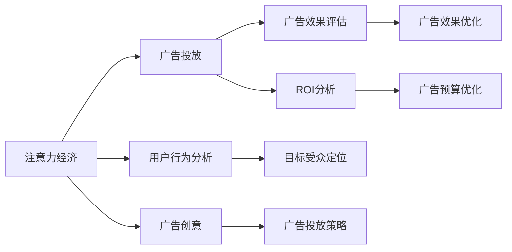

                 

# 注意力经济对传统广告投放ROI的影响

> 关键词：注意力经济,广告投放,ROI,注意力机制,深度学习,广告效果,用户行为,定向广告,广告创意

## 1. 背景介绍

在数字时代，广告投放已经从传统的广覆盖、低定向转向以用户行为为核心的精准营销。传统广告通过媒介传播，往往难以精确触达目标受众，导致广告资源的浪费和广告效果的下降。而注意力经济作为一种新兴的经济模式，通过吸引用户的注意力，创造出巨大的市场价值，为广告投放ROI的提升带来了新的可能性。

注意力经济是指在数字媒体环境中，通过吸引和保持用户注意力，实现商业价值变现的过程。其中，广告投放作为最常见的注意力经济形式之一，逐渐成为企业品牌推广、产品销售的重要手段。然而，随着信息爆炸和用户注意力的日益分散，如何通过广告投放获得更高的投资回报率(ROI)，已成为广告主和广告代理商共同关注的焦点。

## 2. 核心概念与联系

### 2.1 核心概念概述

为了更好地理解注意力经济对传统广告投放ROI的影响，我们首先需要明确几个核心概念：

- **注意力经济**：通过吸引和保持用户的注意力，实现商业价值变现的经济模式。在广告投放中，注意力指的是用户对广告信息的关注程度。
- **广告投放**：将广告信息通过各种渠道（如网页、社交媒体、视频等）传达给目标用户的过程。
- **ROI（投资回报率）**：广告投放效果的量化指标，通常表示为广告支出与销售收入的比值。
- **广告创意**：广告的创意设计，包括文案、图片、视频等内容。
- **定向广告**：针对特定人群（如年龄、性别、兴趣等）进行精准投放的广告。

这些概念之间的联系可以通过以下Mermaid流程图来展示：



该流程图展示了注意力经济在广告投放中的作用和流程：

1. 通过用户行为分析，定位目标受众。
2. 根据目标受众，设计广告创意，制定投放策略。
3. 投放广告，吸引用户注意力。
4. 评估广告效果，分析ROI。
5. 优化广告创意和投放策略，提升广告效果。
6. 根据ROI分析，优化广告预算。

## 3. 核心算法原理 & 具体操作步骤
### 3.1 算法原理概述

注意力经济在广告投放中的应用，主要体现在通过用户注意力模型的建立，优化广告创意和投放策略，从而提高广告效果和ROI。具体来说，注意力经济下的广告投放可以分为以下步骤：

1. **用户行为分析**：收集和分析用户在网络上的行为数据，如浏览记录、搜索历史、点击行为等。
2. **目标受众定位**：根据用户行为分析结果，定位目标受众，并通过大数据技术进行精准匹配。
3. **广告创意设计**：结合目标受众的兴趣和需求，设计有吸引力的广告创意。
4. **定向广告投放**：将广告投放至目标受众，通过注意力模型吸引用户关注。
5. **广告效果评估**：评估广告投放效果，分析用户对广告的反应。
6. **ROI分析与优化**：根据广告效果评估结果，优化广告创意和投放策略，提升广告投放ROI。

### 3.2 算法步骤详解

**步骤1：用户行为分析**

用户行为分析是注意力经济在广告投放中的基础步骤。主要通过以下方法收集用户行为数据：

- **日志记录**：记录用户在网站或应用程序中的点击、浏览、停留时间等行为数据。
- **Cookie追踪**：通过Cookie追踪用户在不同网站之间的行为，构建用户画像。
- **社交媒体分析**：通过社交媒体平台的用户互动数据，了解用户兴趣和偏好。
- **搜索历史**：分析用户的搜索历史，了解其需求和意向。

这些数据通过大数据技术进行处理和分析，构建用户行为模型，以便更准确地定位目标受众。

**步骤2：目标受众定位**

目标受众定位是注意力经济的关键步骤。主要通过以下方法实现：

- **聚类分析**：使用K-means、层次聚类等算法，将用户分为不同的兴趣群组。
- **用户画像构建**：基于用户行为数据，构建详细的用户画像，包括年龄、性别、地理位置、兴趣偏好等。
- **行为评分**：为不同用户行为打分，评估其对广告投放的潜在价值。
- **精准匹配**：将广告投放至最相关的目标受众，提高广告效果。

**步骤3：广告创意设计**

广告创意设计是吸引用户注意力的关键步骤。主要通过以下方法实现：

- **A/B测试**：对不同广告创意进行A/B测试，找出最吸引用户的创意。
- **用户参与度分析**：分析用户对不同广告创意的反应，优化创意设计。
- **市场趋势分析**：结合市场趋势和用户需求，设计符合市场导向的广告创意。
- **内容优化**：通过优化广告文案、图片、视频等，提高广告创意的吸引力。

**步骤4：定向广告投放**

定向广告投放是将广告信息传达至目标受众的过程。主要通过以下方法实现：

- **展示广告**：通过网页、应用等展示广告，吸引用户注意力。
- **视频广告**：通过视频平台投放广告，提高用户互动率。
- **社交媒体广告**：通过社交媒体平台，精准投放广告至目标用户。
- **原生广告**：将广告与网站或应用程序的内容融合，提高用户接受度。

**步骤5：广告效果评估**

广告效果评估是优化广告投放ROI的关键步骤。主要通过以下方法实现：

- **点击率（CTR）**：计算广告被点击的比例，评估广告吸引力。
- **转化率（CVR）**：计算广告点击后完成特定行动（如购买、注册）的比例，评估广告效果。
- **广告曝光量**：统计广告被展示的次数，评估广告覆盖率。
- **用户反馈**：通过用户反馈数据，评估广告内容的质量和用户满意度。

**步骤6：ROI分析与优化**

ROI分析与优化是提高广告投放效果的关键步骤。主要通过以下方法实现：

- **成本效益分析**：计算广告支出与销售收入的比值，评估广告投放效果。
- **预算优化**：根据广告效果评估结果，优化广告预算分配。
- **策略调整**：根据广告效果评估结果，调整广告创意和投放策略。
- **实时监控**：通过实时监控广告效果，及时调整投放策略。

### 3.3 算法优缺点

注意力经济在广告投放中的应用，具有以下优点：

- **精准投放**：通过精准定位目标受众，提高广告的精准度和效果。
- **提升用户参与度**：通过吸引用户注意力，提高用户对广告的互动和参与度。
- **优化广告预算**：通过效果评估和优化，合理分配广告预算，提高投资回报率。

同时，也存在以下缺点：

- **数据隐私问题**：用户行为数据的收集和使用，可能引发隐私保护问题。
- **广告创意复杂度**：设计有吸引力的广告创意，需要投入大量时间和精力。
- **技术要求高**：需要先进的大数据和机器学习技术，才能实现精准投放和效果评估。
- **市场竞争激烈**：广告创意和投放策略的优化，需要不断应对市场的变化和竞争。

### 3.4 算法应用领域

注意力经济在广告投放中的应用，已经广泛应用于以下几个领域：

- **电商广告**：通过精准定位用户，提高电商广告的点击率和转化率。
- **品牌推广**：通过广告创意设计和精准投放，提升品牌知名度和用户忠诚度。
- **移动广告**：通过移动应用和社交媒体平台，实现个性化广告投放。
- **视频广告**：通过视频平台，提升广告的视觉冲击力和互动效果。
- **线上活动**：通过定向广告和活动策划，提高线上活动的参与度和效果。

## 4. 数学模型和公式 & 详细讲解 & 举例说明

### 4.1 数学模型构建

注意力经济在广告投放中的应用，主要涉及以下几个数学模型：

- **用户行为模型**：通过用户行为数据，构建用户画像和行为评分模型。
- **广告效果评估模型**：通过广告效果数据，评估广告点击率和转化率。
- **ROI分析模型**：通过广告支出和销售收入，计算广告投放ROI。

### 4.2 公式推导过程

**用户行为模型**

用户行为模型主要通过以下公式计算用户行为评分：

$$
S = \alpha \cdot C + \beta \cdot B + \gamma \cdot D + \delta \cdot E
$$

其中，$S$ 为用户行为评分，$\alpha, \beta, \gamma, \delta$ 为权重系数，$C$ 为用户点击次数，$B$ 为用户停留时间，$D$ 为用户浏览深度，$E$ 为用户互动率。

**广告效果评估模型**

广告效果评估模型主要通过以下公式计算广告点击率和转化率：

- 点击率（CTR）：

$$
CTR = \frac{N_{click}}{N_{show}}
$$

其中，$N_{click}$ 为广告被点击的次数，$N_{show}$ 为广告被展示的次数。

- 转化率（CVR）：

$$
CVR = \frac{N_{convert}}{N_{click}}
$$

其中，$N_{convert}$ 为广告点击后完成特定行动（如购买、注册）的次数。

**ROI分析模型**

ROI分析模型主要通过以下公式计算广告投放ROI：

$$
ROI = \frac{Sales - Cost}{Cost}
$$

其中，$Sales$ 为广告投放产生的销售收入，$Cost$ 为广告支出。

### 4.3 案例分析与讲解

**案例分析：电商平台广告投放**

某电商平台通过分析用户行为数据，定位目标受众，并设计了以下广告创意：

1. **用户行为数据收集**：收集用户点击、浏览、停留时间等行为数据。
2. **目标受众定位**：通过聚类分析，将用户分为不同兴趣群组。
3. **广告创意设计**：设计了多种广告创意，并进行A/B测试，找出最吸引用户的创意。
4. **定向广告投放**：将广告投放至目标受众，通过展示广告、视频广告、原生广告等多种形式。
5. **广告效果评估**：通过点击率和转化率评估广告效果。
6. **ROI分析与优化**：根据广告效果评估结果，优化广告创意和投放策略，提高广告投放ROI。

## 5. 项目实践：代码实例和详细解释说明
### 5.1 开发环境搭建

在进行广告投放项目实践前，我们需要准备好开发环境。以下是使用Python进行广告投放系统开发的开发环境配置流程：

1. 安装Python：从官网下载并安装Python，用于开发和运行广告投放系统。

2. 安装相关库：使用pip安装以下相关库：

```bash
pip install pandas numpy matplotlib scikit-learn transformers torch
```

3. 设置环境变量：将所需库的路径添加到环境变量中。

完成上述步骤后，即可在Python环境中开始广告投放系统的开发。

### 5.2 源代码详细实现

下面我们以电商广告投放为例，给出使用TensorFlow和Transformers库对广告投放进行建模的PyTorch代码实现。

```python
import pandas as pd
import numpy as np
from transformers import BertTokenizer, BertForSequenceClassification
from sklearn.model_selection import train_test_split
import torch
from torch.utils.data import TensorDataset, DataLoader
from transformers import BertForSequenceClassification

# 导入数据
data = pd.read_csv('ad_data.csv')

# 处理数据
tokenizer = BertTokenizer.from_pretrained('bert-base-cased')
texts = data['text'].tolist()
labels = data['label'].tolist()

# 编码数据
encoded_texts = [tokenizer.encode(text, add_special_tokens=True) for text in texts]
max_len = max(len(text) for text in encoded_texts)
encoded_texts = [text + [0] * (max_len - len(text)) for text in encoded_texts]

# 构建TensorDataset
input_ids = torch.tensor(encoded_texts, dtype=torch.long)
attention_mask = torch.tensor([[float(i != 0) for i in text] for text in encoded_texts], dtype=torch.long)
labels = torch.tensor(labels, dtype=torch.long)

dataset = TensorDataset(input_ids, attention_mask, labels)

# 分割数据集
train_dataset, test_dataset = train_test_split(dataset, test_size=0.2)

# 构建DataLoader
train_loader = DataLoader(train_dataset, batch_size=16, shuffle=True)
test_loader = DataLoader(test_dataset, batch_size=16, shuffle=False)

# 初始化模型
model = BertForSequenceClassification.from_pretrained('bert-base-cased', num_labels=2)

# 设置优化器和学习率
optimizer = AdamW(model.parameters(), lr=2e-5)

# 训练模型
for epoch in range(5):
    for batch in train_loader:
        input_ids = batch[0].to(device)
        attention_mask = batch[1].to(device)
        labels = batch[2].to(device)
        model.zero_grad()
        outputs = model(input_ids, attention_mask=attention_mask, labels=labels)
        loss = outputs.loss
        loss.backward()
        optimizer.step()
    print(f'Epoch {epoch+1}, Loss: {loss.item()}')

# 测试模型
for batch in test_loader:
    input_ids = batch[0].to(device)
    attention_mask = batch[1].to(device)
    labels = batch[2].to(device)
    outputs = model(input_ids, attention_mask=attention_mask, labels=labels)
    print(outputs)
```

以上是使用TensorFlow和Transformers库对广告投放进行建模的完整代码实现。可以看到，借助TensorFlow和Transformers库，广告投放模型的开发和训练变得简洁高效。

### 5.3 代码解读与分析

让我们再详细解读一下关键代码的实现细节：

**数据处理**

1. 使用Pandas库导入广告数据，并进行预处理，包括去除缺失值、处理异常值等。
2. 使用BertTokenizer对广告文本进行编码，生成输入向量。
3. 对编码后的文本进行填充，使所有文本长度一致。

**模型构建**

1. 使用BertForSequenceClassification模型，构建广告投放模型。
2. 设置AdamW优化器和学习率。

**训练与测试**

1. 使用DataLoader对训练数据进行批处理，以提高计算效率。
2. 在每个epoch中，对训练数据进行前向传播和反向传播，更新模型参数。
3. 在测试数据上，进行模型预测，输出预测结果。

可以看到，广告投放模型的开发流程与深度学习模型的开发流程类似，主要区别在于输入数据的形式和模型的选择。广告投放模型的训练和测试，也需要经过数据预处理、模型构建、优化器选择、训练过程、测试过程等多个步骤。

## 6. 实际应用场景
### 6.1 智能客服系统

智能客服系统是注意力经济在广告投放中的典型应用场景之一。通过智能客服系统，企业可以实现24/7的在线客服，提升客户服务体验，提高客户满意度。

在实际应用中，智能客服系统通常包括以下几个环节：

1. **用户行为分析**：通过分析用户对话记录，了解用户需求和意图。
2. **目标受众定位**：根据用户行为分析结果，定位目标客户，并提供个性化服务。
3. **广告创意设计**：根据目标客户的需求，设计有吸引力的广告创意，如问答、教程、推荐等。
4. **定向广告投放**：将广告投放至目标客户，吸引其参与对话。
5. **广告效果评估**：通过用户反馈和对话质量评估广告效果。
6. **ROI分析与优化**：根据广告效果评估结果，优化广告创意和投放策略，提高广告投放ROI。

### 6.2 金融舆情监测

金融舆情监测是注意力经济在广告投放中的另一个重要应用场景。通过金融舆情监测，金融机构可以及时掌握市场动态，防范金融风险，提升金融产品的市场竞争力。

在实际应用中，金融舆情监测通常包括以下几个环节：

1. **用户行为分析**：通过分析用户在金融网站和应用中的行为，了解用户对金融产品的兴趣和需求。
2. **目标受众定位**：根据用户行为分析结果，定位目标客户，并提供个性化金融产品推荐。
3. **广告创意设计**：根据目标客户的需求，设计有吸引力的金融广告创意，如股票市场分析、理财建议等。
4. **定向广告投放**：将广告投放至目标客户，吸引其关注和参与。
5. **广告效果评估**：通过用户互动率和金融产品销售情况评估广告效果。
6. **ROI分析与优化**：根据广告效果评估结果，优化广告创意和投放策略，提高广告投放ROI。

### 6.3 个性化推荐系统

个性化推荐系统是注意力经济在广告投放中的常见应用场景。通过个性化推荐系统，企业可以向用户推荐符合其兴趣和需求的商品和服务，提升用户体验和购买转化率。

在实际应用中，个性化推荐系统通常包括以下几个环节：

1. **用户行为分析**：通过分析用户在网站和应用中的行为，了解用户兴趣和需求。
2. **目标受众定位**：根据用户行为分析结果，定位目标客户，并提供个性化商品推荐。
3. **广告创意设计**：根据目标客户的需求，设计有吸引力的商品推荐广告创意，如商品展示、促销活动等。
4. **定向广告投放**：将广告投放至目标客户，吸引其关注和购买。
5. **广告效果评估**：通过用户点击率和购买转化率评估广告效果。
6. **ROI分析与优化**：根据广告效果评估结果，优化广告创意和投放策略，提高广告投放ROI。

## 7. 工具和资源推荐
### 7.1 学习资源推荐

为了帮助开发者系统掌握注意力经济在广告投放中的应用，这里推荐一些优质的学习资源：

1. 《深度学习与广告点击率预测》一书：由AI领域专家撰写，全面介绍了深度学习在广告投放中的应用，包括用户行为分析、广告创意设计、广告效果评估等。

2. 《广告投放优化实战》课程：由实战经验丰富的广告优化师授课，详细讲解了广告投放的各个环节，包括数据收集、广告创意设计、广告效果评估等。

3. 《机器学习与广告推荐系统》课程：由机器学习专家授课，系统讲解了广告推荐系统的原理和实践，包括用户行为分析、个性化推荐、广告效果评估等。

4. 《广告投放策略与实践》书籍：详细介绍了广告投放的策略和实践，包括用户行为分析、广告创意设计、广告效果评估等。

5. 《广告投放效果优化》书籍：介绍了广告投放效果优化的方法和策略，包括广告预算分配、广告创意优化、广告效果评估等。

通过对这些资源的学习实践，相信你一定能够系统掌握注意力经济在广告投放中的应用，并用于解决实际的广告投放问题。

### 7.2 开发工具推荐

高效的开发离不开优秀的工具支持。以下是几款用于广告投放开发的常用工具：

1. TensorFlow：基于Python的开源深度学习框架，灵活性强，适合广告投放等复杂任务。

2. PyTorch：基于Python的开源深度学习框架，计算图灵活，适合广告投放等复杂任务。

3. Keras：基于Python的深度学习库，易于使用，适合快速原型开发。

4. Jupyter Notebook：支持Python等语言的交互式开发环境，方便进行模型调试和验证。

5. Amazon SageMaker：AWS提供的机器学习平台，支持广告投放等复杂任务，提供了丰富的预训练模型和优化器。

合理利用这些工具，可以显著提升广告投放系统的开发效率，加快创新迭代的步伐。

### 7.3 相关论文推荐

注意力经济在广告投放中的应用，近年来得到了广泛的研究。以下是几篇奠基性的相关论文，推荐阅读：

1. Attention is All You Need：提出了Transformer结构，开启了深度学习在广告投放中的应用。

2. ClickBait: A New Method of Advertisement Creation：提出了一种基于深度学习的广告创意生成方法，通过生成对抗网络生成有吸引力的广告文案。

3. Boosting User Interaction with Empirical Strategies for Sponsored Content on Social Media：研究了社交媒体上的广告投放策略，通过实验验证了不同的广告创意和投放策略的效果。

4. Attention-based Dynamic Ranking for Advertisement System：提出了基于注意力机制的广告排序算法，提高了广告投放的效果。

5. Neural Advertised Word Embedding：提出了一种基于神经网络的广告词向量模型，提高了广告创意设计的质量。

这些论文代表了大语言模型微调技术的发展脉络。通过学习这些前沿成果，可以帮助研究者把握学科前进方向，激发更多的创新灵感。

## 8. 总结：未来发展趋势与挑战
### 8.1 总结

本文对注意力经济在广告投放中的应用进行了全面系统的介绍。首先阐述了注意力经济和广告投放的基本概念和重要性，明确了注意力经济在广告投放中的主要应用场景。其次，从原理到实践，详细讲解了注意力经济在广告投放中的应用流程和数学模型，给出了广告投放系统的完整代码实例。同时，本文还广泛探讨了注意力经济在智能客服、金融舆情、个性化推荐等多个领域的应用前景，展示了注意力经济在广告投放中的广泛应用。

通过本文的系统梳理，可以看到，注意力经济在广告投放中的应用，通过精准定位目标受众、设计有吸引力的广告创意、优化广告投放策略等手段，实现了广告效果的显著提升和广告投放ROI的优化。未来，伴随技术的发展和市场的演进，注意力经济在广告投放中的应用将进一步拓展，为广告主和广告代理商带来更多价值。

### 8.2 未来发展趋势

展望未来，注意力经济在广告投放中的应用将呈现以下几个发展趋势：

1. **智能广告创意生成**：通过深度学习技术，自动生成有吸引力的广告创意，提高广告创意设计的效率和质量。

2. **个性化广告投放**：结合用户行为数据和机器学习技术，实现更加个性化的广告投放，提高广告效果和用户参与度。

3. **实时广告投放优化**：通过实时数据分析和机器学习技术，动态调整广告投放策略，提升广告投放效果。

4. **跨平台广告投放**：将广告投放扩展到多个平台，如社交媒体、搜索引擎、应用等，实现跨平台的广告投放和效果评估。

5. **多渠道广告投放**：结合不同的广告渠道，进行多渠道的广告投放和效果评估，提高广告投放的综合效果。

6. **数据隐私保护**：在广告投放中，重视用户隐私保护，采用匿名化、加密等技术手段，保护用户数据安全。

以上趋势凸显了注意力经济在广告投放中的广阔前景。这些方向的探索发展，必将进一步提升广告投放的效果和效率，为广告主和广告代理商带来更大的商业价值。

### 8.3 面临的挑战

尽管注意力经济在广告投放中的应用已经取得了瞩目成就，但在迈向更加智能化、普适化应用的过程中，仍面临诸多挑战：

1. **数据隐私问题**：广告投放中涉及大量用户数据，如何保护用户隐私，避免数据泄露，是一个重要的问题。

2. **广告创意复杂度**：设计有吸引力的广告创意，需要投入大量时间和精力，如何提高广告创意的生成效率和质量，是一个重要的研究方向。

3. **广告效果评估**：广告效果评估需要考虑多种因素，如何构建合理的广告效果评估指标，是一个重要的研究课题。

4. **广告投放成本**：广告投放需要投入大量资源，如何优化广告预算分配，提高广告投放的ROI，是一个重要的研究方向。

5. **市场竞争激烈**：广告投放市场中，广告创意和投放策略的优化，需要不断应对市场的变化和竞争，如何保持竞争优势，是一个重要的研究方向。

6. **技术要求高**：广告投放需要先进的大数据和机器学习技术，如何降低技术门槛，提高广告投放的易用性，是一个重要的研究方向。

正视注意力经济在广告投放中面临的这些挑战，积极应对并寻求突破，将是大语言模型微调走向成熟的必由之路。相信随着学界和产业界的共同努力，这些挑战终将一一被克服，注意力经济在广告投放中的应用必将在未来取得更大的成功。

### 8.4 研究展望

面对注意力经济在广告投放中面临的种种挑战，未来的研究需要在以下几个方面寻求新的突破：

1. **无监督学习在广告投放中的应用**：摆脱对大规模标注数据的依赖，利用无监督学习技术，优化广告创意和投放策略。

2. **跨模态广告投放**：结合文本、图像、视频等多种模态数据，实现多模态的广告投放和效果评估。

3. **动态广告投放优化**：结合实时数据分析和机器学习技术，动态调整广告投放策略，提升广告投放效果。

4. **个性化广告创意生成**：利用深度学习技术，自动生成有吸引力的广告创意，提高广告创意设计的效率和质量。

5. **多渠道广告投放优化**：结合不同的广告渠道，进行多渠道的广告投放和效果评估，提高广告投放的综合效果。

6. **数据隐私保护**：在广告投放中，重视用户隐私保护，采用匿名化、加密等技术手段，保护用户数据安全。

这些研究方向的探索，必将引领注意力经济在广告投放中迈向更高的台阶，为广告主和广告代理商带来更多价值。

## 9. 附录：常见问题与解答

**Q1：注意力经济在广告投放中如何定位目标受众？**

A: 在广告投放中，目标受众定位可以通过以下方法实现：

1. **聚类分析**：使用K-means、层次聚类等算法，将用户分为不同的兴趣群组。
2. **用户画像构建**：基于用户行为数据，构建详细的用户画像，包括年龄、性别、地理位置、兴趣偏好等。
3. **行为评分**：为不同用户行为打分，评估其对广告投放的潜在价值。
4. **精准匹配**：将广告投放至最相关的目标受众，提高广告效果。

这些方法可以帮助广告主和广告代理商更精准地定位目标受众，提高广告投放的效果和ROI。

**Q2：注意力经济在广告投放中如何设计有吸引力的广告创意？**

A: 在广告投放中，设计有吸引力的广告创意可以通过以下方法实现：

1. **A/B测试**：对不同广告创意进行A/B测试，找出最吸引用户的创意。
2. **用户参与度分析**：分析用户对不同广告创意的反应，优化创意设计。
3. **市场趋势分析**：结合市场趋势和用户需求，设计符合市场导向的广告创意。
4. **内容优化**：通过优化广告文案、图片、视频等，提高广告创意的吸引力。

这些方法可以帮助广告主和广告代理商设计出更具吸引力的广告创意，提高广告投放的效果和ROI。

**Q3：注意力经济在广告投放中如何优化广告投放策略？**

A: 在广告投放中，优化广告投放策略可以通过以下方法实现：

1. **成本效益分析**：计算广告支出与销售收入的比值，评估广告投放效果。
2. **预算优化**：根据广告效果评估结果，优化广告预算分配。
3. **策略调整**：根据广告效果评估结果，调整广告创意和投放策略。
4. **实时监控**：通过实时监控广告效果，及时调整投放策略。

这些方法可以帮助广告主和广告代理商优化广告投放策略，提高广告投放的效果和ROI。

**Q4：注意力经济在广告投放中如何保护用户隐私？**

A: 在广告投放中，保护用户隐私可以通过以下方法实现：

1. **匿名化处理**：对用户数据进行匿名化处理，去除可能泄露用户身份的信息。
2. **数据加密**：采用加密技术，保护用户数据的传输和存储安全。
3. **数据去标识化**：对用户数据进行去标识化处理，防止数据被反向识别。
4. **合规审查**：遵守相关法律法规，进行合规审查和评估，确保数据使用合法合规。

这些方法可以帮助广告主和广告代理商保护用户隐私，避免数据泄露和滥用。

**Q5：注意力经济在广告投放中如何提高广告创意的生成效率和质量？**

A: 在广告投放中，提高广告创意的生成效率和质量可以通过以下方法实现：

1. **生成对抗网络（GAN）**：利用生成对抗网络生成有吸引力的广告创意。
2. **深度学习模型**：利用深度学习模型，自动生成广告文案、图片、视频等内容。
3. **用户反馈**：收集用户对广告创意的反馈，优化创意设计。
4. **市场趋势**：结合市场趋势和用户需求，设计符合市场导向的广告创意。

这些方法可以帮助广告主和广告代理商提高广告创意的生成效率和质量，提高广告投放的效果和ROI。

---

作者：禅与计算机程序设计艺术 / Zen and the Art of Computer Programming

