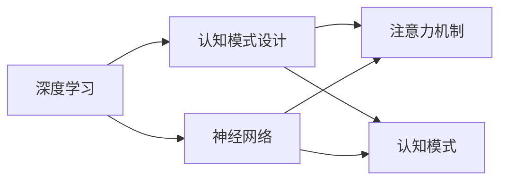

                 

# 注意力编程工作室主管：AI定制的认知模式设计负责人

## 1. 背景介绍

### 1.1 问题由来
在人工智能(AI)迅速发展的今天，“认知模式设计”(Cognitive Mode Design)正逐渐成为人工智能领域的一大热门话题。它涉及到如何通过AI技术构建更加智能的认知模式，进而应用于各种智能系统和解决方案中。随着深度学习、神经网络和AI系统的不断发展，认知模式设计逐渐成为了实现人机交互、智能决策、认知分析等智能应用的重要工具。

### 1.2 问题核心关键点
1. **认知模式设计的定义**：认知模式设计指的是利用AI技术，特别是深度学习算法，来构建能够模拟人类认知过程的模型。这些模型通常用于模拟人类的注意力机制、知识推理、记忆和决策等认知行为。

2. **认知模式设计的目标**：通过设计能够理解、推理、学习并适应不同情境的认知模式，使得AI系统能够更智能地应对复杂、多变的环境。

3. **认知模式设计的应用**：广泛应用于智能助手、自动驾驶、智能推荐系统、情感分析、自然语言处理、医学诊断等领域，以提升系统性能、减少人工干预、提供更智能化的服务。

4. **认知模式设计的挑战**：认知模式设计仍面临诸如模型的可解释性、鲁棒性、适应性、安全性等诸多挑战，需要进一步的优化和研究。

## 2. 核心概念与联系

### 2.1 核心概念概述

1. **认知模式设计**：指通过AI技术，特别是深度学习算法，构建能够模拟人类认知过程的模型。这些模型通常用于模拟人类的注意力机制、知识推理、记忆和决策等认知行为。

2. **深度学习**：利用神经网络进行训练，通过多层非线性变换学习数据表示的AI技术。深度学习广泛应用于图像识别、语音识别、自然语言处理等领域。

3. **注意力机制**：指在神经网络中，通过学习模型中的参数，对输入数据的特定部分赋予更高的权重，以此来提高模型对关键信息的关注度。

4. **认知模式**：指通过深度学习构建的能够模仿人类认知过程的模型，这些模型通常用于模拟注意力、知识推理、记忆和决策等认知行为。

5. **神经网络**：由大量人工神经元节点组成的计算模型，用于处理复杂的数据表示和模式识别。

这些核心概念之间的联系主要体现在，通过深度学习技术，构建能够模拟人类认知过程的认知模式，这些模式通常基于神经网络，并利用注意力机制等技术来提高对关键信息的关注度和处理能力。

### 2.2 核心概念原理和架构的 Mermaid 流程图



## 3. 核心算法原理 & 具体操作步骤

### 3.1 算法原理概述

认知模式设计的基础是深度学习，尤其是神经网络。神经网络通过多层非线性变换学习数据的表示，而注意力机制则是提升模型关注关键信息的重要工具。

1. **神经网络**：神经网络通常由输入层、多个隐藏层和输出层组成。输入层接收原始数据，隐藏层通过多次非线性变换提取数据的特征表示，输出层给出最终的预测结果。

2. **注意力机制**：注意力机制通过学习模型中的参数，对输入数据的特定部分赋予更高的权重，以此来提高模型对关键信息的关注度。

### 3.2 算法步骤详解

1. **数据预处理**：对输入数据进行标准化、归一化、数据增强等预处理操作，以便于神经网络更好地学习数据特征。

2. **神经网络模型构建**：根据具体任务需求，设计合适的神经网络模型结构。包括选择网络层数、节点数、激活函数等。

3. **注意力机制设计**：在神经网络中加入注意力机制，以提高模型对关键信息的关注度。例如，可以使用自注意力机制，通过计算输入序列中各个元素之间的相似度，赋予不同元素不同的权重。

4. **模型训练**：使用大量标注数据，通过反向传播算法优化模型参数，使其能够准确预测目标结果。

5. **模型评估**：在测试集上评估模型的性能，调整模型参数，以进一步提升模型效果。

### 3.3 算法优缺点

#### 3.3.1 优点

1. **强大的特征提取能力**：神经网络能够学习复杂的数据表示，适用于处理复杂多变的数据。

2. **鲁棒性**：注意力机制能够增强模型对关键信息的关注，提高模型的鲁棒性和泛化能力。

3. **可解释性**：通过注意力机制，可以理解模型在处理数据时的关注点，提高模型的可解释性。

#### 3.3.2 缺点

1. **计算复杂度高**：神经网络需要大量的计算资源，训练和推理速度较慢。

2. **过拟合风险**：神经网络容易过拟合，尤其是在数据量较小的情况下。

3. **模型复杂度高**：神经网络结构复杂，难以理解和调试。

4. **可解释性不足**：注意力机制虽然能够增强模型的可解释性，但仍然存在一定的局限性，特别是在复杂任务中。

### 3.4 算法应用领域

认知模式设计在多个领域中得到了广泛应用，例如：

1. **自然语言处理(NLP)**：用于文本分类、机器翻译、情感分析、对话系统等任务。

2. **计算机视觉(CV)**：用于图像识别、目标检测、图像分割等任务。

3. **智能推荐系统**：用于个性化推荐、广告推荐等任务。

4. **医学诊断**：用于医学影像分析、疾病诊断等任务。

5. **自动驾驶**：用于环境感知、路径规划、决策等任务。

6. **金融分析**：用于信用评分、风险评估等任务。

## 4. 数学模型和公式 & 详细讲解

### 4.1 数学模型构建

认知模式设计的数学模型通常基于神经网络，特别是卷积神经网络(CNN)和循环神经网络(RNN)。以下以卷积神经网络为例，介绍其基本数学模型。

1. **卷积神经网络(CNN)**：卷积神经网络由卷积层、池化层和全连接层组成。其基本数学模型如下：

$$
h_{l+1} = \sigma(W_{l+1} h_l + b_{l+1})
$$

其中，$h_l$ 表示第 $l$ 层的输入，$h_{l+1}$ 表示第 $l+1$ 层的输出，$\sigma$ 表示激活函数，$W_{l+1}$ 表示第 $l+1$ 层的权重矩阵，$b_{l+1}$ 表示第 $l+1$ 层的偏置向量。

### 4.2 公式推导过程

以卷积层为例，其数学模型可以表示为：

$$
h_{l+1} = \sigma(\sum_k w_{ik} x_{k,l-1} + b_l)
$$

其中，$w_{ik}$ 表示卷积核的权重，$x_{k,l-1}$ 表示输入数据的特征图，$b_l$ 表示偏置向量。

卷积层通过对输入数据进行卷积操作，提取特征图 $h_{l+1}$。池化层则对特征图进行降采样操作，减少特征图的大小。

### 4.3 案例分析与讲解

以图像分类任务为例，其数学模型可以表示为：

1. **卷积层**：

$$
h_{l+1} = \sigma(\sum_k w_{ik} x_{k,l-1} + b_l)
$$

2. **池化层**：

$$
h_{l+1} = \max(h_{l})
$$

3. **全连接层**：

$$
h_{l+1} = \sigma(W_{l+1} h_l + b_{l+1})
$$

4. **输出层**：

$$
y = \sigma(W_{out} h_{l+1} + b_{out})
$$

其中，$W_{out}$ 表示输出层的权重矩阵，$b_{out}$ 表示输出层的偏置向量，$y$ 表示模型的输出结果。

## 5. 项目实践：代码实例和详细解释说明

### 5.1 开发环境搭建

为了构建认知模式设计模型，需要以下开发环境：

1. **Python**：Python 3.8及以上版本。

2. **PyTorch**：深度学习框架，用于构建和训练神经网络模型。

3. **TensorBoard**：可视化工具，用于监控模型的训练过程。

4. **Jupyter Notebook**：交互式编程环境，方便调试和可视化。

5. **CUDA**：NVIDIA GPU加速工具，用于加速模型训练和推理。

### 5.2 源代码详细实现

以下是一个简单的卷积神经网络模型实现代码示例：

```python
import torch
import torch.nn as nn
import torch.optim as optim

class CNN(nn.Module):
    def __init__(self):
        super(CNN, self).__init__()
        self.conv1 = nn.Conv2d(in_channels=1, out_channels=32, kernel_size=3, stride=1, padding=1)
        self.pool = nn.MaxPool2d(kernel_size=2, stride=2)
        self.fc1 = nn.Linear(in_features=32 * 4 * 4, out_features=128)
        self.fc2 = nn.Linear(in_features=128, out_features=10)
        
    def forward(self, x):
        x = torch.relu(self.conv1(x))
        x = self.pool(x)
        x = torch.relu(self.fc1(x.view(-1, 32 * 4 * 4)))
        x = self.fc2(x)
        return x

model = CNN()
criterion = nn.CrossEntropyLoss()
optimizer = optim.Adam(model.parameters(), lr=0.001)
```

### 5.3 代码解读与分析

1. **模型定义**：使用 `nn.Conv2d` 定义卷积层，`nn.MaxPool2d` 定义池化层，`nn.Linear` 定义全连接层。

2. **前向传播**：使用 `torch.relu` 激活函数，`torch.max` 池化操作，`torch.view` 转换数据形状，最后返回模型的输出结果。

3. **损失函数**：使用 `nn.CrossEntropyLoss` 作为分类任务的损失函数。

4. **优化器**：使用 `optim.Adam` 优化器进行模型训练。

### 5.4 运行结果展示

在训练过程中，可以使用 TensorBoard 可视化模型训练过程，监控损失函数和准确率的变化。

```python
from torch.utils.tensorboard import SummaryWriter

writer = SummaryWriter(log_dir='logs')
for epoch in range(10):
    # 训练模型
    ...
    # 记录训练结果
    writer.add_scalar('loss', loss, epoch)
    writer.add_scalar('accuracy', accuracy, epoch)
    writer.close()
```

## 6. 实际应用场景

### 6.1 智能推荐系统

在智能推荐系统中，认知模式设计可以用于分析用户行为和兴趣，推荐个性化的商品和服务。通过构建基于神经网络的推荐模型，能够根据用户的浏览记录、购买历史等数据，预测用户可能感兴趣的商品，从而提高推荐系统的准确性和用户满意度。

### 6.2 自然语言处理

在自然语言处理(NLP)领域，认知模式设计可以用于文本分类、情感分析、机器翻译、对话系统等任务。通过构建基于神经网络的认知模式，能够更好地理解和处理自然语言，提供更加智能化的服务。

### 6.3 医学诊断

在医学诊断领域，认知模式设计可以用于医学影像分析、疾病诊断等任务。通过构建基于深度学习的认知模式，能够从医学影像中提取特征，帮助医生快速准确地诊断疾病，提高诊断效率和准确性。

## 7. 工具和资源推荐

### 7.1 学习资源推荐

1. **《深度学习》**：Ian Goodfellow、Yoshua Bengio 和 Aaron Courville 合著的经典教材，深入浅出地介绍了深度学习的基本原理和应用。

2. **《TensorFlow 2.0教程》**：TensorFlow 官方文档，提供了详细的教程和示例，适合学习深度学习框架。

3. **《深度学习入门：基于 PyTorch 的实践》**：李沐著，介绍了使用 PyTorch 构建和训练深度学习模型的具体方法和实例。

4. **《Attention is All You Need》**：Transformer 模型的原始论文，介绍了注意力机制的基本原理和应用。

### 7.2 开发工具推荐

1. **PyTorch**：深度学习框架，提供了丰富的深度学习模型和工具。

2. **TensorBoard**：可视化工具，用于监控模型的训练过程。

3. **Jupyter Notebook**：交互式编程环境，方便调试和可视化。

4. **CUDA**：NVIDIA GPU加速工具，用于加速模型训练和推理。

### 7.3 相关论文推荐

1. **《A Survey of Attention Models for NLP》**：Bilal Rajkomar 等人的综述论文，介绍了注意力机制在自然语言处理中的应用。

2. **《ResNet: Deep Residual Learning for Image Recognition》**：Kaiming He 等人提出的 ResNet 模型，提升了深度神经网络在图像识别任务上的性能。

3. **《Dynamic Attention for Deep Neural Networks》**：Leonard Loshchilov 等人提出的动态注意力机制，用于增强深度神经网络的注意力能力。

## 8. 总结：未来发展趋势与挑战

### 8.1 总结

本文对认知模式设计进行了全面系统的介绍，重点阐述了认知模式设计的基本原理、步骤和应用。通过分析认知模式设计中的关键技术，如神经网络、注意力机制等，全面理解认知模式设计的核心概念和应用。

### 8.2 未来发展趋势

1. **神经网络结构优化**：未来将进一步优化神经网络结构，如卷积神经网络、残差网络、注意力网络等，以提高模型的性能和可解释性。

2. **多模态融合**：未来将探索多模态融合技术，结合图像、语音、文本等多种模态数据，提升认知模式设计的鲁棒性和应用范围。

3. **认知模式迁移学习**：未来将探索认知模式的迁移学习技术，使得模型能够跨领域、跨任务迁移，提升模型的通用性和可扩展性。

4. **认知模式可解释性**：未来将探索认知模式的可解释性技术，如可视化、解释生成等，提高模型的可解释性和用户信任度。

### 8.3 面临的挑战

1. **计算资源瓶颈**：神经网络训练和推理需要大量的计算资源，未来将探索更高效、更轻量级的模型架构和优化技术。

2. **模型过拟合**：神经网络容易过拟合，未来将探索更有效的正则化技术和数据增强技术，以提高模型的泛化能力。

3. **数据获取成本高**：获取高质量的标注数据成本高，未来将探索更多的无监督和半监督学习技术，降低对标注数据的依赖。

4. **模型鲁棒性不足**：神经网络对噪声和异常数据敏感，未来将探索更多的鲁棒性提升技术，如对抗训练、噪声鲁棒性训练等。

5. **模型可解释性不足**：神经网络模型通常难以解释，未来将探索更多的可解释性技术和方法，如模型可视化、解释生成等。

### 8.4 研究展望

1. **认知模式迁移学习**：探索认知模式的迁移学习技术，使得模型能够跨领域、跨任务迁移，提升模型的通用性和可扩展性。

2. **多模态认知模式设计**：结合图像、语音、文本等多种模态数据，提升认知模式设计的鲁棒性和应用范围。

3. **认知模式可解释性**：探索认知模式的可解释性技术，如可视化、解释生成等，提高模型的可解释性和用户信任度。

4. **认知模式高效优化**：探索更高效、更轻量级的模型架构和优化技术，以提高模型的性能和可扩展性。

## 9. 附录：常见问题与解答

### 9.1 常见问题

**Q1：认知模式设计是否适用于所有 AI 任务？**

A: 认知模式设计在大多数 AI 任务上都能取得不错的效果，但对于一些特定领域的任务，如医学、法律等，需要进一步的预训练和微调，以提升模型的性能。

**Q2：如何选择神经网络的架构？**

A: 选择合适的神经网络架构需要考虑任务类型、数据量、计算资源等因素。例如，对于图像识别任务，可以选择卷积神经网络；对于序列数据，可以选择循环神经网络或Transformer模型。

**Q3：如何优化神经网络模型的训练过程？**

A: 优化神经网络模型的训练过程需要考虑多种因素，如学习率、批次大小、正则化、数据增强等。建议使用多种优化方法，如Adam、SGD等，并结合超参数调优技术，以获得最佳的模型效果。

**Q4：如何评估神经网络模型的性能？**

A: 评估神经网络模型的性能通常需要考虑多个指标，如准确率、召回率、F1 分数、AUC 等。建议在测试集上评估模型的性能，并结合可视化工具，如TensorBoard，以更直观地理解模型的表现。

**Q5：如何提高神经网络模型的可解释性？**

A: 提高神经网络模型的可解释性可以通过可视化、解释生成等技术实现。建议使用工具如LIME、SHAP等，对模型进行解释，并结合实际应用场景，进行可解释性的优化和改进。

---

作者：禅与计算机程序设计艺术 / Zen and the Art of Computer Programming

