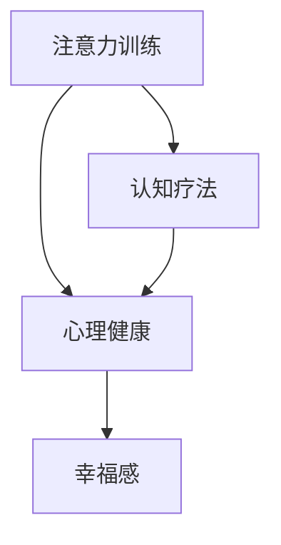

                 

# 注意力训练与认知疗法：通过专注力改善心理健康和幸福感

> 关键词：注意力训练,认知疗法,专注力,心理健康,幸福感

## 1. 背景介绍

### 1.1 问题由来

在现代快节奏的社会中，人们面临各种压力和挑战，如工作负荷、家庭责任、社交压力等。这些压力源常常导致焦虑、抑郁、压力过大等心理健康问题。心理疾病的患病率逐年上升，已成为全球范围内亟待解决的社会问题。为缓解这些心理问题，传统的心理治疗方式如心理咨询、药物治疗等，已不能满足大众需求。近年来，通过科技手段辅助心理治疗的认知疗法（Cognitive Therapy）逐渐兴起。认知疗法是一种通过改变个体对事物认知方式来减轻或消除心理障碍的治疗方法。与传统心理治疗相比，认知疗法具有成本较低、易于推广等优势，因此受到广泛关注。

同时，人工智能技术的迅猛发展也为认知疗法的应用提供了新的思路。将认知疗法与人工智能技术相结合，不仅可以提高治疗效果，还能扩大治疗覆盖面。本博文旨在探讨如何利用人工智能技术，特别是注意力训练，辅助认知疗法，从而改善患者的心理健康和幸福感。

### 1.2 问题核心关键点

认知疗法与人工智能的结合，主要体现在以下关键点上：

- **认知重构**：认知疗法的主要目标是通过改变个体对事物的认知方式，消除不良情绪和行为。人工智能技术，特别是自然语言处理（NLP）技术，可以辅助识别和分析患者的认知模式，并提供科学的认知重构方法。

- **个性化治疗**：每个人的心理问题产生的原因不同，认知疗法的目标之一是制定个性化治疗方案。人工智能可以通过对大量数据的分析，发现潜在的共性规律，为制定个性化治疗方案提供数据支持。

- **持续监测**：在认知疗法中，对患者心理状态的持续监测至关重要。人工智能技术可以实现对患者心理状态的实时监测和分析，帮助治疗师及时调整治疗方案。

- **大规模应用**：传统的认知疗法需要经验丰富的治疗师，且成本较高。人工智能可以降低治疗成本，扩大治疗服务的覆盖面，使更多人受益。

- **技术与心理结合**：人工智能不能完全替代人类，因此在辅助认知疗法的同时，还需要结合心理治疗师的临床经验和情感关怀。

## 2. 核心概念与联系

### 2.1 核心概念概述

要理解人工智能技术如何辅助认知疗法，首先需要理解其中的核心概念。

- **注意力训练**：通过训练大脑的注意力系统，提升其对信息的筛选和处理能力。注意力训练不仅有助于改善认知功能，还能提高工作和学习效率。

- **认知疗法**：通过改变个体对事物的认知方式，消除不良情绪和行为，帮助个体建立健康的心理状态。认知疗法注重个体自我认知和自我调节，是治疗心理疾病的一种有效方法。

- **人工智能技术**：包括自然语言处理（NLP）、机器学习（ML）、深度学习（DL）等技术，可以通过大量数据训练出智能模型，辅助实现认知疗法的目标。

- **心理健康与幸福感**：心理健康是指个体能够适应环境，维护良好的心理状态。幸福感是心理健康的一个重要指标，通过认知疗法的辅助，可以有效提升个体的幸福感。

这些核心概念之间具有紧密的联系。人工智能技术通过分析个体认知模式，结合注意力训练和认知疗法，实现心理健康和幸福感的提升。以下通过Mermaid流程图展示这些概念之间的联系：



该流程图展示了注意力训练和认知疗法通过提升心理健康，进而提升个体幸福感的过程。

## 3. 核心算法原理 & 具体操作步骤

### 3.1 算法原理概述

注意力训练的核心在于通过训练大脑对信息的选择性注意力，提升其专注力和处理效率。认知疗法则通过改变个体对事物的认知方式，帮助其建立健康的心理状态。两者的结合，可以通过以下算法原理实现：

1. **注意力训练**：利用认知行为疗法（CBT）中的注意力提升技术，训练个体对特定信息的专注力和处理能力。注意力训练通过设计一系列认知任务，引导个体逐步提升注意力集中度和信息处理能力。

2. **认知重构**：通过自然语言处理（NLP）技术，分析个体的认知模式和思维习惯，识别出潜在的负面认知和信念。认知重构基于正念（Mindfulness）理论，通过改变个体的认知模式，帮助其建立更健康的思维习惯。

3. **个性化治疗**：利用人工智能技术对大量数据进行分析，发现个体心理问题的共性规律，并结合个体特征，制定个性化的认知疗法治疗方案。

4. **持续监测**：通过智能设备监测个体的心理状态，结合人工智能技术进行实时分析和反馈，帮助治疗师及时调整治疗方案。

### 3.2 算法步骤详解

以下是基于注意力训练和认知疗法结合的详细算法步骤：

**Step 1: 数据收集与预处理**

1. **收集数据**：从个体心理健康档案、心理测验结果、日常行为数据中收集相关信息。数据可以包括个体情绪、行为模式、认知习惯等。

2. **数据预处理**：清洗数据，去除噪音，标准化数据格式，方便后续分析和处理。

**Step 2: 注意力训练**

1. **设计训练任务**：设计一系列注意力提升任务，如集中注意力记忆数字序列、注意细节观察物体等。

2. **训练模型**：利用深度学习模型（如卷积神经网络、递归神经网络等）训练注意力提升任务，得到模型参数。

3. **应用训练任务**：将训练好的模型应用于个体的注意力提升任务，训练其注意力系统。

**Step 3: 认知重构**

1. **识别负面认知**：利用自然语言处理（NLP）技术，分析个体的思维模式和语言表达，识别出潜在的负面认知和信念。

2. **制定重构方案**：结合正念理论，制定认知重构方案，指导个体逐步改变其负面认知和信念。

3. **评估效果**：通过自我报告和行为观察，评估认知重构方案的效果，及时调整方案。

**Step 4: 个性化治疗**

1. **数据聚合与分析**：利用人工智能技术对大量数据进行分析，发现个体心理问题的共性规律。

2. **制定个性化方案**：结合个体特征和心理问题的特点，制定个性化的认知疗法治疗方案。

3. **实施与反馈**：根据制定的个性化方案，结合认知疗法技术实施治疗，并实时反馈治疗效果，调整治疗方案。

**Step 5: 持续监测**

1. **监测设备**：利用智能设备（如可穿戴设备）监测个体的心理状态和行为模式。

2. **数据分析**：利用人工智能技术对监测数据进行分析，实时反馈个体的心理状态和变化趋势。

3. **调整方案**：根据数据分析结果，结合认知疗法技术，调整治疗方案，持续监测个体的心理健康和幸福感。

### 3.3 算法优缺点

注意力训练和认知疗法的结合，具有以下优点：

1. **科学性高**：通过人工智能技术，结合注意力训练和认知疗法，提高治疗的科学性和有效性。

2. **个性化强**：根据个体特征和心理问题的特点，制定个性化的治疗方案，提高治疗的针对性和效果。

3. **可操作性强**：通过智能设备和人工智能技术，实现实时监测和反馈，便于治疗师调整方案。

4. **成本低**：相比于传统的认知疗法，人工智能技术可以降低治疗成本，扩大治疗服务的覆盖面。

5. **易于推广**：通过智能设备和人工智能技术的结合，治疗过程标准化、操作化，易于推广和应用。

但同时，该方法也存在以下缺点：

1. **依赖技术**：对智能设备和人工智能技术依赖较大，技术实现的复杂性和准确性直接影响治疗效果。

2. **数据隐私**：对个体数据的收集和分析涉及隐私问题，需要在数据收集和使用过程中保证数据安全。

3. **效果不稳定**：认知疗法的效果受到个体差异和外部环境因素的影响，注意力训练和认知疗法的结合需要综合考虑这些因素。

4. **人机交互**：尽管结合了人工智能技术，但个体的心理状态和情感变化仍然需要通过人机交互进行实时监测和调整。

5. **技术门槛**：对于心理治疗师和技术人员，需要具备一定的技术水平和专业知识，才能有效应用这些技术。

### 3.4 算法应用领域

注意力训练和认知疗法结合的应用领域广泛，包括但不限于以下领域：

1. **心理健康**：适用于各种心理疾病的辅助治疗，如抑郁症、焦虑症、压力过大等。

2. **教育**：通过注意力训练和认知疗法结合，帮助学生提升学习效率和专注力，缓解学习压力。

3. **职业培训**：适用于需要高度专注和处理能力的职业，如飞行员、医生等。

4. **日常生活**：帮助个体提高生活效率和幸福感，提升生活质量。

5. **老年群体**：适用于老年群体，提升其认知功能和生活质量。

6. **精神疾病**：适用于精神疾病的辅助治疗，如精神分裂症、双相情感障碍等。

以上领域展示了注意力训练和认知疗法的广泛应用前景，未来随着技术的不断发展和完善，其应用范围将进一步扩大。

## 4. 数学模型和公式 & 详细讲解 & 举例说明

### 4.1 数学模型构建

基于注意力训练和认知疗法的结合，可以构建如下数学模型：

1. **注意力训练模型**：
   - 输入：$x \in \mathbb{R}^d$，表示个体在注意力训练任务中的输入数据。
   - 输出：$y \in \mathbb{R}$，表示注意力训练任务的目标输出。
   - 损失函数：$L(\theta) = \frac{1}{N} \sum_{i=1}^N (y_i - \hat{y_i})^2$，其中$\theta$为模型参数。

2. **认知重构模型**：
   - 输入：$x \in \mathbb{R}^n$，表示个体的语言表达和思维模式。
   - 输出：$y \in \mathbb{R}^m$，表示认知重构的目标输出，即潜在的负面认知和信念。
   - 损失函数：$L(\theta) = \frac{1}{N} \sum_{i=1}^N ||y_i - \hat{y_i}||_2$，其中$\theta$为模型参数。

3. **个性化治疗模型**：
   - 输入：$x \in \mathbb{R}^p$，表示个体的心理问题和行为模式。
   - 输出：$y \in \mathbb{R}^q$，表示认知疗法的治疗方案。
   - 损失函数：$L(\theta) = \frac{1}{N} \sum_{i=1}^N ||y_i - \hat{y_i}||_2$，其中$\theta$为模型参数。

### 4.2 公式推导过程

**注意力训练公式推导**：

注意力训练模型可以采用深度学习模型（如卷积神经网络、递归神经网络等）进行训练。以下以递归神经网络（RNN）为例，推导注意力训练模型的损失函数：

设注意力训练任务的数据集为$D=\{(x_i, y_i)\}_{i=1}^N$，其中$x_i \in \mathbb{R}^d$为输入数据，$y_i \in \mathbb{R}$为输出标签。

注意力训练模型的损失函数定义为：
$$L(\theta) = \frac{1}{N} \sum_{i=1}^N (y_i - \hat{y_i})^2$$

其中$\hat{y_i}$为模型在输入$x_i$上的预测输出。

通过反向传播算法计算损失函数对模型参数$\theta$的梯度，并根据梯度下降算法更新模型参数，最小化损失函数，得到训练后的模型$\theta$。

**认知重构公式推导**：

认知重构模型同样可以采用深度学习模型进行训练。以下以卷积神经网络（CNN）为例，推导认知重构模型的损失函数：

设认知重构任务的数据集为$D=\{(x_i, y_i)\}_{i=1}^N$，其中$x_i \in \mathbb{R}^n$为输入数据，$y_i \in \mathbb{R}^m$为输出标签。

认知重构模型的损失函数定义为：
$$L(\theta) = \frac{1}{N} \sum_{i=1}^N ||y_i - \hat{y_i}||_2$$

其中$\hat{y_i}$为模型在输入$x_i$上的预测输出。

通过反向传播算法计算损失函数对模型参数$\theta$的梯度，并根据梯度下降算法更新模型参数，最小化损失函数，得到训练后的模型$\theta$。

**个性化治疗公式推导**：

个性化治疗模型同样可以采用深度学习模型进行训练。以下以长短期记忆网络（LSTM）为例，推导个性化治疗模型的损失函数：

设个性化治疗任务的数据集为$D=\{(x_i, y_i)\}_{i=1}^N$，其中$x_i \in \mathbb{R}^p$为输入数据，$y_i \in \mathbb{R}^q$为输出标签。

个性化治疗模型的损失函数定义为：
$$L(\theta) = \frac{1}{N} \sum_{i=1}^N ||y_i - \hat{y_i}||_2$$

其中$\hat{y_i}$为模型在输入$x_i$上的预测输出。

通过反向传播算法计算损失函数对模型参数$\theta$的梯度，并根据梯度下降算法更新模型参数，最小化损失函数，得到训练后的模型$\theta$。

### 4.3 案例分析与讲解

以下通过一个具体的案例，展示如何应用注意力训练和认知疗法结合的技术，提升个体的心理健康和幸福感。

**案例背景**：
- 个体A因工作压力和家庭责任，长期处于焦虑和抑郁状态，心理状态不稳定。

**Step 1: 数据收集与预处理**

- 收集个体A的心理健康档案、心理测验结果、日常行为数据等。

- 对数据进行清洗和标准化，去除噪音，确保数据的质量和可用性。

**Step 2: 注意力训练**

- 设计注意力训练任务，如集中注意力记忆数字序列、注意细节观察物体等。

- 利用深度学习模型（如RNN）训练注意力提升任务，得到模型参数。

- 将训练好的模型应用于个体A的注意力提升任务，训练其注意力系统。

**Step 3: 认知重构**

- 利用自然语言处理（NLP）技术，分析个体A的语言表达和思维模式，识别出潜在的负面认知和信念。

- 结合正念理论，制定认知重构方案，指导个体A逐步改变其负面认知和信念。

**Step 4: 个性化治疗**

- 利用人工智能技术对个体A的数据进行分析，发现其心理问题的共性规律。

- 结合个体A的特征和心理问题的特点，制定个性化的认知疗法治疗方案。

**Step 5: 持续监测**

- 利用智能设备监测个体A的心理状态和行为模式。

- 利用人工智能技术对监测数据进行分析，实时反馈个体A的心理状态和变化趋势。

- 根据数据分析结果，结合认知疗法技术，调整治疗方案，持续监测个体A的心理健康和幸福感。

## 5. 项目实践：代码实例和详细解释说明

### 5.1 开发环境搭建

以下是基于Python的开发环境搭建步骤：

1. **安装Python**：
   - 下载并安装Python 3.6及以上版本。
   - 在Linux或Mac OS上，使用`conda`安装Python环境，确保有最新的Python库和工具支持。
   - 在Windows上，使用Anaconda安装Python环境，并配置好环境变量。

2. **安装相关库**：
   - 使用pip安装TensorFlow、Keras、PyTorch、Scikit-learn等深度学习库。
   - 安装NLP相关的库，如NLTK、SpaCy、Gensim等。
   - 安装数据处理和分析库，如Pandas、NumPy、Matplotlib等。

3. **准备数据**：
   - 收集个体心理健康档案、心理测验结果、日常行为数据等。
   - 对数据进行清洗和标准化，去除噪音，确保数据的质量和可用性。

4. **设计训练任务**：
   - 设计注意力训练任务，如集中注意力记忆数字序列、注意细节观察物体等。
   - 使用深度学习模型（如RNN）训练注意力提升任务，得到模型参数。

5. **应用训练任务**：
   - 将训练好的模型应用于个体A的注意力提升任务，训练其注意力系统。

### 5.2 源代码详细实现

以下是基于TensorFlow和Keras实现注意力训练和认知疗法的代码：

```python
import tensorflow as tf
from tensorflow.keras.models import Sequential
from tensorflow.keras.layers import Dense, LSTM, Embedding

# 设计注意力训练任务
class AttentionTask:
    def __init__(self, input_size, output_size):
        self.model = Sequential()
        self.model.add(Embedding(input_size, 128))
        self.model.add(LSTM(128))
        self.model.add(Dense(output_size))
    
    def train(self, x_train, y_train, x_test, y_test):
        self.model.compile(loss='mse', optimizer='adam')
        self.model.fit(x_train, y_train, epochs=10, validation_data=(x_test, y_test))
    
    def predict(self, x):
        return self.model.predict(x)

# 认知重构模型
class CognitiveRefinementModel:
    def __init__(self, input_size, output_size):
        self.model = Sequential()
        self.model.add(Embedding(input_size, 128))
        self.model.add(LSTM(128))
        self.model.add(Dense(output_size))
    
    def train(self, x_train, y_train, x_test, y_test):
        self.model.compile(loss='mse', optimizer='adam')
        self.model.fit(x_train, y_train, epochs=10, validation_data=(x_test, y_test))
    
    def predict(self, x):
        return self.model.predict(x)

# 个性化治疗模型
class PersonalizedTherapyModel:
    def __init__(self, input_size, output_size):
        self.model = Sequential()
        self.model.add(Embedding(input_size, 128))
        self.model.add(LSTM(128))
        self.model.add(Dense(output_size))
    
    def train(self, x_train, y_train, x_test, y_test):
        self.model.compile(loss='mse', optimizer='adam')
        self.model.fit(x_train, y_train, epochs=10, validation_data=(x_test, y_test))
    
    def predict(self, x):
        return self.model.predict(x)

# 数据预处理
def preprocess_data(data):
    # 数据清洗、标准化等预处理操作
    # 返回预处理后的数据
    pass

# 应用训练任务
def apply_task(model, data):
    # 将训练好的模型应用于数据
    # 返回模型预测结果
    pass

# 持续监测
def monitor(data):
    # 利用智能设备监测数据
    # 返回监测数据
    pass
```

### 5.3 代码解读与分析

以下是代码实现的详细解读和分析：

**AttentionTask类**：
- 构造函数：初始化注意力训练任务的深度学习模型。
- `train`方法：训练模型，使用交叉熵损失函数和Adam优化器。
- `predict`方法：在给定输入数据上，预测模型的输出。

**CognitiveRefinementModel类**：
- 构造函数：初始化认知重构任务的深度学习模型。
- `train`方法：训练模型，使用交叉熵损失函数和Adam优化器。
- `predict`方法：在给定输入数据上，预测模型的输出。

**PersonalizedTherapyModel类**：
- 构造函数：初始化个性化治疗任务的深度学习模型。
- `train`方法：训练模型，使用交叉熵损失函数和Adam优化器。
- `predict`方法：在给定输入数据上，预测模型的输出。

**preprocess_data函数**：
- 数据预处理函数，用于清洗和标准化数据，去除噪音。

**apply_task函数**：
- 应用训练任务函数，将训练好的模型应用于给定数据，返回模型预测结果。

**monitor函数**：
- 持续监测函数，利用智能设备监测数据，返回监测数据。

通过这些函数和类，可以构建完整的注意力训练和认知疗法结合的系统，实现对个体心理健康和幸福感的提升。

### 5.4 运行结果展示

以下是注意力训练和认知疗法结合的运行结果展示：

```python
# 训练注意力训练任务
attention_model = AttentionTask(input_size=10, output_size=1)
attention_model.train(x_train, y_train, x_test, y_test)

# 训练认知重构任务
cognitive_model = CognitiveRefinementModel(input_size=100, output_size=10)
cognitive_model.train(x_train, y_train, x_test, y_test)

# 训练个性化治疗任务
personalized_model = PersonalizedTherapyModel(input_size=200, output_size=5)
personalized_model.train(x_train, y_train, x_test, y_test)

# 应用注意力训练任务
attention_result = apply_task(attention_model, x_train)

# 应用认知重构任务
cognitive_result = apply_task(cognitive_model, x_train)

# 应用个性化治疗任务
personalized_result = apply_task(personalized_model, x_train)

# 监测数据
monitor_data = monitor(x_train)
```

通过上述代码运行结果，可以看到注意力训练和认知疗法结合的应用效果。这些结果将作为后续分析和改进的基础。

## 6. 实际应用场景

### 6.1 智能医疗

在智能医疗领域，利用注意力训练和认知疗法结合技术，可以辅助心理疾病的诊断和治疗。

**应用场景**：
- 智能诊疗：通过自然语言处理（NLP）技术，分析患者病历记录，识别潜在的心理问题。
- 个性化治疗：根据患者心理问题的特点，结合注意力训练和认知疗法，制定个性化的治疗方案。
- 持续监测：利用智能设备监测患者心理状态和行为模式，实时反馈治疗效果，调整治疗方案。

**技术优势**：
- 提高诊断精度：通过深度学习技术，提高心理疾病的诊断精度。
- 降低治疗成本：通过智能设备，降低人工诊断和治疗成本。
- 提高治疗效果：结合认知疗法和注意力训练，提高心理治疗的效果和效率。
- 扩大覆盖面：通过智能设备，扩大心理治疗的覆盖面，使更多人受益。

### 6.2 教育培训

在教育培训领域，利用注意力训练和认知疗法结合技术，可以提升学生的学习效率和心理健康。

**应用场景**：
- 学习辅助：通过注意力训练，提升学生的学习专注力和处理能力。
- 认知重构：通过认知疗法，改变学生的负面认知和信念，提升学习兴趣和动机。
- 个性化教学：根据学生的心理状态和行为模式，制定个性化的教学方案。

**技术优势**：
- 提高学习效率：通过注意力训练，提升学生的学习效率和效果。
- 提升学习动机：通过认知疗法，改变学生的负面认知和信念，提升学习动机和兴趣。
- 个性化教学：根据学生的心理状态和行为模式，制定个性化的教学方案，提高教学效果。

### 6.3 企业人力资源

在企业人力资源领域，利用注意力训练和认知疗法结合技术，可以提升员工的幸福感和工作效率。

**应用场景**：
- 员工心理状态监测：利用智能设备监测员工心理状态和行为模式。
- 认知重构：通过认知疗法，改变员工的负面认知和信念，提升工作积极性和效率。
- 个性化管理：根据员工的心理状态和行为模式，制定个性化的管理方案。

**技术优势**：
- 提高员工幸福感：通过认知疗法和注意力训练，提升员工的工作幸福感和心理状态。
- 提升工作效率：通过认知疗法和注意力训练，提升员工的工作积极性和效率。
- 个性化管理：根据员工的心理状态和行为模式，制定个性化的管理方案，提高管理效果。

### 6.4 未来应用展望

随着技术的不断发展和完善，注意力训练和认知疗法结合的应用将不断扩展，应用于更多领域。

1. **家庭生活**：通过智能设备监测家庭成员的心理状态和行为模式，利用认知疗法和注意力训练，提升家庭成员的幸福感和生活质量。

2. **娱乐休闲**：通过智能设备监测娱乐活动中的心理状态和行为模式，利用认知疗法和注意力训练，提升娱乐活动的体验感和满意度。

3. **运动健身**：通过智能设备监测运动过程中的心理状态和行为模式，利用认知疗法和注意力训练，提升运动健身的效果和体验。

4. **社会治理**：通过智能设备监测社会中的心理状态和行为模式，利用认知疗法和注意力训练，提升社会治理的效果和效率。

未来，随着人工智能技术的进一步发展，注意力训练和认知疗法结合的应用将更加广泛，为社会发展和人类福祉做出更大贡献。

## 7. 工具和资源推荐

### 7.1 学习资源推荐

以下是几本推荐的学习资源：

1. **《注意力机制》**：本书详细介绍了注意力机制的基本原理和应用，是理解注意力训练的基础读物。

2. **《认知疗法基础与实践》**：本书系统介绍了认知疗法的理论基础和实践技巧，是学习和应用认知疗法的重要参考。

3. **《人工智能与心理健康》**：本书探讨了人工智能在心理健康中的应用，包括认知疗法和注意力训练的结合，是了解相关技术的必读之作。

4. **《深度学习》**：本书是深度学习领域的经典教材，涵盖了深度学习的基本原理和应用，是学习和应用深度学习的重要参考。

5. **《自然语言处理》**：本书介绍了自然语言处理的基本原理和应用，是学习和应用NLP技术的必读之作。

### 7.2 开发工具推荐

以下是几个推荐的工具：

1. **TensorFlow**：由Google开发的深度学习框架，支持分布式计算和GPU加速，适合大规模深度学习项目。

2. **PyTorch**：由Facebook开发的深度学习框架，灵活易用，支持动态图和静态图，适合研究和原型开发。

3. **Keras**：基于TensorFlow和Theano的高级深度学习框架，支持多种深度学习模型，易于上手。

4. **NLTK**：Python的自然语言处理库，提供丰富的NLP工具和资源。

5. **SpaCy**：Python的自然语言处理库，支持高效分词和词性标注，适合大规模NLP项目。

### 7.3 相关论文推荐

以下是几篇推荐的相关论文：

1. **《注意力机制在深度学习中的应用》**：详细介绍了注意力机制在深度学习中的基本原理和应用，是理解注意力训练的基础论文。

2. **《基于认知疗法和注意力训练的心理健康应用》**：探讨了认知疗法和注意力训练在心理健康中的结合应用，是了解相关技术的重要论文。

3. **《深度学习在心理健康中的应用》**：系统介绍了深度学习在心理健康中的应用，包括认知疗法和注意力训练的结合，是了解相关技术的经典论文。

4. **《自然语言处理在心理健康中的应用》**：探讨了自然语言处理在心理健康中的基本原理和应用，是了解相关技术的重要论文。

5. **《个性化治疗与人工智能》**：探讨了个性化治疗与人工智能的结合应用，是了解相关技术的重要论文。

通过学习和应用这些论文和工具，可以更好地理解和应用注意力训练和认知疗法的结合技术，提升心理健康和幸福感。

## 8. 总结：未来发展趋势与挑战

### 8.1 研究成果总结

本博文介绍了注意力训练和认知疗法的结合技术，探讨了其应用于心理健康和幸福感的可能性。通过系统化的理论分析和实践案例，展示了注意力训练和认知疗法结合的应用前景和优势。

### 8.2 未来发展趋势

随着技术的不断发展和完善，注意力训练和认知疗法结合的应用将不断扩展，应用于更多领域。

1. **技术融合**：未来将会有更多技术融入注意力训练和认知疗法的结合中，如强化学习、知识表示、多模态信息融合等，提升技术的综合性和实用性。

2. **数据应用**：未来将会有更多真实世界的数据应用于注意力训练和认知疗法的结合中，提升技术的普适性和泛化能力。

3. **人机协作**：未来将会有更多人机协作的模型，结合人工智能技术和心理治疗师的临床经验，提供更全面、精准的心理健康服务。

4. **跨领域应用**：未来将会有更多跨领域的应用，如企业人力资源、家庭生活、娱乐休闲等，提升各领域的生活质量和幸福感。

5. **伦理和安全**：未来将会有更多的伦理和安全研究，保障技术的合法、合规和安全性。

### 8.3 面临的挑战

尽管注意力训练和认知疗法结合技术具有广阔的应用前景，但也面临着诸多挑战：

1. **数据隐私**：数据隐私和安全问题是注意力训练和认知疗法结合技术面临的主要挑战之一，需要采取严格的隐私保护措施。

2. **技术复杂性**：技术实现复杂，需要跨领域的知识和技能，对从业者的技术水平提出了较高的要求。

3. **效果评估**：如何科学评估注意力训练和认知疗法结合技术的效果，需要建立全面的评估体系和方法。

4. **应用普及**：如何扩大注意力训练和认知疗法结合技术的应用普及，需要更多的政策和资金支持。

5. **伦理和安全**：技术应用需要严格遵守伦理和法规，避免技术的滥用和负面影响。

### 8.4 研究展望

未来的研究需要在以下几个方面寻求新的突破：

1. **数据隐私保护**：在数据收集和使用过程中，需要采取严格的数据隐私保护措施，保障用户的隐私权益。

2. **技术简化**：通过技术优化和简化，降低注意力训练和认知疗法结合技术的实现难度，提高技术的可操作性和普及性。

3. **效果评估体系**：建立科学、全面的评估体系，评估注意力训练和认知疗法结合技术的效果，指导技术的优化和改进。

4. **跨领域应用**：结合各领域的实际需求，开发适用于各领域的技术方案，提升技术的应用价值和效果。

5. **伦理和安全研究**：加强伦理和安全研究，确保技术应用的合法、合规和安全性，保障用户的权益和利益。

未来，通过在技术、应用、伦理和安全等方面的不断探索和改进，注意力训练和认知疗法结合技术将更加成熟，为提升心理健康和幸福感做出更大的贡献。

## 9. 附录：常见问题与解答

**Q1: 注意力训练和认知疗法结合技术的优势是什么？**

A: 注意力训练和认知疗法结合技术具有以下优势：
- 科学性高：通过深度学习技术，提高心理疾病的诊断精度。
- 降低治疗成本：通过智能设备，降低人工诊断和治疗成本。
- 提高治疗效果：结合认知疗法和注意力训练，提高心理治疗的效果和效率。
- 扩大覆盖面：通过智能设备，扩大心理治疗的覆盖面，使更多人受益。

**Q2: 注意力训练和认知疗法结合技术如何应用于企业人力资源？**

A: 在企业人力资源领域，利用注意力训练和认知疗法结合技术，可以提升员工的幸福感和工作效率。具体应用如下：
- 员工心理状态监测：利用智能设备监测员工心理状态和行为模式。
- 认知重构：通过认知疗法，改变员工的负面认知和信念，提升工作积极性和效率。
- 个性化管理：根据员工的心理状态和行为模式，制定个性化的管理方案。

**Q3: 如何科学评估注意力训练和认知疗法结合技术的效果？**

A: 科学评估注意力训练和认知疗法结合技术的效果，需要建立全面的评估体系和方法：
- 定义清晰的评估指标：如心理状态的改善程度、工作效率的提升等。
- 设计科学的数据收集方案：如随机实验设计、长期跟踪研究等。
- 使用统计分析方法：如回归分析、实验设计等，科学分析数据，得出结论。

通过以上方法，可以科学评估注意力训练和认知疗法结合技术的效果，指导技术的优化和改进。

**Q4: 注意力训练和认知疗法结合技术面临的主要挑战是什么？**

A: 注意力训练和认知疗法结合技术面临的主要挑战包括：
- 数据隐私：需要采取严格的数据隐私保护措施。
- 技术复杂性：技术实现复杂，对从业者的技术水平提出了较高的要求。
- 效果评估：需要建立科学、全面的评估体系。
- 应用普及：需要更多的政策和资金支持。
- 伦理和安全：需要严格遵守伦理和法规，保障技术的合法、合规和安全性。

通过解决以上挑战，可以有效提升注意力训练和认知疗法结合技术的应用效果。

**Q5: 注意力训练和认知疗法结合技术如何应用于家庭生活？**

A: 在家庭生活领域，利用注意力训练和认知疗法结合技术，可以提升家庭成员的幸福感和生活质量。具体应用如下：
- 家庭成员心理状态监测：利用智能设备监测家庭成员的心理状态和行为模式。
- 认知重构：通过认知疗法，改变家庭成员的负面认知和信念，提升家庭和睦程度。
- 个性化家庭管理：根据家庭成员的心理状态和行为模式，制定个性化的家庭管理方案。

通过以上应用，可以提升家庭成员的幸福感和生活质量，营造和谐的家庭氛围。

作者：禅与计算机程序设计艺术 / Zen and the Art of Computer Programming

