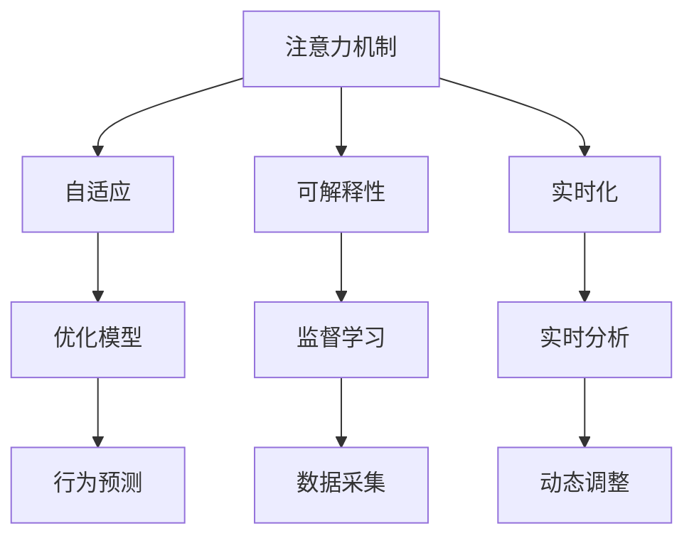

                 

# 注意力货币化策略师：AI驱动的关注度经济专家

在数字经济时代，注意力作为一种稀缺资源，其价值日益凸显。从流量广告到内容营销，从社交媒体到电商平台，一切商业行为都在争夺用户的注意力。而人工智能技术，尤其是注意力机制，正成为重新定义关注度经济的关键利器。本文将深度剖析AI驱动的注意力货币化策略，探讨其核心概念、算法原理、实际操作、未来应用以及相关资源和工具，旨在为关注度经济专家提供一份全面、系统的技术指南。

## 1. 背景介绍

### 1.1 问题由来

随着互联网的飞速发展，用户注意力成为数字经济中最珍贵的资源之一。无论是广告商、内容创作者还是电商平台，都在试图通过各种方式吸引并保持用户的关注。然而，传统方法在快速变化的市场环境中显得捉襟见肘，AI技术的介入为这一领域带来了新的突破。

人工智能技术的核心之一是注意力机制，这是一种通过自适应权重对信息进行优先级排序的技术。在大数据和深度学习的基础上，注意力机制被广泛应用于自然语言处理、计算机视觉、推荐系统等诸多领域。通过精妙的算法设计，AI能够自动抓取并分析用户行为，从而精准预测和引导用户的注意力，实现商业价值的最大化。

### 1.2 问题核心关键点

注意力货币化策略师的核心任务在于：

1. **数据采集与处理**：通过多种渠道获取用户数据，并进行清洗、预处理和特征工程，为模型训练提供基础。
2. **模型设计与优化**：选择合适的注意力模型和算法，并进行模型训练和调优，提升模型预测准确性和泛化能力。
3. **用户行为分析**：分析用户点击、停留、购买等行为，洞察用户偏好和需求。
4. **决策与优化**：基于模型输出和用户行为分析，制定和优化广告投放、内容推荐等策略，提升关注度与转化率。

本文将围绕这些核心关键点，深入探讨AI在注意力货币化中的角色和应用。

## 2. 核心概念与联系

### 2.1 核心概念概述

为了更好地理解AI驱动的注意力货币化策略，我们首先需要明确几个关键概念：

- **注意力机制(Attention Mechanism)**：一种通过自适应权重对信息进行优先级排序的技术，能够有效提高模型的预测能力和泛化性能。
- **自适应(Adaptation)**：指模型能够根据不同的数据和情境，动态调整其内部参数和策略，从而提升适应性。
- **可解释性(Explainability)**：指模型的决策过程能够被用户和开发者理解，便于监督和调整。
- **实时化(Real-time)**：指模型能够在用户行为发生后实时分析并做出响应，提高商业决策的时效性。

这些概念之间存在紧密的联系，共同构成了AI驱动的注意力货币化策略的核心框架。通过精巧的算法设计，注意力机制能够捕捉和利用用户的注意力，自适应地调整策略，提升可解释性，并在实时环境中做出高效的商业决策。

### 2.2 核心概念原理和架构的 Mermaid 流程图



该流程图展示了注意力货币化策略中各概念之间的联系：

1. 注意力机制是策略的核心，通过自适应权重对信息进行优先级排序。
2. 自适应能力使得模型能够动态调整策略，提升泛化性能。
3. 可解释性通过监督学习提升模型的决策过程透明性。
4. 实时化通过实时分析提高商业决策的时效性。
5. 优化模型通过行为预测和动态调整进一步提升模型性能。

## 3. 核心算法原理 & 具体操作步骤

### 3.1 算法原理概述

AI驱动的注意力货币化策略基于自适应注意力机制，通过学习用户行为数据，预测用户注意力分布，进而优化广告投放、内容推荐等策略。其核心算法流程如下：

1. **数据采集与预处理**：通过API、爬虫等手段收集用户点击、购买、停留等行为数据，并进行清洗、归一化等预处理操作。
2. **特征工程**：将用户行为数据转化为模型可接受的特征向量，如时间戳、位置、设备类型等。
3. **模型训练**：选择合适的注意力模型，如Transformer、LSTM等，在标注数据上训练模型，优化模型参数。
4. **实时预测**：实时获取用户行为数据，通过模型预测用户注意力分布，动态调整策略。
5. **策略优化**：基于预测结果和用户反馈，优化广告投放、内容推荐等策略，提升用户关注度和转化率。

### 3.2 算法步骤详解

#### 3.2.1 数据采集与预处理

数据采集是注意力货币化策略的基础。主要通过以下几种方式获取用户数据：

1. **API接口**：从网站、应用程序等获取用户行为数据，如点击、购买、停留时间等。
2. **Web爬虫**：通过网络爬虫技术，获取公开的网页数据，如网页浏览记录、评论信息等。
3. **设备传感器**：通过手机、电脑等设备传感器，获取用户行为数据，如地理位置、设备类型等。

数据预处理包括：

1. **清洗**：去除数据中的噪声和不完整记录。
2. **归一化**：将数据转化为模型可接受的标准格式，如时间戳转换为数值型特征。
3. **特征选择**：根据领域知识和实验结果，选择对注意力预测有用的特征。

#### 3.2.2 特征工程

特征工程是构建模型前的重要步骤，将原始数据转化为模型可接受的特征向量。常用的特征工程方法包括：

1. **时间特征**：将时间戳转化为时序特征，如小时、星期、季节等。
2. **位置特征**：将地理位置转化为经纬度、IP地址等数值型特征。
3. **设备特征**：将设备类型、操作系统、浏览器等信息转化为数值型特征。
4. **行为特征**：将用户的点击、停留、购买等行为转化为特征向量。

#### 3.2.3 模型训练

模型训练是注意力货币化策略的核心步骤，选择合适的模型并对其进行训练优化。常用的模型包括：

1. **Transformer**：基于自注意力机制的模型，能够捕捉复杂的信息依赖关系。
2. **LSTM**：长短期记忆网络，适用于处理时间序列数据，捕捉序列依赖性。
3. **CNN**：卷积神经网络，适用于处理图像和文本数据，提取局部特征。

模型训练步骤如下：

1. **划分数据集**：将数据集分为训练集、验证集和测试集，通常采用8:1:1的比例。
2. **选择损失函数**：根据任务类型选择合适的损失函数，如交叉熵、均方误差等。
3. **优化器选择**：选择合适的优化器，如Adam、SGD等，设置学习率、批大小等参数。
4. **训练模型**：在训练集上对模型进行优化，周期性在验证集上评估模型性能，根据性能指标决定是否触发Early Stopping。
5. **测试模型**：在测试集上评估模型性能，输出最终结果。

#### 3.2.4 实时预测

实时预测是注意力货币化策略的重要应用场景。主要步骤如下：

1. **数据获取**：实时获取用户行为数据，如点击、停留、购买等。
2. **模型调用**：将实时数据输入训练好的模型，获取注意力预测结果。
3. **策略调整**：基于预测结果，动态调整广告投放、内容推荐等策略。

#### 3.2.5 策略优化

策略优化是注意力货币化策略的关键环节。主要步骤如下：

1. **A/B测试**：通过A/B测试，比较不同策略的效果，选择最优策略。
2. **用户反馈**：收集用户对广告、内容等反馈，优化策略。
3. **持续优化**：通过模型迭代，持续优化策略，提升用户关注度和转化率。

### 3.3 算法优缺点

#### 3.3.1 优点

1. **高精度预测**：通过注意力机制和深度学习模型，能够精确预测用户注意力分布。
2. **自适应能力强**：能够动态调整策略，适应不同场景和用户行为。
3. **实时性强**：实时获取用户行为数据，动态调整策略，提升决策时效性。
4. **可解释性高**：通过监督学习提升模型可解释性，便于监督和调整。

#### 3.3.2 缺点

1. **数据依赖性强**：依赖高质量标注数据，数据收集和预处理成本高。
2. **计算资源消耗大**：深度学习模型计算量大，需要高性能硬件支持。
3. **模型复杂度高**：复杂模型可能导致过拟合，难以解释和优化。
4. **隐私问题**：用户行为数据涉及隐私，需要严格的数据保护措施。

### 3.4 算法应用领域

AI驱动的注意力货币化策略广泛应用于以下几个领域：

1. **广告投放**：通过预测用户注意力，优化广告展示位置和内容，提升点击率和转化率。
2. **内容推荐**：根据用户行为预测其兴趣，推荐相关内容，提高用户停留时间和满意度。
3. **社交媒体运营**：分析用户互动数据，优化内容发布策略，提升用户活跃度和粘性。
4. **电商平台**：预测用户购买意向，优化商品推荐和价格策略，提升用户购买率和满意度。
5. **搜索引擎优化**：通过预测用户查询意图，优化搜索结果排名和展示，提升用户点击率。

## 4. 数学模型和公式 & 详细讲解 & 举例说明

### 4.1 数学模型构建

假设用户行为数据为 $\mathcal{X}$，注意力分布为 $\mathcal{Y}$，模型为 $f(\mathcal{X};\theta)$，其中 $\theta$ 为模型参数。目标是通过训练 $f(\mathcal{X};\theta)$ 预测注意力分布 $\mathcal{Y}$。

模型训练的目标是最小化预测误差，即：

$$
\min_{\theta} \frac{1}{N} \sum_{i=1}^N \| f(\mathcal{X}_i;\theta) - \mathcal{Y}_i \|^2
$$

其中 $N$ 为数据集大小，$\mathcal{X}_i$ 为第 $i$ 个样本，$\mathcal{Y}_i$ 为对应的注意力分布。

### 4.2 公式推导过程

以Transformer模型为例，其自注意力机制公式为：

$$
\text{Attention}(Q, K, V) = \text{softmax}(QK^T)V
$$

其中 $Q$ 为查询向量，$K$ 为键向量，$V$ 为值向量。通过计算查询向量与键向量的点积，得到注意力权重矩阵 $A$，进而计算加权和得到注意力输出。

### 4.3 案例分析与讲解

以电商平台的用户行为预测为例，分析注意力货币化策略的实施过程：

1. **数据采集**：通过API和爬虫获取用户点击、购买、停留等行为数据。
2. **数据预处理**：清洗数据，将时间戳转化为时间特征，设备信息转化为设备特征。
3. **特征工程**：选择时间特征、位置特征、设备特征等，构建特征向量。
4. **模型训练**：使用Transformer模型，通过交叉熵损失函数训练模型，优化模型参数。
5. **实时预测**：实时获取用户点击数据，通过模型预测用户购买意向。
6. **策略优化**：根据预测结果，动态调整商品推荐策略，提升用户购买率和满意度。

## 5. 项目实践：代码实例和详细解释说明

### 5.1 开发环境搭建

在进行注意力货币化策略的开发前，我们需要准备好开发环境。以下是使用Python进行TensorFlow和Keras开发的环境配置流程：

1. 安装Anaconda：从官网下载并安装Anaconda，用于创建独立的Python环境。

2. 创建并激活虚拟环境：
```bash
conda create -n tf-env python=3.8 
conda activate tf-env
```

3. 安装TensorFlow和Keras：
```bash
conda install tensorflow==2.6.0 
pip install keras
```

4. 安装各类工具包：
```bash
pip install numpy pandas scikit-learn matplotlib tqdm jupyter notebook ipython
```

完成上述步骤后，即可在`tf-env`环境中开始注意力货币化策略的实践。

### 5.2 源代码详细实现

下面我们以电商平台的商品推荐系统为例，给出使用TensorFlow和Keras对注意力模型进行实现的PyTorch代码实现。

```python
import tensorflow as tf
from tensorflow.keras.layers import Input, Embedding, Dense, Concatenate, Dot, Dense, Flatten
from tensorflow.keras.models import Model

# 定义模型输入
user_input = Input(shape=(1,), name='user')
product_input = Input(shape=(1,), name='product')
time_input = Input(shape=(1,), name='time')
location_input = Input(shape=(1,), name='location')
device_input = Input(shape=(1,), name='device')

# 定义特征层
user_feature = Embedding(input_dim=num_users, output_dim=128)(user_input)
product_feature = Embedding(input_dim=num_products, output_dim=128)(product_input)
time_feature = Dense(64)(Flatten()(time_input))
location_feature = Dense(64)(Flatten()(location_input))
device_feature = Dense(64)(Flatten()(device_input))

# 定义注意力层
attention = Dot(axes=1, normalize=True)([user_feature, product_feature])
attention = Dense(64)(attention)

# 定义输出层
output = Dense(1, activation='sigmoid')(tf.keras.layers.Concatenate()([attention, user_feature, product_feature, time_feature, location_feature, device_feature]))

# 定义模型
model = Model(inputs=[user_input, product_input, time_input, location_input, device_input], outputs=output)

# 编译模型
model.compile(optimizer='adam', loss='binary_crossentropy', metrics=['accuracy'])

# 训练模型
model.fit(x=[...], y=[...], epochs=10, batch_size=32)
```

### 5.3 代码解读与分析

让我们再详细解读一下关键代码的实现细节：

**定义模型输入**：
- 定义了用户ID、商品ID、时间、位置、设备等输入，用于特征提取。

**定义特征层**：
- 通过嵌入层将用户ID和商品ID转化为密集向量，捕捉用户和商品之间的关系。
- 使用全连接层对时间、位置和设备等特征进行降维和提取。

**定义注意力层**：
- 使用点积注意力机制计算用户对商品的注意力权重。
- 使用全连接层对注意力权重进行降维和变换。

**定义输出层**：
- 使用全连接层将注意力权重、用户特征、商品特征、时间特征、位置特征和设备特征拼接起来，得到最终的预测结果。

**定义模型**：
- 将输入和输出层组合成完整的模型。

**编译模型**：
- 选择优化器和损失函数，进行模型编译。

**训练模型**：
- 使用训练数据和标签进行模型训练，优化模型参数。

## 6. 实际应用场景

### 6.1 智能广告投放

智能广告投放是注意力货币化策略的重要应用场景。通过分析用户行为数据，预测用户对不同广告的注意力分布，优化广告展示位置和内容，从而提升广告点击率和转化率。

在技术实现上，可以收集用户在网站、应用程序等平台上的点击、浏览、购买等行为数据，构建标注数据集。在此基础上，使用注意力机制训练模型，实时获取用户行为数据，动态调整广告投放策略。例如，根据用户的点击记录，预测其对不同广告的兴趣程度，选择最匹配的广告进行展示，提高广告的点击率和转化率。

### 6.2 个性化推荐系统

个性化推荐系统是注意力货币化策略的另一重要应用。通过分析用户行为数据，预测用户对不同内容的关注度，推荐最符合用户兴趣的内容，提高用户满意度和留存率。

在技术实现上，可以收集用户在电商平台、社交媒体等平台上的点击、购买、收藏等行为数据，构建标注数据集。在此基础上，使用注意力机制训练模型，实时获取用户行为数据，动态调整内容推荐策略。例如，根据用户的浏览记录和购买历史，预测其对不同商品的兴趣程度，推荐最相关的商品，提高用户购买率和满意度。

### 6.3 内容创作与优化

内容创作与优化也是注意力货币化策略的重要应用。通过分析用户对不同内容的互动数据，预测用户对内容的关注度和满意度，指导内容创作者优化内容创作和发布策略。

在技术实现上，可以收集用户在社交媒体、新闻网站等平台上的点赞、评论、分享等行为数据，构建标注数据集。在此基础上，使用注意力机制训练模型，实时获取用户行为数据，动态调整内容发布策略。例如，根据用户的互动数据，预测其对不同文章的兴趣程度，指导内容创作者优化文章内容，提高文章的阅读量和互动率。

### 6.4 未来应用展望

随着AI技术的不断发展，注意力货币化策略将在更多领域得到应用，为各行各业带来变革性影响。

在智慧医疗领域，基于注意力机制的医疗问答系统，能够精准预测用户对疾病信息的关注度，提供个性化的健康建议和医疗服务，提升用户的健康水平和满意度。

在智能教育领域，基于注意力机制的学习推荐系统，能够精准预测用户对不同课程的关注度，推荐最符合用户学习需求的内容，提高学习效果和用户体验。

在智能交通领域，基于注意力机制的导航系统，能够精准预测用户对不同路线的关注度，提供最优的出行方案，提升用户的出行效率和满意度。

此外，在金融、零售、物流等诸多领域，注意力货币化策略也将带来新的突破，为产业升级和智能化转型提供新的路径。

## 7. 工具和资源推荐

### 7.1 学习资源推荐

为了帮助开发者系统掌握注意力货币化策略的理论基础和实践技巧，这里推荐一些优质的学习资源：

1. 《深度学习》系列书籍：由Ian Goodfellow等撰写，全面介绍了深度学习的基本原理和实践应用，是学习注意力货币化策略的重要参考。

2. 《自然语言处理综述》系列文章：由斯坦福大学自然语言处理组撰写，介绍了自然语言处理领域的最新进展和技术应用，包括注意力机制的原理和实践。

3. 《强化学习与智能决策》课程：由DeepMind和斯坦福大学联合开设，介绍了强化学习的基本原理和应用，对于理解智能决策中的注意力机制具有重要参考价值。

4. Coursera《机器学习》课程：由斯坦福大学Andrew Ng教授开设，介绍了机器学习的基本原理和应用，包括监督学习和注意力机制。

5. Udacity《深度学习专业》课程：由Google和斯坦福大学联合开设，介绍了深度学习的基本原理和应用，包括注意力机制的实践。

通过对这些资源的学习实践，相信你一定能够快速掌握注意力货币化策略的精髓，并用于解决实际的商业问题。

### 7.2 开发工具推荐

高效的开发离不开优秀的工具支持。以下是几款用于注意力货币化策略开发的常用工具：

1. TensorFlow：由Google主导开发的开源深度学习框架，生产部署方便，适合大规模工程应用。

2. PyTorch：基于Python的开源深度学习框架，灵活动态的计算图，适合快速迭代研究。

3. Keras：基于TensorFlow和Theano的高级深度学习API，提供了丰富的层和模型，方便模型构建和训练。

4. Weights & Biases：模型训练的实验跟踪工具，可以记录和可视化模型训练过程中的各项指标，方便对比和调优。

5. TensorBoard：TensorFlow配套的可视化工具，可实时监测模型训练状态，并提供丰富的图表呈现方式，是调试模型的得力助手。

合理利用这些工具，可以显著提升注意力货币化策略的开发效率，加快创新迭代的步伐。

### 7.3 相关论文推荐

注意力货币化策略的发展源于学界的持续研究。以下是几篇奠基性的相关论文，推荐阅读：

1. Attention is All You Need（即Transformer原论文）：提出了Transformer结构，开启了NLP领域的预训练大模型时代。

2. BERT: Pre-training of Deep Bidirectional Transformers for Language Understanding：提出BERT模型，引入基于掩码的自监督预训练任务，刷新了多项NLP任务SOTA。

3. Generative Adversarial Nets（GAN）：提出GAN模型，通过对抗训练优化模型，提高了模型的生成能力。

4. Self-Attention Mechanism for Recommendation Systems：提出基于自注意力机制的推荐系统，通过注意力机制提升了推荐效果。

5. Attention-Based Text Summarization：提出基于注意力机制的文本摘要方法，通过动态调整注意力权重生成摘要。

这些论文代表了大语言模型注意力货币化策略的发展脉络。通过学习这些前沿成果，可以帮助研究者把握学科前进方向，激发更多的创新灵感。

## 8. 总结：未来发展趋势与挑战

### 8.1 总结

本文对AI驱动的注意力货币化策略进行了全面系统的介绍。首先阐述了注意力机制在数字经济中的核心地位，明确了注意力货币化策略师的任务和目标。其次，从原理到实践，详细讲解了注意力货币化策略的数学模型和关键操作步骤，给出了注意力货币化策略任务开发的完整代码实例。同时，本文还广泛探讨了注意力货币化策略在广告投放、个性化推荐、内容优化等多个领域的应用前景，展示了其巨大的商业价值。

通过本文的系统梳理，可以看到，AI驱动的注意力货币化策略在数字经济时代具有广泛的应用前景。这种策略通过精准预测用户注意力，动态调整商业策略，极大地提升了各领域的运营效率和用户体验。未来，伴随注意力货币化策略的不断发展和完善，必将为数字经济带来更加深远的影响。

### 8.2 未来发展趋势

展望未来，注意力货币化策略将呈现以下几个发展趋势：

1. **技术融合加速**：未来将更加注重技术融合，将注意力机制与深度学习、强化学习等技术进行深度结合，提升模型的预测能力和决策水平。
2. **模型复杂度提升**：随着模型的不断优化和优化算法的进步，注意力模型将逐渐从简单到复杂，从单一任务到多任务，从静态到动态。
3. **实时性要求提高**：在实时化运营中，对模型的实时预测和策略调整要求不断提高，实时性成为衡量模型性能的重要指标。
4. **可解释性加强**：模型的可解释性将逐渐成为关注点，研究者将更加注重模型的透明性和可理解性，增强用户信任。
5. **跨领域应用拓展**：未来注意力货币化策略将在更多领域得到应用，如智慧医疗、智能教育、智慧交通等，为各行各业带来新的变革。

### 8.3 面临的挑战

尽管注意力货币化策略已经取得了瞩目成就，但在迈向更加智能化、普适化应用的过程中，它仍面临着诸多挑战：

1. **数据隐私问题**：用户行为数据涉及隐私，需要严格的数据保护措施。如何在保障数据隐私的同时，获取足够的数据进行模型训练，是一个重要挑战。
2. **计算资源消耗大**：深度学习模型计算量大，需要高性能硬件支持。如何在资源有限的情况下，优化模型性能，是一个重要挑战。
3. **模型泛化能力差**：模型泛化能力差，在特定领域或数据分布上，可能表现不佳。如何在不同领域和数据分布上，提升模型的泛化能力，是一个重要挑战。
4. **对抗攻击问题**：模型可能面临对抗攻击，导致预测结果不准确。如何提高模型的鲁棒性，抵御对抗攻击，是一个重要挑战。
5. **多目标优化问题**：注意力货币化策略往往涉及多个目标的优化，如点击率、转化率、用户满意度等。如何在多目标间进行权衡，优化策略，是一个重要挑战。

### 8.4 研究展望

面对注意力货币化策略面临的种种挑战，未来的研究需要在以下几个方面寻求新的突破：

1. **数据隐私保护**：研究隐私保护技术，如差分隐私、联邦学习等，在保障数据隐私的同时，获取足够的数据进行模型训练。
2. **计算资源优化**：研究模型压缩、稀疏化等技术，优化模型性能，降低计算资源消耗。
3. **模型泛化能力提升**：研究跨领域迁移学习、多任务学习等技术，提升模型的泛化能力，适应不同领域和数据分布。
4. **模型鲁棒性增强**：研究对抗攻击防御技术，提升模型的鲁棒性，抵御对抗攻击。
5. **多目标优化**：研究多目标优化算法，在多个目标间进行权衡，优化策略。

这些研究方向和创新将推动注意力货币化策略向更加智能化、普适化方向发展，为数字经济带来更多的变革性影响。

## 9. 附录：常见问题与解答

**Q1：如何处理标注数据不足的问题？**

A: 标注数据不足是注意力货币化策略的常见挑战。为了缓解这一问题，可以采用以下几种方法：

1. **半监督学习**：在少量标注数据的基础上，使用自监督学习技术进行预训练，提升模型性能。
2. **无监督学习**：在无标注数据的基础上，使用自关联学习技术进行训练，提升模型泛化能力。
3. **迁移学习**：在相关领域的数据上预训练模型，进行跨领域迁移学习，提升模型泛化能力。
4. **主动学习**：通过主动选择标注样本，最大化利用标注数据，提升模型性能。

**Q2：如何处理对抗攻击问题？**

A: 对抗攻击是注意力货币化策略面临的重要挑战。为了应对这一问题，可以采用以下几种方法：

1. **对抗训练**：在训练过程中，引入对抗样本进行训练，提高模型的鲁棒性。
2. **鲁棒性优化**：使用鲁棒性优化算法，如Dropout、L2正则等，提升模型的鲁棒性。
3. **模型压缩**：使用模型压缩技术，如剪枝、量化等，提升模型的鲁棒性。
4. **异常检测**：使用异常检测技术，识别对抗样本，进行过滤和处理。

**Q3：如何提升模型的实时性？**

A: 实时性是注意力货币化策略的重要指标。为了提升模型的实时性，可以采用以下几种方法：

1. **模型优化**：使用模型优化技术，如量化加速、模型并行等，提升模型的计算效率。
2. **数据预处理**：优化数据预处理流程，减少计算时间。
3. **硬件优化**：使用高性能硬件设备，如GPU、TPU等，提升计算速度。
4. **缓存机制**：使用缓存机制，减少重复计算，提升计算效率。

通过这些方法的综合应用，可以显著提升注意力货币化策略的实时性，满足用户对实时性要求。

**Q4：如何提升模型的可解释性？**

A: 可解释性是注意力货币化策略的重要目标。为了提升模型的可解释性，可以采用以下几种方法：

1. **可解释性技术**：使用可解释性技术，如LIME、SHAP等，解释模型的预测过程。
2. **模型简化**：简化模型结构，降低模型的复杂度，提高模型的可解释性。
3. **用户参与**：与用户进行互动，收集用户反馈，理解模型的决策过程。
4. **透明化决策**：使用透明化决策机制，记录和展示模型的决策过程。

通过这些方法的综合应用，可以显著提升注意力货币化策略的可解释性，增强用户信任。

**Q5：如何应对多目标优化问题？**

A: 多目标优化是注意力货币化策略的重要挑战。为了应对这一问题，可以采用以下几种方法：

1. **多目标优化算法**：使用多目标优化算法，如Pareto优化、多目标遗传算法等，在多个目标间进行权衡。
2. **目标函数设计**：设计合理的目标函数，在多个目标间进行平衡。
3. **模型融合**：使用模型融合技术，将多个模型的预测结果进行加权组合，提升模型性能。
4. **用户反馈**：收集用户反馈，理解用户需求，优化策略。

通过这些方法的综合应用，可以显著提升注意力货币化策略的多目标优化能力，满足用户对多目标的需求。

**Q6：如何应对跨领域应用挑战？**

A: 跨领域应用是注意力货币化策略的重要目标。为了应对这一问题，可以采用以下几种方法：

1. **跨领域迁移学习**：在相关领域的数据上预训练模型，进行跨领域迁移学习，提升模型泛化能力。
2. **领域自适应**：使用领域自适应技术，如AdaBoost、AdaBoost+等，提升模型的适应能力。
3. **多模态学习**：将多种模态的数据进行融合，提升模型的泛化能力。
4. **多领域模型**：使用多领域模型，提升模型在不同领域上的性能。

通过这些方法的综合应用，可以显著提升注意力货币化策略的跨领域应用能力，提升模型的泛化能力和适应性。

---

作者：禅与计算机程序设计艺术 / Zen and the Art of Computer Programming

