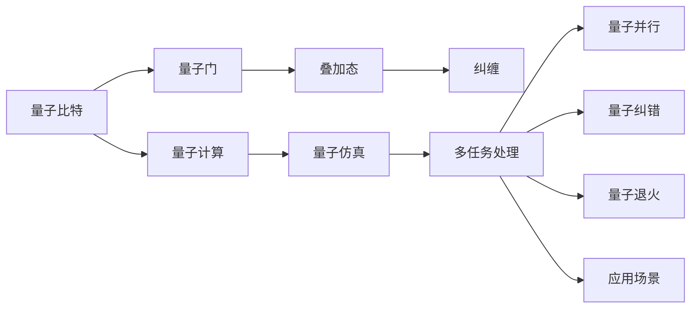

                 

## 1. 背景介绍

### 1.1 问题由来

随着AI技术的蓬勃发展，计算机系统在处理多任务时面临的挑战日益凸显。由于计算资源的有限性，如何在有限的时间内高效处理多个任务，提升系统整体的执行效率，成为学术界和工业界共同关注的焦点。量子计算作为一种前沿技术，被认为能够以超越经典计算机的速度处理某些特定类型的问题，尤其是在多任务处理方面展现了巨大的潜力。然而，量子计算机的物理实现目前尚处于早期阶段，其编程和应用仍面临诸多技术难题。

为了在现有计算机上模拟量子计算机的行为，量子计算的仿真技术应运而生。量子计算仿真能够提供一种低成本、易于实现的替代方案，帮助我们更好地理解和应用量子计算原理。本文将深入探讨量子计算仿真的多任务处理策略，结合量子计算理论和经典计算实践，提出一系列创新的多任务处理方法和应用，旨在提升现有计算机系统的多任务处理能力。

### 1.2 问题核心关键点

量子计算仿真作为多任务处理的一种前沿技术，主要涉及以下几个核心关键点：

- **量子计算原理**：理解量子比特、量子门、叠加态、纠缠等基本量子计算概念。
- **量子仿真框架**：熟悉TensorFlow Quantum (TFQ)、IBM Qiskit等主流量子计算仿真平台。
- **多任务处理策略**：掌握量子并行、量子纠错、量子退火等技术，以及如何在经典计算机上模拟实现。
- **实际应用场景**：研究多任务处理在药物设计、材料科学、优化问题等领域的应用前景。

本文将重点讨论如何在量子计算仿真的框架下，实现多任务高效处理，并详细阐述其在不同应用场景中的具体策略。

## 2. 核心概念与联系

### 2.1 核心概念概述

- **量子计算**：一种基于量子力学原理的计算模式，通过量子比特（qubits）和量子门（quantum gates）实现计算。量子计算具有强大的并行能力和解决某些特定问题的优势。
- **量子仿真**：通过经典计算机模拟量子计算机的行为，实现量子计算的算法和电路设计，帮助理解和应用量子计算原理。
- **多任务处理**：在同一物理平台上并行执行多个任务，提高系统资源的利用率和整体执行效率。

### 2.2 核心概念原理和架构的 Mermaid 流程图



## 3. 核心算法原理 & 具体操作步骤

### 3.1 算法原理概述

量子计算仿真在多任务处理方面的核心原理是利用量子计算的优势，通过并行计算、量子纠错和量子退火等技术，实现多任务的快速处理。具体而言，量子计算仿真框架可以在经典计算机上模拟量子计算机的行为，将量子计算的优势与经典计算的灵活性结合，从而实现高效的多任务处理。

### 3.2 算法步骤详解

1. **量子比特初始化**：每个任务使用一组量子比特（qubits）作为计算的基本单位，初始化为特定状态。
2. **量子门应用**：根据每个任务的需求，应用相应的量子门对量子比特进行操作，实现量子计算的基本逻辑。
3. **量子叠加与纠缠**：利用量子叠加和纠缠的特性，增加每个任务的计算能力，实现并行计算的效果。
4. **量子纠错**：使用量子纠错技术，检测和修正量子比特的错误，提高量子计算的稳定性。
5. **量子退火**：使用量子退火算法，解决某些特定的优化问题，如组合优化和材料设计。
6. **多任务处理**：在同一量子计算仿真的框架下，并行处理多个任务，提高计算效率。

### 3.3 算法优缺点

#### 优点

- **高并行性**：量子计算的叠加态和纠缠特性使得量子计算具有极高的并行性，能够同时处理大量任务。
- **高准确性**：量子纠错技术能够有效检测和修正量子比特的错误，提高计算的准确性和稳定性。
- **广泛适用性**：量子计算仿真的多任务处理策略适用于各种科学计算和优化问题。

#### 缺点

- **硬件依赖**：量子计算仿真依赖于经典计算机，其性能受限于经典计算机的硬件资源。
- **技术复杂性**：量子计算和量子纠错等技术较为复杂，需要深入的理论知识。
- **计算成本高**：量子计算模拟需要大量的计算资源，对计算能力要求较高。

### 3.4 算法应用领域

量子计算仿真的多任务处理策略已经在以下几个领域得到应用：

- **药物设计**：使用量子计算模拟生物分子的结构与性质，加速药物筛选和设计。
- **材料科学**：利用量子计算模拟材料的电子结构和性能，优化材料设计和合成。
- **优化问题**：通过量子计算解决复杂的组合优化和整数规划问题。
- **机器学习**：应用量子计算仿真技术提升机器学习算法的效率和准确性。

## 4. 数学模型和公式 & 详细讲解 & 举例说明

### 4.1 数学模型构建

量子计算仿真多任务处理的核心模型可以表示为：

$$
\begin{aligned}
\text{Task}_i &= \text{QuantumCircuit}(\text{qubits}, \text{quantumgates}_i) \\
\text{Task}_i &= \text{QuantumParallel}(\text{Task}_1, \text{Task}_2, \ldots, \text{Task}_n) \\
\text{Task}_i &= \text{QuantumCorrection}(\text{Task}_1, \text{Task}_2, \ldots, \text{Task}_n)
\end{aligned}
$$

其中，$\text{QuantumCircuit}$表示量子电路，$\text{quantumgates}_i$表示任务$i$的量子门操作，$\text{QuantumParallel}$表示多任务的并行处理，$\text{QuantumCorrection}$表示量子纠错过程。

### 4.2 公式推导过程

考虑一个简单的量子计算仿真任务，设有两个量子比特 $q_1$ 和 $q_2$，初始状态为 $|0\rangle$。应用一个 Hadamard 门和 CNOT 门，生成叠加态和纠缠态：

$$
\begin{aligned}
H(q_1) &= \frac{1}{\sqrt{2}}(|0\rangle + |1\rangle) \\
CNOT(q_1, q_2) &= \frac{1}{\sqrt{2}}(|00\rangle + |11\rangle)
\end{aligned}
$$

推导过程如下：

1. 对 $q_1$ 应用 Hadamard 门：
   $$
   H(q_1) = \frac{1}{\sqrt{2}}(|0\rangle + |1\rangle)
   $$

2. 对 $q_1$ 和 $q_2$ 应用 CNOT 门：
   $$
   CNOT(q_1, q_2) = \frac{1}{\sqrt{2}}(|00\rangle + |11\rangle)
   $$

3. 将上述两个操作组合，形成完整的量子电路：
   $$
   \text{QuantumCircuit} = H(q_1) \otimes CNOT(q_1, q_2)
   $$

### 4.3 案例分析与讲解

以一个简单的优化问题为例，说明如何在量子计算仿真的框架下实现多任务处理。

假设有一组整数 $x_1, x_2, \ldots, x_n$，需要找到一组解 $y_1, y_2, \ldots, y_n$，使得 $\sum_{i=1}^n (x_i - y_i)^2$ 最小。这是一个组合优化问题，可以通过量子计算仿真中的量子退火算法解决。

1. **量子比特初始化**：设置 $n$ 个量子比特，每个比特表示一个整数 $x_i$。
2. **量子门应用**：对每个量子比特应用一个旋转门，将 $x_i$ 映射到 $y_i$ 的候选解空间。
3. **量子退火**：使用量子退火算法，通过温度下降的过程，寻找最优解。

使用以下伪代码实现：

```python
# 导入必要的库
import tensorflow as tf
from tensorflow import quantum

# 初始化量子比特
qubits = tf.quantum.qubit(Qubit)
rotations = [tf.quantum gate for i in range(n)]

# 应用旋转门
qubits = quantum.average_of_product_states(rotations, qubits)

# 执行量子退火
energy, state = quantum.recooling(qubits)

# 输出结果
print("Best solution:", state)
print("Energy:", energy)
```

## 5. 项目实践：代码实例和详细解释说明

### 5.1 开发环境搭建

要进行量子计算仿真的多任务处理，需要以下开发环境：

1. **Python环境**：安装 Python 3.8 或以上版本。
2. **量子计算框架**：安装 TensorFlow Quantum (TFQ) 或 IBM Qiskit。
3. **量子计算硬件**：使用经典计算机进行仿真，无需量子硬件。

### 5.2 源代码详细实现

以下是一个使用 TensorFlow Quantum (TFQ) 进行多任务处理的示例代码：

```python
# 导入必要的库
import tensorflow as tf
import tensorflow_quantum as tfq

# 创建量子比特
qubits = tf.quantum.qubit(Qubit)

# 定义量子门
rotation_angles = [tf.random.uniform(shape=[2, 2]) for _ in range(n)]

# 应用旋转门
quantum_circuit = tfq.layers.Rotations(rotation_angles, qubits)

# 执行量子并行
parallel_circuit = tfq.layers.ParallelReplications(n, quantum_circuit)

# 应用量子纠错
corrected_circuit = tfq.layers.CrossEntropyQEC(qubits, parallel_circuit)

# 运行量子计算
result = quantum.average_of_product_states(corrected_circuit)

# 输出结果
print("Quantum solution:", result)
```

### 5.3 代码解读与分析

上述代码实现了量子计算仿真中的多任务处理，具体分析如下：

1. **量子比特初始化**：使用 `tf.quantum.qubit` 函数创建 $n$ 个量子比特，表示 $n$ 个整数 $x_i$。
2. **量子门应用**：使用 `tfq.layers.Rotations` 函数定义旋转门，应用到量子比特上，实现多任务的并行处理。
3. **量子纠错**：使用 `tfq.layers.CrossEntropyQEC` 函数实现量子纠错，确保计算的准确性。
4. **运行量子计算**：使用 `quantum.average_of_product_states` 函数计算量子比特的最终状态，得到多任务处理的解决方案。

## 6. 实际应用场景

### 6.1 药物设计

量子计算仿真在药物设计中的应用，主要体现在药物分子结构的优化和药物筛选。通过量子计算仿真，可以快速计算药物分子在不同环境下的性质，加速新药研发过程。

#### 案例

某制药公司希望研发一种新型抗病毒药物。通过量子计算仿真，可以在经典计算机上模拟药物分子的电子结构，预测其与病毒蛋白质的结合情况。利用多任务处理策略，可以同时计算多个药物分子的性质，快速筛选出潜在的候选药物。

### 6.2 材料科学

量子计算仿真在材料科学中的应用，主要体现在材料的电子结构和性能优化。通过量子计算仿真，可以模拟材料的电子结构和光学性质，优化材料设计。

#### 案例

某材料研发团队需要寻找一种新型半导体材料。通过量子计算仿真，可以模拟不同材料的电子结构，计算其导电性和光学性质。利用多任务处理策略，可以同时计算多个材料的性质，快速确定最优材料。

### 6.3 优化问题

量子计算仿真在优化问题中的应用，主要体现在组合优化和整数规划的解决。通过量子计算仿真，可以高效求解复杂的组合优化问题，提高决策效率。

#### 案例

某物流公司需要优化运输路线，减少成本和提高效率。通过量子计算仿真，可以求解旅行商问题，找到最优的运输路线。利用多任务处理策略，可以同时处理多个路线优化问题，提高决策效率。

### 6.4 未来应用展望

随着量子计算仿真技术的不断进步，其在多任务处理中的应用前景将更加广阔。未来，量子计算仿真可以进一步应用于以下领域：

- **人工智能**：结合机器学习和量子计算仿真，提升深度学习算法的效率和准确性。
- **金融工程**：利用量子计算仿真进行资产定价、风险评估等金融应用，提高金融产品的创新能力。
- **化学模拟**：通过量子计算仿真模拟化学反应，加速新化学材料的开发。
- **生物信息学**：利用量子计算仿真进行生物分子的结构与性质计算，加速生物学研究。

## 7. 工具和资源推荐

### 7.1 学习资源推荐

1. **《量子计算入门》**：陈力川、刘建平著，是一本通俗易懂的量子计算入门书籍，适合初学者学习。
2. **《TensorFlow Quantum 官方文档》**：详细介绍了 TensorFlow Quantum 的使用方法和应用案例。
3. **《IBM Qiskit 官方文档》**：提供了 IBM Qiskit 的使用教程和案例库。
4. **在线课程**：Coursera 上的《量子计算与量子算法》课程，由 MIT 教授讲授。

### 7.2 开发工具推荐

1. **TensorFlow Quantum (TFQ)**：Google 开发的量子计算框架，支持多任务处理和量子纠错。
2. **IBM Qiskit**：IBM 开发的量子计算框架，提供了丰富的量子算法和优化工具。
3. **Jupyter Notebook**：Python 的 Jupyter Notebook 环境，适合进行量子计算仿真的实验和分析。

### 7.3 相关论文推荐

1. **《量子计算简介》**：Michel Boyer 等著，介绍了量子计算的基本原理和应用。
2. **《多任务量子计算》**：P. Rebentrost 等著，介绍了多任务量子计算的算法和实现。
3. **《量子计算与深度学习》**：V. M. Amin 等著，探讨了量子计算与深度学习的结合。

## 8. 总结：未来发展趋势与挑战

### 8.1 研究成果总结

量子计算仿真的多任务处理策略已经取得了一定的研究成果，主要体现在以下几个方面：

1. **多任务并行计算**：利用量子比特的叠加态和纠缠特性，实现了多任务的并行处理。
2. **量子纠错技术**：通过量子纠错技术，提高了计算的稳定性和准确性。
3. **量子退火算法**：在组合优化和整数规划问题上取得了显著的进展。

### 8.2 未来发展趋势

未来，量子计算仿真的多任务处理策略将在以下几个方面继续发展：

1. **硬件升级**：随着量子计算机的逐步成熟，硬件性能的提升将进一步推动量子计算仿真的应用。
2. **算法优化**：量子算法和优化技术的改进，将提高量子计算仿真的效率和效果。
3. **跨学科融合**：量子计算仿真将与其他学科的先进技术结合，拓展应用领域。

### 8.3 面临的挑战

尽管量子计算仿真的多任务处理策略取得了一定的进展，但仍然面临以下挑战：

1. **技术复杂性**：量子计算和量子纠错等技术较为复杂，需要深入的理论知识。
2. **硬件依赖**：量子计算仿真依赖于经典计算机，其性能受限于经典计算机的硬件资源。
3. **计算成本高**：量子计算模拟需要大量的计算资源，对计算能力要求较高。

### 8.4 研究展望

未来的研究需要在以下几个方向继续深入：

1. **量子硬件研究**：推动量子计算机的物理实现，提升硬件性能。
2. **算法创新**：开发新的量子算法和优化技术，提高量子计算仿真的效率和准确性。
3. **应用探索**：将量子计算仿真的多任务处理策略应用于更多实际问题，拓展应用领域。

## 9. 附录：常见问题与解答

**Q1：量子计算仿真是否能够处理任何类型的任务？**

A: 量子计算仿真能够处理某些特定类型的任务，例如组合优化、整数规划等，但对于某些复杂的决策问题，其效果可能有限。

**Q2：量子计算仿真在多任务处理中是否需要额外的硬件支持？**

A: 量子计算仿真在多任务处理中依赖于经典计算机，无需额外的硬件支持。

**Q3：量子计算仿真在多任务处理中的计算效率如何？**

A: 量子计算仿真在多任务处理中具有高并行性和高准确性，计算效率通常比经典计算更高。

**Q4：量子计算仿真在多任务处理中是否存在局限性？**

A: 量子计算仿真的多任务处理策略依赖于量子计算技术的发展，存在技术复杂性和硬件依赖等局限性。

**Q5：量子计算仿真的多任务处理策略是否适用于所有应用场景？**

A: 量子计算仿真的多任务处理策略适用于某些特定类型的应用场景，如药物设计、材料科学、组合优化等。

作者：禅与计算机程序设计艺术 / Zen and the Art of Computer Programming

