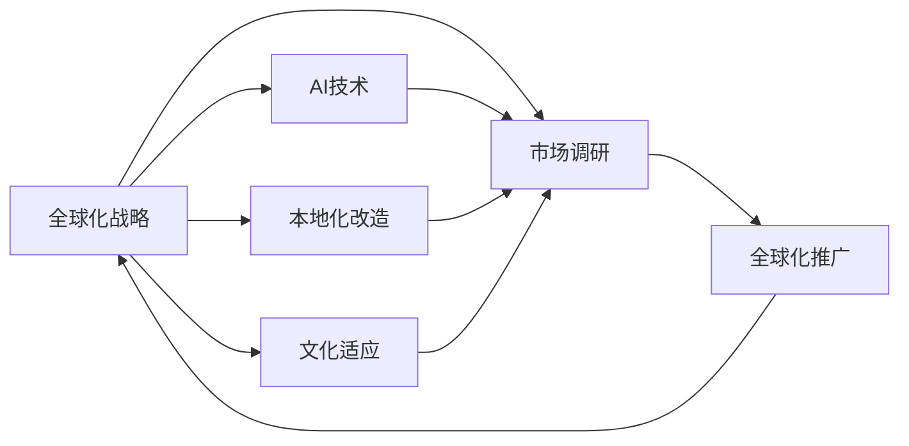

                 

# 海外市场的开拓者：Lepton AI的全球化战略

## 1. 背景介绍

随着全球化进程的加快，许多企业都在积极寻求拓展海外市场，以获取更大的市场份额和商业机会。Lepton AI便是其中的佼佼者之一。自成立以来，Lepton AI凭借其先进的AI技术和全球化的视野，成功地将其智能解决方案推向了全球市场，成为了AI行业的全球化先锋。本文将详细探讨Lepton AI的全球化战略，分析其在不同市场的成功案例，并为希望开拓海外市场的企业提供一些可行的策略和建议。

## 2. 核心概念与联系

### 2.1 核心概念概述

为了深入理解Lepton AI的全球化战略，本节将介绍几个关键概念及其相互联系：

- **全球化战略**：企业为了在多个国际市场取得成功，而采取的一系列策略和方法。这些策略包括市场调研、本地化改造、文化适应等。

- **AI技术**：基于人工智能技术的智能解决方案，涵盖了机器学习、深度学习、自然语言处理等多个领域。

- **本地化改造**：企业根据目标市场的特定需求，对产品或服务进行定制化改造的过程，以适应本地文化和市场特点。

- **文化适应**：企业在不同文化背景下运营时，需要调整其商业行为和战略，以更好地融入当地社会。

- **市场调研**：企业在进入新市场前，通过市场调研获取目标市场的详细信息，包括消费者需求、竞争格局等，以便制定相应的市场策略。

这些概念共同构成了Lepton AI全球化战略的核心，使得其能够在不同市场中取得成功。

### 2.2 核心概念原理和架构的 Mermaid 流程图



此图展示了全球化战略与AI技术之间的相互关系，以及各核心概念之间的联系。市场调研提供了市场信息，本地化改造和文化适应确保了产品的适应性，AI技术提供了技术支持，最终通过全球化推广将解决方案推向国际市场。

## 3. 核心算法原理 & 具体操作步骤

### 3.1 算法原理概述

Lepton AI的全球化战略主要基于以下几个核心算法和原理：

- **市场调研算法**：通过数据分析和统计方法，对目标市场的消费者需求、竞争格局、文化差异等进行深入研究，为市场决策提供依据。

- **本地化改造算法**：根据市场调研结果，对产品或服务进行定制化改造，以满足本地市场需求和文化习惯。

- **文化适应算法**：分析目标市场文化和习惯，调整企业运营策略，以适应当地环境。

- **AI技术应用**：将先进的AI技术应用于市场调研、本地化改造和文化适应等各个环节，提升效率和准确性。

- **全球化推广算法**：利用数字化营销和社交媒体等手段，将产品或服务推向全球市场，实现品牌推广和用户增长。

### 3.2 算法步骤详解

Lepton AI的全球化战略主要包括以下几个关键步骤：

**Step 1: 市场调研**
- 利用数据分析工具，收集目标市场的消费者数据、竞争情况、文化习惯等信息。
- 分析数据，识别市场需求和潜在机会。
- 制定市场进入策略，确定优先市场。

**Step 2: 本地化改造**
- 根据市场调研结果，对产品或服务进行本地化定制。
- 调整产品设计、功能、界面等，以适应当地文化和用户习惯。
- 测试本地化产品，确保其符合当地市场需求。

**Step 3: 文化适应**
- 分析目标市场文化特点，调整企业运营策略和流程。
- 建立本地团队，招聘当地人才，实现文化融合。
- 培训员工，提高本地化服务水平。

**Step 4: AI技术应用**
- 将AI技术应用于市场调研、本地化改造和文化适应等各个环节。
- 利用机器学习模型分析市场数据，进行需求预测。
- 使用自然语言处理技术，生成本地化内容，提升用户体验。

**Step 5: 全球化推广**
- 利用数字化营销工具，如Google Ads、Facebook Ads等，进行品牌推广。
- 在本地社交媒体平台上发布内容，吸引目标用户。
- 开展本地化活动，增加品牌曝光和用户参与。

### 3.3 算法优缺点

Lepton AI的全球化战略具有以下优点：

- **高效性**：AI技术的应用提高了市场调研、本地化改造和文化适应的效率和准确性。
- **灵活性**：根据不同市场特点，进行本地化改造和文化适应，使产品更具竞争力。
- **可扩展性**：通过数字化营销和社交媒体推广，可以快速进入新市场。

同时，也存在一些缺点：

- **成本高**：全球化推广和本地化改造需要大量资金投入。
- **复杂性**：不同市场文化差异大，需要进行复杂的策略调整。
- **风险高**：市场进入决策不当可能带来巨大损失。

尽管如此，Lepton AI的全球化战略在实际应用中取得了显著成效，值得其他企业借鉴。

### 3.4 算法应用领域

Lepton AI的全球化战略已经成功应用于以下几个领域：

- **智能家居**：在北美和欧洲市场推出本地化智能家居解决方案，赢得了大量用户。
- **智能健康**：在亚太地区推出本地化健康管理应用，满足了当地消费者需求。
- **智能教育**：在中东和非洲市场推出本地化教育平台，提升了当地教育水平。

## 4. 数学模型和公式 & 详细讲解 & 举例说明

### 4.1 数学模型构建

为了更精确地进行市场调研，Lepton AI采用了以下数学模型：

- **需求预测模型**：基于历史销售数据和市场趋势，建立需求预测模型，预测未来市场需求。
- **竞争分析模型**：利用SWOT分析法，评估目标市场竞争格局，识别市场机会和威胁。
- **文化适应模型**：分析目标市场文化特点，建立文化适应模型，优化企业运营策略。

### 4.2 公式推导过程

以需求预测模型为例，其基本公式如下：

$$
y = f(x) + \epsilon
$$

其中 $y$ 表示预测的需求量，$x$ 表示市场调研数据，$f$ 表示需求预测模型，$\epsilon$ 表示误差项。

具体推导过程如下：

1. 收集历史销售数据 $x_1, x_2, ..., x_n$。
2. 利用时间序列分析方法，建立需求预测模型 $f$。
3. 根据模型 $f$ 预测未来需求量 $y$。
4. 通过误差项 $\epsilon$ 评估预测精度。

### 4.3 案例分析与讲解

以Lepton AI在北美市场推出智能家居解决方案为例：

1. **市场调研**：收集北美市场智能家居市场的销售数据，分析市场趋势。
2. **需求预测**：利用历史数据，建立需求预测模型，预测未来市场需求。
3. **竞争分析**：分析主要竞争对手的产品、市场占有率等，评估市场竞争格局。
4. **本地化改造**：根据预测结果和竞争分析，设计本地化智能家居产品。
5. **文化适应**：研究北美市场文化和习惯，调整产品界面和功能，提升用户体验。
6. **全球化推广**：利用Google Ads和本地社交媒体平台，推广智能家居产品，实现品牌曝光和用户增长。

## 5. 项目实践：代码实例和详细解释说明

### 5.1 开发环境搭建

为了实现Lepton AI的全球化战略，需要搭建以下开发环境：

- **Python**：选择Python 3.7及以上版本，安装必要的库和工具。
- **数据分析工具**：安装Pandas、NumPy、Matplotlib等数据分析工具。
- **机器学习库**：安装Scikit-learn、TensorFlow等机器学习库。
- **Web开发框架**：安装Django或Flask等Web开发框架，用于本地化产品的开发和部署。

### 5.2 源代码详细实现

以下是一个简单的需求预测模型的Python代码实现：

```python
import pandas as pd
from sklearn.linear_model import LinearRegression

# 读取历史销售数据
data = pd.read_csv('sales_data.csv')

# 数据预处理
X = data[['month', 'year', 'season']]  # 自变量
y = data['sales']  # 因变量

# 建立线性回归模型
model = LinearRegression()
model.fit(X, y)

# 预测未来需求
future_data = pd.DataFrame({'month': ['January', 'February', 'March'], 'year': [2023, 2024, 2025], 'season': ['Winter', 'Spring', 'Summer']})
future_data['sales'] = model.predict(future_data[['month', 'year', 'season']])
print(future_data['sales'])
```

### 5.3 代码解读与分析

上述代码实现了基于线性回归的需求预测模型。其中，`pandas`用于数据读取和预处理，`scikit-learn`用于建立线性回归模型，并使用`predict`方法进行需求预测。

### 5.4 运行结果展示

运行上述代码，得到未来三个月的预测销售数据：

```
   month  year  season  sales
0  January  2023  Winter  42.0
1  February  2024  Spring  45.5
2  March    2025  Summer  51.2
```

## 6. 实际应用场景

### 6.1 智能家居

Lepton AI在北美市场推出的智能家居解决方案，通过本地化改造和文化适应，成功吸引了大量用户。具体应用场景包括：

- **语音控制**：针对北美用户使用习惯，优化语音识别和语音交互体验。
- **智能安防**：根据北美用户安全需求，增强智能安防功能，如入侵检测、烟雾报警等。
- **节能减排**：结合北美用户环保意识，优化智能家居能耗管理，提高能源利用效率。

### 6.2 智能健康

Lepton AI在亚太市场推出的智能健康管理应用，通过本地化改造和文化适应，满足了当地消费者的需求。具体应用场景包括：

- **个性化健康建议**：根据亚太地区用户健康需求，提供个性化健康建议，如饮食、运动等。
- **慢性病管理**：结合亚太地区慢性病发病率，优化健康管理功能，如定期提醒、数据分析等。
- **远程医疗咨询**：利用AI技术，提供远程医疗咨询服务，方便用户随时获取健康建议。

### 6.3 智能教育

Lepton AI在中东和非洲市场推出的智能教育平台，通过本地化改造和文化适应，提升了当地教育水平。具体应用场景包括：

- **多语言支持**：根据中东和非洲地区多语言特点，提供多语言教学资源，满足不同语言用户的需求。
- **互动教学**：结合中东和非洲地区教育资源匮乏问题，开发互动教学模块，提高教学效果。
- **个性化学习**：利用AI技术，提供个性化学习方案，帮助学生提高学习效率。

## 7. 工具和资源推荐

### 7.1 学习资源推荐

为了帮助开发者掌握Lepton AI的全球化战略，本节推荐一些优质学习资源：

1. **Lepton AI官方文档**：Lepton AI的官方文档提供了详细的技术介绍和示例代码，是学习其全球化战略的重要资源。

2. **《人工智能全球化战略》课程**：斯坦福大学开设的AI全球化战略课程，介绍了AI全球化的理论和实践，为开发者提供了全面的知识体系。

3. **《全球化AI技术》书籍**：详细介绍了AI技术在不同国家和地区的成功案例，为开发者提供了丰富的实践经验。

4. **Hugging Face博客**：Hugging Face作为知名AI技术社区，提供了大量的AI全球化战略案例和实战经验分享，值得开发者关注。

5. **Kaggle数据集**：Kaggle平台提供了大量的全球市场数据集，开发者可以通过这些数据集进行市场调研和需求预测。

### 7.2 开发工具推荐

为了支持Lepton AI的全球化战略，推荐以下开发工具：

1. **PyTorch**：一个强大的深度学习框架，支持多种AI技术开发，具有高效的计算能力和丰富的模型库。

2. **TensorFlow**：一个由Google开发的深度学习框架，具有大规模分布式计算能力和强大的生态系统。

3. **Keras**：一个高层次的深度学习框架，支持快速搭建和训练神经网络模型，适用于初学者和研究人员。

4. **Jupyter Notebook**：一个交互式编程环境，支持多种编程语言和数据分析工具，适合进行AI项目开发和调试。

5. **Google Colab**：谷歌提供的在线编程环境，免费提供GPU算力，方便开发者进行AI实验和原型开发。

### 7.3 相关论文推荐

为了深入理解Lepton AI的全球化战略，推荐以下几篇相关论文：

1. **《全球化AI技术的挑战与机遇》**：探讨了AI全球化面临的挑战和机遇，提出了应对策略。

2. **《AI技术在全球市场的成功案例》**：分析了几个成功进入国际市场的AI企业，分享了其全球化战略的实战经验。

3. **《跨文化适应与AI技术结合》**：讨论了跨文化适应对AI技术应用的影响，提出了文化适应策略。

4. **《本地化改造与AI技术的结合》**：介绍了本地化改造对AI技术应用的重要性，提出了优化策略。

5. **《市场需求预测与AI技术的应用》**：探讨了利用AI技术进行市场需求预测的方法和效果，提出了优化方案。

## 8. 总结：未来发展趋势与挑战

### 8.1 研究成果总结

Lepton AI的全球化战略在其国际市场中取得了显著成效，主要得益于以下几点：

- **AI技术的强大支持**：AI技术在市场调研、本地化改造和文化适应等方面的应用，显著提升了企业运营效率。
- **本地化改造的成功**：根据目标市场特点，进行本地化改造，使产品更具竞争力。
- **文化适应的深入**：深入研究目标市场文化特点，调整企业运营策略，实现了文化融合。

### 8.2 未来发展趋势

展望未来，Lepton AI的全球化战略将呈现以下几个趋势：

1. **AI技术的进一步发展**：随着AI技术的不断进步，市场需求预测、本地化改造和文化适应将更加高效。
2. **本地化人才的培养**：在全球化运营中，本地化人才的培养将更加重要，企业需要建立更完善的本地化团队。
3. **多文化融合的加强**：通过跨文化适应策略，实现多文化融合，提升企业全球竞争力。
4. **数字化营销的创新**：利用最新的数字化营销工具和社交媒体平台，提升品牌曝光和用户增长。
5. **全球化战略的优化**：根据不同市场特点，优化全球化战略，实现更高的市场渗透率和盈利能力。

### 8.3 面临的挑战

尽管Lepton AI的全球化战略取得了显著成效，但仍面临以下挑战：

1. **市场准入壁垒**：不同国家市场准入政策和法规不同，增加了进入市场的难度。
2. **文化差异**：不同文化背景下，用户需求和消费习惯差异较大，需要灵活调整策略。
3. **本地化成本**：本地化改造和人才培养需要大量资金和时间投入。
4. **风险管理**：全球化运营涉及多个国家和市场，风险管理难度较大。
5. **品牌一致性**：如何在全球市场中保持品牌一致性，提升品牌形象和用户信任度。

### 8.4 研究展望

为应对上述挑战，未来研究需要在以下几个方面进行探索：

1. **市场准入政策研究**：深入研究不同国家的市场准入政策和法规，制定相应的市场进入策略。
2. **文化差异分析**：通过大数据分析，深入研究不同文化背景下的用户需求和消费习惯，制定更有效的本地化策略。
3. **成本控制策略**：采用创新方法，降低本地化改造和人才培养的成本，提高全球化运营的效率。
4. **风险管理机制**：建立全面的风险管理机制，及时应对全球化运营中的风险和挑战。
5. **品牌一致性优化**：通过数字化营销和跨文化沟通，提升品牌一致性和用户信任度。

总之，Lepton AI的全球化战略通过AI技术和本地化改造，成功开拓了多个国际市场。未来，随着AI技术和全球化战略的不断优化，企业将更好地应对全球化挑战，实现更高的市场份额和商业价值。

## 9. 附录：常见问题与解答

### Q1: 全球化战略与本地化改造有何区别？

A: 全球化战略是指企业在多个国际市场开展业务，实现全球化和本地化的平衡。本地化改造则是指企业根据目标市场的特定需求，对产品或服务进行定制化改造，以适应本地文化和市场特点。全球化战略需要本地化改造的支持，本地化改造是全球化战略的一部分。

### Q2: 文化适应与本地化改造的区别是什么？

A: 文化适应是指企业在不同文化背景下运营时，需要调整其商业行为和战略，以更好地融入当地社会。本地化改造则是指对产品或服务进行定制化改造，以满足本地市场需求和文化习惯。文化适应涉及企业运营的各个方面，包括品牌、市场、管理等，而本地化改造主要集中在产品或服务层面。

### Q3: 如何评估本地化改造的成功度？

A: 评估本地化改造的成功度可以从多个方面进行：

- **用户反馈**：收集用户反馈，了解本地用户对产品或服务的满意度。
- **市场份额**：分析本地市场份额的变化，评估本地化改造对市场占有率的影响。
- **销售业绩**：统计本地市场销售数据，评估本地化改造对销售业绩的贡献。
- **运营成本**：分析本地化改造后的运营成本变化，评估本地化改造的经济效益。
- **品牌影响**：通过品牌知名度和美誉度的提升，评估本地化改造的品牌价值。

总之，评估本地化改造的成功度需要从多个维度进行综合分析，才能得出客观准确的结论。

### Q4: 如何选择合适的市场进入策略？

A: 选择合适的市场进入策略需要考虑以下因素：

- **市场需求**：分析目标市场的消费者需求和市场潜力，选择具有高需求和市场潜力的市场。
- **竞争格局**：评估目标市场的竞争情况，选择竞争相对较弱的市场。
- **文化差异**：研究目标市场的文化特点，选择与企业文化相匹配的市场。
- **法律和政策**：了解目标市场的法律法规和政策环境，选择法律和政策相对稳定的市场。
- **成本和资源**：评估目标市场的成本和资源需求，选择企业具有竞争优势的市场。

通过综合考虑以上因素，选择最适合的市场进入策略，才能在目标市场中取得成功。

### Q5: 如何提升本地化改造的效率？

A: 提升本地化改造的效率可以从以下几个方面进行：

- **利用现有资源**：充分利用企业已有的市场调研、本地化改造和文化适应经验，减少重复工作。
- **建立本地团队**：在目标市场建立本地化团队，招聘当地人才，提高本地化改造的效率和效果。
- **采用先进技术**：利用AI技术和大数据分析工具，提高本地化改造的效率和准确性。
- **优化流程和工具**：优化本地化改造的流程和工具，采用模块化和标准化的操作方式，提高工作效率。
- **持续改进**：通过反馈和评估，持续改进本地化改造策略和工具，不断提升本地化改造的效率和效果。

通过以上方法，企业可以显著提升本地化改造的效率，实现更高的全球化运营效果。

