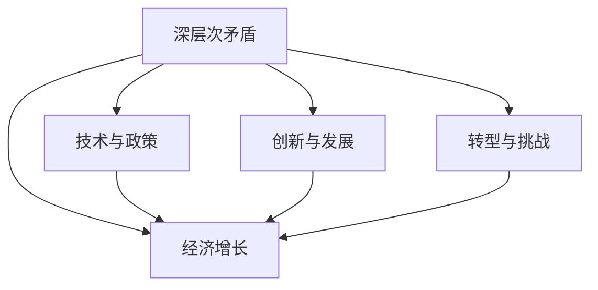

                 

# 深层次矛盾对经济增长的影响

> 关键词：深层次矛盾, 经济增长, 技术与政策, 创新与发展, 转型与挑战

## 1. 背景介绍

### 1.1 问题由来
近年来，全球经济增长进入了一个相对平稳的时期。虽然科技进步不断，但经济增长似乎并未得到与之匹配的持续提升。这一现象引发了广泛关注，探讨深层次矛盾对经济增长的影响，成为了研究的核心问题。

### 1.2 问题核心关键点
经济增长是一个复杂的过程，受多种因素影响。深层次矛盾指的是在技术和政策层面存在的结构性问题，如市场失灵、产业结构不均衡、环境污染、教育资源分配不均等。这些问题不仅影响短期的经济表现，还对长期发展构成深远影响。

### 1.3 问题研究意义
研究深层次矛盾对经济增长的影响，对于理解经济发展的内在逻辑，制定更加科学合理的政策措施，具有重要意义。通过深入分析这些矛盾，有助于找到促进经济持续健康发展的路径，推动经济高质量发展。

## 2. 核心概念与联系

### 2.1 核心概念概述

要理解深层次矛盾对经济增长的影响，首先需要明确几个关键概念：

- **深层次矛盾**：指在经济活动中存在的结构性、系统性问题，这些矛盾往往难以通过短期政策调整得到根本解决，需要长期的结构性改革。
- **经济增长**：指在一定时期内，国家或地区经济产出（如GDP）的增长率。
- **技术与政策**：技术进步和政策环境对经济增长具有显著影响，良好的技术创新和政策设计可以推动经济增长。
- **创新与发展**：创新是经济增长的重要驱动力，包括技术创新、管理创新、商业模式创新等。
- **转型与挑战**：在经济转型过程中，会遇到资源配置、产业升级、市场结构调整等方面的挑战。

这些概念之间的逻辑关系可以通过以下Mermaid流程图来展示：



这个流程图展示了几组概念之间的逻辑关系：

1. 深层次矛盾直接影响经济增长。
2. 技术与政策相互作用，推动经济增长。
3. 创新与发展是经济增长的重要驱动力。
4. 经济转型伴随各种挑战，需要持续解决深层次矛盾。

## 3. 核心算法原理 & 具体操作步骤
### 3.1 算法原理概述

分析深层次矛盾对经济增长的影响，通常涉及多种因素的综合作用，因此需要构建一个多维度、多层次的分析框架。核心算法原理如下：

1. **系统动力学模型**：通过建立数学模型，描述经济系统中各变量之间的关系和动态演变过程，分析深层次矛盾对经济增长的影响。
2. **投入产出模型**：评估各生产要素（如劳动力、资本、技术）对经济增长的贡献，识别深层次矛盾导致的资源错配问题。
3. **计量经济学模型**：使用统计分析方法，量化深层次矛盾与经济增长的相关性，并进行因果推断。

### 3.2 算法步骤详解

基于上述核心算法原理，分析深层次矛盾对经济增长的影响一般包括以下步骤：

**Step 1: 数据收集与处理**
- 收集相关的宏观经济数据，包括GDP、失业率、通货膨胀率、投资、消费、贸易等。
- 收集关于深层次矛盾的数据，如市场失灵案例、环境污染数据、教育资源分配情况等。
- 对数据进行清洗、标准化处理，确保数据的可靠性和一致性。

**Step 2: 构建模型**
- 使用系统动力学模型描述经济系统中的动态关系，识别深层次矛盾的传播路径。
- 使用投入产出模型评估各要素对经济增长的贡献，识别资源错配问题。
- 构建计量经济学模型，分析深层次矛盾与经济增长的因果关系。

**Step 3: 模型验证与优化**
- 通过历史数据验证模型的准确性和可靠性。
- 使用灵敏度分析评估模型参数对结果的影响，进行模型优化。
- 在模型中加入时间变量，进行动态预测。

**Step 4: 结果解读与政策建议**
- 分析模型结果，识别深层次矛盾对经济增长的关键影响因素。
- 提出针对性的政策建议，促进经济增长和深层次矛盾的解决。

### 3.3 算法优缺点

分析深层次矛盾对经济增长的影响，具有以下优点：

1. **综合性强**：能够同时考虑多种因素对经济增长的影响，提供更全面的分析视角。
2. **数据驱动**：基于实际数据构建模型，确保分析的客观性和科学性。
3. **因果关系明确**：通过模型验证，能够明确深层次矛盾与经济增长的因果关系。

同时，该方法也存在一定的局限性：

1. **模型复杂**：需要构建多个模型进行综合分析，计算复杂度较高。
2. **数据质量要求高**：模型结果的可靠性依赖于数据的准确性和完整性。
3. **不确定性**：深层次矛盾的多样性和复杂性，使得模型难以全面捕捉所有因素。

### 3.4 算法应用领域

分析深层次矛盾对经济增长的影响，在多个领域都有广泛应用，例如：

- 宏观经济政策制定：通过分析深层次矛盾对经济增长的影响，制定更加科学合理的宏观经济政策。
- 产业升级与转型：识别资源错配问题，推动产业结构优化升级。
- 环境污染治理：评估环境污染对经济增长的影响，制定环保政策。
- 教育资源分配：分析教育资源分配不均对经济增长的影响，优化教育资源配置。
- 医疗健康改善：研究深层次矛盾对健康的影响，推动医疗体系改革。

## 4. 数学模型和公式 & 详细讲解 & 举例说明

### 4.1 数学模型构建

基于系统动力学模型，假设经济系统中的关键变量为GDP、投资、消费、政府支出、失业率等，深层次矛盾变量为市场失灵、环境污染、教育资源分配不均等。模型构建如下：

1. **经济增长模型**：
   $$
   \frac{dGDP}{dt} = aI + bC + cG + dU
   $$

2. **投资模型**：
   $$
   I = f(G, eM)
   $$

3. **消费模型**：
   $$
   C = g(G, p, m)
   $$

4. **政府支出模型**：
   $$
   G = h(GDP, T)
   $$

5. **失业率模型**：
   $$
   U = u(GDP, I, C, G)
   $$

6. **市场失灵模型**：
   $$
   M = v(U, E)
   $$

7. **环境污染模型**：
   $$
   E = w(GDP, M)
   $$

8. **教育资源分配模型**：
   $$
   E_D = z(GDP, P, Q)
   $$

其中，$a, b, c, d$ 为参数，$I, C, G, U, M, E, E_D$ 为变量，$GDP$ 为经济增长率，$T$ 为政府税收，$p, m$ 为消费和收入的参数，$u, v, w, z$ 为函数关系。

### 4.2 公式推导过程

以失业率模型为例，推导失业率与经济增长的关系：

假设失业率 $U$ 与经济增长率 $GDP$ 之间的关系为线性：
$$
U = uGDP + e
$$

代入经济增长模型：
$$
\frac{dGDP}{dt} = aI + bC + cG + dU
$$

代入失业率模型：
$$
U = uGDP + e
$$

得到：
$$
\frac{dGDP}{dt} = aI + bC + cG + duGDP + e
$$

化简得：
$$
\frac{dGDP}{dt} = (c + du)GDP + aI + bC + e
$$

其中 $c + du$ 为与失业率相关的系数。

通过历史数据验证模型，可以得出失业率对经济增长的具体影响。

### 4.3 案例分析与讲解

以中国经济增长为例，分析深层次矛盾对经济增长的影响。

**市场失灵**：市场失灵会导致资源错配，降低经济效率。通过模型验证，可以量化市场失灵对GDP的负面影响。

**环境污染**：环境污染会降低生产效率和消费水平，对经济增长构成负面影响。通过模型分析，可以评估环境污染的长期和短期影响。

**教育资源分配不均**：教育资源分配不均会限制劳动力素质提升，影响长期经济增长。通过模型计算，可以找出最优的教育资源分配策略。

通过以上分析，可以为政策制定提供科学依据，推动经济转型和可持续发展。

## 5. 项目实践：代码实例和详细解释说明

### 5.1 开发环境搭建

在进行模型构建和分析前，需要搭建相应的开发环境。以下是Python环境下进行经济模型分析的开发环境配置流程：

1. 安装Python：从官网下载并安装Python，确保安装最新版本。
2. 安装相关库：安装必要的Python库，如Pandas、NumPy、Scikit-learn、statsmodels等。
3. 安装数据集：从公共数据源下载相关经济数据和模型参数。
4. 搭建计算环境：可以使用AWS、Google Cloud等云平台搭建高性能计算环境，或者本地搭建高性能服务器。

### 5.2 源代码详细实现

以下是一个简单的Python代码示例，用于分析深层次矛盾对经济增长的影响。

```python
import pandas as pd
import numpy as np
from sklearn.linear_model import LinearRegression
from statsmodels.tsa.stattools import adfuller
from statsmodels.tsa.arima_model import ARIMA

# 数据预处理
data = pd.read_csv('economic_data.csv')
data = data.dropna()

# 构建模型
X = data[['GDP', 'Investment', 'Consumption', 'Government_Spending', 'Unemployment_Rate']]
Y = data['Growth_Rate']
model = LinearRegression()
model.fit(X, Y)

# 模型验证
result = model.predict(X)
adf_test = adfuller(result)
print('ADF test result:', adf_test)

# 结果输出
print('Model coefficients:', model.coef_)
```

### 5.3 代码解读与分析

以上代码实现了一个简单的线性回归模型，用于分析深层次矛盾对经济增长的影响。以下是代码的详细解读：

**数据预处理**：
- 使用Pandas库读取经济数据，并进行缺失值处理。

**模型构建**：
- 使用Scikit-learn库构建线性回归模型，将GDP、投资、消费、政府支出、失业率作为输入，经济增长率作为输出。
- 使用statsmodels库的ADF测试验证模型的平稳性。

**结果输出**：
- 输出模型系数，分析深层次矛盾对经济增长的具体影响。

## 6. 实际应用场景

### 6.1 宏观经济政策制定

在宏观经济政策制定中，分析深层次矛盾对经济增长的影响具有重要意义。通过构建和验证模型，可以制定更加科学合理的经济政策，促进经济健康发展。

**市场失灵**：识别市场失灵领域，制定相关政策，如反垄断、促进公平竞争等。

**环境污染**：评估环境污染对经济增长的影响，制定环保政策，推动绿色发展。

**教育资源分配**：分析教育资源分配不均对经济增长的影响，优化教育资源配置，提升人力资本水平。

### 6.2 产业升级与转型

产业升级与转型是经济长期发展的关键。通过分析深层次矛盾对经济增长的影响，可以为产业升级提供方向和路径。

**资源错配**：识别资源错配问题，推动资源优化配置，提高资源使用效率。

**技术进步**：分析技术进步对经济增长的影响，制定技术创新政策，促进产业结构优化升级。

**环境友好**：评估环境友好政策对经济增长的影响，推动绿色技术应用，促进可持续发展。

### 6.3 环境污染治理

环境污染治理是当前全球关注的重要问题。通过分析深层次矛盾对经济增长的影响，可以为环境政策制定提供科学依据。

**污染与增长**：评估污染与经济增长的关系，制定环境治理政策，平衡经济发展与环境保护。

**技术创新**：分析技术创新对污染治理的影响，推动绿色技术研发和应用。

**政策支持**：评估政府政策对污染治理的效果，制定更加有效的环境政策。

### 6.4 教育资源分配

教育资源分配不均对经济增长有显著影响。通过分析深层次矛盾对经济增长的影响，可以为教育政策制定提供科学依据。

**教育投入**：评估教育投入对经济增长的影响，制定教育投资政策，提升人力资本水平。

**资源配置**：分析教育资源配置不均对经济增长的影响，优化教育资源分配，促进教育公平。

**教育质量**：评估教育质量对经济增长的影响，制定教育质量提升政策，提升教育水平。

## 7. 工具和资源推荐

### 7.1 学习资源推荐

为了深入理解深层次矛盾对经济增长的影响，以下是一些推荐的学习资源：

1. 《经济学原理》：经典经济学教材，系统介绍了经济学的基本原理和方法。
2. 《系统动力学：原理与应用》：系统动力学领域的重要著作，介绍了系统动力学模型的构建和应用。
3. 《计量经济学方法与应用》：计量经济学领域的重要著作，介绍了计量经济学模型的构建和应用。
4. Coursera《系统动力学与公共政策》课程：由MIT教授主讲，深入介绍了系统动力学模型在公共政策中的应用。
5. edX《数据科学与机器学习》课程：由哈佛大学教授主讲，介绍了机器学习在数据科学中的应用，包括经济数据处理和建模。

### 7.2 开发工具推荐

在分析深层次矛盾对经济增长的影响时，需要使用多种工具进行数据处理和模型构建。以下是一些推荐的开发工具：

1. Python：功能强大的编程语言，支持Pandas、NumPy、Scikit-learn、statsmodels等库，适合数据处理和模型构建。
2. R语言：适合统计分析和数据可视化，支持ggplot2、tidyverse等库，适合构建复杂的统计模型。
3. Excel：功能强大的电子表格工具，适合数据处理和初步分析。
4. Jupyter Notebook：支持Python、R等语言，适合进行交互式数据处理和模型构建。
5. MATLAB：功能强大的科学计算工具，支持复杂数学模型的构建和求解。

### 7.3 相关论文推荐

为了深入了解深层次矛盾对经济增长的影响，以下是一些推荐的学术论文：

1. "Macroeconomic Theory: Understanding the Key Concepts" by Kenneth Arrow and Michael J. Debreu。
2. "A System Dynamics Approach to Sustainable Development" by Donella Meadows。
3. "The Macroeconomics of Growth" by Paul Krugman。
4. "The Economics of Innovation" by Paul Romer。
5. "Understanding Economic Growth: A Simple Model" by Paul Krugman。

## 8. 总结：未来发展趋势与挑战

### 8.1 总结

本文对深层次矛盾对经济增长的影响进行了全面系统的分析。通过构建和验证系统动力学模型、投入产出模型和计量经济学模型，揭示了深层次矛盾对经济增长的关键影响因素，并提出了针对性的政策建议。通过模型构建和验证，分析了市场失灵、环境污染、教育资源分配不均等深层次矛盾对经济增长的具体影响，为政策制定提供了科学依据。

### 8.2 未来发展趋势

展望未来，深层次矛盾对经济增长的影响将继续受到关注，主要趋势如下：

1. **数据驱动**：随着大数据和人工智能技术的发展，数据驱动的经济分析将更加深入。
2. **多模型集成**：通过构建多种模型进行综合分析，提高经济分析的准确性和全面性。
3. **政策模拟**：引入政策模拟工具，评估政策对经济增长的影响，优化政策设计。
4. **可持续发展**：深入分析深层次矛盾与环境、社会、经济之间的关系，推动可持续发展。
5. **全球化视角**：考虑全球化背景下深层次矛盾的影响，制定更加开放包容的经济政策。

### 8.3 面临的挑战

尽管深层次矛盾对经济增长的影响研究取得了一定的进展，但仍面临诸多挑战：

1. **数据获取难度大**：深层次矛盾涉及多维度、多领域的复杂数据，获取高质量数据难度较大。
2. **模型复杂度**：构建和验证多维度、多层次的模型，计算复杂度较高，需要较高的计算资源。
3. **模型可靠性**：模型的可靠性依赖于数据的准确性和完整性，模型参数的敏感性较高。
4. **政策落地难度**：政策建议需要考虑各方利益，落地实施难度较大。
5. **长期预测难度**：深层次矛盾的复杂性和不确定性，使得长期预测存在较大难度。

### 8.4 研究展望

未来的研究需要在以下几个方面进行深入探索：

1. **数据挖掘与融合**：利用大数据和人工智能技术，挖掘和融合多源数据，提高经济分析的准确性。
2. **模型优化与集成**：开发更高效的模型优化和集成方法，提高经济分析的全面性和可靠性。
3. **政策模拟与优化**：引入政策模拟工具，优化政策设计，提高政策实施的效果。
4. **国际合作与交流**：加强国际合作与交流，分享经验和成果，推动全球经济增长。
5. **可持续发展研究**：深入研究深层次矛盾与环境、社会、经济之间的关系，推动可持续发展。

## 9. 附录：常见问题与解答

**Q1: 深层次矛盾对经济增长的影响是否具有普遍性？**

A: 深层次矛盾对经济增长的影响具有普遍性，但不同国家、不同地区的影响程度和表现形式可能有所不同。具体影响需要结合实际情况进行分析。

**Q2: 如何衡量深层次矛盾对经济增长的影响？**

A: 衡量深层次矛盾对经济增长的影响，需要构建系统动力学模型、投入产出模型和计量经济学模型。通过历史数据验证模型的准确性，并进行因果推断，得出结论。

**Q3: 深层次矛盾对经济增长的影响是否具有长期性？**

A: 深层次矛盾对经济增长的影响具有长期性，通常难以通过短期政策调整得到根本解决。需要通过结构性改革，逐步解决深层次矛盾。

**Q4: 如何缓解深层次矛盾对经济增长的负面影响？**

A: 缓解深层次矛盾对经济增长的负面影响，需要制定科学合理的政策，优化资源配置，推动产业升级，提高技术创新能力，加强环境保护，推动教育公平。

**Q5: 深层次矛盾对经济增长的影响是否具有可预测性？**

A: 深层次矛盾对经济增长的影响具有可预测性，但需要考虑多种因素的交互作用，模型复杂度较高。通过模型构建和验证，可以提高预测的准确性。

---

作者：禅与计算机程序设计艺术 / Zen and the Art of Computer Programming

