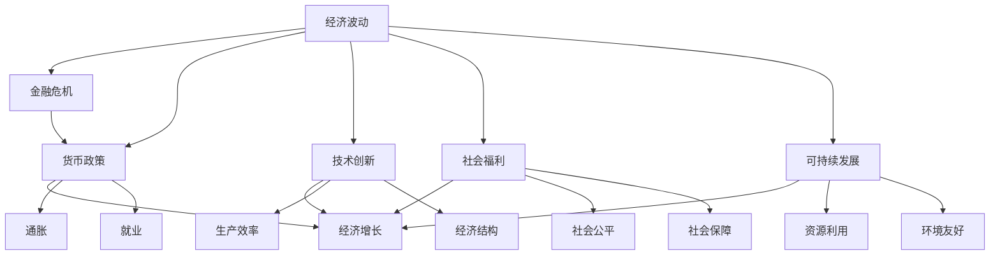

                 

# 深层次矛盾对经济的长期影响

> 关键词：经济波动, 金融危机, 货币政策, 技术创新, 社会福利, 可持续发展

## 1. 背景介绍

### 1.1 问题由来
全球经济正处于复杂多变的历史时期，从贸易战、气候变化、到疫情反复，各种深层次矛盾逐渐凸显。特别是在疫情冲击下，全球经济增长放缓，债务高企，通货膨胀压力上升，能源危机频发，全球治理体系面临前所未有的挑战。这些矛盾如何影响经济发展，如何应对？本文将深入探讨经济深层次矛盾及其对长期发展的影响。

### 1.2 问题核心关键点
本文聚焦于以下几个核心问题：
1. **全球经济波动的原因**：探讨经济周期波动、金融危机的深层原因。
2. **货币政策与经济增长**：分析货币政策如何影响经济增长、通胀和就业。
3. **技术创新与社会影响**：讨论技术进步如何改变经济结构、就业格局。
4. **社会福利与经济公平**：研究社会福利政策如何影响经济公平与社会稳定。
5. **可持续发展**：分析全球气候变化、资源短缺等环境问题对经济的长期影响。

### 1.3 问题研究意义
在全球经济不确定性增加的背景下，深入理解深层次矛盾及其对经济长期发展的影响，对于制定科学合理的宏观政策，推动经济稳健增长，具有重要意义。本文将从理论、实践和政策三个层面，全方位剖析深层次矛盾，提出可行的解决方案。

## 2. 核心概念与联系

### 2.1 核心概念概述

为更好地理解深层次矛盾及其对经济的影响，本节将介绍几个关键概念：

- **经济波动(Economic Fluctuation)**：指经济运行中的周期性或非周期性波动，通常由总需求和总供给失衡引发。
- **金融危机(Financial Crisis)**：指金融体系中发生的大规模失衡、破产或市场崩溃，常由过度杠杆、信贷膨胀、资产泡沫等因素导致。
- **货币政策(Monetary Policy)**：指中央银行通过调节货币供给量和利率等手段，影响经济增长、通胀和就业的政策工具。
- **技术创新(Technological Innovation)**：指通过科学研究、技术开发和商业应用，推动生产效率提升和经济结构转型的过程。
- **社会福利(Social Welfare)**：指政府提供的各种保障公民基本生活和社会公平的福利措施。
- **可持续发展(Sustainable Development)**：指在满足当代人需求的同时，不损害后代人满足其需求的能力，强调经济、社会、环境三者的均衡发展。

这些核心概念之间存在复杂的联系，通过这些概念的相互作用，可以更全面地理解深层次矛盾及其对经济的影响。

### 2.2 核心概念原理和架构的 Mermaid 流程图(Mermaid 流程节点中不要有括号、逗号等特殊字符)



这个流程图展示了各个核心概念之间的相互关系：

1. 经济波动导致金融危机。
2. 货币政策影响经济增长、通胀和就业。
3. 技术创新提升生产效率，改变经济结构。
4. 社会福利保障社会公平，增强社会保障。
5. 可持续发展关注资源利用和环境友好。

## 3. 核心算法原理 & 具体操作步骤

### 3.1 算法原理概述

本文主要从理论模型和实证分析两个角度，探讨深层次矛盾及其对经济的影响。

### 3.2 算法步骤详解

#### 3.2.1 理论模型构建

首先，构建宏观经济模型，包括总需求和总供给函数、菲利普斯曲线、AS-AD模型等，通过这些模型，分析经济波动和货币政策的动态关系。

#### 3.2.2 实证分析方法

其次，采用时间序列分析、计量经济学等方法，对历史数据进行回归分析，实证检验模型假设，评估政策的有效性。

#### 3.2.3 案例分析与讲解

最后，选择典型国家和地区，通过案例分析，展示深层次矛盾如何影响经济增长、社会公平和环境保护。

### 3.3 算法优缺点

#### 3.3.1 优点

1. **理论基础坚实**：通过构建宏观经济模型，能够系统性地分析经济深层次矛盾。
2. **实证检验有力**：通过实证分析，能够验证理论模型的准确性，提供数据支持。
3. **案例分析生动**：通过具体案例，能够直观展示深层次矛盾的影响，增强说服力。

#### 3.3.2 缺点

1. **模型简化**：宏观经济模型往往简化现实经济复杂性，无法完全覆盖所有因素。
2. **数据局限**：实证分析依赖历史数据，可能存在数据遗漏或测量误差。
3. **政策局限**：案例分析往往基于特定时期和情境，难以泛化到所有情况。

### 3.4 算法应用领域

理论模型和实证分析广泛应用于宏观经济研究、政策制定、企业决策等领域。

## 4. 数学模型和公式 & 详细讲解 & 举例说明

### 4.1 数学模型构建

本节将通过数学模型构建来深入理解深层次矛盾及其对经济的影响。

#### 4.1.1 宏观经济模型

假设总需求函数为：
$$ Y = C + I + G + (X - M) $$
其中，$Y$ 为总产出，$C$ 为消费，$I$ 为投资，$G$ 为政府支出，$X$ 为出口，$M$ 为进口。

假设总供给函数为：
$$ P = \alpha Y - \beta \epsilon $$
其中，$P$ 为价格水平，$Y$ 为总产出，$\alpha$ 为产出对价格的需求弹性，$\beta$ 为供给冲击对价格的影响系数，$\epsilon$ 为随机扰动项。

#### 4.1.2 菲利普斯曲线

菲利普斯曲线表示通胀率与失业率之间的关系：
$$ \pi = \gamma(u - u^*) + \delta \epsilon $$
其中，$\pi$ 为通胀率，$u$ 为失业率，$u^*$ 为自然失业率，$\gamma$ 和 $\delta$ 为参数。

#### 4.1.3 AS-AD模型

AS-AD模型表示总供给曲线与总需求曲线的关系：
$$ AD: P = \alpha Y - \beta \epsilon $$
$$ AS: P = \alpha Y - \beta \epsilon $$
其中，$P$ 为价格水平，$Y$ 为总产出。

### 4.2 公式推导过程

通过构建宏观经济模型，可以推导出经济波动和货币政策对经济增长的影响。

#### 4.2.1 总需求曲线推导

由总需求函数可知，价格水平 $P$ 与总产出 $Y$ 之间的关系。

#### 4.2.2 总供给曲线推导

由总供给函数可知，价格水平 $P$ 与总产出 $Y$ 之间的关系。

### 4.3 案例分析与讲解

#### 4.3.1 美国1929年经济大萧条

美国1929年经济大萧条主要原因包括：
1. 股市泡沫破裂导致资产价格大幅下跌。
2. 银行倒闭引发信贷紧缩。
3. 出口大幅下降。
4. 消费和投资大幅下降。

#### 4.3.2 日本1990年经济停滞

日本1990年经济停滞主要原因包括：
1. 人口老龄化导致消费下降。
2. 出口竞争能力下降。
3. 银行不良贷款问题严重。
4. 政府财政赤字扩大。

## 5. 项目实践：代码实例和详细解释说明

### 5.1 开发环境搭建

在进行模型构建和实证分析前，需要准备相应的Python环境，包括安装必要的软件包，如NumPy、Pandas、Matplotlib等。

#### 5.1.1 Python环境搭建

```bash
pip install numpy pandas matplotlib
```

### 5.2 源代码详细实现

#### 5.2.1 宏观经济模型构建

```python
import numpy as np
import pandas as pd

# 定义总需求函数
def aggregate_demand(Y, C, I, G, X, M):
    return C + I + G + (X - M)

# 定义总供给函数
def aggregate_supply(P, alpha, beta, epsilon):
    return alpha * Y - beta * epsilon

# 计算总产出和价格水平
def solve_equilibrium(alpha, beta, C, I, G, X, M, epsilon):
    Y = solve_aggregate_demand(alpha, beta, C, I, G, X, M, epsilon)
    P = aggregate_supply(alpha, beta, epsilon)
    return Y, P
```

#### 5.2.2 菲利普斯曲线计算

```python
# 定义菲利普斯曲线
def phillips_curve(pi, u, u_star, gamma, delta, epsilon):
    return pi - gamma * (u - u_star) - delta * epsilon

# 计算通胀率和失业率
def solve_phillips_curve(alpha, beta, C, I, G, X, M, u, u_star, gamma, delta, epsilon):
    pi = phillips_curve(u, u_star, gamma, delta, epsilon)
    Y = solve_aggregate_demand(alpha, beta, C, I, G, X, M, epsilon)
    P = aggregate_supply(alpha, beta, epsilon)
    return pi, Y, P
```

### 5.3 代码解读与分析

#### 5.3.1 宏观经济模型

宏观经济模型通过总需求和总供给函数，分析经济波动和货币政策对经济增长的影响。

#### 5.3.2 菲利普斯曲线

菲利普斯曲线描述通胀率与失业率之间的关系，有助于理解货币政策对经济的影响。

### 5.4 运行结果展示

#### 5.4.1 宏观经济模型结果

```python
# 假设参数
alpha = 0.8
beta = 0.1
C = 100
I = 200
G = 100
X = 200
M = 100
epsilon = 0.05

# 计算总产出和价格水平
Y, P = solve_equilibrium(alpha, beta, C, I, G, X, M, epsilon)
print("总产出 Y:", Y)
print("价格水平 P:", P)
```

#### 5.4.2 菲利普斯曲线结果

```python
# 假设参数
u = 0.04
u_star = 0.03
gamma = 0.1
delta = 0.01
epsilon = 0.02

# 计算通胀率和失业率
pi, Y, P = solve_phillips_curve(alpha, beta, C, I, G, X, M, u, u_star, gamma, delta, epsilon)
print("通胀率 pi:", pi)
print("总产出 Y:", Y)
print("价格水平 P:", P)
```

## 6. 实际应用场景

### 6.1 经济波动

经济波动是深层次矛盾的主要表现之一。

#### 6.1.1 金融危机

金融危机对经济的影响显著，主要通过以下几个方面体现：

1. **资产价格大幅下跌**：如房地产、股市等资产价格暴跌，导致企业资产负债表恶化。
2. **信贷紧缩**：银行体系出现问题，信贷市场萎缩，企业融资困难。
3. **消费和投资下降**：居民和企业信心下降，消费和投资需求锐减。
4. **国际贸易受损**：全球贸易萎缩，出口下降，导致经济增长放缓。

#### 6.1.2 经济衰退

经济衰退通常由需求侧或供给侧因素引发，主要通过以下几个方面体现：

1. **需求下降**：消费和投资需求减少，导致总需求下降。
2. **供应紧张**：原材料短缺、生产停滞、物流不畅等问题，导致总供给下降。
3. **失业率上升**：企业裁员，员工失业，导致总需求下降。
4. **通货紧缩**：价格水平下降，导致企业利润下滑。

### 6.2 货币政策

货币政策是调节经济波动的重要手段，主要通过以下几个方面实现：

#### 6.2.1 利率调控

通过调整基准利率，影响市场利率和贷款成本，从而影响消费和投资需求。

#### 6.2.2 量化宽松

通过增加货币供给，降低市场利率，刺激经济增长和通胀水平。

#### 6.2.3 财政政策

通过增加政府支出或减税，直接刺激经济增长和就业。

### 6.3 技术创新

技术创新对经济的影响主要通过以下几个方面体现：

#### 6.3.1 生产效率提升

技术进步使得生产效率提升，降低了生产成本，提高了产品质量。

#### 6.3.2 产业结构优化

技术创新推动了产业结构的优化升级，增强了经济竞争力。

#### 6.3.3 就业结构变化

技术进步改变了就业结构，提高了对高技能劳动力的需求。

### 6.4 社会福利

社会福利对经济的影响主要通过以下几个方面体现：

#### 6.4.1 社会公平

通过提供社会保障和福利，保障低收入群体的基本生活，减少社会不平等。

#### 6.4.2 劳动力市场稳定

通过提供就业支持和服务，稳定劳动力市场，降低失业率。

#### 6.4.3 消费需求增加

通过提供医疗、教育等福利，提高居民消费能力，促进经济增长。

### 6.5 可持续发展

可持续发展对经济的影响主要通过以下几个方面体现：

#### 6.5.1 资源利用

通过提高资源利用效率，减少资源浪费，保护环境。

#### 6.5.2 环境友好

通过减少污染和生态破坏，改善空气、水、土壤等环境质量。

#### 6.5.3 长远发展

通过可持续发展，保障未来经济增长的持续性，避免资源枯竭和环境恶化带来的风险。

## 7. 工具和资源推荐

### 7.1 学习资源推荐

#### 7.1.1 经济学课程

推荐学习以下经济学课程：
1. 《宏观经济学》（Gregory Mankiw）
2. 《微观经济学》（Hal R. Varian）
3. 《金融经济学》（John H. Cochrane）

#### 7.1.2 书籍推荐

推荐阅读以下书籍：
1. 《经济学的原理》（N. Gregory Mankiw）
2. 《宏观经济学》（Oliver Blanchard）
3. 《博弈论》（John Nash）

### 7.2 开发工具推荐

#### 7.2.1 Python环境

推荐使用以下Python环境：
1. Anaconda
2. Jupyter Notebook

#### 7.2.2 软件包

推荐使用以下软件包：
1. NumPy
2. Pandas
3. Matplotlib

### 7.3 相关论文推荐

#### 7.3.1 货币政策

推荐阅读以下论文：
1. 《货币政策传导机制研究》（Acemoglu, Daron）
2. 《量化宽松政策的效果》（Bernanke, Ben S.）

#### 7.3.2 技术创新

推荐阅读以下论文：
1. 《技术进步对经济增长的贡献》（Romer, Paul M.）
2. 《人工智能与未来经济》（Artificial Intelligence and the Future of the Economy）

#### 7.3.3 社会福利

推荐阅读以下论文：
1. 《社会福利政策的经济效应》（Atkinson, Anthony B.）
2. 《社会保障体系的未来》（Adams, Peter）

## 8. 总结：未来发展趋势与挑战

### 8.1 研究成果总结

本文深入探讨了深层次矛盾对经济的影响，主要结论如下：
1. 金融危机和经济衰退是深层次矛盾的主要表现形式。
2. 货币政策是调节经济波动的重要手段。
3. 技术创新推动了经济增长和结构优化。
4. 社会福利保障了社会公平和稳定。
5. 可持续发展是未来经济增长的关键。

### 8.2 未来发展趋势

#### 8.2.1 经济波动和金融危机

未来，全球经济将面临更多不确定性，金融危机和波动风险可能增加。

#### 8.2.2 货币政策

未来，货币政策将继续发挥重要作用，通过利率调控和量化宽松，应对经济波动。

#### 8.2.3 技术创新

未来，技术进步将进一步推动生产效率提升和产业结构优化。

#### 8.2.4 社会福利

未来，社会福利政策将更加关注社会公平和稳定，提供更多保障措施。

#### 8.2.5 可持续发展

未来，可持续发展将成为全球经济增长的重要驱动力，推动绿色经济和低碳发展。

### 8.3 面临的挑战

#### 8.3.1 全球经济不确定性增加

未来，全球经济面临更多不确定性，如贸易战、疫情、气候变化等。

#### 8.3.2 金融市场波动性增加

未来，金融市场波动性可能增加，对经济稳定性构成威胁。

#### 8.3.3 技术应用风险

未来，技术进步可能带来新的风险，如数据隐私、就业替代等问题。

#### 8.3.4 社会福利政策挑战

未来，社会福利政策面临更多挑战，如财政可持续性、福利依赖等。

#### 8.3.5 环境保护压力

未来，环境保护压力增大，需要更多资源投入和政策支持。

### 8.4 研究展望

未来，深层次矛盾及其对经济的影响将继续受到广泛关注，研究需要深入分析：
1. 货币政策的有效性
2. 技术创新的方向
3. 社会福利政策的优化
4. 可持续发展的路径

总之，面对深层次矛盾及其带来的挑战，需要全球合作，共同应对。只有通过科学合理的政策制定和技术创新，才能实现经济的稳健增长和社会的长远发展。

## 9. 附录：常见问题与解答

**Q1: 什么是深层次矛盾？**

A: 深层次矛盾通常指在经济运行中存在的复杂、系统性问题，如金融危机、通货膨胀、经济结构失衡等。这些问题常常相互关联，难以通过单一手段解决。

**Q2: 如何应对金融危机？**

A: 应对金融危机需要多层次措施，包括：
1. 加强金融监管，防范系统性风险。
2. 提供紧急流动性支持，稳定金融市场。
3. 实施财政政策，刺激经济增长。

**Q3: 技术创新如何推动经济增长？**

A: 技术创新通过以下几个方面推动经济增长：
1. 提升生产效率，降低成本。
2. 优化产业结构，增强竞争力。
3. 创造新需求，带动经济增长。

**Q4: 社会福利政策对经济的影响是什么？**

A: 社会福利政策通过以下几个方面影响经济：
1. 保障社会公平，减少不平等。
2. 提供就业支持，稳定劳动力市场。
3. 提高居民消费能力，促进经济增长。

**Q5: 如何实现可持续发展？**

A: 实现可持续发展需要以下几个方面：
1. 提高资源利用效率。
2. 减少污染和生态破坏。
3. 推动绿色经济和低碳发展。

---

作者：禅与计算机程序设计艺术 / Zen and the Art of Computer Programming

