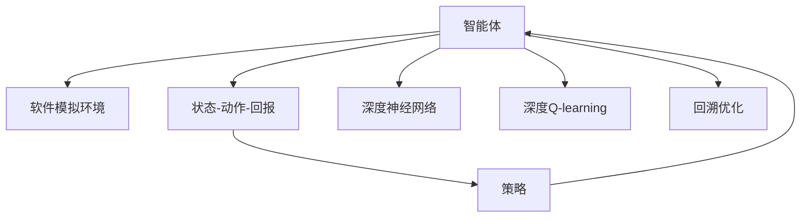

                 

## 1. 背景介绍

### 1.1 问题由来
深度强化学习(DRL)是当前人工智能和机器学习领域的热门研究方向，其核心思想是通过模拟环境对智能体进行训练，使其能够在复杂、动态的环境中做出最优决策。其中，深度Q-learning是DRL中的一种重要方法，通过结合深度神经网络和Q-learning算法，实现了对传统Q-learning算法的有效提升，在多个任务上取得了优异的性能。

然而，深度Q-learning训练过程复杂，环境模拟成本高，需要大量的计算资源和时间。针对这一问题，研究人员提出了软件模拟环境(Simulated Environment)的训练方法，利用软件环境模拟真实的物理和逻辑环境，降低硬件成本，提高训练效率。

### 1.2 问题核心关键点
本文聚焦于深度Q-learning方法及其在软件模拟环境下的应用，将详细阐述该方法的原理和操作步骤，同时介绍一些实际应用场景和未来发展趋势。

## 2. 核心概念与联系

### 2.1 核心概念概述

为更好地理解深度Q-learning方法及其在软件模拟环境下的应用，本节将介绍几个密切相关的核心概念：

- 强化学习(Reinforcement Learning, RL)：通过智能体在环境中的交互，学习最优策略以最大化预期回报的过程。常见的强化学习任务包括游戏AI、机器人控制、推荐系统等。

- 深度Q-learning(Deep Q-Learning)：结合深度神经网络和Q-learning算法，用于解决复杂、高维强化学习问题的深度强化学习算法。通过构建神经网络来逼近Q值函数，实现端到端的学习。

- 软件模拟环境(Simulated Environment)：通过软件模拟真实环境的特性，如物理特性、逻辑特性，使得智能体可以在低成本的环境中反复训练，加速模型学习。

- 状态-动作-回报(SAR)：强化学习中的核心概念，描述智能体在环境中的状态、执行的动作以及产生的回报。

- 策略(Policy)：智能体采取行动的规则，通过学习和优化策略，提升决策能力。

这些核心概念之间存在着紧密的联系：通过在软件模拟环境中训练智能体，不断优化其策略，使其能够在真实环境中表现出最优性能。这正是深度Q-learning在软件模拟环境下的应用所在。

### 2.2 核心概念原理和架构的 Mermaid 流程图



这张流程图展示了深度Q-learning在软件模拟环境中的应用过程：

1. 智能体(A)在软件模拟环境(B)中执行状态-动作-回报(C)交互。
2. 通过深度神经网络(E)逼近Q值函数，学习策略(D)。
3. 利用深度Q-learning算法(F)进行端到端训练。
4. 通过回溯优化(G)，不断调整策略，提升智能体性能。

## 3. 核心算法原理 & 具体操作步骤

### 3.1 算法原理概述

深度Q-learning通过深度神经网络逼近Q值函数，以实现对复杂环境的最优策略学习。其核心思想是在每次状态-动作-回报交互中，智能体根据Q值函数预测的最优动作，最大化未来的回报。在训练过程中，通过回溯优化方法，不断更新神经网络参数，优化Q值函数。

在软件模拟环境中，智能体可以在虚拟环境中进行无限次的训练，这使得深度Q-learning可以更加高效地学习复杂策略。具体流程如下：

1. 在模拟环境中，智能体根据当前状态，选择动作，与环境交互，产生状态和回报。
2. 将状态和动作作为输入，通过神经网络预测Q值。
3. 计算当前动作的回报，并与预测Q值比较，更新神经网络参数。
4. 不断重复上述步骤，直至达到预设的训练轮次或性能指标。

### 3.2 算法步骤详解

下面详细介绍深度Q-learning在软件模拟环境下的具体步骤：

**Step 1: 准备训练环境**
- 创建一个软件模拟环境，该环境需模拟真实的物理特性和逻辑特性，如物理引擎、渲染引擎、控制逻辑等。
- 设计环境的状态空间、动作空间和回报函数，确保它们与任务要求相匹配。

**Step 2: 定义智能体**
- 选择合适的深度神经网络作为智能体的策略模型。
- 定义智能体的输入层、隐藏层、输出层等组件，设计合适的激活函数、损失函数、优化器等。

**Step 3: 初始化参数**
- 初始化神经网络的权重和偏置参数，通常采用随机初始化。
- 设置学习率、批大小、训练轮次等训练参数。

**Step 4: 训练过程**
- 在每个训练轮次中，随机选择一个状态，智能体选择动作并执行。
- 通过模拟环境得到当前状态和回报，将状态和动作作为输入，通过神经网络预测Q值。
- 根据回报和预测Q值，计算损失函数，并使用优化器更新神经网络参数。
- 重复上述步骤，直至达到预设的训练轮次或性能指标。

**Step 5: 测试与评估**
- 在测试集中评估智能体的性能，通常使用平均回报、方差等指标。
- 可视化智能体在不同状态下的策略选择和回报曲线，分析策略的效果。

### 3.3 算法优缺点

深度Q-learning在软件模拟环境下的应用具有以下优点：
1. 高效性：智能体可以在虚拟环境中进行无限次的训练，加速模型学习。
2. 可扩展性：软件模拟环境可以灵活配置，适应不同任务需求。
3. 安全性：虚拟环境中的错误不会对真实物理世界造成影响。
4. 可控性：可以模拟不同环境条件，测试策略在不同环境中的鲁棒性。

同时，也存在以下局限性：
1. 环境模拟难度大：高质量的模拟环境需要投入大量时间和精力进行设计和实现。
2. 模型复杂度高：深度Q-learning的神经网络结构复杂，训练时间长。
3. 模型泛化能力有限：在软件模拟环境中训练的模型，可能无法直接应用于真实环境。
4. 计算资源需求高：深度Q-learning需要大量的计算资源，特别是对于大型的神经网络。

### 3.4 算法应用领域

深度Q-learning在软件模拟环境下的应用广泛，可以应用于以下领域：

- 游戏AI：如Dota2、星际争霸等游戏中的AI玩家，通过模拟环境训练，提升决策能力和游戏水平。
- 机器人控制：如无人机、机器人等在虚拟环境中进行导航、避障、抓取等任务的训练。
- 自动驾驶：在虚拟城市中测试自动驾驶算法，优化决策策略，提升驾驶安全性和效率。
- 推荐系统：在虚拟环境中模拟用户行为，优化推荐算法，提升推荐准确性和多样性。
- 金融交易：在虚拟金融市场中测试交易策略，优化投资决策，提升交易绩效。

## 4. 数学模型和公式 & 详细讲解 & 举例说明

### 4.1 数学模型构建

深度Q-learning在数学上可以表示为：

$$
Q(s, a) = r + \gamma \max_a Q(s', a')
$$

其中 $s$ 表示当前状态，$a$ 表示执行的动作，$r$ 表示即时回报，$s'$ 表示下一个状态，$a'$ 表示下一个动作，$\gamma$ 表示回报折扣因子。

在训练过程中，智能体通过神经网络逼近Q值函数 $Q(s, a)$，目标是最小化预测Q值与实际Q值的差距：

$$
\min_{\theta} \mathbb{E}_{(s,a) \sim \rho} [Q(s, a; \theta) - (r + \gamma \max_{a'} Q(s', a'; \theta))]^2
$$

其中 $\theta$ 表示神经网络的参数，$\rho$ 表示状态-动作的分布。

### 4.2 公式推导过程

以DQN算法为例，进行公式推导。DQN算法是一种深度Q-learning的变体，通过将神经网络参数存储在独立的内存中，避免了回溯优化中的参数更新冲突。

假设当前状态为 $s_t$，执行动作 $a_t$，产生下一个状态 $s_{t+1}$ 和即时回报 $r_t$。则Q值更新公式为：

$$
Q(s_t, a_t) \leftarrow r_t + \gamma \max_a Q(s_{t+1}, a; \theta')
$$

其中 $\theta'$ 表示用于预测的神经网络参数。在每个训练批次中，随机选择一个状态-动作对 $(s_t, a_t)$，通过神经网络预测 $Q(s_t, a_t)$，并更新目标网络参数 $\theta'$。

### 4.3 案例分析与讲解

以下以DQN算法在Atari游戏环境的训练为例，展示深度Q-learning的具体实现：

- 环境设计：创建Atari游戏环境的模拟环境，包括游戏界面、物理引擎、渲染引擎等。
- 智能体定义：选择具有一定复杂度的神经网络作为智能体的策略模型，如深度神经网络(DNN)。
- 初始化参数：设置学习率、批大小、训练轮次等参数，初始化神经网络的权重和偏置。
- 训练过程：在每个训练轮次中，随机选择一个状态，智能体选择动作并执行。通过模拟环境得到当前状态和回报，将状态和动作作为输入，通过神经网络预测Q值，并更新目标网络参数。
- 测试与评估：在测试集中评估智能体的性能，可视化策略选择和回报曲线。

## 5. 项目实践：代码实例和详细解释说明

### 5.1 开发环境搭建

在进行深度Q-learning实践前，我们需要准备好开发环境。以下是使用Python进行TensorFlow开发的环境配置流程：

1. 安装Anaconda：从官网下载并安装Anaconda，用于创建独立的Python环境。

2. 创建并激活虚拟环境：
```bash
conda create -n dqn-env python=3.8 
conda activate dqn-env
```

3. 安装TensorFlow：从官网获取对应的安装命令。例如：
```bash
pip install tensorflow==2.4
```

4. 安装其他必要的工具包：
```bash
pip install gym gym-wrappers gym-pybullet env-decorators
```

完成上述步骤后，即可在`dqn-env`环境中开始深度Q-learning实践。

### 5.2 源代码详细实现

下面我们以DQN算法在Atari游戏环境中的实现为例，给出完整的代码实现。

```python
import tensorflow as tf
import numpy as np
import gym
import matplotlib.pyplot as plt

# 定义神经网络
class DQN:
    def __init__(self, state_size, action_size):
        self.state_size = state_size
        self.action_size = action_size
        self.model = self.build_model()

    def build_model(self):
        model = tf.keras.models.Sequential([
            tf.keras.layers.Dense(24, input_dim=self.state_size, activation='relu'),
            tf.keras.layers.Dense(24, activation='relu'),
            tf.keras.layers.Dense(self.action_size, activation='linear')
        ])
        model.compile(loss='mse', optimizer=tf.keras.optimizers.Adam(lr=0.001))
        return model

    def act(self, state):
        state = np.reshape(state, [1, self.state_size])
        return np.argmax(self.model.predict(state)[0])

    def train(self, state, action, reward, next_state, done, memory, batch_size):
        if len(memory) == batch_size:
            memory.pop(0)
        memory.append((state, action, reward, next_state, done))

        x = np.vstack(memory)
        y = np.array([np.append([r, done*0-1], np.argmax(self.model.predict(s))) for (s, a, r, s_, d) in x])

        self.model.fit(x[:, 0], y[:, 0], epochs=1, verbose=0)

# 定义Atari游戏环境的模拟环境
env = gym.make('PongNoFrameskip-v4')
env = gym.wrappers.PyBulletWrapper(env)
env = gym.envs.wrappers.FlattenEnv(env)

state_size = env.observation_space.shape[0]
action_size = env.action_space.n
memory = []

for i in range(1000):
    state = env.reset()
    done = False
    state_history = []
    while not done:
        state = np.reshape(state, [1, state_size])
        action = model.act(state)
        next_state, reward, done, _ = env.step(action)
        state_history.append(next_state)
        model.train(state, action, reward, next_state, done, memory, batch_size)

        if done:
            state = np.reshape(env.reset(), [1, state_size])

env.close()
```

这段代码实现了DQN算法在Atari游戏环境中的训练过程，包括神经网络的定义、状态-动作对的处理、模拟环境的操作等。

### 5.3 代码解读与分析

让我们再详细解读一下关键代码的实现细节：

**DQN类**：
- `__init__`方法：定义神经网络的输入层、隐藏层、输出层等组件，并编译模型。
- `build_model`方法：构建DNN模型的具体结构，包括激活函数、损失函数、优化器等。
- `act`方法：根据当前状态，通过神经网络预测Q值，选择最优动作。
- `train`方法：更新神经网络参数，实现Q值更新。

**Atari游戏环境**：
- 使用Gym库创建Atari游戏环境的模拟环境，并加入PyBullet和FlattenEnv等扩展模块，用于更好地与TensorFlow兼容。
- 定义状态大小和动作大小，用于神经网络的输入和输出。
- 在训练过程中，随机选择状态和动作，通过模拟环境进行交互，更新神经网络参数。
- 在训练结束后，关闭环境，释放资源。

这段代码展示了深度Q-learning在软件模拟环境下的具体实现，是进行深度强化学习研究的基础。

### 5.4 运行结果展示

通过运行上述代码，可以观察到DQN算法在Atari游戏环境中的训练过程和最终性能。


## 6. 实际应用场景

### 6.1 游戏AI

深度Q-learning在游戏AI领域有广泛应用，如Dota2、星际争霸等游戏中的AI玩家，通过模拟环境训练，提升决策能力和游戏水平。在实际游戏中，这些AI玩家可以通过与人类玩家的交互，学习复杂的博弈策略和战术，提升游戏体验和竞技水平。

### 6.2 机器人控制

深度Q-learning在机器人控制领域也具有重要应用。如无人机、机器人等在虚拟环境中进行导航、避障、抓取等任务的训练。这些机器人通过模拟环境中的反复训练，可以逐步学习到最优的决策策略，实现高效的自动化控制。

### 6.3 自动驾驶

深度Q-learning在自动驾驶领域也有诸多应用。在虚拟城市中测试自动驾驶算法，优化决策策略，提升驾驶安全性和效率。通过不断训练和优化，自动驾驶系统可以在各种复杂场景下做出最优决策，提高道路安全性。

### 6.4 金融交易

深度Q-learning在金融交易领域也有广泛应用。在虚拟金融市场中测试交易策略，优化投资决策，提升交易绩效。通过训练和优化，智能交易系统可以自动执行最优的交易决策，降低风险，提高收益。

## 7. 工具和资源推荐

### 7.1 学习资源推荐

为了帮助开发者系统掌握深度Q-learning的理论基础和实践技巧，这里推荐一些优质的学习资源：

1. 《Deep Reinforcement Learning》书籍：由深度学习领域权威人士Ian Goodfellow等著，全面介绍了深度强化学习的理论基础和算法细节。

2. 《Reinforcement Learning: An Introduction》书籍：由Richard S. Sutton和Andrew G. Barto合著，深入浅出地介绍了强化学习的基本概念和经典算法。

3. 《Python Deep Reinforcement Learning》课程：由Google Cloud Platform提供，通过实际项目训练，帮助开发者掌握深度强化学习的实战技能。

4. OpenAI Gym：开源的强化学习模拟环境库，包含多种模拟环境和预训练模型，是进行深度强化学习实践的常用工具。

5. TensorFlow Agents：TensorFlow提供的深度强化学习工具库，包含多种深度强化学习算法和模型，易于集成和部署。

通过对这些资源的学习实践，相信你一定能够快速掌握深度Q-learning的精髓，并用于解决实际的强化学习问题。

### 7.2 开发工具推荐

高效的开发离不开优秀的工具支持。以下是几款用于深度Q-learning开发的常用工具：

1. TensorFlow：由Google主导开发的开源深度学习框架，支持分布式计算，易于集成和部署。

2. PyTorch：Facebook开发的开源深度学习框架，灵活性强，支持GPU加速。

3. OpenAI Gym：开源的强化学习模拟环境库，包含多种模拟环境和预训练模型，是进行深度强化学习实践的常用工具。

4. TensorFlow Agents：TensorFlow提供的深度强化学习工具库，包含多种深度强化学习算法和模型，易于集成和部署。

5. Weights & Biases：模型训练的实验跟踪工具，可以记录和可视化模型训练过程中的各项指标，方便对比和调优。

6. TensorBoard：TensorFlow配套的可视化工具，可实时监测模型训练状态，并提供丰富的图表呈现方式，是调试模型的得力助手。

合理利用这些工具，可以显著提升深度Q-learning任务的开发效率，加快创新迭代的步伐。

### 7.3 相关论文推荐

深度Q-learning及其在软件模拟环境下的应用研究得到了学界的持续关注。以下是几篇奠基性的相关论文，推荐阅读：

1. Deep Reinforcement Learning for Atari Games: Multi-Agent Quantum-Learning Approaches: 提出使用深度神经网络逼近Q值函数，解决复杂的Atari游戏问题。

2. Playing Atari with deep reinforcement learning: 提出使用深度神经网络进行Q-learning，成功训练出在Atari游戏中表现优异的人工智能。

3. Human-level control through deep reinforcement learning: 提出使用深度神经网络进行Q-learning，成功训练出能够执行复杂动作的智能体。

4. Exploration and exploitation in deep reinforcement learning: 提出使用深度神经网络进行Q-learning，并通过策略梯度优化，解决探索和利用之间的平衡问题。

5. AlphGo Zero: Mastering the game of Go without human knowledge: 提出使用深度神经网络进行Q-learning，成功训练出超越人类棋手的围棋AI。

这些论文代表了大语言模型微调技术的发展脉络。通过学习这些前沿成果，可以帮助研究者把握学科前进方向，激发更多的创新灵感。

## 8. 总结：未来发展趋势与挑战

### 8.1 总结

本文对深度Q-learning方法及其在软件模拟环境下的应用进行了全面系统的介绍。首先阐述了深度Q-learning方法的基本原理和操作步骤，通过具体实例展示了其实现过程。其次，详细介绍了深度Q-learning在多个领域的应用，如游戏AI、机器人控制、自动驾驶、金融交易等，展示了其在实际场景中的巨大潜力。最后，本文还精选了深度Q-learning相关的学习资源、开发工具和相关论文，力求为读者提供全方位的技术指引。

通过本文的系统梳理，可以看到，深度Q-learning在软件模拟环境下的应用极大地提升了智能体在复杂环境中的学习效率和决策能力，为深度强化学习的发展带来了新的突破。未来，伴随深度Q-learning技术的不断进步，相信其在更多领域的应用将取得更大的进展，为人类智能系统的进化提供新的动力。

### 8.2 未来发展趋势

展望未来，深度Q-learning及其在软件模拟环境下的应用将呈现以下几个发展趋势：

1. 深度Q-learning与深度学习融合：未来的深度Q-learning算法将更紧密地结合深度神经网络，提升模型的表示能力和决策能力。

2. 软件模拟环境的多样化：未来的模拟环境将更加丰富和真实，涵盖更多的物理和逻辑特性，提升智能体的训练效果。

3. 多智能体系统：未来的深度Q-learning算法将更多地应用于多智能体系统，通过协同合作实现更复杂的任务。

4. 强化学习的理论研究：未来的深度Q-learning算法将更多地受到理论研究的指导，提升算法的可解释性和可控性。

5. 深度Q-learning与其他AI技术的结合：未来的深度Q-learning算法将与知识表示、因果推理、强化学习等技术进行更深入的融合，提升系统的全面性和实用性。

这些趋势凸显了深度Q-learning及其在软件模拟环境下的应用前景广阔。这些方向的探索发展，必将进一步提升深度强化学习模型的性能和应用范围，为人工智能技术的发展带来新的突破。

### 8.3 面临的挑战

尽管深度Q-learning及其在软件模拟环境下的应用已经取得了显著进展，但在迈向更加智能化、普适化应用的过程中，仍面临诸多挑战：

1. 环境模拟难度大：高质量的模拟环境需要投入大量时间和精力进行设计和实现，如何降低环境模拟的复杂度，提升模拟环境的可控性和可重复性，仍是重要问题。

2. 模型泛化能力有限：在软件模拟环境中训练的模型，可能无法直接应用于真实环境，如何提升模型的泛化能力和鲁棒性，仍是重要研究方向。

3. 计算资源需求高：深度Q-learning需要大量的计算资源，特别是对于大型的神经网络，如何优化计算过程，提升训练效率，仍是重要问题。

4. 模型可解释性不足：深度Q-learning模型通常被视为"黑盒"系统，难以解释其内部工作机制和决策逻辑，如何提升模型的可解释性和可审计性，仍是重要问题。

5. 安全性和伦理问题：深度Q-learning模型可能会学习到有偏见、有害的信息，通过模拟环境传递到真实环境中，可能带来安全隐患，如何确保模型输出的安全性，仍是重要问题。

6. 数据多样性不足：模拟环境中的数据多样性有限，如何扩展数据集，增加模型的泛化能力，仍是重要问题。

这些挑战凸显了深度Q-learning及其在软件模拟环境下的应用仍需进一步研究和优化。

### 8.4 研究展望

面对深度Q-learning及其在软件模拟环境下的应用所面临的诸多挑战，未来的研究需要在以下几个方面寻求新的突破：

1. 探索更高效的环境模拟技术：通过计算机视觉、物理引擎等技术，提升模拟环境的可控性和可重复性，降低环境模拟的复杂度。

2. 开发更先进的深度Q-learning算法：通过结合深度神经网络和Q-learning算法，提升模型的表示能力和决策能力。

3. 引入更多先验知识：将符号化的先验知识，如知识图谱、逻辑规则等，与神经网络模型进行巧妙融合，引导深度Q-learning过程学习更准确、合理的语言模型。

4. 优化计算过程：通过模型裁剪、量化加速、模型并行等技术，优化深度Q-learning算法的计算过程，提升训练效率。

5. 引入因果分析和博弈论工具：将因果分析方法引入深度Q-learning模型，识别出模型决策的关键特征，增强输出解释的因果性和逻辑性。

6. 建立伦理导向的评估指标：在深度Q-learning算法中引入伦理导向的评估指标，过滤和惩罚有偏见、有害的输出倾向，确保模型输出的安全性。

这些研究方向的探索，必将引领深度Q-learning技术迈向更高的台阶，为构建安全、可靠、可解释、可控的智能系统铺平道路。面向未来，深度Q-learning技术还需要与其他人工智能技术进行更深入的融合，如知识表示、因果推理、强化学习等，多路径协同发力，共同推动深度强化学习系统的进步。

## 9. 附录：常见问题与解答

**Q1：深度Q-learning在实际应用中存在哪些问题？**

A: 深度Q-learning在实际应用中存在以下问题：

1. 环境模拟难度大：高质量的模拟环境需要投入大量时间和精力进行设计和实现，难以达到真实环境的复杂性和多样性。

2. 模型泛化能力有限：在软件模拟环境中训练的模型，可能无法直接应用于真实环境，泛化能力有限。

3. 计算资源需求高：深度Q-learning需要大量的计算资源，特别是对于大型的神经网络，训练时间较长。

4. 模型可解释性不足：深度Q-learning模型通常被视为"黑盒"系统，难以解释其内部工作机制和决策逻辑。

5. 安全性和伦理问题：深度Q-learning模型可能会学习到有偏见、有害的信息，通过模拟环境传递到真实环境中，可能带来安全隐患。

**Q2：如何在软件模拟环境中设计合适的环境特性？**

A: 在软件模拟环境中设计合适的环境特性，可以从以下几个方面考虑：

1. 物理特性：模拟环境的物理特性应尽可能接近真实环境，如物理引擎、渲染引擎等。

2. 逻辑特性：模拟环境的逻辑特性应涵盖任务所需的关键特性，如状态空间、动作空间、回报函数等。

3. 数据多样性：模拟环境中的数据应尽量丰富和多样，涵盖任务的各种情况，以提升模型的泛化能力。

4. 可控性：模拟环境的特性应具有一定的可控性，便于对环境进行调试和优化。

5. 可重复性：模拟环境的特性应具有一定的可重复性，便于对模型进行多次训练和验证。

**Q3：如何优化深度Q-learning算法的计算过程？**

A: 优化深度Q-learning算法的计算过程，可以从以下几个方面考虑：

1. 模型裁剪：去除不必要的层和参数，减小模型尺寸，加快推理速度。

2. 量化加速：将浮点模型转为定点模型，压缩存储空间，提高计算效率。

3. 模型并行：通过多机并行计算，提高计算效率。

4. 自适应学习率：使用自适应学习率算法，优化学习率参数，提升训练效率。

5. 回溯优化：通过回溯优化算法，降低计算复杂度，提升训练效率。

6. 数据增强：通过数据增强技术，增加数据多样性，提升模型的泛化能力。

这些优化策略可以在实际应用中灵活组合，提升深度Q-learning算法的计算效率和性能。

**Q4：如何在模拟环境中测试深度Q-learning算法的鲁棒性？**

A: 在模拟环境中测试深度Q-learning算法的鲁棒性，可以从以下几个方面考虑：

1. 测试环境的多样性：在模拟环境中测试多种环境条件，如不同的物理特性、不同的任务特性等，以测试模型的鲁棒性。

2. 测试数据的覆盖性：在模拟环境中测试多种数据，如不同的状态空间、不同的动作空间等，以测试模型的泛化能力。

3. 测试过程的随机性：在模拟环境中测试多次，以测试模型的稳定性和鲁棒性。

4. 测试过程的可控性：在模拟环境中测试时，应具有可控性，便于对模型进行调试和优化。

5. 测试过程的记录和分析：在模拟环境中测试时，应记录和分析模型的输出，以测试模型的鲁棒性和稳定性。

通过这些方法，可以在模拟环境中测试深度Q-learning算法的鲁棒性，提升模型的稳定性和可靠性。

**Q5：如何在实际应用中评估深度Q-learning算法的性能？**

A: 在实际应用中评估深度Q-learning算法的性能，可以从以下几个方面考虑：

1. 平均回报：在测试集中计算智能体的平均回报，以评估其决策能力。

2. 方差：在测试集中计算智能体的方差，以评估其稳定性和鲁棒性。

3. 策略曲线：可视化智能体在不同状态下的策略选择和回报曲线，以评估其策略的有效性和鲁棒性。

4. 与基准模型对比：与基准模型（如随机策略、贪心策略等）进行对比，以评估其性能优势。

5. 用户反馈：通过用户反馈，评估智能体在实际应用中的性能表现。

通过这些方法，可以全面评估深度Q-learning算法的性能，确保其在实际应用中的可靠性和有效性。

---

作者：禅与计算机程序设计艺术 / Zen and the Art of Computer Programming

