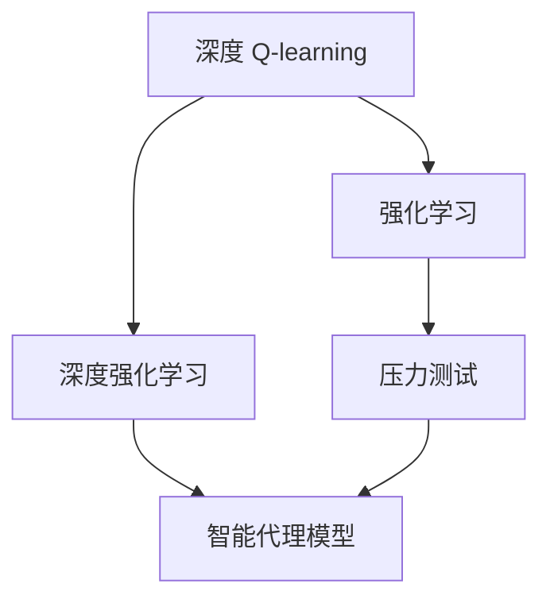

                 

## 1. 背景介绍

压力测试是金融风险管理的重要工具，用于评估金融系统的稳健性，评估其应对极端市场条件的能力。传统的压力测试方法依赖于历史数据和复杂的风险模型，难以应对快速变化的金融市场。

近年来，随着深度学习和强化学习技术的快速发展，一种基于深度 Q-learning 的压力测试方法应运而生。这种方法通过构建智能代理模型，利用历史交易数据进行训练，学习市场环境变化下资产组合的风险收益特性，从而预测未来市场的极端波动。

本文将深入探讨基于深度 Q-learning 的压力测试方法，从原理到实践，全面讲解其在金融风险管理中的应用，并对比传统压力测试方法的优缺点。

## 2. 核心概念与联系

### 2.1 核心概念概述

为更好地理解基于深度 Q-learning 的压力测试方法，本节将介绍几个密切相关的核心概念：

- 深度 Q-learning：一种基于强化学习(Reinforcement Learning, RL)的深度学习方法，用于估计策略评估函数 Q，进而指导智能体(智能代理模型)选择最优行动策略。
- 强化学习：一种学习范式，智能体通过与环境互动，在不断的试错过程中，学习如何做出最优的决策。
- 深度强化学习：结合深度神经网络模型与强化学习，可处理更复杂的数据和任务，具有更强的泛化能力。
- 压力测试：一种金融风险管理方法，模拟极端市场条件，评估金融系统应对风险的能力。
- 智能代理模型：通过深度学习训练得到的智能体，能够模拟人类或机器的决策行为。

这些核心概念之间的逻辑关系可以通过以下Mermaid流程图来展示：



这个流程图展示了大语言模型的核心概念及其之间的关系：

1. 深度 Q-learning 结合深度强化学习，用于训练智能代理模型。
2. 智能代理模型能够应对市场压力，进行风险评估。
3. 压力测试方法通过智能代理模型，模拟极端市场条件。

这些概念共同构成了基于深度 Q-learning 的压力测试方法的理论基础，使其能够在金融风险管理中发挥重要作用。

## 3. 核心算法原理 & 具体操作步骤
### 3.1 算法原理概述

基于深度 Q-learning 的压力测试方法，本质上是一种基于强化学习的智能决策系统。其核心思想是：构建智能代理模型，通过历史交易数据进行训练，学习市场环境变化下资产组合的风险收益特性，进而预测未来市场的极端波动。

具体来说，假设市场环境可以用一个马尔科夫决策过程(Markov Decision Process, MDP)来建模。令 $s_t$ 表示市场状态，$a_t$ 表示智能体采取的行动，$r_t$ 表示智能体获得的奖励，$p_{s_{t+1}|s_t,a_t}$ 表示市场状态转移概率。目标是在不同的市场状态下，智能体能够做出最优的行动决策，最大化累计奖励 $R$。

假设智能体的策略为 $\pi(a_t|s_t)$，即在给定市场状态 $s_t$ 下，智能体采取行动 $a_t$ 的概率分布。深度 Q-learning 的目标是估计策略评估函数 $Q(s_t,a_t)$，即在给定市场状态 $s_t$ 和行动 $a_t$ 下，智能体未来获得的累计奖励的期望值。通过优化 $Q$ 函数，智能体可以学习到最优的行动策略。

### 3.2 算法步骤详解

基于深度 Q-learning 的压力测试方法一般包括以下几个关键步骤：

**Step 1: 构建市场环境**  
- 收集历史交易数据，构建市场环境模型。可以采用历史市场价格、交易量、宏观经济指标等数据。
- 将市场环境量化为状态空间，如股票组合价值、波动率、宏观经济指标等。

**Step 2: 设计智能代理模型**  
- 设计智能体的行动空间，如资产买卖、加杠杆等。
- 选择适当的深度神经网络模型作为智能体，如全连接神经网络、卷积神经网络(CNN)、递归神经网络(RNN)等。

**Step 3: 设计奖励函数**  
- 根据市场环境的评估标准，设计智能体的奖励函数。如优化资产组合的总收益、最大程度分散风险等。
- 将智能体的行动和市场状态转移结合，计算奖励函数。

**Step 4: 训练智能代理模型**  
- 使用历史交易数据进行深度 Q-learning 训练，优化智能体的策略评估函数 $Q$。
- 使用 DQN、DDPG 等深度强化学习算法，避免智能体陷入局部最优。

**Step 5: 进行压力测试**  
- 使用训练好的智能代理模型，模拟极端市场条件，如市场崩溃、流动性枯竭等。
- 评估智能体在不同市场状态下的行为决策，预测资产组合的风险收益特性。

**Step 6: 分析结果**  
- 分析智能体在压力测试中的行为，评估模型的风险预测能力。
- 根据结果调整智能体的行动策略，优化压力测试方法。

以上是基于深度 Q-learning 的压力测试方法的一般流程。在实际应用中，还需要针对具体市场环境和任务特点，对各个环节进行优化设计，如改进状态表示、引入正则化技术、调整奖励函数等，以进一步提升模型性能。

### 3.3 算法优缺点

基于深度 Q-learning 的压力测试方法具有以下优点：
1. 数据驱动：通过历史交易数据训练模型，减少人工干预，提高模型泛化能力。
2. 动态适应：智能代理模型可以动态适应市场环境变化，预测极端市场条件下的风险收益特性。
3. 高效预测：深度强化学习算法可以处理大规模复杂数据，快速进行风险评估。
4. 自学习：智能代理模型能够不断学习和优化策略，提升预测准确性。

同时，该方法也存在一定的局限性：
1. 数据需求高：需要大量高质量的历史交易数据进行训练，对于新市场环境适应性较差。
2. 计算成本高：深度强化学习模型的训练和优化需要大量计算资源，存在一定的时间成本。
3. 黑箱模型：深度强化学习模型往往难以解释其决策逻辑，缺乏透明度。
4. 对抗攻击：智能代理模型可能受到市场操纵或策略攻击，影响预测结果。

尽管存在这些局限性，但就目前而言，基于深度 Q-learning 的压力测试方法仍是一种有效且具有发展潜力的金融风险管理手段。未来相关研究的重点在于如何进一步降低计算成本，提高模型可解释性，增强模型的鲁棒性等，以进一步提升其在金融领域的应用价值。

### 3.4 算法应用领域

基于深度 Q-learning 的压力测试方法，已经在金融领域得到了广泛的应用，具体包括：

- 资产组合优化：通过智能代理模型学习最优资产组合策略，应对不同市场环境。
- 风险管理：预测市场极端波动，评估金融系统的稳健性。
- 流动性风险：模拟市场流动性枯竭等极端情况，评估其对金融系统的影响。
- 市场操纵检测：检测市场操纵行为，识别潜在的金融风险。

除了上述这些经典应用外，深度 Q-learning 还用于衍生品定价、信用风险评估、行为金融等领域，为金融风险管理提供了新的解决方案。

## 4. 数学模型和公式 & 详细讲解  
### 4.1 数学模型构建

本节将使用数学语言对基于深度 Q-learning 的压力测试方法进行更加严格的刻画。

记市场状态为 $s_t = (x_t, y_t)$，其中 $x_t$ 表示资产组合价值，$y_t$ 表示宏观经济指标等。智能体的行动空间为 $a_t = \{a_1, a_2, \ldots, a_n\}$，其中 $a_i$ 表示具体的行动策略。市场状态转移概率为 $p_{s_{t+1}|s_t,a_t}$，智能体在给定市场状态 $s_t$ 和行动 $a_t$ 下，市场状态转移至 $s_{t+1}$ 的概率分布。智能体获得的奖励函数为 $r(s_t, a_t, s_{t+1})$，表示在市场状态 $s_t$ 和行动 $a_t$ 下，智能体获得的奖励。

假设智能体的策略为 $\pi(a_t|s_t)$，其策略评估函数为 $Q(s_t, a_t) = \mathbb{E}[R_t|\mathcal{S}_t = s_t, \mathcal{A}_t = a_t]$，即在给定市场状态 $s_t$ 和行动 $a_t$ 下，智能体未来获得的累计奖励的期望值。深度 Q-learning 的目标是最小化策略评估函数 $Q$ 的偏差，即 $Q(s_t, a_t) = \mathbb{E}[r(s_t, a_t, s_{t+1}) + \gamma Q(s_{t+1}, \pi(a_{t+1}|s_{t+1})) | \mathcal{S}_t = s_t, \mathcal{A}_t = a_t]$，其中 $\gamma$ 为折扣因子，用于平衡短期和长期收益。

### 4.2 公式推导过程

以下我们以资产组合优化为例，推导基于深度 Q-learning 的压力测试方法的数学模型。

假设智能体在每个时间步 $t$ 采取行动 $a_t$，市场状态从 $s_t$ 转移至 $s_{t+1}$，智能体获得的奖励为 $r_t$。目标是在市场状态 $s_t$ 下，选择最优的行动 $a_t$，最大化累计收益 $R$。

假设智能体的策略为 $\pi(a_t|s_t)$，其策略评估函数为 $Q(s_t, a_t)$。目标是最小化 $Q$ 函数的偏差，即：

$$
Q(s_t, a_t) = r_t + \gamma \max_{a_{t+1}} Q(s_{t+1}, a_{t+1})
$$

其中 $r_t$ 为智能体在时间步 $t$ 的收益，$\gamma$ 为折扣因子。

利用最小二乘法或梯度下降法，可以求解 $Q$ 函数，即：

$$
\min_{Q} \mathbb{E}[\left[Q(s_t, a_t) - (r_t + \gamma \max_{a_{t+1}} Q(s_{t+1}, a_{t+1}))\right]^2]
$$

通过求解上述优化问题，可以训练得到智能体的策略评估函数 $Q$，进而指导智能体在市场环境变化下做出最优的行动决策。

### 4.3 案例分析与讲解

假设市场状态 $s_t = (x_t, y_t)$，其中 $x_t$ 表示资产组合价值，$y_t$ 表示宏观经济指标。智能体的行动空间为 $a_t = \{a_1, a_2, \ldots, a_n\}$，其中 $a_i$ 表示具体的行动策略，如买入、卖出、保持不变等。

市场状态转移概率为 $p_{s_{t+1}|s_t,a_t}$，即在给定市场状态 $s_t$ 和行动 $a_t$ 下，市场状态转移至 $s_{t+1}$ 的概率分布。智能体在每个时间步 $t$ 采取行动 $a_t$，市场状态从 $s_t$ 转移至 $s_{t+1}$，智能体获得的奖励为 $r_t$。目标是在市场状态 $s_t$ 下，选择最优的行动 $a_t$，最大化累计收益 $R$。

假设智能体的策略为 $\pi(a_t|s_t)$，其策略评估函数为 $Q(s_t, a_t)$。目标是最小化 $Q$ 函数的偏差，即：

$$
Q(s_t, a_t) = r_t + \gamma \max_{a_{t+1}} Q(s_{t+1}, a_{t+1})
$$

其中 $r_t$ 为智能体在时间步 $t$ 的收益，$\gamma$ 为折扣因子。

通过求解上述优化问题，可以训练得到智能体的策略评估函数 $Q$，进而指导智能体在市场环境变化下做出最优的行动决策。

在实际应用中，智能体的行动策略可以通过深度神经网络模型来实现。例如，使用全连接神经网络模型作为智能体，设计多个隐藏层，每个隐藏层包含多个神经元，输出层输出智能体的行动概率分布。通过训练深度神经网络模型，可以得到智能体的最优行动策略。

## 5. 项目实践：代码实例和详细解释说明
### 5.1 开发环境搭建

在进行深度 Q-learning 实践前，我们需要准备好开发环境。以下是使用Python进行TensorFlow开发的环境配置流程：

1. 安装Anaconda：从官网下载并安装Anaconda，用于创建独立的Python环境。

2. 创建并激活虚拟环境：
```bash
conda create -n tf-env python=3.8 
conda activate tf-env
```

3. 安装TensorFlow：从官网获取对应的安装命令，安装TensorFlow 2.x版本。
```bash
pip install tensorflow==2.8
```

4. 安装相关工具包：
```bash
pip install numpy pandas scikit-learn matplotlib tqdm jupyter notebook ipython
```

完成上述步骤后，即可在`tf-env`环境中开始深度 Q-learning 实践。

### 5.2 源代码详细实现

下面我们以资产组合优化为例，给出使用TensorFlow进行深度 Q-learning 的PyTorch代码实现。

首先，定义智能体的状态和行动空间：

```python
import tensorflow as tf
import numpy as np

# 定义智能体的状态和行动空间
state_dim = 2  # 市场状态维度
action_dim = 3  # 行动空间维度

# 定义智能体的策略模型
def build_policy_model():
    model = tf.keras.Sequential([
        tf.keras.layers.Dense(32, activation='relu', input_dim=state_dim),
        tf.keras.layers.Dense(32, activation='relu'),
        tf.keras.layers.Dense(action_dim, activation='softmax')
    ])
    return model

# 定义智能体的奖励函数
def build_reward_function():
    def reward_function(state, action, next_state):
        # 假设智能体采取的行动是买入、卖出、保持不变
        # 市场状态从s_t转移至s_{t+1}
        # 计算智能体获得的奖励
        # 假设买入收益为1，卖出收益为-1，保持不变收益为0
        if action == 0:
            return 1
        elif action == 1:
            return -1
        else:
            return 0
    return reward_function

# 定义智能体的折扣因子
gamma = 0.99
```

然后，定义智能体的训练函数：

```python
# 定义智能体的训练函数
def train_policy(model, state, action, next_state, reward):
    with tf.GradientTape() as tape:
        # 计算策略评估函数Q的偏差
        Q = model(state)
        Q_next = model(next_state)
        td_error = reward + gamma * tf.reduce_max(Q_next) - Q
        # 计算梯度
        grads = tape.gradient(Q, model.trainable_variables)
        # 更新模型参数
        model.trainable_variables[0].assign_sub(grads[0], learning_rate=0.001)
```

接着，定义智能体的训练过程：

```python
# 定义智能体的训练过程
def train(env, model, num_episodes=1000):
    state = env.reset()
    for episode in range(num_episodes):
        action = model.predict(state)
        next_state, reward, done, _ = env.step(action)
        train_policy(model, state, action, next_state, reward)
        state = next_state
        if done:
            state = env.reset()
```

最后，启动训练流程：

```python
# 定义市场环境
class MarketEnv:
    def __init__(self):
        self.state = np.random.rand(2)
        self.action_space = [0, 1, 2]
        self.action = 0
        self.done = False

    def reset(self):
        self.state = np.random.rand(2)
        self.done = False
        return self.state

    def step(self, action):
        if action == 0:
            self.state += 0.1
        elif action == 1:
            self.state -= 0.1
        else:
            self.state = np.random.rand(2)
        reward = self.reward_function(self.state, self.action, self.state)
        self.done = (self.state[0] > 1 or self.state[0] < -1 or self.state[1] > 1 or self.state[1] < -1)
        return self.state, reward, self.done, {}

env = MarketEnv()
model = build_policy_model()
train(env, model)
```

以上就是使用TensorFlow进行资产组合优化的深度 Q-learning 实践代码。可以看到，使用TensorFlow进行深度 Q-learning 的代码实现相对简单。

### 5.3 代码解读与分析

让我们再详细解读一下关键代码的实现细节：

**state_dim和action_dim**：
- 定义智能体的状态和行动空间维度。

**build_policy_model和build_reward_function函数**：
- `build_policy_model`函数：使用Keras构建深度神经网络模型，定义输入层、隐藏层和输出层。
- `build_reward_function`函数：定义智能体的奖励函数。

**train_policy函数**：
- 定义智能体的训练函数，计算策略评估函数Q的偏差，并更新模型参数。

**train函数**：
- 定义智能体的训练过程，对智能体进行模拟市场环境，进行策略评估和参数更新。

**MarketEnv类**：
- 定义市场环境，包含状态、行动空间、奖励函数等关键组件。

在实际应用中，智能体的行动策略可以通过深度神经网络模型来实现。例如，使用全连接神经网络模型作为智能体，设计多个隐藏层，每个隐藏层包含多个神经元，输出层输出智能体的行动概率分布。通过训练深度神经网络模型，可以得到智能体的最优行动策略。

## 6. 实际应用场景
### 6.1 金融市场预测

深度 Q-learning 在金融市场预测中的应用非常广泛。通过构建智能代理模型，利用历史交易数据进行训练，可以预测市场极端波动，评估金融系统的稳健性，规避潜在的金融风险。

具体来说，可以在历史交易数据上训练智能代理模型，预测不同市场环境下资产组合的风险收益特性，模拟市场崩溃、流动性枯竭等极端情况，评估其对金融系统的影响。通过深度 Q-learning，可以构建更加动态、自适应的市场预测模型，提升金融风险管理的精准度。

### 6.2 资产组合优化

在资产组合管理中，深度 Q-learning 可以帮助投资者构建最优资产组合策略，应对不同市场环境下的风险收益变化。

具体来说，可以在历史交易数据上训练智能代理模型，学习最优资产组合策略。智能代理模型能够在市场环境变化下，动态调整资产组合权重，优化风险收益特性，提升投资收益。

### 6.3 期权定价

深度 Q-learning 在期权定价中的应用，可以构建更加高效、自适应的期权定价模型，提升期权定价的准确性和实时性。

具体来说，可以通过智能代理模型，预测期权价格的变化趋势，动态调整期权定价模型，优化期权定价结果。通过深度 Q-learning，可以构建更加自适应、高效的期权定价模型，提升期权定价的精准度和实时性。

### 6.4 未来应用展望

随着深度 Q-learning 技术的不断成熟，其在金融领域的应用前景将更加广阔。未来，深度 Q-learning 将与其他金融技术深度融合，如人工智能、大数据、区块链等，推动金融科技的创新发展。

在智能投顾、量化交易、信用风险评估、衍生品定价等领域，深度 Q-learning 都将发挥重要作用。通过深度 Q-learning，可以构建更加动态、自适应的金融模型，提升金融管理的精准度和效率，为金融科技的发展注入新的动力。

## 7. 工具和资源推荐
### 7.1 学习资源推荐

为了帮助开发者系统掌握深度 Q-learning 的压力测试方法，这里推荐一些优质的学习资源：

1. 《深度强化学习》系列博文：由深度学习专家撰写，深入浅出地介绍了深度 Q-learning 原理、算法和应用场景。

2. 《强化学习与深度学习》课程：由斯坦福大学开设的机器学习课程，有Lecture视频和配套作业，涵盖深度 Q-learning 的核心概念和实现细节。

3. 《Reinforcement Learning: An Introduction》书籍：由Sutton和Barto撰写，系统介绍了强化学习的基本概念和深度 Q-learning 的应用。

4. Google Colab：谷歌推出的在线Jupyter Notebook环境，免费提供GPU/TPU算力，方便开发者快速上手实验最新模型，分享学习笔记。

5. TensorFlow官方文档：TensorFlow 2.x版本的官方文档，提供了丰富的深度 Q-learning 实现案例和代码示例，是学习TensorFlow深度 Q-learning 的好资源。

通过对这些资源的学习实践，相信你一定能够快速掌握深度 Q-learning 的压力测试方法，并用于解决实际的金融风险管理问题。

### 7.2 开发工具推荐

高效的开发离不开优秀的工具支持。以下是几款用于深度 Q-learning 开发的常用工具：

1. TensorFlow：由Google主导开发的开源深度学习框架，生产部署方便，适合大规模工程应用。

2. PyTorch：由Facebook主导开发的深度学习框架，灵活动态的计算图，适合快速迭代研究。

3. Keras：基于TensorFlow和Theano的深度学习框架，简单易用，适合快速搭建深度 Q-learning 模型。

4. OpenAI Gym：Python编程库，提供各种模拟环境，方便进行深度 Q-learning 训练和测试。

5. Jupyter Notebook：Python编程工具，支持实时调试和交互式学习，适合开发者进行深度 Q-learning 实验和研究。

合理利用这些工具，可以显著提升深度 Q-learning 的压力测试方法开发效率，加快创新迭代的步伐。

### 7.3 相关论文推荐

深度 Q-learning 技术的发展源于学界的持续研究。以下是几篇奠基性的相关论文，推荐阅读：

1. Deep Q-Networks for Humanoid Base Control（DQN论文）：提出了DQN算法，结合深度神经网络与强化学习，为深度 Q-learning 奠定了基础。

2. Playing Atari with Deep Reinforcement Learning：展示了使用DQN算法进行游戏AI训练，证明了深度 Q-learning 在复杂环境下的适应性。

3. Deep Q-Learning in Reinforcement Learning（Q-learning论文）：详细介绍了深度 Q-learning 的基本原理和算法步骤，是深度 Q-learning 的核心文献。

4. Deep Reinforcement Learning for Decision Making in Information Systems：探讨了深度 Q-learning 在信息系统中进行决策的潜在应用。

5. Continuous Control with Deep Reinforcement Learning：展示了使用深度 Q-learning 进行连续控制系统的训练，进一步证明了深度 Q-learning 的强大能力。

这些论文代表了大语言模型微调技术的发展脉络。通过学习这些前沿成果，可以帮助研究者把握学科前进方向，激发更多的创新灵感。

## 8. 总结：未来发展趋势与挑战

### 8.1 总结

本文对基于深度 Q-learning 的压力测试方法进行了全面系统的介绍。首先阐述了深度 Q-learning 的基本原理和核心思想，明确了其在金融风险管理中的应用前景。其次，从原理到实践，详细讲解了深度 Q-learning 的数学模型和关键步骤，给出了深度 Q-learning 的代码实例和详细解释。最后，探讨了深度 Q-learning 在未来金融领域的发展趋势和面临的挑战。

通过本文的系统梳理，可以看到，基于深度 Q-learning 的压力测试方法在金融风险管理中具有重要的应用价值。通过构建智能代理模型，利用历史交易数据进行训练，可以预测市场极端波动，评估金融系统的稳健性，规避潜在的金融风险。未来，随着深度 Q-learning 技术的不断成熟，其在金融领域的应用将更加广泛，推动金融科技的创新发展。

### 8.2 未来发展趋势

展望未来，深度 Q-learning 在金融领域的应用前景将更加广阔。以下是几个可能的趋势：

1. 数据驱动：深度 Q-learning 模型将进一步依赖大数据、人工智能等技术，构建更加高效、自适应的金融模型。

2. 多模态融合：将金融领域的多模态数据（如股票价格、宏观经济指标、新闻舆情等）与深度 Q-learning 模型结合，提升风险预测的精准度。

3. 模型融合：将深度 Q-learning 模型与其他金融技术（如人工智能、大数据、区块链等）结合，构建更加复杂、综合的金融模型。

4. 实时预测：深度 Q-learning 模型将进一步优化计算效率，实现实时预测和动态调整，提升金融管理的效率和精度。

5. 自适应控制：通过深度 Q-learning 模型，实现智能投顾、量化交易、信用风险评估等自适应控制，提升金融管理的智能化水平。

6. 自动化运维：通过深度 Q-learning 模型，实现金融系统的自动化运维，提升金融系统的稳定性和可靠性。

以上趋势凸显了深度 Q-learning 在金融领域的应用前景。这些方向的探索发展，必将进一步提升深度 Q-learning 的压力测试方法在金融领域的应用价值，为金融科技的发展注入新的动力。

### 8.3 面临的挑战

尽管深度 Q-learning 在金融领域的应用前景广阔，但在迈向更加智能化、普适化应用的过程中，仍面临以下挑战：

1. 数据质量问题：深度 Q-learning 模型对数据质量要求较高，需要高质量的标注数据和连续的实时数据。如何获取和处理高质量的数据，是深度 Q-learning 应用的重要挑战。

2. 模型复杂性问题：深度 Q-learning 模型结构复杂，训练和优化过程中容易出现过拟合和收敛问题。如何设计合适的模型结构和优化算法，是深度 Q-learning 应用的另一个重要挑战。

3. 模型鲁棒性问题：深度 Q-learning 模型可能受到市场操纵或策略攻击，影响预测结果。如何增强模型的鲁棒性，是深度 Q-learning 应用的重要课题。

4. 模型可解释性问题：深度 Q-learning 模型往往难以解释其决策逻辑，缺乏透明度。如何赋予模型更强的可解释性，是深度 Q-learning 应用的重要挑战。

5. 模型安全性问题：深度 Q-learning 模型可能受到网络攻击，影响金融系统的稳定和安全。如何保障模型的安全性，是深度 Q-learning 应用的重要课题。

6. 模型合规性问题：深度 Q-learning 模型需要符合金融监管和合规要求，不能用于市场操纵等违法行为。如何设计合规的深度 Q-learning 模型，是深度 Q-learning 应用的重要挑战。

7. 模型效率问题：深度 Q-learning 模型计算复杂度高，需要大量的计算资源和时间。如何优化模型的计算效率，降低计算成本，是深度 Q-learning 应用的重要课题。

8. 模型部署问题：深度 Q-learning 模型需要在实际生产环境中稳定运行，需要考虑模型的部署和运维问题。如何设计高效、稳定、可扩展的深度 Q-learning 模型，是深度 Q-learning 应用的重要挑战。

正视深度 Q-learning 面临的这些挑战，积极应对并寻求突破，将是深度 Q-learning 在金融领域应用的关键。相信随着学界和产业界的共同努力，这些挑战终将一一被克服，深度 Q-learning 必将在金融科技中发挥越来越重要的作用。

### 8.4 研究展望

面对深度 Q-learning 面临的挑战，未来的研究需要在以下几个方面寻求新的突破：

1. 探索更加高效的数据驱动方法：进一步探索数据获取和处理技术，提升数据质量，降低数据获取成本，提高模型泛化能力。

2. 研究更加鲁棒的模型优化算法：设计更加鲁棒的优化算法，避免过拟合和收敛问题，提升模型精度和鲁棒性。

3. 研究更加可解释的模型结构：设计更加可解释的模型结构，增强模型的可解释性，提高模型的透明度。

4. 研究更加安全的模型部署方式：设计更加安全的模型部署方式，保障模型的安全性和稳定性。

5. 研究更加高效的模型优化技术：研究高效的模型优化技术，降低计算成本，提升模型的计算效率。

6. 研究更加灵活的模型部署方式：设计更加灵活的模型部署方式，提高模型的可扩展性和稳定性。

7. 研究更加智能的模型决策机制：研究更加智能的模型决策机制，提升模型的智能化水平和适应性。

8. 研究更加全面的模型评估指标：设计更加全面的模型评估指标，全面评估模型的性能和安全性。

这些研究方向的探索，必将引领深度 Q-learning 在金融领域的应用走向新的高度，为金融科技的发展注入新的动力。

## 9. 附录：常见问题与解答

**Q1：深度 Q-learning 与传统强化学习有什么不同？**

A: 深度 Q-learning 结合了深度神经网络与强化学习，可以处理更复杂的数据和任务，具有更强的泛化能力。传统强化学习通常使用简单的线性模型，难以处理复杂的数据和任务。

**Q2：深度 Q-learning 的训练过程有什么特点？**

A: 深度 Q-learning 的训练过程通常采用随机梯度下降或优势函数方法，不断优化策略评估函数 Q。训练过程中需要大量的计算资源和时间，且容易出现过拟合和收敛问题。

**Q3：深度 Q-learning 在金融领域的应用有什么优势？**

A: 深度 Q-learning 可以通过历史交易数据进行训练，学习市场环境变化下资产组合的风险收益特性，预测未来市场的极端波动，评估金融系统的稳健性。与传统金融模型相比，深度 Q-learning 模型具有更高的精度和实时性。

**Q4：深度 Q-learning 在金融领域的应用存在哪些挑战？**

A: 深度 Q-learning 在金融领域的应用面临数据质量、模型复杂性、模型鲁棒性、模型可解释性、模型安全性、模型合规性、模型效率、模型部署等多方面的挑战。

**Q5：如何设计高效的深度 Q-learning 模型？**

A: 设计高效的深度 Q-learning 模型需要考虑数据质量、模型结构、优化算法、正则化技术、模型可解释性等多个因素。合理设计模型结构和优化算法，避免过拟合和收敛问题，提高模型的精度和鲁棒性，同时增强模型的可解释性，是设计高效深度 Q-learning 模型的关键。

通过以上问题解答，可以更好地理解深度 Q-learning 在金融领域的应用和面临的挑战，帮助开发者和研究者在实际应用中更高效、安全地使用深度 Q-learning 模型。

---

作者：禅与计算机程序设计艺术 / Zen and the Art of Computer Programming

