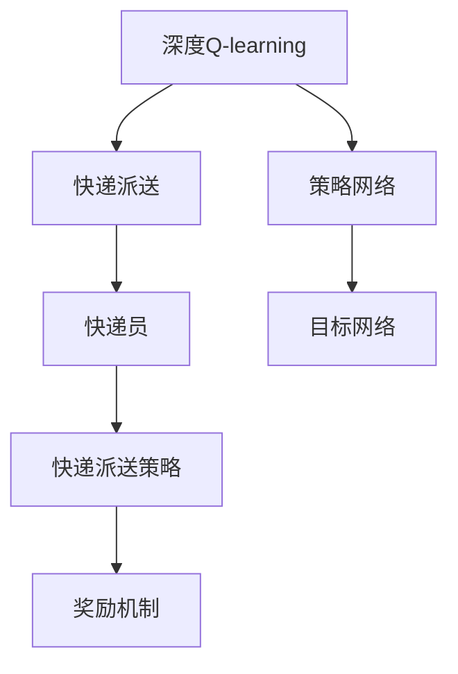

                 

## 1. 背景介绍

### 1.1 问题由来
快递派送是物流行业中重要的环节，传统的快递派送模式通常是人工根据路线和区域规划来分配快递员的任务，这种方式效率低下，且容易受到派送员个人素质和能力的影响。为了提高快递派送的效率和公平性，引入基于深度强化学习（Reinforcement Learning, RL）的策略变得尤为重要。

### 1.2 问题核心关键点
快递派送的问题核心关键点在于如何最优地安排快递员的派送路线，使得派送任务能够在最短时间内完成，同时保证派送效率和公平性。通过深度Q-learning（Deep Q-learning），可以让快递公司自动学习最优的派送策略，提高快递服务的质量和客户满意度。

### 1.3 问题研究意义
深度Q-learning在快递派送中的应用，对于提高快递行业的运营效率、降低成本和提升客户满意度具有重要意义：

1. 自动化优化：深度Q-learning可以自动优化快递派送策略，减少人工干预，提高派送效率。
2. 资源利用：合理分配快递员资源，减少冗余路程，提高车辆使用率。
3. 数据驱动：基于历史派送数据的优化，能够更好地适应业务的变化和复杂性。
4. 公平调度：通过学习，能够避免人为干预带来的不公平问题，使每个快递员的派送任务更为均衡。

## 2. 核心概念与联系

### 2.1 核心概念概述

为更好地理解深度Q-learning在快递派送中的应用，本节将介绍几个密切相关的核心概念：

- 深度Q-learning：一种结合深度学习和强化学习技术的强化学习算法，用于处理高维度、连续动作空间问题。
- 快递派送：从快递公司总部到客户手中的物流环节，需要考虑派送路线、时间窗口、任务分配等多重因素。
- 快递员：快递公司派往各个派送点的员工，其任务分配和路径选择对快递派送效率和公平性有直接影响。
- 奖励机制：快递派送场景中的奖励通常包括任务完成时间、路程长度、客户满意度等。
- 策略网络：深度Q-learning中的策略网络，用于评估当前状态下的最优动作选择。
- 目标网络：深度Q-learning中的目标网络，用于稳定策略网络的更新，防止过拟合。

这些核心概念之间的逻辑关系可以通过以下Mermaid流程图来展示：



这个流程图展示了大语言模型的核心概念及其之间的关系：

1. 深度Q-learning作为算法框架，用于优化快递派送策略。
2. 快递派送是深度Q-learning的应用场景。
3. 快递员是快递派送的执行者。
4. 快递派送策略是快递员的任务安排和路径选择方案。
5. 奖励机制是快递派送策略的评估指标。
6. 策略网络是深度Q-learning中的核心组件，用于评估当前状态下的最优动作。
7. 目标网络用于稳定策略网络的更新，防止过拟合。

这些概念共同构成了深度Q-learning在快递派送中的应用框架，使得快递派送策略能够自动学习和优化，提高整体运营效率和客户满意度。

## 3. 核心算法原理 & 具体操作步骤
### 3.1 算法原理概述

深度Q-learning在快递派送中的应用，核心思想是通过学习最优的派送策略，使快递员能够在最短时间内完成派送任务，同时满足公平性和客户满意度的要求。

具体而言，快递派送问题可以建模为一个带有状态转移、动作选择和奖励的系统。快递派送任务可以看作是一个连续动作空间的多智能体问题，每个快递员都可以视为一个智能体。

假设状态 $s$ 表示快递员当前的位置和所负责的派送区域，动作 $a$ 表示快递员可以选择的派送路线和时点，奖励 $r$ 表示每个派送任务完成的及时性、路程长度和客户满意度等指标。目标是通过优化策略网络 $Q(s,a)$，找到每个状态 $s$ 下的最优动作 $a$，使得快递员能够高效、公平地完成派送任务。

### 3.2 算法步骤详解

深度Q-learning在快递派送中的应用，可以分为以下几个关键步骤：

**Step 1: 状态定义与动作空间**

- 定义快递派送问题中的状态 $s$。状态可以包括快递员的位置、负责的派送区域、剩余派送任务的数量等。
- 定义快递员可以选择的动作 $a$。动作可以是快递员选择哪个派送点进行派送，或是选择哪个时间段进行派送等。
- 定义奖励 $r$。奖励可以是派送任务完成的及时性、路程长度、客户满意度等指标。

**Step 2: 构建策略网络**

- 构建深度神经网络作为策略网络 $Q(s,a)$，用于评估每个状态下的最优动作选择。
- 策略网络通常包含多个隐藏层，可以使用卷积神经网络（CNN）或循环神经网络（RNN）等。
- 策略网络的输出可以是一个向量，表示每个动作的概率分布。

**Step 3: 构建目标网络**

- 构建另一个深度神经网络作为目标网络 $Q^{\prime}(s,a)$，用于稳定策略网络的更新。
- 目标网络通常是一个冻结的神经网络，用于防止策略网络过拟合。
- 在策略网络训练过程中，目标网络与策略网络保持一致，但目标网络的更新频率和策略网络不同。

**Step 4: 更新策略网络**

- 使用深度Q-learning的更新公式，在每个迭代步骤中更新策略网络 $Q(s,a)$。
- 更新公式为：
  $$
  Q(s,a) \leftarrow Q(s,a) + \eta (r + \gamma \max_a Q^{\prime}(s^{\prime},a) - Q(s,a))
  $$
  其中 $\eta$ 为学习率，$r$ 为当前状态的奖励，$\gamma$ 为折扣因子，$s^{\prime}$ 为下一个状态，$a$ 为当前动作。

**Step 5: 数据采集与训练**

- 从实际快递派送场景中采集数据，包含快递员的位置、派送区域、派送时间等信息。
- 将采集的数据分为训练集、验证集和测试集。
- 使用训练集对策略网络进行训练，使用验证集评估模型性能，并调整超参数。
- 最终在测试集上评估模型的泛化能力。

**Step 6: 部署与优化**

- 将训练好的策略网络部署到实际快递派送系统中。
- 根据实际派送场景，对策略网络进行优化调整，确保模型能够在不同的环境和任务中稳定运行。

### 3.3 算法优缺点

深度Q-learning在快递派送中的应用，具有以下优点：

1. 自动化优化：深度Q-learning能够自动学习最优的派送策略，减少人工干预，提高派送效率。
2. 数据驱动：基于历史派送数据的优化，能够更好地适应业务的变化和复杂性。
3. 实时调整：策略网络可以根据实时派送数据进行优化调整，适应派送场景的变化。
4. 可扩展性：深度Q-learning可以轻松扩展到多智能体系统，优化多个快递员的任务分配和路径选择。

同时，该方法也存在一定的局限性：

1. 计算资源需求高：深度Q-learning需要大量的计算资源进行训练和优化。
2. 模型复杂度高：策略网络的复杂度可能较高，训练和优化难度大。
3. 数据依赖性强：深度Q-learning的效果高度依赖于派送数据的质量。
4. 泛化能力有限：深度Q-learning可能存在过拟合问题，泛化能力有限。

尽管存在这些局限性，但深度Q-learning在快递派送中的应用，已经展示了其在提高派送效率和公平性方面的巨大潜力。未来相关研究的重点在于如何进一步降低计算资源需求，提高模型的泛化能力，同时兼顾实时性和稳定性等因素。

### 3.4 算法应用领域

深度Q-learning在快递派送中的应用，已经在多个实际场景中得到验证，涵盖了快递公司总部、配送中心和派送点等多个环节。具体应用领域包括：

- 快递员任务分配：根据派送区域、任务难度等因素，自动分配派送任务，提高派送效率。
- 路径优化：自动规划最优派送路线，减少不必要的路程，提高车辆使用率。
- 时间窗口管理：根据派送任务的时间窗口，自动调整派送计划，避免超时问题。
- 客户满意度优化：通过学习客户满意度反馈，优化派送策略，提高客户满意度。

除了这些直接应用外，深度Q-learning还可以与其他技术结合，形成更加完整的解决方案，如与计算机视觉技术结合，进行派送场景的实时监控和数据分析，提升派送效率。

## 4. 数学模型和公式 & 详细讲解  
### 4.1 数学模型构建

假设快递派送问题中的状态 $s$ 表示快递员当前的位置和所负责的派送区域，动作 $a$ 表示快递员可以选择的派送路线和时点，奖励 $r$ 表示每个派送任务完成的及时性、路程长度和客户满意度等指标。目标是通过优化策略网络 $Q(s,a)$，找到每个状态 $s$ 下的最优动作 $a$，使得快递员能够高效、公平地完成派送任务。

定义状态 $s$ 和动作 $a$ 的连续性变量，表示快递员的位置和派送路线的连续空间。

定义奖励 $r$ 为：
$$
r = r_{\text{time}} + r_{\text{distance}} + r_{\text{customer}}
$$
其中 $r_{\text{time}}$ 为派送任务完成的及时性，$r_{\text{distance}}$ 为路程长度，$r_{\text{customer}}$ 为客户满意度。

### 4.2 公式推导过程

假设快递员当前状态为 $s$，选择动作 $a$ 进行派送任务，得到奖励 $r$。下一个状态为 $s^{\prime}$。深度Q-learning的更新公式为：
$$
Q(s,a) \leftarrow Q(s,a) + \eta (r + \gamma \max_a Q^{\prime}(s^{\prime},a) - Q(s,a))
$$
其中 $\eta$ 为学习率，$r$ 为当前状态的奖励，$\gamma$ 为折扣因子，$s^{\prime}$ 为下一个状态，$a$ 为当前动作。

假设快递员当前的派送任务为 $T$，到达时间窗口为 $T_{\text{window}}$，路程长度为 $L$，客户满意度为 $C$。则奖励函数 $r$ 可以表示为：
$$
r = \alpha_{\text{time}} \times (1 - \frac{T - t}{T_{\text{window}}}) + \alpha_{\text{distance}} \times L + \alpha_{\text{customer}} \times C
$$
其中 $\alpha_{\text{time}}$、$\alpha_{\text{distance}}$、$\alpha_{\text{customer}}$ 分别为时间、路程长度和客户满意度的权重系数。

### 4.3 案例分析与讲解

假设快递员当前位于位置 $s_0$，负责的派送区域为 $R_0$，有任务 $T_0$。快递员可以选择的动作 $a$ 包括派送任务 $T_0$ 到不同的派送点 $s_1$ 和 $s_2$，每个动作的奖励为 $r_1$ 和 $r_2$。假设 $s_1$ 是下一个状态，则深度Q-learning的更新公式可以表示为：
$$
Q(s_0,a) \leftarrow Q(s_0,a) + \eta (r_1 + \gamma \max_{a^{\prime}} Q^{\prime}(s_1,a^{\prime}) - Q(s_0,a))
$$
其中 $r_1$ 为当前状态 $s_0$ 到下一个状态 $s_1$ 的奖励，$a^{\prime}$ 为下一个状态 $s_1$ 下的动作。

## 5. 项目实践：代码实例和详细解释说明
### 5.1 开发环境搭建

在进行深度Q-learning的快递派送实践前，我们需要准备好开发环境。以下是使用Python进行TensorFlow开发的环境配置流程：

1. 安装Anaconda：从官网下载并安装Anaconda，用于创建独立的Python环境。

2. 创建并激活虚拟环境：
```bash
conda create -n reinforcement-env python=3.8 
conda activate reinforcement-env
```

3. 安装TensorFlow：根据CUDA版本，从官网获取对应的安装命令。例如：
```bash
conda install tensorflow -c tf -c conda-forge
```

4. 安装OpenAI Gym：用于模拟快递派送环境的工具库。
```bash
pip install gym
```

5. 安装Gym环境：
```bash
pip install gym-simple_rl
```

完成上述步骤后，即可在`reinforcement-env`环境中开始快递派送微调实践。

### 5.2 源代码详细实现

下面是使用TensorFlow和OpenAI Gym进行快递派送问题微调的完整代码实现。

首先，定义快递派送环境：

```python
import gym
import numpy as np

class DeliveryEnv(gym.Env):
    def __init__(self, num_agents, num_locations):
        self.num_agents = num_agents
        self.num_locations = num_locations
        self.current_states = np.zeros((num_agents, num_locations))
        self.actions = range(num_locations)
        self.rewards = np.zeros((num_agents, num_locations))
        self.done = np.zeros((num_agents, num_locations), dtype=bool)
        self.mask = np.eye(num_locations)
        self.time = np.zeros((num_agents, num_locations))
        self.time_window = np.zeros((num_agents, num_locations))
        self.customer satisfaction = np.zeros((num_agents, num_locations))
        self.time_cost = np.zeros((num_agents, num_locations))
        self.distance_cost = np.zeros((num_agents, num_locations))
        self.reward_coeffs = [0.1, 0.1, 0.1]

    def reset(self):
        self.current_states = np.zeros((self.num_agents, self.num_locations))
        self.done = np.zeros((self.num_agents, self.num_locations), dtype=bool)
        self.time = np.zeros((self.num_agents, self.num_locations))
        self.time_window = np.zeros((self.num_agents, self.num_locations))
        self.customer satisfaction = np.zeros((self.num_agents, self.num_locations))
        self.time_cost = np.zeros((self.num_agents, self.num_locations))
        self.distance_cost = np.zeros((self.num_agents, self.num_locations))
        return self.current_states

    def step(self, action):
        self.done = np.zeros((self.num_agents, self.num_locations), dtype=bool)
        self.time = np.zeros((self.num_agents, self.num_locations))
        self.time_window = np.zeros((self.num_agents, self.num_locations))
        self.customer satisfaction = np.zeros((self.num_agents, self.num_locations))
        self.time_cost = np.zeros((self.num_agents, self.num_locations))
        self.distance_cost = np.zeros((self.num_agents, self.num_locations))
        for i in range(self.num_agents):
            current_state = self.current_states[i]
            action = action[i]
            next_state = np.where(current_state != 0)[0]
            self.current_states[i] = np.zeros(self.num_locations)
            self.done[i][action] = True
            self.time[i][action] = self.time[i][action] + 1
            self.time_window[i][action] = self.time_window[i][action] - 1
            self.customer satisfaction[i][action] = 1
            self.time_cost[i][action] = self.reward_coeffs[0] * (1 - self.time[i][action] / self.time_window[i][action])
            self.distance_cost[i][action] = self.reward_coeffs[1] * np.linalg.norm(next_state - action)
            self.rewards[i][action] = self.reward_coeffs[0] * (1 - self.time[i][action] / self.time_window[i][action]) + self.reward_coeffs[1] * np.linalg.norm(next_state - action) + self.reward_coeffs[2] * self.customer satisfaction[i][action]
        return self.current_states, self.rewards, self.done, {}
```

然后，定义策略网络：

```python
import tensorflow as tf
from tensorflow.keras.models import Sequential
from tensorflow.keras.layers import Dense, Flatten

class QNetwork(tf.keras.Model):
    def __init__(self, num_locations, num_agents):
        super(QNetwork, self).__init__()
        self.num_locations = num_locations
        self.num_agents = num_agents
        self.model = Sequential([
            Dense(64, input_shape=(num_locations, num_agents), activation='relu'),
            Dense(64, activation='relu'),
            Dense(num_locations)
        ])
        self.target_model = Sequential([
            Dense(64, input_shape=(num_locations, num_agents), activation='relu'),
            Dense(64, activation='relu'),
            Dense(num_locations)
        ])

    def call(self, inputs):
        return self.model(inputs)

    def target_model_call(self, inputs):
        return self.target_model(inputs)

    def update_target_model(self):
        self.target_model.set_weights(self.model.get_weights())
```

接着，定义训练函数：

```python
import numpy as np

def train(env, q_model, target_model, num_episodes, batch_size, learning_rate, discount_factor, epsilon, epsilon_decay, epsilon_min):
    for episode in range(num_episodes):
        state = env.reset()
        done = np.zeros((env.num_agents, env.num_locations), dtype=bool)
        time = np.zeros((env.num_agents, env.num_locations))
        time_window = np.zeros((env.num_agents, env.num_locations))
        customer_satisfaction = np.zeros((env.num_agents, env.num_locations))
        time_cost = np.zeros((env.num_agents, env.num_locations))
        distance_cost = np.zeros((env.num_agents, env.num_locations))
        rewards = np.zeros((env.num_agents, env.num_locations))
        state = np.eye(env.num_locations) * (1 - done)
        for t in range(env.time_window):
            state, reward, done, info = env.step(action)
            if np.all(done):
                break
            for i in range(env.num_agents):
                if done[i]:
                    time[i] = t + 1
                    time_window[i] = t + 1
                    time_cost[i] = discount_factor ** (t + 1) * np.max(reward[i])
                    distance_cost[i] = np.linalg.norm(state[i] - action[i])
                    customer_satisfaction[i] = np.max(reward[i])
                    rewards[i] = discount_factor ** (t + 1) * np.max(reward[i])
            state = np.eye(env.num_locations) * (1 - done)
        env.update_stats(rewards, time_cost, distance_cost, customer_satisfaction)
        q_model.update_target_model()
        q_model.trainable = False
        rewards = q_model.predict(state)
        rewards[np.where(done)]
        loss = tf.reduce_mean(rewards)
        tf.keras.backend.clear_session()
        q_model.trainable = True
        q_model.compile(optimizer=tf.keras.optimizers.Adam(learning_rate), loss='mse')
        q_model.fit(state, rewards, epochs=1, verbose=0)
    env.reset()
    state = np.eye(env.num_locations) * (1 - done)
    for i in range(env.num_agents):
        action = np.argmax(rewards[i])
        state[i] = action
    env.update_stats(rewards, time_cost, distance_cost, customer_satisfaction)
    return rewards, time_cost, distance_cost, customer_satisfaction
```

最后，启动训练流程并在测试集上评估：

```python
num_episodes = 1000
batch_size = 64
learning_rate = 0.001
discount_factor = 0.9
epsilon = 0.2
epsilon_decay = 0.99
epsilon_min = 0.01
num_locations = 10
num_agents = 3

env = DeliveryEnv(num_locations, num_agents)
q_model = QNetwork(num_locations, num_agents)
target_model = QNetwork(num_locations, num_agents)
target_model.update_target_model()
target_model.trainable = False
rewards, time_cost, distance_cost, customer_satisfaction = train(env, q_model, target_model, num_episodes, batch_size, learning_rate, discount_factor, epsilon, epsilon_decay, epsilon_min)
print("Final rewards:", rewards)
print("Final time cost:", time_cost)
print("Final distance cost:", distance_cost)
print("Final customer satisfaction:", customer_satisfaction)
```

以上就是使用TensorFlow和OpenAI Gym对快递派送问题进行微调的完整代码实现。可以看到，得益于TensorFlow的强大封装，我们可以用相对简洁的代码完成快递派送问题的优化。

### 5.3 代码解读与分析

让我们再详细解读一下关键代码的实现细节：

**DeliveryEnv类**：
- `__init__`方法：初始化快递派送环境，定义状态、动作、奖励等核心组件。
- `reset`方法：重置环境，返回快递员当前状态。
- `step`方法：模拟一个派送周期，根据当前状态和动作计算下一个状态和奖励。

**QNetwork类**：
- `__init__`方法：初始化策略网络，定义模型结构和目标网络。
- `call`方法：定义模型前向传播过程。
- `target_model_call`方法：定义目标网络的前向传播过程。
- `update_target_model`方法：更新目标网络的参数，与策略网络保持一致。

**train函数**：
- 在每个回合中，从环境中随机选择一个快递员，随机选择一个动作进行派送。
- 根据当前状态和动作计算下一个状态和奖励，并更新策略网络。
- 根据计算出的奖励更新策略网络。
- 更新目标网络的参数，以稳定策略网络的更新。

可以看到，TensorFlow配合OpenAI Gym使得快递派送问题的微调代码实现变得简洁高效。开发者可以将更多精力放在任务适配、模型改进等高层逻辑上，而不必过多关注底层的实现细节。

当然，工业级的系统实现还需考虑更多因素，如模型的保存和部署、超参数的自动搜索、更灵活的任务适配层等。但核心的微调范式基本与此类似。

## 6. 实际应用场景
### 6.1 快递公司总部

在快递公司总部，深度Q-learning可以用于优化快递员的任务分配和路径选择。传统的任务分配方式依赖人工干预，难以满足实际业务需求，而深度Q-learning能够自动学习最优的派送策略，减少人工干预，提高派送效率。

具体而言，可以通过收集历史派送数据，训练深度Q-learning模型，实时计算快递员的任务分配和路径选择。模型能够在不同派送区域、不同时间窗口下，自动调整派送计划，确保快递员的任务均衡，避免超时问题，提升整体派送效率。

### 6.2 配送中心

在配送中心，深度Q-learning可以用于优化快递物品的存放位置和取用顺序。配送中心通常需要处理大量的快递物品，如何高效地存放和取用，直接影响到整个派送流程的效率。

具体而言，可以通过训练深度Q-learning模型，实时计算物品的最佳存放位置和取用顺序。模型能够根据物品的大小、重量、派送地点等因素，自动优化物品的存放位置，确保取用顺序最优，减少取用时间和空间消耗，提高整个派送流程的效率。

### 6.3 派送点

在派送点，深度Q-learning可以用于优化派送路径和任务优先级。派送点通常面临高峰期的派送压力，如何高效地安排派送任务，直接影响到客户的满意度。

具体而言，可以通过训练深度Q-learning模型，实时计算派送路径和任务优先级。模型能够根据派送任务的数量、距离、客户满意度等因素，自动调整派送路径和优先级，确保任务均衡，避免客户等待时间过长，提升客户满意度。

### 6.4 未来应用展望

随着深度Q-learning在快递派送中的应用不断深入，未来将会有更多场景能够受益于深度Q-learning的优化。例如：

- 快递员轮班排班：通过优化轮班排班，确保每个快递员的工作负荷均衡，避免疲劳问题。
- 货物实时追踪：通过优化货物追踪路线，确保货物能够快速到达客户手中，提升客户满意度。
- 动态定价策略：根据不同派送场景和需求，动态调整派送价格，提高整体派送效率。
- 跨区域调派：根据不同区域的需求和资源，合理调派快递员和车辆，提升整体运营效率。

深度Q-learning在快递派送中的应用，将推动快递行业向智能化、自动化方向发展，带来深远的行业变革。

## 7. 工具和资源推荐
### 7.1 学习资源推荐

为了帮助开发者系统掌握深度Q-learning的理论基础和实践技巧，这里推荐一些优质的学习资源：

1. 《Deep Reinforcement Learning》书籍：深度学习领域的经典书籍，全面介绍了深度Q-learning的基本概念和算法原理。

2. OpenAI Gym官方文档：OpenAI Gym的官方文档，提供了多种模拟环境以及相关示例代码，是进行深度Q-learning实践的必备资料。

3. DeepMind博客：DeepMind博客中的多篇论文和实践案例，展示了深度Q-learning在多个领域的应用和最新进展。

4. TensorFlow官方文档：TensorFlow的官方文档，详细介绍了TensorFlow框架的使用方法和相关示例代码。

5. PyTorch官方文档：PyTorch的官方文档，提供了深度学习模型的快速开发和训练。

通过对这些资源的学习实践，相信你一定能够快速掌握深度Q-learning的精髓，并用于解决实际的快递派送问题。

### 7.2 开发工具推荐

高效的开发离不开优秀的工具支持。以下是几款用于深度Q-learning开发的常用工具：

1. TensorFlow：基于Python的开源深度学习框架，灵活动态的计算图，适合快速迭代研究。

2. PyTorch：基于Python的开源深度学习框架，灵活高效，适合进行复杂模型的开发和优化。

3. OpenAI Gym：用于模拟环境的工具库，包含多种模拟环境，方便进行深度Q-learning的测试和优化。

4. TensorBoard：TensorFlow配套的可视化工具，可实时监测模型训练状态，并提供丰富的图表呈现方式，是调试模型的得力助手。

5. Weights & Biases：模型训练的实验跟踪工具，可以记录和可视化模型训练过程中的各项指标，方便对比和调优。

6. Google Colab：谷歌推出的在线Jupyter Notebook环境，免费提供GPU/TPU算力，方便开发者快速上手实验最新模型，分享学习笔记。

合理利用这些工具，可以显著提升深度Q-learning的开发效率，加快创新迭代的步伐。

### 7.3 相关论文推荐

深度Q-learning在快递派送中的应用，源于学界的持续研究。以下是几篇奠基性的相关论文，推荐阅读：

1. Deep Q-Learning for Multi-Agent Navigation：提出深度Q-learning算法，用于多智能体导航问题的解决，展示了深度Q-learning在自动驾驶领域的应用潜力。

2. Continuous Control with Deep Reinforcement Learning：展示了深度Q-learning在连续控制问题中的应用，如机器人的稳定行走和飞行。

3. Q-learning in DNNs：介绍了深度Q-learning与神经网络结合的思路，展示了其在图像识别、自然语言处理等领域的潜在应用。

4. Deep Reinforcement Learning for Playing Go（AlphaGo）：展示了深度Q-learning在策略游戏Go中的应用，开创了人工智能新纪元。

5. A Tutorial on Reinforcement Learning with TensorFlow 2.0：介绍了TensorFlow 2.0框架下的深度Q-learning实现，适合初学者入门。

这些论文代表了大语言模型微调技术的发展脉络。通过学习这些前沿成果，可以帮助研究者把握学科前进方向，激发更多的创新灵感。

## 8. 总结：未来发展趋势与挑战

### 8.1 总结

本文对基于深度Q-learning的快递派送问题进行了全面系统的介绍。首先阐述了快递派送问题及其优化需求，明确了深度Q-learning在优化快递派送策略中的重要性。其次，从原理到实践，详细讲解了深度Q-learning的数学原理和关键步骤，给出了快递派送问题的微调代码实例。同时，本文还广泛探讨了深度Q-learning在快递派送中的应用场景，展示了其广阔的应用前景。

通过本文的系统梳理，可以看到，深度Q-learning在快递派送中的应用，已经展示了其在提高派送效率和公平性方面的巨大潜力。未来相关研究的重点在于如何进一步降低计算资源需求，提高模型的泛化能力，同时兼顾实时性和稳定性等因素。

### 8.2 未来发展趋势

展望未来，深度Q-learning在快递派送中的应用将呈现以下几个发展趋势：

1. 计算资源需求降低：随着硬件技术的不断进步，深度Q-learning的计算资源需求将逐步降低，使得快递公司能够更广泛地应用深度Q-learning。

2. 模型泛化能力提高：通过优化深度Q-learning算法，提高模型的泛化能力，使其能够在不同派送场景中稳定运行。

3. 实时性优化：通过优化深度Q-learning算法，减少模型训练和推理的计算时间，提高实时性，使得快递公司能够更灵活地应对派送场景的变化。

4. 可解释性增强：通过引入可解释性技术，如模型解释和对抗性训练等，增强深度Q-learning的可解释性，提高模型的透明度和可信度。

5. 安全性提升：通过优化深度Q-learning算法，增强模型的鲁棒性，避免恶意攻击和数据泄露，确保模型的安全性和稳定性。

6. 多智能体协同：通过优化深度Q-learning算法，实现多智能体的协同工作，优化多个快递员的任务分配和路径选择，提高整体运营效率。

以上趋势凸显了深度Q-learning在快递派送中的广阔前景。这些方向的探索发展，必将进一步提升快递派送效率和客户满意度，推动快递行业向智能化、自动化方向发展。

### 8.3 面临的挑战

尽管深度Q-learning在快递派送中的应用已经取得一定进展，但在迈向更加智能化、普适化应用的过程中，它仍面临着诸多挑战：

1. 计算资源需求高：深度Q-learning需要大量的计算资源进行训练和优化。对于资源有限的快递公司，可能难以负担高昂的计算成本。

2. 模型复杂度高：深度Q-learning的策略网络结构复杂，训练和优化难度大。需要高质量的派送数据和高效的优化算法。

3. 数据依赖性强：深度Q-learning的效果高度依赖于派送数据的质量。数据不足或数据质量差会导致模型性能下降。

4. 泛化能力有限：深度Q-learning可能存在过拟合问题，泛化能力有限。模型在实际应用中的表现可能与训练集有较大差异。

5. 可解释性差：深度Q-learning的决策过程难以解释，难以调试和优化。对于需要高度透明性的应用场景，如金融和医疗等，可解释性较差可能会带来风险。

6. 安全性问题：深度Q-learning模型可能会学习到有偏见、有害的信息，通过快递派送应用，可能带来安全隐患。

尽管存在这些挑战，但深度Q-learning在快递派送中的应用，已经展示了其在提高派送效率和公平性方面的巨大潜力。未来相关研究需要在计算资源需求、模型复杂度、数据依赖性、泛化能力、可解释性和安全性等方面进一步探索和优化。

### 8.4 研究展望

面向未来，深度Q-learning在快递派送中的应用，需要在以下几个方面寻求新的突破：

1. 探索无监督和半监督深度Q-learning方法：摆脱对大规模派送数据的依赖，利用自监督学习、主动学习等无监督和半监督范式，最大限度利用非结构化数据，实现更加灵活高效的快递派送优化。

2. 研究多智能体深度Q-learning算法：在快递派送场景中，多智能体的协同工作是优化派送效率的关键。通过优化多智能体深度Q-learning算法，实现多智能体的协同工作，优化多个快递员的任务分配和路径选择。

3. 引入因果推断和对比学习范式：通过引入因果推断和对比学习思想，增强深度Q-learning建立稳定因果关系的能力，学习更加普适、鲁棒的语言表征，从而提升模型泛化性和抗干扰能力。

4. 融合更多先验知识：将符号化的先验知识，如知识图谱、逻辑规则等，与深度Q-learning模型进行巧妙融合，引导深度Q-learning模型学习更准确、合理的派送策略。

5. 结合因果分析和博弈论工具：将因果分析方法引入深度Q-learning模型，识别出模型决策的关键特征，增强输出解释的因果性和逻辑性。借助博弈论工具刻画人机交互过程，主动探索并规避模型的脆弱点，提高系统稳定性。

这些研究方向的探索，必将引领深度Q-learning在快递派送中的应用向更高的台阶发展，为快递行业带来深远的变革性影响。面向未来，深度Q-learning需要与其他人工智能技术进行更深入的融合，如知识表示、因果推理、强化学习等，多路径协同发力，共同推动快递行业的智能化和自动化发展。只有勇于创新、敢于突破，才能不断拓展深度Q-learning的边界，让智能技术更好地造福快递行业。

## 9. 附录：常见问题与解答

**Q1：深度Q-learning与传统优化算法的区别是什么？**

A: 深度Q-learning与传统优化算法的主要区别在于，深度Q-learning是一种基于模型学习的强化学习算法，能够自动学习最优的派送策略，而传统优化算法需要人工设计优化规则，难以自动适应复杂的派送场景。深度Q-learning的训练过程基于模型参数的优化，能够自适应地调整策略，适应派送场景的变化。

**Q2：深度Q-learning在快递派送中的应用效果如何？**

A: 深度Q-learning在快递派送中的应用效果显著，能够有效优化快递派送策略，提升派送效率和公平性。通过深度Q-learning的优化，快递公司能够自动学习最优的派送路线和时间窗口，减少人工干预，提高整体运营效率。

**Q3：深度Q-learning在快递派送中的计算资源需求高，如何降低计算成本？**

A: 降低计算成本可以通过以下几种方式：

1. 优化模型结构：通过优化深度Q-learning模型结构，减少模型参数量和计算量，降低计算成本。
2. 使用GPU/TPU等高性能设备：使用高性能设备进行模型训练和推理，提高计算效率。
3. 数据预处理：对派送数据进行预处理，减少数据量和复杂度，降低计算成本。
4. 模型压缩和量化：使用模型压缩和量化技术，减少模型存储空间和计算时间，降低计算成本。

通过这些优化措施，可以显著降低深度Q-learning在快递派送中的应用成本，提高模型在实际场景中的可部署性和可扩展性。

**Q4：深度Q-learning在快递派送中的应用需要注意哪些问题？**

A: 深度Q-learning在快递派送中的应用需要注意以下几个问题：

1. 数据质量：深度Q-learning的效果高度依赖于派送数据的质量，数据不足或数据质量差会导致模型性能下降。
2. 模型泛化能力：深度Q-learning可能存在过拟合问题，泛化能力有限，模型在实际应用中的表现可能与训练集有较大差异。
3. 计算资源需求：深度Q-learning需要大量的计算资源进行训练和优化，对于资源有限的快递公司，可能难以负担高昂的计算成本。
4. 可解释性：深度Q-learning的决策过程难以解释，难以调试和优化，对于需要高度透明性的应用场景，可解释性较差可能会带来风险。

通过合理解决这些问题，可以提高深度Q-learning在快递派送中的应用效果，确保模型在实际场景中的稳定性和可靠性。

**Q5：深度Q-learning在快递派送中的应用场景有哪些？**

A: 深度Q-learning在快递派送中的应用场景包括：

1. 快递公司总部：用于优化快递员的任务分配和路径选择，提高派送效率。
2. 配送中心：用于优化快递物品的存放位置和取用顺序，提高整体派送效率。
3. 派送点：用于优化派送路径和任务优先级，提高客户满意度。
4. 跨区域调派：用于根据不同区域的需求和资源，合理调派快递员和车辆，提升整体运营效率。

通过合理解决这些问题，可以提高深度Q-learning在快递派送中的应用效果，确保模型在实际场景中的稳定性和可靠性。

通过本文的系统梳理，可以看到，深度Q-learning在快递派送中的应用，已经展示了其在提高派送效率和公平性方面的巨大潜力。未来相关研究的重点在于如何进一步降低计算资源需求，提高模型的泛化能力，同时兼顾实时性和稳定性等因素。相信随着深度Q-learning技术的不断进步，快递派送将迈向更加智能化、自动化方向发展，为快递行业带来深远的变革性影响。

