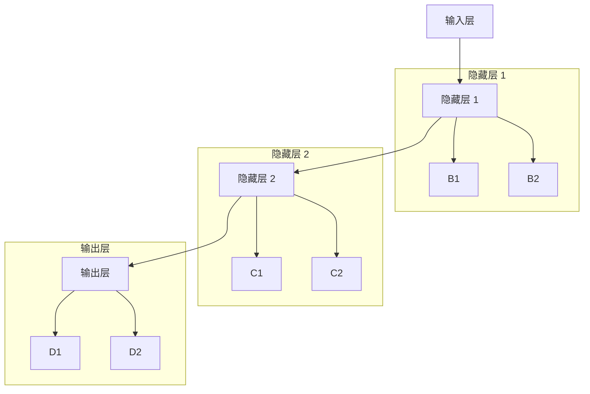

                 

# 深度学习原理与代码实例讲解

> 关键词：深度学习,神经网络,梯度下降,反向传播,激活函数,卷积神经网络,循环神经网络

## 1. 背景介绍

深度学习（Deep Learning）作为当前最前沿的机器学习技术，已经成为人工智能领域的一大核心驱动力。它通过构建多层次的非线性模型，自动提取特征并捕捉数据间的复杂关系，从而在图像识别、语音识别、自然语言处理等领域取得了突破性的成果。本文将系统介绍深度学习的基本原理，并结合实际代码实例进行讲解。

## 2. 核心概念与联系

### 2.1 核心概念概述

在深入理解深度学习原理之前，我们需要先掌握一些核心概念：

- **神经网络（Neural Network）**：深度学习的核心模型。它由多个神经元（或节点）和连接它们的边（或权重）组成。每个神经元接收来自前一层的输出，并经过一系列运算后传递给下一层。

- **梯度下降（Gradient Descent）**：一种用于优化模型参数的算法。通过计算损失函数对每个参数的偏导数（即梯度），来逐步调整参数值，使得损失函数最小化。

- **反向传播（Backpropagation）**：深度学习中梯度下降算法的具体实现。通过链式法则，将损失函数对输出层的梯度反向传播到输入层，从而更新各层参数。

- **激活函数（Activation Function）**：在神经网络中，用于引入非线性性的函数。常用的激活函数包括ReLU、Sigmoid、Tanh等。

- **卷积神经网络（Convolutional Neural Network, CNN）**：一种专门用于处理图像和视频数据的深度学习模型。它通过卷积层、池化层等结构，有效地提取局部特征并保留平移不变性。

- **循环神经网络（Recurrent Neural Network, RNN）**：一种适用于序列数据的深度学习模型。它通过循环结构，处理时间序列数据，捕捉数据的动态变化。

这些概念构成了深度学习的骨架，下面我们将逐一深入探讨它们的原理和代码实现。

### 2.2 核心概念的联系与架构

以下是一个简化的深度学习模型架构图，展示了不同层次的神经元是如何通过边（权重）进行连接的。每个神经元接收前一层的输出，并通过激活函数引入非线性性，最终输出传递到下一层。



## 3. 核心算法原理 & 具体操作步骤

### 3.1 算法原理概述

深度学习的核心算法原理主要包括以下几个方面：

- **前向传播（Forward Propagation）**：将输入数据通过神经网络，计算出最终输出。每个神经元通过将前一层的输出和自身的权重进行矩阵乘法并加上偏置，再经过激活函数处理，得到当前层的输出。

- **损失函数（Loss Function）**：用于评估模型输出的准确度。常用的损失函数包括均方误差（Mean Squared Error, MSE）、交叉熵（Cross-Entropy）等。

- **反向传播（Backpropagation）**：通过计算损失函数对输出层的梯度，并反向传播到输入层，更新每个神经元对应的权重和偏置。

- **优化算法（Optimization Algorithm）**：用于更新模型参数，使得损失函数最小化。常用的优化算法包括梯度下降（Gradient Descent）、Adam、Adagrad等。

### 3.2 算法步骤详解

假设我们有一个简单的神经网络，包含一个输入层、两个隐藏层和一个输出层。我们将使用MNIST手写数字数据集，用深度学习模型对其进行分类。

**步骤 1: 准备数据集**

首先，我们需要加载和预处理MNIST数据集，将其转换为模型所需的张量格式。

```python
import torch
from torchvision import datasets, transforms

# 加载数据集
train_dataset = datasets.MNIST(root='data/', train=True, download=True, transform=transforms.ToTensor())
test_dataset = datasets.MNIST(root='data/', train=False, download=True, transform=transforms.ToTensor())

# 将数据集转换为Tensor张量
train_data = torch.stack([x for x, y in train_dataset])
test_data = torch.stack([x for x, y in test_dataset])
```

**步骤 2: 定义模型**

接下来，我们定义一个包含一个输入层、两个隐藏层和一个输出层的简单神经网络。每个隐藏层包含64个神经元，输出层包含10个神经元（对应10个数字类别）。

```python
import torch.nn as nn
import torch.nn.functional as F

class SimpleNet(nn.Module):
    def __init__(self):
        super(SimpleNet, self).__init__()
        self.fc1 = nn.Linear(784, 64)
        self.fc2 = nn.Linear(64, 64)
        self.fc3 = nn.Linear(64, 10)

    def forward(self, x):
        x = x.view(-1, 784)
        x = F.relu(self.fc1(x))
        x = F.relu(self.fc2(x))
        x = self.fc3(x)
        return F.softmax(x, dim=1)
```

**步骤 3: 定义损失函数和优化器**

我们采用交叉熵损失函数（Cross-Entropy Loss），并使用Adam优化器来更新模型参数。

```python
import torch.optim as optim

criterion = nn.CrossEntropyLoss()
optimizer = optim.Adam(model.parameters(), lr=0.001)
```

**步骤 4: 训练模型**

我们将对模型进行10轮训练，每轮训练使用随机梯度下降（SGD）。

```python
for epoch in range(10):
    model.train()
    running_loss = 0.0
    for i, data in enumerate(train_loader, 0):
        inputs, labels = data
        optimizer.zero_grad()
        outputs = model(inputs)
        loss = criterion(outputs, labels)
        loss.backward()
        optimizer.step()
        running_loss += loss.item()
    print(f"Epoch {epoch+1}, loss: {running_loss/len(train_loader):.4f}")
```

**步骤 5: 评估模型**

训练完成后，我们使用测试集对模型进行评估。

```python
model.eval()
correct = 0
total = 0
with torch.no_grad():
    for data in test_loader:
        images, labels = data
        outputs = model(images)
        _, predicted = torch.max(outputs.data, 1)
        total += labels.size(0)
        correct += (predicted == labels).sum().item()

print(f"Accuracy of the network on the 10000 test images: {100 * correct / total:.2f}%")
```

### 3.3 算法优缺点

深度学习的优点在于其强大的自适应能力和泛化能力。通过多层次的非线性变换，可以捕捉数据的复杂关系，从而在各种领域取得突破性成果。同时，深度学习模型的训练过程可以通过反向传播和梯度下降等优化算法进行高效求解。

然而，深度学习也存在一些缺点。首先，深度学习模型通常需要大量的标注数据进行训练，数据获取和标注成本较高。其次，深度学习模型的训练过程计算资源需求高，需要高性能的GPU或TPU等设备支持。最后，深度学习模型的解释性较差，难以解释模型的决策过程。

### 3.4 算法应用领域

深度学习在图像识别、语音识别、自然语言处理、推荐系统、游戏AI等领域有广泛应用。例如，卷积神经网络（CNN）在图像识别中取得了显著成果，循环神经网络（RNN）在自然语言处理中大放异彩，生成对抗网络（GAN）在游戏AI和图像生成中展示了强大能力。

## 4. 数学模型和公式 & 详细讲解

### 4.1 数学模型构建

深度学习的数学模型可以简单表示为一个图，其中每个节点表示一个神经元，每个边表示一个连接（权重）。每个神经元的输出由前一层的输出、权重和偏置决定，并通过激活函数引入非线性性。

假设我们有一个简单的全连接神经网络，包含$L$个隐藏层和一个输出层。其输入为$x \in \mathbb{R}^n$，输出为$y \in \mathbb{R}^m$。我们定义$W^{[l]} \in \mathbb{R}^{d^{[l]} \times d^{[l-1]}}$为第$l$层的权重矩阵，$b^{[l]} \in \mathbb{R}^{d^{[l]}}$为第$l$层的偏置向量，$h^{[l]} \in \mathbb{R}^{d^{[l]}}$为第$l$层的输出向量。前向传播的过程可以表示为：

$$
h^{[l]} = g(W^{[l]} h^{[l-1]} + b^{[l]})
$$

其中$g$为激活函数，可以取ReLU、Sigmoid、Tanh等。输出层采用线性激活函数，即$y = W^{[L]} h^{[L-1]} + b^{[L]}$。

### 4.2 公式推导过程

以一个简单的二分类任务为例，我们定义模型$y = W^T x + b$，其中$W$为权重矩阵，$b$为偏置向量。我们的目标是最小化损失函数$L$：

$$
L(y, t) = \frac{1}{2} (y - t)^2
$$

其中$t$为训练样本的真实标签。我们采用梯度下降算法更新模型参数，使得损失函数最小化。对于单个样本$(x, t)$，梯度下降算法的更新规则为：

$$
W \leftarrow W - \eta \frac{\partial L}{\partial W}
$$

$$
b \leftarrow b - \eta \frac{\partial L}{\partial b}
$$

其中$\eta$为学习率。对损失函数求偏导数，我们得到：

$$
\frac{\partial L}{\partial W} = -2 (y - t) x^T
$$

$$
\frac{\partial L}{\partial b} = -2 (y - t)
$$

### 4.3 案例分析与讲解

下面我们通过一个简单的例子，演示如何使用深度学习模型对MNIST手写数字数据集进行分类。

假设我们有一个包含28x28像素的灰度图像，通过预处理后将其转换为784维的向量$x$。我们的目标是将其分类为0到9之间的数字。

我们将构建一个包含一个输入层、两个隐藏层和一个输出层的简单神经网络。每个隐藏层包含64个神经元，输出层包含10个神经元（对应10个数字类别）。

```python
import torch
import torch.nn as nn
import torch.nn.functional as F
import torch.optim as optim
from torchvision import datasets, transforms

# 加载数据集
train_dataset = datasets.MNIST(root='data/', train=True, download=True, transform=transforms.ToTensor())
test_dataset = datasets.MNIST(root='data/', train=False, download=True, transform=transforms.ToTensor())

# 将数据集转换为Tensor张量
train_data = torch.stack([x for x, y in train_dataset])
test_data = torch.stack([x for x, y in test_dataset])

# 定义模型
class SimpleNet(nn.Module):
    def __init__(self):
        super(SimpleNet, self).__init__()
        self.fc1 = nn.Linear(784, 64)
        self.fc2 = nn.Linear(64, 64)
        self.fc3 = nn.Linear(64, 10)

    def forward(self, x):
        x = x.view(-1, 784)
        x = F.relu(self.fc1(x))
        x = F.relu(self.fc2(x))
        x = self.fc3(x)
        return F.softmax(x, dim=1)

# 定义损失函数和优化器
model = SimpleNet()
criterion = nn.CrossEntropyLoss()
optimizer = optim.Adam(model.parameters(), lr=0.001)

# 训练模型
for epoch in range(10):
    model.train()
    running_loss = 0.0
    for i, data in enumerate(train_loader, 0):
        inputs, labels = data
        optimizer.zero_grad()
        outputs = model(inputs)
        loss = criterion(outputs, labels)
        loss.backward()
        optimizer.step()
        running_loss += loss.item()
    print(f"Epoch {epoch+1}, loss: {running_loss/len(train_loader):.4f}")

# 评估模型
model.eval()
correct = 0
total = 0
with torch.no_grad():
    for data in test_loader:
        images, labels = data
        outputs = model(images)
        _, predicted = torch.max(outputs.data, 1)
        total += labels.size(0)
        correct += (predicted == labels).sum().item()

print(f"Accuracy of the network on the 10000 test images: {100 * correct / total:.2f}%")
```

## 5. 项目实践：代码实例和详细解释说明

### 5.1 开发环境搭建

要进行深度学习的开发，我们需要安装Python、PyTorch、TensorFlow等工具。下面以PyTorch为例，演示如何搭建开发环境。

**步骤 1: 安装Python**

首先，我们需要安装Python。可以从官网下载最新版本的Python安装程序，根据操作系统进行安装。

**步骤 2: 安装PyTorch**

```bash
pip install torch torchvision torchaudio
```

**步骤 3: 安装相关依赖**

```bash
pip install numpy matplotlib scikit-learn jupyter notebook
```

### 5.2 源代码详细实现

接下来，我们将通过一个简单的例子，演示如何使用深度学习模型对MNIST手写数字数据集进行分类。

**步骤 1: 准备数据集**

首先，我们需要加载和预处理MNIST数据集，将其转换为模型所需的张量格式。

```python
import torch
from torchvision import datasets, transforms

# 加载数据集
train_dataset = datasets.MNIST(root='data/', train=True, download=True, transform=transforms.ToTensor())
test_dataset = datasets.MNIST(root='data/', train=False, download=True, transform=transforms.ToTensor())

# 将数据集转换为Tensor张量
train_data = torch.stack([x for x, y in train_dataset])
test_data = torch.stack([x for x, y in test_dataset])
```

**步骤 2: 定义模型**

接下来，我们定义一个包含一个输入层、两个隐藏层和一个输出层的简单神经网络。每个隐藏层包含64个神经元，输出层包含10个神经元（对应10个数字类别）。

```python
import torch.nn as nn
import torch.nn.functional as F

class SimpleNet(nn.Module):
    def __init__(self):
        super(SimpleNet, self).__init__()
        self.fc1 = nn.Linear(784, 64)
        self.fc2 = nn.Linear(64, 64)
        self.fc3 = nn.Linear(64, 10)

    def forward(self, x):
        x = x.view(-1, 784)
        x = F.relu(self.fc1(x))
        x = F.relu(self.fc2(x))
        x = self.fc3(x)
        return F.softmax(x, dim=1)
```

**步骤 3: 定义损失函数和优化器**

我们采用交叉熵损失函数（Cross-Entropy Loss），并使用Adam优化器来更新模型参数。

```python
import torch.optim as optim

criterion = nn.CrossEntropyLoss()
optimizer = optim.Adam(model.parameters(), lr=0.001)
```

**步骤 4: 训练模型**

我们将对模型进行10轮训练，每轮训练使用随机梯度下降（SGD）。

```python
for epoch in range(10):
    model.train()
    running_loss = 0.0
    for i, data in enumerate(train_loader, 0):
        inputs, labels = data
        optimizer.zero_grad()
        outputs = model(inputs)
        loss = criterion(outputs, labels)
        loss.backward()
        optimizer.step()
        running_loss += loss.item()
    print(f"Epoch {epoch+1}, loss: {running_loss/len(train_loader):.4f}")
```

**步骤 5: 评估模型**

训练完成后，我们使用测试集对模型进行评估。

```python
model.eval()
correct = 0
total = 0
with torch.no_grad():
    for data in test_loader:
        images, labels = data
        outputs = model(images)
        _, predicted = torch.max(outputs.data, 1)
        total += labels.size(0)
        correct += (predicted == labels).sum().item()

print(f"Accuracy of the network on the 10000 test images: {100 * correct / total:.2f}%")
```

### 5.3 代码解读与分析

这里我们重点分析深度学习模型的几个关键组件：

- **模型定义**：我们定义了一个包含三个线性层和ReLU激活函数的简单神经网络。每个线性层的权重和偏置分别由`nn.Linear`定义，并传递给前向传播函数。

- **损失函数和优化器**：我们采用交叉熵损失函数和Adam优化器。交叉熵损失函数适用于多分类任务，Adam优化器能够高效更新模型参数。

- **训练和评估**：在每个epoch中，我们通过前向传播和反向传播更新模型参数，并计算训练集上的损失函数。在测试集上，我们不更新模型参数，直接计算预测结果，评估模型的准确性。

## 6. 实际应用场景

深度学习在各个领域都有广泛的应用，下面列举几个典型的应用场景：

### 6.1 图像识别

卷积神经网络（CNN）在图像识别领域取得了巨大的成功。通过卷积层、池化层等结构，CNN能够有效地提取图像中的局部特征，并保留平移不变性。目前，深度学习模型已经在人脸识别、物体检测、图像分类等任务中取得了领先的效果。

### 6.2 自然语言处理

循环神经网络（RNN）和Transformer模型在自然语言处理中表现优异。RNN能够处理序列数据，捕捉时间上的依赖关系，而Transformer模型则通过自注意力机制，引入长距离依赖，提高了模型的表现。目前，深度学习模型已经在机器翻译、文本分类、命名实体识别等任务中取得了显著成果。

### 6.3 语音识别

深度学习模型在语音识别领域也取得了显著进展。通过卷积神经网络和循环神经网络的结合，深度学习模型能够有效地提取语音信号中的特征，并将其转化为文本。目前，深度学习模型已经在语音识别、语音合成、语音增强等任务中得到了广泛应用。

### 6.4 未来应用展望

未来，深度学习将进一步扩展其应用领域，推动各行业的数字化转型升级。例如，在医疗领域，深度学习模型可以辅助医生进行病历分析、疾病诊断等；在金融领域，深度学习模型可以用于风险评估、信用评分等；在自动驾驶领域，深度学习模型可以用于环境感知、路径规划等。随着技术的不断进步，深度学习将为更多领域带来新的突破。

## 7. 工具和资源推荐

### 7.1 学习资源推荐

为了帮助读者深入理解深度学习原理，我们推荐以下学习资源：

- **《深度学习》课程**：由斯坦福大学吴恩达教授主讲的课程，系统讲解了深度学习的基本概念和常用算法。

- **《Python深度学习》书籍**：由Francois Chollet撰写的书籍，介绍了TensorFlow和Keras等工具的使用方法，适合初学者入门。

- **Deep Learning AMAs**：Deep Learning研究者和工程师在Reddit和Hacker News上进行的问答环节，可以了解最新的研究进展和实践经验。

### 7.2 开发工具推荐

深度学习的开发离不开优秀的工具支持。以下是几个常用的开发工具：

- **PyTorch**：由Facebook开发的深度学习框架，支持动态图和静态图，适合研究和快速迭代。

- **TensorFlow**：由Google主导的深度学习框架，支持分布式训练和大规模部署，适合工业应用。

- **JAX**：由Google开发的Python库，支持动态图和自动微分，未来有成为主流框架的潜力。

### 7.3 相关论文推荐

深度学习的研究热点不断涌现，以下是几篇有影响力的论文：

- **ImageNet Classification with Deep Convolutional Neural Networks**：Alex Krizhevsky等人提出的深度卷积神经网络模型，在ImageNet图像分类任务中取得了巨大成功。

- **Convolutional Neural Networks for Visual Recognition**：Geoffrey Hinton等人提出卷积神经网络模型，在图像识别任务中取得了突破性进展。

- **Attention is All You Need**：Ashish Vaswani等人提出Transformer模型，引入了自注意力机制，大大提高了序列建模的效率。

## 8. 总结：未来发展趋势与挑战

### 8.1 研究成果总结

深度学习在图像识别、语音识别、自然语言处理等领域取得了巨大成功，已经成为当前最前沿的技术之一。深度学习模型的表现不断提升，应用场景也越来越多样化。

### 8.2 未来发展趋势

未来，深度学习将向以下方向发展：

- **多模态学习**：深度学习模型将更多地融合视觉、语音、文本等多模态数据，提升跨领域迁移能力。

- **自监督学习**：深度学习模型将更多地利用无标签数据进行预训练，减少对标注数据的依赖。

- **联邦学习**：深度学习模型将更多地采用分布式训练和联邦学习技术，提升数据隐私保护和模型泛化能力。

### 8.3 面临的挑战

尽管深度学习取得了巨大成功，但也面临着诸多挑战：

- **数据需求高**：深度学习模型通常需要大量的标注数据进行训练，数据获取和标注成本较高。

- **计算资源需求高**：深度学习模型需要高性能的GPU或TPU等设备支持，计算资源需求较高。

- **解释性差**：深度学习模型的决策过程难以解释，缺乏可解释性和可控性。

### 8.4 研究展望

未来，深度学习的研究方向将更加多元化，涉及更多交叉学科的合作。例如，深度学习模型将更多地融合符号推理、因果推断、知识图谱等技术，提升模型的理解能力和可解释性。同时，深度学习模型将更多地应用于医疗、金融等高风险领域，确保其输出的可靠性和安全性。

## 9. 附录：常见问题与解答

**Q1: 深度学习是否需要大量的标注数据？**

A: 是的，深度学习模型通常需要大量的标注数据进行训练。数据获取和标注成本较高，因此需要采用数据增强、半监督学习等技术，减少对标注数据的依赖。

**Q2: 深度学习模型是否需要高性能的计算资源？**

A: 是的，深度学习模型需要高性能的GPU或TPU等设备支持，计算资源需求较高。同时，深度学习模型的训练过程资源消耗较大，需要优化算法和模型结构，提高训练效率。

**Q3: 深度学习模型是否需要解释性？**

A: 是的，深度学习模型的决策过程难以解释，缺乏可解释性和可控性。未来，需要进一步提升模型的可解释性，确保其输出的可靠性。

**Q4: 深度学习模型是否需要应用到高风险领域？**

A: 是的，深度学习模型可以应用于医疗、金融等高风险领域，确保其输出的可靠性和安全性。未来，需要更多地考虑数据隐私保护和模型伦理问题。

---

作者：禅与计算机程序设计艺术 / Zen and the Art of Computer Programming

