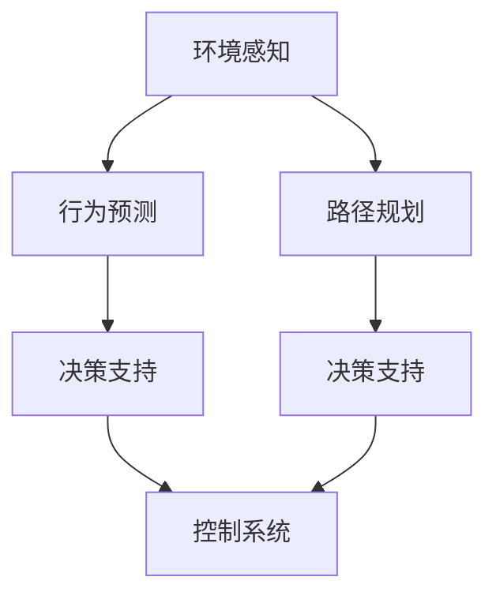

                 

## 1. 背景介绍

### 1.1 问题由来
自动驾驶技术正逐步从实验室走向现实道路，成为未来智能交通的重要方向。其中，深度学习技术以其强大的特征提取和模式识别能力，成为自动驾驶领域的核心驱动力。在自动驾驶中，深度学习不仅用于感知环境，还广泛应用在行为预测、路径规划、决策支持等多个关键环节。因此，深度学习在自动驾驶中的应用，是未来智能交通领域的重要研究方向。

### 1.2 问题核心关键点
深度学习在自动驾驶中的应用，涵盖了感知、决策、控制等多个层面。关键技术包括：
- 环境感知：通过传感器数据进行图像、激光点云、声音等信息的处理和分析，建立对环境的全面感知。
- 行为预测：基于历史数据和环境信息，预测周围车辆、行人的行为动向。
- 路径规划：规划出最优或安全的行驶路径，避免碰撞和拥堵。
- 决策支持：将感知、预测和规划结果结合起来，进行综合决策，指挥车辆行驶。
- 控制系统：实现对车辆转向、加速、制动等操作的精确控制。

这些关键技术紧密相关，相互依存，共同支撑自动驾驶系统的稳定运行。本文将详细介绍这些核心技术及其应用，揭示深度学习在自动驾驶中的强大潜力和应用前景。

## 2. 核心概念与联系

### 2.1 核心概念概述

为更好地理解深度学习在自动驾驶中的应用，本节将介绍几个密切相关的核心概念：

- 自动驾驶(Autonomous Driving)：指通过传感器、计算设备、软件系统等技术手段，实现对车辆的智能控制，使车辆能够自主导航和行驶。

- 环境感知(Perception)：自动驾驶的首要任务是感知车辆周围环境，包括道路状况、交通信号、行人、车辆等。通过多种传感器获取环境数据，如摄像头、激光雷达、毫米波雷达等。

- 行为预测(Prediction)：基于感知数据，预测车辆、行人的运动轨迹和行为。这是决策和规划的重要依据。

- 路径规划(Path Planning)：根据车辆位置和目标目的地，规划出一条最优或安全的行驶路径。

- 决策支持(Decision Making)：将感知、预测和规划结果结合起来，进行综合决策，决定车辆的行驶策略。

- 控制系统(Control System)：实现对车辆转向、加速、制动等操作的精确控制。

这些核心概念之间的逻辑关系可以通过以下Mermaid流程图来展示：



这个流程图展示自动驾驶核心技术之间的逻辑关系：环境感知提供了数据基础，行为预测、路径规划和决策支持共同构建了决策依据，控制系统则执行最终的行驶决策。

## 3. 核心算法原理 & 具体操作步骤
### 3.1 算法原理概述

深度学习在自动驾驶中的应用，主要基于视觉感知和预测算法。其核心思想是通过深度神经网络，对传感器数据进行处理和分析，建立环境感知模型和行为预测模型。以下将详细介绍这些模型的原理和操作步骤。

### 3.2 算法步骤详解

**环境感知模型**：

- **输入**：传感器数据，如摄像头图像、激光点云、毫米波雷达数据等。
- **处理**：使用卷积神经网络(CNN)和深度神经网络(DNN)等模型，提取数据中的特征。
- **输出**：车辆周围环境的高层次表示，如道路标记、交通信号、行人、车辆等。

**行为预测模型**：

- **输入**：历史数据和当前环境数据，如车辆位置、速度、方向等。
- **处理**：使用循环神经网络(RNN)、长短时记忆网络(LSTM)等模型，预测车辆、行人的行为。
- **输出**：车辆、行人的运动轨迹和行为动向。

**路径规划模型**：

- **输入**：车辆位置、目标目的地、周围环境信息等。
- **处理**：使用深度强化学习模型，如深度确定性策略梯度(DQN)、深度确定性策略梯度与神经网络结合(DQN+NN)等，规划最优路径。
- **输出**：车辆行驶的路径和速度计划。

**决策支持模型**：

- **输入**：感知模型、预测模型和规划模型的输出结果。
- **处理**：使用决策树、集成学习等模型，综合各模块的输出，进行决策。
- **输出**：车辆的行驶策略，如加速、减速、转向等。

**控制系统**：

- **输入**：决策支持模型的输出，如转向角度、加速度等。
- **处理**：使用线性模型、非线性模型、模糊控制等方法，控制车辆行驶。
- **输出**：对车辆转向、加速、制动等操作的精确控制。

### 3.3 算法优缺点

深度学习在自动驾驶中的应用，具有以下优点：

- **强大的特征提取能力**：深度学习模型能够自动学习到环境数据的高级特征，捕捉复杂模式。
- **泛化能力强**：深度学习模型在训练数据上学习到的模式，能够较好地泛化到新环境。
- **处理多样化的数据**：深度学习能够处理图像、点云、声音等多种传感器数据，提供全面的环境感知。

同时，也存在一些缺点：

- **模型复杂度高**：深度学习模型参数较多，训练和推理复杂度高。
- **依赖大量数据**：训练深度学习模型需要大量标注数据，收集和处理成本较高。
- **对硬件要求高**：深度学习模型计算量大，需要高性能计算设备支持。
- **可解释性不足**：深度学习模型往往被视为"黑盒"，难以解释其内部决策过程。

尽管存在这些缺点，但深度学习在自动驾驶中的应用，仍因其强大的性能和潜力，受到广泛关注。未来，如何平衡模型复杂度、训练成本和推理效率，提高模型的可解释性，将是重要的研究方向。

### 3.4 算法应用领域

深度学习在自动驾驶中的应用，涉及以下主要领域：

- **传感器数据融合**：将摄像头、激光雷达、毫米波雷达等传感器数据进行融合，提升环境感知能力。
- **目标检测与识别**：识别道路标记、交通信号、行人、车辆等目标，提供全面的环境信息。
- **行为预测与分析**：预测周围车辆、行人的行为动向，避免碰撞和事故。
- **路径规划与导航**：规划最优或安全的行驶路径，实现自动导航。
- **交通场景模拟与仿真**：通过模拟仿真环境，测试和优化自动驾驶算法。
- **智能决策与控制**：基于感知、预测和规划结果，进行综合决策，实现智能驾驶。

这些领域的应用，使得深度学习成为自动驾驶技术的重要支撑，为未来智能交通的发展提供了强有力的技术保障。

## 4. 数学模型和公式 & 详细讲解 & 举例说明

### 4.1 数学模型构建

深度学习在自动驾驶中的应用，涉及多种数学模型和公式。以下将以环境感知模型为例，进行详细讲解。

假设摄像头传感器捕捉到一张道路图像，记为 $I \in \mathbb{R}^{H \times W}$，其中 $H$ 为图像高度，$W$ 为图像宽度。深度学习模型 $M$ 的输入为图像 $I$，输出为道路标记的坐标位置 $P \in \mathbb{R}^{K \times 2}$，其中 $K$ 为标记数量，每行表示一个标记的坐标 $(x,y)$。

环境感知模型的数学模型可以表示为：

$$
M(I) = \mathop{\arg\min}_{P} \mathcal{L}(P,I)
$$

其中 $\mathcal{L}$ 为损失函数，用于衡量模型输出与真实标记坐标的差异。

常用的损失函数包括均方误差(MSE)、交叉熵(Cross-Entropy)、绝对值误差(Absolute Error)等。这里以交叉熵损失为例，推导其计算公式。

假设模型 $M$ 的输出为 $P' \in \mathbb{R}^{K \times 2}$，则交叉熵损失函数为：

$$
\mathcal{L}(P',I) = -\sum_{k=1}^K [y_k \log \hat{p}_k + (1-y_k) \log (1-\hat{p}_k)]
$$

其中 $y_k \in \{0,1\}$ 表示标记 $k$ 是否在图像中，$\hat{p}_k = \frac{\exp(p'_k)}{\sum_{k=1}^K \exp(p'_k)}$ 表示标记 $k$ 在图像中出现的概率估计。

### 4.2 公式推导过程

以目标检测为例，假设模型输出 $P$ 为 $H \times W \times K$ 张量，每张量表示一个像素点对应的 $K$ 个目标类别概率，目标类别为 $C$。则交叉熵损失函数为：

$$
\mathcal{L}(P,I) = -\frac{1}{H \times W} \sum_{h=1}^H \sum_{w=1}^W \sum_{c=1}^C [y_c \log \hat{p}_{c,h,w} + (1-y_c) \log (1-\hat{p}_{c,h,w})]
$$

其中 $y_c \in \{0,1\}$ 表示目标类别 $c$ 是否在图像中，$\hat{p}_{c,h,w} = \frac{\exp(P_{c,h,w})}{\sum_{c=1}^C \exp(P_{c,h,w})}$ 表示目标类别 $c$ 在像素点 $(h,w)$ 处出现的概率估计。

以上公式展示了目标检测损失函数的推导过程，以此类推，其他环境感知模型的损失函数推导方法类似。

### 4.3 案例分析与讲解

**目标检测**：

- **输入**：摄像头图像 $I$。
- **处理**：使用深度学习模型 $M$，输出标记坐标 $P$。
- **输出**：道路标记的坐标位置 $P$。

**行为预测**：

- **输入**：车辆位置、速度、方向等 $D$。
- **处理**：使用RNN或LSTM模型，预测车辆、行人的行为 $P'$。
- **输出**：车辆、行人的运动轨迹和行为动向 $P'$。

**路径规划**：

- **输入**：车辆位置、目标目的地、周围环境信息等 $D$。
- **处理**：使用DQN+NN模型，规划最优路径 $P'$。
- **输出**：车辆行驶的路径和速度计划 $P'$。

**决策支持**：

- **输入**：感知模型、预测模型和规划模型的输出结果 $D$。
- **处理**：使用决策树、集成学习等模型，综合决策 $P'$。
- **输出**：车辆的行驶策略 $P'$。

**控制系统**：

- **输入**：决策支持模型的输出 $P'$。
- **处理**：使用线性模型、非线性模型、模糊控制等方法，控制车辆行驶。
- **输出**：对车辆转向、加速、制动等操作的精确控制 $P'$。

通过以上案例分析，可以看到，深度学习在自动驾驶中的应用，能够从多个层面提升系统的性能和可靠性。

## 5. 项目实践：代码实例和详细解释说明

### 5.1 开发环境搭建

在进行深度学习实践前，我们需要准备好开发环境。以下是使用Python进行TensorFlow开发的环境配置流程：

1. 安装Anaconda：从官网下载并安装Anaconda，用于创建独立的Python环境。

2. 创建并激活虚拟环境：
```bash
conda create -n tf-env python=3.8 
conda activate tf-env
```

3. 安装TensorFlow：根据CUDA版本，从官网获取对应的安装命令。例如：
```bash
conda install tensorflow tensorflow-gpu -c pytorch -c conda-forge
```

4. 安装其他必需的Python包：
```bash
pip install numpy matplotlib scikit-image opencv-python
```

完成上述步骤后，即可在`tf-env`环境中开始深度学习实践。

### 5.2 源代码详细实现

这里我们以基于深度学习的环境感知模型为例，展示其代码实现。

首先，定义环境感知模型的输入和输出：

```python
import tensorflow as tf

class EnvironmentPerceptionModel(tf.keras.Model):
    def __init__(self, input_shape):
        super(EnvironmentPerceptionModel, self).__init__()
        self.conv1 = tf.keras.layers.Conv2D(32, 3, activation='relu', padding='same', input_shape=input_shape)
        self.conv2 = tf.keras.layers.Conv2D(64, 3, activation='relu', padding='same')
        self.fc1 = tf.keras.layers.Flatten()
        self.fc2 = tf.keras.layers.Dense(64, activation='relu')
        self.fc3 = tf.keras.layers.Dense(2, activation='sigmoid') # 输出2个坐标
        self.loss_fn = tf.keras.losses.BinaryCrossentropy(from_logits=True)
```

然后，定义模型的训练过程：

```python
@tf.function
def train_step(x, y):
    with tf.GradientTape() as tape:
        logits = model(x, training=True)
        loss = model.loss_fn(y, logits)
    gradients = tape.gradient(loss, model.trainable_variables)
    optimizer.apply_gradients(zip(gradients, model.trainable_variables))
    return loss
```

接着，定义模型的推理过程：

```python
def predict(x):
    logits = model(x, training=False)
    probs = logits[0]
    return probs
```

最后，启动训练流程并展示输出：

```python
epochs = 10
batch_size = 32

for epoch in range(epochs):
    for i, (x, y) in enumerate(train_dataset):
        loss = train_step(x, y)
        if i % 100 == 0:
            print(f"Epoch {epoch+1}, Batch {i}, Loss: {loss:.4f}")

# 展示预测结果
x = np.random.rand(1, *input_shape)
probs = predict(x)
print(probs)
```

以上就是使用TensorFlow实现环境感知模型的完整代码实现。可以看到，通过定义模型架构、损失函数和优化器，并进行训练和推理，能够高效地构建环境感知模型。

### 5.3 代码解读与分析

让我们再详细解读一下关键代码的实现细节：

**EnvironmentPerceptionModel类**：
- `__init__`方法：初始化模型参数，包括卷积层、全连接层等。
- `train_step`方法：定义训练过程，计算损失函数和梯度。
- `predict`方法：定义推理过程，计算模型输出。

**输入和输出定义**：
- `conv1`、`conv2`层：用于提取图像特征，使用卷积层和ReLU激活函数。
- `fc1`、`fc2`层：用于将特征向量展平并进行分类，使用全连接层和ReLU激活函数。
- `fc3`层：输出坐标位置，使用Sigmoid激活函数。
- `loss_fn`：定义损失函数，使用Binary Cross-Entropy作为目标检测模型的损失函数。

**训练和推理过程**：
- `train_step`方法：计算模型输出，并计算损失函数和梯度。
- `predict`方法：计算模型输出，并展示预测结果。

通过以上代码实现，可以看到深度学习在环境感知中的应用，是如何通过定义模型架构、损失函数和优化器，并通过训练和推理，实现目标检测等功能的。

## 6. 实际应用场景

### 6.1 智能交通监控

智能交通监控系统通过深度学习模型进行实时图像处理，实现交通事件检测和异常行为识别。系统通过部署在交通要道的摄像头，采集实时交通图像，输入到深度学习模型中，检测出车辆闯红灯、逆行等违法行为。同时，通过行为预测模型，预测行人的行为动向，避免潜在的交通事故。

在技术实现上，可以采用多摄像头联合处理的方式，构建多视角、多层次的交通监控网络，提升监控系统的鲁棒性和准确性。

### 6.2 自动驾驶辅助系统

自动驾驶辅助系统通过深度学习模型进行环境感知、行为预测和路径规划，辅助驾驶员进行驾驶决策。系统通过摄像头、激光雷达、毫米波雷达等传感器获取环境数据，输入到深度学习模型中，进行目标检测、行为预测和路径规划。

在技术实现上，可以通过多传感器数据融合技术，构建更为全面和精确的环境感知系统。同时，结合决策支持模型和控制系统，实现对车辆转向、加速、制动等操作的精确控制。

### 6.3 无人驾驶出租车

无人驾驶出租车通过深度学习模型进行环境感知、行为预测和路径规划，实现完全自动驾驶。系统通过摄像头、激光雷达、毫米波雷达等传感器获取环境数据，输入到深度学习模型中，进行目标检测、行为预测和路径规划。

在技术实现上，可以采用深度强化学习技术，进行路径优化和决策支持。同时，结合控制系统，实现对车辆转向、加速、制动等操作的精确控制。

### 6.4 未来应用展望

随着深度学习技术的不断发展，深度学习在自动驾驶中的应用将进一步拓展，为智能交通带来更广阔的前景：

1. **自动驾驶**：深度学习在自动驾驶中的应用将更加普及，实现更广泛的城市道路自动驾驶。
2. **车联网**：通过深度学习模型，实现车与车、车与路网的互联互通，提升交通管理效率。
3. **智能交通管理**：通过深度学习模型，实现交通流预测、交通信号优化等功能，提升交通系统的智能化水平。
4. **交通安全**：通过深度学习模型，实现对交通事故的实时检测和预警，提高交通安全水平。

深度学习在自动驾驶中的应用，将极大提升交通系统的智能化水平，为未来智能交通的发展提供重要支持。

## 7. 工具和资源推荐

### 7.1 学习资源推荐

为了帮助开发者系统掌握深度学习在自动驾驶中的应用，这里推荐一些优质的学习资源：

1. **《深度学习》书籍**：由深度学习领域的知名专家撰写，全面介绍深度学习的基本原理和应用。

2. **Coursera深度学习课程**：由斯坦福大学开设的深度学习课程，涵盖深度学习的理论基础和实践技巧。

3. **Udacity自动驾驶课程**：由Udacity提供，涵盖自动驾驶的核心技术，包括感知、决策、控制等。

4. **arXiv预印本**：深度学习在自动驾驶中的最新研究成果，跟踪学术前沿。

5. **OpenAI博客**：OpenAI分享其在自动驾驶中的最新研究成果和实践经验。

通过对这些资源的学习实践，相信你一定能够快速掌握深度学习在自动驾驶中的应用，并用于解决实际的交通问题。

### 7.2 开发工具推荐

高效的开发离不开优秀的工具支持。以下是几款用于深度学习开发和自动驾驶开发的常用工具：

1. **TensorFlow**：由Google主导开发的深度学习框架，适合大规模工程应用，提供丰富的预训练模型。

2. **PyTorch**：由Facebook主导开发的深度学习框架，灵活易用，适合快速迭代研究。

3. **OpenCV**：开源计算机视觉库，提供丰富的图像处理和目标检测功能。

4. **ROS（Robot Operating System）**：用于机器人开发的开源平台，提供丰富的感知和控制工具。

5. **Gazebo**：用于机器人仿真环境的开源平台，提供高性能的模拟环境。

通过合理利用这些工具，可以显著提升深度学习在自动驾驶中的应用开发效率，加快创新迭代的步伐。

### 7.3 相关论文推荐

深度学习在自动驾驶中的应用，涉及众多领域的研究，以下是几篇奠基性的相关论文，推荐阅读：

1. **"End-to-End Deep Learning for Self-Driving Cars"**：提出端到端的深度学习模型，实现从感知到控制的完全自动驾驶。

2. **"Fast R-CNN"**：提出快速区域卷积神经网络，用于目标检测和识别。

3. **"LaneNet: End-to-End Training of Lane Labeling Networks for Autonomous Driving"**：提出车道线检测网络，实现车道线识别。

4. **"Visual SLAM for Robotic Perception and Localization"**：提出视觉SLAM系统，实现机器人定位和感知。

5. **"Simulation for Deep Learning: A Survey of the State of the Art"**：综述深度学习在自动驾驶仿真环境中的应用。

这些论文代表了大深度学习在自动驾驶领域的发展脉络。通过学习这些前沿成果，可以帮助研究者把握学科前进方向，激发更多的创新灵感。

## 8. 总结：未来发展趋势与挑战

### 8.1 总结

本文对深度学习在自动驾驶中的应用进行了全面系统的介绍。首先阐述了深度学习在自动驾驶中的核心技术及其应用，明确了深度学习在环境感知、行为预测、路径规划、决策支持和控制系统中的关键作用。其次，从原理到实践，详细讲解了深度学习模型的构建、训练和推理过程，给出了深度学习在自动驾驶中的应用代码实现。同时，本文还广泛探讨了深度学习在智能交通监控、自动驾驶辅助系统、无人驾驶出租车等实际应用场景中的具体应用，展示了深度学习在自动驾驶中的强大潜力和应用前景。此外，本文精选了深度学习在自动驾驶中的各类学习资源，力求为读者提供全方位的技术指引。

通过本文的系统梳理，可以看到，深度学习在自动驾驶中的应用，不仅在感知、预测、规划等关键环节发挥着重要作用，还为智能交通的发展提供了重要支撑。未来，伴随深度学习技术的不断演进，深度学习在自动驾驶中的应用将更加广泛和深入。

### 8.2 未来发展趋势

展望未来，深度学习在自动驾驶中的应用将呈现以下几个发展趋势：

1. **更加精准的环境感知**：深度学习模型将更加精准地识别和理解环境数据，提高系统的感知能力。

2. **更为强大的行为预测**：通过深度学习模型，能够更准确地预测周围车辆、行人的行为动向，避免潜在的交通事故。

3. **更优化的路径规划**：通过深度学习模型，能够更高效地规划最优或安全的行驶路径，实现智能导航。

4. **更加全面的决策支持**：通过深度学习模型，能够更全面地综合感知、预测和规划结果，进行更智能的决策支持。

5. **更高性能的控制系统**：通过深度学习模型，能够更精确地控制车辆行驶，提升自动驾驶系统的安全性和稳定性。

6. **更加高效的数据融合**：通过深度学习模型，能够更高效地融合多传感器数据，提升系统的鲁棒性和准确性。

以上趋势凸显了深度学习在自动驾驶中的巨大潜力。这些方向的探索发展，必将进一步提升自动驾驶系统的性能和可靠性，推动智能交通的发展进程。

### 8.3 面临的挑战

尽管深度学习在自动驾驶中的应用已经取得了不少进展，但在迈向更加智能化、普适化应用的过程中，仍面临诸多挑战：

1. **环境多样性问题**：不同环境条件下的深度学习模型性能不稳定，需要进一步提高模型的泛化能力。

2. **数据稀缺性问题**：自动驾驶系统需要大量高质量的标注数据，收集和标注成本较高。

3. **计算资源问题**：深度学习模型计算量大，需要高性能计算设备支持。

4. **系统鲁棒性问题**：深度学习模型对数据噪声和异常情况较为敏感，需要进一步提高模型的鲁棒性。

5. **安全性和可控性问题**：深度学习模型的决策过程难以解释和控制，需要进一步提高系统的安全性和可控性。

6. **隐私和伦理问题**：深度学习模型在数据采集和处理过程中可能涉及隐私和伦理问题，需要进一步加强数据保护和隐私保护。

正视这些挑战，积极应对并寻求突破，将是大深度学习在自动驾驶中实现更大发展的必由之路。相信随着学界和产业界的共同努力，这些挑战终将一一被克服，深度学习在自动驾驶中的应用将更加广泛和深入。

### 8.4 研究展望

面对深度学习在自动驾驶中面临的挑战，未来的研究需要在以下几个方面寻求新的突破：

1. **提升模型泛化能力**：通过数据增强、迁移学习等方法，提高深度学习模型的泛化能力，使其在不同环境和场景下保持稳定性能。

2. **优化模型结构**：通过模型压缩、参数共享等方法，优化深度学习模型的结构，降低计算复杂度和资源消耗。

3. **增强模型鲁棒性**：通过鲁棒性增强技术，提高深度学习模型对噪声和异常情况的处理能力，提升系统的稳定性和安全性。

4. **提高模型可解释性**：通过模型解释和可视化技术，提高深度学习模型的可解释性，增强系统的透明性和可控性。

5. **保护数据隐私**：通过数据匿名化、差分隐私等技术，保护深度学习模型在数据采集和处理过程中的隐私和伦理问题。

这些研究方向的探索，必将引领深度学习在自动驾驶中的应用走向更高的台阶，为构建智能交通系统提供重要技术支撑。

## 9. 附录：常见问题与解答

**Q1：深度学习在自动驾驶中有什么优势和劣势？**

A: 深度学习在自动驾驶中的优势包括：
- **强大的特征提取能力**：能够自动学习环境数据的高层次特征，捕捉复杂模式。
- **泛化能力强**：在大量标注数据上训练后，能够较好地泛化到新环境和场景。
- **处理多样化的数据**：能够处理图像、点云、声音等多种传感器数据，提供全面的环境感知。

劣势包括：
- **模型复杂度高**：参数较多，训练和推理复杂度高。
- **依赖大量数据**：训练深度学习模型需要大量标注数据，收集和处理成本较高。
- **对硬件要求高**：计算量大，需要高性能计算设备支持。
- **可解释性不足**：模型内部决策过程难以解释，缺乏透明性。

**Q2：深度学习在自动驾驶中的主要应用场景有哪些？**

A: 深度学习在自动驾驶中的主要应用场景包括：
- **环境感知**：通过深度学习模型进行目标检测和识别，实现对环境的全面感知。
- **行为预测**：通过深度学习模型预测周围车辆、行人的行为动向，提升决策和规划的准确性。
- **路径规划**：通过深度学习模型进行路径优化和规划，实现智能导航。
- **决策支持**：通过深度学习模型综合感知、预测和规划结果，进行智能决策。
- **控制系统**：通过深度学习模型实现对车辆转向、加速、制动等操作的精确控制。

**Q3：深度学习在自动驾驶中需要处理哪些关键问题？**

A: 深度学习在自动驾驶中需要处理的关键问题包括：
- **环境多样性问题**：不同环境条件下的深度学习模型性能不稳定，需要进一步提高模型的泛化能力。
- **数据稀缺性问题**：自动驾驶系统需要大量高质量的标注数据，收集和标注成本较高。
- **计算资源问题**：深度学习模型计算量大，需要高性能计算设备支持。
- **系统鲁棒性问题**：深度学习模型对数据噪声和异常情况较为敏感，需要进一步提高模型的鲁棒性。
- **安全性和可控性问题**：深度学习模型的决策过程难以解释和控制，需要进一步提高系统的安全性和可控性。
- **隐私和伦理问题**：深度学习模型在数据采集和处理过程中可能涉及隐私和伦理问题，需要进一步加强数据保护和隐私保护。

**Q4：如何提高深度学习在自动驾驶中的性能？**

A: 提高深度学习在自动驾驶中的性能，可以从以下几个方面进行改进：
- **数据增强**：通过数据增强技术，提升深度学习模型的泛化能力，使其在不同环境和场景下保持稳定性能。
- **模型优化**：通过模型压缩、参数共享等方法，优化深度学习模型的结构，降低计算复杂度和资源消耗。
- **鲁棒性增强**：通过鲁棒性增强技术，提高深度学习模型对噪声和异常情况的处理能力，提升系统的稳定性和安全性。
- **模型解释**：通过模型解释和可视化技术，提高深度学习模型的可解释性，增强系统的透明性和可控性。
- **数据隐私保护**：通过数据匿名化、差分隐私等技术，保护深度学习模型在数据采集和处理过程中的隐私和伦理问题。

通过以上改进，可以进一步提升深度学习在自动驾驶中的性能和可靠性。

**Q5：未来深度学习在自动驾驶中的应用方向有哪些？**

A: 未来深度学习在自动驾驶中的应用方向包括：
- **更加精准的环境感知**：深度学习模型将更加精准地识别和理解环境数据，提高系统的感知能力。
- **更为强大的行为预测**：通过深度学习模型，能够更准确地预测周围车辆、行人的行为动向，避免潜在的交通事故。
- **更优化的路径规划**：通过深度学习模型，能够更高效地规划最优或安全的行驶路径，实现智能导航。
- **更加全面的决策支持**：通过深度学习模型，能够更全面地综合感知、预测和规划结果，进行更智能的决策支持。
- **更高性能的控制系统**：通过深度学习模型，能够更精确地控制车辆行驶，提升自动驾驶系统的安全性和稳定性。
- **更加高效的数据融合**：通过深度学习模型，能够更高效地融合多传感器数据，提升系统的鲁棒性和准确性。

这些方向的应用，将进一步推动深度学习在自动驾驶中的应用，提升系统的性能和可靠性。

---

作者：禅与计算机程序设计艺术 / Zen and the Art of Computer Programming

