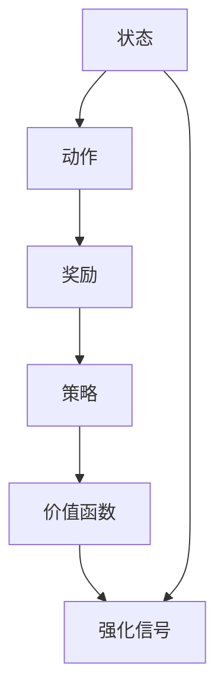
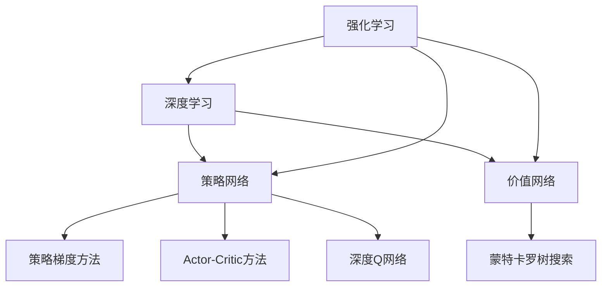

                 

# 深度强化学习 (Deep Reinforcement Learning) 原理与代码实例讲解

> 关键词：强化学习,深度学习,策略网络,价值网络,策略梯度方法,Actor-Critic方法,深度Q网络,蒙特卡罗树搜索

## 1. 背景介绍

### 1.1 问题由来
深度强化学习（Deep Reinforcement Learning, DRL）是一种结合深度学习和强化学习的混合学习范式，主要用于解决序列决策问题，目标是构建智能体能够在复杂环境中通过交互学习，获取最优行为策略。近年来，DRL在机器人控制、自动驾驶、游戏AI、金融交易等领域展现出强大的应用潜力。

然而，DRL算法的理论基础相对薄弱，实际应用中面临着许多技术难题，如探索与利用冲突、动作空间维度高、模型训练不稳定等。因此，系统梳理DRL的核心概念和实现细节，以及提供实际的代码实例，对推动DRL的应用和普及具有重要意义。

### 1.2 问题核心关键点
DRL的核心在于智能体通过与环境交互，利用已有的经验和反馈信息，学习并优化行为策略。具体来说，DRL包括以下几个关键要素：

1. 状态(state)：描述当前环境的状态，为智能体提供决策依据。
2. 动作(action)：智能体采取的具体行动，影响后续环境状态的变化。
3. 奖励(reward)：环境对智能体动作的反馈，用于指导智能体调整策略。
4. 策略(policy)：智能体选择动作的概率分布，反映智能体的决策倾向。
5. 价值函数(value function)：评估当前状态或动作的价值，辅助优化策略。
6. 强化信号(reinforcement signal)：奖励信号与价值函数的组合，指导智能体学习最优策略。

这些核心概念之间的逻辑关系可以通过以下Mermaid流程图来展示：



这个流程图展示了大语言模型的核心概念及其之间的关系：

1. 智能体根据当前状态，选择动作。
2. 环境给出动作的奖励。
3. 智能体根据奖励更新策略。
4. 策略指导智能体后续选择动作。
5. 价值函数对状态或动作进行评估，辅助决策。
6. 强化信号引导智能体学习最优策略。

这些核心概念共同构成了DRL的学习框架，使得智能体能够在复杂环境中通过不断试错，学习并优化行为策略。

## 2. 核心概念与联系

### 2.1 核心概念概述

为了更好地理解DRL的核心算法原理，本节将介绍几个密切相关的核心概念：

- 强化学习(Reinforcement Learning, RL)：一种通过试错学习最优策略的学习范式。智能体通过与环境的交互，根据奖励反馈不断调整策略，以最大化预期奖励总和。
- 深度学习(Deep Learning, DL)：一种通过多层神经网络模拟复杂非线性映射的技术。通过引入深度神经网络，DRL能够处理更高维度的动作空间和更复杂的环境状态。
- 策略网络(Policy Network)：用于确定智能体在给定状态下采取动作的概率分布的神经网络。
- 价值网络(Value Network)：用于评估当前状态或动作价值的神经网络。
- 策略梯度方法(Strategy Gradient Methods)：基于策略导数的优化算法，通过梯度上升或下降来更新策略参数。
- Actor-Critic方法：结合策略网络和价值网络，利用价值函数的反馈信息优化策略，避免直接优化策略带来的高方差问题。
- 深度Q网络(Deep Q-Network, DQN)：一种基于Q-learning算法的DRL方法，通过近似Q函数的方式学习最优策略。
- 蒙特卡罗树搜索(Monte Carlo Tree Search, MCTS)：一种通过模拟搜索树来优化策略的方法，适用于具有明确搜索空间的决策问题。

这些核心概念之间的逻辑关系可以通过以下Mermaid流程图来展示：



这个流程图展示了大语言模型的核心概念及其之间的关系：

1. 强化学习结合深度学习，实现复杂的决策过程。
2. 策略网络和价值网络分别用于确定智能体的决策概率和状态或动作的价值评估。
3. 策略梯度方法和Actor-Critic方法用于优化策略，避免直接优化策略带来的高方差问题。
4. 深度Q网络和蒙特卡罗树搜索分别用于通过近似和搜索的方式学习最优策略。

这些概念共同构成了DRL的学习框架，使得智能体能够在复杂环境中通过不断试错，学习并优化行为策略。

## 3. 核心算法原理 & 具体操作步骤
### 3.1 算法原理概述

DRL的核心思想是，通过与环境的交互，智能体利用已有的经验和反馈信息，学习并优化行为策略，以最大化预期奖励总和。具体来说，DRL的学习过程包括状态观察、动作选择、奖励反馈和策略更新四个步骤。

- 状态观察：智能体感知当前环境的状态，为后续决策提供依据。
- 动作选择：智能体根据当前状态，选择一种动作并执行。
- 奖励反馈：环境根据智能体的动作给出奖励，用于指导智能体调整策略。
- 策略更新：智能体利用奖励反馈和价值函数的评估信息，调整策略，以进一步优化行为决策。

DRL的目标是找到最优策略 $\pi^*$，使得智能体在任意状态下采取的动作都能最大化预期的累积奖励。即求解：

$$
\pi^* = \mathop{\arg\max}_{\pi} \mathbb{E}_{s,a \sim \pi}[R(s,a)]
$$

其中 $\pi$ 表示策略，$R(s,a)$ 表示在状态 $s$ 下采取动作 $a$ 的奖励。

### 3.2 算法步骤详解

DRL的算法步骤主要包括以下几个关键步骤：

**Step 1: 定义状态和动作空间**

- 定义状态空间 $\mathcal{S}$，描述环境的当前状态。例如，在Atari游戏中，状态可以表示为当前屏幕像素的数值表示。
- 定义动作空间 $\mathcal{A}$，表示智能体可以选择的具体动作。例如，在Atari游戏中，动作可以是向左、向右、向上、向下等方向移动。

**Step 2: 设计奖励函数**

- 设计奖励函数 $R(s,a)$，用于评估智能体在状态 $s$ 下采取动作 $a$ 的奖励。奖励函数应该尽可能简单，易于优化，并且能够提供有效的反馈信号，引导智能体学习最优策略。

**Step 3: 设计策略**

- 设计策略 $\pi(a|s)$，表示在状态 $s$ 下选择动作 $a$ 的概率分布。策略函数可以是一个神经网络，通过输入状态 $s$ 输出概率分布。

**Step 4: 设计价值函数**

- 设计价值函数 $V(s)$ 或 $Q(s,a)$，用于评估当前状态或动作的价值。价值函数可以是一个神经网络，通过输入状态或状态-动作对，输出一个标量值。

**Step 5: 设计优化算法**

- 设计优化算法，如策略梯度方法、Actor-Critic方法、深度Q网络等，用于最小化策略与价值函数的误差。常见的优化算法包括梯度下降、Adam、RMSprop等。

**Step 6: 执行训练**

- 将训练集数据分批次输入模型，前向传播计算损失函数。
- 反向传播计算参数梯度，根据设定的优化算法和学习率更新模型参数。
- 周期性在测试集上评估模型性能，根据性能指标决定是否触发 Early Stopping。
- 重复上述步骤直到满足预设的迭代轮数或 Early Stopping 条件。

**Step 7: 执行推理**

- 使用微调后的模型对新样本进行推理预测，集成到实际的应用系统中。

以上是DRL的一般流程。在实际应用中，还需要针对具体问题对算法进行优化设计，如改进训练目标函数，引入更多的正则化技术，搜索最优的超参数组合等，以进一步提升模型性能。

### 3.3 算法优缺点

DRL相对于传统强化学习方法，具有以下优点：

1. 处理高维度动作空间。通过引入深度神经网络，DRL能够处理高维度动作空间，例如机器人控制、游戏AI等。
2. 利用先验知识。DRL可以通过预训练、迁移学习等方式，利用先验知识进行任务适应，加速学习过程。
3. 自适应性强。DRL能够在不断变化的环境中自适应调整策略，适应新的任务和场景。
4. 可扩展性强。DRL可以应用到多个领域，如自动驾驶、医疗诊断、金融交易等。

同时，DRL也存在一些局限性：

1. 训练时间较长。由于DRL需要大量样本进行学习，训练时间往往较长，需要较强的计算资源。
2. 稳定性问题。DRL模型在训练过程中容易受到过拟合、泛化能力差等问题的影响。
3. 模型复杂度高。DRL模型通常较为复杂，需要大量的计算资源和存储空间。
4. 可解释性差。DRL模型的决策过程通常缺乏可解释性，难以对其推理逻辑进行分析和调试。

尽管存在这些局限性，但就目前而言，DRL仍然是最具潜力的学习范式之一。未来相关研究的重点在于如何进一步降低DRL对计算资源的依赖，提高模型的稳定性和可解释性，同时兼顾实际应用的需求。

### 3.4 算法应用领域

DRL已经在多个领域展现了强大的应用前景，例如：

- 自动驾驶：通过与环境交互，智能体学习最优驾驶策略，实现自动驾驶。
- 机器人控制：通过与物理环境交互，智能体学习最优动作策略，实现自主移动和操作。
- 游戏AI：通过与游戏环境交互，智能体学习最优游戏策略，实现游戏胜利。
- 金融交易：通过与市场环境交互，智能体学习最优交易策略，实现高收益和低风险。
- 医疗诊断：通过与医疗数据交互，智能体学习最优诊断策略，实现快速准确诊断。

除了这些经典应用外，DRL还被创新性地应用到更多场景中，如无人机控制、供应链优化、资源管理等，为各行各业带来新的智能化解决方案。随着DRL算法的不断进步，相信其应用范围将进一步扩大，为智能社会的建设提供新的动力。

## 4. 数学模型和公式 & 详细讲解  
### 4.1 数学模型构建

本节将使用数学语言对DRL的核心算法原理进行更加严格的刻画。

记智能体当前状态为 $s_t$，动作为 $a_t$，奖励为 $r_t$，策略为 $\pi(a|s)$，价值函数为 $V(s)$。DRL的目标是找到最优策略 $\pi^*$，使得智能体在任意状态下采取的动作都能最大化预期的累积奖励。

假设智能体在一个固定长度的马尔可夫决策过程中，采取一系列动作并观察一系列状态，最终达到终止状态 $s_T$，获得的总奖励为 $R_{1:T} = \sum_{t=1}^T r_t$。则DRL的目标可以表示为：

$$
\pi^* = \mathop{\arg\max}_{\pi} \mathbb{E}_{s,a \sim \pi}[R_{1:T}]
$$

其中 $\pi$ 表示策略，$R_{1:T}$ 表示在固定长度的马尔可夫决策过程中，智能体采取的动作序列所获得的总奖励。

### 4.2 公式推导过程

以下我们以Q-learning算法为例，推导Q函数的更新公式。

假设智能体在状态 $s_t$ 下采取动作 $a_t$，获得的奖励为 $r_t$，后续状态为 $s_{t+1}$。则Q函数定义为：

$$
Q_{\theta}(s_t,a_t) = r_t + \gamma \max_{a'} Q_{\theta}(s_{t+1},a')
$$

其中 $\theta$ 为Q函数的参数，$\gamma$ 为折扣因子。Q函数表示在状态 $s_t$ 下采取动作 $a_t$ 的累积奖励。

Q-learning算法的核心思想是，通过最大化Q函数的期望值来优化策略。具体来说，Q-learning的优化目标可以表示为：

$$
\theta^* = \mathop{\arg\min}_{\theta} \mathbb{E}_{s,a \sim \pi}[Q_{\theta}(s,a) - (r + \gamma \max_{a'} Q_{\theta}(s',a'))^2]
$$

其中 $\theta$ 为Q函数的参数，$\pi$ 表示策略，$Q_{\theta}(s,a)$ 表示在状态 $s$ 下采取动作 $a$ 的Q值，$(s',a')$ 表示下一个状态和动作。

根据Q-learning算法，Q函数的更新公式为：

$$
Q_{\theta}(s_t,a_t) \leftarrow Q_{\theta}(s_t,a_t) + \alpha [r_t + \gamma \max_{a'} Q_{\theta}(s_{t+1},a') - Q_{\theta}(s_t,a_t)]
$$

其中 $\alpha$ 为学习率，表示每次更新Q函数的步长。

在得到Q函数的更新公式后，即可带入参数更新公式，完成模型的迭代优化。重复上述过程直至收敛，最终得到适应当前任务的最优Q函数。

## 5. 项目实践：代码实例和详细解释说明
### 5.1 开发环境搭建

在进行DRL项目实践前，我们需要准备好开发环境。以下是使用Python进行TensorFlow开发的环境配置流程：

1. 安装Anaconda：从官网下载并安装Anaconda，用于创建独立的Python环境。

2. 创建并激活虚拟环境：
```bash
conda create -n drl-env python=3.8 
conda activate drl-env
```

3. 安装TensorFlow：根据CUDA版本，从官网获取对应的安装命令。例如：
```bash
conda install tensorflow==2.6
```

4. 安装各类工具包：
```bash
pip install numpy pandas scikit-learn matplotlib tqdm jupyter notebook ipython
```

完成上述步骤后，即可在`drl-env`环境中开始DRL实践。

### 5.2 源代码详细实现

下面我们以DQN算法在Atari游戏环境中的应用为例，给出使用TensorFlow进行DRL代码实现。

首先，定义DQN算法的核心类：

```python
import tensorflow as tf
import numpy as np

class DQN:
    def __init__(self, state_dim, action_dim, learning_rate=0.001, replay_memory_size=2000, batch_size=32, epsilon=0.1, epsilon_decay=0.995, epsilon_min=0.01):
        self.state_dim = state_dim
        self.action_dim = action_dim
        self.learning_rate = learning_rate
        self.replay_memory_size = replay_memory_size
        self.batch_size = batch_size
        self.epsilon = epsilon
        self.epsilon_decay = epsilon_decay
        self.epsilon_min = epsilon_min
        self.optimizer = tf.keras.optimizers.Adam(learning_rate=self.learning_rate)
        self.model = self._build_model()
        self.target_model = self._build_model()
        self.target_model.set_weights(self.model.get_weights())
        self.memory = []

    def _build_model(self):
        model = tf.keras.Sequential([
            tf.keras.layers.Dense(256, input_dim=self.state_dim, activation='relu'),
            tf.keras.layers.Dense(256, activation='relu'),
            tf.keras.layers.Dense(self.action_dim, activation='linear')
        ])
        return model

    def act(self, state):
        if np.random.rand() < self.epsilon:
            return np.random.randint(0, self.action_dim)
        else:
            return np.argmax(self.model.predict(state))

    def update(self, state, action, reward, next_state, done):
        self.memory.append((state, action, reward, next_state, done))
        if len(self.memory) > self.replay_memory_size:
            self.memory.pop(0)

        if len(self.memory) < self.replay_memory_size:
            return

        minibatch = np.random.choice(len(self.memory), size=self.batch_size, replace=False)
        minibatch_state = np.array([self.memory[i][0] for i in minibatch])
        minibatch_reward = np.array([self.memory[i][3] for i in minibatch])
        minibatch_next_state = np.array([self.memory[i][1] for i in minibatch])
        minibatch_done = np.array([self.memory[i][4] for i in minibatch])

        target = self.target_model.predict(minibatch_state)
        target[np.arange(self.batch_size), minibatch_reward] = minibatch_reward + self.gamma * np.amax(self.target_model.predict(minibatch_next_state), axis=1)
        target[np.arange(self.batch_size), minibatch_done] = minibatch_reward
        target -= self.learning_rate * self.model.predict(minibatch_state)

        self.model.fit(minibatch_state, target, verbose=0)

    def learn(self, state):
        action = self.act(state)
        next_state, reward, done = self.env.step(action)
        self.update(state, action, reward, next_state, done)
        state = next_state
```

然后，定义训练函数：

```python
import gym

env = gym.make('CartPole-v1')
state_dim = env.observation_space.shape[0]
action_dim = env.action_space.n
dqn = DQN(state_dim, action_dim)

num_episodes = 1000
gamma = 0.95
num_steps_per_episode = 1000
epsilon = 1.0
epsilon_decay = 0.99
epsilon_min = 0.01

for episode in range(num_episodes):
    state = env.reset()
    total_reward = 0
    for step in range(num_steps_per_episode):
        env.render()
        action = dqn.act(state)
        next_state, reward, done, _ = env.step(action)
        total_reward += reward
        dqn.update(state, action, reward, next_state, done)
        state = next_state
        if done:
            print(f"Episode {episode+1}, Reward: {total_reward}, Steps: {step}")
            break
```

最后，启动训练流程：

```python
dqn = DQN(state_dim, action_dim)
env = gym.make('CartPole-v1')
num_episodes = 1000
gamma = 0.95
num_steps_per_episode = 1000
epsilon = 1.0
epsilon_decay = 0.99
epsilon_min = 0.01

for episode in range(num_episodes):
    state = env.reset()
    total_reward = 0
    for step in range(num_steps_per_episode):
        env.render()
        action = dqn.act(state)
        next_state, reward, done, _ = env.step(action)
        total_reward += reward
        dqn.update(state, action, reward, next_state, done)
        state = next_state
        if done:
            print(f"Episode {episode+1}, Reward: {total_reward}, Steps: {step}")
            break
```

以上就是使用TensorFlow对DQN算法在CartPole环境中进行训练的完整代码实现。可以看到，得益于TensorFlow的强大封装，我们可以用相对简洁的代码完成DQN算法的实现。

### 5.3 代码解读与分析

让我们再详细解读一下关键代码的实现细节：

**DQN类**：
- `__init__`方法：初始化DQN算法的核心参数，如状态维度、动作维度、学习率、记忆容量等。
- `_build_model`方法：定义DQN算法的神经网络模型，用于预测Q值。
- `act`方法：根据当前状态和epsilon策略，选择动作。
- `update`方法：更新模型参数，采用经验回放算法更新Q值。
- `learn`方法：定义整个训练流程，通过与环境交互，逐步优化Q值。

**训练函数**：
- 使用 Gym 环境库，创建并初始化训练环境。
- 定义 DQN 算法的核心参数，如状态维度、动作维度、学习率、折扣因子等。
- 循环执行训练过程，每轮训练固定步骤，直到训练结束。
- 在每个训练步骤中，观察当前状态，选择动作，并更新模型参数。

**训练流程**：
- 初始化 DQN 算法和训练环境。
- 定义训练的轮数、折扣因子、epsilon 策略等。
- 循环进行训练，每轮训练固定步骤。
- 在每个训练步骤中，观察当前状态，选择动作，并更新模型参数。
- 输出每轮训练的奖励和步数。

可以看到，TensorFlow配合Gym环境库使得DQN算法的实现变得简洁高效。开发者可以将更多精力放在算法改进和模型优化上，而不必过多关注底层实现细节。

当然，工业级的系统实现还需考虑更多因素，如模型的保存和部署、超参数的自动搜索、更灵活的任务适配层等。但核心的DQN范式基本与此类似。

## 6. 实际应用场景
### 6.1 自动驾驶

DRL在自动驾驶领域具有广泛的应用前景。自动驾驶系统需要处理高维度动作空间和实时变化的环境，DRL通过与环境的交互，能够自动学习最优驾驶策略，实现自动驾驶。

在技术实现上，可以采集汽车的位置、速度、传感器数据等信息，将车辆与环境的交互过程转化为强化学习问题。DRL智能体根据实时状态，选择加速度、转向等动作，以最大化目标函数（如避障、到达终点等）。通过在模拟环境中训练，DRL智能体能够学习到最优的驾驶策略，并在实际测试中验证其性能。

### 6.2 机器人控制

DRL在机器人控制领域也有着重要的应用。机器人通常具有高维度动作空间，如臂关节的旋转角度、步进电机的转速等。DRL通过与物理环境交互，能够自动学习最优动作策略，实现自主移动和操作。

在技术实现上，可以采集机器人的关节角度、传感器数据等信息，将机器人的操作转化为强化学习问题。DRL智能体根据实时状态，选择不同的动作组合，以最大化目标函数（如抓取目标、避障等）。通过在模拟环境中训练，DRL智能体能够学习到最优的动作策略，并在实际测试中验证其性能。

### 6.3 游戏AI

DRL在游戏AI领域展示了强大的应用能力。游戏AI需要处理高维度动作空间和复杂的环境状态，DRL通过与游戏环境的交互，能够自动学习最优游戏策略，实现游戏胜利。

在技术实现上，可以将游戏环境转化为强化学习问题。DRL智能体根据实时状态，选择不同的动作组合，以最大化目标函数（如得分、通关等）。通过在模拟环境中训练，DRL智能体能够学习到最优的游戏策略，并在实际测试中验证其性能。

### 6.4 金融交易

DRL在金融交易领域也有着重要的应用。金融交易需要处理高维度动作空间和实时变化的市场数据，DRL通过与市场环境交互，能够自动学习最优交易策略，实现高收益和低风险。

在技术实现上，可以采集市场数据、交易历史等信息，将交易过程转化为强化学习问题。DRL智能体根据实时市场数据，选择不同的交易动作，以最大化目标函数（如收益、风险等）。通过在模拟环境中训练，DRL智能体能够学习到最优的交易策略，并在实际测试中验证其性能。

### 6.5 未来应用展望

随着DRL算法的不断进步，其在多个领域的应用前景将进一步拓展，为智能社会的建设提供新的动力。

在智慧医疗领域，DRL智能体可以通过与医疗数据交互，学习最优诊断和治疗策略，提高医疗服务的智能化水平。

在智能教育领域，DRL可以用于个性化的学习推荐，根据学生的学习情况和反馈，自动调整教学内容和进度。

在智慧城市治理中，DRL可以用于城市交通管理、环境监测等环节，提高城市管理的自动化和智能化水平。

此外，在企业生产、社会治理、文娱传媒等众多领域，DRL的应用也将不断涌现，为各行各业带来新的智能化解决方案。相信随着DRL算法的不断成熟，其在多个领域的应用将进一步扩展，为智能社会的建设提供新的动力。

## 7. 工具和资源推荐
### 7.1 学习资源推荐

为了帮助开发者系统掌握DRL的核心概念和实现细节，这里推荐一些优质的学习资源：

1. 《强化学习》系列博文：由大模型技术专家撰写，深入浅出地介绍了强化学习的基本概念和经典算法。

2. 《深度强化学习》课程：斯坦福大学开设的深度学习课程，涵盖了深度强化学习的基本概念和算法，适合入门学习。

3. 《深度学习与强化学习》书籍：深度学习和强化学习的经典教材，全面介绍了深度强化学习的理论和实践。

4. OpenAI Gym：一个用于强化学习环境开发的开源库，提供了多种游戏和模拟环境的接口，方便进行算法验证和测试。

5. DeepMind代码库：DeepMind的代码库，包含多个DRL算法的实现，是学习和研究DRL的重要资源。

通过对这些资源的学习实践，相信你一定能够快速掌握DRL的精髓，并用于解决实际的强化学习问题。
###  7.2 开发工具推荐

高效的开发离不开优秀的工具支持。以下是几款用于DRL开发的常用工具：

1. TensorFlow：由Google主导开发的开源深度学习框架，支持DRL算法的实现，并提供了丰富的优化器和训练工具。

2. PyTorch：由Facebook主导开发的开源深度学习框架，支持DRL算法的实现，并提供了灵活的神经网络实现。

3. OpenAI Gym：一个用于强化学习环境开发的开源库，提供了多种游戏和模拟环境的接口，方便进行算法验证和测试。

4. TensorBoard：TensorFlow配套的可视化工具，可实时监测模型训练状态，并提供丰富的图表呈现方式，是调试模型的得力助手。

5. Weights & Biases：模型训练的实验跟踪工具，可以记录和可视化模型训练过程中的各项指标，方便对比和调优。

6. Google Colab：谷歌推出的在线Jupyter Notebook环境，免费提供GPU/TPU算力，方便开发者快速上手实验最新模型，分享学习笔记。

合理利用这些工具，可以显著提升DRL任务的开发效率，加快创新迭代的步伐。

### 7.3 相关论文推荐

DRL的发展源于学界的持续研究。以下是几篇奠基性的相关论文，推荐阅读：

1. Q-learning：Watkins和Hassan于1989年提出的Q-learning算法，是DRL的奠基性算法。

2. DeepMind的AlphaGo：DeepMind开发的AlphaGo程序，通过结合DRL和蒙特卡罗树搜索，在围棋等复杂游戏中取得世界级成绩。

3. 深度Q网络：Bengio等人于2006年提出的深度Q网络，将深度神经网络引入Q-learning算法，解决了Q-learning在大规模动作空间上的问题。

4. 强化学习与深度学习结合的最新进展：近年来，诸多论文展示了DRL在复杂决策任务上的应用，如AlphaZero、Gato等。

这些论文代表了大语言模型微调技术的发展脉络。通过学习这些前沿成果，可以帮助研究者把握学科前进方向，激发更多的创新灵感。

## 8. 总结：未来发展趋势与挑战

### 8.1 总结

本文对DRL的核心概念和实现细节进行了全面系统的介绍。首先阐述了DRL在自动驾驶、机器人控制、游戏AI等领域的广泛应用，明确了DRL在处理复杂决策问题中的重要地位。其次，从原理到实践，详细讲解了DRL的数学模型和算法步骤，给出了DRL算法在CartPole环境中的应用代码实例。同时，本文还探讨了DRL在智慧医疗、智能教育、智慧城市等多个领域的应用前景，展示了DRL技术的巨大潜力。

通过本文的系统梳理，可以看到，DRL正在成为解决复杂决策问题的重要范式，为智能技术的发展提供了新的方向。DRL通过与环境的交互，自动学习最优决策策略，能够在高维度动作空间和复杂环境中取得显著效果。未来，随着DRL算法的不断进步，其在更多领域的应用将进一步拓展，为智能社会的建设提供新的动力。

### 8.2 未来发展趋势

展望未来，DRL技术将呈现以下几个发展趋势：

1. 模型规模持续增大。随着算力成本的下降和数据规模的扩张，DRL模型的参数量还将持续增长。超大规模DRL模型蕴含的丰富决策知识，有望支持更加复杂多变的决策过程。

2. 优化算法不断进步。DRL的优化算法也将不断进步，如Policy Gradient Methods、Actor-Critic Methods等，将进一步提升DRL的训练效率和模型性能。

3. 多模态决策崛起。DRL可以融合视觉、语音、文本等多种模态数据，提升决策的全面性和鲁棒性。

4. 模型通用性增强。经过海量数据的预训练和多领域任务的微调，DRL模型将具备更强的常识推理和跨领域迁移能力，逐步迈向通用人工智能(AGI)的目标。

5. 自适应性增强。DRL模型能够在不断变化的环境中自适应调整策略，适应新的任务和场景。

以上趋势凸显了DRL技术的广阔前景。这些方向的探索发展，必将进一步提升DRL系统的性能和应用范围，为智能社会的建设提供新的动力。

### 8.3 面临的挑战

尽管DRL已经取得了瞩目成就，但在迈向更加智能化、普适化应用的过程中，它仍面临着诸多挑战：

1. 训练时间较长。DRL算法需要大量样本进行学习，训练时间往往较长，需要较强的计算资源。

2. 稳定性问题。DRL模型在训练过程中容易受到过拟合、泛化能力差等问题的影响。

3. 模型复杂度高。DRL模型通常较为复杂，需要大量的计算资源和存储空间。

4. 可解释性差。DRL模型的决策过程通常缺乏可解释性，难以对其推理逻辑进行分析和调试。

5. 安全性问题。DRL模型可能存在安全隐患，如对抗攻击、决策失误等，需要进一步加强模型安全性和鲁棒性。

尽管存在这些挑战，但就目前而言，DRL仍然是最具潜力的学习范式之一。未来相关研究的重点在于如何进一步降低DRL对计算资源的依赖，提高模型的稳定性和可解释性，同时兼顾实际应用的需求。

### 8.4 研究展望

面对DRL面临的这些挑战，未来的研究需要在以下几个方面寻求新的突破：

1. 探索无监督和半监督DRL方法。摆脱对大规模标注数据的依赖，利用自监督学习、主动学习等无监督和半监督范式，最大限度利用非结构化数据，实现更加灵活高效的DRL。

2. 研究参数高效和计算高效的DRL范式。开发更加参数高效的DRL方法，在固定大部分预训练参数的同时，只更新极少量的任务相关参数。同时优化DRL模型的计算图，减少前向传播和反向传播的资源消耗，实现更加轻量级、实时性的部署。

3. 引入更多先验知识。将符号化的先验知识，如知识图谱、逻辑规则等，与神经网络模型进行巧妙融合，引导DRL过程学习更准确、合理的决策策略。同时加强不同模态数据的整合，实现视觉、语音、文本等多模态信息与决策的协同建模。

4. 纳入伦理道德约束。在DRL训练目标中引入伦理导向的评估指标，过滤和惩罚有害的决策输出，确保决策符合人类价值观和伦理道德。

这些研究方向的探索，必将引领DRL技术迈向更高的台阶，为构建安全、可靠、可解释、可控的智能系统铺平道路。面向未来，DRL技术还需要与其他人工智能技术进行更深入的融合，如知识表示、因果推理、强化学习等，多路径协同发力，共同推动智能技术的发展。

## 9. 附录：常见问题与解答

**Q1：DRL是否适用于所有决策问题？**

A: DRL适用于大多数决策问题，特别是高维度动作空间和复杂环境的情况。但对于一些简单问题，如线性回归、逻辑回归等，传统机器学习算法可能更为适合。

**Q2：如何选择DRL的优化算法？**

A: DRL的优化算法包括Policy Gradient Methods、Actor-Critic Methods、Q-Learning等。选择优化算法需要考虑问题类型、动作空间维度、计算资源等因素。一般而言，复杂动作空间可以使用Actor-Critic Methods，简单动作空间可以使用Q-Learning。

**Q3：DRL训练过程中如何防止过拟合？**

A: DRL训练过程中容易受到过拟合的影响，可以通过以下方法防止：
1. 数据增强：增加训练集的多样性，减少过拟合。
2. 正则化：使用L2正则化、Dropout等技术，防止模型过度拟合。
3. 提前停止：在验证集上监测模型性能，一旦性能下降，提前停止训练。

**Q4：DRL模型在部署时需要注意哪些问题？**

A: DRL模型在部署时需要注意以下问题：
1. 模型裁剪：去除不必要的层和参数，减小模型尺寸，加快推理速度。
2. 量化加速：将浮点模型转为定点模型，压缩存储空间，提高计算效率。
3. 服务化封装：将模型封装为标准化服务接口，便于集成调用。
4. 监控告警：实时采集系统指标，设置异常告警阈值，确保服务稳定性。

通过合理解决这些问题，可以显著提升DRL模型的部署效率和实际应用效果。

**Q5：DRL在实际应用中面临哪些挑战？**

A: DRL在实际应用中面临以下挑战：
1. 训练时间较长。DRL算法需要大量样本进行学习，训练时间往往较长，需要较强的计算资源。
2. 稳定性问题。DRL模型在训练过程中容易受到过拟合、泛化能力差等问题的影响。
3. 模型复杂度高。DRL模型通常较为复杂，需要大量的计算资源和存储空间。
4. 可解释性差。DRL模型的决策过程通常缺乏可解释性，难以对其推理逻辑进行分析和调试。
5. 安全性问题。DRL模型可能存在安全隐患，如对抗攻击、决策失误等，需要进一步加强模型安全性和鲁棒性。

正视DRL面临的这些挑战，积极应对并寻求突破，将是大语言模型微调走向成熟的必由之路。相信随着学界和产业界的共同努力，这些挑战终将一一被克服，DRL必将在构建安全、可靠、可解释、可控的智能系统铺平道路。总之，DRL需要开发者根据具体任务，不断迭代和优化模型、数据和算法，方能得到理想的效果。

---

作者：禅与计算机程序设计艺术 / Zen and the Art of Computer Programming

