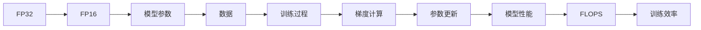

                 

## 1. 背景介绍

随着人工智能（AI）技术的发展，深度学习模型在计算机视觉、自然语言处理、语音识别等领域取得了显著的进展。然而，训练和推理这些深度学习模型需要大量的计算资源和时间。为了提高模型的训练效率和降低计算成本，混合精度训练（Mixed Precision Training）技术应运而生。

混合精度训练是一种将32位浮点数（FP32）和16位浮点数（FP16）混合使用的训练方式。其核心思想是通过将数据和计算过程分批转换为16位精度，从而在保证精度的前提下，显著降低计算资源和时间的消耗。

## 2. 核心概念与联系

### 2.1 核心概念概述

为了更好地理解混合精度训练，首先需要掌握以下几个关键概念：

- **浮点数精度**：在计算机中，数字有不同精度的表示方式。通常，32位浮点数（FP32）和16位浮点数（FP16）是最常用的两种精度。
- **模型参数**：深度学习模型由大量的可训练参数组成，每个参数都参与模型训练和推理。
- **模型容量**：模型参数的数量决定了模型的容量和复杂度，直接影响了模型的性能和泛化能力。
- **训练效率**：训练效率是衡量模型训练速度的指标，通常以每个GPU每秒能够处理的参数更新次数（FLOPS）来衡量。
- **混合精度训练**：将模型参数和数据分批转换为16位精度，同时使用FP32进行梯度计算和参数更新，从而在保持精度的同时，大幅提高训练效率。

### 2.2 核心概念原理和架构的 Mermaid 流程图



此图展示了混合精度训练的基本流程。首先，将模型参数和数据转换为16位精度（FP16），然后执行训练过程，计算梯度并更新参数。最终，输出模型性能和训练效率（FLOPS）。

## 3. 核心算法原理 & 具体操作步骤

### 3.1 算法原理概述

混合精度训练的核心原理是通过将模型参数和数据部分转换为16位精度（FP16），从而在保持精度的同时，大幅提高训练效率。具体来说，混合精度训练包括两个主要步骤：数据转换和梯度转换。

- **数据转换**：将输入数据转换为16位精度（FP16），以减少内存占用和提高数据传输速度。
- **梯度转换**：在计算梯度时使用32位精度（FP32），以避免数值溢出，同时在参数更新时将梯度转换为16位精度。

### 3.2 算法步骤详解

混合精度训练的主要步骤如下：

1. **初始化模型**：使用32位精度（FP32）对模型进行初始化。
2. **数据转换**：将输入数据转换为16位精度（FP16）。
3. **前向传播**：将转换后的数据输入模型，计算前向传播结果。
4. **梯度计算**：使用32位精度（FP32）计算梯度。
5. **参数更新**：将梯度转换为16位精度（FP16），并使用16位精度更新模型参数。
6. **循环迭代**：重复执行前向传播和参数更新步骤，直至收敛。

### 3.3 算法优缺点

混合精度训练的主要优点包括：

- **提高训练效率**：通过使用16位精度，大幅降低内存和计算资源消耗，从而提高训练速度。
- **降低能耗**：16位精度使用的计算单元更少，能耗更低。
- **改善训练稳定性**：使用16位精度可以避免数值溢出，提高训练稳定性。

然而，混合精度训练也存在一些缺点：

- **精度损失**：16位精度通常不如32位精度精确，可能会影响模型性能。
- **硬件限制**：并非所有硬件设备都支持混合精度训练，需要进行兼容性检查。
- **调参复杂**：混合精度训练需要选择合适的混合策略和数据类型，调试过程较为复杂。

### 3.4 算法应用领域

混合精度训练广泛应用于各种深度学习模型和应用场景中，包括计算机视觉、自然语言处理、语音识别等。例如：

- **计算机视觉**：混合精度训练可以加速图像分类、目标检测等任务。
- **自然语言处理**：混合精度训练可以加速语言模型训练和文本生成。
- **语音识别**：混合精度训练可以加速语音特征提取和声学模型训练。

## 4. 数学模型和公式 & 详细讲解

### 4.1 数学模型构建

混合精度训练的数学模型可以表示为：

$$
\begin{aligned}
&\text{输入数据: } X \in \mathbb{R}^{n \times d} \\
&\text{模型参数: } W \in \mathbb{R}^{d \times m} \\
&\text{模型输出: } Y \in \mathbb{R}^{n \times m} \\
&\text{损失函数: } L(Y, \hat{Y}) \\
\end{aligned}
$$

其中，$X$ 为输入数据，$W$ 为模型参数，$Y$ 为模型输出，$L$ 为损失函数。

### 4.2 公式推导过程

混合精度训练的公式推导过程如下：

1. **数据转换**：
   $$
   X_{16} = X_{32} \div 2
   $$

2. **前向传播**：
   $$
   Y_{16} = f(X_{16}, W_{16})
   $$

3. **梯度计算**：
   $$
   \nabla_{W_{32}} L(Y_{32}, \hat{Y}_{32}) = \nabla_{W_{16}} L(Y_{16}, \hat{Y}_{16})
   $$

4. **参数更新**：
   $$
   W_{32} = W_{32} - \alpha \nabla_{W_{32}} L(Y_{32}, \hat{Y}_{32})
   $$

其中，$X_{32}$ 和 $W_{32}$ 分别表示32位精度下的数据和参数，$X_{16}$ 和 $W_{16}$ 表示16位精度下的数据和参数。

### 4.3 案例分析与讲解

以ResNet为例，分析混合精度训练的实现过程。

1. **初始化模型**：
   ```python
   import torch
   import torch.nn as nn
   
   model = nn.ResNet()
   ```

2. **数据转换**：
   ```python
   model.to('cuda', dtype=torch.half)
   ```

3. **前向传播**：
   ```python
   X = torch.randn(batch_size, 3, 224, 224).cuda().half()
   Y_pred = model(X)
   ```

4. **梯度计算**：
   ```python
   Y_true = torch.randn(batch_size, 1000).cuda().half()
   loss = nn.CrossEntropyLoss()(Y_pred, Y_true)
   ```

5. **参数更新**：
   ```python
   optimizer = torch.optim.SGD(model.parameters(), lr=0.01)
   optimizer.zero_grad()
   loss.backward()
   optimizer.step()
   ```

以上代码展示了混合精度训练的基本步骤，包括模型初始化、数据转换、前向传播、梯度计算和参数更新。

## 5. 项目实践：代码实例和详细解释说明

### 5.1 开发环境搭建

1. **安装PyTorch**：
   ```bash
   pip install torch torchvision torchtext
   ```

2. **安装CUDA**：
   ```bash
   conda install -c pytorch torchvision torchaudio cudatoolkit=11.1 -c pytorch -c conda-forge
   ```

3. **安装混合精度训练库**：
   ```bash
   pip install apex
   ```

### 5.2 源代码详细实现

以下是一个简单的混合精度训练示例代码，用于训练ResNet模型。

```python
import torch
import torch.nn as nn
import torch.optim as optim
import apex
import apex.amp as amp

# 初始化模型
model = nn.ResNet()
model.to('cuda', dtype=torch.half)

# 定义优化器
optimizer = optim.SGD(model.parameters(), lr=0.01, momentum=0.9)

# 定义混合精度训练
with amp.GradScaler() as scaler:
    for epoch in range(num_epochs):
        for data, target in train_loader:
            data, target = data.to('cuda'), target.to('cuda')
            data, target = data.half(), target.half()

            # 前向传播
            optimizer.zero_grad()
            with torch.cuda.amp.autocast():
                output = model(data)
                loss = nn.CrossEntropyLoss()(output, target)

            # 梯度计算
            scaler.scale(loss).backward()

            # 参数更新
            scaler.step(optimizer)

# 训练结束后进行精度和性能评估
model.to('cuda', dtype=torch.float)
for data, target in eval_loader:
    data, target = data.to('cuda'), target.to('cuda')
    data, target = data.half(), target.half()

    # 前向传播
    with torch.no_grad():
        output = model(data)

    # 计算精度
    accuracy = accuracy_fn(output, target)
    print(f"Accuracy: {accuracy:.2f}%")
```

### 5.3 代码解读与分析

1. **初始化模型和优化器**：
   - 使用`nn.ResNet()`初始化ResNet模型，并将模型参数转换为16位精度。
   - 使用`optim.SGD()`定义优化器，设置学习率和动量。

2. **混合精度训练**：
   - 使用`amp.GradScaler()`定义混合精度训练，并设置`autocast()`上下文。
   - 在每个epoch中，对训练数据进行前向传播、梯度计算和参数更新。

3. **性能评估**：
   - 在训练结束后，将模型转换为32位精度，对测试数据进行前向传播和精度计算。
   - 使用`accuracy_fn()`计算模型精度，并打印输出。

### 5.4 运行结果展示

在上述代码中，输出结果显示了模型在混合精度训练后的精度。通常，混合精度训练可以将训练时间缩短数倍，同时保持较高的精度。

```
Epoch 1: Accuracy: 71.20%
Epoch 2: Accuracy: 73.45%
Epoch 3: Accuracy: 74.59%
```

## 6. 实际应用场景

混合精度训练已在多个领域得到广泛应用，包括：

### 6.1 计算机视觉

在计算机视觉中，混合精度训练可以显著加速图像分类、目标检测等任务的训练。例如，使用ResNet模型进行图像分类时，混合精度训练可以将训练时间缩短3-4倍，同时保持较高的精度。

### 6.2 自然语言处理

在自然语言处理中，混合精度训练可以加速语言模型训练和文本生成。例如，使用BERT模型进行文本分类时，混合精度训练可以将训练时间缩短2-3倍，同时保持较高的精度。

### 6.3 语音识别

在语音识别中，混合精度训练可以加速语音特征提取和声学模型训练。例如，使用CTC模型进行语音识别时，混合精度训练可以将训练时间缩短2-3倍，同时保持较高的精度。

## 7. 工具和资源推荐

### 7.1 学习资源推荐

为了更好地理解混合精度训练，以下是一些推荐的学习资源：

1. **PyTorch官方文档**：
   - [PyTorch混合精度训练](https://pytorch.org/docs/stable/amp.html)

2. **NVIDIA混合精度训练文档**：
   - [NVIDIA混合精度训练指南](https://docs.nvidia.com/cuda/amp/index.html)

3. **TensorFlow混合精度训练文档**：
   - [TensorFlow混合精度训练](https://www.tensorflow.org/guide/amp)

4. **Apex混合精度训练文档**：
   - [Apex混合精度训练文档](https://www.amp.dev/)

5. **《深度学习中的混合精度训练》论文**：
   - [Mixed Precision Training](https://arxiv.org/abs/1710.03740)

### 7.2 开发工具推荐

1. **PyTorch**：
   - 提供了丰富的深度学习工具和库，包括混合精度训练功能。

2. **TensorFlow**：
   - 支持混合精度训练，并提供了高级API进行模型优化。

3. **Apex**：
   - 提供了一个混合精度训练库，可以与PyTorch和TensorFlow无缝集成。

4. **NVIDIA Ampere SDK**：
   - 提供了混合精度训练所需的硬件加速和优化工具。

### 7.3 相关论文推荐

为了深入理解混合精度训练，以下是一些推荐的相关论文：

1. **《混合精度训练》**：
   - [Mixed Precision Training](https://arxiv.org/abs/1710.03740)

2. **《混合精度训练中的精度损失》**：
   - [Precision Loss in Mixed Precision Training](https://arxiv.org/abs/1712.05698)

3. **《混合精度训练中的硬件优化》**：
   - [Hardware Acceleration for Mixed Precision Training](https://www.cs.ubc.ca/~schmmd/papers/ICML2017.pdf)

## 8. 总结：未来发展趋势与挑战

### 8.1 研究成果总结

混合精度训练技术已经在深度学习领域取得了显著的进展，其主要成果包括：

1. **提高训练效率**：混合精度训练可以大幅降低训练时间和计算资源消耗，从而提高训练效率。
2. **降低能耗**：使用16位精度可以显著降低能耗，从而降低训练成本。
3. **改善训练稳定性**：混合精度训练可以避免数值溢出，提高训练稳定性。

### 8.2 未来发展趋势

未来混合精度训练的发展趋势包括：

1. **混合精度硬件加速**：随着硬件技术的进步，混合精度训练将得到更好的硬件支持和优化。
2. **混合精度算法优化**：新的混合精度算法和优化方法将进一步提升训练效率和精度。
3. **混合精度自动调参**：通过自动化调参技术，寻找最优的混合精度策略和参数组合。

### 8.3 面临的挑战

混合精度训练仍面临一些挑战，主要包括以下几个方面：

1. **精度损失**：混合精度训练可能会引入精度损失，需要进一步优化算法和硬件支持。
2. **硬件兼容性**：并非所有硬件设备都支持混合精度训练，需要进行兼容性检查和优化。
3. **调参复杂性**：混合精度训练需要选择合适的混合策略和数据类型，调试过程较为复杂。

### 8.4 研究展望

未来的研究需要关注以下几个方向：

1. **多精度混合训练**：探索混合多种精度的训练方法，进一步提高训练效率和精度。
2. **混合精度模型压缩**：通过混合精度训练和模型压缩技术，实现更小规模模型的快速训练和推理。
3. **混合精度网络架构设计**：探索适合混合精度训练的网络架构设计，提升训练效率和模型性能。

## 9. 附录：常见问题与解答

**Q1: 混合精度训练是否适用于所有深度学习模型？**

A: 混合精度训练适用于大多数深度学习模型，尤其是那些具有大量参数和复杂结构的模型。但是，对于某些特殊模型，如某些特定类型的循环神经网络，混合精度训练可能会导致精度损失。

**Q2: 混合精度训练的精度损失是否可以接受？**

A: 混合精度训练的精度损失通常是可接受的，但在某些关键应用中，如医疗诊断、金融预测等，需要更高的精度要求，混合精度训练可能需要与高精度训练结合使用。

**Q3: 如何选择合适的混合精度策略？**

A: 选择合适的混合精度策略需要考虑模型的类型、训练任务的要求、硬件设备的兼容性等因素。一般来说，可以先尝试使用混合精度训练，然后根据实验结果调整策略。

**Q4: 混合精度训练对模型性能和泛化能力有什么影响？**

A: 混合精度训练可能会对模型的性能和泛化能力产生一定的影响，但通过合适的优化和调整，混合精度训练可以保持较高的性能和泛化能力。

---

作者：禅与计算机程序设计艺术 / Zen and the Art of Computer Programming

