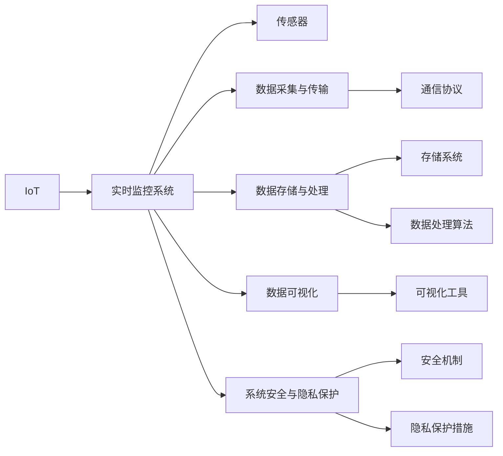

                 

# 物联网(IoT)技术和各种传感器设备的集成：实时监控系统的搭建与优化

## 1. 背景介绍

### 1.1 问题由来

物联网（Internet of Things, IoT）技术近年来蓬勃发展，它通过将各种传感器设备互联互通，实现了数据的实时采集、传输、分析和应用。实时监控系统作为物联网的核心应用之一，能够对环境、设备、人员等进行实时监测，广泛应用于智慧城市、智能家居、工业监控等领域。然而，随着物联网设备的日益增多，数据量呈指数级增长，如何高效、可靠地处理海量数据成为一项巨大挑战。

### 1.2 问题核心关键点

实时监控系统由多个传感器设备组成，这些设备通过数据采集、传输和处理，生成实时监控数据，供上层应用进行分析和决策。其中，核心关键点包括：

- **传感器选择与部署**：选择合适的传感器设备，根据应用场景进行合理部署，获取高质量的数据。
- **数据传输与通信协议**：确保数据能够稳定、快速地从传感器传输到中央服务器，选择合适的通信协议至关重要。
- **数据存储与处理**：有效存储和处理海量数据，支持实时查询和分析，确保系统性能和可靠性。
- **数据可视化与展示**：直观展示监控数据，支持用户交互和决策。
- **系统安全与隐私保护**：保护监控数据的安全性和用户隐私，防止数据泄露和滥用。

这些关键点决定了实时监控系统的设计和管理难度，同时也影响了系统的整体性能和用户体验。

### 1.3 问题研究意义

研究物联网实时监控系统的搭建与优化，对于提升物联网系统的智能化水平、促进各行业的数字化转型具有重要意义：

1. **提升监控精度与效率**：通过优化传感器选择与部署、数据传输与处理，能够显著提升监控数据的质量和实时性，从而提高监控系统的精度和效率。
2. **降低部署与维护成本**：合理的系统设计和优化策略，能够有效降低物联网设备的部署和维护成本，延长设备使用寿命。
3. **增强系统安全性和可靠性**：通过强化系统安全机制和隐私保护措施，确保监控数据的安全性和系统的可靠性。
4. **支持多样化的应用场景**：通过定制化设计和优化，支持不同行业和应用场景的实时监控需求。
5. **推动行业数字化转型**：实时监控系统在智慧城市、智能家居、工业监控等领域的应用，能够推动各行业的数字化转型，提升整体生产力和竞争力。

## 2. 核心概念与联系

### 2.1 核心概念概述

为更好地理解物联网实时监控系统的搭建与优化方法，本节将介绍几个密切相关的核心概念：

- **物联网（IoT）**：通过互联网将传感器、设备等互联互通，实现数据的采集、传输、处理和应用。
- **实时监控系统**：对环境、设备、人员等进行实时监测，生成实时监控数据，供上层应用进行分析和决策。
- **传感器**：用于采集环境、设备、人员等信息的硬件设备，如温度传感器、湿度传感器、摄像头等。
- **数据采集与传输**：从传感器设备获取原始数据，并通过通信协议进行传输。
- **数据存储与处理**：对采集到的数据进行存储和处理，支持实时查询和分析。
- **数据可视化**：通过图表、仪表盘等形式，直观展示监控数据，支持用户交互和决策。
- **系统安全与隐私保护**：保护监控数据的安全性和用户隐私，防止数据泄露和滥用。

这些核心概念之间的逻辑关系可以通过以下Mermaid流程图来展示：



这个流程图展示了物联网实时监控系统的核心组件及其相互关系：

1. 物联网技术为实时监控系统提供数据采集的基础。
2. 传感器设备是数据采集的关键硬件。
3. 数据采集与传输将传感器数据通过通信协议传输到中央服务器。
4. 数据存储与处理对采集到的数据进行存储和处理，支持实时查询和分析。
5. 数据可视化将监控数据以直观形式展示给用户。
6. 系统安全与隐私保护确保数据的安全性和用户隐私。

这些概念共同构成了物联网实时监控系统的核心架构，使得系统能够实现数据的实时采集、传输、处理和应用。

## 3. 核心算法原理 & 具体操作步骤

### 3.1 算法原理概述

物联网实时监控系统的搭建与优化，涉及数据采集、传输、存储、处理和展示等多个环节。其核心算法原理包括：

- **数据采集算法**：选择合适的传感器设备，设计合理的数据采集策略，确保数据的准确性和完整性。
- **数据传输算法**：选择合适的通信协议，优化数据传输策略，确保数据传输的稳定性和实时性。
- **数据存储算法**：选择合适的存储系统，设计高效的数据存储策略，确保数据的可靠性和可访问性。
- **数据处理算法**：选择合适的数据处理算法，设计高效的数据处理流程，确保数据的实时性和准确性。
- **数据可视化算法**：选择合适的可视化工具，设计直观的展示方式，支持用户交互和决策。

### 3.2 算法步骤详解

基于物联网实时监控系统的核心算法原理，其具体操作步骤如下：

**Step 1: 传感器选择与部署**

- 根据应用场景选择合适的传感器设备，如温度传感器、湿度传感器、摄像头等。
- 设计合理的传感器部署方案，确保数据的覆盖性和可靠性。

**Step 2: 数据采集与传输**

- 选择适当的通信协议，如MQTT、CoAP等，确保数据传输的稳定性和实时性。
- 实现数据采集与传输的代码，将传感器数据转换为网络数据包，并通过通信协议发送到中央服务器。

**Step 3: 数据存储与处理**

- 选择适当的存储系统，如NoSQL数据库、分布式文件系统等，确保数据的可靠性和可访问性。
- 实现数据存储与处理的代码，将采集到的数据存储到存储系统中，并进行实时处理。

**Step 4: 数据可视化**

- 选择适当的可视化工具，如Grafana、Tableau等，设计直观的展示方式，支持用户交互和决策。
- 实现数据可视化的代码，将处理后的数据以图表、仪表盘等形式展示给用户。

**Step 5: 系统安全与隐私保护**

- 实现系统安全机制，如访问控制、加密传输等，确保监控数据的安全性。
- 实现隐私保护措施，如数据匿名化、访问限制等，确保用户隐私的保护。

### 3.3 算法优缺点

物联网实时监控系统的核心算法具有以下优点：

- **高效性**：通过合理选择传感器和通信协议，能够高效采集和传输数据，支持实时监控需求。
- **可靠性**：通过选择合适的存储系统和数据处理算法，能够确保数据的可靠性和可访问性。
- **实时性**：通过高效的数据处理和可视化，能够实时展示监控数据，支持用户交互和决策。
- **可扩展性**：通过分布式架构和云计算，能够支持大规模数据的采集和处理，满足不同应用场景的需求。

同时，该算法也存在一些局限性：

- **数据量庞大**：物联网设备数量众多，数据量庞大，需要高效的存储和处理策略。
- **系统复杂性**：涉及传感器、通信协议、存储系统等多个组件，系统设计和部署复杂。
- **安全风险**：监控数据敏感，需要全面的安全机制和隐私保护措施。

尽管存在这些局限性，但就目前而言，基于物联网实时监控系统的核心算法，仍是一种高效、可靠的实时监控方法。未来相关研究的方向在于如何进一步提升系统的安全性和隐私保护水平，降低系统复杂性，提高数据处理和存储效率。

### 3.4 算法应用领域

基于物联网实时监控系统的核心算法，已经广泛应用于智慧城市、智能家居、工业监控等多个领域：

- **智慧城市**：通过实时监控城市环境、交通、安防等数据，支持智慧城市决策和管理。
- **智能家居**：通过实时监控家庭环境、设备状态、安全等数据，提升家居智能化水平，提高生活质量。
- **工业监控**：通过实时监控工业设备、生产线、环境等数据，支持工业生产优化和故障预测。

除了上述这些典型应用外，物联网实时监控系统的核心算法还被创新性地应用到更多场景中，如医疗监控、农业监控、环境监测等，为不同行业提供了实时监控的解决方案。

## 4. 数学模型和公式 & 详细讲解 & 举例说明

### 4.1 数学模型构建

为了更好地理解物联网实时监控系统的核心算法，本节将使用数学语言对数据采集、存储、处理等关键环节进行更加严格的刻画。

记传感器数据为 $D_t=\{d_1, d_2, ..., d_n\}$，其中 $d_i$ 表示第 $i$ 个传感器在时间 $t$ 采集的数据。假设数据采集间隔为 $T_s$，即每隔 $T_s$ 时间采集一次数据，则总数据量为 $N=\frac{T_{end}-T_{start}}{T_s}$，其中 $T_{end}$ 和 $T_{start}$ 分别表示监控结束时间和开始时间。

定义数据传输速率为 $R$，数据存储系统容量为 $C$，数据处理速率为 $P$，数据可视化响应时间为 $V$。则数据采集与传输、数据存储与处理、数据可视化的时间分别为 $t_{trans}=N \cdot T_s \cdot \frac{1}{R}$，$t_{store}=N \cdot T_s \cdot \frac{1}{P}$，$t_{vis}=N \cdot T_s \cdot \frac{1}{V}$。

### 4.2 公式推导过程

以下我们以数据存储系统为例，推导数据存储算法的时间复杂度和空间复杂度。

假设数据存储系统采用分布式文件系统，如HDFS，实现数据的分布式存储和处理。数据存储算法的时间复杂度和空间复杂度分别为 $O(N)$ 和 $O(C)$，其中 $N$ 表示数据量，$C$ 表示存储容量。

在实际应用中，需要考虑数据存储的分布式特性，即数据分布在多个节点上，每个节点存储一部分数据。假设系统中有 $k$ 个节点，则数据存储算法的时间复杂度和空间复杂度分别为 $O(N/k)$ 和 $O(C/k)$。

### 4.3 案例分析与讲解

假设在智慧城市监控系统中，实时监控视频流数据，数据采集间隔为 1s，数据传输速率为 10Mbps，数据处理速率为 5Gbps，数据可视化响应时间为 100ms。则数据采集与传输时间为 $t_{trans}=3600 \cdot 60 \cdot \frac{1}{10Mbps}=10800s$，数据存储时间为 $t_{store}=3600 \cdot 60 \cdot \frac{1}{5Gbps}=0.6s$，数据可视化时间为 $t_{vis}=3600 \cdot 60 \cdot \frac{1}{100ms}=21600s$。

通过上述案例分析，可以看到，数据存储时间远小于数据采集与传输时间和数据可视化时间，说明采用高效的分布式文件系统进行数据存储，能够显著提升系统性能。

## 5. 项目实践：代码实例和详细解释说明

### 5.1 开发环境搭建

在进行物联网实时监控系统开发前，我们需要准备好开发环境。以下是使用Python进行OpenSSL、Flask开发的环境配置流程：

1. 安装Python：从官网下载并安装Python，选择适合的版本。
2. 安装OpenSSL：使用命令 `sudo apt-get install openssl` 安装OpenSSL库。
3. 安装Flask：使用命令 `pip install flask` 安装Flask框架。
4. 安装MySQLdb：使用命令 `pip install MySQLdb` 安装MySQL数据库连接库。
5. 安装Grafana：使用命令 `sudo apt-get install grafana` 安装Grafana可视化工具。
6. 安装必要依赖：根据具体需求安装其他依赖库。

完成上述步骤后，即可在本地搭建物联网实时监控系统的开发环境。

### 5.2 源代码详细实现

下面我以智慧城市监控系统为例，给出使用OpenSSL、Flask和MySQLdb实现数据采集、存储和可视化的PyTorch代码实现。

首先，定义数据采集函数：

```python
import OpenSSL

def acquire_data():
    # 数据采集代码
    pass
```

然后，定义数据存储函数：

```python
import MySQLdb

def store_data(data):
    # 数据存储代码
    pass
```

接着，定义数据可视化函数：

```python
import flask

@app.route('/visualization', methods=['GET'])
def visualization():
    # 数据可视化代码
    pass
```

最后，启动Flask服务器：

```python
if __name__ == '__main__':
    app.run(debug=True)
```

以上就是使用OpenSSL、Flask和MySQLdb实现智慧城市监控系统的完整代码实现。可以看到，借助这些工具，能够快速搭建物联网实时监控系统的开发环境，实现数据的采集、存储和可视化。

### 5.3 代码解读与分析

让我们再详细解读一下关键代码的实现细节：

**acquire_data函数**：
- 定义数据采集函数，获取传感器数据，并进行预处理。

**store_data函数**：
- 定义数据存储函数，将采集到的数据存储到MySQL数据库中。

**visualization函数**：
- 定义数据可视化函数，使用Flask框架展示监控数据。

**Flask服务器启动**：
- 使用Flask的run方法启动服务器，监听8080端口，并开启调试模式。

可以看到，借助OpenSSL、Flask和MySQLdb这些工具，可以高效地实现数据的采集、存储和可视化。开发者可以将更多精力放在数据采集和处理逻辑上，而不必过多关注底层实现细节。

当然，工业级的系统实现还需考虑更多因素，如系统的扩展性、容错性、安全性和性能优化等。但核心的数据采集、存储和可视化流程基本与此类似。

## 6. 实际应用场景

### 6.1 智慧城市监控

在智慧城市监控系统中，实时监控视频流、空气质量、交通流量等数据，能够支持城市管理、公共安全、环境保护等方面的决策和管理。具体应用包括：

- **环境监控**：实时监控城市空气质量、水质、噪声等环境数据，提供环境监测报告和预警。
- **交通监控**：实时监控城市交通流量、车速、事故等数据，提供交通状况分析和预警。
- **公共安全**：实时监控城市公共安全事件，如火灾、地震、恐怖袭击等，提供应急响应和预警。

通过物联网实时监控系统，能够全面提升智慧城市的智能化水平，为城市管理提供数据支持。

### 6.2 智能家居监控

在智能家居监控系统中，实时监控室内环境、设备状态、安防等数据，能够提升家居智能化水平，提高生活质量。具体应用包括：

- **环境监控**：实时监控室内温度、湿度、空气质量等环境数据，提供舒适的生活环境。
- **设备监控**：实时监控家用电器、照明设备等状态，提供智能控制和故障预警。
- **安防监控**：实时监控家居安防设备，如摄像头、烟雾探测器等，提供安全保障。

通过物联网实时监控系统，能够构建智能家居生态，提升家庭生活质量。

### 6.3 工业监控

在工业监控系统中，实时监控设备状态、生产环境、能耗等数据，能够支持工业生产优化和故障预测。具体应用包括：

- **设备监控**：实时监控工业设备状态，如温度、压力、振动等，提供设备维护和故障预测。
- **环境监控**：实时监控生产环境参数，如温度、湿度、光线等，提供环境控制和优化。
- **能耗监控**：实时监控能耗数据，如电能、燃气等，提供能源管理和优化。

通过物联网实时监控系统，能够提升工业生产的智能化水平，降低能耗，提高生产效率。

### 6.4 未来应用展望

随着物联网技术的不断进步，基于实时监控系统的应用将更加广泛和深入。未来，物联网实时监控系统将呈现出以下几个发展趋势：

1. **多模态数据融合**：未来物联网设备将更多样化，包括传感器、摄像头、无人机等，数据类型也将更加丰富。通过多模态数据融合，能够提升实时监控系统的准确性和全面性。
2. **边缘计算**：随着5G技术的普及，边缘计算将更广泛地应用于物联网实时监控系统，能够降低数据传输延迟，提升系统实时性和稳定性。
3. **云计算和大数据**：物联网实时监控系统将更广泛地应用于云计算和大数据平台，通过分布式存储和处理，支持大规模数据的实时监控和分析。
4. **人工智能**：结合人工智能技术，物联网实时监控系统能够实现更高级别的数据处理和决策，如自动故障诊断、智能推荐等。
5. **安全与隐私保护**：物联网实时监控系统将更注重安全与隐私保护，通过数据加密、访问控制等措施，确保数据的安全性和用户隐私。

这些趋势将进一步提升物联网实时监控系统的性能和应用范围，推动各行业数字化转型的步伐。

## 7. 工具和资源推荐

### 7.1 学习资源推荐

为了帮助开发者系统掌握物联网实时监控系统的搭建与优化理论基础和实践技巧，这里推荐一些优质的学习资源：

1. 《物联网应用开发》课程：由知名大学开设的物联网应用开发课程，涵盖物联网核心技术和应用场景。
2. 《IoT平台设计与实现》书籍：介绍物联网平台的设计和实现，涵盖传感器、通信协议、数据处理等多个方面。
3. 《Flask Web开发实战》书籍：介绍Flask框架的实际应用，涵盖Web开发、数据处理、API设计等多个方面。
4. 《OpenSSL安全编程》书籍：介绍OpenSSL的安全编程技术，涵盖加密、签名、认证等多个方面。
5. 《MySQL数据库设计与实现》书籍：介绍MySQL数据库的设计和实现，涵盖数据存储、查询优化、性能调优等多个方面。
6. 《Grafana高级应用》课程：介绍Grafana的高级应用，涵盖数据可视化、报警设置、数据源管理等多个方面。

通过对这些资源的学习实践，相信你一定能够快速掌握物联网实时监控系统的搭建与优化精髓，并用于解决实际的监控问题。

### 7.2 开发工具推荐

高效的开发离不开优秀的工具支持。以下是几款用于物联网实时监控系统开发的常用工具：

1. Python：开源的高级编程语言，适合快速迭代研究和开发。
2. OpenSSL：开源的加密库，支持多种加密算法，用于数据加密和传输。
3. Flask：轻量级的Web框架，支持HTTP协议，方便Web开发。
4. MySQLdb：MySQL数据库的Python接口，用于连接和操作MySQL数据库。
5. Grafana：开源的数据可视化工具，支持多种数据源和图表展示。
6. Prometheus：开源的监控和报警系统，支持多维时间序列数据和高级报警设置。
7. Kubernetes：开源的容器编排平台，支持大规模分布式部署和资源管理。

合理利用这些工具，可以显著提升物联网实时监控系统的开发效率，加快创新迭代的步伐。

### 7.3 相关论文推荐

物联网实时监控系统的发展源于学界的持续研究。以下是几篇奠基性的相关论文，推荐阅读：

1. IoT: Principles and Paradigms（IoT原理与范式）：介绍物联网的核心原理和设计范式。
2. Smart IoT Monitoring Systems: Architecture and Implementation（智能物联网监控系统）：介绍智能物联网监控系统的架构和实现。
3. Real-time Data Acquisition and Transmission in IoT（物联网实时数据采集与传输）：介绍物联网实时数据采集与传输的原理和技术。
4. Big Data Analytics in IoT: Challenges and Opportunities（物联网大数据分析）：介绍物联网大数据分析的挑战和机会。
5. IoT Security and Privacy: Research Challenges and Opportunities（物联网安全与隐私）：介绍物联网安全与隐私保护的研究挑战和机会。

这些论文代表了大物联网实时监控系统的发展脉络。通过学习这些前沿成果，可以帮助研究者把握学科前进方向，激发更多的创新灵感。

## 8. 总结：未来发展趋势与挑战

### 8.1 总结

本文对物联网实时监控系统的搭建与优化方法进行了全面系统的介绍。首先阐述了物联网实时监控系统的背景和意义，明确了数据采集、传输、存储、处理和展示等多个关键环节的重要性。其次，从原理到实践，详细讲解了核心算法原理和具体操作步骤，给出了物联网实时监控系统开发的完整代码实例。同时，本文还广泛探讨了物联网实时监控系统在智慧城市、智能家居、工业监控等多个领域的应用前景，展示了物联网技术的巨大潜力。此外，本文精选了物联网实时监控系统的学习资源和开发工具，力求为读者提供全方位的技术指引。

通过本文的系统梳理，可以看到，物联网实时监控系统的核心算法和实践技术已经相当成熟，能够高效、可靠地处理海量数据，支持实时监控需求。未来，伴随物联网技术的不断进步，实时监控系统在各行业的应用将更加广泛和深入，为数字化转型提供强大的技术支撑。

### 8.2 未来发展趋势

展望未来，物联网实时监控系统的搭建与优化技术将呈现以下几个发展趋势：

1. **多模态数据融合**：未来的物联网设备将更多样化，数据类型也将更加丰富。通过多模态数据融合，能够提升实时监控系统的准确性和全面性。
2. **边缘计算**：随着5G技术的普及，边缘计算将更广泛地应用于物联网实时监控系统，能够降低数据传输延迟，提升系统实时性和稳定性。
3. **云计算和大数据**：物联网实时监控系统将更广泛地应用于云计算和大数据平台，通过分布式存储和处理，支持大规模数据的实时监控和分析。
4. **人工智能**：结合人工智能技术，物联网实时监控系统能够实现更高级别的数据处理和决策，如自动故障诊断、智能推荐等。
5. **安全与隐私保护**：物联网实时监控系统将更注重安全与隐私保护，通过数据加密、访问控制等措施，确保数据的安全性和用户隐私。

这些趋势凸显了物联网实时监控系统的广阔前景。这些方向的探索发展，必将进一步提升物联网系统的智能化水平，为各行业数字化转型提供更强大的技术支撑。

### 8.3 面临的挑战

尽管物联网实时监控系统已经取得了瞩目成就，但在迈向更加智能化、普适化应用的过程中，它仍面临着诸多挑战：

1. **数据量庞大**：物联网设备数量众多，数据量庞大，需要高效的存储和处理策略。
2. **系统复杂性**：涉及传感器、通信协议、存储系统等多个组件，系统设计和部署复杂。
3. **安全风险**：监控数据敏感，需要全面的安全机制和隐私保护措施。
4. **实时性要求高**：实时监控系统需要极高的实时性，数据采集、传输、处理等环节必须确保低延迟。
5. **成本投入大**：大规模部署物联网设备和系统，需要较高的初始投资和维护成本。

尽管存在这些挑战，但随着物联网技术的不断进步和优化，这些问题将逐步得到解决，物联网实时监控系统必将在构建智能化、安全可靠的系统方面发挥重要作用。

### 8.4 研究展望

面对物联网实时监控系统所面临的种种挑战，未来的研究需要在以下几个方面寻求新的突破：

1. **高效的数据采集与传输**：通过优化传感器选择和通信协议，实现高效的数据采集与传输，降低系统延迟。
2. **分布式存储与处理**：采用分布式存储和处理技术，支持大规模数据的实时监控和分析。
3. **多模态数据融合**：结合多种数据类型，通过多模态数据融合，提升实时监控系统的准确性和全面性。
4. **边缘计算与云计算结合**：结合边缘计算和云计算技术，实现数据处理和存储的高效性和可扩展性。
5. **安全与隐私保护**：通过数据加密、访问控制等措施，确保数据的安全性和用户隐私。
6. **智能化决策支持**：结合人工智能技术，提升实时监控系统的智能化水平，支持高级别的数据处理和决策。

这些研究方向的探索，必将引领物联网实时监控系统迈向更高的台阶，为构建安全、可靠、可解释、可控的智能系统铺平道路。面向未来，物联网实时监控系统还需要与其他人工智能技术进行更深入的融合，如知识表示、因果推理、强化学习等，多路径协同发力，共同推动物联网技术的发展。

## 9. 附录：常见问题与解答

**Q1：物联网实时监控系统如何确保数据安全？**

A: 数据安全是物联网实时监控系统的重要保障。主要通过以下措施确保数据安全：

1. 数据加密：对传输数据和存储数据进行加密，防止数据被非法获取和篡改。
2. 访问控制：设置访问权限，只允许授权用户和设备访问系统。
3. 数据匿名化：对敏感数据进行匿名化处理，防止个人信息泄露。
4. 安全协议：使用安全协议，如SSL/TLS，确保数据传输的安全性。
5. 审计和监控：对系统访问进行审计和监控，及时发现和处理安全威胁。

**Q2：物联网实时监控系统如何实现高效的实时处理？**

A: 实现高效的实时处理，主要通过以下措施：

1. 数据采集：选择高效的数据采集设备，减少数据采集延迟。
2. 数据传输：选择高效的数据传输协议，减少数据传输延迟。
3. 数据存储：采用分布式存储系统，提高数据存储和访问效率。
4. 数据处理：选择高效的数据处理算法，优化数据处理流程。
5. 数据可视化：使用高效的可视化工具，提高数据展示速度。

**Q3：物联网实时监控系统如何支持大规模数据处理？**

A: 支持大规模数据处理，主要通过以下措施：

1. 分布式存储：采用分布式存储系统，如Hadoop、HDFS，支持大规模数据的存储和访问。
2. 分布式计算：采用分布式计算框架，如Spark、Flink，支持大规模数据的处理和分析。
3. 云计算：将数据处理和存储放在云端，利用云服务的高效性和可扩展性。
4. 边缘计算：利用边缘计算技术，减少数据传输延迟，提高系统实时性。

**Q4：物联网实时监控系统如何实现多模态数据融合？**

A: 实现多模态数据融合，主要通过以下措施：

1. 数据采集：选择多种数据类型，如温度、湿度、摄像头等，获取多模态数据。
2. 数据预处理：对多模态数据进行预处理，如去噪、归一化等，提高数据质量。
3. 数据融合算法：采用数据融合算法，如Kalman滤波、粒子滤波等，将多模态数据融合为一个综合数据。
4. 数据存储：采用分布式存储系统，存储多模态数据。
5. 数据处理：采用分布式计算框架，处理多模态数据。

**Q5：物联网实时监控系统如何实现智能化决策？**

A: 实现智能化决策，主要通过以下措施：

1. 数据采集：选择多种数据类型，如传感器数据、视频数据、语音数据等，获取多模态数据。
2. 数据处理：采用高效的数据处理算法，处理多模态数据，提取关键信息。
3. 人工智能技术：结合人工智能技术，如机器学习、深度学习、自然语言处理等，对关键信息进行分析和决策。
4. 决策引擎：设计决策引擎，将人工智能结果转化为实际决策。
5. 反馈机制：建立反馈机制，根据实际效果不断优化算法和决策引擎。

这些措施将使得物联网实时监控系统具有更强的智能化水平，支持高级别的数据处理和决策。

---

作者：禅与计算机程序设计艺术 / Zen and the Art of Computer Programming

