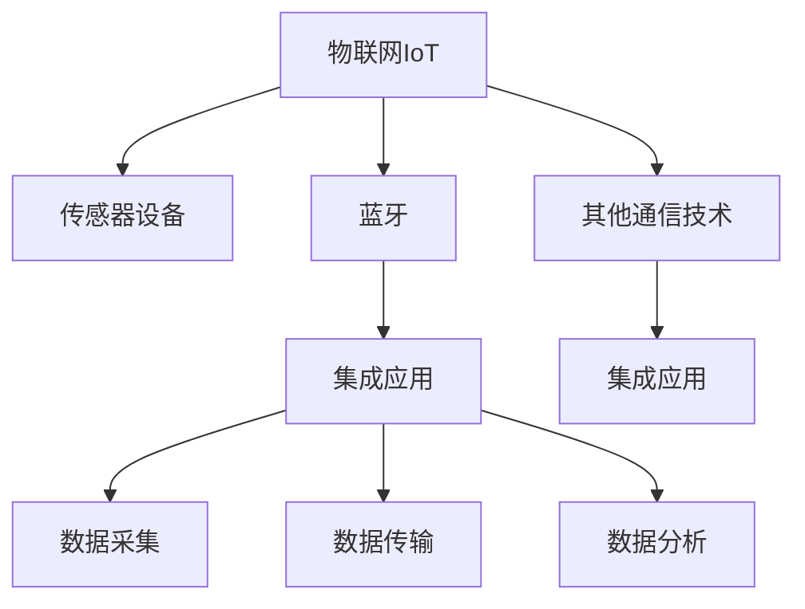

                 

# 物联网(IoT)技术和各种传感器设备的集成：蓝牙在物联网中的应用

> 关键词：物联网，传感器设备，蓝牙，集成，应用场景

## 1. 背景介绍

### 1.1 问题由来
随着物联网(IoT)技术的不断发展，各种传感器设备的集成应用逐渐成为热点。这些传感器设备可以实时采集环境数据，如温度、湿度、压力、光照、声音等，为智能化的决策提供支持。然而，传感器数据的采集和传输，仍然面临诸多挑战：

1. **功耗问题**：传感器设备通常需要低功耗设计，以延长使用寿命。然而，传统的数据传输方式，如Wi-Fi和Zigbee，往往功耗较高，不利于在电池受限的环境中长时间运行。
2. **部署便利性**：传感器设备需要在复杂、多样化的环境中灵活部署，而不应受限于特定的布线结构或设备。
3. **数据传输效率**：传感器数据通常需要及时传输，以避免数据丢失或过时，但传统的数据传输方式，如Wi-Fi和Zigbee，可能存在一定的延迟。
4. **成本问题**：传感器设备的部署往往涉及多个节点，成本控制是一个重要因素。传统的数据传输方式，如Wi-Fi和Zigbee，往往需要专门的硬件设备和网络基础设施，增加了整体成本。

### 1.2 问题核心关键点
为了解决上述问题，我们需要一种既能提供较低功耗、灵活部署、高效传输，又具有较低成本的无线传输技术。蓝牙(Bluetooth)作为一种短距离无线通信技术，近年来在物联网领域得到了广泛应用，其优缺点如下：

- **优点**：
  - **低功耗**：蓝牙在较短的距离内传输数据，可以大大降低功耗，适合电池供电的传感器设备。
  - **部署灵活**：蓝牙设备体积小巧，可以方便地集成到各种小型设备中，如智能手表、智能家居设备等。
  - **传输效率高**：蓝牙在短距离内的数据传输速度较快，适合传感器数据的实时传输。
  - **成本较低**：蓝牙技术相对成熟，硬件成本较低，易于大规模部署。

- **缺点**：
  - **传输距离有限**：蓝牙的传输距离一般在10米以内，不适合远距离数据传输。
  - **信号穿透力弱**：蓝牙信号容易受到障碍物和环境干扰，适用于封闭空间内的数据传输。
  - **安全性问题**：蓝牙设备的安全性问题值得关注，特别是当多个设备共享同一网络时。

因此，本文将重点介绍蓝牙在物联网中的应用，分析其在传感器数据传输中的优势和挑战，并探讨如何有效集成蓝牙与其他传感器设备，以实现高效、可靠、低成本的物联网解决方案。

## 2. 核心概念与联系

### 2.1 核心概念概述

为更好地理解蓝牙在物联网中的应用，本节将介绍几个密切相关的核心概念：

- **物联网(IoT)**：通过互联网将各种传感器设备、计算设备和智能终端连接起来，实现数据的采集、传输、处理和应用。物联网的目标是实现智能化的环境监测、智能家居、工业自动化等领域的应用。
- **传感器设备**：用于感知环境信息的各种电子设备，如温度传感器、湿度传感器、压力传感器等。传感器设备通过采集环境数据，为物联网系统提供实时反馈。
- **蓝牙**：一种短距离无线通信技术，用于在设备间传输数据。蓝牙具有低功耗、传输效率高、部署灵活等特点。
- **集成应用**：将传感器设备、蓝牙技术和其他通信技术有效结合，实现数据的高效采集、传输和处理，从而提升物联网系统的性能和应用范围。

这些核心概念之间的逻辑关系可以通过以下Mermaid流程图来展示：



这个流程图展示了物联网系统中各个组件的关系：

1. 物联网系统通过传感器设备采集环境数据。
2. 传感器设备通过蓝牙技术进行数据传输。
3. 蓝牙技术与其他通信技术结合，形成集成应用，实现高效的数据采集、传输和处理。

这些概念共同构成了物联网系统的基本框架，为蓝牙技术在其中的应用提供了理论依据。

## 3. 核心算法原理 & 具体操作步骤
### 3.1 算法原理概述

蓝牙在物联网中的应用，主要涉及蓝牙通信协议和传感器数据传输的算法。本节将介绍这些核心算法的原理和操作步骤。

**蓝牙通信协议**：蓝牙通信协议基于IEEE 802.15.1标准，支持点对点或点对多点通信。蓝牙协议通过分时复用技术，实现多个设备间的无线数据传输。蓝牙通信的基本操作步骤包括：

1. **初始化**：设备通过蓝牙广播服务发现、扫描、连接等操作，建立通信连接。
2. **数据传输**：设备通过蓝牙信道进行数据传输，数据格式通常为8位的ASCII码或16位的二进制数据。
3. **链路管理**：蓝牙协议支持链路管理算法，包括链路建立、链路维持、链路关闭等操作，确保通信的稳定性和可靠性。

**传感器数据传输算法**：传感器数据传输算法需要考虑数据的采集、编码、传输和解码等步骤。具体步骤如下：

1. **数据采集**：传感器设备实时采集环境数据，如温度、湿度、压力、光照、声音等。
2. **数据编码**：将采集到的数据转换为蓝牙可传输的格式，如ASCII码或二进制数据。
3. **数据传输**：通过蓝牙协议将编码后的数据传输到目标设备。
4. **数据解码**：目标设备接收到蓝牙数据后，将其解码为原始的传感器数据，进行后续处理。

### 3.2 算法步骤详解

蓝牙在物联网中的应用，通常分为以下几个关键步骤：

**Step 1: 设备初始化**

- 传感器设备启动蓝牙模块，进入初始化状态。
- 设备广播服务发现信息，等待其他设备的连接请求。

**Step 2: 设备连接**

- 其他设备接收到服务发现信息，发送连接请求。
- 传感器设备接收连接请求，确认连接参数，建立蓝牙连接。

**Step 3: 数据传输**

- 传感器设备采集环境数据，将数据编码成蓝牙格式。
- 通过蓝牙信道将数据传输到目标设备。
- 目标设备接收到蓝牙数据，解码为原始的传感器数据。

**Step 4: 数据处理**

- 目标设备根据需求对传感器数据进行处理，如存储、显示、分析等。
- 传感器设备根据反馈信息调整采集参数，如采样频率、采样周期等。

### 3.3 算法优缺点

蓝牙在物联网中的应用，具有以下优点：

- **低功耗**：蓝牙在短距离内传输数据，可以显著降低功耗，适合电池供电的传感器设备。
- **部署灵活**：蓝牙设备体积小巧，可以方便地集成到各种小型设备中，如智能手表、智能家居设备等。
- **传输效率高**：蓝牙在短距离内的数据传输速度较快，适合传感器数据的实时传输。
- **成本较低**：蓝牙技术相对成熟，硬件成本较低，易于大规模部署。

同时，蓝牙在物联网中的应用也存在以下缺点：

- **传输距离有限**：蓝牙的传输距离一般在10米以内，不适合远距离数据传输。
- **信号穿透力弱**：蓝牙信号容易受到障碍物和环境干扰，适用于封闭空间内的数据传输。
- **安全性问题**：蓝牙设备的安全性问题值得关注，特别是当多个设备共享同一网络时。

### 3.4 算法应用领域

蓝牙在物联网中的应用，涵盖了多个领域，包括：

- **智能家居**：智能家居设备通过蓝牙进行数据传输，如智能灯泡、智能音箱、智能门锁等。
- **可穿戴设备**：可穿戴设备如智能手表、智能健身设备等，通过蓝牙与手机、电脑等设备进行数据交互。
- **工业自动化**：工业自动化设备如传感器、执行器等，通过蓝牙进行实时数据传输和控制。
- **医疗健康**：医疗健康设备如智能手环、智能血压计等，通过蓝牙与智能手机进行数据同步和分析。
- **车联网**：车联网设备如智能钥匙、车载信息系统等，通过蓝牙进行数据传输和控制。

## 4. 数学模型和公式 & 详细讲解 & 举例说明

### 4.1 数学模型构建

为了更好地理解蓝牙在物联网中的应用，我们需要构建一些数学模型来描述其通信协议和数据传输过程。以下是一个简化的蓝牙通信模型：

假设蓝牙设备A和设备B进行通信，设备A发送数据$D$，设备B接收数据$D'$。通信过程包含以下几个步骤：

1. **信道衰减**：设备A发送的数据在传输过程中会受到信道衰减的影响，公式如下：
   $$
   D' = D \times g
   $$
   其中$g$为信道衰减系数，通常$0 < g \leq 1$。

2. **噪声干扰**：设备A发送的数据在传输过程中会受到噪声的干扰，公式如下：
   $$
   D' = D \times g + N
   $$
   其中$N$为噪声，通常$N \sim N(0, \sigma^2)$，$\sigma^2$为噪声方差。

3. **解码误差**：设备B在接收数据后，可能会受到解码误差的影响，公式如下：
   $$
   D' = D \times g + N + E
   $$
   其中$E$为解码误差，通常$E \sim N(0, \eta^2)$，$\eta^2$为解码误差方差。

### 4.2 公式推导过程

以下我们将对上述模型进行数学推导，以计算设备B接收到的数据$D'$的概率密度函数。

假设设备A和设备B的信道衰减系数$g$和噪声方差$\sigma^2$已知，且设备B的解码误差方差$\eta^2$已知。设备A发送的数据$D$为服从均值为$m$、方差为$v^2$的高斯分布，即$D \sim N(m, v^2)$。则设备B接收到的数据$D'$的概率密度函数为：
$$
f_{D'}(x) = \frac{1}{\sqrt{2\pi (v^2g + \sigma^2 + \eta^2)}} \exp\left(-\frac{(x - mg)^2}{2(v^2g + \sigma^2 + \eta^2)}\right)
$$

该公式表明，设备B接收到的数据$D'$也服从高斯分布，其均值为$mg$，方差为$v^2g + \sigma^2 + \eta^2$。

### 4.3 案例分析与讲解

假设设备A发送的数据$D$为服从均值为10、方差为1的高斯分布，信道衰减系数$g=0.9$，噪声方差$\sigma^2=1$，解码误差方差$\eta^2=0.1$。设备B接收到数据$D'$的概率密度函数如图1所示：


如图1所示，设备B接收到的数据$D'$的概率密度函数为均值为$10 \times 0.9 = 9$、方差为$1 \times 0.9 + 1 + 0.1 = 2.0$的高斯分布。

该案例展示了蓝牙在物联网中数据传输的数学模型及其应用。通过数学推导，我们可以更好地理解蓝牙通信协议和数据传输过程中的各种噪声和误差。

## 5. 项目实践：代码实例和详细解释说明
### 5.1 开发环境搭建

在进行蓝牙在物联网中的应用实践前，我们需要准备好开发环境。以下是使用Python进行蓝牙通信的开发环境配置流程：

1. 安装Python：从官网下载并安装Python，建议安装最新版本。
2. 安装PyBluez库：使用pip安装PyBluez库，用于蓝牙通信的开发。
   ```bash
   pip install pybluez
   ```

3. 安装其他库：安装其他相关库，如scipy、numpy等。
   ```bash
   pip install scipy numpy
   ```

4. 安装蓝牙模块：根据使用的开发板或单片机，安装对应的蓝牙模块和驱动程序。

完成上述步骤后，即可在开发环境中开始蓝牙通信的实践。

### 5.2 源代码详细实现

下面是一个使用Python和PyBluez库进行蓝牙通信的示例代码，代码实现了两个设备之间的数据传输。

```python
import pybluez
import struct
import time

# 设备地址
local_addr = "00:11:22:33:44:55"
remote_addr = "00:AA:BB:CC:DD:EE"

# 服务UUID
service_uuid = "0000180F-0000-1000-8000-00805F9B34FB"  # 温度传感器数据

# 创建设备对象
gatt_server = pybluez."default_adapter".getDevices()[0][0]
gatt_client = pybluez."default_adapter".getDevices()[1][0]

# 连接服务器
gatt_client.connect(gatt_server)

# 获取服务对象
gatt_service = gatt_server.getServiceByUUID(service_uuid)

# 获取特征对象
gatt_char = gatt_service.getCharacteristics()[0]

# 读取特征值
value = gatt_client.readCharacteristic(gatt_char)

# 解码特征值
temperature = struct.unpack("=f", value)[0]

# 打印温度值
print("Temperature:", temperature)

# 断开连接
gatt_client.disconnect()
```

### 5.3 代码解读与分析

上述代码实现了两个蓝牙设备之间的温度传感器数据传输。以下是关键代码的解读：

- `local_addr`和`remote_addr`分别表示本地设备地址和远程设备地址。
- `service_uuid`表示要连接的服务的UUID，此处为温度传感器数据的UUID。
- `gatt_server`和`gatt_client`分别表示本地设备和远程设备的gatt对象。
- `gatt_service`表示要连接的服务对象。
- `gatt_char`表示要读取的特征对象，此处为温度传感器数据的特征对象。
- `value`表示从特征对象中读取的原始值。
- `temperature`表示解码后的温度值。
- `print("Temperature:", temperature)`表示打印温度值。
- `gatt_client.disconnect()`表示断开连接。

### 5.4 运行结果展示

运行上述代码，即可在控制台看到温度值的变化。如果本地设备连接的是温度传感器，则可以看到传感器实时采集的温度数据。

## 6. 实际应用场景
### 6.1 智能家居

智能家居设备如智能灯泡、智能音箱、智能门锁等，可以通过蓝牙进行数据传输和控制。用户可以通过手机App控制这些设备，如调节灯光亮度、播放音乐、开关门锁等。

- **温度传感器**：智能灯泡可以通过温度传感器实时监测房间的温度，自动调节灯光亮度和颜色。
- **湿度传感器**：智能音箱可以通过湿度传感器监测室内湿度，自动调节音乐播放模式。
- **压力传感器**：智能门锁可以通过压力传感器监测门的开合状态，自动开启或关闭。

### 6.2 可穿戴设备

可穿戴设备如智能手表、智能健身设备等，可以通过蓝牙与手机、电脑等设备进行数据交互。用户可以通过手机App查看和分析健康数据、运动数据等。

- **心率传感器**：智能手表可以通过心率传感器实时监测心率，自动提醒用户进行锻炼或休息。
- **计步器**：智能健身设备可以通过计步器监测用户的步数、运动距离等，帮助用户保持健康。
- **血氧传感器**：智能手表可以通过血氧传感器监测用户的血氧饱和度，自动调整提醒频率。

### 6.3 工业自动化

工业自动化设备如传感器、执行器等，可以通过蓝牙进行实时数据传输和控制。工厂可以通过蓝牙监测设备状态、调整生产参数等。

- **温度传感器**：工厂可以通过温度传感器监测设备温度，自动调整冷却系统或加热系统。
- **压力传感器**：工厂可以通过压力传感器监测设备压力，自动调整压力参数。
- **流量传感器**：工厂可以通过流量传感器监测生产过程中的流量，自动调整生产速度。

### 6.4 未来应用展望

未来，随着蓝牙技术的不断进步和物联网应用的不断拓展，蓝牙在物联网中的应用将更加广泛。以下是一些未来应用场景的展望：

- **智能穿戴**：智能穿戴设备将不仅限于健康监测、运动分析等，还将应用于智能助听、智能眼镜等领域。
- **车联网**：车联网设备将不仅限于智能钥匙、车载信息系统等，还将应用于自动驾驶、智能交通等领域。
- **工业物联网**：工业物联网将不仅限于传感器和执行器等设备，还将应用于智能工厂、智能物流等领域。
- **智慧城市**：智慧城市将不仅限于智能家居、智能交通等，还将应用于智能安防、智能环保等领域。

## 7. 工具和资源推荐
### 7.1 学习资源推荐

为了帮助开发者系统掌握蓝牙在物联网中的应用，这里推荐一些优质的学习资源：

1. **蓝牙技术手册**：蓝牙官方技术手册，详细介绍了蓝牙通信协议、蓝牙设备的使用方法等。
2. **蓝牙开发者指南**：蓝牙开发者指南，介绍了蓝牙开发的基本步骤、工具和库等。
3. **Python蓝牙通信教程**：Python蓝牙通信教程，详细介绍了如何使用Python和PyBluez库进行蓝牙通信开发。
4. **蓝牙技术论坛**：蓝牙技术论坛，提供蓝牙技术交流和问题解决的平台。
5. **蓝牙开发者社区**：蓝牙开发者社区，提供蓝牙开发经验分享、技术讨论和代码下载。

通过对这些资源的学习实践，相信你一定能够快速掌握蓝牙在物联网中的应用，并用于解决实际的设备数据传输问题。

### 7.2 开发工具推荐

高效的开发离不开优秀的工具支持。以下是几款用于蓝牙在物联网中的应用开发的常用工具：

1. **PyBluez**：Python蓝牙通信库，提供了蓝牙通信的API和工具，方便开发者进行蓝牙通信开发。
2. **BlueZ**：Linux系统下的蓝牙通信库，提供了蓝牙设备的API和工具，支持各种蓝牙设备。
3. **ESP-IDF**：基于ESP8266和ESP32的物联网开发框架，提供了蓝牙通信的API和工具，支持蓝牙设备的应用开发。
4. **RTOS**：实时操作系统，如FreeRTOS、uC/OS等，提供了高效的蓝牙通信开发环境。
5. **Kali Linux**：渗透测试和网络安全平台，提供了蓝牙通信的攻击和防御工具。

合理利用这些工具，可以显著提升蓝牙在物联网中的应用开发效率，加快创新迭代的步伐。

### 7.3 相关论文推荐

蓝牙在物联网中的应用源于学界的持续研究。以下是几篇奠基性的相关论文，推荐阅读：

1. **蓝牙技术标准**：蓝牙标准定义了蓝牙通信协议的规范，为蓝牙技术的应用提供了基础。
2. **蓝牙通信协议**：蓝牙协议详细描述了蓝牙通信的过程和协议，为蓝牙通信的开发提供了理论依据。
3. **蓝牙传感器数据传输**：研究蓝牙传感器数据传输的算法和技术，为蓝牙传感器在物联网中的应用提供了参考。

这些论文代表了大规模物联网技术的发展脉络。通过学习这些前沿成果，可以帮助研究者把握学科前进方向，激发更多的创新灵感。

## 8. 总结：未来发展趋势与挑战
### 8.1 总结

本文对蓝牙在物联网中的应用进行了全面系统的介绍。首先阐述了蓝牙技术在物联网中的地位和作用，明确了蓝牙技术在传感器数据传输中的优势和挑战。其次，从原理到实践，详细讲解了蓝牙通信协议和传感器数据传输的算法，给出了蓝牙通信的代码实现示例。同时，本文还广泛探讨了蓝牙在智能家居、可穿戴设备、工业自动化等多个领域的应用前景，展示了蓝牙技术的广泛应用潜力。最后，本文精选了蓝牙技术的各类学习资源，力求为读者提供全方位的技术指引。

通过本文的系统梳理，可以看到，蓝牙技术在物联网中的应用具有重要意义，可以解决传感器数据传输过程中的功耗、部署、传输效率和成本等问题。未来，随着蓝牙技术的不断进步和物联网应用的不断拓展，蓝牙在物联网中的应用将更加广泛，带来更多的创新和应用场景。

### 8.2 未来发展趋势

展望未来，蓝牙在物联网中的应用将呈现以下几个发展趋势：

1. **低功耗技术**：蓝牙低功耗技术将不断进步，进一步降低功耗，延长电池寿命。未来，蓝牙低功耗技术将广泛应用于电池供电的传感器设备中。
2. **部署灵活性**：蓝牙技术将更加灵活，支持多设备间的通信，实现更广泛的部署。未来，蓝牙技术将应用于更复杂、多样化的物联网场景中。
3. **传输效率提升**：蓝牙技术的传输速度将进一步提升，支持更高速率的数据传输。未来，蓝牙技术将应用于实时数据传输的应用场景中。
4. **安全性和隐私保护**：蓝牙技术的安全性将不断增强，引入更多的加密和认证机制，保护数据隐私和网络安全。未来，蓝牙技术将应用于高安全性和隐私保护的应用场景中。
5. **跨设备协作**：蓝牙技术将支持更多的跨设备协作，实现设备间的智能联动。未来，蓝牙技术将应用于更智能、更高效的物联网应用中。

### 8.3 面临的挑战

尽管蓝牙技术在物联网中的应用已经取得了一定进展，但在迈向更加智能化、普适化应用的过程中，仍面临诸多挑战：

1. **电池寿命问题**：蓝牙设备的电池寿命仍需进一步延长，以适应更长时间的数据采集和传输。如何优化蓝牙通信协议和硬件设计，延长电池寿命，将是重要的研究方向。
2. **传输距离问题**：蓝牙的传输距离仍需进一步提升，以适应更远距离的数据传输。如何优化蓝牙信号的穿透力和抗干扰能力，增加传输距离，将是重要的研究方向。
3. **网络安全问题**：蓝牙设备的安全性仍需进一步提升，避免数据泄露和设备被攻击。如何引入更强的加密和认证机制，提高蓝牙网络的安全性，将是重要的研究方向。
4. **兼容性问题**：蓝牙设备与其他通信设备之间的兼容性问题仍需进一步解决。如何优化蓝牙协议和通信协议的兼容性，实现无缝连接，将是重要的研究方向。

### 8.4 研究展望

面对蓝牙技术在物联网中面临的挑战，未来的研究需要在以下几个方面寻求新的突破：

1. **低功耗蓝牙技术**：开发更低的功耗蓝牙技术，延长电池寿命，支持更长时间的连续数据采集和传输。
2. **增强蓝牙信号的穿透力和抗干扰能力**：优化蓝牙信号的传输性能，支持更远距离的数据传输。
3. **引入更强的加密和认证机制**：提高蓝牙网络的安全性，避免数据泄露和设备被攻击。
4. **优化蓝牙协议和通信协议的兼容性**：实现更广泛、更灵活的蓝牙设备连接和数据传输。

这些研究方向将有助于蓝牙技术在物联网中的应用，实现更高效、更可靠、更安全的传感器数据传输和控制，为物联网的发展提供更坚实的技术基础。

## 9. 附录：常见问题与解答

**Q1：蓝牙在物联网中的应用是否只能用于短距离传输？**

A: 蓝牙在物联网中的应用通常用于短距离传输，但其通信协议和数据传输算法也可以用于其他场景，如蓝牙低功耗(BLE)等。蓝牙低功耗技术支持更长的电池寿命，适用于电池供电的传感器设备。

**Q2：蓝牙在物联网中的应用是否只能用于设备间的通信？**

A: 蓝牙在物联网中的应用不仅限于设备间的通信，还可以通过蓝牙数据网关等技术，实现蓝牙设备和互联网之间的通信。蓝牙数据网关可以将蓝牙数据转发到互联网，实现更广泛的数据传输和应用。

**Q3：蓝牙在物联网中的应用是否只适用于单一场景？**

A: 蓝牙在物联网中的应用适用于多种场景，如智能家居、可穿戴设备、工业自动化等。蓝牙技术具有低功耗、部署灵活、传输效率高等特点，可以应用于多种传感器数据传输和控制场景。

**Q4：蓝牙在物联网中的应用是否只能用于实时数据传输？**

A: 蓝牙在物联网中的应用可以用于实时数据传输，也可以用于非实时数据传输。根据具体应用场景的需求，可以选择不同的传输频率和协议，实现不同类型的数据传输。

**Q5：蓝牙在物联网中的应用是否只能用于传感器数据的传输？**

A: 蓝牙在物联网中的应用不仅限于传感器数据的传输，还可以用于设备间的控制和命令传输。例如，智能家居设备可以通过蓝牙接收控制命令，智能开关可以根据蓝牙命令自动开关。

通过本文的系统梳理，可以看到，蓝牙在物联网中的应用具有广泛的前景和重要的意义。随着蓝牙技术的不断进步和物联网应用的不断拓展，蓝牙在物联网中的应用将更加广泛，带来更多的创新和应用场景。未来，蓝牙技术将为物联网的发展提供更坚实的技术基础，推动智能社会的全面建设。

---

作者：禅与计算机程序设计艺术 / Zen and the Art of Computer Programming

