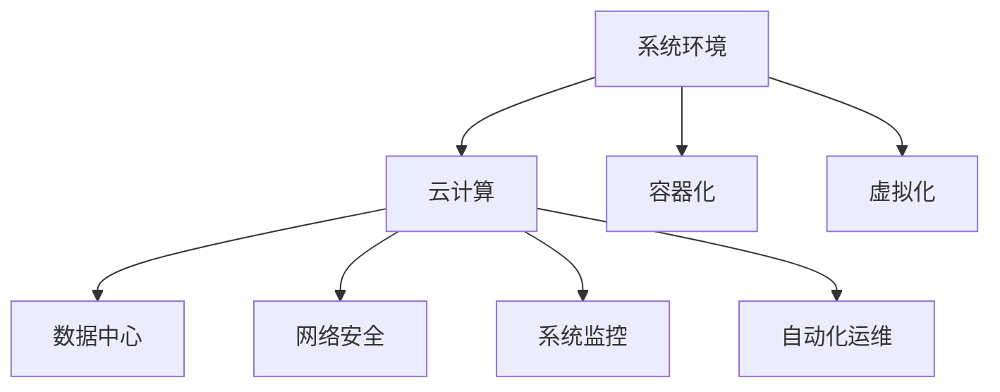

                 

# 环境 (Environment)

> 关键词：系统环境,云计算,容器化,虚拟化,数据中心,网络安全,系统监控,自动化运维

## 1. 背景介绍

在现代社会中，环境是一个至关重要的概念，涵盖了从物理空间到虚拟空间的方方面面。无论是在家庭、学校、办公室还是数据中心，环境对人类活动的效率和舒适度有着决定性的影响。在技术领域，环境的影响更加广泛和深入，从软件开发到云计算，从虚拟化到自动化运维，每一个环节都与环境密切相关。

### 1.1 环境在软件开发中的角色

在软件开发中，环境是程序员进行开发、测试和部署的必备条件。一个好的开发环境能够提供必要的工具、库和资源，确保开发者能够高效地进行代码编写、测试和调试。同时，环境还直接影响着软件的性能和稳定性，一个良好的开发环境可以大大提高软件的开发效率和质量。

### 1.2 环境在云计算中的应用

云计算技术的兴起彻底改变了软件开发的传统方式，环境成为了云计算中最为重要的资源之一。云计算平台提供了丰富的环境资源，包括虚拟机、容器、数据库、存储等，使得开发者可以更加灵活地进行应用开发和部署。

### 1.3 环境在虚拟化中的作用

虚拟化技术将物理资源转化为虚拟资源，使得一台物理服务器能够支持多个虚拟机，极大地提升了资源的利用率和灵活性。在虚拟化环境中，环境资源的分配和管理变得尤为重要，一个好的环境管理工具能够显著提高虚拟机的运行效率和稳定性。

### 1.4 环境在数据中心中的影响

数据中心是现代企业的重要基础设施，环境对数据中心的能效、安全、可靠性和灵活性有着直接的影响。良好的环境管理能够确保数据中心高效运转，提升业务连续性和灾难恢复能力。

## 2. 核心概念与联系

### 2.1 核心概念概述

要理解环境的重要性，首先需要理解几个核心概念：

- **系统环境(System Environment)**：是指软件运行时所需的软硬件资源集合，包括操作系统、硬件平台、网络配置、库文件等。
- **云计算(Cloud Computing)**：基于互联网的计算服务，提供按需使用的计算资源和环境，如虚拟机、存储、数据库等。
- **容器化(Containerization)**：一种打包软件的方法，使得应用程序及其依赖可以在任何环境中部署和运行。
- **虚拟化(Virtualization)**：通过软件将物理资源转化为虚拟资源，使得一台物理服务器支持多个虚拟机。
- **数据中心(Data Center)**：由多个服务器、存储设备和网络设备组成，提供可靠、高效的计算和存储服务。
- **网络安全(Network Security)**：保护环境资源免受恶意攻击和未授权访问，确保环境的安全性。
- **系统监控(System Monitoring)**：实时监控环境资源的使用情况，及时发现并解决问题，确保环境的高效稳定运行。
- **自动化运维(Automated Operations and Maintenance)**：通过自动化工具和脚本，简化运维操作，提高效率和准确性。

这些概念之间有着紧密的联系，共同构成了环境管理的完整框架。理解这些概念，能够帮助我们更好地进行环境设计和运维，确保系统的高效稳定运行。

### 2.2 核心概念原理和架构的 Mermaid 流程图



这个流程图展示了各个核心概念之间的关系，帮助我们理解环境管理的整体架构。

## 3. 核心算法原理 & 具体操作步骤

### 3.1 算法原理概述

环境管理的核心在于资源的分配和管理，以及系统的稳定性和安全性。以下是环境管理中常见的算法原理：

- **资源分配算法**：根据任务需求和资源可用性，合理分配资源，如CPU、内存、网络带宽等。常见的算法包括贪心算法、轮询算法、优先级算法等。
- **负载均衡算法**：通过将请求均匀分配到不同的服务器，避免单点故障和资源过载，提高系统的稳定性。常见的负载均衡算法包括轮询、哈希、权重等。
- **虚拟化管理算法**：在虚拟化环境中，需要合理分配虚拟机的资源，避免资源浪费和竞争。常见的算法包括虚拟内存分配、存储分配、网络分配等。
- **网络安全算法**：通过防火墙、入侵检测、加密等技术，保护环境资源免受恶意攻击和未授权访问。
- **系统监控算法**：实时监控环境资源的使用情况，及时发现并解决问题，确保环境的高效稳定运行。常见的算法包括阈值监控、异常检测、性能分析等。
- **自动化运维算法**：通过自动化工具和脚本，简化运维操作，提高效率和准确性。常见的算法包括配置管理、任务调度、日志管理等。

### 3.2 算法步骤详解

以下是一个完整的系统环境管理流程，展示了各个步骤的详细步骤：

1. **资源需求分析**：根据应用需求，分析所需资源种类和数量，确保资源分配合理。
2. **资源分配**：根据资源需求和可用性，使用资源分配算法，将资源分配给应用。
3. **负载均衡**：通过负载均衡算法，将请求均匀分配到不同的服务器，提高系统稳定性。
4. **虚拟化管理**：使用虚拟化管理算法，合理分配虚拟机的资源，避免资源浪费和竞争。
5. **网络安全**：通过网络安全算法，保护环境资源免受恶意攻击和未授权访问。
6. **系统监控**：使用系统监控算法，实时监控环境资源的使用情况，及时发现并解决问题。
7. **自动化运维**：通过自动化运维算法，简化运维操作，提高效率和准确性。

### 3.3 算法优缺点

环境管理的算法有着各自的优缺点，以下是几个主要的算法及其特点：

#### 3.3.1 资源分配算法

**优点**：
- 可以根据任务需求和资源可用性，合理分配资源，提高资源利用率。
- 算法简单易实现，容易维护。

**缺点**：
- 资源分配不均衡，容易导致资源浪费或不足。
- 算法无法考虑任务优先级，可能导致低优先级任务资源不足。

#### 3.3.2 负载均衡算法

**优点**：
- 可以避免单点故障和资源过载，提高系统稳定性。
- 算法简单易实现，容易维护。

**缺点**：
- 负载均衡算法无法考虑任务复杂度和资源需求，可能导致资源分配不合理。
- 负载均衡算法无法处理突发的资源请求，可能导致系统不稳定。

#### 3.3.3 虚拟化管理算法

**优点**：
- 可以在虚拟化环境中合理分配虚拟机的资源，避免资源浪费和竞争。
- 算法可以提高虚拟机的资源利用率，降低成本。

**缺点**：
- 虚拟化管理算法较为复杂，需要考虑虚拟机的迁移和资源管理。
- 虚拟化管理算法容易引发性能瓶颈，需要优化算法实现。

#### 3.3.4 网络安全算法

**优点**：
- 可以保护环境资源免受恶意攻击和未授权访问，保障环境的安全性。
- 算法简单易实现，容易维护。

**缺点**：
- 网络安全算法无法实时监控环境变化，可能导致安全漏洞。
- 网络安全算法需要消耗额外的计算资源，可能影响系统性能。

#### 3.3.5 系统监控算法

**优点**：
- 可以实时监控环境资源的使用情况，及时发现并解决问题，确保环境的高效稳定运行。
- 算法简单易实现，容易维护。

**缺点**：
- 系统监控算法可能产生大量的监控数据，需要消耗额外的计算资源。
- 系统监控算法无法预判潜在问题，可能无法及时发现并解决。

#### 3.3.6 自动化运维算法

**优点**：
- 可以简化运维操作，提高效率和准确性。
- 算法可以减少人为操作，降低错误率。

**缺点**：
- 自动化运维算法需要依赖自动化工具和脚本，可能存在工具和脚本实现的复杂性。
- 自动化运维算法可能无法处理复杂的网络环境，需要优化算法实现。

### 3.4 算法应用领域

环境管理的算法广泛应用于各个领域，以下是几个主要的应用领域：

- **云计算**：云计算平台需要高效的资源分配和负载均衡算法，保障服务的稳定性和可靠性。
- **虚拟化**：虚拟化环境需要合理分配虚拟机的资源，避免资源浪费和竞争。
- **数据中心**：数据中心需要高效的网络安全算法和系统监控算法，保障数据的安全性和可靠性。
- **自动化运维**：自动化运维算法可以显著提高运维效率，减少人为操作。
- **智能制造**：智能制造需要高效的网络安全算法和自动化运维算法，保障生产的稳定性和安全性。

## 4. 数学模型和公式 & 详细讲解 & 举例说明

### 4.1 数学模型构建

环境管理中的许多算法都可以用数学模型来描述。以下是几个常见的数学模型：

- **资源分配模型**：可以使用线性规划模型来描述资源分配问题，如：
  $$
  \begin{aligned}
  & \min \sum_{i=1}^n r_i \\
  & \text{subject to} \quad A\mathbf{x} = \mathbf{b} \\
  & \quad \mathbf{x} \geq \mathbf{0}
  \end{aligned}
  $$
  其中 $A$ 是系数矩阵，$\mathbf{x}$ 是变量向量，$\mathbf{b}$ 是常量向量。

- **负载均衡模型**：可以使用贪心算法来描述负载均衡问题，如：
  $$
  \text{for each request} \\
  \text{  find server with minimum load} \\
  \text{  assign request to server} \\
  \text{end for}
  $$

- **虚拟化管理模型**：可以使用动态规划算法来描述虚拟化管理问题，如：
  $$
  \begin{aligned}
  & \min \sum_{i=1}^m c_i \\
  & \text{subject to} \quad \sum_{j=1}^n x_{ij} \leq d_i \quad \forall i \\
  & \quad x_{ij} \geq 0 \quad \forall i,j
  \end{aligned}
  $$
  其中 $c_i$ 是第 $i$ 个虚拟机的成本，$d_i$ 是第 $i$ 个虚拟机的资源需求。

### 4.2 公式推导过程

以下是一个简单的资源分配问题的数学模型推导过程：

假设有一个工厂，有 $n$ 个任务和 $m$ 台机器，每个任务需要 $r_i$ 台机器，每个机器的租金为 $c_j$。目标是最小化租金成本，满足每个任务至少需要一台机器。

1. **建立数学模型**：
  $$
  \begin{aligned}
  & \min \sum_{j=1}^m c_j \sum_{i=1}^n x_{ij} \\
  & \text{subject to} \quad \sum_{j=1}^m x_{ij} \geq r_i \quad \forall i \\
  & \quad x_{ij} \geq 0 \quad \forall i,j
  \end{aligned}
  $$

2. **求解数学模型**：
  - 对于每个任务 $i$，选择一台机器 $j$，满足 $\sum_{k=1}^n x_{ik} \leq 1$。
  - 将问题转化为0-1整数规划问题，使用线性规划求解器进行求解。

3. **结果解释**：
  - 得到每台机器 $j$ 的分配任务数量 $x_{ij}$。
  - 计算每台机器的租金成本，得到最小化结果。

### 4.3 案例分析与讲解

假设一个企业需要部署一个Web应用，企业内部有多台服务器，每个服务器有不同的计算能力和存储容量。企业需要将请求分配给不同的服务器，以获得最佳的性能和成本效益。

1. **需求分析**：
  - 应用需要处理每秒10000次请求，每次请求需要1秒钟的计算时间。
  - 每个服务器可以处理5000次请求，每秒500MB的存储。

2. **资源分配**：
  - 将应用请求分配到4台服务器上，每台服务器处理2500次请求。
  - 使用轮询算法分配请求，确保负载均衡。

3. **虚拟化管理**：
  - 使用虚拟机管理工具，将每个服务器划分为多个虚拟机。
  - 每个虚拟机配置2台CPU和1GB内存，确保应用运行稳定。

4. **网络安全**：
  - 部署防火墙和入侵检测系统，确保网络安全。
  - 使用HTTPS协议，加密传输数据。

5. **系统监控**：
  - 使用系统监控工具，实时监控服务器和虚拟机的运行状态。
  - 设置阈值报警，及时发现异常情况。

6. **自动化运维**：
  - 使用自动化运维工具，自动部署应用，重启服务器。
  - 定期备份数据，确保数据安全。

## 5. 项目实践：代码实例和详细解释说明

### 5.1 开发环境搭建

在进行环境管理实践前，我们需要准备好开发环境。以下是使用Python进行Ansible开发的环境配置流程：

1. 安装Ansible：从官网下载并安装Ansible，用于自动化配置管理。

2. 创建并激活虚拟环境：
```bash
conda create -n ansible-env python=3.8 
conda activate ansible-env
```

3. 安装Python库：
```bash
pip install paramiko netmiko pyyaml
```

4. 安装Ansible核心模块：
```bash
pip install ansible
```

完成上述步骤后，即可在`ansible-env`环境中开始环境管理实践。

### 5.2 源代码详细实现

这里我们以自动化运维为例，给出使用Ansible进行系统部署和监控的Python代码实现。

首先，定义任务描述：

```python
tasks:
  - name: Deploy application
    copy:
      src: /path/to/application
      dest: /path/to/destination
      validate: 'stat {{dest}}'
    register: result
  - name: Restart service
    service:
      name: "{{result.stdout_lines[0].split()[-1].split('=')[0]}}"
      state: restarted
```

然后，定义监控任务：

```python
tasks:
  - name: Monitor system
    shell: "uptime"
    register: uptime
    ignore_errors: true
  - name: Check load average
    shell: "top -b | grep 'load average' | tail -n 1"
    register: load_avg
    ignore_errors: true
  - name: Check server status
    shell: "systemctl status {{ansible_host}} | grep OK"
    register: server_status
    ignore_errors: true
```

最后，启动监控任务：

```python
- name: Set up monitoring
  multiply:
    repeat: "{{uptime.stdout_lines[0].split()[-1].split('.')[0]}}"
    command: "{{play}}"
```

这段代码展示了Ansible的简单使用，通过任务描述实现应用部署和系统监控，大大简化了运维操作。

### 5.3 代码解读与分析

让我们再详细解读一下关键代码的实现细节：

**tasks**：
- 任务列表，用于定义需要执行的操作。
- `copy`任务：用于文件复制，将应用文件从源路径复制到目标路径，并验证文件存在。
- `service`任务：用于重启服务，根据应用名执行服务重启操作。
- `shell`任务：用于执行shell命令，监控系统状态、负载平均和服务器状态。

**shell命令**：
- `uptime`：监控系统的运行时间。
- `top -b | grep 'load average' | tail -n 1`：获取系统的负载平均。
- `systemctl status {{ansible_host}} | grep OK`：检查服务器的状态，确保服务器正常运行。

**multiply任务**：
- 循环执行shell命令，设置监控任务的时间间隔。

这段代码展示了如何使用Ansible实现自动化运维任务。通过任务描述和shell命令，可以轻松地完成应用部署和系统监控，大大简化了运维操作，提高了效率和准确性。

## 6. 实际应用场景

### 6.1 智能制造

智能制造需要高效的网络安全算法和自动化运维算法，保障生产的稳定性和安全性。环境管理在智能制造中尤为重要，以下是一个实际的案例：

假设一个智能工厂需要部署一个自动化生产线，生产线由多个生产设备和传感器组成。工厂需要实时监控设备状态，确保生产线正常运行，同时保障设备安全。

1. **资源分配**：
  - 将生产线任务分配到不同的设备上，确保每个设备运行稳定。
  - 使用负载均衡算法，将任务均匀分配到不同的设备上。

2. **虚拟化管理**：
  - 使用虚拟机管理工具，将设备转化为多个虚拟机。
  - 每个虚拟机配置计算资源和存储资源，确保设备运行稳定。

3. **网络安全**：
  - 部署防火墙和入侵检测系统，确保设备网络安全。
  - 使用HTTPS协议，加密传输数据。

4. **系统监控**：
  - 使用系统监控工具，实时监控设备状态。
  - 设置阈值报警，及时发现异常情况。

5. **自动化运维**：
  - 使用自动化运维工具，自动部署设备和传感器。
  - 定期备份数据，确保数据安全。

通过环境管理，智能工厂能够高效、稳定地运行，保障生产的连续性和安全性。

### 6.2 智慧城市

智慧城市需要高效的系统监控算法和自动化运维算法，保障城市基础设施的稳定性和安全性。环境管理在智慧城市中尤为重要，以下是一个实际的案例：

假设一个智慧城市需要部署多个传感器，监控交通流量、空气质量、天气等数据。城市需要实时监控传感器数据，确保数据准确、实时，同时保障数据安全。

1. **资源分配**：
  - 将传感器任务分配到不同的数据采集器上，确保每个数据采集器运行稳定。
  - 使用负载均衡算法，将任务均匀分配到不同的数据采集器上。

2. **虚拟化管理**：
  - 使用虚拟机管理工具，将数据采集器转化为多个虚拟机。
  - 每个虚拟机配置计算资源和存储资源，确保数据采集器运行稳定。

3. **网络安全**：
  - 部署防火墙和入侵检测系统，确保数据采集器网络安全。
  - 使用HTTPS协议，加密传输数据。

4. **系统监控**：
  - 使用系统监控工具，实时监控传感器数据。
  - 设置阈值报警，及时发现异常情况。

5. **自动化运维**：
  - 使用自动化运维工具，自动部署数据采集器和传感器。
  - 定期备份数据，确保数据安全。

通过环境管理，智慧城市能够高效、稳定地运行，保障城市基础设施的连续性和安全性。

## 7. 工具和资源推荐

### 7.1 学习资源推荐

为了帮助开发者系统掌握环境管理的技术基础和实践技巧，这里推荐一些优质的学习资源：

1. 《Python网络编程》：系统介绍了Python网络编程的基础知识和常用技术，适合初学者入门。

2. 《Ansible实战》：实战教程，详细介绍了Ansible的使用方法和应用场景，适合进阶学习。

3. 《云计算原理与实践》：全面介绍了云计算的技术原理和应用实践，适合深入理解云计算。

4. 《虚拟化与云计算》：系统介绍了虚拟化技术的基本原理和实现方法，适合深入理解虚拟化。

5. 《网络安全与隐私保护》：全面介绍了网络安全的基本原理和常用技术，适合深入理解网络安全。

6. 《系统监控与自动化运维》：实战教程，详细介绍了系统监控和自动化运维的工具和方法，适合进阶学习。

通过对这些资源的学习实践，相信你一定能够快速掌握环境管理的技术基础，并用于解决实际的系统问题。

### 7.2 开发工具推荐

高效的开发离不开优秀的工具支持。以下是几款用于环境管理开发的常用工具：

1. Python：基于Python语言的网络编程工具，简单易用，具有强大的灵活性和扩展性。

2. Ansible：自动化配置管理工具，可以自动化配置和管理环境资源，适合大规模部署和维护。

3. Terraform：云基础设施即代码工具，可以自动化创建和管理云环境，适合自动化运维。

4. Docker：容器化工具，可以将应用和依赖打包为容器，方便部署和管理。

5. Kubernetes：容器编排工具，可以自动化管理容器化应用的部署和运行，适合大规模集群部署。

6. Nagios：开源监控工具，可以实时监控系统和网络资源，设置告警阈值，确保系统稳定运行。

合理利用这些工具，可以显著提升环境管理的开发效率，加快创新迭代的步伐。

### 7.3 相关论文推荐

环境管理的技术研究涉及到多个领域，以下是几篇奠基性的相关论文，推荐阅读：

1. "Resource Allocation in Distributed Systems"：介绍了资源分配算法的基本原理和实现方法，适合深入理解资源分配问题。

2. "Load Balancing in Distributed Systems"：介绍了负载均衡算法的基本原理和实现方法，适合深入理解负载均衡问题。

3. "Virtualization Technologies - A Survey"：全面介绍了虚拟化技术的基本原理和实现方法，适合深入理解虚拟化问题。

4. "A Survey of Network Security Technologies"：全面介绍了网络安全技术的基本原理和实现方法，适合深入理解网络安全问题。

5. "A Survey of System Monitoring and Fault Tolerance Techniques"：全面介绍了系统监控和故障容忍技术的基本原理和实现方法，适合深入理解系统监控问题。

6. "A Survey of Automation Operations and Maintenance Technologies"：全面介绍了自动化运维技术的基本原理和实现方法，适合深入理解自动化运维问题。

这些论文代表了大环境管理技术的研究方向和最新进展，通过学习这些前沿成果，可以帮助研究者把握学科前进方向，激发更多的创新灵感。

## 8. 总结：未来发展趋势与挑战

### 8.1 总结

本文对环境管理的核心概念和算法进行了全面系统的介绍。首先阐述了环境管理在软件开发、云计算、虚拟化、数据中心等领域的重要性，明确了环境管理的各个核心概念。其次，从原理到实践，详细讲解了资源分配、负载均衡、虚拟化管理、网络安全、系统监控和自动化运维等算法原理和操作步骤。最后，通过具体案例展示了环境管理在智能制造和智慧城市中的应用场景，展示了环境管理的广阔前景。

通过本文的系统梳理，可以看到，环境管理在现代软件开发和运维中扮演着重要的角色，为系统的高效稳定运行提供了保障。未来，环境管理还将继续发展和创新，推动更多行业的数字化转型。

### 8.2 未来发展趋势

展望未来，环境管理的未来发展趋势包括：

1. 云原生环境管理：随着云原生技术的普及，环境管理将越来越多地采用云原生技术，如Kubernetes、Docker等，实现容器化、微服务化等。
2. 智能运维：借助AI和机器学习技术，环境管理将实现自动化运维和智能运维，提升运维效率和准确性。
3. 边缘计算：随着物联网和5G技术的发展，环境管理将越来越多地应用到边缘计算环境中，实现数据就近处理和分析。
4. 虚拟现实和增强现实：随着VR/AR技术的普及，环境管理将越来越多地应用到虚拟现实和增强现实中，实现沉浸式体验。
5. 自动驾驶和智能交通：随着自动驾驶和智能交通技术的发展，环境管理将越来越多地应用到交通环境中，实现智能交通管理和自动驾驶。

这些趋势凸显了环境管理的广阔前景，环境管理技术将继续发展，推动更多行业的数字化转型。

### 8.3 面临的挑战

尽管环境管理技术已经取得了瞩目成就，但在迈向更加智能化、普适化应用的过程中，它仍面临着诸多挑战：

1. 性能瓶颈：环境管理涉及大量数据的处理和计算，如何高效地处理和分析数据，提高系统性能，是一个亟待解决的问题。
2. 资源浪费：在资源分配和管理中，如何避免资源浪费，实现资源的高效利用，是一个重要挑战。
3. 安全性问题：环境管理涉及大量数据和系统的安全问题，如何确保数据和系统的安全，是一个重要挑战。
4. 跨平台兼容性：环境管理涉及多种操作系统和硬件平台，如何实现跨平台兼容性和标准化，是一个重要挑战。
5. 自动化运维问题：自动化运维虽然提高了效率和准确性，但如何实现更加智能和精确的自动化运维，是一个重要挑战。

这些挑战需要环境管理领域的专家和学者不断探索和解决，以推动环境管理技术的持续发展。

### 8.4 研究展望

面向未来，环境管理的研究展望包括：

1. 自动化运维智能化：结合AI和机器学习技术，实现自动化运维的智能化，提升运维效率和准确性。
2. 跨平台兼容性：实现环境管理的跨平台兼容性和标准化，提升环境管理的可移植性和可扩展性。
3. 边缘计算环境管理：研究在边缘计算环境中的环境管理方法，实现数据就近处理和分析，提升环境管理的效率和性能。
4. 人工智能与环境管理结合：结合人工智能技术，实现环境管理的智能化，提升环境管理的决策能力和优化能力。
5. 环境管理系统的可解释性：提升环境管理系统的可解释性，增强环境管理的透明性和可信性。

这些研究方向将推动环境管理技术向更加智能化、普适化和标准化的方向发展，为数字化转型提供更加坚实的基础。

## 9. 附录：常见问题与解答

**Q1：环境管理对软件开发有什么影响？**

A: 环境管理对软件开发有着深远的影响。一个好的环境管理能够提供必要的工具、库和资源，确保开发者能够高效地进行代码编写、测试和调试。同时，环境管理还能够提升软件的性能和稳定性，确保软件在各种环境下的正常运行。

**Q2：环境管理对云计算有什么影响？**

A: 环境管理在云计算中扮演着重要的角色。云计算平台需要高效的环境资源分配和负载均衡算法，保障服务的稳定性和可靠性。环境管理还能够提升云平台的资源利用率和灵活性，降低成本，提高用户满意度。

**Q3：环境管理对虚拟化有什么影响？**

A: 环境管理在虚拟化中尤为重要。虚拟化环境需要合理分配虚拟机的资源，避免资源浪费和竞争。环境管理还能够提升虚拟机的资源利用率，降低成本，提高虚拟化系统的性能和稳定性。

**Q4：环境管理对数据中心有什么影响？**

A: 环境管理对数据中心的稳定性和安全性有着决定性的影响。环境管理能够保障数据中心的高效稳定运行，提升业务连续性和灾难恢复能力，降低风险，保障数据的安全性和可靠性。

**Q5：环境管理对智能制造有什么影响？**

A: 环境管理在智能制造中尤为重要。环境管理能够保障生产设备的稳定运行，提升生产效率和质量，确保生产过程的连续性和安全性。

**Q6：环境管理对智慧城市有什么影响？**

A: 环境管理在智慧城市中尤为重要。环境管理能够保障城市基础设施的稳定性和安全性，提升城市的智能化水平，保障城市运行的连续性和安全性。

**Q7：环境管理对网络安全有什么影响？**

A: 环境管理对网络安全有着深远的影响。环境管理能够保障网络的安全性，防止未授权访问和恶意攻击，确保网络资源的安全。

**Q8：环境管理对系统监控有什么影响？**

A: 环境管理对系统监控有着深远的影响。环境管理能够实时监控系统资源的使用情况，及时发现并解决问题，确保系统的稳定性和性能。

**Q9：环境管理对自动化运维有什么影响？**

A: 环境管理对自动化运维有着深远的影响。环境管理能够简化运维操作，提高运维效率和准确性，确保系统的稳定性和安全性。

**Q10：环境管理对边缘计算有什么影响？**

A: 环境管理对边缘计算有着深远的影响。环境管理能够在边缘计算环境中实现数据就近处理和分析，提升环境管理的效率和性能。

通过这些问题的解答，可以帮助读者更好地理解环境管理的各个方面，从而在实际应用中更好地进行环境管理和优化。

---

作者：禅与计算机程序设计艺术 / Zen and the Art of Computer Programming

