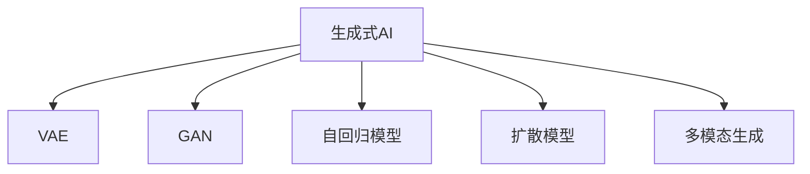

                 

# 生成式AIGC：从概念到现实的落地之路

## 1. 背景介绍

### 1.1 问题由来

近年来，随着深度学习和大数据的迅猛发展，人工智能(AI)技术正在逐步从感知智能向认知智能进化。生成式人工智能(Generative AI, AIGC)作为AI领域的最新热点，正在迅速改变人们的认知和生活方式。AIGC技术不仅能生成高质量的文本、图像、音频等内容，还能辅助完成内容创作、数据分析、交互设计等多个任务，具有广泛的应用前景。

然而，尽管AIGC技术在理论研究和实验室效果上都取得了令人瞩目的成就，实际落地到产业界仍然存在诸多挑战。如何将AIGC技术与现有业务场景进行无缝融合，如何确保模型的安全性、稳定性和可解释性，如何高效地生成、部署和管理AI内容，都需要深入的实践和探索。

### 1.2 问题核心关键点

AIGC技术的核心在于生成式模型，其核心理念是利用大模型和大数据进行高效的生成式训练，输出符合一定规则或要求的生成物。基于此，AIGC技术在理论和实践中已形成了一套较为成熟的方法体系，涵盖模型架构、训练方法、优化目标、部署机制等多个方面。

AIGC技术的成功落地，需要解决以下关键问题：

- 选择合适的模型架构。如何设计既高效又灵活的生成式模型，提升模型生成质量，同时兼顾参数量和计算效率。
- 设计合理的训练流程。如何设计合理的训练目标和优化策略，避免模型过拟合和模式崩溃，确保生成物的连贯性和多样性。
- 确定有效的评估指标。如何通过指标评估生成物质量，实时监控模型性能，指导模型迭代和优化。
- 确保内容安全和合规。如何通过机制和技术手段，过滤和防止有害内容，确保生成物的安全性和合规性。
- 提升系统稳定性和鲁棒性。如何提高模型的鲁棒性和鲁棒性，避免模型在异常数据或攻击下发生崩溃。

本文将系统性地探讨AIGC技术，从核心概念、算法原理到落地实践，带你深入了解从理论到实践的整个AIGC生成流程，并展示其在多个领域的应用实例。

## 2. 核心概念与联系

### 2.1 核心概念概述

为更好地理解AIGC技术，本节将介绍几个密切相关的核心概念：

- **生成式AI**：利用深度学习等技术，从给定的数据中学习生成新的数据样本，包括文本、图像、音频等多种形式。生成式AI的核心任务是训练生成模型，学习生成数据的概率分布，从而通过采样生成新数据。

- **变分自编码器(VAE)**：一种常用的生成模型，通过将数据表示为潜在变量的分布，并通过编码器、解码器两个过程学习生成数据的概率分布。VAE的变分优化器可以更好地处理高维数据，具有较好的生成效果。

- **生成对抗网络(GAN)**：一种基于博弈论的生成模型，由生成器(Generator)和判别器(Discriminator)组成，通过对抗训练生成高质量的样本数据。GAN能够生成更加逼真的样本，但训练过程较为复杂，易出现模式崩溃等问题。

- **自回归模型**：如LSTM、GRU等，通过考虑前后文的关联关系，预测下一个符号或数据点的生成模型。自回归模型适用于序列数据的生成，能够保证输出序列的连贯性，但生成速度较慢。

- **扩散模型**：如DDPM、SDE等，通过引入噪声逐步扩散，使模型学习生成数据的分布，最终通过逆向扩散得到高质量的生成数据。扩散模型在图像生成、视频生成等任务中表现出色，但训练复杂度较高。

这些核心概念之间的逻辑关系可以通过以下Mermaid流程图来展示：



这个流程图展示了几类主要的生成模型及其关联关系：

1. 生成式AI是大框架，VAE、GAN、自回归模型、扩散模型都是具体的生成模型，每一种模型都有其独特的优势和适用范围。
2. 多模态生成是指同时处理文本、图像、音频等多种形式的数据，生成更加丰富的生成物。

## 3. 核心算法原理 & 具体操作步骤

### 3.1 算法原理概述

AIGC技术的核心算法主要涉及生成模型和优化算法两个部分。

生成模型通过学习数据的概率分布，将训练集中的样本映射到潜在空间，通过解码器从潜在空间采样得到生成样本。优化算法则通过目标函数的优化，不断调整生成模型的参数，使得模型输出的生成样本尽可能地接近训练集中的样本。

在优化算法方面，常用的方法包括梯度下降、自适应学习率算法(如Adam、RMSprop等)、正则化技术(如L2正则、Dropout等)、对抗训练等。这些算法通过优化生成模型的参数，使得模型能够更好地学习数据分布，生成高质量的生成物。

### 3.2 算法步骤详解

AIGC技术的实现步骤主要包括数据准备、模型设计、模型训练、生成物评估和部署应用等几个环节。

**Step 1: 数据准备**

数据准备是AIGC技术实施的第一步。数据准备主要包括以下几个方面：

- 数据收集：收集与生成任务相关的训练数据，可以是文本、图像、音频等形式。
- 数据清洗：对数据进行去重、去噪、标准化等处理，提升数据质量。
- 数据划分：将数据划分为训练集、验证集和测试集，供模型训练和性能评估。
- 数据增强：通过数据增强技术扩充训练数据，提升模型的泛化能力和鲁棒性。

**Step 2: 模型设计**

模型设计是AIGC技术实施的关键环节。模型设计主要包括以下几个方面：

- 选择合适的生成模型：如VAE、GAN、自回归模型、扩散模型等，根据生成任务的特点和要求进行选择。
- 定义编码器和解码器：根据生成模型的要求，设计合适的编码器和解码器，实现潜在空间与生成空间的映射。
- 定义生成器和判别器：在GAN模型中，需要设计生成器和判别器，实现对抗训练。
- 定义生成目标函数：根据生成模型的特点，设计合理的生成目标函数，如均方误差、交叉熵、KL散度等。

**Step 3: 模型训练**

模型训练是AIGC技术的核心环节。模型训练主要包括以下几个方面：

- 选择合适的优化器：如Adam、SGD、RMSprop等，根据生成模型的特点和需求进行选择。
- 设置训练参数：如学习率、批大小、迭代轮数、正则化强度等，对模型进行训练。
- 进行模型训练：通过迭代训练过程，不断优化生成模型的参数，使得模型能够更好地学习数据分布。
- 监控训练过程：实时监控模型训练过程中的损失函数和生成物质量，及时调整训练参数，避免模型过拟合和模式崩溃。

**Step 4: 生成物评估**

生成物评估是AIGC技术实施的重要环节。生成物评估主要包括以下几个方面：

- 定义评估指标：如FID、IS、MS-SSIM等，用于评估生成物的质量。
- 进行生成物评估：在测试集上对生成模型进行评估，计算评估指标。
- 调整生成模型：根据评估指标，对生成模型进行调整和优化，提升生成物的质量。

**Step 5: 部署应用**

部署应用是AIGC技术的最终环节。部署应用主要包括以下几个方面：

- 模型导出和保存：将训练好的生成模型导出为可用的格式，如TensorFlow SavedModel、PyTorch模型等。
- 集成到应用系统：将生成的模型集成到实际的应用系统中，如网站、移动应用、智能助手等。
- 进行实际应用：在实际应用场景中，对生成模型进行推理，生成高质量的内容。

### 3.3 算法优缺点

生成式AI技术具有以下优点：

- 生成物质量高：通过学习数据分布，生成模型可以生成高质量的生成物，满足多种应用场景的需求。
- 泛化能力强：生成模型具有较好的泛化能力，可以在新数据上生成新的生成物。
- 灵活性高：生成模型可以根据不同的应用场景进行定制，实现高度个性化的内容生成。

然而，生成式AI技术也存在一些缺点：

- 训练复杂度高：生成模型的训练过程较为复杂，需要大量的计算资源和时间。
- 生成物可解释性差：生成模型通常作为黑盒系统，难以解释其内部工作机制和决策逻辑。
- 模型鲁棒性不足：生成模型在面对异常数据或攻击时，容易发生崩溃或产生不合理的输出。
- 内容安全和合规风险：生成模型可能生成有害内容，带来一定的风险和挑战。

尽管存在这些局限性，但就目前而言，生成式AI技术仍然是大模型应用的重要范式，具有广阔的应用前景。未来相关研究的重点在于如何进一步降低训练成本，提高生成物的可解释性和鲁棒性，同时兼顾内容安全和合规。

### 3.4 算法应用领域

生成式AI技术在多个领域中已经得到了广泛的应用，涵盖了几乎所有常见的生成任务，例如：

- 自然语言生成：如文本生成、对话系统、机器翻译等。生成模型能够学习语言规律，生成自然流畅的文本。
- 图像生成：如生成图像、视频、动画等。生成模型能够生成逼真的视觉内容，应用于艺术创作、游戏设计等领域。
- 音频生成：如生成音乐、语音合成等。生成模型能够生成高质量的音频内容，应用于娱乐、教育等领域。
- 视频生成：如视频剪辑、特效生成等。生成模型能够生成复杂多样的视频内容，应用于广告、影视制作等领域。
- 虚拟现实(VR)和增强现实(AR)：生成模型能够生成逼真的虚拟场景和角色，应用于娱乐、教育等领域。

除了上述这些经典任务外，生成式AI技术也被创新性地应用到更多场景中，如自动设计、数字孪生、智能推荐等，为各行业带来了全新的突破。随着生成式AI技术的不断演进，未来将会有更多的应用场景被挖掘和实现。

## 4. 数学模型和公式 & 详细讲解 & 举例说明

### 4.1 数学模型构建

生成式AI的核心数学模型是生成模型，通常基于概率模型构建。这里以VAE为例，展示生成模型的基本构建过程。

**VAE模型**：

$$
p(z) = \mathcal{N}(0, I)
$$
$$
p(x|z) = \mathcal{N}(\mu(z), \sigma(z)^2)
$$
$$
q(z|x) = \mathcal{N}(\mu(x), \sigma(x)^2)
$$

其中，$z$表示潜在空间中的随机变量，$x$表示观测空间中的数据点，$\mu(x)$和$\sigma(x)$分别表示观测空间中的均值和标准差，$\mu(z)$和$\sigma(z)$分别表示潜在空间中的均值和标准差。

**生成模型训练过程**：

1. 采样潜在变量：从潜在空间中采样得到$z$。
2. 解码生成数据：通过解码器将$z$映射到观测空间，生成数据$x$。
3. 计算生成损失：通过计算$x$与训练数据分布的差异，得到生成损失。
4. 优化生成目标函数：通过优化生成目标函数，调整生成模型的参数，最小化生成损失。

### 4.2 公式推导过程

以VAE模型的训练过程为例，推导生成模型的损失函数和优化过程。

**生成损失函数**：

$$
\mathcal{L}_g = -\frac{1}{N}\sum_{i=1}^N \log p(x_i|z_i)
$$

其中，$N$表示训练样本数量，$x_i$表示第$i$个样本。

**生成目标函数**：

$$
\mathcal{L} = \mathcal{L}_g + \mathcal{L}_q
$$

其中，$\mathcal{L}_q$表示VAE中的编码器损失，用于约束潜在变量$z$的分布。

**优化过程**：

1. 生成损失函数优化：通过梯度下降等优化算法，不断调整生成器的参数，最小化生成损失。
2. 编码器损失函数优化：通过梯度下降等优化算法，不断调整编码器的参数，最小化编码器损失。

### 4.3 案例分析与讲解

以文本生成为例，展示VAE模型的应用过程。

**数据准备**：

1. 收集文本数据：从网上收集一组文章，作为训练集。
2. 数据预处理：对文本进行分词、清洗、标准化等处理。
3. 数据划分：将数据划分为训练集、验证集和测试集。

**模型设计**：

1. 选择合适的生成模型：使用VAE模型，生成高质量的文本。
2. 定义编码器和解码器：将文本表示为潜在空间的分布，通过解码器生成文本。
3. 定义生成目标函数：使用均方误差作为生成目标函数，最小化生成损失。

**模型训练**：

1. 训练生成器：通过梯度下降等优化算法，不断调整生成器的参数，最小化生成损失。
2. 训练编码器：通过梯度下降等优化算法，不断调整编码器的参数，最小化编码器损失。
3. 监控训练过程：实时监控生成损失和生成物质量，及时调整训练参数。

**生成物评估**：

1. 定义评估指标：使用BLEU、ROUGE等指标，评估生成物的质量。
2. 进行生成物评估：在测试集上对生成模型进行评估，计算评估指标。
3. 调整生成模型：根据评估指标，对生成模型进行调整和优化。

**部署应用**：

1. 模型导出和保存：将训练好的生成模型导出为可用的格式，如TensorFlow SavedModel、PyTorch模型等。
2. 集成到应用系统：将生成的模型集成到实际的应用系统中，如网站、移动应用、智能助手等。
3. 进行实际应用：在实际应用场景中，对生成模型进行推理，生成高质量的内容。

## 5. 项目实践：代码实例和详细解释说明

### 5.1 开发环境搭建

在进行AIGC技术实践前，我们需要准备好开发环境。以下是使用Python进行PyTorch开发的环境配置流程：

1. 安装Anaconda：从官网下载并安装Anaconda，用于创建独立的Python环境。

2. 创建并激活虚拟环境：
```bash
conda create -n pytorch-env python=3.8 
conda activate pytorch-env
```

3. 安装PyTorch：根据CUDA版本，从官网获取对应的安装命令。例如：
```bash
conda install pytorch torchvision torchaudio cudatoolkit=11.1 -c pytorch -c conda-forge
```

4. 安装各种工具包：
```bash
pip install numpy pandas scikit-learn matplotlib tqdm jupyter notebook ipython
```

完成上述步骤后，即可在`pytorch-env`环境中开始AIGC技术实践。

### 5.2 源代码详细实现

下面我们以文本生成为例，展示使用PyTorch实现VAE模型的详细代码。

```python
import torch
import torch.nn as nn
import torch.nn.functional as F
from torch.distributions import Normal

# 定义VAE模型
class VAE(nn.Module):
    def __init__(self, latent_dim):
        super(VAE, self).__init__()
        self.latent_dim = latent_dim
        self.encoder = nn.Sequential(
            nn.Linear(28*28, 256),
            nn.ReLU(),
            nn.Linear(256, latent_dim*2)
        )
        self.decoder = nn.Sequential(
            nn.Linear(latent_dim, 256),
            nn.ReLU(),
            nn.Linear(256, 28*28),
            nn.Tanh()
        )

    def encode(self, x):
        mu, logvar = self.encoder(x)
        return mu, logvar

    def reparameterize(self, mu, logvar):
        std = torch.exp(0.5 * logvar)
        eps = torch.randn_like(std)
        return mu + eps * std

    def decode(self, z):
        x = self.decoder(z)
        return x

    def forward(self, x):
        mu, logvar = self.encode(x)
        z = self.reparameterize(mu, logvar)
        x_hat = self.decode(z)
        return x_hat, mu, logvar

# 定义生成目标函数
def loss_function(recon_x, x, mu, logvar):
    recon_loss = F.binary_cross_entropy(recon_x, x)
    kl_loss = -0.5 * torch.sum(1 + logvar - mu.pow(2) - logvar.exp())
    return recon_loss + kl_loss

# 数据准备
train_data = torchvision.datasets.MNIST(root='data', train=True, transform=torchvision.transforms.ToTensor(), download=True)
train_loader = torch.utils.data.DataLoader(train_data, batch_size=64, shuffle=True)

# 定义模型
vae = VAE(latent_dim=2)
vae.to(device)

# 定义优化器
optimizer = torch.optim.Adam(vae.parameters(), lr=0.001)

# 定义训练过程
for epoch in range(100):
    for batch_idx, (data, target) in enumerate(train_loader):
        data = data.view(-1, 28*28).to(device)
        target = target.to(device)
        optimizer.zero_grad()
        recon_x, mu, logvar = vae(data)
        loss = loss_function(recon_x, data, mu, logvar)
        loss.backward()
        optimizer.step()

        if (batch_idx+1) % 10 == 0:
            print('Epoch [{}/{}], Step [{}/{}], Loss: {:.4f}'
                  .format(epoch+1, 100, batch_idx+1, len(train_loader), loss.item()))

# 生成新数据
z = torch.randn(16, vae.latent_dim, device=device)
new_data = vae.decode(z)
```

以上就是使用PyTorch实现VAE模型生成文本的完整代码实现。可以看到，使用PyTorch构建VAE模型，能够较为方便地进行生成式AI的开发。

### 5.3 代码解读与分析

让我们再详细解读一下关键代码的实现细节：

**VAE模型类**：
- `__init__`方法：初始化编码器和解码器的网络结构。
- `encode`方法：将输入数据编码成潜在空间的分布。
- `reparameterize`方法：通过重参数化技术生成潜在变量。
- `decode`方法：将潜在变量解码为生成数据。
- `forward`方法：对输入数据进行编码和解码，并计算损失函数。

**生成目标函数**：
- `loss_function`方法：计算生成损失和编码器损失，并返回总的损失函数。

**数据准备**：
- `train_data`：使用MNIST数据集进行数据准备，并划分为训练集和测试集。
- `train_loader`：定义数据加载器，用于批量读取训练数据。

**模型训练**：
- `vae`：定义VAE模型，设置 latent_dim 为 2。
- `vae.to(device)`：将模型和数据转移到 GPU 上进行训练。
- `optimizer`：定义优化器，使用 Adam 算法。
- `for epoch in range(100)`：循环训练 100 次。
- `recon_x, mu, logvar = vae(data)`：对输入数据进行编码和解码，并计算损失函数。
- `loss.backward()`：计算梯度，更新模型参数。

**生成物评估**：
- `z`：生成潜在变量，使用 torch.randn 生成。
- `new_data = vae.decode(z)`：将潜在变量解码为生成数据。

**生成物输出**：
- `recon_x, mu, logvar = vae(data)`：对输入数据进行编码和解码，并计算损失函数。
- `z`：生成潜在变量，使用 torch.randn 生成。
- `new_data = vae.decode(z)`：将潜在变量解码为生成数据。

可以看到，PyTorch的灵活性和便捷性使得生成式AI的开发过程变得简单易行。开发者可以更加专注于模型设计和训练策略的优化，而不必过多关注底层实现细节。

## 6. 实际应用场景

### 6.1 智能客服系统

基于生成式AI的智能客服系统已经在许多企业中得到了广泛应用。传统客服往往需要配备大量人力，高峰期响应缓慢，且一致性和专业性难以保证。而使用生成式AI构建的智能客服系统，可以7x24小时不间断服务，快速响应客户咨询，用自然流畅的语言解答各类常见问题。

在技术实现上，可以收集企业内部的历史客服对话记录，将问题和最佳答复构建成监督数据，在此基础上对生成式AI模型进行微调。微调后的生成模型能够自动理解用户意图，匹配最合适的答案模板进行回复。对于客户提出的新问题，还可以接入检索系统实时搜索相关内容，动态组织生成回答。如此构建的智能客服系统，能大幅提升客户咨询体验和问题解决效率。

### 6.2 金融舆情监测

金融机构需要实时监测市场舆论动向，以便及时应对负面信息传播，规避金融风险。传统的人工监测方式成本高、效率低，难以应对网络时代海量信息爆发的挑战。基于生成式AI的文本分类和情感分析技术，为金融舆情监测提供了新的解决方案。

具体而言，可以收集金融领域相关的新闻、报道、评论等文本数据，并对其进行主题标注和情感标注。在此基础上对生成式AI模型进行微调，使其能够自动判断文本属于何种主题，情感倾向是正面、中性还是负面。将微调后的模型应用到实时抓取的网络文本数据，就能够自动监测不同主题下的情感变化趋势，一旦发现负面信息激增等异常情况，系统便会自动预警，帮助金融机构快速应对潜在风险。

### 6.3 个性化推荐系统

当前的推荐系统往往只依赖用户的历史行为数据进行物品推荐，无法深入理解用户的真实兴趣偏好。基于生成式AI的个性化推荐系统可以更好地挖掘用户行为背后的语义信息，从而提供更精准、多样的推荐内容。

在实践中，可以收集用户浏览、点击、评论、分享等行为数据，提取和用户交互的物品标题、描述、标签等文本内容。将文本内容作为模型输入，用户的后续行为（如是否点击、购买等）作为监督信号，在此基础上微调生成式AI模型。微调后的模型能够从文本内容中准确把握用户的兴趣点。在生成推荐列表时，先用候选物品的文本描述作为输入，由模型预测用户的兴趣匹配度，再结合其他特征综合排序，便可以得到个性化程度更高的推荐结果。

### 6.4 未来应用展望

随着生成式AI技术的不断发展，未来将在更多领域得到应用，为传统行业带来变革性影响。

在智慧医疗领域，基于生成式AI的医疗问答、病历分析、药物研发等应用将提升医疗服务的智能化水平，辅助医生诊疗，加速新药开发进程。

在智能教育领域，生成式AI可应用于作业批改、学情分析、知识推荐等方面，因材施教，促进教育公平，提高教学质量。

在智慧城市治理中，生成式AI可应用于城市事件监测、舆情分析、应急指挥等环节，提高城市管理的自动化和智能化水平，构建更安全、高效的未来城市。

此外，在企业生产、社会治理、文娱传媒等众多领域，生成式AI的应用也将不断涌现，为经济社会发展注入新的动力。相信随着技术的日益成熟，生成式AI必将在更广阔的应用领域大放异彩，深刻影响人类的生产生活方式。

## 7. 工具和资源推荐

### 7.1 学习资源推荐

为了帮助开发者系统掌握生成式AI的理论基础和实践技巧，这里推荐一些优质的学习资源：

1. 《深度学习》系列博文：由大模型技术专家撰写，深入浅出地介绍了深度学习的基本概念和前沿技术。

2. 《自然语言处理》课程：斯坦福大学开设的NLP明星课程，有Lecture视频和配套作业，带你入门NLP领域的基本概念和经典模型。

3. 《生成对抗网络》书籍：生成对抗网络的奠基之作，介绍了GAN的基本原理和实现方法，适合深度学习和计算机视觉领域的学习者。

4. 《VAE模型与应用》书籍：全面介绍了VAE模型的构建和应用，适合自然语言处理和计算机视觉领域的学习者。

5. 《多模态生成》课程：多模态生成技术的学习资源，涵盖文本、图像、音频等多种形式的数据生成方法。

通过对这些资源的学习实践，相信你一定能够快速掌握生成式AI的精髓，并用于解决实际的生成任务。

### 7.2 开发工具推荐

高效的开发离不开优秀的工具支持。以下是几款用于生成式AI开发常用的工具：

1. PyTorch：基于Python的开源深度学习框架，灵活动态的计算图，适合快速迭代研究。大部分生成模型都有PyTorch版本的实现。

2. TensorFlow：由Google主导开发的开源深度学习框架，生产部署方便，适合大规模工程应用。同样有丰富的生成模型资源。

3. Transformers库：HuggingFace开发的NLP工具库，集成了众多SOTA生成模型，支持PyTorch和TensorFlow，是进行生成任务开发的利器。

4. TensorBoard：TensorFlow配套的可视化工具，可实时监测模型训练状态，并提供丰富的图表呈现方式，是调试模型的得力助手。

5. Weights & Biases：模型训练的实验跟踪工具，可以记录和可视化模型训练过程中的各项指标，方便对比和调优。

6. Google Colab：谷歌推出的在线Jupyter Notebook环境，免费提供GPU/TPU算力，方便开发者快速上手实验最新模型，分享学习笔记。

合理利用这些工具，可以显著提升生成式AI的开发效率，加快创新迭代的步伐。

### 7.3 相关论文推荐

生成式AI技术在多个领域中已经得到了广泛的研究。以下是几篇奠基性的相关论文，推荐阅读：

1. 《Generative Adversarial Nets》：提出GAN的基本原理和实现方法，开启了生成对抗网络的先河。

2. 《Auto-Encoding Variational Bayes》：提出VAE的基本原理和实现方法，是生成式AI技术的重要里程碑。

3. 《Attention is All You Need》：提出Transformer模型，为自然语言生成和机器翻译等领域带来了新的突破。

4. 《Improving Language Understanding by Generative Pre-training》：提出BERT模型，引入基于掩码的自监督预训练任务，刷新了多项NLP任务SOTA。

5. 《Text Generation with GANs》：介绍GAN在文本生成中的应用，展示生成式AI技术在文本领域的应用前景。

这些论文代表了大模型生成技术的发展脉络。通过学习这些前沿成果，可以帮助研究者把握学科前进方向，激发更多的创新灵感。

## 8. 总结：未来发展趋势与挑战

### 8.1 总结

本文对生成式AI技术进行了全面系统的介绍。首先阐述了生成式AI的核心概念和研究背景，明确了生成式AI在理论与实践上的重要地位。其次，从原理到实践，详细讲解了生成式AI的数学模型和算法流程，给出了生成式AI的完整代码实例。同时，本文还展示了生成式AI技术在多个行业领域的应用实例，展示了其广阔的应用前景。

通过本文的系统梳理，可以看到，生成式AI技术正在逐步从实验室走向实际应用，为人类生产生活带来了深刻的变革。未来，随着生成式AI技术的不断演进，生成式AI将更加智能化、普适化，成为推动人工智能技术发展的重要力量。

### 8.2 未来发展趋势

展望未来，生成式AI技术将呈现以下几个发展趋势：

1. 模型规模持续增大。随着算力成本的下降和数据规模的扩张，生成式模型的参数量还将持续增长。超大规模生成模型蕴含的丰富生成知识，有望支撑更加复杂多变的生成任务。

2. 生成模型日趋多样化。除了现有的VAE、GAN、自回归模型、扩散模型外，未来还会涌现更多生成模型，如Transformer、Neural Architecture Search等，适应不同的生成任务需求。

3. 生成模型鲁棒性提升。未来生成模型将引入更多的正则化技术，提升模型的鲁棒性和泛化能力，避免模式崩溃和生成物不稳定的问题。

4. 生成模型可解释性加强。未来生成模型将引入更多的可解释技术，如Attention机制、生成式解释等，提升模型的可解释性和可控性。

5. 生成模型跨模态融合。未来生成模型将更加注重跨模态数据的融合，实现视觉、语音、文本等多种形式的数据协同生成。

6. 生成模型与真实世界的交互。未来生成模型将与真实世界进行更紧密的交互，通过多模态感知、场景理解等技术，生成更加贴近真实世界的生成物。

以上趋势凸显了生成式AI技术的广阔前景。这些方向的探索发展，必将进一步提升生成式AI技术的性能和应用范围，为人类生产生活带来更多的可能性。

### 8.3 面临的挑战

尽管生成式AI技术已经取得了瞩目成就，但在迈向更加智能化、普适化应用的过程中，它仍面临着诸多挑战：

1. 生成物质量参差不齐。生成式AI模型生成的内容质量仍存在较大波动，部分生成的内容可能存在质量不高、不够自然等问题。如何提升生成物的质量和多样性，是未来需要解决的重要问题。

2. 生成模型鲁棒性不足。生成式AI模型在面对异常数据或攻击时，容易发生崩溃或产生不合理的输出。如何提高模型的鲁棒性和稳定性，是未来需要重点解决的问题。

3. 生成内容安全和合规。生成式AI模型可能生成有害内容，带来一定的风险和挑战。如何通过技术手段过滤和防止有害内容，确保生成物的安全性和合规性，是未来需要解决的重要问题。

4. 生成模型可解释性差。生成式AI模型通常作为黑盒系统，难以解释其内部工作机制和决策逻辑。如何赋予生成式AI模型更强的可解释性，是未来需要解决的重要问题。

5. 生成模型训练成本高。生成式AI模型训练过程复杂，需要大量的计算资源和时间。如何降低生成式AI模型的训练成本，提高生成物的质量，是未来需要解决的重要问题。

尽管存在这些局限性，但就目前而言，生成式AI技术仍然是大模型应用的重要范式，具有广阔的应用前景。未来相关研究的重点在于如何进一步降低训练成本，提高生成物的可解释性和鲁棒性，同时兼顾内容安全和合规。

### 8.4 研究展望

面对生成式AI技术所面临的种种挑战，未来的研究需要在以下几个方面寻求新的突破：

1. 探索无监督和半监督生成方法。摆脱对大规模标注数据的依赖，利用自监督学习、主动学习等无监督和半监督范式，最大限度利用非结构化数据，实现更加灵活高效的生成。

2. 研究参数高效和计算高效的生成范式。开发更加参数高效的生成方法，在固定大部分生成参数的同时，只更新极少量的生成任务相关参数。同时优化生成模型的计算图，减少前向传播和反向传播的资源消耗，实现更加轻量级、实时性的部署。

3. 引入更多先验知识。将符号化的先验知识，如知识图谱、逻辑规则等，与生成模型进行巧妙融合，引导生成过程学习更准确、合理的生成物。同时加强不同模态数据的整合，实现视觉、语音等多模态信息与文本信息的协同生成。

4. 结合因果分析和博弈论工具。将因果分析方法引入生成模型，识别出生成模型决策的关键特征，增强生成物输出的因果性和逻辑性。借助博弈论工具刻画人机交互过程，主动探索并规避生成模型的脆弱点，提高系统稳定性。

5. 纳入伦理道德约束。在生成模型训练目标中引入伦理导向的评估指标，过滤和防止有害内容，确保生成物的安全性和合规性。同时加强人工干预和审核，建立生成物行为的监管机制，确保输出符合人类价值观和伦理道德。

这些研究方向的探索，必将引领生成式AI技术迈向更高的台阶，为构建安全、可靠、可解释、可控的智能系统铺平道路。面向未来，生成式AI技术还需要与其他人工智能技术进行更深入的融合，如知识表示、因果推理、强化学习等，多路径协同发力，共同推动生成式AI技术的进步。只有勇于创新、敢于突破，才能不断拓展生成式AI的边界，让智能技术更好地造福人类社会。

## 9. 附录：常见问题与解答

**Q1：生成式AI技术是否适用于所有生成任务？**

A: 生成式AI技术在大多数生成任务上都能取得不错的效果，特别是对于数据量较小的任务。但对于一些特定领域的任务，如医学、法律等，仅仅依靠通用语料预训练的模型可能难以很好地适应。此时需要在特定领域语料上进一步预训练，再进行微调，才能获得理想效果。此外，对于一些需要时效性、个性化很强的任务，如对话、推荐等，生成式AI方法也需要针对性的改进优化。

**Q2：生成式AI模型的训练复杂度如何？**

A: 生成式AI模型的训练过程较为复杂，需要大量的计算资源和时间。例如，GAN模型通常需要大量的对抗训练，难以收敛。VAE模型需要同时优化生成目标和编码器目标，训练过程也较为复杂。未来随着硬件算力的提升，生成式AI模型的训练复杂度有望进一步降低，训练效率和效果也将得到提升。

**Q3：生成式AI模型是否需要大量标注数据？**

A: 生成式AI模型通常需要大量的标注数据进行训练，尤其是GAN和VAE等模型。但近年来，一些无监督和半监督生成方法（如StyleGAN、DM-GAN等）在一定程度上缓解了数据标注的瓶颈问题。未来，随着技术的发展，生成式AI模型有望在更少的数据下取得更好的生成效果。

**Q4：生成式AI模型的鲁棒性如何？**

A: 生成式AI模型的鲁棒性通常较低，难以应对异常数据和攻击。例如，GAN模型在对抗样本攻击下容易产生模式崩溃。未来，通过引入正则化技术、对抗训练等方法，提升生成式AI模型的鲁棒性和稳定性，是未来研究的重要方向。

**Q5：生成式AI模型的可解释性如何？**

A: 生成式AI模型通常作为黑盒系统，难以解释其内部工作机制和决策逻辑。未来，通过引入可解释技术，如Attention机制、生成式解释等，提升生成式AI模型的可解释性和可控性，将是重要的研究方向。

这些问题的回答，帮助你更好地理解生成式AI技术的核心概念和实现细节，希望对你有所帮助。

---

作者：禅与计算机程序设计艺术 / Zen and the Art of Computer Programming

