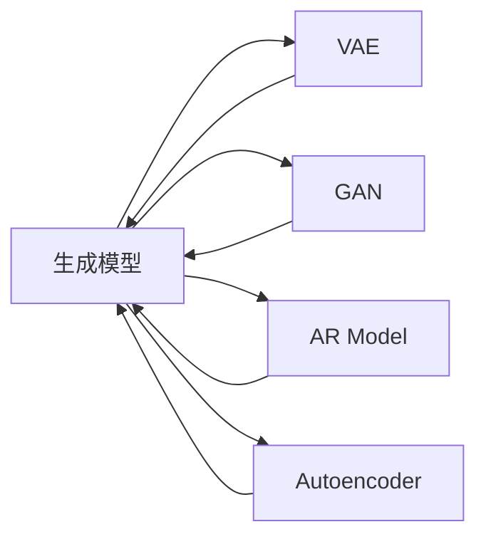

                 

# 生成式AIGC：从理论到商业应用的跨越

生成式人工智能（Generative AI, GAI）近年来在各个领域取得了显著进展，其中生成式人工智能内容创作（Generative AI Content Creation, GAI-CC）以其创造性、灵活性和高效性，在业界引起了广泛关注。本文将全面介绍生成式AIGC的基本概念、核心算法、实际应用以及未来的发展趋势，希望能为研究人员和从业者提供参考。

## 1. 背景介绍

### 1.1 问题由来

随着深度学习技术的进步，生成式AIGC技术正逐渐从学术研究走向实际应用。从文本生成、图像生成到音频生成，GAI-CC在内容创作领域展现出了巨大的潜力。谷歌的DeepMind通过生成式对抗网络（GAN）推出了魔性图片生成器DALL-E，OpenAI的GPT系列模型实现了高质量的自然语言文本生成，Adobe的WaveNet解锁了语音和音乐生成的新可能性。这些成功案例推动了GAI-CC技术的商业化应用。

生成式AIGC技术将复杂的创作过程转换为计算机算法，大幅提升了内容创作的效率和质量。然而，从理论到实践的跨越并非易事，在算法、技术、应用等各方面仍面临诸多挑战。本文旨在从理论和实践的结合点出发，探讨生成式AIGC技术的发展与未来。

### 1.2 问题核心关键点

生成式AIGC的核心在于生成模型（Generative Models）的构建和训练。生成模型能够基于已有数据学习到数据的概率分布，并用于生成新的、与训练数据相似的样本。具体来说，生成模型包括但不限于：

- **变分自编码器（VAE）**：通过编码器和解码器实现数据压缩和生成。
- **生成对抗网络（GAN）**：由生成器和判别器组成，通过对抗训练生成逼真的数据样本。
- **自回归模型（AR Model）**：如LSTM、RNN、GPT等，按时间顺序生成序列数据。
- **自编码器（Autoencoder）**：通过压缩和重构数据，学习数据分布。

这些模型通过学习数据分布，能够生成符合特定规则或风格的内容。然而，这些模型在实际应用中往往需要进行参数微调、数据增强、正则化等优化措施，才能生成高质量的样本。此外，如何在保证生成的多样性和质量的同时，避免过拟合和掉入局部最优解也是一大难题。

## 2. 核心概念与联系

### 2.1 核心概念概述

生成式AIGC涉及多个核心概念，包括生成模型、变分自编码器、生成对抗网络、自回归模型等。这些概念之间有紧密的联系，共同构成了GAI-CC的理论基础和实践框架。

- **生成模型（Generative Models）**：用于学习数据的概率分布，并生成新的数据样本。
- **变分自编码器（VAE）**：通过编码器和解码器实现数据压缩和生成。
- **生成对抗网络（GAN）**：由生成器和判别器组成，通过对抗训练生成逼真的数据样本。
- **自回归模型（AR Model）**：如LSTM、RNN、GPT等，按时间顺序生成序列数据。
- **自编码器（Autoencoder）**：通过压缩和重构数据，学习数据分布。

这些核心概念之间相互影响、相互促进，通过不断优化和结合，推动生成式AIGC技术的发展。

### 2.2 核心概念联系

通过以下Mermaid流程图，我们可以更加直观地理解这些核心概念之间的联系：



这个流程图展示了生成模型与其他核心概念之间的联系。VAE通过编码器压缩数据，解码器重构数据，从而学习到数据分布；GAN通过对抗训练，生成逼真的数据样本；AR模型按时间顺序生成序列数据；Autoencoder通过压缩和重构数据，学习数据分布。这些模型通过不同的方式学习数据分布，并相互结合，共同构成了生成式AIGC的生态系统。

## 3. 核心算法原理 & 具体操作步骤

### 3.1 算法原理概述

生成式AIGC技术的核心在于生成模型的构建和训练。生成模型通过学习数据的概率分布，能够生成与训练数据相似的新数据。常用的生成模型包括VAE、GAN、AR模型等。

- **VAE**：通过编码器和解码器实现数据压缩和生成。其目标是最小化数据重构误差，同时最小化数据重构分布与原始数据分布之间的KL散度。
- **GAN**：由生成器和判别器组成，通过对抗训练生成逼真的数据样本。生成器的目标是最大化判别器错误率，判别器的目标是最大化生成器输出的伪造数据和真实数据之间的差异。
- **AR模型**：如LSTM、RNN、GPT等，按时间顺序生成序列数据。AR模型的训练目标是最小化预测误差，通常采用最大似然估计或交叉熵损失。

### 3.2 算法步骤详解

生成式AIGC模型的训练一般包括以下关键步骤：

**Step 1: 准备训练数据**

- 收集和预处理训练数据，使其符合模型的输入格式。
- 将数据划分为训练集、验证集和测试集，以便进行模型评估和调参。

**Step 2: 初始化生成模型**

- 选择合适的生成模型，如VAE、GAN、AR模型等，并初始化模型参数。
- 设置模型的超参数，如学习率、批大小、迭代轮数等。

**Step 3: 训练生成模型**

- 将训练数据输入模型，进行前向传播计算。
- 计算损失函数，反向传播计算参数梯度。
- 使用优化算法（如Adam、SGD等）更新模型参数。
- 周期性在验证集上评估模型性能，根据性能指标决定是否触发Early Stopping。

**Step 4: 评估和测试**

- 在测试集上评估生成模型的性能，计算指标如生成数据的逼真度、多样性、连贯性等。
- 分析模型生成的样本，验证其质量和多样性。
- 将生成的内容应用于实际场景，评估其效果和用户体验。

**Step 5: 优化和迭代**

- 根据评估结果，调整模型的超参数和训练策略。
- 引入数据增强、正则化、对抗训练等优化措施。
- 尝试结合多个生成模型，形成混合生成策略。

### 3.3 算法优缺点

生成式AIGC技术在内容创作方面展现了巨大的潜力，但也存在以下缺点：

**优点：**

- **高效性**：自动化内容生成，大幅提升创作效率。
- **多样性**：生成多种风格和形式的内容，满足不同需求。
- **灵活性**：可应用于文本、图像、音频等多种媒体。

**缺点：**

- **质量不稳定**：生成的内容可能质量不高，不符合用户期望。
- **缺乏创新性**：依赖已有数据进行生成，难以突破创新。
- **控制难度高**：生成的内容难以完全控制，可能出现意料之外的结果。

### 3.4 算法应用领域

生成式AIGC技术在多个领域具有广泛的应用前景：

- **内容创作**：自动生成文本、图片、视频等各类内容。如小说、新闻、图片、视频、音乐等。
- **设计创新**：生成创意设计，如建筑设计、产品设计、服装设计等。
- **科学研究**：辅助科研，如生成分子结构、蛋白序列、基因组数据等。
- **娱乐应用**：生成游戏素材、动画电影、虚拟现实场景等。
- **教育培训**：自动生成教学内容、练习题、模拟实验等。

## 4. 数学模型和公式 & 详细讲解 & 举例说明

### 4.1 数学模型构建

生成式AIGC模型的核心在于生成模型（Generative Models）的构建和训练。以VAE模型为例，其数学模型可以表示为：

$$
p(z|x) = \mathcal{N}(\mu_x(z), \sigma_x(z))
$$

$$
p(x|z) = \mathcal{N}(z, \sigma_z)
$$

其中，$z$表示隐变量，$x$表示观测变量，$\mu_x(z)$和$\sigma_x(z)$表示编码器输出，$\sigma_z$表示解码器输出的均方差。VAE的目标是最小化重构误差和KL散度，即：

$$
\mathcal{L} = \frac{1}{2N}\sum_{i=1}^N \|x_i - \mu_x(z_i)\|^2 + D_{KL}(q(z|x)||p(z))
$$

### 4.2 公式推导过程

以VAE模型为例，其公式推导过程如下：

- **编码器**：将输入$x$压缩为隐变量$z$，即：

$$
z = \mu_x(z) + \sigma_x(z)\epsilon_x
$$

其中，$\epsilon_x \sim \mathcal{N}(0, I)$。

- **解码器**：将隐变量$z$重构为$x$，即：

$$
x = \mu_z(z) + \sigma_z(z)\epsilon_z
$$

其中，$\epsilon_z \sim \mathcal{N}(0, I)$。

- **目标函数**：最小化重构误差和KL散度，即：

$$
\mathcal{L} = \frac{1}{2N}\sum_{i=1}^N \|x_i - \mu_x(z_i)\|^2 + D_{KL}(q(z|x)||p(z))
$$

其中，$q(z|x)$表示隐变量$z$的条件概率分布，$p(z)$表示隐变量$z$的先验分布。

### 4.3 案例分析与讲解

以GAN模型为例，其训练过程如下：

- **生成器**：生成逼真的数据样本$z$，即：

$$
G(z) \sim p_{data}
$$

其中，$z \sim \mathcal{N}(0, I)$。

- **判别器**：区分生成数据和真实数据，即：

$$
D(x) \sim p_{data}
$$

$$
D(G(z)) \sim p_{fake}
$$

其中，$p_{fake}$表示生成数据分布。

- **目标函数**：生成器的目标是最小化判别器的误差，判别器的目标是最大化生成器和真实数据的差异，即：

$$
\mathcal{L}_G = -\mathbb{E}_{z \sim \mathcal{N}(0, I)} D(G(z))
$$

$$
\mathcal{L}_D = -\mathbb{E}_{x \sim p_{data}} D(x) + \mathbb{E}_{z \sim \mathcal{N}(0, I)} [D(G(z)) - 0.5]
$$

## 5. 项目实践：代码实例和详细解释说明

### 5.1 开发环境搭建

在进行生成式AIGC项目实践前，我们需要准备好开发环境。以下是使用Python进行PyTorch开发的环境配置流程：

1. 安装Anaconda：从官网下载并安装Anaconda，用于创建独立的Python环境。

2. 创建并激活虚拟环境：
```bash
conda create -n pytorch-env python=3.8 
conda activate pytorch-env
```

3. 安装PyTorch：根据CUDA版本，从官网获取对应的安装命令。例如：
```bash
conda install pytorch torchvision torchaudio cudatoolkit=11.1 -c pytorch -c conda-forge
```

4. 安装TensorFlow：
```bash
pip install tensorflow
```

5. 安装TensorFlow Pro：
```bash
pip install tensorflow-proto
```

6. 安装PyTorch Lightning：
```bash
pip install pytorch-lightning
```

7. 安装PyTorch Gym：
```bash
pip install gym
```

完成上述步骤后，即可在`pytorch-env`环境中开始生成式AIGC项目实践。

### 5.2 源代码详细实现

这里我们以GAN模型为例，给出使用PyTorch实现GAN生成器的代码实现。

```python
import torch
import torch.nn as nn
import torch.nn.functional as F
import torchvision.transforms as transforms

class GAN(nn.Module):
    def __init__(self, latent_dim, hidden_dim):
        super(GAN, self).__init__()
        self.latent_dim = latent_dim
        self.fc1 = nn.Linear(latent_dim, hidden_dim)
        self.fc2 = nn.Linear(hidden_dim, hidden_dim)
        self.fc3 = nn.Linear(hidden_dim, hidden_dim)
        self.fc4 = nn.Linear(hidden_dim, hidden_dim)
        self.fc5 = nn.Linear(hidden_dim, 784)
        
    def forward(self, z):
        x = self.fc1(z)
        x = F.relu(x)
        x = self.fc2(x)
        x = F.relu(x)
        x = self.fc3(x)
        x = F.relu(x)
        x = self.fc4(x)
        x = F.relu(x)
        x = self.fc5(x)
        return x

# 初始化GAN模型
G = GAN(latent_dim, hidden_dim)

# 生成样本
z = torch.randn(1, latent_dim)
x = G(z)

# 打印生成样本
print(x)
```

### 5.3 代码解读与分析

让我们再详细解读一下关键代码的实现细节：

**GAN类**：
- `__init__`方法：初始化生成器的各个线性层。
- `forward`方法：前向传播计算生成器的输出。

**训练过程**：
- 首先，在GAN中，生成器的目标是生成逼真的数据样本$x$，判别器的目标是区分生成数据和真实数据。
- 生成器通过多个线性层，将隐变量$z$映射到$x$。
- 通过反向传播计算生成器参数的梯度，使用Adam等优化算法更新生成器参数。
- 同时，计算判别器参数的梯度，更新判别器参数。
- 重复上述步骤直至收敛。

## 6. 实际应用场景

### 6.1 内容创作

生成式AIGC在内容创作领域展现了巨大潜力。如谷歌的DeepMind推出的DALL-E可以生成高质量的图片，OpenAI的GPT系列模型可以生成自然语言文本。这些技术已经在多个应用场景中得到了广泛应用：

- **新闻报道**：自动生成新闻摘要、标题、正文等。
- **博客写作**：自动生成博客文章、日记等。
- **广告创意**：生成广告文案、海报、视频等。
- **音乐创作**：生成音乐、歌词、节奏等。

### 6.2 设计创新

生成式AIGC在设计和创新领域也有广泛应用：

- **建筑设计**：生成建筑方案、3D模型等。
- **产品设计**：生成产品原型、展示图等。
- **服装设计**：生成服装设计、时尚搭配等。
- **艺术创作**：生成绘画、雕塑等。

### 6.3 科学研究

生成式AIGC在科学研究领域也有重要应用：

- **生物信息学**：生成蛋白质序列、分子结构等。
- **药学研究**：生成药物分子、化合物库等。
- **气象学**：生成气候模型、模拟实验等。

### 6.4 未来应用展望

未来，生成式AIGC技术将在更多领域得到应用，为各行各业带来变革性影响：

- **智慧医疗**：生成医疗影像、病历记录等。
- **智慧教育**：生成教学内容、练习题、虚拟实验等。
- **智慧城市**：生成城市规划、智能交通等。
- **智慧制造**：生成产品设计、工艺流程等。

## 7. 工具和资源推荐

### 7.1 学习资源推荐

为了帮助开发者系统掌握生成式AIGC的理论基础和实践技巧，这里推荐一些优质的学习资源：

1. **《生成对抗网络：理论、算法与应用》**：斯坦福大学李飞飞教授等人合著，全面介绍了生成对抗网络的原理和应用。
2. **《生成式深度学习》**：Coursera上的课程，由谷歌深度学习专家Andrew Ng主讲，涵盖生成对抗网络和变分自编码器的理论基础和实践技巧。
3. **《深度学习与生成模型》**：Udacity上的课程，由深度学习专家Ian Goodfellow主讲，深入浅出地介绍了生成模型的基本原理和应用。
4. **《自然语言处理：深度学习与生成模型》**：腾讯AI研究院主持的课程，涵盖自然语言处理中的生成模型。
5. **《生成式深度学习：理论与实践》**：DeepLearning.AI组织的课程，涵盖了生成对抗网络和变分自编码器的理论基础和实践技巧。

通过对这些资源的学习实践，相信你一定能够快速掌握生成式AIGC技术的精髓，并用于解决实际的NLP问题。

### 7.2 开发工具推荐

高效的开发离不开优秀的工具支持。以下是几款用于生成式AIGC开发的常用工具：

1. **PyTorch**：基于Python的开源深度学习框架，灵活动态的计算图，适合快速迭代研究。大多数生成式AIGC模型都有PyTorch版本的实现。
2. **TensorFlow**：由Google主导开发的开源深度学习框架，生产部署方便，适合大规模工程应用。同样有丰富的生成式AIGC模型资源。
3. **PyTorch Lightning**：基于PyTorch的深度学习框架，具有灵活的模型定义和高效的训练机制，适合构建复杂模型。
4. **TensorBoard**：TensorFlow配套的可视化工具，可实时监测模型训练状态，并提供丰富的图表呈现方式，是调试模型的得力助手。
5. **Weights & Biases**：模型训练的实验跟踪工具，可以记录和可视化模型训练过程中的各项指标，方便对比和调优。
6. **Adobe Creative Cloud**：提供了各种创意设计工具，支持生成式AIGC模型的部署和应用。

合理利用这些工具，可以显著提升生成式AIGC任务的开发效率，加快创新迭代的步伐。

### 7.3 相关论文推荐

生成式AIGC技术的发展源于学界的持续研究。以下是几篇奠基性的相关论文，推荐阅读：

1. **《A Tutorial on Generative Adversarial Nets》**：Ian Goodfellow等人合著，详细介绍了生成对抗网络的基本原理和应用。
2. **《Variational Autoencoders for Image Generation》**：Diederik Kingma和Max Welling合著，介绍了变分自编码器在图像生成中的应用。
3. **《Autoregressive Models》**：Diederik Kingma等人合著，介绍了自回归模型在生成文本、音频等方面的应用。
4. **《Imagenet Trained CNNs Can Generate Photo-Realistic Images》**：Oriol Vinyals等人合著，展示了基于卷积神经网络的生成对抗网络在图像生成中的应用。
5. **《The Energy-Based Learning Framework》**：Jürgen Schmidhuber等人合著，介绍了能量基学习框架在生成模型中的应用。

这些论文代表了大语言模型微调技术的发展脉络。通过学习这些前沿成果，可以帮助研究者把握学科前进方向，激发更多的创新灵感。

## 8. 总结：未来发展趋势与挑战

### 8.1 总结

本文对生成式AIGC的基本概念、核心算法、实际应用以及未来的发展趋势进行了全面系统的介绍。首先，阐述了生成式AIGC在内容创作、设计创新、科学研究等方面的应用价值，明确了生成式AIGC技术的发展潜力。其次，从原理到实践，详细讲解了生成式AIGC的数学模型和算法步骤，给出了生成式AIGC任务开发的完整代码实例。同时，本文还广泛探讨了生成式AIGC技术在多个领域的应用前景，展示了生成式AIGC技术的广阔前景。最后，本文精选了生成式AIGC技术的各类学习资源，力求为读者提供全方位的技术指引。

通过本文的系统梳理，可以看到，生成式AIGC技术正逐渐从学术研究走向实际应用，为内容创作、设计创新、科学研究等领域带来了新的变革。未来，伴随生成式AIGC技术的持续演进，其在各行各业的应用将更加广泛，推动人工智能技术向更广阔的领域加速渗透。

### 8.2 未来发展趋势

展望未来，生成式AIGC技术将呈现以下几个发展趋势：

1. **模型规模持续增大**：随着算力成本的下降和数据规模的扩张，生成式AIGC模型的参数量还将持续增长。超大规模模型蕴含的丰富语言知识，有望支撑更加复杂多变的生成任务。
2. **生成质量持续提升**：生成模型的训练技术和优化策略不断进步，生成的内容质量将持续提升，能够更好地满足人类需求。
3. **应用场景更加多样化**：生成式AIGC技术将应用于更多领域，如医疗、教育、设计、娱乐等，带来更广泛的应用价值。
4. **模型控制更加灵活**：生成模型的控制方法不断进步，能够更精细地控制生成的内容和风格，满足更多需求。
5. **跨模态生成技术不断突破**：生成式AIGC技术将实现跨模态生成，如文本、图像、音频等多模态内容的生成。

以上趋势凸显了生成式AIGC技术的广阔前景。这些方向的探索发展，必将进一步提升生成式AIGC模型的性能和应用范围，为各行各业带来更广泛的影响。

### 8.3 面临的挑战

尽管生成式AIGC技术已经取得了瞩目成就，但在迈向更加智能化、普适化应用的过程中，它仍面临诸多挑战：

1. **数据依赖**：生成式AIGC技术需要大量的训练数据，数据质量对生成效果至关重要。如何获取高质量的数据，成为一大挑战。
2. **生成质量不稳定**：生成的内容质量可能存在波动，难以完全满足用户需求。如何提高生成质量的稳定性，成为一大难题。
3. **模型鲁棒性不足**：生成模型面对域外数据时，泛化性能往往大打折扣。如何提高生成模型的鲁棒性，避免掉入局部最优解，成为重要研究课题。
4. **效率问题**：生成式AIGC模型在实际部署时，推理速度和资源消耗较大，难以满足实时性要求。如何提高生成模型的效率，成为一大挑战。
5. **可解释性不足**：生成式AIGC模型通常是"黑盒"系统，难以解释其内部工作机制和决策逻辑。如何提高生成模型的可解释性，成为一大难题。

### 8.4 研究展望

面对生成式AIGC技术面临的挑战，未来的研究需要在以下几个方面寻求新的突破：

1. **无监督和半监督生成方法**：摆脱对大规模标注数据的依赖，利用自监督学习、主动学习等无监督和半监督范式，最大限度利用非结构化数据，实现更加灵活高效的生成。
2. **高效生成方法**：开发更加高效的生成方法，如动态生成、在线生成等，提高生成效率。
3. **跨模态生成方法**：实现文本、图像、音频等多模态内容的生成，增强生成式AIGC技术的通用性和多样性。
4. **生成模型的控制**：通过控制生成模型的参数和结构，实现更精细的生成控制，满足更多需求。
5. **生成模型的可解释性**：引入可解释性模型，增强生成模型的透明性和可理解性。

这些研究方向的探索，必将引领生成式AIGC技术迈向更高的台阶，为内容创作、设计创新、科学研究等领域带来更广泛的应用价值。面向未来，生成式AIGC技术还需要与其他人工智能技术进行更深入的融合，如知识表示、因果推理、强化学习等，多路径协同发力，共同推动生成式AIGC技术的进步。只有勇于创新、敢于突破，才能不断拓展生成式AIGC技术的边界，让人工智能技术更好地造福人类社会。

## 9. 附录：常见问题与解答

**Q1：生成式AIGC技术是否适用于所有领域？**

A: 生成式AIGC技术在内容创作、设计创新、科学研究等领域具有广泛应用前景。但在一些特殊领域，如医疗、法律等，需要更为专业的模型和数据进行优化，才能获得理想的效果。

**Q2：生成式AIGC技术在实际应用中面临哪些挑战？**

A: 生成式AIGC技术在实际应用中面临数据依赖、生成质量不稳定、模型鲁棒性不足、效率问题、可解释性不足等挑战。

**Q3：生成式AIGC技术在哪些领域有应用前景？**

A: 生成式AIGC技术在内容创作、设计创新、科学研究等领域具有广泛应用前景。

**Q4：生成式AIGC技术的未来发展方向是什么？**

A: 未来，生成式AIGC技术将朝着模型规模持续增大、生成质量持续提升、应用场景更加多样化、模型控制更加灵活、跨模态生成技术不断突破等方向发展。

**Q5：如何提高生成式AIGC技术的可解释性？**

A: 引入可解释性模型，增强生成模型的透明性和可理解性，如通过特征可视化、生成过程解释等手段。

---

作者：禅与计算机程序设计艺术 / Zen and the Art of Computer Programming

