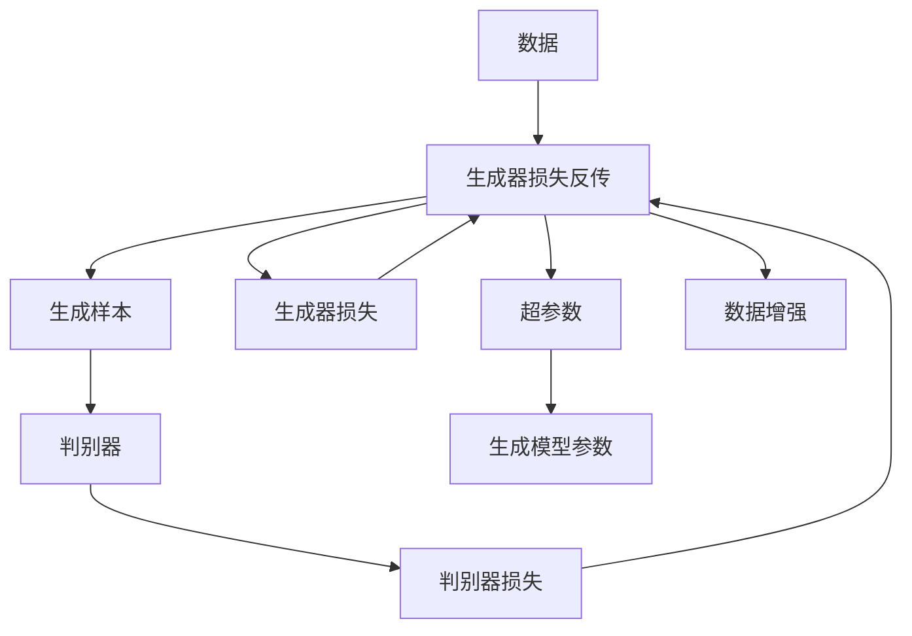

                 

# 生成式AIGC：数据与商业的深度融合

在信息技术飞速发展的今天，人工智能（AI）正在深刻改变着商业世界的运作模式，其中生成式AI（Generative AI，AIGC）技术的崛起尤为引人注目。作为AI领域的前沿技术，生成式AI结合了大数据和机器学习的方法，能够自主生成内容，从而在广告、娱乐、设计、教育等多个领域产生广泛而深远的影响。本文将深入探讨生成式AI的核心概念、算法原理、应用场景及其未来发展趋势，旨在为读者提供一个全面的视角，了解这一技术如何推动数据与商业的深度融合。

## 1. 背景介绍

### 1.1 问题由来
生成式AI技术的起源可以追溯到20世纪50年代，其发展历程与深度学习、神经网络、大数据等技术的演进紧密相关。近年来，随着深度学习模型的日益复杂化，特别是以GANs（生成式对抗网络）、VAEs（变分自编码器）等为代表的生成模型被引入，生成式AI在图像、音频、文本等多个领域取得了显著的进展。

生成式AI的核心目标是通过对大量数据的学习，自主生成高质量的输出，涵盖图片、音乐、视频、自然语言等多种形式。它在内容创作、产品设计、虚拟现实、增强现实等应用中展现出巨大潜力。然而，尽管生成式AI技术已经取得了显著成果，其实际应用仍面临诸多挑战，例如模型的泛化能力、生成内容的可解释性、用户接受度等。

### 1.2 问题核心关键点
生成式AI涉及的关键点包括：

- **数据驱动**：生成式AI的核心是数据，大量高质量的数据是其训练的基础。
- **模型选择**：选择合适的生成模型，如GANs、VAEs、扩散模型等，是生成式AI成功的关键。
- **生成质量**：生成的内容必须具有高度逼真性和多样性，才能满足用户需求。
- **应用场景**：生成式AI在不同场景下的具体应用方式，如广告生成、虚拟试衣、教育模拟等。
- **伦理与隐私**：生成式AI在生成内容过程中必须尊重用户隐私，避免生成有害信息。

### 1.3 问题研究意义
生成式AI技术的研究具有重要意义：

1. **内容生产自动化**：通过生成式AI，内容生产能够从劳动密集型转变为技术密集型，提升生产效率和质量。
2. **用户体验优化**：生成式AI能够创造出高度个性化的内容，提升用户体验。
3. **市场竞争优势**：通过提供独特的、创新性的内容，企业可以在市场中脱颖而出。
4. **数据利用**：生成式AI能够充分利用海量数据，挖掘其中的价值，创造新的商业机会。
5. **知识传播**：通过自动生成内容，生成式AI可以促进知识的普及和传播。

## 2. 核心概念与联系

### 2.1 核心概念概述

生成式AI涉及多个核心概念，包括：

- **生成模型**：如GANs、VAEs、扩散模型等，用于学习数据分布并生成新数据。
- **数据增强**：通过数据扩充技术，提高生成模型的泛化能力。
- **超参数调优**：通过调整生成模型的超参数，优化生成效果。
- **生成对抗网络（GANs）**：通过两个对抗神经网络（一个生成器和一个判别器）进行训练，生成逼真的数据。
- **变分自编码器（VAEs）**：通过编码器和解码器的结构，学习数据的概率分布并进行重构。
- **扩散模型（Diffusion Models）**：利用时间步进的噪声扩散过程，生成高质量的样本。

### 2.2 核心概念原理和架构的 Mermaid 流程图



此流程图展示了生成式AI的基本流程：首先，收集和准备数据；然后，通过生成模型学习数据的分布，生成新的样本；接着，使用判别器对生成的样本进行评估，并更新生成器的参数，以产生更高质量的样本。超参数的调整和数据增强的引入，进一步优化生成过程。

## 3. 核心算法原理 & 具体操作步骤

### 3.1 算法原理概述

生成式AI的核心算法原理涉及生成模型的训练过程，通常包括以下几个步骤：

1. **数据准备**：收集和处理数据，确保数据的质量和多样性。
2. **模型选择**：根据任务需求选择合适的生成模型，如GANs、VAEs、扩散模型等。
3. **模型训练**：通过生成器生成数据，判别器评估生成数据的真实性，两者相互对抗，不断优化生成器的输出。
4. **超参数调优**：通过调整生成模型的超参数，提升生成效果。
5. **评估与优化**：通过评估指标（如FID、IS、Inception Score等）评估生成效果，根据评估结果进行优化。

### 3.2 算法步骤详解

以GANs为例，其训练过程包括以下几个关键步骤：

1. **生成器（Generator）训练**：生成器通过学习数据分布，生成假数据。训练过程中，生成器的目标是最小化生成的数据与真实数据之间的差异。
2. **判别器（Discriminator）训练**：判别器通过学习数据分布，判断输入数据是真实数据还是生成数据。训练过程中，判别器的目标是最大化区分真实数据和生成数据的能力。
3. **对抗训练**：生成器和判别器相互对抗，生成器试图欺骗判别器，而判别器则试图正确区分真实数据和生成数据。
4. **损失函数**：使用交叉熵等损失函数，衡量生成器和判别器的输出差异。
5. **迭代优化**：通过反向传播算法，不断调整生成器和判别器的参数，直至收敛。

### 3.3 算法优缺点

生成式AI的优点包括：

- **自动化生成**：能够自动生成高质量的内容，提高生产效率。
- **多样性**：生成的内容具有高度多样性，满足不同用户的需求。
- **可扩展性**：能够扩展到不同领域，如自然语言生成、图像生成等。

其缺点包括：

- **模型复杂**：生成式AI模型通常较为复杂，训练和调优难度较大。
- **数据需求**：需要大量高质量的数据进行训练，数据获取和处理成本较高。
- **伦理与隐私**：生成的内容可能包含有害信息，且在生成过程中涉及数据隐私问题。
- **可解释性**：生成的内容缺乏可解释性，难以理解生成过程。

### 3.4 算法应用领域

生成式AI广泛应用于多个领域，具体包括：

- **内容创作**：自动生成新闻、博客、小说等文本内容。
- **广告设计**：自动生成广告图像、视频等。
- **虚拟试衣**：通过3D模型自动生成服装搭配，提供虚拟试衣体验。
- **教育培训**：自动生成教学视频、模拟实验等，提升教育效果。
- **娱乐与游戏**：生成音乐、电影场景等，丰富用户体验。

## 4. 数学模型和公式 & 详细讲解 & 举例说明

### 4.1 数学模型构建

生成式AI的数学模型通常包括两个部分：生成模型和判别模型。以下以GANs为例，展示其数学模型构建过程。

**生成模型**：
设生成器为 $G_{\theta}$，输入为噪声向量 $z$，输出为样本 $x$。生成过程可以表示为：
$$
x = G_{\theta}(z)
$$
其中，$z \sim p(z)$ 表示噪声向量 $z$ 的分布。

**判别模型**：
设判别器为 $D_{\phi}$，输入为样本 $x$，输出为真实性评分 $y$。判别过程可以表示为：
$$
y = D_{\phi}(x)
$$
判别器的目标是最大化真实数据的评分，最小化生成数据的评分。

### 4.2 公式推导过程

GANs的目标函数为：
$$
\min_G \max_D V(G, D) = -\mathbb{E}_{x \sim p_{data}(x)}[\log D(x)] - \mathbb{E}_{z \sim p(z)}[\log (1 - D(G(z)))]
$$
其中，$V(G, D)$ 为生成器与判别器的对抗损失函数。生成器 $G$ 的目标是最小化对抗损失函数，而判别器 $D$ 的目标是最大化对抗损失函数。

### 4.3 案例分析与讲解

以GANs在图像生成中的应用为例：

1. **数据准备**：收集并处理图像数据，确保数据的多样性和丰富性。
2. **模型选择**：选择适当的生成模型，如DCGAN、WGAN等。
3. **训练过程**：使用随机噪声向量作为输入，生成图像。判别器评估生成图像的真实性，并更新生成器的参数。
4. **结果展示**：生成器输出高质量的图像，用于各种应用场景，如艺术创作、游戏设计等。

## 5. 项目实践：代码实例和详细解释说明

### 5.1 开发环境搭建

生成式AI的开发环境搭建通常需要以下几个步骤：

1. **安装Python**：推荐使用Anaconda或Miniconda，确保Python环境稳定。
2. **安装深度学习框架**：如TensorFlow、PyTorch、Keras等。
3. **安装生成模型库**：如TensorFlow-GAN、PyTorch-GAN等。
4. **安装数据处理库**：如Pandas、NumPy、SciPy等。
5. **安装可视化工具**：如Matplotlib、Seaborn等。

### 5.2 源代码详细实现

以PyTorch实现GANs为例，以下是一个简化的代码示例：

```python
import torch
import torch.nn as nn
import torch.optim as optim
from torchvision import datasets, transforms

class Generator(nn.Module):
    def __init__(self):
        super(Generator, self).__init__()
        self.encoder = nn.Sequential(
            nn.Linear(100, 256),
            nn.LeakyReLU(0.2, inplace=True),
            nn.Linear(256, 512),
            nn.LeakyReLU(0.2, inplace=True),
            nn.Linear(512, 784),
            nn.Tanh()
        )
    
    def forward(self, x):
        x = self.encoder(x)
        return x

class Discriminator(nn.Module):
    def __init__(self):
        super(Discriminator, self).__init__()
        self.encoder = nn.Sequential(
            nn.Linear(784, 512),
            nn.LeakyReLU(0.2, inplace=True),
            nn.Linear(512, 256),
            nn.LeakyReLU(0.2, inplace=True),
            nn.Linear(256, 1),
            nn.Sigmoid()
        )
    
    def forward(self, x):
        x = self.encoder(x)
        return x

# 数据准备
transform = transforms.Compose([transforms.ToTensor(), transforms.Normalize((0.5, 0.5, 0.5), (0.5, 0.5, 0.5))])
mnist = datasets.MNIST('data', train=True, download=True, transform=transform)
train_loader = torch.utils.data.DataLoader(mnist, batch_size=64, shuffle=True)

# 模型定义
G = Generator()
D = Discriminator()

# 定义损失函数
criterion = nn.BCELoss()
optimizerG = optim.Adam(G.parameters(), lr=0.0002)
optimizerD = optim.Adam(D.parameters(), lr=0.0002)

# 训练过程
for epoch in range(100):
    for i, (img, _) in enumerate(train_loader):
        real_images = img.view(-1, 784)
        batch_size = real_images.size(0)

        # 生成器训练
        optimizerG.zero_grad()
        z = torch.randn(batch_size, 100)
        fake_images = G(z)
        g_loss = criterion(D(fake_images), torch.ones(batch_size, 1))
        g_loss.backward()
        optimizerG.step()

        # 判别器训练
        optimizerD.zero_grad()
        real_loss = criterion(D(real_images), torch.ones(batch_size, 1))
        fake_loss = criterion(D(fake_images.detach()), torch.zeros(batch_size, 1))
        d_loss = (real_loss + fake_loss) / 2
        d_loss.backward()
        optimizerD.step()

    if epoch % 10 == 0:
        print(f'Epoch {epoch+1}, G Loss: {g_loss.item()}, D Loss: {d_loss.item()}')
```

### 5.3 代码解读与分析

以上代码展示了GANs的基本训练过程：

1. **模型定义**：定义生成器和判别器的结构，包括线性层、LeakyReLU激活函数等。
2. **损失函数**：使用二元交叉熵损失函数，衡量生成器和判别器的输出差异。
3. **优化器**：使用Adam优化器进行模型参数的更新。
4. **数据准备**：从MNIST数据集中获取训练数据，并进行标准化处理。
5. **训练过程**：在每个epoch中，使用随机噪声向量生成假图像，并同时训练生成器和判别器。通过不断迭代，生成器生成更逼真的图像，判别器评估生成图像的真实性。

## 6. 实际应用场景

### 6.1 广告生成

生成式AI在广告生成中的应用，能够自动生成高质量的广告图像和视频，提升广告的吸引力和转化率。例如，使用GANs生成具有吸引力的广告图像，或使用视频生成模型制作富有创意的广告视频，能够显著提升用户体验和广告效果。

### 6.2 虚拟试衣

虚拟试衣技术结合了生成式AI和计算机视觉技术，通过生成3D人体模型和服装模型，提供虚拟试衣体验。用户可以实时查看不同服装的穿搭效果，提高购物体验和决策效率。

### 6.3 教育模拟

生成式AI在教育领域的应用，能够自动生成教学视频、模拟实验等，提供个性化的学习体验。例如，使用文本生成模型自动生成教材，或使用视频生成模型制作教学演示视频，能够提升教育效果和资源利用效率。

### 6.4 未来应用展望

未来，生成式AI将在更多领域得到应用，推动数据与商业的深度融合：

1. **个性化推荐**：通过生成式AI生成个性化推荐内容，提升用户体验和满意度。
2. **医疗诊断**：生成高质量的医学图像和报告，辅助医生进行诊断和治疗决策。
3. **金融分析**：生成金融数据和报告，提供个性化投资建议和风险分析。
4. **艺术创作**：生成艺术作品，提升创作效率和多样性。
5. **城市规划**：生成城市设计方案，优化城市规划和资源配置。

## 7. 工具和资源推荐

### 7.1 学习资源推荐

1. **《深度学习》（Ian Goodfellow等）**：深度学习领域的经典教材，涵盖了生成式AI的基础知识和前沿技术。
2. **Coursera深度学习课程**：由斯坦福大学提供的深度学习课程，包含生成式AI的详细介绍和实践案例。
3. **Arxiv预印本**：包含大量关于生成式AI的最新研究成果，是获取前沿信息的宝贵资源。

### 7.2 开发工具推荐

1. **PyTorch**：开源深度学习框架，易于上手，支持动态图和静态图。
2. **TensorFlow**：Google开发的深度学习框架，生产部署方便，支持分布式训练。
3. **Keras**：高级神经网络API，易于使用，支持多种后端。
4. **Weights & Biases**：模型训练的实验跟踪工具，记录和可视化训练过程。
5. **TensorBoard**：TensorFlow配套的可视化工具，实时监测模型训练状态。

### 7.3 相关论文推荐

1. **Image-to-Image Translation with Conditional Adversarial Networks**（Isola等）：提出了使用条件GANs进行图像翻译的创新方法，广泛应用于图像生成和图像处理领域。
2. **DiscoGAN: A Simple Generative Adversarial Network Model for Real-Time and Full-Resolution Image-to-Image Translation**（Kim等）：提出了使用DiscoGAN进行实时图像翻译的方法，提升了生成模型的效率和性能。
3. **Adversarial Networks for Generating Filmed Speech**（Chen等）：提出了使用GANs生成语音的技术，应用于语音合成和语音识别领域。
4. **Neural Text Generation with Continuous Semantic Composition**（Li等）：提出了使用变分自编码器进行文本生成的技术，应用于自然语言处理和机器翻译领域。
5. **Generative Adversarial Nets**（Goodfellow等）：GANs的开创性论文，奠定了生成式AI的理论基础。

## 8. 总结：未来发展趋势与挑战

### 8.1 研究成果总结

生成式AI在多个领域取得了显著成果，推动了数据与商业的深度融合。其主要成果包括：

1. **高质量内容生成**：自动生成高质量的文本、图像、视频等内容，提升了内容生产效率。
2. **用户体验优化**：提供了个性化和互动性强的用户体验，提升了用户满意度。
3. **资源利用效率**：利用大规模数据，提升了资源利用效率，降低了生产成本。

### 8.2 未来发展趋势

未来，生成式AI将在以下几个方向继续发展：

1. **更高效模型**：开发更加高效的生成模型，降低计算和存储成本。
2. **更高质量生成**：提升生成的内容质量，满足更严格的应用需求。
3. **跨领域应用**：拓展到更多领域，如医疗、金融、城市规划等。
4. **自动化部署**：实现自动化部署，简化使用流程，降低技术门槛。
5. **伦理与隐私**：注重生成内容的伦理和隐私问题，确保内容安全。

### 8.3 面临的挑战

尽管生成式AI取得了显著成果，但仍面临诸多挑战：

1. **模型复杂性**：生成式AI模型复杂，训练和优化难度较大。
2. **数据需求高**：生成式AI需要大量高质量的数据进行训练，数据获取和处理成本较高。
3. **伦理与隐私**：生成的内容可能包含有害信息，且在生成过程中涉及数据隐私问题。
4. **可解释性**：生成的内容缺乏可解释性，难以理解生成过程。
5. **计算资源需求高**：生成高质量内容需要高计算资源，设备成本较高。

### 8.4 研究展望

未来的研究方向包括：

1. **模型压缩与优化**：开发更高效、更轻量级的生成模型，降低计算和存储成本。
2. **跨领域生成**：拓展到更多领域，提升生成内容的多样性和适用性。
3. **自动化生成系统**：实现自动化的内容生成系统，简化用户使用流程。
4. **可解释性与伦理性**：提升生成内容的可解释性和伦理性，确保内容安全与透明。

总之，生成式AI是数据与商业融合的重要推动力量，未来将在更多领域发挥重要作用。然而，技术发展的过程中需要不断解决挑战，才能实现更好的应用效果。

## 9. 附录：常见问题与解答

### Q1: 生成式AI与传统AI有什么区别？

**A1**：生成式AI与传统AI的主要区别在于，生成式AI能够自主生成内容，而传统AI更多依赖于已有数据进行分类、预测等任务。生成式AI在内容创作、广告设计、虚拟试衣等领域具有更强的优势。

### Q2: 生成式AI的训练过程复杂吗？

**A2**：生成式AI的训练过程相对复杂，涉及生成模型和判别模型的对抗训练，需要大量的数据和计算资源。但通过合理的超参数调优和数据增强，可以优化训练过程，提升生成效果。

### Q3: 生成式AI是否会影响就业市场？

**A3**：生成式AI的应用确实会对一些低技能劳动市场产生影响，但也将创造新的就业机会，如内容创作、数据标注等。此外，AI技术的发展也促进了技能升级和职业转型，有助于提升就业市场的整体竞争力。

### Q4: 如何评估生成式AI的效果？

**A4**：生成式AI的效果评估通常通过以下指标：FID（Frechet Inception Distance）、IS（Inception Score）、KL（Kullback-Leibler divergence）等。这些指标衡量生成内容的逼真度、多样性和分布一致性。

### Q5: 生成式AI的商业应用前景如何？

**A5**：生成式AI在广告、娱乐、设计、教育等多个领域展现出巨大商业应用前景。通过自动生成内容，生成式AI能够提高生产效率、提升用户体验、优化资源配置，为商业带来新的价值。

综上所述，生成式AI正在深刻改变商业世界的运作模式，推动数据与商业的深度融合。然而，生成式AI的发展也面临着诸多挑战，需要在技术、伦理、隐私等方面进行持续探索和优化。通过不断突破和创新，生成式AI将在更多领域发挥重要作用，为人类社会带来新的变革和机遇。

---

作者：禅与计算机程序设计艺术 / Zen and the Art of Computer Programming

