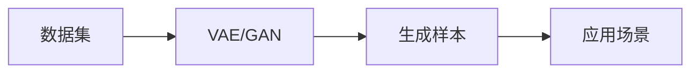

                 

## 1. 背景介绍

### 1.1 问题由来

随着人工智能技术的快速发展和应用领域的不断扩大，生成式人工智能（Generative AI, AIGC）正在成为引领下一波技术潮流的核心引擎。AIGC以生成模型（如GPT-3、DALL-E等）为代表，通过深度学习技术从大量数据中学习生成新样本，其应用场景日益丰富，涵盖自然语言处理、图像生成、音乐创作、视频制作等诸多领域。

AIGC的核心价值在于其生成的内容具有高度的真实性和可解释性，可以辅助人类完成创意性工作，提升工作效率，同时为商业决策提供强有力的数据支持。然而，当前AIGC技术在商业应用中仍存在诸多挑战，如数据隐私、版权问题、生成内容质量不稳定等，亟需找到更加高效、可靠的解决方案。

### 1.2 问题核心关键点

本文聚焦于AIGC技术在数据与商业融合中的应用，分析了AIGC的生成原理和商业应用价值，探讨了其面临的挑战和解决方案，为数据驱动的商业创新提供了理论和技术指导。

## 2. 核心概念与联系

### 2.1 核心概念概述

AIGC是一种通过机器学习模型自动生成与真实数据高度相似的新样本的技术。其核心思想是通过生成模型学习大量数据中的规律，能够在给定条件或噪声下生成逼真、可解释的新数据。AIGC的应用场景广泛，包括文本生成、图像生成、音乐生成、视频制作、对话生成等。

生成模型主要分为两类：变分自编码器（Variational Autoencoder, VAE）和生成对抗网络（Generative Adversarial Network, GAN）。VAE通过学习数据的概率分布生成样本，GAN则通过对抗训练的方式，让生成器和判别器相互博弈，最终生成与真实数据几乎无法区分的样本。

VAE和GAN的不同之处在于其生成过程的数学表达和训练目标。VAE的生成过程通过重参数化采样得到，目标是最大似然估计；而GAN通过对抗训练生成样本，目标是生成器和判别器的纳什均衡。在实际应用中，VAE适用于生成连续数据（如文本、音频），GAN适用于生成离散数据（如图像、视频）。

### 2.2 核心概念原理和架构的 Mermaid 流程图



此图展示了AIGC的核心流程：首先收集数据集，然后通过VAE或GAN模型生成样本，最后将这些样本应用于各种商业场景。

## 3. 核心算法原理 & 具体操作步骤

### 3.1 算法原理概述

AIGC技术通过深度学习模型从数据中学习生成规律，并利用这种规律生成新的样本。以生成对抗网络（GAN）为例，其核心思想是通过对抗训练的方式，让生成器（Generator）学习生成逼真的样本，让判别器（Discriminator）学习区分真实样本和生成样本，最终生成器和判别器达到一种纳什均衡状态。

在商业应用中，AIGC技术可以通过生成高质量的仿真数据，提升数据分析和决策的准确性。例如，在金融领域，AIGC可以生成逼真的金融交易数据，用于风险评估和策略优化；在医疗领域，AIGC可以生成仿真病历，用于医学研究和临床试验。

### 3.2 算法步骤详解

AIGC的具体步骤如下：

1. 数据收集：收集大量相关领域的数据，构建训练集。
2. 模型训练：使用VAE或GAN模型对训练集进行训练，生成器学习生成样本，判别器学习区分样本。
3. 样本生成：在生成器模型中固定判别器，仅微调生成器参数，生成高质量的仿真数据。
4. 商业应用：将生成的仿真数据应用于各个商业场景，提升数据分析和决策效果。

### 3.3 算法优缺点

AIGC的优点在于其生成样本的高质量和多样性，能够有效支持商业决策。同时，AIGC可以处理大规模数据，提升数据处理的效率。然而，AIGC也存在数据隐私、版权问题、生成内容质量不稳定等缺点。

数据隐私问题：生成样本可能包含敏感信息，导致数据泄露。解决策略包括数据匿名化、差分隐私等技术。

版权问题：生成样本可能侵犯原始数据的版权。解决策略包括版权验证、开源数据等。

生成内容质量不稳定：生成的样本质量可能受到模型参数、训练数据的影响。解决策略包括模型调优、多模型集成等。

### 3.4 算法应用领域

AIGC技术已经在金融、医疗、媒体、广告等领域得到了广泛应用。以下是几个典型应用场景：

#### 3.4.1 金融

在金融领域，AIGC可以生成逼真的交易数据，用于风险评估和策略优化。例如，生成仿真交易数据进行历史回测，测试不同策略的效果；生成仿真客户行为数据，优化个性化推荐和客户服务。

#### 3.4.2 医疗

在医疗领域，AIGC可以生成仿真病历，用于医学研究和临床试验。例如，生成仿真患者病历，用于医学研究中的数据分析和假设检验；生成仿真医疗影像，用于辅助诊断和治疗方案设计。

#### 3.4.3 媒体

在媒体领域，AIGC可以生成高质量的内容，辅助新闻报道和内容创作。例如，生成仿真新闻报道，提高新闻报道的生成效率和质量；生成仿真影视作品，辅助影视作品的创作和剪辑。

## 4. 数学模型和公式 & 详细讲解

### 4.1 数学模型构建

以生成对抗网络（GAN）为例，其数学模型可以表示为：

- 生成器（Generator）：将随机噪声 $z \sim N(0,1)$ 映射为样本 $x$，即 $G(z)$。
- 判别器（Discriminator）：评估样本 $x$ 是否为真实样本，输出 $D(x)$。
- 目标函数：生成器的目标是最大化生成样本的似然，判别器的目标是最大化区分真实样本和生成样本的概率。

目标函数可以表示为：

$$
\min_G \max_D V(D,G) = \mathbb{E}_{x \sim p_{data}} [\log D(x)] + \mathbb{E}_{z \sim p(z)} [\log (1 - D(G(z)))]
$$

其中 $p_{data}$ 为真实数据分布，$p(z)$ 为噪声分布。

### 4.2 公式推导过程

生成器和判别器的训练过程可以表示为：

- 生成器训练：最小化生成样本的似然，即最大化 $\log D(G(z))$。
- 判别器训练：最大化区分真实样本和生成样本的概率，即最大化 $\log D(x)$ 和 $\log (1 - D(G(z)))$。

对于生成器，其目标函数可以表示为：

$$
\min_G \mathbb{E}_{z \sim p(z)} \log D(G(z))
$$

对于判别器，其目标函数可以表示为：

$$
\max_D \mathbb{E}_{x \sim p_{data}} [\log D(x)] + \mathbb{E}_{z \sim p(z)} [\log (1 - D(G(z)))]
$$

在训练过程中，通过交替更新生成器和判别器的参数，使得生成器和判别器达到一种纳什均衡状态。

### 4.3 案例分析与讲解

以GAN生成图像为例，假设有如下真实图像数据集和噪声数据集：

- 真实图像数据集：$x_1, x_2, ..., x_n$
- 噪声数据集：$z_1, z_2, ..., z_m$

生成器 $G(z)$ 将噪声数据集 $z$ 映射为图像数据集 $x$，判别器 $D(x)$ 评估图像数据集 $x$ 是否为真实图像数据集 $x$。

在训练过程中，生成器和判别器交替更新参数。生成器试图生成逼真的图像数据集 $x$，使得判别器难以区分；判别器试图区分真实图像数据集 $x$ 和生成图像数据集 $x$。

最终，生成器和判别器达到一种纳什均衡状态，生成器能够生成逼真的图像数据集 $x$，判别器能够准确区分真实图像数据集 $x$ 和生成图像数据集 $x$。

## 5. 项目实践：代码实例和详细解释说明

### 5.1 开发环境搭建

在进行AIGC开发前，我们需要准备好开发环境。以下是使用Python进行TensorFlow开发的环境配置流程：

1. 安装Anaconda：从官网下载并安装Anaconda，用于创建独立的Python环境。

2. 创建并激活虚拟环境：
```bash
conda create -n aigc-env python=3.8 
conda activate aigc-env
```

3. 安装TensorFlow：根据CUDA版本，从官网获取对应的安装命令。例如：
```bash
conda install tensorflow tensorflow-gpu=2.7.0=cudatoolkit=11.1 -c pytorch -c conda-forge
```

4. 安装其他必要的工具包：
```bash
pip install numpy scipy matplotlib scikit-learn tqdm jupyter notebook ipython
```

完成上述步骤后，即可在`aigc-env`环境中开始AIGC开发实践。

### 5.2 源代码详细实现

以下是使用TensorFlow实现GAN生成图像的代码示例：

```python
import tensorflow as tf
from tensorflow.keras import layers

# 定义生成器和判别器
def make_generator_model():
    model = tf.keras.Sequential()
    model.add(layers.Dense(256, use_bias=False, input_shape=(100,)))
    model.add(layers.BatchNormalization())
    model.add(layers.LeakyReLU(alpha=0.2))
    model.add(layers.Dense(512))
    model.add(layers.BatchNormalization())
    model.add(layers.LeakyReLU(alpha=0.2))
    model.add(layers.Dense(1024))
    model.add(layers.BatchNormalization())
    model.add(layers.LeakyReLU(alpha=0.2))
    model.add(layers.Dense(784, activation='tanh'))
    return model

def make_discriminator_model():
    model = tf.keras.Sequential()
    model.add(layers.Flatten(input_shape=(28, 28, 1)))
    model.add(layers.Dense(1024))
    model.add(layers.LeakyReLU(alpha=0.2))
    model.add(layers.Dropout(0.4))
    model.add(layers.Dense(512))
    model.add(layers.LeakyReLU(alpha=0.2))
    model.add(layers.Dropout(0.4))
    model.add(layers.Dense(1, activation='sigmoid'))
    return model

# 定义损失函数
def make_loss():

    def discriminator_loss(real_output, fake_output):
        real_loss = real_output_loss(real_output, real_labels)
        fake_loss = fake_output_loss(fake_output, fake_labels)
        total_loss = real_loss + fake_loss
        return total_loss

    def generator_loss(fake_output):
        return fake_output_loss(fake_output, real_labels)

    return discriminator_loss, generator_loss

# 定义数据集
(x_train, y_train), (x_test, y_test) = tf.keras.datasets.mnist.load_data()
x_train = x_train / 255.0
x_test = x_test / 255.0

# 定义输入占位符
latent_dim = 100
random_noise = tf.keras.Input(shape=(latent_dim, ), name='random_noise')
generated_images = generator(random_noise)

# 定义模型编译
generator_optimizer = tf.keras.optimizers.Adam(1e-4)
discriminator_optimizer = tf.keras.optimizers.Adam(1e-4)

generator.compile(loss=generator_loss, optimizer=generator_optimizer)
discriminator.compile(loss=discriminator_loss, optimizer=discriminator_optimizer)

# 训练模型
for epoch in range(epochs):
    real_images = x_train
    random_latent_vectors = tf.random.normal([batch_size, latent_dim])

    with tf.GradientTape() as gen_tape, tf.GradientTape() as disc_tape:
        generated_images = generator(random_latent_vectors)
        real_output = discriminator(real_images)
        fake_output = discriminator(generated_images)

        gen_loss = generator_loss(fake_output)
        disc_loss = discriminator_loss(real_output, fake_output)

    gradients_of_generator = gen_tape.gradient(gen_loss, generator.trainable_variables)
    gradients_of_discriminator = disc_tape.gradient(disc_loss, discriminator.trainable_variables)

    generator_optimizer.apply_gradients(zip(gradients_of_generator, generator.trainable_variables))
    discriminator_optimizer.apply_gradients(zip(gradients_of_discriminator, discriminator.trainable_variables))

# 运行测试集
generated_images = generator(tf.random.normal([1, latent_dim]))
```

### 5.3 代码解读与分析

我们通过代码示例展示了如何使用TensorFlow实现GAN生成图像。

首先，我们定义了生成器和判别器，这两个模型分别用于生成图像和评估图像的真实性。生成器模型由多个全连接层和激活函数构成，通过将随机噪声映射为图像数据，生成逼真的图像。判别器模型由多个全连接层和激活函数构成，通过评估图像的真实性，输出概率。

接着，我们定义了损失函数，分别用于优化生成器和判别器。判别器的损失函数由真实样本和生成样本的损失组成，目标是最小化真实样本的损失，最大化生成样本的损失。生成器的损失函数由生成样本的损失组成，目标是最小化生成样本的损失。

最后，我们使用优化器（Adam）编译生成器和判别器模型，并定义了训练过程。在每个epoch中，随机噪声作为输入，生成器生成图像，判别器评估图像的真实性。通过交替优化生成器和判别器的参数，使模型达到一种纳什均衡状态，生成器生成逼真的图像。

## 6. 实际应用场景

### 6.1 媒体内容创作

AIGC技术在媒体内容创作中具有广泛应用。通过生成高质量的图像、视频和音频内容，辅助新闻报道和内容创作，提高生产效率和创意性。例如，生成仿真新闻报道，用于快速生成新闻稿件；生成仿真影视作品，辅助影视作品的创作和剪辑。

### 6.2 产品设计

在产品设计中，AIGC技术可以生成高逼真的产品原型和演示视频，辅助设计师进行快速迭代和评估。例如，生成仿真产品原型，用于设计概念验证；生成仿真产品演示视频，用于展示产品功能和效果。

### 6.3 教育培训

在教育培训中，AIGC技术可以生成高质量的教材和模拟实验，辅助学生和教师进行教学和学习。例如，生成仿真实验数据，用于实验教学；生成仿真教材，用于补充教材内容。

## 7. 工具和资源推荐

### 7.1 学习资源推荐

为了帮助开发者系统掌握AIGC的理论基础和实践技巧，这里推荐一些优质的学习资源：

1. 《Deep Learning with Python》：由Francois Chollet撰写的深度学习入门书籍，深入浅出地介绍了深度学习的基础理论和实践方法。

2. TensorFlow官方文档：TensorFlow的官方文档，提供了详细的API和使用指南，是快速上手TensorFlow的必备资料。

3. HuggingFace官方文档：Transformers库的官方文档，提供了丰富的预训练语言模型和微调样例代码，是进行AIGC任务开发的利器。

4. Kaggle：数据科学竞赛平台，提供大量的数据集和模型竞赛，可以帮助开发者提高数据分析和模型构建能力。

5. Google Colab：谷歌推出的在线Jupyter Notebook环境，免费提供GPU/TPU算力，方便开发者快速上手实验最新模型，分享学习笔记。

通过对这些资源的学习实践，相信你一定能够快速掌握AIGC的精髓，并用于解决实际的商业问题。

### 7.2 开发工具推荐

高效的开发离不开优秀的工具支持。以下是几款用于AIGC开发的常用工具：

1. TensorFlow：由Google主导开发的开源深度学习框架，生产部署方便，适合大规模工程应用。

2. PyTorch：基于Python的开源深度学习框架，灵活动态的计算图，适合快速迭代研究。

3. Transformers库：HuggingFace开发的NLP工具库，集成了众多SOTA语言模型，支持TensorFlow和PyTorch，是进行AIGC任务开发的利器。

4. Weights & Biases：模型训练的实验跟踪工具，可以记录和可视化模型训练过程中的各项指标，方便对比和调优。与主流深度学习框架无缝集成。

5. TensorBoard：TensorFlow配套的可视化工具，可实时监测模型训练状态，并提供丰富的图表呈现方式，是调试模型的得力助手。

6. Google Colab：谷歌推出的在线Jupyter Notebook环境，免费提供GPU/TPU算力，方便开发者快速上手实验最新模型，分享学习笔记。

合理利用这些工具，可以显著提升AIGC任务的开发效率，加快创新迭代的步伐。

### 7.3 相关论文推荐

AIGC技术的发展源于学界的持续研究。以下是几篇奠基性的相关论文，推荐阅读：

1. Generative Adversarial Nets（即GAN论文）：由Ian Goodfellow等撰写的GAN论文，奠定了GAN理论基础，并展示了GAN在图像生成中的优越性能。

2. Improved Techniques for Training GANs（即WGAN论文）：由Jonathan Gulrajani等撰写的WGAN论文，提出了Wasserstein GAN，解决了GAN训练过程中的模式崩溃问题。

3. Variational Autoencoders for Generative Modeling（即VAE论文）：由Diederik Kingma等撰写的VAE论文，提出了VAE模型，通过学习数据的概率分布生成样本。

4. Attention Is All You Need（即Transformer论文）：由Ashish Vaswani等撰写的Transformer论文，提出了Transformer模型，为深度学习模型在NLP任务中的应用奠定了基础。

这些论文代表了大模型和AIGC技术的发展脉络。通过学习这些前沿成果，可以帮助研究者把握学科前进方向，激发更多的创新灵感。

## 8. 总结：未来发展趋势与挑战

### 8.1 总结

本文对AIGC技术在数据与商业融合中的应用进行了全面系统的介绍。首先阐述了AIGC的核心思想和商业应用价值，分析了AIGC在金融、医疗、媒体等领域的典型应用场景。其次，从原理到实践，详细讲解了AIGC的数学模型和算法步骤，给出了AIGC任务开发的完整代码实例。同时，本文还探讨了AIGC面临的挑战和解决方案，为数据驱动的商业创新提供了理论和技术指导。

通过本文的系统梳理，可以看到，AIGC技术正在成为引领下一波技术潮流的核心引擎，其生成的内容具有高度的真实性和可解释性，可以辅助人类完成创意性工作，提升工作效率，同时为商业决策提供强有力的数据支持。未来，伴随AIGC技术的不断演进，其应用范围和商业价值将进一步扩大。

### 8.2 未来发展趋势

展望未来，AIGC技术将呈现以下几个发展趋势：

1. 数据驱动的模型训练：未来AIGC模型将更加依赖于大规模数据集，通过数据增强和迁移学习等方式，提升模型的泛化能力和应用效果。

2. 多模态生成模型：AIGC将从单一模态向多模态生成模型发展，融合视觉、语音、文本等多种信息源，生成更加丰富、逼真的内容。

3. 交互式生成模型：未来AIGC模型将更加注重用户交互，通过与用户的互动，生成更加个性化、智能化的内容。

4. 可解释性增强：AIGC模型将更加注重可解释性，通过生成内容背后的逻辑和依据，增强内容生成过程的可信度和透明性。

5. 边缘计算应用：AIGC技术将进一步向边缘计算应用扩展，通过低延迟、高带宽的边缘设备，实现实时生成和推理，提升用户体验。

6. 开放性和社区共建：AIGC技术将更加注重开放性，通过开源模型、开放数据等方式，促进社区共建和共享，推动技术的普及和应用。

以上趋势凸显了AIGC技术的广阔前景。这些方向的探索发展，必将进一步提升AIGC系统的性能和应用范围，为商业决策提供更强大的数据支持。

### 8.3 面临的挑战

尽管AIGC技术已经取得了瞩目成就，但在迈向更加智能化、普适化应用的过程中，它仍面临着诸多挑战：

1. 数据隐私问题：生成样本可能包含敏感信息，导致数据泄露。如何保护用户隐私，保障数据安全，是AIGC技术应用的重要挑战。

2. 版权问题：生成样本可能侵犯原始数据的版权。如何在生成内容的同时，遵守版权法律，避免版权纠纷，是AIGC技术应用的重大挑战。

3. 生成内容质量不稳定：生成的样本质量可能受到模型参数、训练数据的影响。如何提高生成内容的稳定性和一致性，是AIGC技术应用的重大挑战。

4. 训练成本高昂：大规模数据集和高性能计算资源的需求，使得AIGC模型的训练成本居高不下。如何降低训练成本，提升模型训练效率，是AIGC技术应用的重要挑战。

5. 生成内容缺乏人性化：AIGC技术生成的内容可能缺乏人类的情感和创意，如何赋予内容更多的人性化和创意，是AIGC技术应用的重要挑战。

6. 技术壁垒高：AIGC技术的应用需要深度学习和计算机视觉等多领域的知识和技能，如何降低技术门槛，普及AIGC技术，是AIGC技术应用的重要挑战。

以上挑战凸显了AIGC技术在商业应用中的复杂性和复杂性。解决这些问题需要技术创新、政策支持和社会共识的共同努力。

### 8.4 研究展望

面对AIGC技术面临的诸多挑战，未来的研究需要在以下几个方面寻求新的突破：

1. 引入更多先验知识：将符号化的先验知识，如知识图谱、逻辑规则等，与神经网络模型进行巧妙融合，引导AIGC模型学习更加准确、合理的语言模型。

2. 开发更多高效算法：开发更加高效的生成算法，如Transformer、GAN等，提升生成内容的质量和效率。

3. 引入多模态信息：将视觉、语音、文本等多种信息源融合，生成更加丰富、逼真的内容。

4. 增强生成内容的可解释性：通过生成内容背后的逻辑和依据，增强内容生成过程的可信度和透明性。

5. 降低训练成本：开发更加高效、可扩展的训练框架，降低大规模数据集的训练成本。

6. 提升生成内容的创意性：引入更多创意性内容生成方法，如对抗生成网络、变分自编码器等，生成更具创意性、人性化内容。

这些研究方向将推动AIGC技术迈向更高的台阶，为商业决策提供更强大的数据支持，推动技术的普及和应用。

## 9. 附录：常见问题与解答

**Q1：AIGC技术在商业应用中有哪些潜在的风险？**

A: AIGC技术在商业应用中可能面临以下风险：

1. 数据隐私风险：生成的样本可能包含敏感信息，导致数据泄露。

2. 版权风险：生成的样本可能侵犯原始数据的版权，引发版权纠纷。

3. 误导性风险：生成的内容可能存在误导性，导致用户误解或错误决策。

4. 公平性风险：生成的内容可能存在偏见，导致不公平的决策结果。

5. 可信度风险：生成的内容缺乏可信度，导致用户对内容产生怀疑或不信任。

6. 伦理风险：生成的内容可能存在伦理问题，如虚假新闻、诽谤等。

7. 自动化风险：生成的内容可能缺乏人类情感和创意，导致内容缺乏人性化。

这些风险需要在使用AIGC技术时加以注意，并采取相应的风险控制措施。例如，采用差分隐私技术保护用户隐私，使用开源数据避免版权纠纷，引入伦理指导委员会对内容进行审核等。

**Q2：如何评估AIGC技术的性能？**

A: 评估AIGC技术的性能可以从以下几个方面进行：

1. 数据集质量：评估数据集的多样性和代表性，确保数据集能够涵盖多种场景和情况。

2. 生成内容质量：评估生成内容的逼真度、多样性、一致性等，确保内容能够满足业务需求。

3. 生成速度：评估生成内容的效率，确保在业务场景中能够实时生成高质量内容。

4. 可解释性：评估生成内容背后的逻辑和依据，确保内容生成过程的可信度和透明性。

5. 用户体验：评估生成内容的用户体验，确保内容能够被用户接受和使用。

6. 业务效果：评估生成内容在业务场景中的应用效果，确保内容能够提升业务效果和用户体验。

以上指标可以从不同角度评估AIGC技术的性能，帮助业务决策和应用评估。

**Q3：如何处理AIGC技术在商业应用中的偏见问题？**

A: 处理AIGC技术在商业应用中的偏见问题可以从以下几个方面进行：

1. 数据预处理：在训练过程中，使用多样化的数据集，确保数据集能够覆盖不同的群体和场景，避免数据偏见。

2. 模型设计：在模型设计中，引入偏见校正技术，如公平性约束、偏见校正算法等，确保模型输出无偏见。

3. 伦理审核：在内容生成过程中，引入伦理指导委员会对内容进行审核，确保内容符合伦理标准。

4. 用户反馈：在内容发布后，及时收集用户反馈，对存在偏见的内容进行调整和优化。

5. 持续优化：在模型训练和内容生成过程中，不断优化模型参数和生成策略，确保模型输出无偏见。

这些措施可以有效减少AIGC技术在商业应用中的偏见问题，提升内容生成过程的公平性和透明性。

**Q4：如何优化AIGC技术在商业应用中的训练成本？**

A: 优化AIGC技术在商业应用中的训练成本可以从以下几个方面进行：

1. 模型压缩：通过模型压缩技术，减少模型参数和计算量，降低训练成本。

2. 分布式训练：使用分布式训练技术，加速模型训练，提高训练效率。

3. 迁移学习：通过迁移学习技术，利用已训练好的模型，加速新模型的训练，降低训练成本。

4. 数据增强：通过数据增强技术，增加训练数据量，提高模型泛化能力，减少训练成本。

5. 硬件优化：使用高性能计算设备，如GPU、TPU等，加速模型训练，降低训练成本。

6. 优化算法：使用高效的优化算法，如Adam、SGD等，加速模型训练，降低训练成本。

这些措施可以有效降低AIGC技术在商业应用中的训练成本，提升模型训练效率。

**Q5：如何提高AIGC技术在商业应用中的可解释性？**

A: 提高AIGC技术在商业应用中的可解释性可以从以下几个方面进行：

1. 引入可解释模型：在模型设计中，使用可解释性强的模型，如决策树、规则系统等，提高模型的可解释性。

2. 生成内容解释：在生成内容过程中，提供生成内容背后的逻辑和依据，增强内容生成过程的可信度和透明性。

3. 用户反馈机制：在内容生成过程中，引入用户反馈机制，及时收集用户反馈，对生成内容进行调整和优化。

4. 可视化工具：使用可视化工具，展示模型训练和内容生成过程，增强内容的可解释性。

5. 模型审计：在模型训练和内容生成过程中，进行模型审计，发现并解决模型问题，提高模型的可信度。

这些措施可以有效提高AIGC技术在商业应用中的可解释性，增强内容生成过程的透明性和可信度。

---

作者：禅与计算机程序设计艺术 / Zen and the Art of Computer Programming

