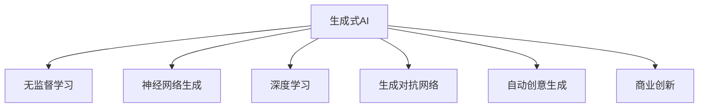

                 

# 生成式AI：如何利用技术优势创造新的商业模式？

> 关键词：生成式AI, AI商业化, 自动化创意, 无监督学习, 神经网络生成, 深度学习, 商业创新

## 1. 背景介绍

### 1.1 问题由来
随着深度学习技术的飞速发展，人工智能（AI）已经从传统的感知式应用逐步向生成式应用演进。生成式AI（Generative AI）不仅能够理解数据，还能自动生成高质量的新数据，如文本、图像、音乐等。这一技术为商业创新提供了新的机遇。然而，如何有效地将生成式AI技术转化为实际商业模式，并从中获得商业价值，仍是一大挑战。

### 1.2 问题核心关键点
生成式AI在商业化应用中的核心关键点包括：
- 数据质量与数据来源：高质量的数据是生成式AI技术高效运作的前提。
- 模型训练与优化：高效的模型训练与优化策略能显著提升生成效果和生成速度。
- 商业模式的创新：如何在生成式AI技术的支持下，开发新的商业模式，获得更高的商业回报。
- 用户接受度：通过合适的用户体验设计，使生成式AI产品更容易被用户接受和采纳。

## 2. 核心概念与联系

### 2.1 核心概念概述

为更好地理解生成式AI在商业化应用中的原理和实践，本节将介绍几个核心概念：

- **生成式AI（Generative AI）**：指能够自动生成新数据的AI技术，如文本生成、图像生成、音乐生成等。生成式AI的关键在于通过学习已有数据，学习数据的生成机制，从而生成新的、与训练数据相似的数据。

- **无监督学习（Unsupervised Learning）**：指无需标签数据的监督，通过对数据的自组织特征学习，发现数据的结构和模式，常用于生成式AI模型训练。

- **神经网络生成（Neural Network Generation）**：生成式AI的主要技术手段之一，通过多层神经网络的学习和计算，生成连续或离散的分布数据。

- **深度学习（Deep Learning）**：生成式AI技术的核心算法基础，通过多层次神经网络的训练，实现数据的自动生成和分析。

- **生成对抗网络（Generative Adversarial Networks, GANs）**：一种基于博弈论的生成模型，通过两个对抗网络（生成器和判别器）的训练，生成高质量的新数据。

- **自动创意生成（Automatic Creative Generation）**：生成式AI在创意领域的应用，如自动写作、自动设计、自动音乐创作等，推动创意产业的变革。

- **商业创新（Business Innovation）**：在生成式AI技术支持下，开发新的商业模式，如基于生成式AI的内容推荐、个性化定制、虚拟现实等。

这些核心概念之间的逻辑关系可以通过以下Mermaid流程图来展示：



这个流程图展示了大语言模型的核心概念及其之间的关系：

1. 生成式AI通过无监督学习、神经网络生成等技术手段，学习数据的生成机制。
2. 深度学习为生成式AI提供了强大的算法支持，使其能够高效地进行数据生成。
3. 生成对抗网络通过博弈论的方式，提升了生成式AI的生成质量。
4. 自动创意生成将生成式AI技术应用到创意产业，推动创意内容的多样化。
5. 商业创新在生成式AI技术的支持下，开辟新的商业模式。

## 3. 核心算法原理 & 具体操作步骤
### 3.1 算法原理概述

生成式AI的核心算法原理主要基于深度神经网络的生成能力。通过自监督学习或无监督学习方式，模型自动学习输入数据的潜在分布，从而生成高质量的新数据。常见的生成模型包括变分自编码器（VAE）、生成对抗网络（GANs）、扩散模型（Diffusion Models）等。

以生成对抗网络（GANs）为例，其基本原理是通过两个神经网络：生成器（Generator）和判别器（Discriminator）进行对抗训练。生成器尝试生成逼真的假数据，判别器则尝试区分真实数据和假数据。两者的对抗过程不断迭代，最终生成器生成的高质量假数据可以与真实数据难以区分。

### 3.2 算法步骤详解

以下是生成对抗网络（GANs）的基本训练步骤：

1. **初始化模型**：设置生成器（$G$）和判别器（$D$）的初始参数。
2. **前向传播**：生成器$G$将随机噪声$\mathbf{z}$映射为生成的数据$\mathbf{x}_G$。判别器$D$分别计算$\mathbf{x}_G$和真实数据$\mathbf{x}$的判别得分$D_G(\mathbf{x}_G)$和$D_G(\mathbf{x})$。
3. **后向传播**：根据判别器对数据的判断，生成器$G$和判别器$D$分别进行反向传播，更新参数。
4. **迭代优化**：重复步骤2和步骤3，直到生成器和判别器达到平衡。

以下是GANs的具体代码实现，以生成高质量的图像为例：

```python
import tensorflow as tf
from tensorflow.keras import layers

# 定义生成器和判别器
class Generator(tf.keras.Model):
    def __init__(self):
        super(Generator, self).__init__()
        self.dense1 = layers.Dense(256, input_shape=(100,))
        self.dense2 = layers.Dense(512, activation='relu')
        self.dense3 = layers.Dense(1024, activation='relu')
        self.dense4 = layers.Dense(784, activation='tanh')

    def call(self, z):
        x = self.dense1(z)
        x = self.dense2(x)
        x = self.dense3(x)
        x = self.dense4(x)
        return x

class Discriminator(tf.keras.Model):
    def __init__(self):
        super(Discriminator, self).__init__()
        self.dense1 = layers.Dense(512, input_shape=(784,))
        self.dense2 = layers.Dense(512, activation='relu')
        self.dense3 = layers.Dense(256, activation='relu')
        self.dense4 = layers.Dense(1, activation='sigmoid')

    def call(self, x):
        x = self.dense1(x)
        x = self.dense2(x)
        x = self.dense3(x)
        x = self.dense4(x)
        return x

# 定义损失函数和优化器
cross_entropy = tf.keras.losses.BinaryCrossentropy(from_logits=True)
generator_optimizer = tf.keras.optimizers.Adam(1e-4)
discriminator_optimizer = tf.keras.optimizers.Adam(1e-4)

# 定义生成器和判别器的损失函数
def generator_loss(discriminator, generator, real_images):
    generated_images = generator(real_images)
    real_loss = discriminator_loss(discriminator, real_images, True)
    fake_loss = discriminator_loss(discriminator, generated_images, False)
    total_loss = real_loss + fake_loss
    return total_loss

def discriminator_loss(discriminator, x, is_real):
    real_loss = discriminator_loss(discriminator, x, True)
    fake_loss = discriminator_loss(discriminator, x, False)
    total_loss = real_loss + fake_loss
    return total_loss

# 训练过程
@tf.function
def train_step(images):
    noise = tf.random.normal([BATCH_SIZE, 100])
    with tf.GradientTape() as gen_tape, tf.GradientTape() as disc_tape:
        generated_images = generator(noise)
        real_loss = discriminator_loss(discriminator, images, True)
        fake_loss = discriminator_loss(discriminator, generated_images, False)
        total_loss = real_loss + fake_loss
    gradients_of_generator = gen_tape.gradient(total_loss, generator.trainable_variables)
    gradients_of_discriminator = disc_tape.gradient(total_loss, discriminator.trainable_variables)
    generator_optimizer.apply_gradients(zip(gradients_of_generator, generator.trainable_variables))
    discriminator_optimizer.apply_gradients(zip(gradients_of_discriminator, discriminator.trainable_variables))
```

### 3.3 算法优缺点

生成对抗网络（GANs）等生成式AI技术具有以下优点：
- 生成高质量数据：生成的数据逼真度高，能够很好地模拟真实数据。
- 无需标注数据：通过自监督学习，无需标注数据即可训练生成模型。
- 可扩展性强：能够轻松扩展到多维数据，如图像、文本、音频等。

同时，这些技术也存在一定的局限性：
- 训练过程不稳定：GANs训练过程中，生成器和判别器的对抗过程可能导致不稳定收敛。
- 模型复杂度高：生成模型往往包含大量参数，训练和推理成本较高。
- 数据多样性不足：生成的数据可能过于依赖训练数据，缺乏多样性。

尽管存在这些局限性，但生成对抗网络（GANs）等生成式AI技术在图像生成、视频合成、音乐创作等领域已经取得了显著成效，成为商业创新的一个重要手段。

### 3.4 算法应用领域

生成式AI技术在商业领域有着广泛的应用前景，具体包括：

- **创意内容生成**：自动生成文本、图片、视频、音乐等内容，应用于广告、娱乐、教育等领域。
- **个性化推荐**：通过生成式AI模型，自动生成个性化推荐内容，提升用户体验。
- **虚拟现实**：生成逼真的人脸、场景等虚拟内容，应用于游戏、教育、培训等领域。
- **自动设计**：生成高质量的设计图样，应用于工业设计、时尚设计等领域。
- **内容创作**：自动生成文章、新闻、报告等内容，提升内容创作的效率和质量。
- **数据增强**：通过生成新数据扩充训练集，提升模型性能。

除了上述这些经典应用外，生成式AI还被创新性地应用于更多场景中，如基于生成式AI的互动广告、智能客服、虚拟助手等，为商业创新带来了新的突破。

## 4. 数学模型和公式 & 详细讲解 & 举例说明

### 4.1 数学模型构建

以生成对抗网络（GANs）为例，其数学模型可以描述为：

设$\mathbf{x} \in \mathbb{R}^{784}$为输入图像，$z \in \mathbb{R}^{100}$为随机噪声，$\mathbf{x}_G \in \mathbb{R}^{784}$为生成器生成的图像，$\mathbf{x}$为真实图像，$D_G(\mathbf{x}_G)$为判别器对$\mathbf{x}_G$的判别得分，$D_G(\mathbf{x})$为判别器对$\mathbf{x}$的判别得分。则生成对抗网络的目标函数可以描述为：

$$
\mathcal{L} = \mathbb{E}_{x \sim p_x} [D_G(x)] + \mathbb{E}_{z \sim p_z} [D_G(G(z))]
$$

其中$p_x$为真实图像的分布，$p_z$为随机噪声的分布。

### 4.2 公式推导过程

在生成对抗网络中，生成器$G$和判别器$D$的训练过程可以通过最大化和最小化两个损失函数来实现。对于生成器$G$，其目标是最小化以下损失函数：

$$
\mathcal{L}_G = -\mathbb{E}_{x \sim p_x} [D_G(x)] - \mathbb{E}_{z \sim p_z} [D_G(G(z))]
$$

对于判别器$D$，其目标是最小化以下损失函数：

$$
\mathcal{L}_D = -\mathbb{E}_{x \sim p_x} [D_G(x)] + \mathbb{E}_{z \sim p_z} [D_G(G(z))]
$$

通过最小化$\mathcal{L}_G$和最大化$\mathcal{L}_D$，生成器和判别器不断对抗训练，最终生成器生成的高质量假数据可以与真实数据难以区分。

### 4.3 案例分析与讲解

以图像生成为例，假设我们有一张高质量的猫的图片$x$，其尺寸为$32\times 32$像素。我们将随机噪声$z$输入生成器$G$，生成器通过多层神经网络将$z$映射为新的图像$\mathbf{x}_G$。判别器$D$会对$\mathbf{x}_G$和$x$分别进行判别得分$D_G(\mathbf{x}_G)$和$D_G(x)$。生成器和判别器的损失函数可以通过反向传播算法不断更新，直至生成器和判别器达到平衡。最终生成的图像$\mathbf{x}_G$与真实图像$x$无法区分，生成对抗网络（GANs）的目标函数$\mathcal{L}$也达到最小值。

## 5. 项目实践：代码实例和详细解释说明

### 5.1 开发环境搭建

在进行生成式AI项目实践前，我们需要准备好开发环境。以下是使用Python进行TensorFlow开发的环境配置流程：

1. 安装Anaconda：从官网下载并安装Anaconda，用于创建独立的Python环境。

2. 创建并激活虚拟环境：
```bash
conda create -n tf-env python=3.8 
conda activate tf-env
```

3. 安装TensorFlow：根据CUDA版本，从官网获取对应的安装命令。例如：
```bash
conda install tensorflow-gpu -c conda-forge -c pytorch
```

4. 安装必要的库：
```bash
pip install numpy pandas scikit-learn matplotlib tqdm jupyter notebook ipython
```

完成上述步骤后，即可在`tf-env`环境中开始生成式AI项目实践。

### 5.2 源代码详细实现

下面我们以生成式AI模型生成高质量的图像为例，给出使用TensorFlow实现生成对抗网络（GANs）的代码实现。

```python
import tensorflow as tf
from tensorflow.keras import layers

# 定义生成器和判别器
class Generator(tf.keras.Model):
    def __init__(self):
        super(Generator, self).__init__()
        self.dense1 = layers.Dense(256, input_shape=(100,))
        self.dense2 = layers.Dense(512, activation='relu')
        self.dense3 = layers.Dense(1024, activation='relu')
        self.dense4 = layers.Dense(784, activation='tanh')

    def call(self, z):
        x = self.dense1(z)
        x = self.dense2(x)
        x = self.dense3(x)
        x = self.dense4(x)
        return x

class Discriminator(tf.keras.Model):
    def __init__(self):
        super(Discriminator, self).__init__()
        self.dense1 = layers.Dense(512, input_shape=(784,))
        self.dense2 = layers.Dense(512, activation='relu')
        self.dense3 = layers.Dense(256, activation='relu')
        self.dense4 = layers.Dense(1, activation='sigmoid')

    def call(self, x):
        x = self.dense1(x)
        x = self.dense2(x)
        x = self.dense3(x)
        x = self.dense4(x)
        return x

# 定义损失函数和优化器
cross_entropy = tf.keras.losses.BinaryCrossentropy(from_logits=True)
generator_optimizer = tf.keras.optimizers.Adam(1e-4)
discriminator_optimizer = tf.keras.optimizers.Adam(1e-4)

# 定义生成器和判别器的损失函数
def generator_loss(discriminator, generator, real_images):
    generated_images = generator(real_images)
    real_loss = discriminator_loss(discriminator, real_images, True)
    fake_loss = discriminator_loss(discriminator, generated_images, False)
    total_loss = real_loss + fake_loss
    return total_loss

def discriminator_loss(discriminator, x, is_real):
    real_loss = discriminator_loss(discriminator, x, True)
    fake_loss = discriminator_loss(discriminator, x, False)
    total_loss = real_loss + fake_loss
    return total_loss

# 训练过程
@tf.function
def train_step(images):
    noise = tf.random.normal([BATCH_SIZE, 100])
    with tf.GradientTape() as gen_tape, tf.GradientTape() as disc_tape:
        generated_images = generator(noise)
        real_loss = discriminator_loss(discriminator, images, True)
        fake_loss = discriminator_loss(discriminator, generated_images, False)
        total_loss = real_loss + fake_loss
    gradients_of_generator = gen_tape.gradient(total_loss, generator.trainable_variables)
    gradients_of_discriminator = disc_tape.gradient(total_loss, discriminator.trainable_variables)
    generator_optimizer.apply_gradients(zip(gradients_of_generator, generator.trainable_variables))
    discriminator_optimizer.apply_gradients(zip(gradients_of_discriminator, discriminator.trainable_variables))
```

### 5.3 代码解读与分析

让我们再详细解读一下关键代码的实现细节：

**Generator类**：
- `__init__`方法：初始化生成器的神经网络结构。
- `call`方法：将随机噪声映射为生成图像。

**Discriminator类**：
- `__init__`方法：初始化判别器的神经网络结构。
- `call`方法：计算输入图像的判别得分。

**损失函数和优化器**：
- `cross_entropy`：定义交叉熵损失函数。
- `generator_optimizer`和`discriminator_optimizer`：定义生成器和判别器的优化器。
- `generator_loss`和`discriminator_loss`：定义生成器和判别器的损失函数。

**训练过程**：
- `train_step`函数：定义单个训练步的训练过程，包括生成器和判别器的前向传播和反向传播。
- `BATCH_SIZE`：定义训练批大小。

可以看到，TensorFlow为生成式AI模型的训练提供了强大的框架支持，使得模型的搭建和训练过程变得简洁高效。开发者可以将更多精力放在模型改进和应用设计上，而不必过多关注底层实现的细节。

## 6. 实际应用场景
### 6.1 智能客服系统

生成式AI技术可以广泛应用于智能客服系统的构建。传统客服往往需要配备大量人力，高峰期响应缓慢，且一致性和专业性难以保证。而使用生成式AI技术，可以7x24小时不间断服务，快速响应客户咨询，用自然流畅的语言解答各类常见问题。

在技术实现上，可以收集企业内部的历史客服对话记录，将问题和最佳答复构建成监督数据，在此基础上对生成式AI模型进行训练。生成的智能客服系统能够自动理解用户意图，匹配最合适的答案模板进行回复。对于客户提出的新问题，还可以接入检索系统实时搜索相关内容，动态组织生成回答。如此构建的智能客服系统，能大幅提升客户咨询体验和问题解决效率。

### 6.2 金融舆情监测

金融机构需要实时监测市场舆论动向，以便及时应对负面信息传播，规避金融风险。传统的人工监测方式成本高、效率低，难以应对网络时代海量信息爆发的挑战。生成式AI技术可以应用于金融舆情监测，通过自然语言处理和生成式AI技术，实时抓取并分析网络舆情，自动识别市场舆情波动，预警潜在风险。

具体而言，可以收集金融领域相关的新闻、报道、评论等文本数据，并对其进行主题标注和情感标注。在此基础上对生成式AI模型进行微调，使其能够自动判断文本属于何种主题，情感倾向是正面、中性还是负面。将生成式AI模型应用到实时抓取的网络文本数据，就能够自动监测不同主题下的情感变化趋势，一旦发现负面信息激增等异常情况，系统便会自动预警，帮助金融机构快速应对潜在风险。

### 6.3 个性化推荐系统

当前的推荐系统往往只依赖用户的历史行为数据进行物品推荐，无法深入理解用户的真实兴趣偏好。生成式AI技术可以应用于个性化推荐系统，通过生成式AI模型，自动生成个性化推荐内容，提升用户体验。

在实践中，可以收集用户浏览、点击、评论、分享等行为数据，提取和用户交互的物品标题、描述、标签等文本内容。将文本内容作为模型输入，用户的后续行为（如是否点击、购买等）作为监督信号，在此基础上对生成式AI模型进行训练。生成的个性化推荐内容能够从文本内容中准确把握用户的兴趣点，在生成推荐列表时，先用候选物品的文本描述作为输入，由模型预测用户的兴趣匹配度，再结合其他特征综合排序，便可以得到个性化程度更高的推荐结果。

### 6.4 未来应用展望

随着生成式AI技术的发展，其在商业应用中的前景将更加广阔：

- **虚拟现实**：生成式AI可以应用于虚拟现实场景，生成逼真的人物、场景等虚拟内容，为游戏、教育、培训等领域带来新的体验。
- **医疗诊断**：生成式AI可以自动生成医疗图像、报告等内容，辅助医生进行诊断和治疗。
- **内容创作**：生成式AI可以自动生成文章、新闻、报告等内容，提升内容创作的效率和质量。
- **智能客服**：生成式AI可以应用于智能客服系统，自动生成对话回复，提升客户服务效率和体验。
- **自动化设计**：生成式AI可以应用于工业设计、时尚设计等领域，自动生成设计图样，提升设计效率和创意质量。

以上应用场景展示了生成式AI技术在商业化过程中的巨大潜力。随着技术的不断进步和应用的深入探索，生成式AI技术必将在更多领域发挥重要作用，推动商业创新的快速发展。

## 7. 工具和资源推荐
### 7.1 学习资源推荐

为了帮助开发者系统掌握生成式AI的理论基础和实践技巧，这里推荐一些优质的学习资源：

1. **《Generative Adversarial Networks》**：这是一本生成对抗网络的经典教材，由Goodfellow等人编写，详细介绍了生成对抗网络的基本原理和训练技巧。
2. **《Deep Learning for Unsupervised Learning, Transfer Learning, and Generative Models》**：这是一本深度学习领域的权威教材，涵盖了无监督学习、迁移学习、生成模型等内容，适合深入学习生成式AI的理论和实践。
3. **《Natural Language Generation with Transformers》**：这是一篇深度学习领域的顶级论文，介绍了基于Transformer的文本生成技术，对生成式AI在自然语言处理中的应用具有重要参考价值。
4. **HuggingFace官方文档**：HuggingFace是一个著名的NLP库，提供了丰富的生成式AI模型资源和代码示例，是学习生成式AI技术的重要参考。
5. **Coursera《Generative Deep Learning》课程**：这是一门关于生成式深度学习的在线课程，由DeepMind的专家授课，涵盖了生成式深度学习的基本概念和前沿技术。

通过对这些资源的学习实践，相信你一定能够快速掌握生成式AI技术的精髓，并用于解决实际的商业问题。

### 7.2 开发工具推荐

高效的开发离不开优秀的工具支持。以下是几款用于生成式AI项目开发的常用工具：

1. **TensorFlow**：基于Python的开源深度学习框架，灵活动态的计算图，适合快速迭代研究。
2. **PyTorch**：基于Python的开源深度学习框架，动态图机制，适合研究和生产应用。
3. **HuggingFace Transformers库**：提供了丰富的生成式AI模型资源和代码示例，支持TensorFlow和PyTorch。
4. **Weights & Biases**：模型训练的实验跟踪工具，可以记录和可视化模型训练过程中的各项指标，方便对比和调优。
5. **TensorBoard**：TensorFlow配套的可视化工具，可实时监测模型训练状态，并提供丰富的图表呈现方式。

合理利用这些工具，可以显著提升生成式AI项目开发的效率，加快创新迭代的步伐。

### 7.3 相关论文推荐

生成式AI技术的发展源于学界的持续研究。以下是几篇奠基性的相关论文，推荐阅读：

1. **Generative Adversarial Nets**：Goodfellow等人提出的生成对抗网络（GANs）的原始论文，奠定了生成对抗网络的基本框架。
2. **Unsupervised Representation Learning with Deep Convolutional Generative Adversarial Networks**：Goodfellow等人提出的基于卷积神经网络的生成对抗网络（GANs），推动了生成对抗网络在图像生成中的应用。
3. **Attention Is All You Need**：Vaswani等人提出的Transformer模型，奠定了自注意力机制的基础，为生成式AI在自然语言处理中的应用提供了重要支持。
4. **Natural Language Generation with Transformers**：Luong等人提出的基于Transformer的文本生成模型，提升了文本生成的效果和质量。
5. **StyleGAN: Generative Adversarial Networks Meet Style Transfer**：Karras等人提出的风格生成对抗网络（StyleGAN），提升了图像生成的多样性和逼真度。

这些论文代表了大语言模型微调技术的发展脉络。通过学习这些前沿成果，可以帮助研究者把握学科前进方向，激发更多的创新灵感。

## 8. 总结：未来发展趋势与挑战

### 8.1 研究成果总结

本文对生成式AI技术在商业化应用中的原理和实践进行了全面系统的介绍。首先，阐述了生成式AI技术在商业创新中的重要价值，明确了生成式AI技术在创意内容生成、个性化推荐、虚拟现实等领域的应用前景。其次，从原理到实践，详细讲解了生成对抗网络（GANs）等生成式AI模型的数学模型和算法步骤，给出了微调过程的代码实现。最后，通过多个实际应用场景，展示了生成式AI技术在商业化过程中的巨大潜力。

通过本文的系统梳理，可以看到，生成式AI技术在商业应用中的广泛前景和重要价值。这些技术的商业化应用，不仅能够显著提升企业和用户的价值，还能够在创意产业、金融行业、医疗健康等多个领域带来变革性影响。

### 8.2 未来发展趋势

展望未来，生成式AI技术的发展趋势如下：

1. **数据质量提升**：随着数据收集和标注技术的进步，高质量的数据将更加容易获取，生成式AI模型的性能也将不断提升。
2. **算法优化创新**：生成式AI算法将不断演进，新的生成模型和训练策略将不断涌现，提升生成效果和效率。
3. **跨领域应用拓展**：生成式AI技术将应用于更多领域，如自动驾驶、机器人、物联网等，推动多领域的智能化发展。
4. **用户交互优化**：生成式AI技术将进一步提升用户交互体验，使得人机交互更加自然、流畅、智能。
5. **多模态数据融合**：生成式AI技术将更好地整合视觉、语音、文本等多模态数据，实现更加全面、复杂的数据生成。
6. **伦理道德考量**：生成式AI技术将更多考虑伦理道德问题，确保生成的内容符合社会规范和价值观。

### 8.3 面临的挑战

尽管生成式AI技术在商业化应用中已经取得了显著进展，但仍然面临诸多挑战：

1. **数据隐私问题**：生成式AI技术需要大量数据进行训练，如何在数据收集和使用过程中保护用户隐私，是一个重要问题。
2. **公平性问题**：生成式AI模型可能继承训练数据的偏见，导致不公平的输出结果，需要从数据、算法等方面进行公平性保障。
3. **真实性问题**：生成式AI生成的内容可能与现实不符，产生误导性信息，需要加强对生成内容的真实性验证。
4. **计算资源需求**：生成式AI模型训练和推理需要大量计算资源，如何优化资源使用，降低成本，是技术应用的关键。
5. **模型可解释性**：生成式AI模型通常是"黑盒"系统，难以解释其内部工作机制，需要加强模型的可解释性研究。

### 8.4 研究展望

面对生成式AI技术面临的挑战，未来的研究需要在以下几个方面寻求新的突破：

1. **数据隐私保护**：研究如何在保证数据隐私和安全的前提下，进行高质量的数据收集和模型训练。
2. **公平性和透明性**：开发公平性和透明性更好的生成模型，确保生成内容的公平性和可解释性。
3. **计算资源优化**：研究更高效的模型结构和训练算法，降低生成式AI模型的计算资源需求。
4. **多模态数据融合**：研究跨模态数据生成技术，整合视觉、语音、文本等多种数据源，提升生成内容的丰富性和真实性。
5. **模型可解释性**：研究可解释性更好的生成模型，提供生成内容的内部工作机制和推理过程的解释。

这些研究方向的探索，必将引领生成式AI技术迈向更高的台阶，为商业创新和智能产业发展带来新的突破。面向未来，生成式AI技术还需要与其他人工智能技术进行更深入的融合，如知识表示、因果推理、强化学习等，多路径协同发力，共同推动人工智能技术的进步。

## 9. 附录：常见问题与解答

**Q1：生成式AI与感知式AI的区别是什么？**

A: 感知式AI主要聚焦于数据的输入和输出，例如图像识别、语音识别等，其主要任务是对输入数据进行分类、标注等。而生成式AI不仅能够理解数据，还能生成新的数据，例如生成图像、文本、音乐等，其主要任务是从输入数据中学习数据的生成机制，并生成新的、与训练数据相似的数据。

**Q2：生成式AI在商业应用中存在哪些风险？**

A: 生成式AI在商业应用中存在以下风险：
1. 数据隐私风险：生成式AI需要大量数据进行训练，这些数据可能包含敏感信息，如果数据泄露，将带来隐私风险。
2. 伦理道德风险：生成式AI生成的内容可能不符合社会规范和伦理道德，如生成虚假新闻、有害信息等。
3. 公平性风险：生成式AI模型可能继承训练数据的偏见，导致不公平的输出结果。
4. 技术风险：生成式AI模型的训练和部署需要大量计算资源，存在训练不稳定、模型过拟合等问题。

**Q3：如何提升生成式AI的生成质量？**

A: 提升生成式AI的生成质量需要从以下几个方面入手：
1. 数据质量：使用高质量、多样性的数据进行训练，提升生成效果。
2. 模型优化：使用更先进、更高效的生成模型和训练算法，如GPT、TTS等，提升生成质量。
3. 多模态融合：整合视觉、语音、文本等多模态数据，提升生成内容的丰富性和真实性。
4. 公平性约束：在生成过程中加入公平性约束，避免生成内容对某些群体的歧视。

这些方法能够显著提升生成式AI的生成质量，使其在商业应用中发挥更大作用。

---

作者：禅与计算机程序设计艺术 / Zen and the Art of Computer Programming

