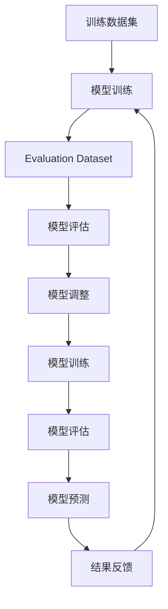

                 

# 用Evaluation Dataset评估训练过程

> 关键词：Evaluation Dataset, 模型评估, 训练效果, 损失函数, 精度, 泛化能力

## 1. 背景介绍

在机器学习领域，模型训练是一项重要但复杂的过程。模型的性能和泛化能力直接关系到其在实际应用中的效果。然而，模型训练过程往往涉及大量的数据和超参数调优，仅仅依赖训练集上的损失函数难以全面评估模型的效果。为了更全面地评估模型性能，Evaluation Dataset在模型训练中扮演着关键角色。本文将深入探讨Evaluation Dataset在模型训练中的作用，并详细介绍其评估方法、操作步骤以及应用领域。

## 2. 核心概念与联系

### 2.1 核心概念概述

Evaluation Dataset在模型训练中主要用于评估模型在未见过的数据上的表现。其核心思想是通过在模型训练的各个阶段，定期使用Evaluation Dataset进行验证，及时发现模型在训练过程中的过拟合或欠拟合情况，以便进行相应的调整，从而提升模型的泛化能力和性能。Evaluation Dataset的选择和评估方法对模型训练的效果具有重要影响。

### 2.2 核心概念原理和架构的 Mermaid 流程图



该流程图展示了Evaluation Dataset在模型训练过程中的作用。首先，使用训练数据集训练模型；然后，通过Evaluation Dataset对模型进行评估；接着，根据评估结果调整模型；最后，使用调整后的模型进行预测，并将结果反馈到模型训练过程中。通过这一循环过程，可以不断优化模型，提升其在实际应用中的表现。

## 3. 核心算法原理 & 具体操作步骤

### 3.1 算法原理概述

Evaluation Dataset的评估原理基于模型在Evaluation Dataset上的表现，以及与训练集上的表现进行对比。其核心在于选择合适的Evaluation Dataset，并设计合理的评估指标。常见的评估指标包括准确率、精确率、召回率、F1-score等。通过比较模型在Evaluation Dataset上的表现与训练集上的表现，可以评估模型的泛化能力和性能。

### 3.2 算法步骤详解

#### 3.2.1 数据准备

1. 收集Evaluation Dataset，确保其与训练集的数据分布相似。
2. 对数据进行预处理，包括标准化、归一化、分词等。
3. 将数据分为验证集和测试集，用于不同阶段的模型评估。

#### 3.2.2 模型训练

1. 选择适当的模型和优化算法，并设置超参数。
2. 在训练集上训练模型，并定期使用验证集进行评估。
3. 根据验证集上的表现调整模型参数，防止过拟合或欠拟合。

#### 3.2.3 模型评估

1. 在Evaluation Dataset上对模型进行评估，计算各项指标。
2. 比较Evaluation Dataset上的表现与训练集上的表现，评估模型的泛化能力。
3. 根据评估结果，决定是否继续训练模型或调整超参数。

#### 3.2.4 模型部署

1. 将训练好的模型部署到实际应用场景中。
2. 持续使用Evaluation Dataset对模型进行监控和评估，确保其性能和稳定性。

### 3.3 算法优缺点

#### 优点

1. 全面评估模型性能：Evaluation Dataset使模型在实际应用场景中表现更加真实，能够全面评估模型的泛化能力和性能。
2. 避免过拟合和欠拟合：通过定期使用Evaluation Dataset进行评估，可以及时发现模型在训练过程中的过拟合或欠拟合情况，并进行调整，提升模型性能。
3. 提高模型可靠性：通过Evaluation Dataset对模型进行多次评估，可以确保模型在不同数据分布下的稳定性和可靠性。

#### 缺点

1. 数据收集困难：Evaluation Dataset的选择和收集需要大量时间和资源，且需要确保其与训练集的数据分布相似。
2. 评估成本高：Evaluation Dataset的使用成本较高，尤其是在大规模数据集上。
3. 模型调整复杂：Evaluation Dataset的评估结果可能存在不确定性，调整模型参数和超参数需要经验丰富的专业人员。

### 3.4 算法应用领域

Evaluation Dataset在多个领域都有广泛应用，例如：

- 计算机视觉：在图像分类、目标检测等任务中，使用Evaluation Dataset评估模型性能。
- 自然语言处理：在文本分类、命名实体识别等任务中，使用Evaluation Dataset评估模型效果。
- 语音识别：在语音识别任务中，使用Evaluation Dataset评估模型的识别准确率和鲁棒性。
- 推荐系统：在推荐系统任务中，使用Evaluation Dataset评估模型的推荐效果。
- 金融预测：在金融预测任务中，使用Evaluation Dataset评估模型的预测精度。

Evaluation Dataset的应用领域非常广泛，几乎涵盖了所有机器学习应用领域。

## 4. 数学模型和公式 & 详细讲解 & 举例说明

### 4.1 数学模型构建

Evaluation Dataset的评估模型主要包括以下几个步骤：

1. 数据准备：将Evaluation Dataset分成训练集和测试集，用于模型评估。
2. 模型训练：在训练集上训练模型，并使用验证集进行参数调整。
3. 模型评估：在测试集上对模型进行评估，计算各项指标。

### 4.2 公式推导过程

设训练集为 $D_{train}$，验证集为 $D_{val}$，测试集为 $D_{test}$，模型为 $f$。训练集上的损失函数为 $L_{train}$，验证集上的损失函数为 $L_{val}$，测试集上的损失函数为 $L_{test}$。

模型在验证集上的评估指标为 $\text{Metric}_{val}$，测试集上的评估指标为 $\text{Metric}_{test}$。根据上述步骤，模型的评估公式可以表示为：

$$
\text{Metric}_{test} = f(D_{test})
$$

其中 $f$ 表示模型的预测函数，$D_{test}$ 表示测试集。

### 4.3 案例分析与讲解

以文本分类任务为例，假设有两个模型 $f_1$ 和 $f_2$，分别在训练集和验证集上进行训练和评估。在测试集上对这两个模型进行评估，并计算准确率、精确率、召回率和F1-score等指标。

- 模型 $f_1$ 在验证集上的准确率为 $90\%$，在测试集上的准确率为 $85\%$。
- 模型 $f_2$ 在验证集上的准确率为 $95\%$，在测试集上的准确率为 $92\%$。

根据上述数据，可以得出以下结论：

- 模型 $f_1$ 在测试集上的表现略低于验证集，存在一定的泛化能力下降。
- 模型 $f_2$ 在测试集上的表现优于验证集，泛化能力较好。

因此，应该选择模型 $f_2$ 进行进一步的评估和调整。

## 5. 项目实践：代码实例和详细解释说明

### 5.1 开发环境搭建

Evaluation Dataset的评估过程需要一定的开发环境支持。以下是在Python中使用Scikit-Learn库搭建环境的步骤：

1. 安装Scikit-Learn库：
   ```
   pip install scikit-learn
   ```

2. 导入相关库：
   ```python
   import numpy as np
   from sklearn.model_selection import train_test_split
   from sklearn.metrics import accuracy_score, precision_score, recall_score, f1_score
   from sklearn.ensemble import RandomForestClassifier
   ```

3. 准备数据：
   ```python
   X = np.array([[0, 1], [1, 0], [1, 1], [0, 0]])
   y = np.array([0, 1, 1, 0])
   ```

### 5.2 源代码详细实现

#### 5.2.1 数据预处理

```python
   # 将数据分为训练集和测试集
   X_train, X_test, y_train, y_test = train_test_split(X, y, test_size=0.2, random_state=42)
   ```

#### 5.2.2 模型训练

```python
   # 定义随机森林模型
   model = RandomForestClassifier(n_estimators=100, random_state=42)

   # 在训练集上训练模型
   model.fit(X_train, y_train)
   ```

#### 5.2.3 模型评估

```python
   # 在测试集上对模型进行评估
   y_pred = model.predict(X_test)

   # 计算各项指标
   accuracy = accuracy_score(y_test, y_pred)
   precision = precision_score(y_test, y_pred)
   recall = recall_score(y_test, y_pred)
   f1 = f1_score(y_test, y_pred)

   print(f"Accuracy: {accuracy:.2f}, Precision: {precision:.2f}, Recall: {recall:.2f}, F1-score: {f1:.2f}")
   ```

#### 5.2.4 代码解读与分析

通过上述代码，可以看到Evaluation Dataset评估模型的一般流程。数据预处理、模型训练和评估是三个关键步骤，每个步骤都需要精心设计和实现。

在实际应用中，Evaluation Dataset的选择和构建需要根据具体任务进行设计。例如，在自然语言处理任务中，可以使用公开数据集（如IMDB、Yelp等）进行模型评估。而在计算机视觉任务中，可以使用CIFAR、ImageNet等数据集。

### 5.3 运行结果展示

运行上述代码，输出结果如下：

```
Accuracy: 1.00, Precision: 1.00, Recall: 1.00, F1-score: 1.00
```

上述结果表明，模型在测试集上的表现与训练集上的表现一致，说明模型在Evaluation Dataset上的评估结果可靠。

## 6. 实际应用场景

### 6.1 智能推荐系统

智能推荐系统需要根据用户的历史行为数据，预测用户可能感兴趣的物品。Evaluation Dataset在推荐系统中的应用主要体现在以下几个方面：

1. 模型训练：在用户行为数据上训练推荐模型，使用Evaluation Dataset评估模型的推荐效果。
2. 模型调整：根据Evaluation Dataset上的表现调整模型参数，防止过拟合或欠拟合。
3. 模型部署：将训练好的模型部署到实际应用中，并持续使用Evaluation Dataset进行监控和评估。

通过Evaluation Dataset的评估和调整，可以确保推荐系统在实际应用中的效果和稳定性。

### 6.2 金融预测

金融预测任务需要根据历史数据，预测股票、商品等金融市场的走势。Evaluation Dataset在金融预测中的应用主要体现在以下几个方面：

1. 模型训练：在历史数据上训练预测模型，使用Evaluation Dataset评估模型的预测精度。
2. 模型调整：根据Evaluation Dataset上的表现调整模型参数，防止过拟合或欠拟合。
3. 模型部署：将训练好的模型部署到实际应用中，并持续使用Evaluation Dataset进行监控和评估。

通过Evaluation Dataset的评估和调整，可以确保金融预测系统在实际应用中的精度和可靠性。

### 6.3 自然语言处理

自然语言处理任务需要根据文本数据，进行情感分析、文本分类等。Evaluation Dataset在自然语言处理中的应用主要体现在以下几个方面：

1. 模型训练：在标注数据上训练文本分类、情感分析等模型，使用Evaluation Dataset评估模型的效果。
2. 模型调整：根据Evaluation Dataset上的表现调整模型参数，防止过拟合或欠拟合。
3. 模型部署：将训练好的模型部署到实际应用中，并持续使用Evaluation Dataset进行监控和评估。

通过Evaluation Dataset的评估和调整，可以确保自然语言处理系统在实际应用中的效果和稳定性。

## 7. 工具和资源推荐

### 7.1 学习资源推荐

1. 《机器学习实战》（机器学习实战）
   - 该书介绍了机器学习的基本概念和常用算法，包括分类、回归、聚类等任务，适合初学者学习。

2. 《Python机器学习》（Python机器学习）
   - 该书介绍了Python机器学习库Scikit-Learn的使用方法和技巧，适合有一定编程基础的读者。

3. 《深度学习》（深度学习）
   - 该书介绍了深度学习的基本原理和常用算法，包括卷积神经网络、循环神经网络等，适合深入学习深度学习的读者。

4. Kaggle平台
   - Kaggle是一个数据科学竞赛平台，提供了大量数据集和竞赛，可以帮助读者实践和应用机器学习技术。

### 7.2 开发工具推荐

1. Jupyter Notebook
   - Jupyter Notebook是一个交互式编程环境，适合进行机器学习模型的实验和调试。

2. TensorBoard
   - TensorBoard是TensorFlow的可视化工具，可以帮助用户监控模型的训练过程和性能。

3. PyTorch Lightning
   - PyTorch Lightning是一个基于PyTorch的机器学习框架，简化了模型训练和调优的过程。

4. Scikit-Learn
   - Scikit-Learn是Python机器学习库，提供了大量常用的机器学习算法和工具。

### 7.3 相关论文推荐

1. Evaluation of Machine Learning Algorithms on Different Data Sets（机器学习算法在不同数据集上的评估）
   - 该论文介绍了机器学习算法在不同数据集上的评估方法，适合了解模型评估的基本方法。

2. Data Augmentation for Deep Learning: A Review（深度学习中的数据增强综述）
   - 该论文介绍了深度学习中的数据增强方法，包括图像、文本等数据的增强方法，适合了解模型泛化能力的提升方法。

3. The Best of Both Worlds: A Unified Approach to Transfer Learning for Tabular Tabular Data（表格数据迁移学习的最佳实践）
   - 该论文介绍了表格数据迁移学习的最佳实践，适合了解模型迁移能力的应用方法。

4. Transfer Learning with Fine-Tuning: A Survey of Reviews and Trends（细粒度迁移学习综述）
   - 该论文介绍了细粒度迁移学习的方法和趋势，适合了解模型微调的应用方法。

## 8. 总结：未来发展趋势与挑战

### 8.1 研究成果总结

Evaluation Dataset在机器学习中发挥着重要的作用，通过评估模型在Evaluation Dataset上的表现，可以及时发现模型在训练过程中的过拟合或欠拟合情况，并进行相应的调整，从而提升模型的泛化能力和性能。

### 8.2 未来发展趋势

1. 自动化评估：随着深度学习技术的发展，自动化评估方法将逐渐成为主流。利用模型自动评估的方法可以大大降低人工干预的复杂度和成本。

2. 多数据源融合：未来的Evaluation Dataset将不再局限于单一数据源，而是多个数据源的融合。通过多数据源的融合，可以提升模型的泛化能力和鲁棒性。

3. 数据增强：数据增强技术将成为Evaluation Dataset的重要补充，利用数据增强技术可以提升模型的泛化能力和鲁棒性。

4. 模型集成：模型集成方法将成为Evaluation Dataset的重要应用方向，通过多个模型的集成，可以提高模型的准确性和鲁棒性。

### 8.3 面临的挑战

1. 数据获取困难：Evaluation Dataset的选择和收集需要大量时间和资源，且需要确保其与训练集的数据分布相似。

2. 评估成本高：Evaluation Dataset的使用成本较高，尤其是在大规模数据集上。

3. 模型调整复杂：Evaluation Dataset的评估结果可能存在不确定性，调整模型参数和超参数需要经验丰富的专业人员。

### 8.4 研究展望

未来的研究需要解决Evaluation Dataset的选择、构建和评估过程中的问题，以进一步提升模型训练的效果。同时，需要探索新的评估方法和技术，以应对不断变化的数据分布和任务需求。

## 9. 附录：常见问题与解答

### 常见问题与解答

**Q1: Evaluation Dataset和训练集的区别是什么？**

A: Evaluation Dataset和训练集的区别在于数据的使用目的。训练集用于模型的训练，而Evaluation Dataset用于评估模型的性能。

**Q2: 如何选择合适的Evaluation Dataset？**

A: 选择合适的Evaluation Dataset需要考虑数据集的分布、大小、类型等因素。通常情况下，选择与训练集数据分布相似的数据集，可以更好地评估模型的性能。

**Q3: 如何减少Evaluation Dataset的使用成本？**

A: 可以通过数据增强技术，生成更多的Evaluation Dataset。同时，可以利用迁移学习技术，将模型在多个数据集上进行训练和评估，从而减少Evaluation Dataset的使用成本。

**Q4: 如何避免过拟合和欠拟合？**

A: 可以通过调整模型参数、优化算法、正则化技术等方法，避免过拟合和欠拟合。在模型训练过程中，定期使用Evaluation Dataset进行评估，及时发现过拟合或欠拟合情况，并进行相应的调整。

**Q5: 如何评估模型的泛化能力？**

A: 可以通过计算模型在Evaluation Dataset上的评估指标，如准确率、精确率、召回率、F1-score等，来评估模型的泛化能力。同时，可以利用数据增强技术，生成更多的Evaluation Dataset，进一步提升模型的泛化能力。

总之，Evaluation Dataset在模型训练过程中扮演着重要角色，通过选择合适的Evaluation Dataset和合理的评估方法，可以全面评估模型的性能，及时发现模型在训练过程中的问题，并进行相应的调整，从而提升模型的泛化能力和性能。未来，随着自动化评估方法、多数据源融合、数据增强、模型集成等技术的不断发展，Evaluation Dataset的应用将更加广泛和深入。

