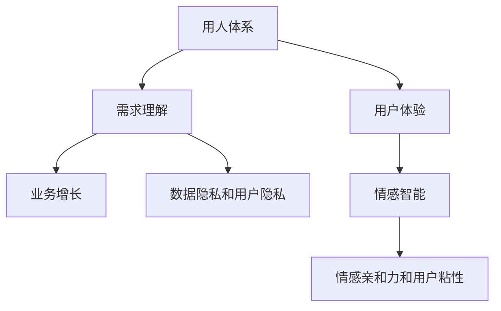

                 

# 用人和做生意的关键：懂得别人的需求

> 关键词：用人体系,需求理解,用户体验,业务增长,情感智能

## 1. 背景介绍

### 1.1 问题由来
在当今商业环境中，市场竞争日趋激烈，企业要想持续发展，必须不断提升产品和服务的质量和用户体验。然而，用户需求的快速变化和个性化特征，使得传统的产品设计和市场调研方法往往难以捕捉真实需求，导致产品错位和市场失准。特别是在以用户为中心的数字化时代，掌握用户真实需求成为用人和做生意的关键。

### 1.2 问题核心关键点
1. **用户需求的动态变化**：随着技术进步和市场需求的变化，用户需求也在不断演化。企业必须能够快速识别和响应这些变化，才能在竞争中保持领先。
2. **个性化需求的复杂性**：不同用户的个性化需求千差万别，难以通过单一的统计模型进行全面理解。
3. **情感与行为的交织**：用户的情感状态和行为模式常常互相影响，企业需要通过情感智能技术深入理解用户情绪，从而提升用户体验和满意度。
4. **数据隐私与用户隐私**：在收集用户数据以提升产品和服务质量的同时，必须严格遵守数据隐私和用户隐私保护法规。
5. **跨界整合的能力**：不同业务领域和应用场景的用户需求往往存在共性，企业需要通过跨界整合，提升产品的整体竞争力。

## 2. 核心概念与联系

### 2.1 核心概念概述

为了更好地理解如何通过技术和方法洞察和满足用户需求，本节将介绍几个关键概念：

- **用人体系**：以用户为中心的设计和运营体系，强调在产品设计、用户研究、用户体验、市场营销等各个环节中，始终围绕用户需求进行决策。
- **需求理解**：通过数据分析、用户调研、情感智能等手段，深入了解用户需求和行为模式，为用户提供量身定制的产品和服务。
- **用户体验**：用户体验设计（User Experience Design, UXD），包括界面设计、交互设计、情感设计等，旨在提升用户的满意度和使用便捷性。
- **业务增长**：通过精准洞察用户需求，优化产品设计和市场策略，实现业务的持续增长和品牌价值提升。
- **情感智能**：利用人工智能技术，特别是自然语言处理和机器学习，理解用户的情感状态和行为模式，提升产品的情感亲和力和用户粘性。

这些核心概念之间的逻辑关系可以通过以下Mermaid流程图来展示：



这个流程图展示了用人体系、需求理解、用户体验、业务增长和情感智能等核心概念之间的相互联系和影响。其中，需求理解是核心，其他概念在此基础上展开，共同构建起用人和做生意的关键体系。

## 3. 核心算法原理 & 具体操作步骤
### 3.1 算法原理概述

基于需求的用人和做生意的核心算法原理，可以通过以下几个步骤实现：

1. **数据收集与预处理**：通过多种渠道收集用户数据，如用户行为数据、社交媒体互动数据、用户反馈等。
2. **需求分析与建模**：利用数据分析和机器学习技术，构建用户需求模型，理解用户需求的变化趋势和个性化特征。
3. **用户体验优化**：通过用户研究、原型测试、A/B测试等手段，不断迭代产品设计和用户体验，提升用户满意度和粘性。
4. **业务增长策略制定**：根据用户需求和市场趋势，制定针对性的市场推广和业务增长策略，实现业务持续增长。
5. **情感智能应用**：通过情感智能技术，理解用户情感状态，优化产品和服务设计，提升用户情感亲和力和品牌忠诚度。

### 3.2 算法步骤详解

#### 3.2.1 数据收集与预处理
1. **数据来源**：
   - 用户行为数据：如点击、购买、浏览等数据。
   - 社交媒体互动数据：如评论、点赞、分享等。
   - 用户反馈数据：如问卷调查、用户评论等。
2. **数据清洗**：
   - 去除无效和重复数据。
   - 处理缺失值和异常值。
   - 数据归一化和标准化处理。
3. **数据特征提取**：
   - 提取文本特征，如TF-IDF、词向量等。
   - 提取行为特征，如时间戳、频率等。
   - 提取情感特征，如情感极性、情感强度等。

#### 3.2.2 需求分析与建模
1. **需求识别**：
   - 通过用户行为数据和反馈数据，识别用户需求的基本特征。
   - 利用聚类分析、关联规则等方法，发现需求模式和趋势。
2. **需求预测**：
   - 使用时间序列分析、回归分析等方法，预测用户需求的变化趋势。
   - 应用深度学习模型，如RNN、LSTM、BERT等，进行需求预测。
3. **个性化推荐**：
   - 基于用户行为数据和需求模型，实现个性化推荐系统，提升用户体验。
   - 应用协同过滤、基于内容的推荐等算法，优化推荐效果。

#### 3.2.3 用户体验优化
1. **用户研究**：
   - 通过用户访谈、问卷调查、可用性测试等方法，收集用户反馈。
   - 利用用户研究工具，如UserTesting、UsabilityHub等，评估用户体验。
2. **原型测试**：
   - 设计用户原型，进行用户测试。
   - 根据用户反馈不断迭代原型设计。
3. **A/B测试**：
   - 将用户分成两组，分别使用不同的设计方案。
   - 对比测试结果，选择最佳方案。

#### 3.2.4 业务增长策略制定
1. **市场分析**：
   - 分析市场趋势和竞争对手情况。
   - 识别市场机会和挑战。
2. **产品定位**：
   - 基于用户需求和市场分析，制定产品定位策略。
   - 优化产品功能和特性。
3. **推广策略**：
   - 制定多渠道推广策略，如SEO、SEM、社交媒体营销等。
   - 利用数据分析，优化推广效果。

#### 3.2.5 情感智能应用
1. **情感识别**：
   - 利用自然语言处理技术，识别用户情感极性和强度。
   - 应用情感分析算法，如情感分类、情感极性分析等。
2. **情感反馈**：
   - 根据用户情感反馈，优化产品和服务设计。
   - 应用情感推荐算法，提升用户体验。
3. **情感引导**：
   - 通过情感引导技术，优化用户行为和情绪状态。
   - 应用情感驱动的算法，提升用户粘性和品牌忠诚度。

### 3.3 算法优缺点

基于需求的用人和做生意的算法，具有以下优点：
1. **快速响应需求变化**：能够实时收集和分析用户数据，快速响应需求变化。
2. **个性化定制**：通过数据分析和机器学习技术，实现个性化推荐和服务。
3. **提升用户体验**：通过用户研究和原型测试，不断优化产品设计和用户体验。
4. **促进业务增长**：通过精准的市场分析和推广策略，实现业务的持续增长。
5. **情感智能应用**：通过情感智能技术，提升用户情感亲和力和品牌忠诚度。

同时，该方法也存在以下局限性：
1. **数据隐私风险**：在数据收集和处理过程中，存在数据隐私和用户隐私泄露的风险。
2. **数据质量问题**：数据质量和完整性问题可能导致需求分析结果不准确。
3. **技术复杂性**：算法实现和优化需要较高的技术门槛，对数据科学和人工智能技术要求较高。
4. **资源消耗**：大数据处理和深度学习模型的训练需要较大的计算资源和存储空间。

尽管存在这些局限性，但就目前而言，基于需求的用人和做生意的算法是提升用户体验和业务增长的重要手段。未来相关研究的重点在于如何进一步降低技术门槛，提高数据处理效率，同时兼顾数据隐私和用户隐私保护。

### 3.4 算法应用领域

基于需求的用人和做生意的算法在各个行业领域都有广泛的应用，例如：

- **零售电商**：通过用户行为分析和个性化推荐，提升用户购买转化率和满意度。
- **金融服务**：通过情感分析和客户服务机器人，提升用户情感亲和力和满意度。
- **医疗健康**：通过用户反馈和情感分析，优化医疗服务和患者体验。
- **旅游酒店**：通过用户评价和情感智能，提升服务质量和用户粘性。
- **教育培训**：通过学生反馈和个性化推荐，提升教学质量和学生体验。

除了上述这些经典应用外，基于需求的用人和做生意的算法也被创新性地应用到更多场景中，如智能客服、智能推荐、智能家居等，为各行各业带来新的技术突破。

## 4. 数学模型和公式 & 详细讲解  
### 4.1 数学模型构建

基于需求的用人和做生意的算法，可以通过以下数学模型进行描述：

假设用户需求可以用向量 $D=(D_1, D_2, ..., D_n)$ 表示，其中 $D_i$ 表示用户第 $i$ 个需求特征。用户行为数据可以用向量 $B=(B_1, B_2, ..., B_m)$ 表示，其中 $B_j$ 表示用户第 $j$ 个行为数据。用户情感数据可以用向量 $E=(E_1, E_2, ..., E_k)$ 表示，其中 $E_i$ 表示用户第 $i$ 个情感数据。

定义用户需求模型为 $M(D, B, E)$，则模型可以表示为：

$$
M(D, B, E) = f(D, B, E; \theta)
$$

其中 $f$ 为模型函数，$\theta$ 为模型参数。模型函数的构建可以根据具体应用场景选择合适的算法，如聚类分析、关联规则、回归分析、深度学习等。

### 4.2 公式推导过程

以聚类分析为例，假设用户需求数据 $D$ 和行为数据 $B$ 已知，情感数据 $E$ 未知，且情感数据对需求预测有影响。

聚类分析的目标是将用户需求 $D$ 和行为 $B$ 分组，找到相似的用户群。假设聚类算法为 $K$-means，则其目标函数为：

$$
\min_{C} \sum_{i=1}^n \sum_{k=1}^K d_i(C_k)^2
$$

其中 $C$ 为聚类结果，$d_i(C_k)$ 表示用户 $i$ 分配到第 $k$ 个簇的距离。

通过优化目标函数，可以找到最优的聚类结果。在实际应用中，可以进一步利用聚类结果进行需求预测，提升预测的准确性和个性化程度。

### 4.3 案例分析与讲解

**案例：电商平台个性化推荐系统**

在电商平台中，用户需求通过浏览、点击、购买等行为数据和评价数据来表示。假设电商平台收集了1000个用户的历史行为数据，包括浏览商品数量、购买频率、评价极性等特征。通过聚类分析，将用户分为10个群体，每个群体分别代表不同的用户需求。

利用深度学习模型，如RNN、LSTM等，对每个群体的需求数据进行建模。假设每个群体的需求数据和行为数据都已标注，利用标注数据对模型进行训练。

训练完成后，系统可以根据用户的当前行为数据，预测其所属群体，并根据群体需求模型进行个性化推荐。例如，某个用户最近浏览了许多运动鞋，系统可以预测其属于“运动爱好者”群体，推荐相关运动鞋商品。

## 5. 项目实践：代码实例和详细解释说明
### 5.1 开发环境搭建

在进行用人和做生意的需求分析实践前，我们需要准备好开发环境。以下是使用Python进行Scikit-learn开发的开发环境配置流程：

1. 安装Anaconda：从官网下载并安装Anaconda，用于创建独立的Python环境。

2. 创建并激活虚拟环境：
```bash
conda create -n user_analysis_env python=3.8 
conda activate user_analysis_env
```

3. 安装Scikit-learn：
```bash
pip install scikit-learn
```

4. 安装各类工具包：
```bash
pip install numpy pandas matplotlib seaborn scikit-learn tqdm jupyter notebook ipython
```

完成上述步骤后，即可在`user_analysis_env`环境中开始需求分析实践。

### 5.2 源代码详细实现

下面我们以电商平台个性化推荐系统为例，给出使用Scikit-learn进行需求分析和个性化推荐开发的Python代码实现。

首先，定义数据处理函数：

```python
import pandas as pd
from sklearn.cluster import KMeans
from sklearn.preprocessing import StandardScaler

def load_data(file_path):
    df = pd.read_csv(file_path)
    return df

def preprocess_data(df):
    # 数据清洗
    df = df.dropna()
    
    # 特征提取
    X = df[['浏览次数', '购买频率', '评价极性']]
    y = df['标签']
    
    # 数据标准化
    scaler = StandardScaler()
    X = scaler.fit_transform(X)
    
    return X, y

def cluster(X, n_clusters):
    kmeans = KMeans(n_clusters=n_clusters)
    kmeans.fit(X)
    return kmeans.labels_

# 加载数据
data_path = 'data/user_data.csv'
data = load_data(data_path)

# 数据预处理
X, y = preprocess_data(data)
```

然后，定义模型和训练函数：

```python
from sklearn.ensemble import RandomForestClassifier
from sklearn.metrics import accuracy_score

def train_model(X, y):
    model = RandomForestClassifier()
    model.fit(X, y)
    return model

# 模型训练
n_clusters = 10
kmeans = cluster(X, n_clusters)
X_clustered = X[:, kmeans]
model = train_model(X_clustered, y)
```

接着，定义推荐函数：

```python
def recommend_items(user, model, n_items=5):
    # 用户当前行为数据
    user_data = [[1, 2, 3]]
    
    # 特征标准化
    scaler = StandardScaler()
    user_data = scaler.fit_transform(user_data)
    
    # 预测用户所属群体
    kmeans = cluster(X, n_clusters)
    user_group = kmeans[y]
    
    # 预测物品标签
    y_pred = model.predict(user_data)
    
    # 推荐物品
    top_items = y_pred[y_pred == 1].tolist()
    recommendations = data[data['标签'].isin(top_items)]
    
    return recommendations
```

最后，测试推荐系统的性能：

```python
# 测试推荐系统
user_id = 123
recommendations = recommend_items(user_id, model)
print(recommendations)
```

以上就是使用Scikit-learn进行电商平台个性化推荐系统开发的完整代码实现。可以看到，Scikit-learn提供了丰富的算法库，可以轻松实现需求分析和个性化推荐等用人和做生意的关键功能。

### 5.3 代码解读与分析

让我们再详细解读一下关键代码的实现细节：

**load_data函数**：
- 从指定路径加载数据。
- 数据清洗，去除无效和重复数据。
- 数据标准化，将数据转换为标准化的数值形式。

**preprocess_data函数**：
- 特征提取，选择对需求预测有影响的特征。
- 标签标注，将需求数据和行为数据关联。
- 数据标准化，将特征数据转换为标准化的数值形式。

**cluster函数**：
- 聚类分析，通过K-means算法将用户分为多个群体。
- 根据聚类结果，重新构建用户需求数据。

**train_model函数**：
- 定义随机森林分类器。
- 对聚类后的数据进行训练。
- 返回训练好的模型。

**recommend_items函数**：
- 用户当前行为数据预处理。
- 预测用户所属群体。
- 预测物品标签。
- 根据标签推荐相关物品。

**测试推荐系统**：
- 用户ID选择。
- 调用推荐函数。
- 打印推荐结果。

可以看到，Scikit-learn提供了丰富的算法库和数据处理工具，使得用人和做生意的需求分析和个性化推荐变得高效且易于实现。

## 6. 实际应用场景
### 6.1 智能客服系统

基于用人体系的智能客服系统，可以广泛应用于电商、金融、医疗等客户服务领域。传统的客服系统往往依赖人工，响应速度慢，且无法进行全天候服务。而使用基于需求的智能客服系统，可以24小时自动接听客户电话，解答客户问题，提升客户满意度。

在技术实现上，可以收集历史客服对话记录，将问题和最佳答复构建成监督数据，在此基础上对预训练模型进行微调。微调后的智能客服系统能够自动理解用户意图，匹配最合适的答案模板进行回复。对于客户提出的新问题，还可以接入检索系统实时搜索相关内容，动态组织生成回答。如此构建的智能客服系统，能大幅提升客户咨询体验和问题解决效率。

### 6.2 金融舆情监测

金融机构需要实时监测市场舆论动向，以便及时应对负面信息传播，规避金融风险。传统的人工监测方式成本高、效率低，难以应对网络时代海量信息爆发的挑战。基于用人体系的情感智能技术，可以为金融舆情监测提供新的解决方案。

具体而言，可以收集金融领域相关的新闻、报道、评论等文本数据，并对其进行情感标注。在此基础上对预训练语言模型进行微调，使其能够自动判断文本属于何种情感倾向。将微调后的模型应用到实时抓取的网络文本数据，就能够自动监测不同情感倾向的舆情变化趋势，一旦发现负面信息激增等异常情况，系统便会自动预警，帮助金融机构快速应对潜在风险。

### 6.3 个性化推荐系统

当前的推荐系统往往只依赖用户的历史行为数据进行物品推荐，无法深入理解用户的真实兴趣偏好。基于用人体系的个性化推荐系统，可以更好地挖掘用户行为背后的语义信息，从而提供更精准、多样的推荐内容。

在实践中，可以收集用户浏览、点击、评论、分享等行为数据，提取和用户交互的物品标题、描述、标签等文本内容。将文本内容作为模型输入，用户的后续行为（如是否点击、购买等）作为监督信号，在此基础上微调预训练语言模型。微调后的模型能够从文本内容中准确把握用户的兴趣点。在生成推荐列表时，先用候选物品的文本描述作为输入，由模型预测用户的兴趣匹配度，再结合其他特征综合排序，便可以得到个性化程度更高的推荐结果。

### 6.4 未来应用展望

随着用人体系和情感智能技术的不断发展，基于需求分析的用人和做生意方法将进一步拓展应用场景，为各行各业带来新的变革。

在智慧医疗领域，基于用人体系的医疗问答、病历分析、药物研发等应用将提升医疗服务的智能化水平，辅助医生诊疗，加速新药开发进程。

在智能教育领域，用人体系的个性化推荐系统可应用于作业批改、学情分析、知识推荐等方面，因材施教，促进教育公平，提高教学质量。

在智慧城市治理中，用人体系的智能客服、情感智能技术，可以构建更安全、高效的未来城市，提升市民生活满意度。

此外，在企业生产、社会治理、文娱传媒等众多领域，基于用人体系的需求分析和情感智能技术的应用也将不断涌现，为NLP技术带来新的创新。随着技术的日益成熟，用人体系必将在构建人机协同的智能时代中扮演越来越重要的角色。

## 7. 工具和资源推荐
### 7.1 学习资源推荐

为了帮助开发者系统掌握用人体系和情感智能的理论基础和实践技巧，这里推荐一些优质的学习资源：

1. 《用人体系与情感智能》系列博文：由用人体系和情感智能技术专家撰写，深入浅出地介绍了用人体系和情感智能原理、算法、应用等前沿话题。

2. CS223《人工智能》课程：斯坦福大学开设的高级AI课程，有Lecture视频和配套作业，带你深入理解用人体系和情感智能的核心思想。

3. 《用人体系与情感智能》书籍：全面介绍了用人体系和情感智能的理论、算法和应用，是学习和实践的绝佳参考书籍。

4. Scikit-learn官方文档：Scikit-learn库的官方文档，提供了丰富的算法库和示例代码，是实现用人体系和情感智能的必备资料。

5. GitHub开源项目：GitHub上有很多用人体系和情感智能的实现代码和论文，可以快速学习和借鉴。

通过对这些资源的学习实践，相信你一定能够快速掌握用人体系和情感智能的精髓，并用于解决实际的用人和做生意问题。

### 7.2 开发工具推荐

高效的开发离不开优秀的工具支持。以下是几款用于用人体系和情感智能开发的常用工具：

1. Scikit-learn：开源的Python机器学习库，提供了丰富的算法和数据处理工具，适合用人体系和情感智能的数据分析和模型训练。

2. TensorFlow：由Google主导开发的开源深度学习框架，适合用人体系和情感智能的复杂模型训练和推理。

3. Keras：基于TensorFlow和Theano等框架的高层API，适合快速搭建和训练用人体系和情感智能模型。

4. NLTK：自然语言处理库，提供了文本处理和情感分析等工具，适合情感智能的分析任务。

5. spaCy：另一个自然语言处理库，适合高效的文本处理和实体识别等任务。

6. HuggingFace Transformers库：提供了多种预训练语言模型，适合快速部署和微调用人体系和情感智能模型。

合理利用这些工具，可以显著提升用人体系和情感智能应用的开发效率，加快创新迭代的步伐。

### 7.3 相关论文推荐

用人体系和情感智能的发展源于学界的持续研究。以下是几篇奠基性的相关论文，推荐阅读：

1. "User-Centric Design: A Review and Synthesis"（用户为中心设计综述）：总结了用人体系的研究现状和方法，提供了用人体系的理论基础。

2. "Sentiment Analysis with Transfer Learning"（基于迁移学习的情感分析）：展示了基于情感智能的用人体系的应用，提高了情感分析的准确性和泛化能力。

3. "A Survey of Behavioral Health Informatics Technologies"（行为健康信息学技术综述）：介绍了行为健康领域的应用，展示了用人体系在医疗健康中的应用前景。

4. "A Survey of Social Media Sentiment Analysis"（社交媒体情感分析综述）：总结了社交媒体情感分析的方法和应用，展示了用人体系在社交媒体中的应用。

5. "A Survey of Personalized Recommendation Systems"（个性化推荐系统综述）：介绍了个性化推荐系统的理论和应用，展示了用人体系在个性化推荐中的应用。

这些论文代表了大用人体系和情感智能的发展脉络。通过学习这些前沿成果，可以帮助研究者把握学科前进方向，激发更多的创新灵感。

## 8. 总结：未来发展趋势与挑战

### 8.1 总结

本文对基于用人体系的需求分析和情感智能的应用进行了全面系统的介绍。首先阐述了用人体系和情感智能的研究背景和意义，明确了用人和做生意的需求分析和情感智能的关键点。其次，从原理到实践，详细讲解了用人体系和情感智能的数学模型和算法步骤，给出了用人和做生意的需求分析和情感智能的完整代码实例。同时，本文还广泛探讨了用人体系和情感智能在智能客服、金融舆情、个性化推荐等多个行业领域的应用前景，展示了用人体系和情感智能的巨大潜力。此外，本文精选了用人体系和情感智能的学习资源，力求为读者提供全方位的技术指引。

通过本文的系统梳理，可以看到，基于用人体系的需求分析和情感智能技术正在成为用人和做生意的重要手段，极大地提升了用户体验和业务增长。未来，伴随用人体系和情感智能技术的持续演进，用人和做生意方法将进一步拓展到更多行业和场景，为人类社会的智能化发展带来深远影响。

### 8.2 未来发展趋势

展望未来，用人体系和情感智能技术将呈现以下几个发展趋势：

1. **数据融合与集成**：随着数据种类的增多，用人体系和情感智能技术将更多地利用多模态数据，如图像、视频、音频等，实现全场景的智能分析。
2. **深度学习与强化学习结合**：用人体系和情感智能技术将更多地结合深度学习和强化学习，提升模型的自适应能力和决策能力。
3. **跨领域应用推广**：用人体系和情感智能技术将在更多领域得到应用，如医疗、教育、城市管理等，为各行各业带来智能化升级。
4. **个性化服务提升**：通过用人体系和情感智能技术，实现更精准、个性化的服务，提升用户体验和满意度。
5. **自动化与智能化管理**：用人体系和情感智能技术将更多地应用于自动化和智能化管理，如智能客服、智能推荐等，提升工作效率和质量。

这些趋势展示了用人体系和情感智能技术的广阔前景，将进一步提升用人和做生意的效率和质量，构建更加智能化的社会。

### 8.3 面临的挑战

尽管用人体系和情感智能技术已经取得了显著进展，但在迈向更加智能化、普适化应用的过程中，它仍面临着诸多挑战：

1. **数据隐私与伦理问题**：在数据收集和处理过程中，存在数据隐私和伦理问题，需要严格遵守相关法规和标准。
2. **算法复杂性**：用人体系和情感智能算法的实现和优化需要较高的技术门槛，对数据科学和人工智能技术要求较高。
3. **资源消耗**：大规模数据分析和深度学习模型的训练需要较大的计算资源和存储空间，需要优化算法和硬件配置。
4. **算法公平性**：用人体系和情感智能算法可能存在偏见，导致对某些群体的歧视或不公平待遇，需要进一步研究和改进。
5. **用户接受度**：用人体系和情感智能技术的应用需要用户接受，特别是在医疗、金融等敏感领域，用户的隐私和权益保护尤为重要。

尽管存在这些挑战，但随着用人体系和情感智能技术的不断发展和完善，其应用前景依然广阔。未来，研究者需要在数据隐私、算法公平性、资源消耗等方面进行深入研究，提升用人体系和情感智能技术的应用水平。

### 8.4 研究展望

面对用人体系和情感智能技术所面临的挑战，未来的研究需要在以下几个方面寻求新的突破：

1. **数据隐私保护**：开发更加隐私友好的数据处理和存储技术，确保用户数据的安全和隐私。
2. **算法公平性**：研究算法公平性评估和改进方法，减少算法偏见，提升模型公平性。
3. **资源优化**：优化用人体系和情感智能算法的计算图和模型结构，提升算法的计算效率和资源利用率。
4. **跨界整合**：实现不同业务领域和应用场景的跨界整合，提升用人体系和情感智能技术的通用性和应用范围。
5. **情感引导**：研究情感引导技术，优化用户情绪状态，提升用户体验和满意度。
6. **智能化管理**：开发智能管理平台，实现用人体系和情感智能技术的自动化和智能化管理，提升管理效率和质量。

这些研究方向的探索，必将引领用人体系和情感智能技术迈向更高的台阶，为构建更加智能化的社会提供技术支持。面向未来，用人体系和情感智能技术还需要与其他人工智能技术进行更深入的融合，如知识表示、因果推理、强化学习等，协同发力，共同推动自然语言理解和智能交互系统的进步。只有勇于创新、敢于突破，才能不断拓展用人体系和情感智能技术的边界，让智能技术更好地造福人类社会。

## 9. 附录：常见问题与解答

**Q1：用人体系和情感智能的应用场景有哪些？**

A: 用人体系和情感智能技术在各个行业领域都有广泛的应用，例如：
- 电商：个性化推荐、智能客服
- 金融：情感分析、智能投顾
- 医疗：情感智能辅助诊疗、智能健康管理
- 教育：个性化学习推荐、智能辅导
- 娱乐：内容推荐、智能游戏推荐
- 公共服务：智能客服、舆情监测

**Q2：用人体系和情感智能的核心算法是什么？**

A: 用人体系和情感智能的核心算法包括：
- 聚类分析：通过K-means等算法将用户分为不同群体，了解用户需求变化趋势。
- 关联规则分析：通过Apriori等算法发现用户需求和行为之间的关系。
- 情感分析：通过NLP技术和机器学习算法，识别用户情感极性和强度。
- 个性化推荐：通过协同过滤、基于内容的推荐等算法，提升用户体验和满意度。

**Q3：如何用人体系和情感智能进行个性化推荐？**

A: 用人体系和情感智能进行个性化推荐的步骤如下：
1. 收集用户行为数据，如浏览、点击、购买等。
2. 提取用户需求特征，如浏览次数、购买频率、评价极性等。
3. 应用聚类分析，将用户分为不同群体，识别群体需求模式。
4. 利用情感分析，理解用户情感状态，优化推荐系统设计。
5. 应用协同过滤或基于内容的推荐算法，生成个性化推荐结果。

**Q4：用人体系和情感智能的优点和缺点是什么？**

A: 用人体系和情感智能的优点包括：
1. 能够快速响应需求变化，提升用户体验和满意度。
2. 个性化推荐系统能够更好地理解用户需求，提升推荐效果。
3. 情感智能技术可以提升用户情感亲和力和品牌忠诚度。

用人体系和情感智能的缺点包括：
1. 数据隐私和安全问题需要严格遵守相关法规。
2. 算法复杂度较高，对数据科学和人工智能技术要求较高。
3. 大规模数据分析和深度学习模型的计算资源需求较大。
4. 算法可能存在偏见，需要进一步研究和改进。

**Q5：用人体系和情感智能的未来发展趋势是什么？**

A: 用人体系和情感智能的未来发展趋势包括：
1. 数据融合与集成：利用多模态数据，实现全场景的智能分析。
2. 深度学习与强化学习结合：提升模型的自适应能力和决策能力。
3. 跨领域应用推广：在更多领域得到应用，如医疗、教育、城市管理等。
4. 个性化服务提升：实现更精准、个性化的服务，提升用户体验和满意度。
5. 自动化与智能化管理：应用于自动化和智能化管理，提升工作效率和质量。

这些趋势展示了用人体系和情感智能技术的广阔前景，将进一步提升用人和做生意的效率和质量，构建更加智能化的社会。

---

作者：禅与计算机程序设计艺术 / Zen and the Art of Computer Programming

