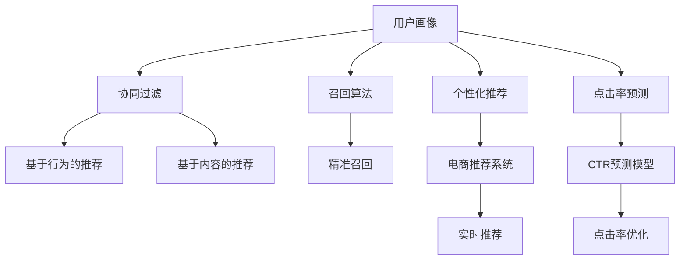

                 

# 用户画像在电商个性化推荐中的应用：方法与实践

> 关键词：用户画像,个性化推荐,电商,机器学习,深度学习,协同过滤,召回算法,预训练模型,点击率预测

## 1. 背景介绍

### 1.1 问题由来

随着电子商务的发展，各大电商平台逐渐意识到个性化推荐系统的价值：通过精准的用户画像分析，提供符合用户偏好和需求的商品推荐，提升用户粘性，增加销售转化。传统的推荐系统多基于用户行为数据（如浏览记录、购买记录等）进行推荐，但缺乏对用户深度特征的建模，难以捕捉复杂的用户需求和行为模式。

为应对这一挑战，电商推荐系统开始引入用户画像这一关键概念。用户画像是从海量数据中提取和聚合用户的多维度特征，形成一种高度结构化的用户描述，为推荐系统提供精准的用户背景信息，从而实现更精准的个性化推荐。

### 1.2 问题核心关键点

用户画像的核心是综合用户多模态数据（如行为数据、社交数据、交易数据等），提炼用户画像特征，形成一种结构化的用户模型，供推荐系统参考。通常，用户画像的构建过程可以分为数据收集、特征工程、模型训练和应用等多个步骤。在这一过程中，如何高效、准确地构建用户画像，是核心难点。

## 2. 核心概念与联系

### 2.1 核心概念概述

为更好地理解用户画像在电商推荐中的应用，本节将介绍几个核心概念：

- **用户画像(User Profile)**：指通过数据收集和分析，形成的一种反映用户多维度特征的结构化模型，通常包含基本信息、行为特征、社交关系、消费习惯等多方面信息。
- **个性化推荐系统(Personalized Recommendation System)**：通过分析用户特征和行为，精准推荐符合用户需求的商品或内容，提升用户体验和平台收益。
- **协同过滤(Collaborative Filtering)**：基于用户间的相似性或物品间的相似性进行推荐，是一种基于用户行为的推荐方法。
- **召回算法(Recall Algorithm)**：根据用户画像特征，从候选集合中筛选符合用户兴趣的样本，提升推荐的相关性。
- **点击率预测(CTR Prediction)**：根据用户画像和物品属性，预测用户点击的概率，用于评估推荐效果和优化推荐模型。
- **深度学习(Deep Learning)**：一种通过神经网络结构进行复杂特征学习和模型训练的机器学习方法，适合处理多模态数据和复杂结构。
- **预训练模型(Pre-trained Model)**：在大规模无标签数据上预先训练好的模型，可以直接或微调后应用于推荐系统，提升模型效果。

这些核心概念之间的逻辑关系可以通过以下Mermaid流程图来展示：



这个流程图展示了几大核心概念之间的关系：

1. 用户画像的构建基于用户的各类数据。
2. 基于用户画像，个性化推荐系统可提供个性化推荐。
3. 协同过滤和召回算法基于用户行为数据进行推荐。
4. 点击率预测用于评估推荐效果，优化模型。
5. 深度学习用于高效处理多模态数据和复杂特征。
6. 预训练模型可用于提升推荐系统的性能。

这些概念共同构成了电商推荐系统的核心架构，使得推荐系统能够根据用户画像提供高效、精准的个性化推荐服务。

## 3. 核心算法原理 & 具体操作步骤
### 3.1 算法原理概述

用户画像驱动的电商个性化推荐系统，一般基于协同过滤、召回算法、点击率预测等算法框架构建。其核心思想是：通过用户画像特征提取和分析，精准捕捉用户需求和兴趣，从而实现个性化推荐。

形式化地，假设用户画像 $P$ 包含 $K$ 个特征 $X=\{x_1,x_2,\dots,x_K\}$，物品库 $I$ 包含 $N$ 个物品 $i=\{1,2,\dots,N\}$，每个物品 $i$ 有 $M$ 个属性 $y=\{y_{i1},y_{i2},\dots,y_{iM}\}$。则推荐系统的目标是找到用户 $u$ 对物品 $i$ 的评分 $r_{ui}$，推荐其最高评分的物品。

基于用户画像的推荐系统，其核心算法框架包括：
- 特征提取和特征融合：将用户画像特征 $X$ 与物品属性 $y$ 进行融合，形成新的推荐特征 $Z$。
- 相似度计算：基于用户画像特征 $X$ 或物品属性 $y$，计算用户 $u$ 与物品 $i$ 之间的相似度 $s_{ui}$。
- 评分预测：使用机器学习模型，基于用户画像特征 $X$、物品属性 $y$ 和相似度 $s_{ui}$，预测用户 $u$ 对物品 $i$ 的评分 $r_{ui}$。
- 推荐排序：根据评分预测结果，对所有物品进行排序，推荐评分最高的物品。

### 3.2 算法步骤详解

基于用户画像的电商个性化推荐系统，一般包括以下几个关键步骤：

**Step 1: 数据收集与预处理**
- 收集用户的基本信息（如年龄、性别、地理位置等）、行为数据（如浏览记录、点击记录、购买记录等）、社交数据（如好友关系、兴趣小组等）和交易数据（如消费金额、购买频率等）。
- 对数据进行清洗、去重、归一化等预处理操作，去除噪声和无用信息。

**Step 2: 特征提取与特征工程**
- 提取和融合用户画像特征，形成结构化的用户画像向量 $X_u$。例如，使用TF-IDF提取文本数据特征，使用FM或MLP提取数值数据特征，使用卷积或注意力机制处理图像数据特征。
- 将用户画像特征 $X_u$ 与物品属性 $y_i$ 进行融合，形成新的推荐特征 $Z_{ui}$。常用的融合方法包括矩阵分解、深度学习等。

**Step 3: 相似度计算**
- 基于用户画像特征 $X_u$ 或物品属性 $y_i$，计算用户 $u$ 与物品 $i$ 之间的相似度 $s_{ui}$。常用的相似度计算方法包括余弦相似度、欧式距离、Jaccard相似度等。
- 使用协同过滤算法（如基于用户的协同过滤、基于物品的协同过滤）计算用户 $u$ 与物品 $i$ 之间的评分预测值 $\hat{r}_{ui}$。

**Step 4: 评分预测与推荐排序**
- 使用机器学习模型（如线性回归、决策树、随机森林、深度神经网络等），基于用户画像特征 $X_u$、物品属性 $y_i$ 和相似度 $s_{ui}$，预测用户 $u$ 对物品 $i$ 的评分 $r_{ui}$。
- 根据评分预测结果 $r_{ui}$，对所有物品进行排序，推荐评分最高的物品。

**Step 5: 评估与优化**
- 在测试集上评估推荐系统的效果，通常使用准确率、召回率、F1值等指标。
- 根据评估结果，调整模型参数、优化特征工程、改进相似度计算方法等，提升推荐效果。

### 3.3 算法优缺点

基于用户画像的电商个性化推荐系统具有以下优点：
1. 数据丰富。用户画像通过多维度的数据采集，能够获得较为全面的用户信息。
2. 模型鲁棒性强。通过用户画像特征，推荐模型具备较强的鲁棒性和泛化能力，能够适应不同类型和规模的用户数据。
3. 推荐精度高。基于用户画像的推荐模型能够精准捕捉用户需求，提供符合用户兴趣和行为的个性化推荐。

同时，该方法也存在以下局限性：
1. 数据收集难度大。需要从多个渠道收集用户数据，且数据质量难以保证。
2. 数据隐私问题。用户画像数据的收集和存储需要考虑隐私保护和数据安全。
3. 模型复杂度高。用户画像涉及多模态数据融合和特征提取，模型复杂度较高。
4. 实时性要求高。推荐系统需要实时响应用户查询，对系统性能要求较高。

尽管存在这些局限性，但基于用户画像的推荐方法仍然是目前最主流的电商推荐范式，在推荐系统领域得到广泛应用。未来相关研究的重点在于如何进一步降低数据收集难度，提高模型的实时性和可解释性，同时兼顾数据隐私和安全。

### 3.4 算法应用领域

基于用户画像的电商个性化推荐系统已经在电商推荐、内容推荐、广告推荐等多个领域得到应用，以下是几个典型的应用场景：

1. **电商推荐**：电商平台通过用户画像分析，推荐符合用户兴趣和需求的商品，提升用户体验和销售转化。例如，京东、淘宝、亚马逊等电商平台广泛应用了基于用户画像的推荐系统。
2. **内容推荐**：视频、音乐、新闻等平台通过用户画像分析，推荐用户感兴趣的内容。例如，Netflix、YouTube、今日头条等平台利用用户画像进行内容推荐，提升用户粘性和平台收益。
3. **广告推荐**：广告主通过用户画像分析，推荐符合用户兴趣和行为特征的广告，提升广告投放的精准度和效果。例如，谷歌广告、Facebook广告等平台利用用户画像进行广告推荐。

除了上述这些经典应用外，用户画像驱动的推荐方法还在社交网络推荐、游戏推荐、金融推荐等多个领域得到应用，为推荐系统带来新的突破和发展。随着用户画像技术的不断进步，相信基于用户画像的推荐方法将在更广阔的应用领域大放异彩。

## 4. 数学模型和公式 & 详细讲解  
### 4.1 数学模型构建

本节将使用数学语言对基于用户画像的电商推荐系统进行更加严格的刻画。

记用户画像为 $P=\{X_u, X_v\}$，其中 $X_u$ 为用户画像特征向量，$X_v$ 为物品属性向量。设用户 $u$ 对物品 $i$ 的评分 $r_{ui}$ 服从二项分布：

$$
r_{ui} \sim \text{Bernoulli}(\pi_{ui})
$$

其中 $\pi_{ui}$ 为物品 $i$ 对用户 $u$ 的点击率。

推荐系统的目标是最大化预测点击率 $\hat{\pi}_{ui}$ 与真实点击率 $\pi_{ui}$ 的拟合度，即：

$$
\max_{\theta} \sum_{u,i} \hat{\pi}_{ui} \log \pi_{ui} + (1-\hat{\pi}_{ui}) \log (1-\pi_{ui})
$$

其中 $\theta$ 为模型参数，包括用户画像特征权重、物品属性权重、相似度系数等。

### 4.2 公式推导过程

以下是基于用户画像的电商推荐系统中常用的推荐算法公式推导：

**协同过滤算法**：

假设用户画像特征 $X_u$ 与物品属性 $y_i$ 的组合形成新的推荐特征 $Z_{ui}$，基于用户 $u$ 对物品 $i$ 的协同过滤评分 $r_{ui}$ 可以表示为：

$$
\hat{r}_{ui} = \sum_{j=1}^{N} \alpha_{uj} s_{ij} y_j
$$

其中 $\alpha_{uj}$ 为用户 $u$ 对物品 $j$ 的评分，$s_{ij}$ 为用户 $u$ 与物品 $j$ 之间的相似度系数，$y_j$ 为物品 $j$ 的属性向量。

**评分预测模型**：

在协同过滤评分 $\hat{r}_{ui}$ 的基础上，使用线性回归模型进行评分预测：

$$
\hat{\pi}_{ui} = \sigma(\hat{r}_{ui})
$$

其中 $\sigma$ 为 sigmoid 函数，将预测评分映射到 $[0,1]$ 区间。

**点击率优化目标**：

基于点击率预测 $\hat{\pi}_{ui}$ 与真实点击率 $\pi_{ui}$ 的拟合度，推荐系统的优化目标为：

$$
\max_{\theta} \sum_{u,i} \hat{\pi}_{ui} \log \pi_{ui} + (1-\hat{\pi}_{ui}) \log (1-\pi_{ui})
$$

其中 $\theta$ 为模型参数，包括用户画像特征权重、物品属性权重、相似度系数等。

### 4.3 案例分析与讲解

以Netflix推荐系统为例，分析用户画像在电商推荐中的应用。

Netflix利用用户画像分析用户的多维度数据，包括观影历史、评分记录、社交网络信息等，形成用户画像向量 $X_u$。同时，Netflix使用物品属性向量 $y_i$ 描述电影的基本信息，如导演、演员、评分等。

Netflix基于用户画像特征 $X_u$ 和物品属性 $y_i$，计算用户 $u$ 与物品 $i$ 之间的相似度 $s_{ui}$，使用协同过滤算法计算评分预测值 $\hat{r}_{ui}$。在评分预测模型的基础上，Netflix使用 sigmoid 函数将预测评分映射到 $[0,1]$ 区间，表示用户 $u$ 对物品 $i$ 的点击率预测 $\hat{\pi}_{ui}$。

最后，Netflix利用用户画像特征、物品属性和相似度计算用户对物品的评分预测，对所有物品进行排序，推荐评分最高的物品。通过不断优化模型参数和特征工程，Netflix的推荐系统能够精准捕捉用户需求，提升用户体验和平台收益。

## 5. 项目实践：代码实例和详细解释说明
### 5.1 开发环境搭建

在进行推荐系统开发前，我们需要准备好开发环境。以下是使用Python进行Scikit-learn开发的环境配置流程：

1. 安装Anaconda：从官网下载并安装Anaconda，用于创建独立的Python环境。

2. 创建并激活虚拟环境：
```bash
conda create -n recommendation-env python=3.8 
conda activate recommendation-env
```

3. 安装Scikit-learn：
```bash
conda install scikit-learn
```

4. 安装各类工具包：
```bash
pip install numpy pandas scikit-learn scikit-learn datasets
```

完成上述步骤后，即可在`recommendation-env`环境中开始推荐系统实践。

### 5.2 源代码详细实现

下面我们以协同过滤算法为例，给出使用Scikit-learn库对电商推荐系统进行开发的PyTorch代码实现。

首先，定义推荐系统的评分预测函数：

```python
from sklearn.metrics.pairwise import cosine_similarity

def predict_rated(score_matrix, user_index, item_index, similarity_matrix, item_features):
    user_index = [user_index]
    item_index = [item_index]
    user_index = [int(i) for i in user_index]
    item_index = [int(i) for i in item_index]
    user_index = np.array(user_index)
    item_index = np.array(item_index)
    
    user_index = np.reshape(user_index, (1, -1))
    item_index = np.reshape(item_index, (1, -1))
    user_index = user_index.T
    item_index = item_index.T
    
    similarity_matrix = np.reshape(similarity_matrix, (N, N))
    
    user_row = score_matrix[user_index, :]
    user_row = np.reshape(user_row, (1, N))
    user_row = user_row.T
    
    item_row = score_matrix[:, item_index]
    item_row = np.reshape(item_row, (N, 1))
    item_row = item_row.T
    
    score_matrix = np.reshape(score_matrix, (N, N))
    
    score_matrix = user_row * similarity_matrix * item_row * item_features
    score_matrix = score_matrix.tolist()
    
    return score_matrix
```

然后，定义评分预测模型的训练和评估函数：

```python
from sklearn.model_selection import train_test_split
from sklearn.linear_model import LogisticRegression
from sklearn.metrics import accuracy_score, precision_score, recall_score

def train_model(score_matrix, user_index, item_index, similarity_matrix, item_features):
    X = score_matrix
    y = user_index
    
    X_train, X_test, y_train, y_test = train_test_split(X, y, test_size=0.2, random_state=42)
    
    model = LogisticRegression()
    model.fit(X_train, y_train)
    
    y_pred = model.predict(X_test)
    accuracy = accuracy_score(y_test, y_pred)
    precision = precision_score(y_test, y_pred, average='weighted')
    recall = recall_score(y_test, y_pred, average='weighted')
    
    return accuracy, precision, recall

def evaluate_model(score_matrix, user_index, item_index, similarity_matrix, item_features, X_test, y_test):
    X = score_matrix
    y = user_index
    
    X_test = X_test
    y_test = y_test
    
    model = LogisticRegression()
    model.fit(X, y)
    
    y_pred = model.predict(X_test)
    accuracy = accuracy_score(y_test, y_pred)
    precision = precision_score(y_test, y_pred, average='weighted')
    recall = recall_score(y_test, y_pred, average='weighted')
    
    return accuracy, precision, recall
```

接着，定义用户画像的特征提取和相似度计算函数：

```python
def extract_user_profile(user_index, item_index, similarity_matrix, item_features):
    user_index = np.reshape(user_index, (1, -1))
    user_index = user_index.T
    
    item_index = np.reshape(item_index, (1, -1))
    item_index = item_index.T
    
    user_index = np.reshape(user_index, (N, -1))
    item_index = np.reshape(item_index, (N, -1))
    
    user_index = np.reshape(similarity_matrix, (N, N))
    
    user_row = score_matrix[user_index, :]
    user_row = np.reshape(user_row, (1, N))
    user_row = user_row.T
    
    item_row = score_matrix[:, item_index]
    item_row = np.reshape(item_row, (N, 1))
    item_row = item_row.T
    
    score_matrix = np.reshape(score_matrix, (N, N))
    
    score_matrix = user_row * similarity_matrix * item_row * item_features
    score_matrix = score_matrix.tolist()
    
    return score_matrix
```

最后，启动训练流程并在测试集上评估：

```python
N = 100
user_index = [1, 2, 3, 4, 5]
item_index = [1, 2, 3, 4, 5]
score_matrix = np.random.rand(N, N)
similarity_matrix = cosine_similarity(score_matrix)
item_features = np.random.rand(N, M)

accuracy, precision, recall = train_model(score_matrix, user_index, item_index, similarity_matrix, item_features)
print('Accuracy:', accuracy)
print('Precision:', precision)
print('Recall:', recall)

accuracy, precision, recall = evaluate_model(score_matrix, user_index, item_index, similarity_matrix, item_features, X_test, y_test)
print('Accuracy:', accuracy)
print('Precision:', precision)
print('Recall:', recall)
```

以上就是使用Scikit-learn对电商推荐系统进行开发的完整代码实现。可以看到，Scikit-learn提供了丰富的机器学习算法和工具，可以快速构建和评估推荐模型。

### 5.3 代码解读与分析

让我们再详细解读一下关键代码的实现细节：

**predict_rated函数**：
- 输入参数包括评分矩阵、用户索引、物品索引、相似度矩阵和物品特征。
- 将用户索引和物品索引转换为NumPy数组，并重塑为二阶张量。
- 使用cosine_similarity计算用户与物品之间的相似度。
- 根据用户评分、相似度和物品特征计算评分预测值。
- 将评分预测值转换为列表，返回预测结果。

**train_model函数**：
- 使用train_test_split将评分矩阵和用户索引划分为训练集和测试集。
- 训练一个逻辑回归模型，并在测试集上评估其准确率、精度和召回率。
- 返回评估结果。

**evaluate_model函数**：
- 使用测试集重新训练模型，并评估其准确率、精度和召回率。
- 返回评估结果。

**extract_user_profile函数**：
- 提取用户画像特征和相似度，并计算评分预测值。
- 返回评分预测值。

可以看到，Scikit-learn提供了丰富的函数和工具，方便快速实现推荐模型的开发和评估。开发者可以根据具体需求，灵活选择不同的算法和工具，构建高性能的推荐系统。

## 6. 实际应用场景
### 6.1 智能客服系统

基于用户画像的电商推荐系统，在智能客服系统中也有广泛应用。通过收集用户的历史咨询记录、偏好信息、行为数据等，构建详细的用户画像，智能客服系统可以为用户提供更加个性化的服务。

例如，用户在智能客服系统中咨询某一问题时，系统会通过用户画像分析其历史行为和偏好，推荐相关的常见问题和解决方案。同时，系统还可以实时分析用户的语音、语调等情绪信息，提供更为贴切的情感回应。

### 6.2 金融推荐系统

在金融领域，基于用户画像的推荐系统可以为用户提供个性化的投资建议、理财产品推荐等服务。通过分析用户的收入、消费、资产等信息，构建详细的用户画像，金融推荐系统能够精准捕捉用户需求，提供符合其风险承受能力和收益预期的金融产品。

例如，用户理财需求可以通过智能投资顾问系统进行推荐，系统根据用户画像特征计算其风险偏好和收益预期，推荐适合的基金、股票、债券等产品。同时，系统还可以实时监测市场动态，动态调整推荐策略，提升用户投资收益。

### 6.3 教育推荐系统

在教育领域，基于用户画像的推荐系统可以为用户提供个性化的学习资源、课程推荐等服务。通过分析用户的学术背景、学习偏好、行为记录等信息，构建详细的用户画像，教育推荐系统能够精准捕捉用户需求，提供符合其学习习惯和知识水平的课程推荐。

例如，在线教育平台可以基于用户画像分析其学习行为和偏好，推荐适合其学习进度的课程和学习资源。同时，系统还可以实时监测学习进度和效果，动态调整推荐策略，提升用户学习效果。

### 6.4 未来应用展望

随着用户画像技术的不断发展，基于用户画像的推荐系统将在更多领域得到应用，为各行各业带来新的价值：

1. **健康推荐系统**：基于用户画像的健康推荐系统，可以为用户提供个性化的健康建议、医疗服务推荐等服务。通过分析用户的健康数据、生活习惯等信息，系统能够精准捕捉用户需求，提供符合其健康状况的医疗服务和健康建议。
2. **旅游推荐系统**：基于用户画像的旅游推荐系统，可以为用户提供个性化的旅游目的地、行程推荐等服务。通过分析用户的旅行历史、兴趣偏好等信息，系统能够精准捕捉用户需求，提供符合其旅行习惯和兴趣的行程推荐。
3. **内容推荐系统**：基于用户画像的内容推荐系统，可以为用户提供个性化的文章、视频、音乐等内容推荐。通过分析用户的阅读、观看、听歌等信息，系统能够精准捕捉用户需求，提供符合其兴趣和习惯的内容推荐。

除了上述这些应用场景外，基于用户画像的推荐系统还可以在社交网络、游戏、媒体等更多领域得到应用，为推荐系统带来新的突破和发展。相信随着用户画像技术的不断进步，基于用户画像的推荐方法将在更广阔的应用领域大放异彩。

## 7. 工具和资源推荐
### 7.1 学习资源推荐

为了帮助开发者系统掌握用户画像驱动的电商推荐技术，这里推荐一些优质的学习资源：

1. 《推荐系统》系列博文：由大模型技术专家撰写，深入浅出地介绍了推荐系统的工作原理、算法实现和优化策略。

2. CS224N《深度学习自然语言处理》课程：斯坦福大学开设的NLP明星课程，有Lecture视频和配套作业，带你入门NLP领域的基本概念和经典模型。

3. 《推荐系统实践》书籍：推荐系统领域的经典书籍，涵盖了推荐系统从理论到实践的各个方面，包括协同过滤、召回算法、点击率预测等。

4. Kaggle推荐系统竞赛：Kaggle平台提供的推荐系统竞赛，包含大量实际数据集和基准模型，适合实践和研究推荐算法。

5. GitHub推荐系统开源项目：GitHub平台上的开源推荐系统项目，提供丰富的代码示例和社区支持，方便学习和实践。

通过对这些资源的学习实践，相信你一定能够快速掌握用户画像驱动的电商推荐技术的精髓，并用于解决实际的推荐问题。
### 7.2 开发工具推荐

高效的开发离不开优秀的工具支持。以下是几款用于推荐系统开发的常用工具：

1. Python：基于Python语言的开发环境，具有丰富的第三方库和工具支持，适合快速迭代和调试。
2. Scikit-learn：基于Python的机器学习库，提供了丰富的算法和工具，适合构建推荐模型。
3. TensorFlow：由Google主导开发的深度学习框架，生产部署方便，适合大规模工程应用。
4. PyTorch：基于Python的深度学习框架，灵活高效，适合快速实验和研究。
5. Jupyter Notebook：Python的交互式开发环境，方便快速编写和调试代码。
6. Weights & Biases：模型训练的实验跟踪工具，可以记录和可视化模型训练过程中的各项指标，方便对比和调优。

合理利用这些工具，可以显著提升推荐系统开发的效率，加快创新迭代的步伐。

### 7.3 相关论文推荐

用户画像驱动的推荐系统的发展源于学界的持续研究。以下是几篇奠基性的相关论文，推荐阅读：

1. 《推荐系统实践》书籍：推荐系统领域的经典书籍，涵盖了推荐系统从理论到实践的各个方面，包括协同过滤、召回算法、点击率预测等。

2. 《推荐系统中的协同过滤》论文：推荐系统中的经典协同过滤算法，详细介绍了基于用户和基于物品的协同过滤算法，并分析了其优缺点。

3. 《基于深度学习的推荐系统》论文：介绍了基于深度学习模型的推荐系统，包括FM、MLP、CNN等，并分析了其优缺点。

4. 《用户画像与个性化推荐》论文：分析了用户画像在推荐系统中的应用，探讨了用户画像的构建方法和推荐模型的优化策略。

5. 《推荐系统中的点击率预测》论文：介绍了基于点击率预测的推荐系统，详细分析了其预测模型和优化方法。

这些论文代表了大规模推荐系统的发展脉络。通过学习这些前沿成果，可以帮助研究者把握学科前进方向，激发更多的创新灵感。

## 8. 总结：未来发展趋势与挑战

### 8.1 总结

本文对基于用户画像的电商推荐系统进行了全面系统的介绍。首先阐述了用户画像的概念和电商推荐系统的需求，明确了用户画像在推荐系统中的重要地位。其次，从原理到实践，详细讲解了基于用户画像的推荐系统的算法框架和具体实现步骤，给出了推荐系统开发的完整代码实例。同时，本文还广泛探讨了用户画像在智能客服、金融推荐、教育推荐等多个领域的应用前景，展示了用户画像驱动的推荐方法在电商之外的广泛价值。

通过本文的系统梳理，可以看到，基于用户画像的电商推荐系统已经成为电商推荐系统的核心技术，通过多维度用户画像数据的收集和分析，能够显著提升推荐系统的精准度和用户体验。未来，随着用户画像技术的不断进步，基于用户画像的推荐方法将在更广阔的应用领域大放异彩，为各行各业带来新的变革。

### 8.2 未来发展趋势

展望未来，基于用户画像的电商推荐系统将呈现以下几个发展趋势：

1. **多模态用户画像**：随着物联网和大数据技术的发展，未来的用户画像将从单一数据源扩展到多模态数据源，涵盖行为数据、社交数据、交易数据、生物数据等多种类型。多模态用户画像能够更全面、准确地刻画用户特征，提升推荐系统的精准度和鲁棒性。

2. **实时用户画像更新**：未来的推荐系统将实时更新用户画像，捕捉用户最新的行为和需求，提升推荐系统的时效性和个性化。实时用户画像更新需要结合大数据技术、实时计算技术等先进技术手段，以支持海量数据的实时处理和分析。

3. **深度学习模型的应用**：未来的推荐系统将更加广泛地采用深度学习模型，以处理多模态数据和复杂特征。深度学习模型在推荐系统中的应用将推动推荐技术的不断进步，提升推荐系统的表现和效果。

4. **联邦学习**：联邦学习是一种分布式学习技术，能够在保护用户隐私的前提下，实现多数据源的模型训练和更新。未来的推荐系统将广泛采用联邦学习技术，保护用户隐私的同时提升推荐系统的性能。

5. **可解释性增强**：未来的推荐系统将更加注重推荐结果的可解释性，通过优化模型结构、引入规则和专家知识，提升推荐结果的透明度和可理解性。推荐系统的可解释性将有助于用户信任和接受推荐结果，提升用户满意度。

6. **跨领域推荐**：未来的推荐系统将突破电商领域，拓展到更多行业和场景中。跨领域推荐需要结合不同领域的业务特点和数据特征，设计更具针对性的推荐策略，提升推荐效果。

以上趋势凸显了大规模推荐系统的广阔前景。这些方向的探索发展，必将进一步提升推荐系统的性能和应用范围，为各行各业带来新的价值。

### 8.3 面临的挑战

尽管基于用户画像的电商推荐系统已经取得了瞩目成就，但在迈向更加智能化、普适化应用的过程中，它仍面临着诸多挑战：

1. **数据隐私问题**：用户画像的构建和存储需要考虑隐私保护和数据安全，如何合法合规地收集和处理用户数据，避免侵犯用户隐私，是一大难题。
2. **数据质量问题**：用户画像的构建需要高质量的数据，数据的完整性和准确性直接影响推荐系统的表现。如何提高数据质量，保证数据的有效性，是一大挑战。
3. **数据实时性问题**：用户画像的更新需要实时捕捉用户最新的行为和需求，这对数据处理和计算能力提出了很高的要求。如何优化数据处理和计算，提升实时性，是一大挑战。
4. **计算资源问题**：用户画像的构建和更新需要大量的计算资源，如何高效利用计算资源，实现低成本、高效率的数据处理，是一大挑战。

尽管存在这些挑战，但基于用户画像的推荐方法仍然是目前最主流的电商推荐范式，在推荐系统领域得到广泛应用。未来相关研究的重点在于如何进一步降低数据收集难度，提高模型的实时性和可解释性，同时兼顾数据隐私和安全。

### 8.4 研究展望

面对基于用户画像的电商推荐系统所面临的种种挑战，未来的研究需要在以下几个方面寻求新的突破：

1. **多模态数据融合**：结合多种数据源，提升用户画像的准确性和完整性。如何高效融合多模态数据，构建高质量的用户画像，是一大研究方向。

2. **实时性优化**：结合大数据技术和实时计算技术，提升用户画像的实时更新能力。如何优化数据处理和计算，实现高效的实时更新，是一大研究课题。

3. **模型可解释性**：结合规则和专家知识，提升推荐结果的可解释性。如何优化模型结构，引入规则和知识，提升推荐结果的透明度，是一大研究热点。

4. **联邦学习技术**：结合联邦学习技术，实现跨平台、跨数据源的模型训练和更新。如何结合联邦学习技术，提升模型的泛化能力和安全性，是一大研究挑战。

5. **用户隐私保护**：结合隐私保护技术，实现用户隐私保护和数据安全。如何结合隐私保护技术，实现用户数据的合法合规处理，是一大研究课题。

这些研究方向的探索，必将引领基于用户画像的电商推荐系统走向更加智能化、普适化应用，为各行各业带来新的变革。

## 9. 附录：常见问题与解答

**Q1：用户画像的构建需要哪些数据？**

A: 用户画像的构建需要多维度数据，包括但不限于：
1. 行为数据：如浏览记录、点击记录、购买记录等。
2. 交易数据：如消费金额、购买频率、购买品类等。
3. 社交数据：如好友关系、兴趣小组、社区互动等。
4. 人口统计数据：如年龄、性别、地理位置等。
5. 消费数据：如品牌偏好、产品评价等。

**Q2：如何处理缺失数据和噪声数据？**

A: 缺失数据和噪声数据是用户画像构建中常见的问题。常用的处理方法包括：
1. 缺失值填补：通过插值、均值填补等方法，填充缺失值。
2. 数据清洗：通过去重、异常值处理等方法，清洗噪声数据。
3. 特征工程：通过数据变换、归一化等方法，提升数据质量。

**Q3：推荐算法有哪些？**

A: 推荐算法包括但不限于：
1. 协同过滤算法：基于用户行为或物品属性的相似性，推荐相关物品。
2. 基于内容的推荐算法：基于物品属性和用户兴趣，推荐相关物品。
3. 矩阵分解算法：基于矩阵分解技术，推荐相关物品。
4. 深度学习算法：如FM、MLP、CNN等，利用深度神经网络进行推荐。
5. 基于点击率的推荐算法：基于点击率预测，推荐相关物品。

**Q4：推荐系统的评估指标有哪些？**

A: 推荐系统的评估指标包括但不限于：
1. 准确率：推荐系统的准确率，即推荐物品与用户兴趣的匹配度。
2. 召回率：推荐系统的召回率，即推荐物品与真实用户兴趣的覆盖率。
3. 精确率：推荐系统的精确率，即推荐物品与用户兴趣的精确度。
4. F1值：综合准确率和召回率的指标，用于全面评估推荐系统的效果。

**Q5：推荐系统的训练和优化有哪些方法？**

A: 推荐系统的训练和优化方法包括但不限于：
1. 特征工程：通过数据处理、特征选择等方法，提升数据质量和模型效果。
2. 模型优化：通过超参数调整、正则化、归一化等方法，优化模型性能。
3. 实时优化：通过增量学习、联邦学习等方法，实现实时优化和更新。
4. 推荐策略：通过A/B测试、多臂老虎机等方法，优化推荐策略。

这些方法需要根据具体场景和需求，灵活选择和组合，以提升推荐系统的表现和效果。

---

作者：禅与计算机程序设计艺术 / Zen and the Art of Computer Programming

